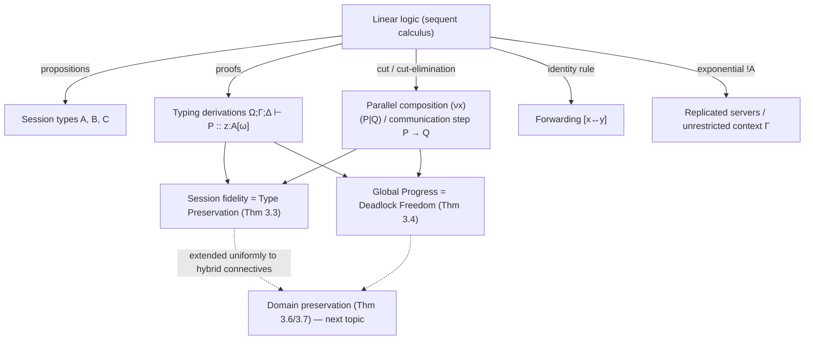

# Session Types via the Curry–Howard Correspondence

[[book-guidelines|↩ Back to guidelines]]

## Why a type theorist should care about channels

Take a step back from processes and messages for a moment and ask a narrower question: what *is* a session type, formally? The pattern in this literature (going back to Caires–Pfenning and Wadler, and generalized in the paper this note is drawn from) is to answer it by refusing to invent a bespoke type theory for concurrency at all. Instead, it reuses one that already exists — linear logic — and reads every syntactic and semantic feature of that logic as a fact about communicating processes. This is a genuine Curry–Howard correspondence, in the same lineage as "proofs are programs, propositions are types" for the $\lambda$-calculus, except the "programs" on the other side are $\pi$-calculus processes and the notion of *execution* is message-passing rather than $\beta$-reduction.

Why does this matter enough to build a whole type theory around it? Because if you can show that concurrent processes are literally proofs of linear-logic propositions, you get two extremely strong properties for free, as consequences of the underlying logic's own metatheory rather than as bespoke process-calculus lemmas bolted on afterward:

- **Session fidelity** — a well-typed process only ever evolves into another well-typed process. This is exactly type preservation (progress-and-preservation's "preservation" half) transplanted from sequential type theory into a concurrent setting.
- **Global progress** — a well-typed, "live" process is never stuck. This is exactly the "progress" half of progress-and-preservation, and in the concurrency setting "not stuck" specifically means *deadlock-free*.

If you've internalized progress-and-preservation for a sequential type checker, you already have the right mental hooks for this material — the novelty is entirely in *what plays the role of proof reduction*, not in the shape of the safety theorems.

## What breaks without the correspondence: session types as pure discipline vs. session types as logic

Before Caires–Pfenning's original interpretation, session types already existed as an independently useful discipline: you annotate each end of a communication channel with a protocol (a session type), and a type checker rejects programs that violate it — sending a string where an int was expected, or trying to receive on a channel that's already closed. That gets you *some* safety, but it's checked the way an ad-hoc type system is checked: rules invented to match intuition, soundness proved by hand for this particular calculus, with no guarantee that the rule set is complete, minimal, or free of gaps.

What breaks, concretely, without a logical foundation: every time you want to extend the type language (add a new connective, a new communication primitive), you have to re-derive type preservation and progress from scratch for the enlarged system, because there's no organizing principle telling you which typing rules are even the "right" ones to write down. The Curry–Howard route inverts this. You don't invent typing rules for a $\otimes$ connective in session types — you already know the *introduction and elimination rules* for $\otimes$ in linear logic (they're textbook sequent calculus), and you *read off* the corresponding process syntax and reduction behavior mechanically. The type safety theorems then follow from the fact that (cut)-elimination — a purely logical property of the sequent calculus, proved once, generically — corresponds exactly to process reduction. This is the payoff the paper's Introduction states directly: "propositions are interpreted as session types of communication channels, proofs as typing derivations, and proof reduction as process communication" (p. 4). Every later connective the paper adds (in particular the hybrid-logic ones for domains) inherits type preservation and progress automatically, because the framework never leaves the discipline of "this is still just linear logic, plus one well-behaved extension."

## The four-way correspondence, precisely

The paper's technical apparatus (Def. 3.1, p. 4) sets up the following dictionary. This table is the single most important thing to internalize before reading any of the typing rules:

| Linear logic | Session-typed process calculus |
|---|---|
| Proposition $A$ | Session type — the protocol on a channel |
| Proof of $A$ | A process $P$ typed as offering $A$ |
| Sequent $\Delta \vdash P :: z{:}A$ | $P$ uses the linear resources in $\Delta$ to offer behavior $A$ on channel $z$ |
| Cut rule / cut-elimination | Parallel composition of two processes sharing a channel / communication step |
| Identity rule (axiom) | Forwarding — a process that just relays one channel to another |
| Linear vs. unrestricted contexts | Linear session channels ($\Delta$) vs. shared/replicable channels ($\Gamma$) |

Two things distinguish this from a "typed $\lambda$-calculus" Curry–Howard story and are worth being precise about, because they're exactly where the analogy could mislead a reader coming from functional-language type theory:

1. **The logic is linear**, not intuitionistic or classical propositional logic. Structural rules of weakening and contraction are *disallowed* on the linear context $\Delta$. This isn't a technical nicety — it's the entire reason the correspondence produces something useful for concurrency. A linear hypothesis $x{:}A$ must be *used exactly once*. Read operationally, that's exactly the discipline a session channel needs: a channel offering one session behavior shouldn't be read twice, or dropped silently, because a session, unlike a value, has *temporal* structure — you can't duplicate a live conversation. The paper does keep a *second*, unrestricted context $\Gamma$ (with the classical structural rules) for genuinely shareable, replicable services — that's the type-theoretic residue of "servers can be called any number of times," typed by the exponential $!A$.
2. **The sequent is oriented and located.** Where a $\lambda$-calculus typing judgment is $\Gamma \vdash e : A$, the session-typed judgment is $\Omega;\Gamma;\Delta \vdash P :: z{:}A[\omega]$ — note the extra $z{:}A[\omega]$ *after* the turnstile rather than a bare type. This says: process $P$ *offers* (realizes, provides) the behavior $A$ on the specific channel $z$, located at domain $\omega$ (domains are this paper's addition on top of the original binary theory — see below). A term of type $A$ in the $\lambda$-calculus doesn't "offer" anything to anyone; a session, by contrast, is inherently dialogical — every session type has a provider side and a client side, and the sequent notation makes that asymmetry explicit rather than implicit in variance annotations.

### Worked correspondence: $\multimap$ as an RPC call

Take the linear implication $A \multimap B$ — "consume an $A$, produce a $B$," linear logic's version of a function type. Read as a session type, $A \multimap B$ says: *the channel first receives a session offering $A$, then behaves as $B$.* The right-introduction rule for $\multimap$ (offering it) and the corresponding process syntax are, quoting Fig. 1 (p. 5):

$$
\frac{\Omega;\Gamma;\Delta, y{:}A[\omega] \vdash P :: z{:}B[\omega]}{\Omega;\Gamma;\Delta \vdash z(y).P :: z{:}A \multimap B[\omega]} \;(\multimap R)
$$

Read bottom-up (as a typing rule) this says: to type-check the process $z(y).P$ against $A \multimap B$, extend the context with a fresh linear hypothesis $y{:}A$ and check $P$ against $B$. Read top-down (as a proof rule) this is *exactly* implication-introduction from natural deduction, specialized to linear contexts. There is no separate "operational semantics" invented for the process construct $z(y).P$ — the process syntax is generated directly by the shape of the logical rule; receiving a channel *is* what discharging a linear hypothesis looks like operationally. This is the crux of why the correspondence is load-bearing rather than decorative: the type system and the process syntax are not two things kept in sync by hand — they're the same object read in two directions.

If you've built a type checker in Rust before, the closest analogy is a bidirectional typing judgment where "checking" and "elaboration to a target term" are literally the same recursive function, just interpreted for two different purposes — here, "is this a valid proof" and "what process realizes this proof" collapse into one derivation.

## Proof reduction as process communication

This is the part of the correspondence that gives you the safety theorems, so it deserves the most care. In sequent calculus, a **cut** is the rule that composes two proofs: one proof establishes $A$ (as a lemma), and a second proof uses $A$ as a hypothesis to establish some conclusion $C$. **Cut-elimination** is the (nontrivial, but classically provable) meta-theorem that every cut can be pushed down through the [[Medium-Processes#Proof structure|proof structure]] and eventually removed, leaving a cut-free proof of the same conclusion. Structurally, eliminating a cut on a *connective* — e.g. a cut where the left proof ends in a $\multimap$-introduction and the right proof immediately eliminates that same $\multimap$ — produces a smaller proof, with the connective *consumed*.

The paper's (cut) rule, which types parallel composition with name restriction, is:

$$
\frac{\Omega \vdash \omega_1 \prec^* \omega_2 \quad \Omega \vdash \omega_1 \prec^* \Delta_1 \quad \Omega;\Gamma;\Delta_1 \vdash P :: x{:}A[\omega_2] \quad \Omega;\Gamma;\Delta_2, x{:}A[\omega_2] \vdash Q :: z{:}C[\omega_1]}{\Omega;\Gamma;\Delta_1,\Delta_2 \vdash (\nu x)(P \mid Q) :: z{:}C[\omega_1]} \;(\text{cut})
$$

Read this operationally: $P$ offers a session $A$ on private channel $x$; $Q$ uses that session (as a linear hypothesis) to offer $C$ on $z$; putting them in parallel and restricting $x$ (the $\nu x$) is exactly composing the two proofs via cut. Now: what does eliminating *this* cut correspond to? Precisely a communication step. Take the connective-level reduction rule from Section 2 (p. 4):

$$
\bar{x}\langle y\rangle.Q \mid x(z).P \;\longrightarrow\; Q \mid P\{y/z\}
$$

This is not an independently-invented operational semantics rule for the $\pi$-calculus — it *is* the cut-elimination step for the $\multimap/\otimes$ pair of connectives, transcribed into process notation. The proof that "well-typed processes reduce to well-typed processes" (Theorem 3.3, Type Preservation, p. 8) is, structurally, the proof that cut-elimination preserves the conclusion's type — a purely logical fact, ported over almost verbatim ("the proof mirrors those of [9,10,8,46], relying on a series of lemmas relating the result of dual process actions... with typable parallel compositions through the (cut) rule," p. 8). You get session fidelity as a *consequence*, not as a separately-proved property specific to this one process calculus.

**What breaks without this correspondence:** if you instead defined process reduction by intuition (as most process calculi historically did, and as the paper's own untyped Section 2 reduction relation does before typing is imposed) and then tried to prove type preservation by brute-force induction on the reduction rules, you'd need a fresh, calculus-specific proof for every new communication primitive you add — and there's no guarantee in advance that the reduction rules you wrote down are even the "correct" ones (i.e., that they correspond to *some* coherent notion of computation). By deriving reduction from cut-elimination, the paper gets a principled criterion for "is this the right reduction rule": it's right iff it's the logically forced consequence of eliminating a cut on that connective. Notice also, from the excerpt above, that Section 2's *untyped* reduction relation deliberately allows synchronization "independently of the domains of their subjects" (p. 4) — the raw process calculus is more permissive than the logic; it's the *type system*, not the reduction rules, that restores the discipline (this becomes central once domains enter the picture in Section 3).

## Linear logic connectives as session constructors

Def. 3.1 (p. 4) gives the full type grammar for this paper's (domain-extended) session types:

$$
A ::= 1 \mid A \multimap B \mid A \otimes B \mid \&\{l_i{:}A_i\}_{i\in I} \mid \oplus\{l_i{:}A_i\}_{i\in I} \mid {!}A \mid @_\omega A \mid \forall\alpha.A \mid \exists\alpha.A \mid \downarrow\alpha.A
$$

The first six constructors are the base (non-hybrid) session types, i.e. exactly Caires–Pfenning's original correspondence; the last four ($@_\omega A$, $\forall\alpha.A$, $\exists\alpha.A$, $\downarrow\alpha.A$) are this paper's hybrid-logic additions for domain-awareness (covered by the next Topic List entry — flagged here only to show where the base correspondence stops and the paper's novel contribution begins). Reading the base six as session behaviors:

- $1$ — the terminated session; a channel of this type carries no further interaction (it can still be passed around as an opaque, already-used value).
- $A \multimap B$ — receive a session of type $A$, then continue as $B$. (Worked above.)
- $A \otimes B$ — *send* a fresh channel offering $A$, then continue as $B$. This is $\multimap$'s De Morgan dual, and dually, its process form outputs a name rather than receiving one.
- $\&\{l_i{:}A_i\}_{i\in I}$ — external choice: the channel *offers* a menu of labeled continuations and waits for the partner to pick one (a labeled generalization of the additive conjunction $A\&B$).
- $\oplus\{l_i{:}A_i\}_{i\in I}$ — internal choice: the channel *selects* one labeled continuation and commits to it (generalized additive disjunction).
- ${!}A$ — a replicated, shareable service: spawn arbitrarily many (including zero) independent sessions each conforming to $A$. This is the exponential of linear logic, and it's exactly the connective that licenses moving a hypothesis from the linear context $\Delta$ into the unrestricted context $\Gamma$ (rule `(copy)`, Fig. 1) — the type-theoretic marker for "this resource may be duplicated."

Each of these has a right rule (how to *offer*/prove the connective — determines process output syntax) and a left rule (how to *use*/eliminate it — determines process input syntax), exactly mirroring introduction/elimination pairs in natural deduction, transcribed to sequent-calculus left/right style because sessions are inherently two-sided (provider and client).

### What breaks without linear discipline specifically

Suppose you dropped linearity and let $\Delta$ obey ordinary structural rules (weakening and contraction), i.e. typed sessions the way you'd type ordinary immutable values. Then a hypothesis $x{:}A$ could be used zero times or many times. Operationally that's catastrophic for session correctness: "use zero times" would let a client's typed obligation to eventually receive a reply go unfulfilled (deadlock or protocol violation is now type-*permitted*), and "use many times" would let a single linear session channel be read twice — but a channel offering, say, $\oplus\{ok:\ldots, nok:\ldots\}$ can only actually emit *one* of those labels at runtime; a second read has nothing to synchronize with. Linearity is precisely the type-theoretic device that forces "exactly the protocol, exactly once" — it's not a stylistic restriction, it's the mechanism that makes the correspondence's safety theorems even *statable* in a way that matches session semantics.

## Session fidelity as type preservation, restated formally

The paper states this as Theorem 3.3 (p. 8):

> If $\Omega;\Gamma;\Delta \vdash P :: z{:}A[\omega]$ and $P \to Q$ then $\Omega;\Gamma;\Delta \vdash Q :: z{:}A[\omega]$.

Notice the type, context, and even the *offered channel and domain* are all preserved exactly across a reduction step — nothing about the process's typing "loosens" as it runs. This is a much stronger preservation statement than what you may be used to from, say, a simply-typed $\lambda$-calculus preservation theorem (where only the *type* of the term is preserved, not some notion of "linear resource accounting"), because here $\Delta$ itself (the entire linear resource context) must come out unchanged, session fidelity meaning quite literally: *the protocol document (type) that was agreed upon at the start of the session remains a correct description of the channel's remaining behavior at every later point.*

If you've implemented a Rust-style typestate pattern — where a resource's *type itself* encodes which operations are legal next (a `File<Open>` vs `File<Closed>`, transitions consuming `self` and returning the next-state type) — session types are the formal ancestor of that pattern, generalized to bidirectional (provider/client), branching, and now (in this paper) domain-scoped protocols. The typestate discipline you'd hand-roll with phantom types in Rust is, at the level of one connective at a time, exactly what $A \multimap B$'s introduction/elimination rules are doing formally: each communication step consumes the current session type and produces the residual one.

## Global progress as deadlock freedom

The second safety theorem (Theorem 3.4, p. 8):

> If $\Omega;\cdot;\cdot \vdash P :: x{:}1[\omega]$ and $\mathrm{live}(P)$ then $\exists Q$ s.t. $P \to Q$.

Unpacking the moving parts, since this is the theorem where the definitions matter as much as the statement:

- $\mathrm{live}(P)$ (p. 8) is defined precisely: $P$ is live iff $P \equiv (\nu\tilde n)(\pi.Q \mid R)$ for some non-replicated process $\pi.Q$ guarded by a prefix $\pi$ — i.e., somewhere inside $P$ (up to [[The-Domain-Aware-Session-Pi-Calculus#Structural congruence|structural congruence]] and name restriction) there's a genuinely pending action waiting to fire, not just inert replicated servers sitting idle.
- The theorem says: if a process is well-typed with *empty* linear and unrestricted contexts (a *closed* system — nothing left outside to interact with) and it's live, it is *guaranteed* to be able to take a reduction step. It cannot be stuck.

Why is "empty contexts" the right precondition, rather than an arbitrary open one? Because progress is inherently a *global* property here — a proof with free hypotheses ($\Delta$ nonempty) genuinely *should* be "stuck" from an internal point of view, since it's waiting on an external partner that hasn't been supplied yet; that's not a deadlock, that's an open system correctly waiting for its environment. The paper notes this is without loss of generality, since "using the cut rules we can compose arbitrary well-typed processes together" (p. 9) — i.e. you can always close an open system by cutting in whatever partner processes are needed, and progress for the composite tells you the components can't deadlock against each other. This is precisely the "global" in global progress: it's a statement about a fully assembled system of communicating processes, not a per-process local guarantee.

The proof technique matters for the same reason the type-preservation proof did: progress for the sequent calculus is a structural fact — every closed, cut-free (or, here, "live") derivation has *some* rule applicable at the root, because the connective structure of the type forces a matching pair of right/left rules to be present somewhere in a well-typed composite. The paper explicitly attributes both this and the *third* safety property — **termination** (Theorem 3.5, "no infinite reduction path," proved via linear logical relations adapted from prior polymorphic/linear session-type work, p. 9) — to the same underlying logical machinery, extended uniformly to the paper's new hybrid connectives.

### What breaks without deriving progress this way

Deadlock-freedom is usually the hardest correctness property to establish for a hand-built concurrent calculus, because "no reachable stuck state" is a global, existential claim over an unbounded state space — exactly the kind of property that's easy to state and hard to verify by direct induction on an arbitrary process calculus. Model checkers and ad hoc deadlock-detection analyses exist precisely because most concurrent systems don't come with a compositional, syntax-directed proof of progress. The logical route sidesteps all of that: progress becomes a corollary of *typability*, checked *statically*, at compile time, one typing rule at a time — no state-space exploration required. This is the single biggest practical payoff of the Curry–Howard framing over an ad hoc process calculus with a separately bolted-on progress proof.

## Where the base correspondence gets extended (a preview)

Everything above is (up to notation) the Caires–Pfenning binary session-type correspondence this paper builds on. The paper's actual contribution — hybrid logic's modal worlds reinterpreted as *domains*, with a Kripke-style accessibility judgment $\Omega \vdash \omega_1 \prec \omega_2$ threaded through every rule — sits on top of exactly this scaffolding (covered in depth by the next Topic List entry, "Hybrid Linear Logic and Domain-Aware Types"). One motivating data point worth carrying forward from Section 3's own worked example (p. 7): with the domain-refined type

$$
\mathrm{WStore}_{sec} \triangleq \mathit{addCart} \multimap \&\{buy : @_{sec}\,\mathit{Pay}_{bnk},\; quit : 1\}
$$

the judgment $c \prec ws;\, \cdot;\, x{:}@_{sec}\mathit{Pay}_{bnk}[ws] \vdash \mathit{Client} :: z{:}@_{sec}1[c]$ is derivable, but no judgment of the shape $c \prec ws;\, \cdot;\, \mathit{Pay}_{bnk}[sec] \vdash \mathit{Client}' :: z{:}T[c]$ is — i.e., the type system statically *refuses* to typecheck any client that tries to access the payment behavior without first migrating into the secure domain. That's a security property (no premature access to a trusted domain) obtained purely as a *derivability* fact in the same style as session fidelity and progress above — the paper's whole thesis is that domain-awareness slots into the Curry–Howard machinery as one more hybrid-logic connective, inheriting type preservation, progress, and (new to this paper) *domain preservation* for free, rather than requiring a separate enforcement mechanism layered on top of the type system.

## Structural overview

## Where this leads

The rest of Section 3 (the material just previewed above) builds the hybrid-logic layer — $@_\omega A$, $\forall\alpha.A/\exists\alpha.A$, and $\downarrow\alpha.A$ — directly on top of this correspondence, and every later result in the paper (domain preservation, the multiparty global-type semantics via [[Medium-Processes|medium processes]] in Section 4, even the $\lambda 5$-generalization in Appendix C) depends on the reader trusting that "propositions as session types, proofs as typing derivations, proof reduction as communication" is not a metaphor but a literal, checkable correspondence — because everything downstream is obtained by extending the *logic* (adding hybrid connectives) and then re-deriving preservation/progress/termination as corollaries of the extended logic's own metatheory, exactly as done here for the base system.

For the standing project (`type-theory`, `automated-reasoning`): this is a clean, concrete instance of the thread this workbench keeps surfacing — **typing rules as the shared ancestor of a type checker and a proof checker.** The judgment $\Omega;\Gamma;\Delta \vdash P :: z{:}A[\omega]$ is simultaneously "process $P$ type-checks against session type $A$" and "this sequent has a proof" — there is no daylight between the two readings, which is exactly the design point a bidirectional elaborator/kernel pair (à la Lean) exploits: type-checking a term *is* proof-checking its underlying derivation, and the trusted kernel only needs to re-run the same rule set the elaborator used to construct the term in the first place. The (cut) rule is also a direct, load-bearing instance of *proof-term composition* — structurally the same move a kernel makes when it substitutes a checked subproof into a larger derivation — and the paper's insistence on tracking the linear/unrestricted split ($\Delta$ vs. $\Gamma$) through every rule is the same context-management discipline (resource-sensitive contexts, structural properties tied to specific zones) that shows up wherever a system needs to reason about substitution and variable capture without silently permitting resources to be duplicated or dropped. None of this paper's process-calculus-specific machinery (labeled transition systems, forwarding-as-copycat, multiparty mediums) is itself part of the compiler/elaborator project, but the *logical engineering pattern* — safety theorems as corollaries of a metatheorem about the underlying logic, rather than bespoke per-calculus proofs — is a template worth keeping in mind when designing the refinement-type kernel's own soundness argument.
