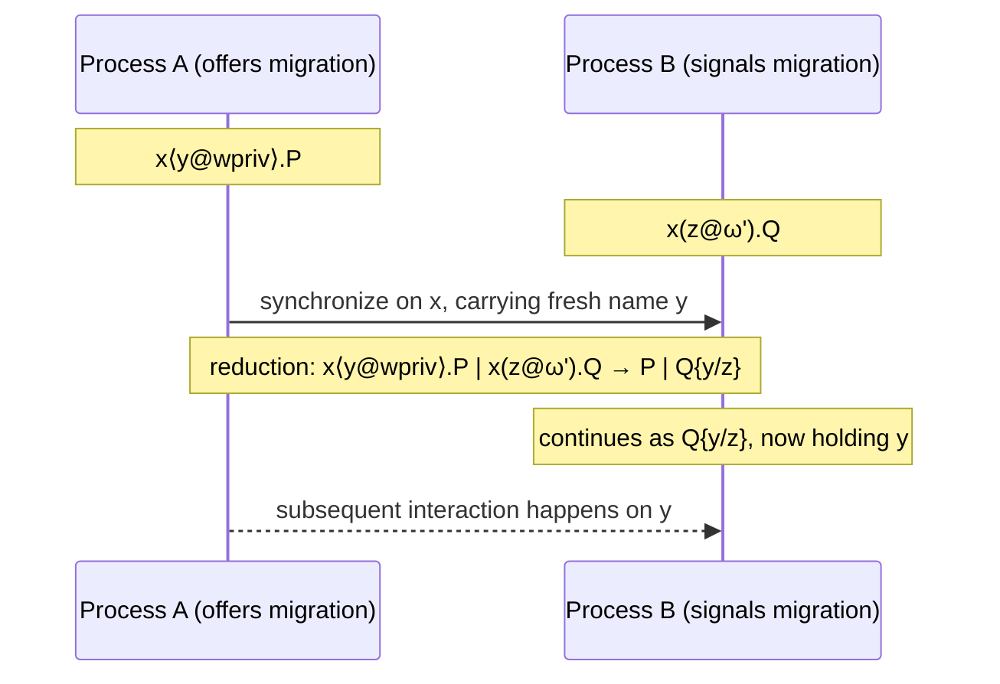

# The Domain-Aware Session π-Calculus

[[book-guidelines|↩ Back to guidelines]]

## Why a process calculus needs a notion of "domain" at all

Before this paper introduces a single typing rule, it has to answer a more basic question: what *is* a process, syntactically, in a world where communication isn't just "channel carries value" but "channel carries value, and that value might live somewhere else"?

Standard session-typed π-calculus (Caires–Pfenning) already gives you a clean picture: processes exchange names over channels, and a type system (built via Curry–Howard from linear logic) guarantees that a well-typed process never gets stuck (progress) and that reduction preserves well-typedness (session fidelity). That's a strong, well-understood story. But it has a blind spot: it has no way to say *where* a session lives, or that moving a session from one place to another is itself an event that ought to be visible and controllable.

Concretely: imagine a middleware process that talks to a payment server. In plain session types, "the middleware talks to the payment server" and "the middleware talks to the payment server *after first entering the server's secure domain*" are typed identically — the type only sees the sequence of messages, never the administrative/security context those messages happen in. If your correctness property is "payment details are only ever exchanged inside a secure enclave," the type system as classically formulated is silent on it. It can't even *state* the requirement, let alone check it.

The paper's answer is to extend the process calculus (this article) and the type system (later sections) with **domains** — abstract locations, principals, or security levels attached to sessions — governed by an accessibility relation that says which domains can interact with which. This article is about the untyped machinery: what a process looks like when domain-migration and domain-communication are first-class syntax, and how such processes reduce. Getting this right *before* typing matters for the same reason it matters in a compiler: you want an operational semantics that is meaningful on its own (so you can reason about "what can this process do") independent of whether it happens to type-check. The type system (Section 3) is a filter applied on top — a well-formedness discipline — not a redefinition of what execution means.

**What breaks without this separation:** if domain discipline were baked directly into the reduction relation (e.g., communication *requires* matching domains to fire), you'd conflate "the process is stuck because no partner is ready" with "the process is stuck because it violated a domain policy." The paper deliberately keeps these separate — reduction at the process-calculus level is domain-*oblivious*, and only the type system re-imposes domain discipline as a static invariant. This mirrors a very familiar compiler-engineering move: an untyped IR with a permissive small-step semantics, plus a separate type checker that rejects programs whose *executions* would otherwise be fine at the IR level but violate an intended discipline (e.g., an untyped calculus that happily "adds" a function to an integer at runtime; typing is what rules that out ahead of time, not the reduction rules themselves).

## Def. 2.1 — the process grammar

Here is the calculus verbatim (adapted to Markdown), building on infinite disjoint sets: names $\Lambda$ ($x, y, z, u, v$), labels $\mathcal{L}$ ($l_1, l_2, \dots$), domain tags $\mathcal{W}$ ($w, w', w''$), and domain variables $\mathcal{V}$ ($\alpha, \beta, \gamma$). The paper writes $\omega, \omega', \omega''$ for a *domain* generically — either a concrete tag $w$ or a domain variable $\alpha$, the same way a type-theory paper writes a metavariable that ranges over both concrete and symbolic instances.

$$
\begin{aligned}
P ::= \; & 0 \;\mid\; P \mid Q \;\mid\; (\nu y)P \;\mid\; x\langle y\rangle.P \;\mid\; x(y).P \;\mid\; {!}x(y).P \\
\mid \; & [x \leftrightarrow y] \;\mid\; x \triangleright \{l_i : P_i\}_{i \in I} \;\mid\; x \triangleleft l_i; P \\
\mid \; & x\langle y@\omega\rangle.P \;\mid\; x(y@\omega).P \;\mid\; x\langle \omega\rangle.P \;\mid\; x(\alpha).P
\end{aligned}
$$

Everything on the first two lines is ordinary session π-calculus. The third line — domain migration and domain communication — is the paper's addition, and it's worth reading each construct as answering one specific question a domain-aware system needs to be able to express.

Think of this the way you'd think about designing an IR `enum` in a Rust interpreter: each variant is a case your `step` function must handle, and the third line is exactly the set of variants a domain-agnostic π-calculus interpreter *wouldn't* have.

```rust
// Not from the paper — an illustrative Rust sketch of Def 2.1 as an AST.
// `Name`, `Label`, `Domain` are interned identifiers.
enum Process {
    Inaction,                                    // 0
    Par(Box<Process>, Box<Process>),             // P | Q
    Restrict(Name, Box<Process>),                // (νy)P
    Send(Name, Name, Box<Process>),              // x⟨y⟩.P
    Recv(Name, Name, Box<Process>),              // x(y).P
    Replicated(Name, Name, Box<Process>),        // !x(y).P
    Forward(Name, Name),                         // [x↔y]
    Offer(Name, Vec<(Label, Process)>),          // x ▷ {l_i: P_i}
    Select(Name, Label, Box<Process>),           // x ◁ l; P
    // --- domain-aware additions (the third line of Def. 2.1) ---
    MigrateOffer(Name, Name, Domain, Box<Process>),  // x⟨y@ω⟩.P
    MigrateSignal(Name, Name, Domain, Box<Process>), // x(y@ω).P
    DomainSend(Name, Domain, Box<Process>),          // x⟨ω⟩.P
    DomainRecv(Name, Name, Box<Process>),            // x(α).P  (α is a domain var)
}
```

### The "ordinary" constructs, briefly

You already know these from any session π-calculus, so this is a naming pass, not new material:

- $0$ — inaction, the terminated process.
- $P \mid Q$ — parallel composition.
- $(\nu y)P$ — restriction: $y$ is a fresh, private name scoped to $P$.
- $x\langle y\rangle.P$ — send $y$ along $x$, continue as $P$.
- $x(y).P$ — receive on $x$, binding the received name to $y$ in $P$.
- $!x(y).P$ — replicated (persistent) input: a "server" that can be invoked arbitrarily many times, the calculus's substitute for unbounded recursion/looping processes.
- $x \triangleright \{l_i : P_i\}_{i \in I}$ — **offer** (labeled choice / external choice): wait for one of the labels $l_i$, then behave as $P_i$.
- $x \triangleleft l_i; P$ — **select**: emit label $l_i$, then continue as $P$.

### Forwarding as a copycat process

$[x \leftrightarrow y]$ deserves its own callout because it's easy to underestimate. It's not sugar for "receive on $x$, send on $y$" — it's a *primitive* process that behaves as if $x$ and $y$ were literally the same channel, forever, regardless of what protocol is running over them. The paper calls it "a primitive representation of a copycat process," and the reduction rule makes this literal:

$$(\nu x)([x \leftrightarrow y] \mid P) \to P\{y/x\}$$

Read operationally: a forwarder sitting between a fresh, restricted name $x$ and an external name $y$ reduces away entirely, substituting $y$ for $x$ throughout $P$. This is the calculus's identity morphism — in the typed setting (Section 3) it's exactly the proof term for the logical `id` rule, and it's the mechanism that will let a later "medium process" transparently relay a session between two participants without knowing anything about the session's actual type. If you've implemented tail-call elimination or a union-find-based alias resolution pass, the intuition is the same: forwarding collapses an indirection rather than executing a protocol step.

**What breaks without it:** without a *primitive* forwarder, every relay would have to be written as an explicit input/output pair specialized to one session type, which is exactly what mediums (Section 4, tagged `static-analysis`/domain-agnostic orchestration in this book) need to avoid — a medium has to relay arbitrary, statically-unknown-in-advance protocol fragments generically.

### Labeled choice and selection — one more time, with intuition

$x \triangleright \{l_i : P_i\}_{i \in I}$ is a `match`-like construct guarded by communication rather than by data: it's not inspecting a value already in hand, it's *waiting* for the environment to tell it (via a label sent on $x$) which arm to run. Dually, $x \triangleleft l; P$ is the process that makes that choice — think of it as the caller picking one variant of a Rust `enum` and sending the discriminant across a channel, with the callee's `match` living on the other end of that same channel.

```rust
// A crude analogy, not the calculus itself: an offer/select pair as a
// rendezvous over an enum discriminant sent across a channel.
enum Label { Accept, Counter }

fn offering(rx: Receiver<Label>) {
    match rx.recv().unwrap() {
        Label::Accept => { /* P_accept */ }
        Label::Counter => { /* P_counter */ }
    }
}

fn selecting(tx: Sender<Label>) {
    tx.send(Label::Accept).unwrap();
    // continue as P
}
```

The disanalogy that matters: in the calculus this is a *linear*, synchronous rendezvous tied to session discipline, not a buffered channel — the type system (not covered here) will ensure exactly one label is ever sent and exactly one arm is ever taken, per session.

## Domain migration and domain communication — the actual new material

This is the part of Def. 2.1 that doesn't exist in ordinary session π-calculus, and it's worth being precise about what problem each of the four new prefixes solves, because they solve *two different* problems that look superficially similar.

### Problem 1: moving a session's locus of interaction

$x\langle y@\omega\rangle.P$ and $x(y@\omega).P$ are a matched pair — one process offers to migrate, the other signals that the migration should happen. The book's own gloss: "$x\langle y@\omega\rangle.P$ denotes a process that is prepared to migrate the communication actions in $P$ on endpoint $x$, to session $y$ on $\omega$. Complementarily, process $x(y@\omega).P$ signals an endpoint $x$ to move to $\omega$, providing $P$ with the appropriate session endpoint that is then bound to $y$."

Crucially, migration is always **paired with a fresh session channel** — you don't just relabel where $x$ "is," you get handed a brand-new endpoint $y$ that now lives at $\omega$, and all subsequent interaction on that session happens through $y$. This is deliberate: it makes migration an explicit, observable, first-class action in the trace of the computation — never an invisible side effect. The book frames this as resolving a known defect in an earlier system ($\lambda 5$, covered in Appendix C) which had "action at a distance": effects that happened without any corresponding communication event. Here, every domain move corresponds to a synchronization.

You can also read $x(y@\omega).P$ as "explicit agreement (or authentication) in a trusted domain" — the receiving side is effectively consenting to relocate into $\omega$'s jurisdiction, which is exactly the semantic hook the type system will later use to gate what's allowed to happen there.

### Problem 2: communicating *about* domains as data

$x\langle\omega\rangle.P$ and $x(\alpha).P$ are the second, independent pair: they send and receive a *domain identifier itself* as a first-class value, the same way $x\langle y\rangle.P$/$x(y).P$ send and receive a name. No migration happens here — no fresh session is created, nothing relocates. A process just learns which domain some other process is at (or wants to designate), and can use that domain variable later — for instance, as the target $\omega$ of a subsequent migration prefix.

**The operational difference, stated precisely** (this is literally one of the guideline's own Key Questions): migration prefixes ($x\langle y@\omega\rangle$/$x(y@\omega)$) *allocate a fresh channel and relocate the locus of a session*; domain-communication prefixes ($x\langle\omega\rangle$/$x(\alpha)$) *pass a domain value through an existing channel*, with no allocation and no relocation. It's the difference between `move`-ing a resource to a new owner (with a new handle) and simply passing a `DomainId` value around by copy. The pairing of these two mechanisms is what later lets the type system express things like $\exists\alpha.@_\alpha A$ — "some session, at a domain to be named by the sender" — where domain communication picks the domain and migration then acts on it.

**What breaks without both:** if you only had migration prefixes with statically-fixed domain tags, you could never express a service that is *parametric* in where its caller happens to be (e.g., "migrate to whatever domain the client tells you"). If you only had domain-communication with no migration, domains would be inert data — you could talk about them but never actually relocate a session's interaction there. The two mechanisms are orthogonal generators of expressiveness, matching how $\forall\alpha/\exists\alpha$ (quantification, communication-flavored) and $@_\omega A$ (migration-flavored) end up as two separate hybrid-logic connectives in Section 3, rather than one connective doing both jobs.

## Structural congruence

Reduction is defined *up to* structural congruence — the standard move (also familiar if you've implemented a term-rewriting engine with AC-normalization) of first quotienting the syntax by "obviously irrelevant" rearrangements, so the reduction relation itself doesn't need a separate rule for every permutation of a parallel composition.

Appendix A.1, Definition A.1, gives structural congruence ($P \equiv Q$) as the least congruence relation such that:

$$
\begin{gathered}
P \mid 0 \equiv P \qquad P \equiv_\alpha Q \Rightarrow P \equiv Q \qquad (\nu x)0 \equiv 0 \qquad [x \leftrightarrow y] \equiv [y \leftrightarrow x] \qquad P \mid Q \equiv Q \mid P \\
P \mid (Q \mid R) \equiv (P \mid Q) \mid R \qquad x \notin \mathrm{fn}(P) \Rightarrow P \mid (\nu x)Q \equiv (\nu x)(P \mid Q) \\
(\nu x)(\nu y)P \equiv (\nu y)(\nu x)P
\end{gathered}
$$

Each law is doing a specific, recognizable job:
- $P \mid 0 \equiv P$ — the unit law for parallel composition (inaction is a no-op process, so composing with it is invisible).
- $\alpha$-equivalence collapses bound-name renaming, exactly the same quotient a type checker takes on binder-heavy ASTs (de Bruijn indices are one standard *implementation* of this equivalence class, so that syntactic equality on the representation coincides with $\equiv_\alpha$).
- $(\nu x)0 \equiv 0$ — restricting an unused name is inert; a private channel nobody uses might as well not exist.
- $[x \leftrightarrow y] \equiv [y \leftrightarrow x]$ — forwarding is symmetric; "$x$ copies $y$" and "$y$ copies $x$" describe the same identity link.
- Commutativity/associativity of $\mid$ — parallel composition is a genuine multiset/AC operation, not an ordered sequence.
- **Scope extrusion** ($x \notin \mathrm{fn}(P) \Rightarrow P \mid (\nu x)Q \equiv (\nu x)(P \mid Q)$) — the single most operationally important law here: it lets a restriction's scope silently widen to cover a neighboring parallel process, as long as that process doesn't already use the restricted name. This is what makes it *sound* to let a bound-output action later hand a private name to another process (see `(open)`/`(close)` in the LTS below) — the calculus needs a way to say "this name, private a moment ago, is now legitimately shared with exactly this other process."
- Commutativity of nested restrictions — the order you introduce two independent private names doesn't matter.

**What breaks without structural congruence:** without it, the reduction rules below would need explicit side conditions or duplicated cases for every syntactically different but semantically identical arrangement of a process (e.g. $P \mid (Q \mid x\langle y\rangle.R)$ vs. $(P \mid Q) \mid x\langle y\rangle.R$) — you'd be writing a rewriting system that can't "see through" trivial structure, the same pain you'd get in a term-rewriter without an explicit AC-matching pass.

## Reduction semantics

Reduction ($P \to Q$) is closed under structural congruence, and consists of exactly these rules (verbatim from the source):

$$
\begin{gathered}
x\langle y\rangle.Q \mid x(z).P \to Q \mid P\{y/z\} \qquad\qquad x\langle y\rangle.Q \mid {!}x(z).P \to Q \mid P\{y/z\} \mid {!}x(z).P \\[4pt]
x\langle y@\omega\rangle.P \mid x(z@\omega').Q \to P \mid Q\{y/z\} \qquad\qquad x\langle\omega\rangle.P \mid x(\alpha).Q \to P \mid Q\{\omega/\alpha\} \\[4pt]
(\nu x)([x \leftrightarrow y] \mid P) \to P\{y/x\} \qquad\qquad Q \to Q' \Rightarrow P \mid Q \to P \mid Q' \\[4pt]
P \to Q \Rightarrow (\nu y)P \to (\nu y)Q \qquad\qquad x \triangleleft l_j; P \mid x \triangleright \{l_i : Q_i\}_{i \in I} \to P \mid Q_j \; (j \in I)
\end{gathered}
$$

Walking through these in the order that builds understanding rather than the order printed:

1. **Ordinary communication.** $x\langle y\rangle.Q \mid x(z).P \to Q \mid P\{y/z\}$ — the classic π-calculus rendezvous: the sent name $y$ is substituted for the bound parameter $z$ throughout the receiver's continuation.
2. **Replicated input.** $x\langle y\rangle.Q \mid {!}x(z).P \to Q \mid P\{y/z\} \mid {!}x(z).P$ — same substitution, but the replicated server *survives its own invocation*, remaining available to serve future requests. This is the calculus's only source of unbounded behavior (in place of explicit recursion).
3. **Migration.** $x\langle y@\omega\rangle.P \mid x(z@\omega').Q \to P \mid Q\{y/z\}$ — notice something important: the reduction rule does **not** require $\omega = \omega'$. Both sides name *a* target domain, but nothing here checks they agree, and nothing here actually "moves" anything computationally beyond the usual name substitution. The domain tags are carried as annotations that this reduction rule is *indifferent to*.
4. **Domain communication.** $x\langle\omega\rangle.P \mid x(\alpha).Q \to P \mid Q\{\omega/\alpha\}$ — structurally identical to ordinary name-passing communication, except the thing being substituted is a domain rather than a name.
5. **Forwarding elimination.** $(\nu x)([x \leftrightarrow y] \mid P) \to P\{y/x\}$ — as discussed above, the forwarder vanishes, propagating the substitution.
6. **Congruence/context closure rules** ($Q \to Q' \Rightarrow P \mid Q \to P \mid Q'$ and $P \to Q \Rightarrow (\nu y)P \to (\nu y)Q$) — reduction is a congruence with respect to parallel composition and restriction, i.e. a sub-process can always fire independently of what's syntactically around it, the standard "reduction happens somewhere inside the term" discipline.
7. **Selection/offer synchronization.** $x \triangleleft l_j; P \mid x \triangleright \{l_i : Q_i\}_{i \in I} \to P \mid Q_j$ (for $j \in I$) — the labeled-choice rendezvous: whichever label the selector emits picks out the matching branch of the offer.

**The load-bearing sentence, verbatim from the book:** *"For the sake of generality, reduction allows dual endpoints with the same name to interact, independently of the domains of their subjects. The type system introduced next will ensure, among other things, local reductions, disallowing synchronisations among distinct domains."*

This directly answers one of the guideline's Key Questions ("why does untyped reduction allow synchronization independently of domain, and what later restores discipline?"). It's a design choice, not an oversight: the reduction relation defines what is *computationally possible*; the type system defines what is *permitted*. Rule 3 above will happily let $\omega \neq \omega'$ processes synchronize at the untyped level — a process could migrate-offer to domain `secure` while its partner signals migration to domain `public`, and the raw operational semantics does not care. Section 3's accessibility judgment and well-formedness invariant are exactly the static filter that rules out ill-formed migrations like this *before* they can occur, the same separation-of-concerns you get from "the CPU will execute any bit pattern you hand it; the type checker is what stops you handing it nonsense."

### A sequence-diagram view of migration

The following is a concrete instance: process $A$ owns endpoint $x$ and offers to migrate the session to domain `wpriv`; process $B$ signals migration on the same name. After reduction, they share the fresh session channel $y$, now conceptually "at" `wpriv` (a fact the *type* system, not the reduction rule, will track and enforce going forward).



Note again: the diagram's label `wpriv` next to $A$ and the (possibly different) domain implicit in $B$'s $\omega'$ are *not* reconciled by this reduction step — that reconciliation is entirely the type system's job.

## The labeled transition system (Appendix A.2)

Reduction tells you how a *closed* process evolves on its own. But some later technical results — in particular the reduction lemmas that prove type preservation (Appendix A.4) — need to reason about how a process can interact *with an as-yet-unspecified environment*: "if I hand this process a suitably-typed partner, what actions can it perform?" That's exactly what a labeled transition system (LTS) is for, and it's the same reason a compiler's operational-semantics formalization often needs both a small-step *evaluation* relation (closed terms only) and a labeled transition relation (open terms, or terms with visible interaction points) — reduction alone can't express "this term is *capable* of receiving a message," only "these two terms, put together, produce this next term."

The LTS extends the early (rather than late) LTS for the plain π-calculus with labels for choice, migration, and domain communication:

$$
\lambda ::= \tau \;\mid\; x(y) \;\mid\; x(w) \;\mid\; x.l \;\mid\; x.y@\omega \;\mid\; \overline{x}\,y \;\mid\; x\langle y\rangle \;\mid\; \overline{x}\,w \;\mid\; \overline{x.l} \;\mid\; \overline{x.y@\omega}
$$

Reading the label alphabet as a checklist of "everything a process boundary can observably do": name input $x(y)$, domain input $x(w)$, offering a label $x.l$ (matched by a co-action $\overline{x.l}$, the selection), migration-offer $x.y@\omega$ (matched by $\overline{x.y@\omega}$), free output $\overline{x}\,y$, bound output $x\langle y\rangle$ (extrusion of a fresh name), and domain output $\overline{x}\,w$. Internal, unobservable computation is $\tau$. As the book puts it: "in general, an action requires a matching co-action in the environment to enable progress" — an LTS label is a *capability*, and $\tau$ arises exactly when two capabilities meet.

The transition rules (Fig. 2) are structured exactly like a standard early-LTS π-calculus presentation, with domain-flavored analogues added symmetrically to the name-flavored rules:

| Rule | Shape | Reading |
|---|---|---|
| (id) | $(\nu x)([x \leftrightarrow y] \mid P) \xrightarrow{\tau} P\{y/x\}$ | forwarder collapse, as an internal action |
| (n.out)/(n.in) | $x\langle y\rangle.P \xrightarrow{\overline{x}y} P$, $\;x(y).P \xrightarrow{x(z)} P\{z/y\}$ | free output / input of a name |
| (d.out)/(d.in) | $x\langle w\rangle.P \xrightarrow{\overline{x}w} P$, $\;x(\alpha).P \xrightarrow{x(w)} P\{w/\alpha\}$ | output / input of a domain — the domain-flavored mirror of (n.out)/(n.in) |
| (move)/(move$'$) | $x\langle y@w\rangle.P \xrightarrow{\overline{x.y@\omega}} (\nu y)P$, $\;x(z@w).Q \xrightarrow{x.y@\omega} Q\{y/z\}$ | migration-offer extrudes the fresh session name; migration-signal receives it |
| (par)/(com)/(res)/(open)/(close) | standard early-LTS structural rules | how actions propagate through $\mid$ and $(\nu\cdot)$, and how bound-output/input combine into a $\tau$ via (close) |
| (rep) | $!x(y).P \xrightarrow{x(z)} P\{z/y\} \mid !x(y).P$ | replication persists across an input action, mirroring the reduction rule |
| (l.out)/(l.in) | $x \triangleleft l_i; P \xrightarrow{\overline{x.l_i}} P$, $\;x \triangleright\{l_i : P_i\}_{i \in I} \xrightarrow{x.l_i} P_i$ | selection / offer as labeled actions |

Two structural facts the book states and that are worth internalizing because they're exactly the "soundness of my LTS w.r.t. my reduction relation" theorem you'd want for any interpreter built this way:

1. **Congruence closure:** if $P \equiv \xrightarrow{\lambda} Q$ then $P \xrightarrow{\lambda} \equiv Q$ — transitions are insensitive to which structurally-congruent representative you start from.
2. **Coincidence with reduction:** $P \to Q$ **iff** $P \xrightarrow{\tau} \equiv Q$ — the $\tau$-labeled transitions of the LTS are *exactly* the reduction steps, up to structural congruence. This is the theorem that lets the paper freely switch between "reduction" (used for stating type preservation and progress) and "labeled transition" (used for the finer-grained reduction lemmas needed inside those proofs) without those being two competing, possibly-inconsistent semantics — they're provably the same relation viewed at two grains.

**What breaks without the LTS:** the reduction lemmas in Appendix A.4 (one per session-type connective: $\otimes$, $\forall$, $\exists$, $@$) state things like "if $P$ can perform a bound-output action $\xrightarrow{(\nu y)\overline{x}y}$ and $Q$ can perform the matching input $\xrightarrow{x(y)}$, then composing their post-states under `cut` preserves typing." You cannot state that lemma using reduction alone, because reduction only tells you about the *already-composed* pair $P \mid Q$ — it can't isolate "what $P$ alone is capable of doing at its $x$ boundary," which is precisely what a compositional type-preservation proof (reasoning about one side of a `cut` at a time) needs.

## Synthesis: what this calculus is the foundation for

<svg viewBox="0 0 760 300" xmlns="http://www.w3.org/2000/svg" font-family="sans-serif" font-size="13">
  <rect x="10" y="20" width="220" height="80" rx="8" fill="none" stroke="#6b7280" stroke-width="1.5"/>
  <text x="120" y="45" text-anchor="middle" fill="#374151" font-weight="bold">Sec. 2 (this article)</text>
  <text x="120" y="65" text-anchor="middle" fill="#374151">Untyped process calculus:</text>
  <text x="120" y="82" text-anchor="middle" fill="#374151">syntax + reduction + LTS</text>

  <rect x="270" y="20" width="220" height="80" rx="8" fill="none" stroke="#6b7280" stroke-width="1.5"/>
  <text x="380" y="45" text-anchor="middle" fill="#374151" font-weight="bold">Sec. 3</text>
  <text x="380" y="65" text-anchor="middle" fill="#374151">Hybrid-linear-logic typing:</text>
  <text x="380" y="82" text-anchor="middle" fill="#374151">restores domain discipline</text>

  <rect x="530" y="20" width="220" height="80" rx="8" fill="none" stroke="#6b7280" stroke-width="1.5"/>
  <text x="640" y="45" text-anchor="middle" fill="#374151" font-weight="bold">Sec. 4 / Appendix B</text>
  <text x="640" y="65" text-anchor="middle" fill="#374151">Multiparty global types +</text>
  <text x="640" y="82" text-anchor="middle" fill="#374151">[[Medium-Processes|medium processes]]</text>

  <line x1="230" y1="60" x2="270" y2="60" stroke="#6b7280" stroke-width="1.5" marker-end="url(#arrow)"/>
  <line x1="490" y1="60" x2="530" y2="60" stroke="#6b7280" stroke-width="1.5" marker-end="url(#arrow)"/>

  <text x="380" y="140" text-anchor="middle" fill="#374151" font-style="italic">
    A medium process is just a process of THIS calculus —
  </text>
  <text x="380" y="160" text-anchor="middle" fill="#374151" font-style="italic">
    built from the same 0, |, (νy)P, x⟨y⟩.P, [x↔y], migration and selection prefixes —
  </text>
  <text x="380" y="180" text-anchor="middle" fill="#374151" font-style="italic">
    that happens to be typed compositionally against a global protocol.
  </text>

  <defs>
    <marker id="arrow" markerWidth="8" markerHeight="8" refX="6" refY="4" orient="auto">
      <path d="M0,0 L8,4 L0,8 Z" fill="#6b7280"/>
    </marker>
  </defs>
</svg>

Two concrete dependencies worth naming explicitly, since they're what the rest of the book is built out of:

- **Section 3's typing judgment types processes built from exactly this grammar.** The judgment $\Omega; \Gamma; \Delta \vdash P :: z{:}A[\omega]$ assigns types to terms of Def. 2.1 — the (@R)/(@L) rules type the $x\langle y@\omega\rangle.P$/$x(y@\omega).P$ pair, the $\forall$/$\exists$ rules type the $x\langle\omega\rangle.P$/$x(\alpha).P$ pair, and the well-formedness invariant ($\Omega \vdash \omega_1 \prec^* \Delta$) is exactly the static condition that rules out the "ill-domained but reducible" processes the untyped semantics permits. Nothing about the process syntax changes going into Section 3 — only a checking discipline is layered on top, in the same relationship a Hindley–Milner type checker has to an untyped lambda-calculus evaluator it's checking.
- **Section 4's medium processes are, syntactically, ordinary processes of this calculus.** Def. 4.8's medium construction for the migration global-type construct — `cp(α).cq⟨α⟩.cp(yp@α).cq(yq@α). …` — is built entirely from domain-communication prefixes ($x\langle\omega\rangle$/$x(\alpha)$) and migration prefixes ($x\langle y@\omega\rangle$/$x(y@\omega)$) composed with ordinary selection and forwarding. Multiparty session typing, in other words, is not a separate calculus bolted on top — it's an interpretation of global protocols as specific terms of *this* π-calculus, then typed using *exactly* Section 3's binary typing judgment. Everything this article covered (the migration/domain-communication prefixes, forwarding-as-copycat, reduction, and the LTS's bound-output/migration actions) is load-bearing machinery reused verbatim, not re-derived, when the paper reaches multiparty types.

On the `static-analysis` focus-area connection this book-specific learning-goals file flags for this topic: the most genuine thread to pull on here is the reduction/LTS relationship itself — a reduction relation gives you a *reachability* semantics (what states can a closed system get to), while a labeled transition system gives you the finer *compositional* semantics needed to reason about open subsystems and then recompose results (the reduction lemmas of Appendix A.4 are, structurally, exactly a "local reasoning + composition" argument, the same shape as a compositional abstract-interpretation soundness proof: establish a property of each piece under its own LTS-observable interface, then show composition under `cut` preserves it). Beyond that, this section is genuinely process-calculus-specific machinery — the domain-migration prefixes themselves don't have a clean image in refinement-type/CSP-kernel terms, and forcing one wouldn't earn its keep here. The payoff for that project is more indirect: an accurate mental model of "untyped operational semantics as the ground truth, typing as a superimposed static filter" is a design pattern worth carrying into any compiler that separates an IR's dynamics from its verifier.

## Where this leads

Section 3 spends its entire technical core showing that a *typed* discipline over exactly this calculus — via hybrid linear logic's $@_\omega A$, $\forall\alpha.A$, $\exists\alpha.A$, and $\downarrow\alpha.A$ connectives — recovers session fidelity, global progress, and (the new result) domain preservation, none of which the untyped semantics in this article guarantees on its own. Section 4 and Appendix B then show that multiparty protocols with domain-scoped sub-protocols (`p moves q̃ to ω for G1;G2`) are given meaning entirely by translating them into medium processes written in this same calculus — so everything you now know about forwarding, migration prefixes, reduction, and the LTS is the substrate the rest of the paper's results are proved on top of, not background you can set aside once the type system arrives.
