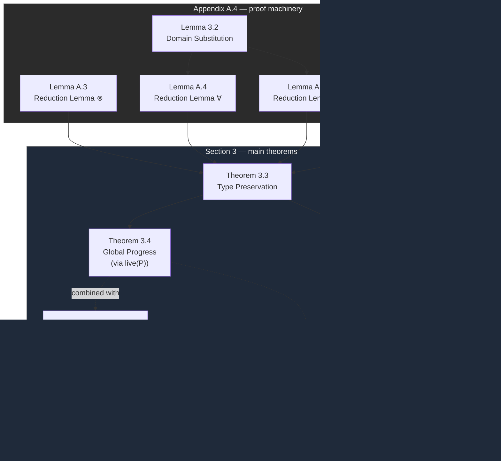

[[book-guidelines|↩ Back to guidelines]]

## Why four theorems, and why they have to be separate

A type system for a concurrent, message-passing calculus has to answer four questions that a sequential type system can mostly collapse into one. In a sequential language, "type safety" is usually packaged as *preservation + progress*: well-typed terms stay well-typed as they step, and well-typed terms that aren't values can always step. Here the calculus is a session-typed $\pi$-calculus with domains bolted on via hybrid logic, and each of these four guarantees is doing a genuinely different job, none of which subsumes another:

1. **Type Preservation** (Thm 3.3) — a process doesn't corrupt its own typing as it runs. This is *soundness of the reduction relation with respect to typing* — the analogue of subject reduction in a sequential calculus, but here "subject" is an entire concurrent system of communicating typed channels, not one term.
2. **Global Progress** (Thm 3.4) — a well-typed system doesn't get stuck. Preservation alone is compatible with a completely deadlocked network of processes each perfectly well-typed and never doing anything again. Progress is the theorem that rules that out.
3. **Termination** (Thm 3.5) — a well-typed process cannot spin forever without producing an observable action. Preservation and progress together only tell you the *next* step exists and is safe; they say nothing about whether "eventually" ever arrives. This is the strong-normalization analogue for a system with genuine, unbounded-looking recursion (via `!` and cut with replication).
4. **Domain Preservation** (Thms 3.6–3.7) — specific to this paper's contribution: a well-typed process never violates the accessibility discipline it was typed under. This is a safety property *about the extension itself*, orthogonal to the three classical ones — you could imagine a calculus that is preserving, live, and terminating while still letting a process sneak into a domain it was never granted access to.

The reason this separation matters for anything you'd build yourself: each of these four theorems corresponds to a different thing that can go wrong in an implementation, and they require genuinely different proof techniques. A type-preservation bug and a progress bug look completely different in a debugger — one manifests as "the typechecker accepts something a later typechecker pass rejects," the other as "the interpreter hangs." Understanding *why* they need separate proofs, not just that both hold, is the actual content of this section.

## Type Preservation: what it means for a proof to "keep proving something as it moves"

### The idea before the notation

Under the Curry-Howard reading this paper builds on (propositions-as-session-types, proofs-as-processes, established in the paper's earlier sections), a typing derivation

$$\Omega; \Gamma; \Delta \vdash P :: z{:}A[\omega]$$

*is* a proof — a proof that the linear-logic-with-hybrid-worlds proposition $A$ holds, relative to hypotheses $\Gamma, \Delta$, in "world" (domain) $\omega$. The process $P$ is not separate from this proof; it's a computational reading of its proof term. So when $P$ takes a reduction step, $P \to Q$, something has to happen to the *proof* $P$ denotes. Type preservation says: whatever happens to it, it stays a proof of the same statement, $z{:}A[\omega]$.

This is exactly what makes the Curry-Howard correspondence useful rather than merely cute here — the paper isn't decorating a process calculus with types as an afterthought annotation; the process reduction rules are secretly *proof normalization steps in disguise*, and Theorem 3.3 is the statement that this disguise is faithful: every legal computational move corresponds to a legal logical move.

**What breaks without it.** If preservation failed, a runtime message exchange could turn a proof of $A \otimes B$ into garbage that no longer supports the operations $A \otimes B$ promised — concretely, a client that has been statically told "the next thing you receive on this channel is a payment receipt of type $\mathrm{Rcpt}$" could, after one exchange, actually be holding a channel of some other, incompatible shape. Every downstream typed operation on that channel becomes a potential runtime type error, exactly as if a sequential language let `x: i32` silently become a dangling pointer after one statement. The entire discipline of "check once, trust forever" collapses.

### The proof technique: reduction lemmas through (cut)

The paper doesn't prove Theorem 3.3 by a single induction on typing derivations directly against the reduction relation $P \to Q$ (which is what you might first reach for). Instead — and this is the part worth sitting with, because it is the technique that generalizes — it proves a battery of *per-connective reduction lemmas* (Appendix A.4, Lemmas A.3–A.6), each of the following shape:

> If $P$ offers a session of type $A \star B$ at $x$ and takes the *specific LTS action* that a process offering $A\star B$ is obligated to be able to take, landing at $P'$, **and** $Q$ uses that same session (as a hypothesis $x{:}A\star B$) and takes the matching co-action, landing at $Q'$ — **then** the *composed* process $(\nu x)(P' \mid Q')$ is well-typed at the *same conclusion* that $(\nu x)(P\mid Q)$ was typed at.

This is precisely a statement about **(cut) elimination**: $(\nu x)(P \mid Q)$ is the process reading of a `(cut)` inference — $P$ proves the cut formula, $Q$ uses it — and the lemma says that performing the principal reduction on that cut (the one where both sides act on the very connective being cut) produces a new, smaller cut that is *still derivable*, and derivable at the *same* end-sequent. That is the textbook shape of a **cut-reduction / proof-normalization step**: you're not proving semantic soundness by appeal to a model, you're proving it *syntactically*, by exhibiting the smaller proof that a bigger proof reduces to.

Concretely, for the multiplicative connective $\otimes$ (Lemma A.3): if $P$ (offering $x{:}A_1\otimes A_2[\omega]$) performs the bound output action $\overline{x}(y)\langle y\rangle$ landing at $P'$, and $Q$ (using $x{:}A_1\otimes A_2[\omega]$) performs the matching input $x(y)$ landing at $Q'$, then $(\nu x)(P'\mid Q')$ is typable at the *original* conclusion $z{:}C[\omega']$. The domain-aware connectives get their own versions of exactly this shape:

- **Lemma A.4 ($\forall$)**: $P$ offering $x{:}\forall\alpha.A[\omega_2]$ receives a domain $\omega_3$ (action $x(\omega_3)$); $Q$ sends that same domain (action $\overline{x}\langle\omega_3\rangle$); recomposing gives a well-typed $(\nu x)(P'\mid Q')$ — and this one *invokes Lemma 3.2 (Domain Substitution)*, because $P'$ now has $\omega_3$ substituted for the bound domain variable $\alpha$ inside its type, and you need to know that substituting an *accessible* domain for a domain variable is itself a typing-preserving operation.
- **Lemma A.5 ($\exists$)**: the mirror image — $P$ sends the witness domain, $Q$ receives it.
- **Lemma A.6 ($@$)**: $P$ offering $x{:}@_\omega A[\omega']$ performs the migration action $x.y@\omega$ (handing over a fresh session at the new domain $\omega$); $Q$ performs the matching migration receipt; recomposition preserves typing at the *original* domain $\omega''$ of the surrounding sequent — the domain migration is entirely local to the cut formula, it doesn't leak into the type of the outer conclusion.

The proof of Theorem 3.3 itself is then almost bureaucratic given these lemmas: reduction $P \to Q$ is, up to [[The-Domain-Aware-Session-Pi-Calculus#Structural congruence|structural congruence]], always *some* redex of the shape "an offering process and a using process synchronizing across a (cut)," so you locate the (cut) that the reduction acts on, dispatch to whichever connective-specific lemma applies, and get back a typing derivation for the reduct at the same conclusion. The heavy lifting — the actual "why does this hold" — lives entirely in the four lemmas, proved (per the paper) by **simultaneous induction on the two given typing derivations** (the derivation for $P$ and the derivation for $Q$ together, since the argument needs to line up the last rule applied on each side).

### Worked reduction: preservation through a $\otimes$-cut, concretely

Take a simplified fragment of the web-store example. Suppose (schematically, domain $\omega$ fixed for both sides so the ordinary $\otimes$ rule applies without a domain wrinkle):

$$\Omega;\Gamma;\Delta_1 \vdash \overline{x}\langle y\rangle.(P_1 \mid P_2) :: x{:}A_1\otimes A_2[\omega] \qquad \Omega;\Gamma;\Delta_2, x{:}A_1\otimes A_2[\omega] \vdash x(y).Q :: z{:}C[\omega']$$

By (cut), $\Omega;\Gamma;\Delta_1,\Delta_2 \vdash (\nu x)\big(\overline{x}\langle y\rangle.(P_1\mid P_2) \mid x(y).Q\big) :: z{:}C[\omega']$.

The process steps by the $\otimes$-communication rule to $(\nu x)(\nu y)(P_1 \mid P_2 \mid Q\{y/y\})$ — the freshly-extruded session $y$ (typed $A_1[\omega]$ by the $(\otimes R)$ premise, with $P_2$ continuing to offer $x{:}A_2[\omega]$) is now directly bound into $Q$. Lemma A.3 is exactly the statement that you can retype this reduct: $P_1$'s premise gives you $y{:}A_1[\omega]$ standing alone, $P_2$'s premise gives you the continuation typed at $x{:}A_2[\omega]$, and $Q$'s derivation (inverted on its use of $x{:}A_1\otimes A_2$) gives you back a derivation of $\Delta_2, y{:}A_1[\omega], x{:}A_2[\omega] \vdash Q :: z{:}C[\omega']$. Recomposing these three pieces with two further (cut)s reconstructs a full derivation of the reduct at the *same* $z{:}C[\omega']$. Nothing about the type $C$, the domain $\omega'$, or the leftover linear resources $\Delta_1,\Delta_2$ changed — only the *shape of the proof* changed, exactly as a cut-elimination step shrinks a proof without changing what it proves.

This is the whole mechanism in miniature: **a communication step is a cut-elimination step**, and type preservation is nothing but the standard cut-elimination theorem for this logic, read through the process lens.

**Lean framing.** If you were checking this in a kernel, this is *precisely* what a subject-reduction lemma states and how you'd prove it: given a well-typed term (proof) `t : A` and a one-step reduction `t ⟶ t'` (here, a `(cut)` principal reduction rather than a $\beta$-reduction), produce a derivation of `t' : A` by structural recursion on the reduction rule that fired, dispatching to a connective-specific "reduction lemma" exactly the way a dependent-type kernel dispatches `whnf`/reduction on the head constructor. The four lemmas A.3–A.6 are the per-constructor cases of that recursion, and Lemma 3.2 (domain substitution) plays the role your kernel's substitution lemma plays for `Π`-elimination: substitution has to be shown to preserve typing *before* you can even state that a reduction step is type-preserving when it involves binding.

**Rust framing.** If you were spot-checking this invariant at runtime in a session-typed Rust library (e.g. a typestate-encoded channel API), preservation is the property that lets you erase the type discipline to zero runtime cost after the fact: if every reduction step is proven type-preserving *statically*, the Rust compiler's typestate transitions (`Channel<Send<A, Send<B, End>>>` moving to `Channel<Send<B, End>>>` after one `.send()`) never need a runtime tag check — the type-level automaton and the term-level protocol are kept in lockstep purely by the borrow checker consuming the old typestate. Type preservation here is the theorem that licenses deleting the runtime check a less disciplined implementation would otherwise need after each message.

## Global Progress: "well-typed" is not enough — you need "live"

### Why preservation alone doesn't give you deadlock-freedom

Consider two processes, both perfectly well-typed, both offering exactly the sessions their types promise, sitting forever unable to interact because each is waiting on an endpoint the other never uses (or because both are "finished," having already discharged their obligations). Type preservation is completely satisfied by this scenario — there's no reduction happening, so there's nothing to preserve. You need a *separate* theorem to rule out the case where a process **should** still be doing something (it hasn't finished its protocol) but **can't**.

That's exactly what the predicate $\mathrm{live}(P)$ is built to isolate:

$$\mathrm{live}(P) \iff P \equiv (\nu \tilde n)(\pi.Q \mid R) \text{ for some } R, \text{ names } \tilde n, \text{ and a } \textbf{non-replicated guarded process } \pi.Q$$

In words: $P$ is live if, once you strip off name restrictions and structural rearrangement, somewhere in its top-level parallel composition there sits a process that is *guarded by a prefix* $\pi$ (it hasn't fired yet) and is *not* a replicated (persistent) server offer. The replicated-server exclusion is essential: `!x(y).P` sitting idle is not evidence of anything stuck — a server is *allowed* to sit forever waiting for a client, that's not deadlock, that's just a service with no current customer. Liveness is specifically "there is a linear, one-shot obligation still pending."

**Theorem 3.4 (Global Progress).** If $\Omega;\cdot;\cdot \vdash P :: x{:}1[\omega]$ and $\mathrm{live}(P)$, then $\exists Q$ such that $P \to Q$.

Read this precisely: a well-typed process with *empty* linear and unrestricted contexts (a "closed" system — everything it needs, it already has internally) that is still live is *guaranteed* to be able to take a step. The empty-context condition is what makes this a statement about a self-contained composite system rather than about a single open process waiting on an external, unprovided session — and the paper notes the choice of $z{:}1[\omega]$ as the offered type is "without loss of generality," since (cut) lets you glue arbitrarily many independently-typed closed processes into one system, and Rule (1R) means $z$ need not even be used.

**What breaks without it.** Without progress, "well-typed" degenerates into "will not go semantically wrong if it ever runs again," which is compatible with a system that never runs again. A payment protocol could type-check perfectly and still deadlock the instant the client sends `buy` and the bank service and the store are both, correctly per their types, waiting for each other to go first — exactly the class of bug session types are marketed as ruling out. Progress is the theorem that actually cashes that promise; preservation alone does not.

### How progress is actually proved

The paper doesn't reprove progress from scratch for this system; it inherits the technique from Caires–Pfenning (citations [9,10]): progress for this style of linear-logic-based session typing is proved via the interaction of *cut-elimination* (which preservation already gives you a syntactic handle on) with a structural argument that a live, well-typed, closed process must contain a matched, ready-to-fire pair of dual actions at the "innermost" (cut). The accessibility side-conditions on (cut) and (@R)/(@L) don't complicate this argument in a new way — the domain-aware extension is designed so that whenever two dual actions are typed against each other across a cut, the well-formedness invariant already guarantees the domains line up, so no new "stuck because of domain mismatch" case can arise *within* a single typing derivation. (Domain mismatches are exactly what the type system rejects at typing time, per Theorem 3.7 below — they can't survive to become a runtime deadlock.)

## Termination: why you need this in addition to progress

### The gap progress leaves open

Progress guarantees *a* next step exists whenever the process is live. It says nothing about whether the process ever *stops needing* a next step — i.e., whether it ever produces an observable, "useful" action, as opposed to spinning through an infinite sequence of purely internal $\tau$-steps forever. A process could satisfy progress at every single point along an infinite reduction sequence and never actually communicate anything a client is waiting for. Termination is the theorem that forecloses this: $P \Downarrow$ ("$P$ terminates") means there is no infinite reduction path from $P$ at all.

$$\textbf{Theorem 3.5 (Termination).} \quad \text{If } \Omega;\Gamma;\Delta \vdash P :: x{:}A[\omega] \text{ then } P\Downarrow.$$

The paper is explicit about *why* this matters given progress already holds: "in the presence of termination, our progress result ensures that communication actions are always guaranteed to take place." Progress + termination together give you the thing you actually wanted: not just "never permanently stuck" but "every linear obligation is eventually and finitely discharged."

**What breaks without it.** Without termination, a well-typed process could busy-loop internally forever — e.g., two processes cut together that keep re-triggering their own reduction rule (structurally possible once you have unrestricted (`!`) replication feeding back into itself) without ever reaching the point where the *client-facing* session action fires. This is a livelock, not a deadlock, and progress alone is blind to it, since at every instant "some redex exists" remains true.

### The proof technique: linear logical relations

This is proved by **linear logical relations** — a technique fundamentally different in flavor from the syntactic cut-reduction argument used for preservation. Where preservation is proved by direct manipulation of derivations, a logical-relations proof for termination works by defining, *by induction on the structure of the type* $A$, a relation (or predicate) on processes offering $A$ that (a) is strong enough to imply termination directly, and (b) is provably closed under the actual typing rules — i.e., every well-typed process automatically falls into the relation for its type, by an induction over the typing derivation rather than over reduction.

Concretely (per the paper's citations [40, 41, 8], adapted here): you define, for each session type $A$ and domain $\omega$, a set (or a step-indexed relation) of processes that "compute $A$-behavior correctly and terminate," built compositionally —

- the base cases (e.g. $1$) are trivially terminating processes,
- the relation for $A\multimap B$ (or $A\otimes B$) is defined in terms of the relations for $A$ and $B$ so that a process is in the relation for the compound type iff feeding it any related argument produces a related, terminating result — this is the standard *reducibility* / *computability-predicate* move used to prove strong normalization for typed lambda calculi and generalized here to session types,
- for the domain-aware quantifiers $\forall\alpha.A$ / $\exists\alpha.A$, the paper notes the construction resembles the one used for *polymorphic* session types (citation [8]) — domain variables are treated the way type variables are treated in a logical-relations proof of strong normalization for System F, **except** — and this is called out explicitly — there are no impredicativity concerns, because domains are not themselves types being quantified over recursively in a way that could produce the self-referential definitions that make System F's logical relations need step-indexing or a size argument. This is a real simplification relative to full polymorphic-lambda-calculus normalization proofs.
- the accessibility environment $\Omega$ has to be threaded through the entire relation, since termination is only claimed relative to a fixed, well-formed accessibility context.

**Why this is a fundamentally different proof shape than preservation's.** Preservation is proved by "run the reduction rule that fired, and locally patch the derivation" — an entirely first-order, syntax-directed argument. Termination requires a semantic argument by induction on *types*, constructing a family of predicates that don't correspond to any single syntactic manipulation — this is precisely why it needs its own theorem and its own machinery (logical relations) rather than falling out of preservation and progress as a corollary. This is the standard lesson from sequential type theory (strong normalization for the simply-typed or polymorphic lambda calculus is never a byproduct of subject reduction) transplanted into the concurrent setting.

**Lean/automated-reasoning framing.** This is exactly the "reducibility candidates" / "computability predicates" technique used to prove strong normalization for the simply typed lambda calculus and, in more elaborate step-indexed form, for System F and dependent type theories — the same proof *shape* that underlies why Lean's kernel can trust that type-checking (definitional equality checking via WHNF reduction) always terminates. If your compiler's kernel needs a termination argument for its own reduction/normalization procedure (e.g. to guarantee `isDefEq` always halts), a logical-relations argument indexed on type structure — not a direct induction on reduction steps — is the standard and often *only* tractable route, and this paper's adaptation to session types (parametrizing the relation by accessibility context $\Omega$) is a template for how you'd extend such a relation when your type system carries an extra structural side-condition (here, domain accessibility; in your compiler, perhaps refinement predicates or a context of solved metavariables).

## Domain Preservation: the property specific to this paper's extension

### What's actually new here

Preservation, progress, and termination are all inherited (with technical extensions) from the non-hybrid session type theory of Caires–Pfenning. Domain preservation is the paper's own contribution's safety property: it says that the *hybrid* discipline — the accessibility relation $\prec$ that governs which domains a session may reference or migrate to — is never violated at runtime, even though nothing in the operational semantics of Section 2 enforces this at all (recall: "reduction allows dual endpoints with the same name to interact, independently of the domains of their subjects" — the untyped calculus is domain-blind; **only the type system** restores domain discipline).

This decomposes into two theorems:

**Theorem 3.6 (well-formedness is hereditary).** If a derivation's end-sequent $\Omega;\Gamma;\Delta \vdash P :: z{:}A[\omega]$ is well-formed (recall: well-formed means $\Omega \vdash \omega \prec^* \omega_2$ for every $x{:}B[\omega_2]\in\Delta$ — every linear hypothesis is reachable from the conclusion's domain), then *every sub-derivation* inside that derivation is also well-formed. This is what licenses reasoning "bottom-up, rule by rule" at all: without it, you couldn't inductively use well-formedness as an invariant maintained by each typing rule, because a premise deep inside the tree might not actually satisfy it even when the conclusion does.

**Theorem 3.7 (reduction only moves you to accessible domains).** For a cut composition $(\nu x)(P\mid Q)$ typed with $P$ offering $x{:}B[\omega'']$ and $Q$ using it, if this reduces to $(\nu x)(P'\mid Q')$, then whatever new session $x'{:}B'[\omega''']$ $P'$ now offers satisfies $\omega''' \prec^* \omega''$ — the new domain is (transitively) accessible from the old one. Migration can move you *forward along the accessibility relation*, never sideways into an unrelated, inaccessible domain.

**Why Theorem 3.6 is the load-bearing lemma for 3.7, and why the well-formedness invariant treats $\Delta$ and $\Gamma$ asymmetrically.** The well-formedness check ($\Omega \vdash \omega \prec^* \Delta$) is imposed only on the *linear* context $\Delta$, not on $\Gamma$. This is deliberate and exploited directly: an inaccessible-domain hypothesis is permitted to sit unused in $\Gamma$ (an unrestricted context can contain "dead" declarations that are never invoked, since (copy) — the rule for actually using a $\Gamma$-hypothesis — itself carries its own explicit accessibility side-condition, $\Omega \vdash \omega_1 \prec^* \omega_2$). So a channel typed at an inaccessible domain can exist syntactically in the environment, but the type system statically guarantees it can *never be copied/used* — "while inaccessible domains can appear in $\Gamma$, such channels can never be used and thus cannot appear in a well-typed process due to the restriction on the (copy) rule." $\Delta$ gets the strict check because linear resources, unlike $\Gamma$ hypotheses, are *guaranteed* to be consumed somewhere in the process — so if one were at an inaccessible domain, it would eventually have to be used illegally.

### Worked illustration: what a non-domain-preserving system would allow

Return to the paper's own example. $\mathrm{WStore}_{sec}$ requires a migration to a trusted domain `sec` before the payment sub-protocol `Pay_bnk` becomes available:

$$\mathrm{WStore}_{sec} \triangleq \mathrm{addCart} \multimap \&\{\mathrm{buy}: @_{sec}\,\mathrm{Pay}_{bnk},\ \mathrm{quit}: 1\}$$

At the point where a client (domain $c$) has selected `buy` but not yet migrated, its typing is

$$c \prec ws;\ \cdot;\ x{:}@_{sec}\mathrm{Pay}_{bnk}[ws] \vdash \mathrm{Client} :: z{:}@_{sec}1[c]$$

and crucially **no derivation of the form** $c \prec ws;\ \cdot;\ \mathrm{Pay}_{bnk}[sec] \vdash \mathrm{Client}' :: z{:}T[c]$ exists, because $c \not\prec^* sec$. Domain preservation (Thm 3.7) is exactly what guarantees this stays true *even after further reduction* — no sequence of legal process steps can ever produce a state where the client interacts with the `sec`-domain payment session while still sitting at $c$, since every step that could touch that session would have to move (via `@`) the client's own locus to a domain from which $sec$ is transitively accessible first. A system *without* domain preservation would be one where the type discipline only holds "at typing time" but drifts at runtime — precisely the failure mode of a type system that checks an initial configuration but has no subject-reduction-style guarantee tying every later configuration back to it. That would make the entire `@`-connective a decoration with no enforcement power: you could write `WStore_sec` and have it checked, and still have a compiled/reduced version of the client sneak into `sec` a different way. Domain preservation is what makes the type *mean* something operationally, not just at the entry point.

## How the pieces fit together

Note what does *not* feed what: Termination (3.5) is proved by an independent technique (logical relations over type structure) and doesn't depend on the cut-reduction lemmas that drive preservation — it's a genuinely separate argument bolted on afterward. Domain preservation depends on preservation's cut-based machinery (to know reduction produces a well-typed reduct at all) *plus* its own separate hereditary-well-formedness lemma (3.6).

## Where the load-bearing connection is

This section is the closest thing in the paper to a template for **the soundness argument of a trusted kernel** — which is precisely why it deserves the depth given above rather than a one-line "the system is type-safe."

If you are building a proof-producing compiler with a trusted computing base — a kernel that type-checks (or proof-checks) terms and is the one component you are *not* willing to bugs-tolerate — then:

- **Type Preservation (Thm 3.3) is your kernel's subject-reduction lemma, verbatim.** The technique used here — proving preservation not by a monolithic induction on reduction but by a family of *per-constructor reduction lemmas*, each one a syntactic cut-elimination step — is exactly the shape a dependent-type kernel's own normalization/definitional-equality checker takes: a `whnf`/`reduce` function dispatches on head constructor, and a soundness proof for it is a family of lemmas ("iota-reduction preserves the type," "beta-reduction preserves the type," ...) assembled the same way Lemmas A.3–A.6 are assembled here. If your refinement-type compiler ever needs to justify that its own reduction/elaboration steps don't silently change the meaning of a term mid-elaboration, this is the proof pattern to reach for — not a semantic model, a syntactic cut-reduction argument.
- **The cut-based reduction lemmas are literally proof normalization.** Every time your elaborator or kernel performs a substitution, a beta-step, or a metavariable instantiation, you are performing the analogue of firing a (cut). The discipline of proving, connective-by-connective (constructor-by-constructor, in your setting), that firing it preserves the surrounding typing judgment is the discipline your kernel's correctness argument needs, and Lemma 3.2 (Domain Substitution) is a direct analogue of the substitution lemma that has to precede *any* such argument involving binders — get that wrong and every downstream preservation case is unsound.
- **Termination via logical relations is the honest answer to "does type-checking halt?"** — you cannot get this from subject reduction; you need an independent, type-structure-indexed argument. If your compiler's kernel performs any nontrivial normalization (unfolding definitions, evaluating index expressions in refinement types), a logical-relations argument — not an operational "well it always seemed to stop" — is what a soundness paper would actually require, and this is the standard, citeable technique (going back to Girard/Tait) for supplying it.
- **Domain Preservation is this paper's own analogue of "the trust boundary is enforced, not just declared."** Read against your CSP/abstract-interpretation project, this is the exact shape of argument you'd need to show that a security lattice, an information-flow label, or an access-capability discipline encoded in your refinement types is not just checked once at the boundary but preserved by every reduction step the kernel performs internally — precisely the gap between a type system that *looks* like it enforces isolation and one that is *proven* to.

Together these four results are why "type-checked" can mean "trustworthy" rather than merely "syntactically pleasing" — the entire weight of that inference sits on theorems exactly like these, proved exactly this way.

## Where this leads

Section 4's multiparty extension (global types, [[Medium-Processes|medium processes]], the two characterization theorems 4.11–4.12) inherits all four of these guarantees *for free*, precisely because medium processes are defined to be ordinary well-typed processes of this binary theory — the paper does not re-prove preservation, progress, termination, or domain preservation for the multiparty layer; it reduces multiparty correctness to *this* section's results by construction. This is the payoff of having proved these theorems in maximal generality here: the entire multiparty apparatus is safety-free-riding on Section 3.
