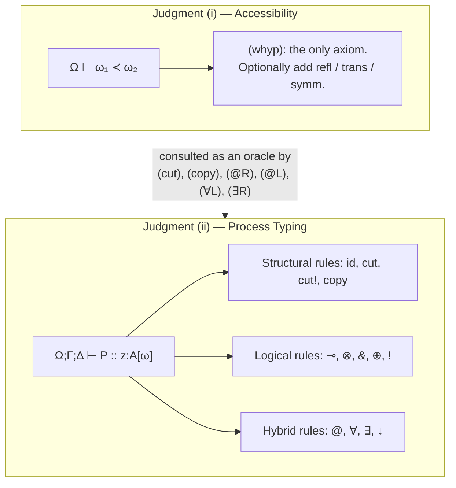
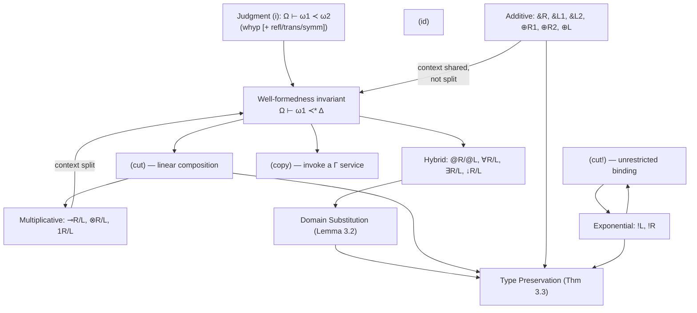

[[book-guidelines|↩ Back to guidelines]]

## Why this article exists, and what it is not

The two prior articles in this vault already walked through the hybrid
connectives ($@_\omega A$, $\forall\alpha.A$, $\exists\alpha.A$,
$\downarrow\!\alpha.A$), the `(cut)` rule, and a full worked derivation for
the `WStore`$_{sec}$ example. This article does not re-derive any of that.
Instead it steps back and treats the **judgment apparatus itself** as the
object of study: what a judgment *is*, why there are exactly two of them
here, why the two contexts $\Gamma$ and $\Delta$ obey different structural
laws, and — the part genuinely missing from the other two articles — the
rules the paper relegates to an appendix because they're "the boring,
predictable half": full additive rules, exponential rules, and a
replication-aware variant of `(cut)`. Boring rules are exactly the ones
worth reading closely once, because they're what a mechanical type checker
actually spends most of its code on.

If you are building a type checker or a proof checker — which, per the
standing project this vault is organized around, you are — this is the
single most transferable topic in the paper. **A typing judgment and a
provability judgment are the same kind of object.** A sequent
$\Gamma \vdash e : A$ in a type theory and a sequent $\Gamma \vdash A$ in a
sequent calculus are notated differently but *consumed* identically: both
are relations checked/derived by a fixed, finite set of syntax-directed
rules, both carry a context that must be threaded through correctly, and
both admit exactly the same kinds of metatheoretic questions (does
weakening hold? does substitution hold? is the relation decidable?). This
paper happens to make that identification unusually explicit, because its
type system *is*, quite literally, a proof system for hybrid linear logic
— propositions are types, and a "type checker" for this language and a
"proof checker" for the logic are the same program.

## First principles: what is a judgment, and why two of them?

A **judgment** is a statement whose truth a fixed set of inference rules is
allowed to establish — not "P is true" in some free-floating sense, but "P
is *derivable*," where derivability is defined constructively, rule by
rule, bottom-up. The entire content of a type theory or a proof system
lives in (a) what the judgment forms are, (b) what can appear on their
left/right, and (c) which rules are allowed to produce them. Get the
judgment forms right, and the type checker basically writes itself as "try
each rule whose conclusion shape matches, recurse on premises." Get them
wrong — too coarse, missing an invariant — and no amount of rule-tuning
saves you, because the checker literally cannot express what it needs to
enforce.

This paper needs **two** judgment forms, not one, because it is tracking
two genuinely different kinds of fact:

$$
\text{(i)}\quad \Omega \vdash \omega_1 \prec \omega_2
\qquad\qquad
\text{(ii)}\quad \Omega;\Gamma;\Delta \vdash P :: z{:}A[\omega]
$$

Judgment (i) is a fact about the **space of domains** — a directed
accessibility graph, entirely independent of any process or session. It
answers "can $\omega_1$ reach $\omega_2$?" and nothing else. Judgment (ii)
is a fact about **processes and sessions** — it answers "does $P$
correctly implement protocol $A$ on channel $z$?" — but it is
*parameterized* by judgment (i): every rule of (ii) that needs to know
whether some domain can reach another one queries (i) as an oracle rather
than re-deriving accessibility facts inline.

This is a design pattern worth naming explicitly, because it recurs
constantly in your compiler: **factor a orthogonal side-condition into its
own judgment rather than smuggling it into the main one.** You could in
principle fold $\prec$ facts directly into the process-typing rules as raw
side-conditions on $\Omega$ (and the paper does write them that way
inline), but keeping (i) as a genuinely separate, freestanding judgment
means: it can be swapped out (the paper explicitly notes you can add
reflexivity/transitivity/symmetry to get an equivalence relation, recovering
modal S5, without touching a single process-typing rule); it can be proved
correct in isolation (decidability of reachability in a graph is a much
smaller problem than decidability of the whole type system); and it can be
implemented as its own small module with its own data structure. This is
exactly the same reason a real type checker keeps unification, kind
checking, and universe-level checking as separate judgments/passes rather
than inlining all of it into one giant recursive function.



## The two contexts: why $\Delta$ is linear and $\Gamma$ is not — structurally

Judgment (ii) carries *three* things separated by semicolons: $\Omega$
(accessibility hypotheses — domain facts, no session content), $\Gamma$
(unrestricted resources), and $\Delta$ (linear resources). The
$\Gamma$/$\Delta$ split is inherited from substructural logic, but it's
worth deriving *why* it has to be a split at all, rather than treating it
as inherited dogma.

**Structural rules**, in a sequent calculus, are the rules that don't look
at the connective at all — they only rearrange or duplicate/discard
hypotheses:

- **Weakening**: from $\Gamma \vdash A$ infer $\Gamma, B \vdash A$ (an
  unused hypothesis can always be added).
- **Contraction**: from $\Gamma, B, B \vdash A$ infer $\Gamma, B \vdash A$
  (two copies of the same hypothesis collapse to one).
- **Exchange**: hypotheses can be reordered freely.

Ordinary intuitionistic logic — and ordinary functional-language typing
contexts — grant *all three* implicitly and without comment: you can add
an unused variable to scope, you can reference a variable as many times as
you like, and argument order in your context doesn't matter. **Linear
logic is exactly what you get by revoking weakening and contraction** (but
keeping exchange). $\Delta$ is a *linear* context: every hypothesis in
$\Delta$ must be used **exactly once** somewhere in the process. $\Gamma$
is an *unrestricted* context: hypotheses there may be weakened (never
touched) or contracted (invoked arbitrarily many times, via the `(copy)`
rule below).

Here is the concrete reason this split is forced, not stylistic:
$x{:}A[\omega] \in \Delta$ means "there is a **live session endpoint**
here — a channel with a partner on the other end, mid-protocol." A session
is a piece of state with exactly one owner and one obligation: whoever
holds $x$ must eventually drive it to completion (matching whatever the
type $A$ says happens next), and no one else can simultaneously hold it,
because there's only one process on the other end to synchronize with.
Duplicating $x$ (contraction) would mean two processes both believing they
own the one conversation on the other side of the channel — a race, not a
protocol. Discarding $x$ (weakening) would mean abandoning an
in-progress protocol without running it to completion — exactly a session
that never reaches its promised `1` (termination) or its promised final
message, silently leaking or deadlocking its partner.

By contrast, $u{:}A[\omega] \in \Gamma$ means "there is a **replicated
service** here — think of it as a socket a server keeps listening on."
Nothing is lost by never dialing it (weakening: an unused, always-available
service is completely harmless), and nothing is lost by dialing it many
times (contraction: each call spawns a *fresh* session, so there's no
shared mutable resource being fought over). That's *exactly* what the type
constructor ${!}A$ ("of course $A$," borrowed straight from linear logic's
exponential) is for: it marks precisely the types allowed to live in
$\Gamma$.

**What breaks without this split.** Suppose you merged $\Gamma$ and
$\Delta$ into one unrestricted context, the way an ordinary typed
$\lambda$-calculus does. Then nothing stops the typing rules from deriving

$$
\Omega;\ x{:}A[\omega]\ \vdash\ P \mid P' :: z{:}C[\omega]
$$

where $P$ and $P'$ **both** use $x$ as though it were their own private
session endpoint — the type checker would happily accept a program in
which two unrelated subprocesses race to read the next message off the
same physical channel. Session fidelity (the property that a
well-typed process's *observable communication behavior* matches its
type, forever) is not just weakened by allowing this — it's meaningless,
because "the" behavior on $x$ is no longer well-defined once two owners can
act on it. Conversely, suppose you made $\Delta$ *unrestricted* instead of
linear: the `(cut)` rule's whole soundness argument — "$P$ offers exactly
$x{:}A[\omega_2]$, $Q$ consumes exactly that, compose them" — stops working
the moment $x$ can also silently appear, unused and undischarged, deep
inside $P$ or $Q$'s other branches; the type would stop tracking whether
communication on $x$ actually completes.

**A mini derivation that makes the discipline concrete.** Consider trying
to type a forwarder that "reads twice" — a deliberately ill-typed process,
to see exactly where the discipline bites:

$$
\Omega;\cdot;x{:}A[\omega] \vdash [x \leftrightarrow z] \mid \text{(something else using }x\text{ again)} :: z{:}A[\omega]
$$

There is no `(par)`-style structural rule in this system that would let you
split $\Delta = \{x{:}A[\omega]\}$ into *two* copies to feed both branches
— you can only ever **split** a linear context additively across a
multiplicative rule's premises (e.g. $(\otimes R)$'s $\Delta_1, \Delta_2$),
never **copy** it. The absence of a contraction rule for $\Delta$ is not a
missing convenience feature; it is the entire mechanism by which the type
system rules out this program syntactically, the same way Rust's borrow
checker rules out two live `&mut` references to the same `T` not by a
special-cased check but by the *absence* of any rule that would let both
borrows exist in scope simultaneously.

### Rust grounding: representing $\Delta$ and $\Gamma$ as a resource-tracked context

If you were writing a bidirectional type checker for a calculus with this
exact discipline (which, per the standing project, you likely will be —
refinement/dependent contexts need the identical linear/unrestricted split
whenever you introduce ownership-tracked resources like proof obligations
or file handles), the natural Rust representation makes the asymmetry a
*type-level* fact rather than a runtime-checked one:

```rust
use std::collections::HashMap;

/// A domain name, ω. In the real system this would be interned.
type Domain = String;
type Var = String;

/// Ω: pure accessibility facts. No session content — a graph.
#[derive(Clone, Default)]
struct AccessCtx {
    edges: Vec<(Domain, Domain)>, // ω1 ≺ ω2 hypotheses
}

impl AccessCtx {
    /// Judgment (i): Ω ⊢ ω1 ≺* ω2 — reflexive-transitive closure.
    fn reaches(&self, from: &Domain, to: &Domain) -> bool {
        if from == to {
            return true;
        }
        // Simple BFS closure over the hypothesis edges.
        let mut frontier = vec![from.clone()];
        let mut seen = std::collections::HashSet::new();
        while let Some(w) = frontier.pop() {
            if !seen.insert(w.clone()) {
                continue;
            }
            for (a, b) in &self.edges {
                if a == &w {
                    if b == to {
                        return true;
                    }
                    frontier.push(b.clone());
                }
            }
        }
        false
    }
}

/// Γ: unrestricted — may be consulted (`get`) any number of times
/// without ever being removed. Weakening/contraction are just "do
/// nothing" and "look it up twice"; there is no operation that removes
/// an entry, because none is needed or sound to add.
#[derive(Clone, Default)]
struct UnrestrictedCtx {
    entries: HashMap<Var, (String /* type */, Domain)>,
}

/// Δ: linear — every entry MUST be consumed exactly once. `take`
/// removes the binding; there is deliberately no `get`/`peek` and no
/// `Clone` derive that would let a caller duplicate an entry.
#[derive(Default)]
struct LinearCtx {
    entries: HashMap<Var, (String, Domain)>,
}

impl LinearCtx {
    /// The only way to touch a linear resource: consume it. Once
    /// taken, it is gone from `self` — the type-checker equivalent
    /// of Rust's own move semantics.
    fn take(&mut self, x: &Var) -> Option<(String, Domain)> {
        self.entries.remove(x)
    }

    /// Additive split for multiplicative rules (⊗R, cut): partitions
    /// self into two disjoint linear contexts by variable set — this
    /// is the ONLY sanctioned way to turn one Δ into two, and it must
    /// account for every entry (no drops, no dupes).
    fn split(mut self, left_vars: &[Var]) -> (LinearCtx, LinearCtx) {
        let mut left = LinearCtx::default();
        for v in left_vars {
            if let Some(entry) = self.entries.remove(v) {
                left.entries.insert(v.clone(), entry);
            }
        }
        (left, self) // `self` now holds exactly the remaining entries
    }

    /// A completed rule application must leave Δ empty: every linear
    /// resource introduced into a subderivation's context must have
    /// been `take`n by the time that subderivation's process is fully
    /// checked. Call this at the leaves of the recursive checker.
    fn require_fully_consumed(&self) -> Result<(), Vec<Var>> {
        if self.entries.is_empty() {
            Ok(())
        } else {
            Err(self.entries.keys().cloned().collect())
        }
    }
}
```

The point of this sketch is not the code itself but the design decision it
encodes: **linearity is enforced by API shape, not by a runtime linter
bolted on afterward.** `LinearCtx` simply has no method that returns a
reference you could consult twice — `take` is a move. `UnrestrictedCtx`
simply has no `take` at all, only non-consuming lookups. A checker built
against these two types cannot accidentally violate the discipline the way
it could if both contexts were `HashMap<Var, Type>` and "don't contract Δ"
were a comment. This is precisely the same idea as Rust's ownership system
applied one level up, to the metalanguage of your own type checker.

## Domain assignments and the well-formedness invariant, restated as a checker's data structure

Every hypothesis in either context carries a domain tag,
$x{:}A[\omega]$ — not a type annotation alone, the way an ordinary typing
context would have $x{:}A$. This is worth dwelling on because it's easy to
read past as decoration: the *domain* is exactly as load-bearing a piece of
static information as the *type*, and a checker that stored it as an
afterthought (e.g., a side table keyed by variable name, updated
inconsistently) would be one refactor away from silently losing domain
information mid-derivation. The right mental model is that $A[\omega]$ is
itself a compound "typed-and-located" object — closer to a Rust reference
with an explicit lifetime, `&'ω A`, than to a bare `A`.

The **well-formedness invariant** —
$\Omega \vdash \omega_1 \prec^\ast \Delta$, meaning every domain mentioned
in $\Delta$ is transitively reachable from the domain $\omega_1$ the
current sequent offers its session at — is the closest thing this system
has to a *global soundness precondition*, checked incrementally at exactly
the rules that could break it: `(cut)`, `(copy)`, `(@R)`, `(∀L)`, `(∃R)`.
Every other rule preserves it automatically, because it doesn't introduce
new domain references or move which domain the derivation is "standing
at." From an implementation standpoint this is the difference between an
invariant you check once globally (expensive, and easy to get subtly wrong
across refactors) and an invariant you check locally at a finite,
enumerable set of rule sites (cheap, and provably complete once you've
enumerated the sites correctly — which is exactly what Theorem 3.6 in the
paper does: it proves the enumeration is exhaustive).

## The accessibility judgment as its own tiny proof system

It's worth treating $\Omega \vdash \omega_1 \prec \omega_2$ as a
self-contained object, because it is one of the cleanest possible examples
of a **minimal proof system that is deliberately left open for extension**
— exactly the shape you want for a pluggable constraint layer in a real
compiler (think: trait-bound solving, or a lattice of abstract domains in
a static analyzer).

In its barest form, the only rule is:

$$
(\text{whyp})\quad \dfrac{}{\Omega, \omega_1 \prec \omega_2 \vdash \omega_1 \prec \omega_2}
$$

Read literally: an accessibility fact is derivable exactly when it is
*syntactically present* in $\Omega$. There is no rule for reflexivity,
transitivity, or symmetry baked in — $\Omega \vdash \omega \prec \omega$
does **not** hold in general, and $\Omega \vdash \omega_1 \prec \omega_3$
does **not** follow automatically from $\omega_1 \prec \omega_2$ and
$\omega_2 \prec \omega_3$ unless you've added a rule that says so. The
paper writes $\prec^\ast$ for "the reflexive-transitive closure of
$\prec$" precisely because most rules of judgment (ii) need *reachability*,
not mere *one-hop adjacency* — but reachability is a derived notion, built
on top of the base judgment, not baked into it.

This separation is the load-bearing design choice: **the accessibility
relation is a parameter of the whole framework.** Want plain reachability
in a DAG of domains? Use `(whyp)` alone and take $\prec^\ast$ as its
closure. Want domains to form mutually-visible clusters (an equivalence
relation, recovering modal logic S5 as shown in the paper's Appendix C.2)?
Add:

$$
(\text{refl})\ \dfrac{}{\Omega \vdash \omega \prec \omega}
\qquad
(\text{trans})\ \dfrac{\Omega \vdash \omega_1 \prec \omega_2 \quad \Omega \vdash \omega_2 \prec \omega_3}{\Omega \vdash \omega_1 \prec \omega_3}
\qquad
(\text{symm})\ \dfrac{\Omega \vdash \omega_1 \prec \omega_2}{\Omega \vdash \omega_2 \prec \omega_1}
$$

Nothing else in judgment (ii) needs to change — every process-typing rule
that touches accessibility phrases its side-condition as an abstract
appeal to "$\Omega \vdash \cdots$", never by pattern-matching on the shape
of $\Omega$ itself. That's the whole design: judgment (ii) is *generic*
over judgment (i)'s exact proof theory, so long as (i) produces a
relation with *some* fixed, checkable shape.

**What breaks without keeping this separate.** If the process-typing rules
inlined a specific accessibility algorithm (say, "check reachability via
this particular graph traversal") instead of treating $\Omega \vdash
\omega_1 \prec \omega_2$ as an opaque judgment, then every one of the five
policy variants above (plain preorder, equivalence relation, or any other
accessibility discipline a future extension might want — e.g. one with
directionality for information-flow control, which the paper explicitly
flags as future work) would require touching every rule in judgment (ii)
that mentions $\Omega$. Factoring it out as its own judgment means adding a
new accessibility discipline is a **closed, local change**: add rules to
(i), leave (ii) untouched, and every soundness proof about (ii) that only
ever used "$\Omega \vdash \cdots$" abstractly still goes through verbatim.

### Lean framing: a judgment as an inductive relation, extension as adding a constructor

This is exactly the shape of an `inductive` relation in Lean, and it's
worth writing it that way once, because the correspondence is nearly
syntactic:

```lean
inductive Access : List (String × String) → String → String → Prop
  | whyp {Ω w1 w2} (h : (w1, w2) ∈ Ω) : Access Ω w1 w2
  -- Adding an equivalence-relation discipline is adding constructors,
  -- not touching the process-typing judgment defined elsewhere:
  | refl  {Ω w} : Access Ω w w
  | trans {Ω w1 w2 w3} (h1 : Access Ω w1 w2) (h2 : Access Ω w2 w3) :
      Access Ω w1 w3
  | symm  {Ω w1 w2} (h : Access Ω w1 w2) : Access Ω w2 w1
```

A proof-producing checker that discharges `Access Ω w1 w2` obligations by
constructing a term of this inductive family is doing exactly what your
elaborator's kernel needs to do for *any* judgment form: derivability is
witnessed by an actual term (a derivation tree), not by a boolean the
checker merely returns. If you want your dependent/refinement-type
compiler's elaborator to be **proof-producing** — emitting a certificate
the trusted kernel re-checks independently — this accessibility judgment
is a self-contained, small-scale rehearsal of exactly that architecture:
a decision procedure (graph reachability) whose *output* is not just
"yes/no" but a term the untrusted decision procedure can hand to a much
smaller, much more trustworthy checker that only knows how to check
`Access` derivation terms against these four constructors.

## The additive rules, in full (Appendix A.3)

The main text only shows the process-level *intuition* for $\&$ and
$\oplus$; the appendix gives the actual rules. These are the rules a real
implementation spends the most code on, because — unlike the hybrid
connectives, which are genuinely novel and get careful prose treatment —
the additives are exactly the standard n-ary labeled sum/product from
linear logic, and their *only* interesting content is bookkeeping: how do
you check a process against a whole **family** of branches at once, and
how do you soundly let a branching type **grow** (weaken) on the left?

**External choice, $\&\{l_i : A_i\}_{i \in I}$** — "the *offering* side
must be ready to honor whichever branch the *client* selects."

$$
(\&R)\ \dfrac{\Omega;\Gamma;\Delta \vdash P_1 :: x{:}A_1[\omega] \quad \cdots \quad \Omega;\Gamma;\Delta \vdash P_n :: x{:}A_n[\omega]}
{\Omega;\Gamma;\Delta \vdash x \triangleright\{l_i : P_i\}_{i\in I} :: z{:}\&\{l_i:A_i\}_{i\in I}[\omega]}
$$

Read bottom-up: to offer $n$-ary external choice, you must have *one
premise per branch*, each type-checked **against the same $\Delta$** — not
split. This is the first genuinely new fact worth flagging: unlike
$(\otimes R)$, which additively *splits* $\Delta$ across two premises
(because both premises' processes run *concurrently*, in parallel), $(\&R)$
shares the *entire* $\Delta$ identically across every branch, because at
runtime **only one branch will ever actually execute** — the client picks
exactly one label, so there is never a moment where two branches'
resource usage could conflict. This distinction between "additive"
resource-sharing (same $\Delta$ everywhere, because only one alternative
runs) and "multiplicative" resource-splitting (partitioned $\Delta$,
because everything runs concurrently) is the textbook line linear logic
draws between its $\&/\oplus$ connectives and its $\otimes/\multimap$
connectives — and it is precisely why the additive rules "look boring": all
the interesting resource arithmetic already happened at the multiplicative
rules, and $\&/\oplus$ just need to make sure every branch agrees.

Using an external choice requires picking one specific branch:

$$
(\&L_1)\ \dfrac{\Gamma;\Delta,x{:}A[\omega_2] \vdash P :: z{:}C[\omega_1]}
{\Gamma;\Delta,x{:}\&\{l_i:A\}_{\{i\}}[\omega_2] \vdash x \triangleleft l_i; P :: z{:}C[\omega_1]}
\qquad
(\&L_2)\ \dfrac{\Gamma;\Delta,x{:}\&\{l_i:A_i\}_{i\in I}[\omega_2] \vdash P :: z{:}C[\omega_1] \quad k \notin I}
{\Gamma;\Delta,x{:}\&\{l_j:A_j\}_{j\in I\cup\{k\}}[\omega_2] \vdash P :: z{:}C[\omega_1]}
$$

$(\&L_1)$ is the rule that actually *acts*: it selects label $l_i$
($x \triangleleft l_i; P$) and continues with the corresponding $A$ in
scope. $(\&L_2)$ is subtler and is exactly the rule the paper's own
Appendix A.6 flags as **silent**: it does *nothing* at the process level —
the process term $P$ is unchanged on both sides — and it exists purely to
let a branching type on the left **grow a label it doesn't use**. This is
a *weakening rule specialized to labeled sums*: you can always widen
$\&\{l_i:A_i\}_{i\in I}$ to $\&\{l_j:A_j\}_{j\in I\cup\{k\}}$ (adding option
$k$ that the process will simply never select) without touching the
process. It's the mechanism that makes external-choice subtyping work —
"a client that only ever needs to use branches in $I$ can safely be given
a server that offers *more* branches than $I$" — and it is exactly why
Appendix A.6's medium-characterization proofs need a whole *pre-congruence*
($\sqsupset_{\!\downarrow}$, discussed alongside $\downarrow$-silence
below) to account for the fact that two "equivalent" derivations may differ
by some number of invisible $(\&L_2)$ steps.

**Internal choice, $\oplus\{l_i : A_i\}_{i\in I}$** is the exact dual —
here it's the *offering* side that picks:

$$
(\oplus R_1)\ \dfrac{\Gamma;\Delta \vdash P :: x{:}A[\omega]}{\Gamma;\Delta \vdash x \triangleleft l_i; P :: x{:}\oplus\{l_i:A\}_{\{i\}}[\omega]}
\qquad
(\oplus R_2)\ \dfrac{\Gamma;\Delta \vdash P :: x{:}\oplus\{l_i:A_i\}_{i\in I}[\omega] \quad k \notin I}{\Gamma;\Delta \vdash P :: x{:}\oplus\{l_j:A_j\}_{j\in I\cup\{k\}}[\omega]}
$$

$(\oplus R_1)$ commits to a label; $(\oplus R_2)$ is the silent
right-side widening counterpart to $(\&L_2)$ — same mechanism, mirrored.
Using an internal choice, dually to $(\&R)$, requires a premise **for
every possible label the offering side might have picked** — the same
"same $\Delta$ everywhere" additive sharing, because at runtime the client
will only ever see *one* of these branches actually taken, but the type
checker, at the point where the choice is received, doesn't yet know
which:

$$
(\oplus L)\ \dfrac{\Omega;\Gamma;\Delta,x{:}A_1[\omega_2] \vdash Q_1 :: z{:}C[\omega_1] \quad \cdots \quad \Omega;\Gamma;\Delta,x{:}A_n[\omega_2] \vdash Q_n :: z{:}C[\omega_1]}
{\Omega;\Gamma;\Delta,x{:}\oplus\{l_i:A_i\}_{i\in I} [\omega_2]\vdash x \triangleright \{l_i:Q_i\}_{i\in I} :: z{:}C[\omega_1]}
$$

### A worked mini derivation: typing a two-branch selection

To make the additive bookkeeping concrete rather than schematic, here is a
small closed derivation typing `WStore`'s own $\&\{\mathrm{buy}:\ldots,
\mathrm{quit}:1\}$ shape, stripped to its essentials. Suppose $\Delta =
x{:}A[\omega], y{:}1[\omega]$ and we want to type a process offering
external choice between using $x$ (branch `go`) and discarding $y$'s
partner-obligation via `1`'s own trivial rule (branch `stop`):

$$
\dfrac{
  \dfrac{\Omega;\Gamma;x{:}A[\omega],y{:}1[\omega] \vdash [x\leftrightarrow z_A] :: z{:}A[\omega]}{\text{(id)}}
  \qquad
  \dfrac{\Omega;\Gamma;x{:}A[\omega],y{:}1[\omega] \vdash \bar{y};0 :: z{:}1[\omega]}{\text{(1L), (1R)}}
}{
  \Omega;\Gamma;x{:}A[\omega],y{:}1[\omega] \vdash z\triangleright\{\mathrm{go}:[x\leftrightarrow z_A],\ \mathrm{stop}:\bar{y};0\} :: z{:}\&\{\mathrm{go}:A,\ \mathrm{stop}:1\}[\omega]
} \ (\&R)
$$

Notice both branches are checked against the **identical** $\Delta = x{:}A[\omega],
y{:}1[\omega]$ — even though the `go` branch conceptually "only needs $x$"
and the `stop` branch "only needs $y$." This is not sloppiness; each
branch is free to simply not fully exploit everything in $\Delta$ within a
single execution, but the *type-checking-time* context must be uniform
across branches precisely because $(\&R)$ has no mechanism (and needs
none) to split $\Delta$ per-branch — only one branch runs per execution, so
there's no double-use to prevent.

**What breaks without additive context-sharing done this way.** If instead
$(\&R)$ *split* $\Delta$ across branches the way $(\otimes R)$ does, you
would either (a) statically forbid perfectly reasonable choice-offering
processes where different branches legitimately want access to
overlapping resources (since a static, execution-order-independent split
can't know which branch will run), or (b) be forced to duplicate resources
across branches, which is exactly what linearity exists to prevent. The
additive rule's context-sharing is the *correct* answer to "how much of
$\Delta$ does each not-yet-known branch need," precisely because
"not-yet-known-which-branch-runs" is additive uncertainty, not
multiplicative concurrency.

## The exponential rules and replication-aware cut

`!A` types a **replicated service**: a request-listener that can be
invoked zero, one, or arbitrarily many times, each invocation spawning an
independent, freshly-scoped session. This is the type constructor that
justifies letting something live in $\Gamma$ rather than $\Delta$ — and its
rules are where that justification becomes mechanical.

$$
(!L)\ \dfrac{\Omega;\Gamma,u{:}A[\omega_2];\Delta \vdash P :: z{:}C[\omega_1]}
{\Omega;\Gamma;\Delta,x{:}{!}A[\omega_2] \vdash x(u).P :: z{:}C[\omega_1]}
\qquad
(!R)\ \dfrac{\Omega;\Gamma;\cdot \vdash Q :: y{:}A[\omega]}
{\Omega;\Gamma;\cdot \vdash x\langle u\rangle.{!}u(y).Q :: x{:}{!}A[\omega]}
$$

$(!L)$ is the moment a service **crosses the boundary from linear to
unrestricted**: consuming (from $\Delta$) a linear reference $x$ to a
replicated-service *offer* moves the actual replicated resource $u$ into
$\Gamma$, where it becomes freely shareable from then on. This is the
single rule in the whole system that performs that transfer — every other
rule either keeps a hypothesis in whichever context it started in, or
(additively/multiplicatively) manipulates $\Delta$ alone.

$(!R)$ is the rule that *offers* a replicated service, and it is worth
staring at because its premise context is **exactly empty** ($\cdot$ for
$\Delta$): to offer ${!}A$, the underlying behavior $Q$ must not depend on
**any** pre-existing linear resource, because $Q$ is about to be wrapped in
`!` and invoked an unbounded, statically-unknown number of times — if $Q$
needed some linear $\Delta$ resource, that resource would have to be
supplied fresh, identically, on every single invocation, which the type
system has no mechanism (and no reason) to support. The process form
$x\langle u\rangle.{!}u(y).Q$ makes this concrete at the process level:
offer a fresh internal name $u$, then set up a **persistent** listener
(`!u(y).Q`, the replicated-input primitive from the process calculus) on
that name, so that every future call spawns a fresh copy of $Q$.

**What breaks without the empty-$\Delta$ side-condition on $(!R)$.** Drop
it, and you could type a "service" whose body secretly holds onto a
linear, single-use session channel — a channel that the *first* invocation
would legitimately consume, but that would be **structurally unavailable**
to the second, third, ... invocation, since a linear resource cannot be
duplicated to feed unboundedly many spawned copies. The type checker would
accept a program that is a use-after-move bug at the granularity of an
entire server, discoverable only at runtime on the second client
connection — exactly the class of bug linear typing exists to push to
compile time.

Finally, **replication-aware cut**:

$$
(\text{cut!})\ \dfrac{\Omega;\Gamma;\cdot \vdash P :: x{:}A[\omega_1] \quad \Omega;\Gamma,u{:}A[\omega_1];\Delta \vdash Q :: z{:}C[\omega_2]}
{\Omega;\Gamma;\Delta \vdash (\nu u)({!}u(x).P \mid Q) :: z{:}C[\omega_2]}
$$

This is `(cut)`'s counterpart for introducing a **new unrestricted
hypothesis** into a derivation, rather than composing along a linear
channel. Compare its shape to ordinary `(cut)`: instead of splitting
$\Delta$ across the two premises (because $P$ and $Q$ run genuinely
concurrently over disjoint linear resources), `(cut!)` gives $P$ an
**empty** linear context (same reason as $(!R)$ — a to-be-replicated body
can't hold linear state) and gives $Q$ the *entire* $\Delta$ plus a brand
new unrestricted hypothesis $u{:}A[\omega_1]$ in $\Gamma$. This is exactly
"define a local server, in scope for the rest of the program" — the
type-theoretic and the programming-language readings of this rule are
*identical*: `(cut!)` is a `let`-binding for a shareable, memoized-service
value, and ordinary `(cut)` is a `let`-binding for a linear,
single-use one. If you're designing a refinement-type language's core
calculus, this pairing — one cut rule for linear bindings, one for
unrestricted ones, distinguished exactly by whether the bound thing's
defining context must be empty — is a template worth lifting directly.

## Domain substitution (Lemma 3.2), as a first-class object

Everything above this section describes *rules*; Lemma 3.2 describes a
**meta-level operation on derivations**, and it deserves to be read as
carefully as any of the object-level rules, because it's the piece that
makes domain communication ($(\forall L)$'s and $(\exists R)$'s
$x\langle\omega_3\rangle$ actions) sound in the first place.

> **Lemma 3.2 (Domain Substitution).** Suppose $\Omega \vdash \omega_1
> \prec \omega_2$. Then:
> 1. If $\Omega, \omega_1 \prec \alpha, \Omega'; \Gamma; \Delta \vdash P ::
>    z{:}A[\omega]$ then $\Omega, \Omega'\{\omega_2/\alpha\};
>    \Gamma\{\omega_2/\alpha\}; \Delta\{\omega_2/\alpha\} \vdash
>    P\{\omega_2/\alpha\} :: z{:}A\{\omega_2/\alpha\}[\omega\{\omega_2/\alpha\}]$.
> 2. If $\Omega, \alpha \prec \omega_2, \Omega'; \Gamma; \Delta \vdash P ::
>    z{:}A[\omega]$ then $\Omega, \Omega'\{\omega_1/\alpha\};
>    \Gamma\{\omega_1/\alpha\}; \Delta\{\omega_1/\alpha\} \vdash
>    P\{\omega_1/\alpha\} :: z{:}A\{\omega_1/\alpha\}[\omega\{\omega_1/\alpha\}]$.

Unpack the statement before its proof: it says that if you have a valid
typing derivation whose accessibility context contains a *bound* domain
variable $\alpha$ related to some fixed domain by a single hop ($\omega_1
\prec \alpha$, or symmetrically $\alpha \prec \omega_2$), you may
substitute $\alpha$ throughout — the *entire* judgment, not just the
type: $\Omega'$, $\Gamma$, $\Delta$, the process term $P$ itself, and the
domain the session resides at — by a domain **one hop further along an
existing accessible edge** ($\omega_2$, respectively $\omega_1$), and the
result is *still a valid derivation of the same shape*. The
precondition $\Omega \vdash \omega_1 \prec \omega_2$ is exactly the thing
that licenses this: you're not substituting an arbitrary domain, only one
that's provably still reachable along the edge that introduced $\alpha$ in
the first place.

This is precisely what makes $(\forall L)$ and $(\exists R)$ — the two
rules that literally instantiate a bound domain variable with a concrete
domain, $A\{\omega_3/\alpha\}$ — safe: instantiation is not a free-standing
syntactic substitution hoped to be harmless; it is an application of a
*proven* lemma guaranteeing the resulting judgment is itself derivable
(indeed, the paper's own proof sketch for Type Preservation explicitly
invokes Lemma 3.2 exactly at the reduction lemmas for $\forall$ and
$\exists$, in Appendix A.4).

### Why this is *the* transferable idea for a dependent-type elaborator's kernel

Every dependent type theory has a structurally identical lemma, usually
called the **substitution lemma**, and it is usually the single most
load-bearing metatheoretic result in the whole system — everything from
`(∀L)`'s domain-instantiation here to a Lean/Coq kernel's handling of
`(fun x => e) a` (beta-reduction, i.e. substituting the argument for the
bound variable throughout the body **and its type**) to a Hoare-logic rule
for procedure calls (substituting the actual argument for the formal
parameter throughout the postcondition) is an instance of the same
underlying fact: *substituting a well-formed term for a bound variable, in
a context where that variable was validly introduced, preserves
derivability of the whole judgment.*

Three things make this genuinely the "shared ancestor" the standing
learning goals call out explicitly:

1. **It's context-preserving, not just term-preserving.** Notice the
   lemma substitutes into $\Omega'$, $\Gamma$, *and* $\Delta$ — not just
   into the conclusion type $A$. A substitution lemma that only handled
   the "obvious" position (the term/type being checked) and forgot the
   context would be unsound the instant some *other* hypothesis in scope
   also mentioned the substituted variable. This is exactly the bug class
   a naive elaborator implementation hits: substituting into the goal type
   but forgetting a hypothesis in the local context also depended on the
   metavariable being solved.
2. **It's what a Lean-style kernel's `instantiate`/`subst` function is
   required to satisfy as a *specification*, not just implement as code.**
   When Lean's kernel β-reduces an application, or when its elaborator
   solves a metavariable and needs to propagate the solution through every
   place the metavariable occurred, the correctness argument for that
   operation is *exactly* Lemma 3.2's shape: "if the judgment held with the
   variable abstract, and the thing being substituted in is validly
   related to what the variable stood for, the judgment holds after
   substitution, with the *same derivation shape*, mechanically
   transformed." A kernel that can't state (even informally) a lemma of
   this shape for its own substitution operation doesn't actually know its
   own type checker is sound.
3. **It's the soundness precondition your CSP/abstract-interpretation
   layers will also need, under a different name.** "Substituting a value
   for a variable preserves the truth of a Hoare postcondition" is the
   textbook rule for procedure-call verification-condition generation —
   the exact same substitution-preserves-derivability shape, just phrased
   over program logic instead of a session type system.

### Lean sketch: substitution as a proof obligation, not just a function

```lean
-- A deliberately simplified stand-in for the paper's domain
-- substitution, in the spirit of what a kernel-level lemma looks like.
-- `Typing` is some judgment-indexed relation (Ω, Γ, Δ, P, z, A, ω);
-- `substDom` is the syntactic substitution operation on all of those.

theorem domain_subst
    {Ω Γ Δ : Ctx} {α ω1 ω2 : Domain} {P : Proc} {A : Ty} {ω : Domain}
    (hacc : Access Ω ω1 ω2)
    (hty  : Typing (Ω.cons (ω1 ≺ α)) Γ Δ P z A ω) :
    Typing Ω (Γ.substDom α ω2) (Δ.substDom α ω2)
      (P.substDom α ω2) z (A.substDom α ω2) (ω.substDom α ω2) := by
  induction hty <;> simp_all [Ctx.substDom, Access] <;>
    first
      | exact (this hacc)          -- structural cases: recurse
      | (apply Access.trans hacc; assumption)  -- the (∀L)/(∃R)-style case
```

This is not meant as a literal transcription of the paper's proof (which
is by induction on the typing derivation, case-by-case over every rule,
using the accessibility precondition exactly at the rules that touch
$\Omega$) — it's meant to show the *shape* your own kernel code should
take: substitution is proved correct **by induction over the typing
derivation itself**, one case per rule, and the one non-structural case
(here, wherever a rule mentions the substituted variable directly, as
$(\forall L)$/$(\exists R)$ do for $\alpha$) is exactly where the
externally-supplied accessibility/definitional-equality fact gets
consumed. A proof-producing elaborator's `subst` is this theorem,
executable — every substitution it performs at elaboration time should be
one whose soundness this exact induction already covers, so the trusted
kernel can re-derive (or simply trust, if the kernel itself *is* this
proof) that substitution never silently breaks a typing fact.

## Rule dependency structure, end to end



The additive and exponential rules — the ones this article centers, since
the hybrid rules and `(cut)` already got a full treatment elsewhere — sit
structurally *underneath* type preservation exactly like every other rule:
Appendix A.4's reduction lemmas are stated "one per session type connective
that produces observable process actions," and although the paper singles
out $\otimes$, $\forall$, $\exists$, and $@$ for detailed treatment (because
those are where domain substitution is actually exercised), the additive
and exponential connectives carry over "straightforwardly" from the
non-hybrid theory precisely *because* their rules never touch $\Omega$ at
all except through the ambient well-formedness invariant. That absence is
itself informative: it tells you domain-awareness is a genuinely
orthogonal concern from choice/replication, bolted onto the *hybrid*
connectives specifically, not smeared across the whole rule set.

## Synthesis: judgment forms as the shared ancestor

Pull back to the two framings this vault's learning goals ask to be made
explicit whenever a book supports it — a **type checker** and a **proof
checker**. This paper is the cleanest possible demonstration that these
are not two different pieces of engineering that happen to look similar;
they are *literally the same object read two ways*. Judgment (ii),
$\Omega;\Gamma;\Delta \vdash P :: z{:}A[\omega]$, is simultaneously "does
process $P$ correctly implement protocol $A$" (a type-checking question)
and "is there a proof of proposition $A$ under these hypotheses, in hybrid
linear logic, with process $P$ *being* that proof's Curry–Howard image"
(a proof-checking question). Every design decision surveyed in this
article — factoring accessibility into its own judgment, splitting
contexts by structural discipline, the additive/exponential rule shapes,
the substitution lemma — is simultaneously a decision about *how a type
checker should be structured* and a decision about *what a sound proof
system for hybrid linear logic looks like*, because there is no daylight
between the two questions here.

For the `type-theory` focus area specifically: the $\Gamma/\Delta$ split
is judgments-and-contexts done with maximal structural explicitness —
every context carries its own weakening/contraction policy as a *first-class
fact of the system's design*, not an afterthought, which is exactly the
discipline a refinement-type context needs once it starts tracking
resources (file handles, proof obligations, ownership) alongside ordinary
values. For `automated-reasoning`: the accessibility judgment as an
extensible, minimal proof system parameterizing a larger one is a direct
rehearsal of how a resolution or tableau prover threads an
eigenvariable/Skolemization context, and the domain substitution lemma is
a compact, fully worked instance of the substitution-preserves-derivability
argument every trusted proof kernel needs to state and discharge — the
exact mechanism a metavariable unifier relies on every time it propagates
a solved metavariable through a context, and exactly the property a
proof-producing elaborator's kernel must be able to certify about its own
`subst` operation before any proof term it emits can be trusted.

## Where this leads

The rules gathered here — additive, exponential, `(cut!)`, and domain
substitution — are exactly the machinery Section 3's four safety theorems
(type preservation, global progress, termination, domain preservation,
covered in their own article) quietly assume are already in place: type
preservation's proof sketch explicitly reduces to per-connective reduction
lemmas that lean on Lemma 3.2, and termination's logical-relations argument
needs a case for every connective introduced here, additive and
exponential included, even though the prose spends its words on the
hybrid ones. It's also the exact rule set Appendix A.6 replays, rule for
rule, when it proves the multiparty medium-characterization theorems —
`(&L2)`'s silence is precisely why that proof needs a pre-congruence
instead of syntactic equality between projected and derived types. Nothing
past this point in the paper introduces a new *kind* of judgment; everything
downstream is this same two-judgment apparatus, applied.
