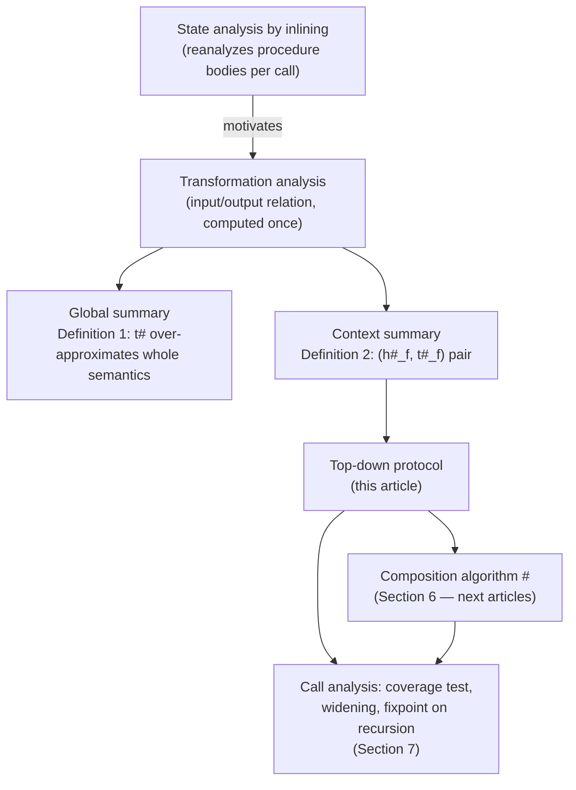

[[book-guidelines|↩ Back to guidelines]]

# Interprocedural Analysis via Procedure Summaries

## The problem: reanalysis is wasteful, and inlining doesn't scale

Say you're writing a static analyzer and you hit a call to `append(k0, k1)` inside `double_append`. The straightforward thing to do — the thing every analyzer does before it grows up — is to *inline*: walk into `append`'s body, propagate the abstract state through its statements (including its loop, with all the widening that entails), and come out the other side with a post-state. Then `double_append` calls `append` again, with a different second argument, and you do the whole thing over: re-walk the body, re-run the loop to convergence, re-widen.

This is the state-analysis-by-inlining approach, and its cost is combinatorial in a very literal sense: if `append` sits three calls deep in some larger call graph, and each of its callers calls it in two or three different states, you might reanalyze `append`'s loop dozens of times over the course of one whole-program run. The paper's own experimental section (Section 8) reports total analysis time going from **877.12s** (call-string / inlining) down to **14.20s** (summary-based) on a fragment of GNU Emacs — not a marginal win, a two-order-of-magnitude one. That gap is the entire motivation for everything in this article.

The fix, in principle, is old: Sharir and Pnueli's **relational approach to interprocedural analysis** (cited by the paper) says compute a reusable description of what a procedure *does*, once, and then reuse that description — a **summary** — at every call site, instead of re-deriving it from the body each time. The hard part, and the part this paper is actually about, is: what should a summary of a heap-manipulating procedure look like, and how do you reuse one without losing precision?

## State analyses vs. transformation analyses — the fork in the road

Before summaries can even be discussed, the book draws a foundational distinction that structures the whole paper:

- A **state analysis** computes an over-approximation of the *states a program may reach* — "at this point, the heap looks like X." This is what you get from forward abstract interpretation of statements directly.
- A **transformation analysis** computes an over-approximation of the *relation between input states and output states* of a program fragment — "starting from any state matching X, running this code produces a state matching Y." This is a strictly richer artifact: it doesn't just describe one snapshot, it describes an input/output *function* (or relation), which is exactly what you need to reuse a procedure's effect without re-executing it.

Here's the "what breaks without this" case, straight from the book's own worked example (Section 1), using the *absolute value* function (`y = |x|`) as a toy:

- A **table of pre/post-condition pairs** in the interval domain gives you something like: `(x ∈ [−5,−1]) ↦ (x ∈ [−5,−1], y ∈ [1,5])`, `(x ∈ [−1,10]) ↦ (x ∈ [−1,10], y ∈ [0,10])`. This is the **tabulation approach**. It's a state analysis dressed up as a table: each row is a separate precomputed state-to-state fact, and there is no way to relate `x` and `y` *symbolically* — the table only knows about specific intervals it was built for.
- A **relational abstract domain** like polyhedra instead gives you one relation: $x' = x \wedge y' \geq x \wedge y' \geq -x$ (primed variables denote the output state). Now hand this a *new* precondition it's never seen, say $-10 \le x \le -5$: the relational version immediately substitutes and derives $x' \in [-10,-5] \wedge y' \geq 5$. The tabulation approach either returns something imprecise (because none of its rows match exactly) or has to grow the table — and growing the table without bound is precisely the "large tables" precision trap the book flags as the tabulation approach's chronic weakness.

This is the crux: **tabulation is a finite catalog of specific instances; a relational summary is a closed-form function.** Composability — the ability to plug a summary into an arbitrary new context without recomputation — is what a relational domain buys you and a table doesn't.

### Grounding: table vs. relation in Rust

```rust
// Tabulation approach: a finite catalog of precomputed (pre, post) facts.
// Querying an unseen precondition either misses (imprecise fallback)
// or requires inserting a new row (table growth).
struct IntervalTable {
    rows: Vec<(Interval /* x pre */, Interval /* y post */)>,
}

impl IntervalTable {
    fn query(&self, x_pre: Interval) -> Interval {
        self.rows.iter()
            .find(|(pre, _)| pre.contains(&x_pre))
            .map(|(_, post)| post.clone())
            .unwrap_or(Interval::TOP) // no matching row -> give up precision
    }
}

// Relational approach: one closed-form summary, evaluated symbolically
// against *any* precondition — no table, no lookup miss.
struct PolyhedralSummary {
    // y' >= x  &&  y' >= -x  &&  x' == x
    constraints: Vec<LinearConstraint>,
}

impl PolyhedralSummary {
    fn apply(&self, pre: &Polyhedron) -> Polyhedron {
        // substitute pre's constraints on x into self, project onto x', y'
        pre.meet(&self.as_polyhedron()).project(&["x'", "y'"])
    }
}
```

The `IntervalTable::query` has a genuine failure mode — `unwrap_or(Interval::TOP)` — that the `PolyhedralSummary::apply` path structurally cannot hit, because it isn't looking anything up, it's *evaluating a relation*. That's the whole argument in code form.

## Why separation logic resists the same trick

Numeric relational domains generalize to shape analysis in the TVLA line of work (Jeannet, Loginov, Reps, Sagiv) via a **primed-variable technique**: just as $x'$ denotes $x$'s value in the output state, you prime shape predicates to talk about "this predicate, but in the output state." It works because TVLA's logic (three-valued logic over structures) doesn't have a *spatial* commitment — a predicate is just a relation over logical variables, primed or not.

Separation logic predicates don't have that luxury. A separation-logic formula like $lseg(\alpha_0, \alpha_1)$ doesn't just assert "there exists a list segment" — it asserts ownership of, and *exhaustively describes*, a specific region of *one* heap. Separating conjunction $*$ is defined by splitting **one** heap into disjoint sub-heaps. There is no built-in notion of "this formula's region is disjoint from that *other* formula's region in a *different* state" — because state-level separation logic was never built to talk about two states at once. This is the second Key Question the guidelines flag, and it's the technical seed from which the rest of the paper's machinery (a *new*, transformation-level separating connector, distinguished as $*_T$ from the ordinary state-level $*_S$) grows — that's the subject of the next article in this series.

The paper's response (following its own earlier NASA Formal Methods work) is not to prime separation-logic formulas, but to build **new logical connectors that live one level up: over transformations themselves**, inspired by but not identical to separation logic's connectors. That's a deliberate design choice worth sitting with — it's a different move than "add primes to what we already have."

## Walking the `append` / `double_append` example

This is the book's central running example (Section 2, Figure 1), and it's worth reconstructing in full because every later formal definition in the paper refers back to it.

```c
typedef struct list { struct list *n; /* ... */ } list;
void append(list *l0, list *l1) {
  assume(l0 != NULL); list *c = l0;
  while (c->n != NULL) { c = c->n; }
  c->n = l1;
}
void double_append(list *k0, list *k1, list *k2) {
  assume(k0 != NULL); append(k0, k1); append(k0, k2);
}
```

`append` walks to the tail of list `l0` and splices `l1` onto the end. `double_append` calls `append` twice, chaining `k0`, `k1`, `k2` together.

**Inlining approach.** A state analysis of `double_append` inlines both calls to `append`: it reanalyzes the traversal loop *twice*, once per call, from two *different* incoming states (the second call happens after the first has already mutated the heap). Each reanalysis pays the full cost of loop widening.

**Transformation approach.** The paper instead computes, once, an abstract *transformation* for `append`:

$$t^\sharp = Id\big(\&l_0 \mapsto \alpha_0 *_S \&l_1 \mapsto \alpha_2 *_S lseg(\alpha_0,\alpha_1) *_S list(\alpha_2)\big) *_T \big[(\alpha_1 \cdot n \mapsto 0x0) \dashrightarrow (\alpha_1 \cdot n \mapsto \alpha_2)\big]$$

Read this the way the book intends you to, in words before symbols: "everything named by `l0`'s spine up to its last element, and everything reachable from `l1`, is **preserved untouched** ($Id(\ldots)$); the *only* thing that changes is the last cell of the first list, which used to hold the null terminator and now holds a pointer to the second list ($[\ldots \dashrightarrow \ldots]$)." This single transformation is `append`'s summary, computed once, independent of which lists it will later be applied to.

Two distinct operations follow from having this summary in hand:

1. **Application**: plug $t^\sharp$ into a concrete precondition to get a postcondition for one specific call — this is how the analysis handles the *first* call to `append` inside `double_append`, without reanalyzing its loop.
2. **Composition**: combine $t^\sharp$ (for the first `append` call) with a second instance of $t^\sharp$ (for the second call) to get a summary of `double_append` itself — this is strictly harder than application, because now you're matching the *post-state of one transformation* against the *pre-state of another*, potentially requiring case splits (the book notes: whether `k1` is empty or not).

The guidelines' own second Key Question for Chapter 2 asks exactly this: why does summarizing `double_append` need composition rather than mere application? The answer is structural — application takes (transformation, state) → state; composition takes (transformation, transformation) → transformation. Summarizing a *caller* of a summarized procedure inherently needs the transformation-typed operation, because the caller's own effect is itself something you'll want to summarize and reuse further up the call graph. Composition is developed properly in Section 6 of the source ($\#$, `comp`$^\sharp$) — a later article in this series (Relational Shape Abstraction / Transformation Domain) picks that up.

## Top-down vs. bottom-up summary inference

A summary-based analysis has to decide *when* it computes summaries relative to *when* it uses them, and there are two disciplines:

- **Bottom-up**: compute the most general summary for a procedure first, independent of any calling context, then specialize it at each call site. This is attractive because the summary, once built, is maximally reusable — but it can be needlessly imprecise or even undecidable to compute for procedures whose behavior genuinely depends on structural assumptions about their arguments (the book's example: a procedure might behave differently applied to a binary tree versus a doubly-linked list — there's no context-free "most general" shape summary that covers both usefully).
- **Top-down**: analyze a procedure's callers first, discover the actual contexts (input states) it's called in, and derive summaries *for those contexts* as they're encountered — generalizing an existing summary via widening only when a new call doesn't fit what's already been inferred.

The book chooses **top-down**, and the Overview section is explicit about why: "a procedure may behave differently when applied to other structures... thus the top-down approach which provides information about the calling contexts before they are analyzed seems more natural." The cost of this choice is that summary inference and summary application can no longer be cleanly separated into two phases — they have to happen "simultaneously," and discovering a new calling context mid-analysis may force the analysis to *widen and regeneralize* an already-computed summary. This is exactly the concern Chapter 7 (Section 7 of the source, [[Modular-Interprocedural-Call-Analysis|Modular Interprocedural Call Analysis]]) formalizes as the **context summary coverage test** ($h^\sharp_{in,f} \sqsubseteq_H h^\sharp_f$) and the **new-summary inference** step (widen $h^\sharp_f$, recompute $t^\sharp_f$) — a direct continuation of the tension first raised here in the Overview.

### Grounding: top-down summary memoization in Rust

A minimal sketch of what a top-down, cache-with-generalization summary store looks like — this is the shape the paper's Section 7 machinery ultimately compiles down to:

```rust
struct ContextSummary {
    precondition: AbstractHeap,      // h#_f
    transformation: AbstractTransformation, // t#_f
}

struct SummaryCache {
    summaries: HashMap<ProcId, ContextSummary>,
}

impl SummaryCache {
    /// Top-down: called lazily, at each call site, as calling contexts
    /// are actually discovered — never speculatively up front.
    fn summary_for_call(&mut self, proc: ProcId, call_input: &AbstractHeap, body: &Cfg) -> &ContextSummary {
        match self.summaries.get(&proc) {
            Some(sig) if call_input.included_in(&sig.precondition) => {
                // coverage test passes: reuse without reanalyzing the body
                self.summaries.get(&proc).unwrap()
            }
            Some(sig) => {
                // widen the precondition to cover the new context, then
                // reanalyze the body ONCE more under the generalized precondition
                let widened_pre = sig.precondition.widen(call_input);
                let new_t = abstract_interpret(body, &widened_pre);
                self.summaries.insert(proc, ContextSummary { precondition: widened_pre, transformation: new_t });
                self.summaries.get(&proc).unwrap()
            }
            None => {
                // first time seeing this procedure at all: analyze under call_input directly
                let t = abstract_interpret(body, call_input);
                self.summaries.insert(proc, ContextSummary { precondition: call_input.clone(), transformation: t });
                self.summaries.get(&proc).unwrap()
            }
        }
    }
}
```

The empirical payoff of exactly this design shows up in the book's own evaluation numbers (Section 8): for `Fcons` in the Emacs benchmark, the cache reports only **3 recomputations against 44 reuses** — i.e., the summary stabilizes almost immediately and is reused nearly fifteen times more often than it's regenerated. That's the top-down discipline paying for itself in practice, not just in theory.

## Where this leads



This article set up the *motivation and shape* of the problem: why relational summaries beat tabulation, why separation logic can't just be primed the way numeric domains can, and why the book commits to a top-down protocol. It deliberately stayed at the level of the worked `append`/`double_append` example rather than the formal syntax of abstract transformations — that formal machinery (the $Id$/$[\dashrightarrow]$/$*_T$ syntax, concretization, and soundness) is the subject of the next article, **[[Separation-Logic-for-Shape-Analysis|Separation Logic for Shape Analysis]]**, and its relational counterpart, **Relational Shape Abstraction**.

For the learning goals around **Static Analysis & Abstract Interpretation**: this is a clean, concrete instance of the general pattern "compute an abstraction once, reuse it everywhere the concrete semantics would otherwise force recomputation" — the same pattern that underlies invariant generation via widening/narrowing in a Hoare-contract or Horn-clause-style verification pipeline. The context summary's soundness statement ($f \trianglerighteq R$) is itself a Hoare-triple-shaped claim ("this relation over-approximates what the procedure computes"), which is directly the shape of the `requires`/`ensures` contracts the target compiler project needs to synthesize automatically — procedure summarization here is doing, for heap shape, exactly what automated Hoare-contract inference would need to do for a refinement-typed language's function signatures.
