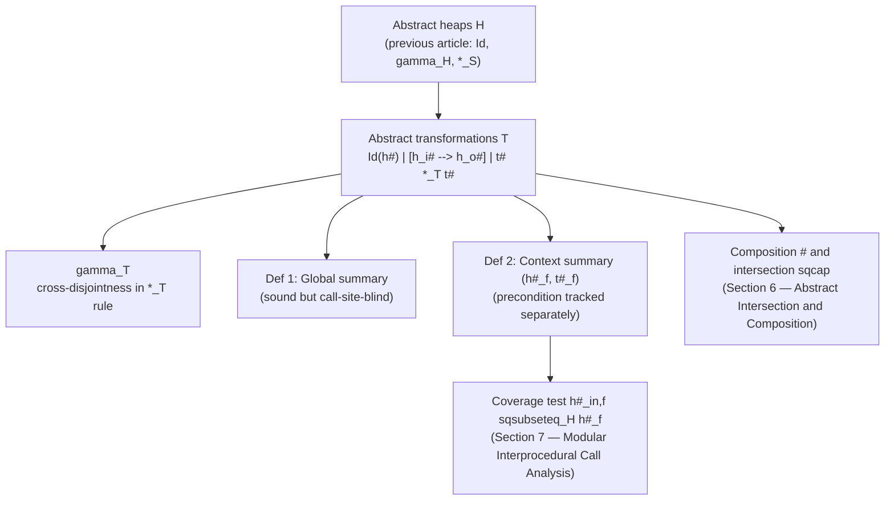

[[book-guidelines|↩ Back to guidelines]]

# Relational Shape Abstraction (Transformation Domain)

## The problem this domain exists to solve

The previous article (**[[Separation-Logic-for-Shape-Analysis|Separation Logic for Shape Analysis]]**) built up abstract heaps $h^\sharp \in H$: a syntax and a concretization $\gamma_H$ for describing *one* snapshot of a heap. That's enough to do a state analysis. But the entire argument for procedure summaries (first article, **[[Interprocedural-Analysis-via-Procedure-Summaries|Interprocedural Analysis via Procedure Summaries]]**) was that you need a description of a *relation* between an input heap and an output heap — something you can compose, and something you can reuse without reanalyzing a procedure's body.

The naive move — take two abstract heaps and just pair them, $(h_i^\sharp, h_o^\sharp)$ — actually gets you surprisingly far (it's exactly the $[h_i^\sharp \dashrightarrow h_o^\sharp]$ constructor below), but it's wasteful on its own: most of a real procedure's summary is "this huge region is untouched," and if you have to write that region out twice — once as input, once as output — you've doubled your formula size for no informational gain, and you've thrown away the fact that it's the *same* region, which matters when you later need to reason about aliasing between the untouched part and the modified part. What the book needs is a syntax that can say "identical" and "changed" as first-class distinct cases, and that can combine such facts about *disjoint* regions compositionally — which is exactly separation logic's own move, just one level up, from states to *relations over pairs of states*.

## The syntax: $T$, built directly on top of $H$

The book's abstract transformations (Figure 4(a) in the source) are:

$$t^\sharp \,(\in T) ::= Id(h^\sharp) \mid [h^\sharp \dashrightarrow h^\sharp] \mid t^\sharp *_T t^\sharp \mid t^\sharp \wedge c^\sharp$$

Three constructors, each earning its place:

- **$Id(h^\sharp)$** — "physical equality over pairs of states both described by $h^\sharp$." This says: whatever concrete region matches $h^\sharp$ in the input, the *exact same* region, unchanged, matches $h^\sharp$ in the output. This is the constructor that lets a summary say "untouched" *once*, instead of writing the region out twice.
- **$[h_i^\sharp \dashrightarrow h_o^\sharp]$** — "captures input/output pairs of states respectively defined by $h_i^\sharp$ and $h_o^\sharp$." This is the explicit-pair case: the region genuinely changes shape, from whatever $h_i^\sharp$ describes to whatever $h_o^\sharp$ describes. Notice this constructor is where an ordinary abstract heap ($H$'s syntax, previous article) gets *reused verbatim* on both sides — the transformation domain doesn't invent a new heap syntax, it just wraps two ordinary heaps in a new relational envelope.
- **$t_0^\sharp *_T t_1^\sharp$** — the **transformation-level separating conjunction**, written $*_T$ specifically to be visually and conceptually distinct from the state-level $*_S$ from the previous article. This is the connector that lets you *compose* an "untouched here" fact with a "changed there" fact into one summary — exactly what `append`'s summary needed (previous article): preserve two whole summary predicates, and only change one cell in between.
- $t^\sharp \wedge c^\sharp$ — same idea as at the state level: attach a numeric constraint over symbolic names, contributing no region.

## Concretization — and the one rule that does all the interesting work

$$\gamma_T(Id(h^\sharp)) = \{(\sigma,\sigma,\nu) \mid (\sigma,\nu)\in\gamma_H(h^\sharp)\}$$
$$\gamma_T([h_i^\sharp \dashrightarrow h_o^\sharp]) = \{(\sigma_i,\sigma_o,\nu) \mid (\sigma_i,\nu)\in\gamma_H(h_i^\sharp) \wedge (\sigma_o,\nu)\in\gamma_H(h_o^\sharp)\}$$
$$\gamma_T(t_0^\sharp *_T t_1^\sharp) = \{(\sigma_{0,i}\uplus\sigma_{1,i},\ \sigma_{0,o}\uplus\sigma_{1,o},\ \nu) \mid$$
$$(\sigma_{0,i},\sigma_{0,o},\nu)\in\gamma_T(t_0^\sharp) \wedge dom(\sigma_{0,i}) \cap dom(\sigma_{1,o}) = \emptyset$$
$$\wedge (\sigma_{1,i},\sigma_{1,o},\nu)\in\gamma_T(t_1^\sharp) \wedge dom(\sigma_{1,i}) \cap dom(\sigma_{0,o}) = \emptyset\}$$

$Id$'s concretization makes the "physical equality" reading precise: the *same* concrete state $\sigma$ appears on both sides of the triple. $[\dashrightarrow]$'s concretization is the direct product of two independent heap concretizations sharing one valuation $\nu$ — no surprises there, it's the pairing intuition made formal.

The $*_T$ rule is where the paper earns its keep, and it's the single most important technical point in this whole domain — the guidelines' own first Key Question for this chapter asks exactly about it, so read it slowly. Naively, you might think $*_T$ should just require the two conjuncts' *input* heaps to be disjoint from each other, and separately their *output* heaps to be disjoint from each other — the direct lift of $*_S$'s "disjoint regions" idea to a pair of states. But the book's rule requires **four** disjointness facts, and two of them are *cross*-conditions:

- $dom(\sigma_{0,i}) \cap dom(\sigma_{1,o}) = \emptyset$ — conjunct 0's **input** region must be disjoint from conjunct 1's **output** region.
- $dom(\sigma_{1,i}) \cap dom(\sigma_{0,o}) = \emptyset$ — and symmetrically, conjunct 1's input disjoint from conjunct 0's output.

### Why the cross-conditions are non-negotiable

Think concretely about what would go wrong without them. Suppose $t_0^\sharp$ says "cell at $\alpha$ is untouched" ($Id$) and $t_1^\sharp$ says "some region, disjoint from $\alpha$ in the *input*, gets rewritten so that its output *does* include a cell at address $\alpha$" (e.g. $t_1^\sharp$ allocates or repoints something into $\alpha$). If you only checked *input*-disjointness and *output*-disjointness separately (not cross), this pathological case could pass: $t_0^\sharp$'s input footprint $\{\alpha\}$ and $t_1^\sharp$'s input footprint could genuinely be disjoint, and separately $t_0^\sharp$'s output footprint $\{\alpha\}$ and $t_1^\sharp$'s *own* output footprint could also be disjoint from each other — yet $t_1^\sharp$'s **output** might still collide with $\alpha$, which $t_0^\sharp$ swore was untouched throughout. The two conjuncts, composed via $\uplus$, would then try to write two different values into the same address $\alpha$ in the *output* memory state — an inconsistency $\uplus$ itself would catch (it's undefined on overlapping domains) but only after the fact, and it means the decomposition wasn't actually a sound way to build up the transformation in the first place.

The cross-conditions rule this out *before* composing: they force conjunct 1's input footprint to avoid conjunct 0's *output* footprint (and vice versa), which is exactly the guarantee needed so that "region $\alpha$ is untouched throughout the entire transformation" (as $Id$ claims) really does hold globally, not just locally within one conjunct. In short: $*_S$ only ever has to protect disjointness within *one* state; $*_T$ has to protect disjointness across *time* — between what one part promises about the input and what another part does to the output, and vice versa. That's the essential extra dimension a *relational* separating connector has that a plain state-level one doesn't, and it's precisely the technical content behind "you can't just prime separation logic formulas" from the first article.

### Grounding: the four-way disjointness check in Rust

```rust
/// gamma_T for t0 *_T t1: not just "inputs disjoint" and "outputs disjoint"
/// separately, but ALSO cross-checked against time (input vs the OTHER's output).
fn concretize_sep_t(
    t0: &(MemState, MemState, Valuation), // (sigma_0i, sigma_0o, nu)
    t1: &(MemState, MemState, Valuation), // (sigma_1i, sigma_1o, nu)
) -> Option<(MemState, MemState, Valuation)> {
    let (s0i, s0o, nu0) = t0;
    let (s1i, s1o, nu1) = t1;
    debug_assert_eq!(nu0, nu1, "shared valuation required");

    // The two cross-conditions the naive "same-time-only" version would miss:
    let cross_ok =
        s0i.0.keys().all(|a| !s1o.0.contains_key(a)) && // dom(s0i) disjoint dom(s1o)
        s1i.0.keys().all(|a| !s0o.0.contains_key(a));    // dom(s1i) disjoint dom(s0o)
    if !cross_ok { return None; }

    let merged_i = s0i.disjoint_union(s1i)?;
    let merged_o = s0o.disjoint_union(s1o)?;
    Some((merged_i, merged_o, nu0.clone()))
}
```

If you deleted the `cross_ok` check, this function would still type-check, still compile, and would silently accept transformation compositions that violate the "untouched region stays untouched" guarantee the whole $Id$ constructor exists to make. That's the "what breaks without this" case in the most literal sense: no compile error, just a soundness hole, which is exactly why the book states the rule as a proof obligation ($\gamma_T$) rather than trusting intuition.

## Worked example: `append`'s summary in the formal syntax (Example 2)

Putting the pieces together for the running `append` example from the previous articles:

$$t^\sharp = Id\big(\&l_0 \mapsto \alpha_0 *_S \&l_1 \mapsto \alpha_2 *_S lseg(\alpha_0,\alpha_1) *_S list(\alpha_2)\big) *_T \big[(\alpha_1 \cdot n \mapsto 0x0) \dashrightarrow (\alpha_1 \cdot n \mapsto \alpha_2)\big]$$

Left conjunct: an $Id$ over a whole abstract heap (both list-segment summaries, and the variables' own cells) — "all of this, unchanged." Right conjunct: a genuine $[\dashrightarrow]$ pair — "this one cell, which held null, now holds $\alpha_2$." For $*_T$ to typecheck semantically here, the four disjointness conditions must hold: crucially, the *modified* cell's address ($\alpha_1$) must not appear anywhere in the *input* footprint of the $Id$ region (it doesn't — $\alpha_1$ is the tail of the segment $lseg(\alpha_0,\alpha_1)$, which only asserts a segment *ending at* $\alpha_1$, not owning the cell *at* $\alpha_1$), and the $Id$ region's *output* footprint must avoid the $[\dashrightarrow]$'s input side too. The book's own choice of which sub-formulas own which cells is precisely engineered so this holds — that's not an accident, it's the discipline that makes the summary well-formed at all.

## From transformations to summaries: two distinct soundness notions

Section 4 of the source builds two summary notions directly on top of $T$, and distinguishing them is itself a Key Question the guidelines flag.

First, notation: for $f: \mathcal{P}(A) \to \mathcal{P}(B)$ and relation $R \subseteq A \times B$, write $f \trianglerighteq R$ to mean $\forall X \subseteq A,\ X \times f(X) \subseteq R$ — "$R$ over-approximates $f$'s graph."

**Definition 1 (Global transformation summary).** A sound global summary of `proc f(...){C}` is $t^\sharp$ such that

$$\llbracket C \rrbracket^T \trianglerighteq \{(\sigma_i,\sigma_o) \mid \exists \nu,\ (\sigma_i,\sigma_o,\nu)\in\gamma_T(t^\sharp)\}$$

Plain reading: $t^\sharp$'s concretization is an over-approximation of the procedure's *entire* input/output behavior. This looks sufficient — but it isn't, for a subtle and important reason.

**The gap:** a global summary alone can't answer the question a call-site actually needs answered: *"does this summary already cover the states I'm calling into right now?"* You might think you could just check whether the new call's input state is included in $t^\sharp$'s own input projection — but $t^\sharp$ may have been derived for one very specific context, and nothing about the bare transformation tells you which states were actually *considered* as inputs versus which states just happen to satisfy some structural pattern in $t^\sharp$'s left projection. Worse — and this is the sharper problem — the transformation's left projection may not even *mention* some inputs the analysis has already seen, specifically inputs that lead to **non-termination or a crash**, since those inputs never produce an output pair to record in $\gamma_T(t^\sharp)$ at all.

**Definition 2 (Context transformation summary).** A sound context summary is a *pair* $(h_f^\sharp, t_f^\sharp)$ such that

$$\big(\lambda(M \subseteq \{\sigma \mid \exists\nu, (\sigma,\nu)\in\gamma_H(h_f^\sharp)\}) \cdot \llbracket C \rrbracket^T(M)\big) \trianglerighteq \{(\sigma_i,\sigma_o) \mid \exists\nu,\ (\sigma_i,\sigma_o,\nu)\in\gamma_T(t_f^\sharp)\}$$

In words: $(h_f^\sharp, t_f^\sharp)$ is sound *for the procedure's semantics restricted to inputs matching* $h_f^\sharp$. $h_f^\sharp$ is now a **separate, explicit tracking of all inputs considered so far** — not derived from $t_f^\sharp$'s projection, and specifically allowed to include inputs that never make it into $\gamma_T(t_f^\sharp)$ at all.

### The `getnext` example: why the precondition component earns its keep

The book's sharpest illustration (Example 4) is a one-liner:

```c
void getnext(list **l0, list *l1) { *l0 = l1->n; }
```

Assume it's always called with `l0` a valid pointer and `l1` pointing to a possibly-empty well-formed list. If `l1` is empty (null), dereferencing `l1->n` crashes. Yet this valid context summary exists:

$$h_f^\sharp = \&l_0 \mapsto \alpha_0 *_S \alpha_0 \mapsto \alpha_1 *_S \&l_1 \mapsto \alpha_2 *_S list(\alpha_2)$$
$$t_f^\sharp = Id(\&l_0 \mapsto \alpha_0 *_S \&l_1 \mapsto \alpha_2 *_S \alpha_2 \cdot n \mapsto \alpha_3 *_S list(\alpha_3)) *_T [\alpha_0 \mapsto \alpha_1 \dashrightarrow \alpha_0 \mapsto \alpha_3]$$

$h_f^\sharp$'s $list(\alpha_2)$ conjunct includes the case where $\alpha_2$ concretizes to null (an empty list, by the $lseg$/$list$ base case from the previous article) — i.e. $h_f^\sharp$'s concretization genuinely *includes* the crashing states. But $t_f^\sharp$'s $[\dashrightarrow]$ pair requires $\alpha_2 \cdot n \mapsto \alpha_3$ to exist — which forces $\alpha_2$ to be a real, non-null cell. So the crashing states are present in $\gamma_H(h_f^\sharp)$ but **absent** from $\gamma_T(t_f^\sharp)$'s left projection. Definition 2's over-approximation statement is *still* sound for this — because $\lambda M.\ldots$ restricts to $M \subseteq \gamma_H(h_f^\sharp)$, and for the crashing subset of $M$, $\llbracket C \rrbracket^T$ simply produces no output pair (undefined/error semantics), so there's nothing on the left side of $\trianglerighteq$ to over-approximate for those particular inputs. This is exactly why the book insists on tracking $h_f^\sharp$ *separately*: it's the only component that remembers "the analysis has considered these inputs" even when the transformation itself has nothing to say about some of them.

### Grounding: the two summary kinds as Rust types

```rust
/// Definition 1: a bare over-approximation of the whole input/output relation.
/// Structurally insufficient on its own for a call-site coverage check.
struct GlobalSummary {
    transformation: AbstractTransformation, // t#
}

/// Definition 2: precondition + transformation, kept as two separate fields
/// precisely because their concretizations can diverge (getnext: crashing
/// inputs live in `precondition` but never appear in `transformation`).
struct ContextSummary {
    precondition: AbstractHeap,              // h#_f : ALL inputs considered so far
    transformation: AbstractTransformation,   // t#_f : sound only where it's defined
}

impl ContextSummary {
    /// The coverage test a call site actually needs (Section 7 builds on this):
    /// is the NEW call's input already accounted for by what we've seen?
    fn covers(&self, new_input: &AbstractHeap) -> bool {
        new_input.included_in(&self.precondition) // h#_in,f ⊑_H h#_f
    }
}
```

A `GlobalSummary` has no field to answer `covers` against at all — you'd have to (unsoundly) reverse-engineer an input footprint from the transformation's own left projection, exactly the move Definition 2 exists to avoid.

## Where this leads



This transformation domain — its syntax, its cross-disjointness soundness condition on $*_T$, and the global-vs-context summary distinction — is the load-bearing abstraction the entire rest of the paper sits on. The **intraprocedural analysis** (Section 5) is a forward abstract interpreter that produces terms of exactly this syntax; **composition** (Section 6) is an algorithm operating over exactly this syntax; and the **modular call analysis** (Section 7) is precisely the coverage-test-then-apply-or-widen protocol that Definition 2's two-component structure was built to support.

For the learning goals: the $*_T$ cross-disjointness condition is a genuine instance of the **Static Analysis** thread on Galois connections and sound abstract domains — it's a soundness proof obligation on a *relational* abstract domain, the same category of concern as soundness of a Hoare-logic-style relational contract or a CHC transition relation. It also touches **Automated Reasoning**: the distinction between "what a relation asserts" versus "what precondition was actually explored" (Definition 1 vs. 2) is structurally the same distinction a bi-abduction-style precondition/postcondition inference procedure has to make, and the guidelines' own Chapter 9 summary notes bi-abduction explicitly as a complementary technique the paper's authors flag as future work. If the target compiler project ever needs to synthesize `requires`/`ensures` contracts automatically (its own stated goal), this global-vs-context summary distinction is a direct precedent: a synthesized contract needs its own "what inputs has verification actually covered" component, not just a bare input/output relation.
