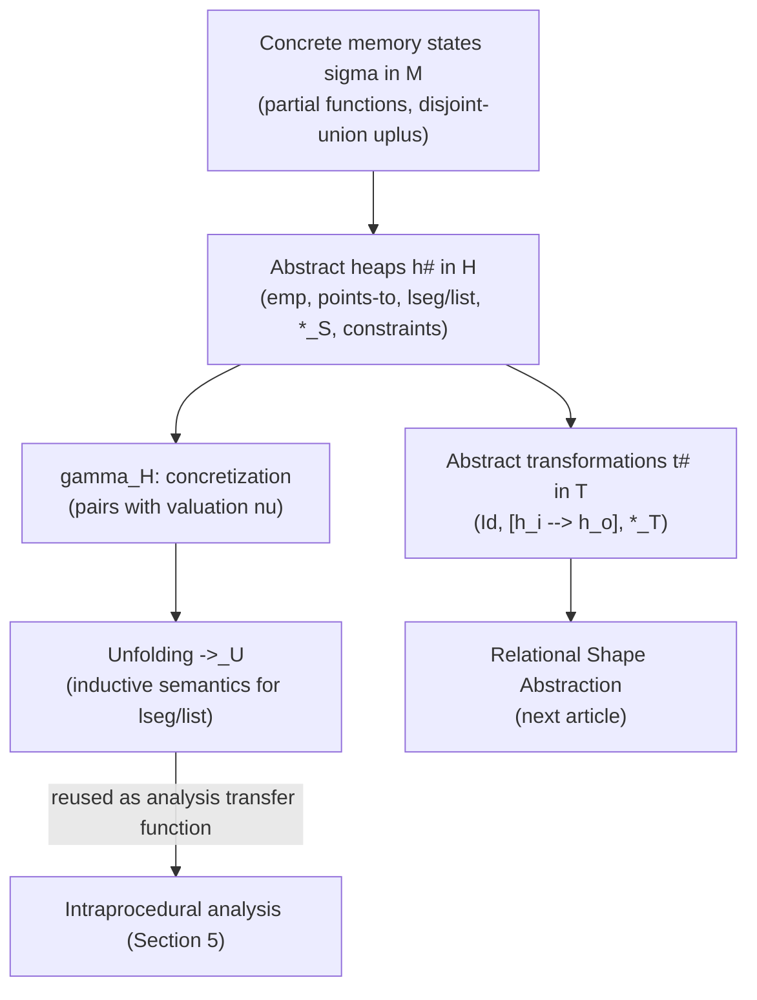

[[book-guidelines|↩ Back to guidelines]]

# Separation Logic for Shape Analysis

## Why you need a *spatial* logic in the first place

Suppose you're abstracting the heap of a program that manipulates a singly-linked list, and you want to say something like "cell `c` points to cell `d`, and separately, `d` starts a well-formed list that doesn't touch `c`." A plain first-order formula over a global "points-to" relation can express the pointer facts, but it can't cheaply express *disjointness* — that two descriptions talk about genuinely separate memory, with no aliasing between them. Without that guarantee, every local reasoning step (e.g. "mutating `c` doesn't affect `d`'s list") has to be re-derived globally, which is exactly the kind of non-modular, whole-heap reasoning that makes shape analysis intractable at scale.

**Separation logic**'s founding move is to bake disjointness into the logic's own conjunction operator. A formula $h_0 *_S h_1$ doesn't just mean "$h_0$ and $h_1$ both hold" — it means "the heap splits into two disjoint pieces, one satisfying $h_0$, the other satisfying $h_1$." This is what licenses **local reasoning**: once you know a formula's shape as a $*_S$-conjunction, you can reason about one conjunct's effect on the heap while treating the rest as a black box that's provably untouched. This is the tool the book uses to describe heap shapes (Section 3), and it's the direct ancestor of the paper's later transformation-level connector $*_T$ (covered in the companion article on relational shape abstraction) — you can't understand why $*_T$ needs its own definition without first nailing down exactly what $*_S$ does and doesn't give you.

## The concrete semantics underneath: memory states

Before any abstraction, the book fixes what a *concrete* memory state actually is — this grounding matters because every abstract definition that follows is a claim about what set of concrete states it describes.

- $X$ is the set of program variables, $V$ the set of values (including addresses). $\&x$ is the (fixed) address of variable $x$.
- A **memory state** $\sigma \in M$ is a **partial function** from variable/heap addresses to values. $dom(\sigma)$ is where it's defined.
- $\sigma_0 \uplus \sigma_1$ ("appending" two states) is defined only when $dom(\sigma_0) \cap dom(\sigma_1) = \emptyset$ — disjointness is a *precondition* on this operation, not an afterthought. This is the concrete-level ancestor of everything $*_S$ will later formalize abstractly.
- $[a \mapsto v]$ denotes the singleton state mapping address $a$ to value $v$.

A small imperative language is fixed over this: assignments (`x = y`, `x = v`, `x -> n = y`, `x = y -> n`), sequencing, `while`, local declarations, and calls. The full semantics of a command is a function $\llbracket C \rrbracket^T : \mathcal{P}(M) \to \mathcal{P}(M)$ — sets of input states to sets of output states. Everything from here on is an *abstraction* of this concrete picture.

### Grounding: memory states as partial finite maps in Rust

```rust
use std::collections::HashMap;

type Addr = usize;
type Value = usize; // addresses and base values share a domain here

/// A concrete memory state: a *partial* function addr -> value.
/// dom(sigma) is just the key set.
#[derive(Clone)]
struct MemState(HashMap<Addr, Value>);

impl MemState {
    /// sigma0 |+| sigma1 — defined only when domains are disjoint.
    /// This partiality is exactly what separating conjunction will
    /// later formalize as an abstract, decidable-to-check condition.
    fn disjoint_union(&self, other: &MemState) -> Option<MemState> {
        if self.0.keys().any(|k| other.0.contains_key(k)) {
            return None; // not disjoint: operation undefined
        }
        let mut merged = self.0.clone();
        merged.extend(other.0.clone());
        Some(MemState(merged))
    }
}
```

## Abstract heaps: the syntax of $H$

The book's abstract states, $h^\sharp \in H$, are given by the grammar (Figure 3(a) in the source):

$$n \,(\in N) ::= \alpha\ (\alpha \in A) \mid \&x\ (x \in X)$$
$$c^\sharp ::= n \bowtie 0x0\ (\bowtie \in \{=, \neq\}) \mid n = n'$$
$$h^\sharp \,(\in H) ::= \mathit{emp} \mid n \cdot f \mapsto n' \mid lseg(\alpha, \alpha') \mid list(\alpha) \mid h^\sharp *_S h^\sharp \mid h^\sharp \wedge c^\sharp$$

Read each production for what it *means*, not just what it parses:

- **Symbolic names** $n \in N$: either a concrete variable address $\&x$, or a fresh **symbolic variable** $\alpha \in A$ standing for some heap address or value that the analysis doesn't need to pin down numerically. This indirection — naming an address symbolically instead of concretely — is what lets one abstract heap describe infinitely many concrete heaps at once.
- $\mathit{emp}$: the empty heap region — asserts nothing is owned here.
- **Points-to predicate** $n \cdot f \mapsto n'$: "the memory cell at address $n$, offset by field $f$, holds value $n'$." For lists, $f = n$ (the "next" field, notation collision with the meta-variable $n$ is the book's own, not a typo on your part reading it) or the null/base offset. So $\&x \mapsto \alpha$ says "variable $x$'s cell holds $\alpha$," and $\alpha_0 \cdot n \mapsto \alpha_1$ says "the `next` field of the cell at $\alpha_0$ holds $\alpha_1$."
- **Summary predicates** $lseg(\alpha_0, \alpha_1)$ and $list(\alpha)$: these describe *unbounded* memory regions by induction, which is exactly what a points-to predicate cannot do (it only ever describes one cell). $lseg(\alpha_0, \alpha_1)$ is a (possibly empty) list segment running from $\alpha_0$ to $\alpha_1$; $list(\alpha)$ is shorthand for $lseg(\alpha, 0x0)$ — a complete list terminated by null.
- $h_0^\sharp *_S h_1^\sharp$: the **state-level separating conjunction**. This is the operator carrying the whole "disjoint regions" idea into the abstract syntax.
- $h^\sharp \wedge c^\sharp$: attach a numerical constraint. Crucially, $c^\sharp$ constrains *symbolic names*, not memory — it contributes no heap region of its own.

## Concretization: what an abstract heap actually stands for

An abstract syntax is meaningless without a **concretization function** tying it back to sets of concrete objects — this is the standard abstract-interpretation move (a Galois-connection-flavored $\gamma$), and the book is careful to spell it out completely (Figure 3(b)):

$$\gamma_H(n \cdot f \mapsto n') = \{([\nu(n)+f \mapsto \nu(n')], \nu)\}$$
$$\gamma_H(\mathit{emp}) = \{([\,], \nu)\}$$
$$\gamma_H(h_0^\sharp *_S h_1^\sharp) = \{(\sigma_0 \uplus \sigma_1, \nu) \mid (\sigma_0,\nu)\in\gamma_H(h_0^\sharp) \wedge (\sigma_1,\nu)\in\gamma_H(h_1^\sharp)\}$$
$$\gamma_H(h^\sharp \wedge c^\sharp) = \{(\sigma,\nu) \mid (\sigma,\nu)\in\gamma_H(h^\sharp) \wedge \nu \in \gamma_C(c^\sharp)\}$$

The key idea that makes this whole framework work is the **valuation** $\nu: N \to V$ — a function tying every symbolic name in $N$ to a concrete value/address. Concretization doesn't just produce a set of memory states; it produces a set of **pairs** $(\sigma, \nu)$, because a bare memory state alone can't tell you which concrete address the symbol $\alpha_3$, say, was supposed to denote. The valuation is the glue that lets multiple sub-formulas *agree* on what their shared symbolic names mean — without it, $*_S$ conjoining two formulas that both mention $\alpha$ would have no way to force both readings of $\alpha$ to line up.

Notice the $*_S$ concretization rule directly mirrors $\sigma_0 \uplus \sigma_1$ from the concrete semantics: disjointness at the abstract level is *inherited* from disjointness at the concrete level, not invented independently. That's the soundness argument for $*_S$ in one line, and it's worth internalizing because the transformation-level connector $*_T$ (next article) needs a *stronger*, cross-state version of the same idea, and you'll want this baseline fresh in mind to see exactly what's added.

### What breaks without valuations

If concretization just mapped $h^\sharp \to \mathcal{P}(M)$ (sets of states, no valuation), then $\alpha \cdot n \mapsto \alpha' *_S \alpha' \cdot n \mapsto 0x0$ would concretize to: "some cell pointing to some other cell that's null-terminated" — but nothing would force the *specific* address that the left conjunct calls $\alpha'$ to be the *same* address the right conjunct also calls $\alpha'$. You'd lose the ability to chain cells together at all. The valuation is what pins $\alpha'$ to one concrete address across both conjuncts.

### Grounding: valuations and concretization in Rust

```rust
use std::collections::HashMap;

#[derive(Clone, Copy, PartialEq, Eq, Hash, Debug)]
enum SymName { Var(&'static str), Sym(u32) } // &x or alpha_i

type Valuation = HashMap<SymName, Value>; // nu: N -> V

#[derive(Clone)]
enum AbstractHeap {
    Emp,
    PointsTo { base: SymName, field: &'static str, target: SymName },
    Lseg(SymName, SymName),
    List(SymName),
    Sep(Box<AbstractHeap>, Box<AbstractHeap>), // h0 *_S h1
    Constrained(Box<AbstractHeap>, Constraint),
}

/// gamma_H: an abstract heap concretizes to a SET of (concrete state, valuation) pairs.
fn concretize(h: &AbstractHeap, nu: &Valuation) -> Vec<(MemState, Valuation)> {
    match h {
        AbstractHeap::Emp => vec![(MemState(HashMap::new()), nu.clone())],
        AbstractHeap::PointsTo { base, target, .. } => {
            let addr = nu[base]; // + field offset, elided
            let val = nu[target];
            let mut m = HashMap::new();
            m.insert(addr, val);
            vec![(MemState(m), nu.clone())]
        }
        AbstractHeap::Sep(h0, h1) => {
            // disjoint_union enforces exactly the precondition sigma0 |+| sigma1 needs
            let mut out = vec![];
            for (s0, nu0) in concretize(h0, nu) {
                for (s1, nu1) in concretize(h1, nu) {
                    if let Some(merged) = s0.disjoint_union(&s1) {
                        out.push((merged, nu1)); // nu0 == nu1 by construction here
                    }
                }
            }
            out
        }
        AbstractHeap::Lseg(a0, a1) => unfold_lseg(*a0, *a1, nu),
        AbstractHeap::List(a) => unfold_lseg(*a, SymName::Var("null"), nu),
        AbstractHeap::Constrained(h, c) => {
            concretize(h, nu).into_iter().filter(|(_, nu)| c.holds(nu)).collect()
        }
    }
}
```

## Summary predicates concretize by *unfolding* — an inductive, not closed-form, definition

$lseg$ and $list$ can't be concretized by a direct formula the way points-to can, because they describe unboundedly many possible shapes (a segment of length 0, 1, 2, …). The book handles this with a rewrite relation $\to_U$ ("unfold"):

$$lseg(\alpha_0, \alpha_1) \to_U \mathit{emp} \wedge \alpha_0 = \alpha_1$$
$$lseg(\alpha_0, \alpha_1) \to_U \alpha_0 \cdot n \mapsto \alpha_2 *_S lseg(\alpha_2, \alpha_1) \wedge \alpha_0 \neq \alpha_1$$

and then $\gamma_H(h_0^\sharp) = \bigcup \{\gamma_H(h_1^\sharp) \mid h_0^\sharp \to_U h_1^\sharp\}$ — concretization of a heap containing a summary predicate is the union, over every way of unfolding that predicate one step (and recursively unfolding what results), of the concretizations of the unfolded heaps. This is a genuinely inductive/coinductive definition: it bottoms out at $\mathit{emp}$ for the base case, and recurses through the points-to case for every non-empty length. $list(\alpha)$ unfolds the same way with $\alpha_1$ fixed to $0x0$.

This unfolding relation $\to_U$ is not a one-off device for concretization — the book explicitly reuses it later (Section 5) as the mechanism by which the *analysis itself* resolves a modified cell hidden inside a summary predicate (e.g. resolving `c->n` when `c`'s cell is currently folded away inside an $lseg$). One rewrite relation, two jobs: defining semantics, and driving the analysis's own transfer functions. $\to_{U[\alpha]}$ is the same relation restricted to unfolding specifically the $list(\alpha)$ or $lseg(\alpha,\ldots)$ predicate that mentions symbol $\alpha$.

### Worked example: unfolding to a concrete shape (Example 1 in the source)

The abstract state from the `append` postcondition (previous article) is:

$$\&l_0 \mapsto \alpha_0 *_S \&l_1 \mapsto \alpha_2 *_S lseg(\alpha_0,\alpha_1) *_S \alpha_1 \cdot n \mapsto \alpha_2 *_S list(\alpha_2)$$

Assume both $lseg(\alpha_0,\alpha_1)$ and $list(\alpha_2)$ happen to unfold to length-one structures. Unfolding both summary predicates once each turns the formula into a fully concrete-shaped one:

$$\&l_0 \mapsto \alpha_0 *_S \&l_1 \mapsto \alpha_2 *_S \alpha_0 \cdot n \mapsto \alpha_1 *_S \alpha_1 \cdot n \mapsto \alpha_2 *_S \alpha_2 \cdot n \mapsto \alpha_3 \wedge \alpha_3 = 0$$

This is exactly what you'd want: the abstract formula is a genuine *compression* of a whole family of concrete heaps (any length of $lseg$, any length of $list$), and unfolding recovers any one member of that family on demand. The analysis never has to choose a length up front — it stays symbolic until a concrete question (e.g. "does `c->n` exist?") forces a local unfold.

### Grounding: `lseg`/`list` unfolding as an inductive Lean-style relation

The unfolding relation is a textbook small-step rewrite system, and it maps naturally onto an inductively defined relation — the same shape as an inductive `Prop` or small-step operational semantics judgment in Lean:

```lean
-- A schematic rendering of the unfold relation ->_U over heap formulas.
-- Two constructors mirror the paper's two rewrite rules exactly:
-- the base case (empty segment) and the inductive case (one cell + smaller segment).
inductive Unfolds : AbstractHeap → AbstractHeap → Prop
  | lseg_base (a0 a1 : Sym) :
      Unfolds (lseg a0 a1) (Heap.emp `and` (a0 == a1))
  | lseg_step (a0 a1 a2 : Sym) :
      Unfolds (lseg a0 a1)
               ((pointsTo a0 "n" a2).sepConj (lseg a2 a1) `and` (a0 != a1))
```

This is exactly the same *shape* of definition as an operational-semantics small-step judgment ($\to$) or a typing-rule inductive family: two constructors, one base, one recursive, and concretization ($\gamma_H$) is defined as "the reflexive-transitive closure of this relation applied until no summary predicate remains, then interpret directly." If you've built small-step semantics or inductive proof terms in Lean before, this unfolding relation is that exact pattern wearing a shape-analysis costume.

## Where this leads



Everything defined here — symbolic names, points-to, summary predicates, $*_S$, and above all the concretization discipline with explicit valuations — is the load-bearing foundation the rest of the paper builds on. The transformation-level abstraction (abstract transformations $t^\sharp$, and the new connector $*_T$) is defined *on top of* this exact syntax of abstract heaps; you cannot make sense of "why does $*_T$ need cross-state disjointness" without having internalized that $*_S$ only ever guarantees disjointness *within* one state. That's the subject of the next article, **Relational Shape Abstraction (Transformation Domain)**.

For the **Static Analysis & Abstract Interpretation** learning goal: this section is a clean instance of the Galois-connection-style abstraction/concretization discipline (abstract syntax + explicit $\gamma$) that underlies invariant generation generally — the same discipline a Horn-clause or abstract-domain-based invariant synthesizer for the target compiler project would need for *any* abstract domain, not just shape. The unfolding relation $\to_U$ is also worth flagging for the **Automated Reasoning** thread: it's structurally a rewriting system (the guidelines' "rewriting rules" thread) and doubles as an inductive definition of the kind that later shows up, formally identically, when the book defines the intersection ($\sqcap$) and composition ($\#$) algorithms as rule-based rewriting/proof search over these same heap and transformation syntaxes.
