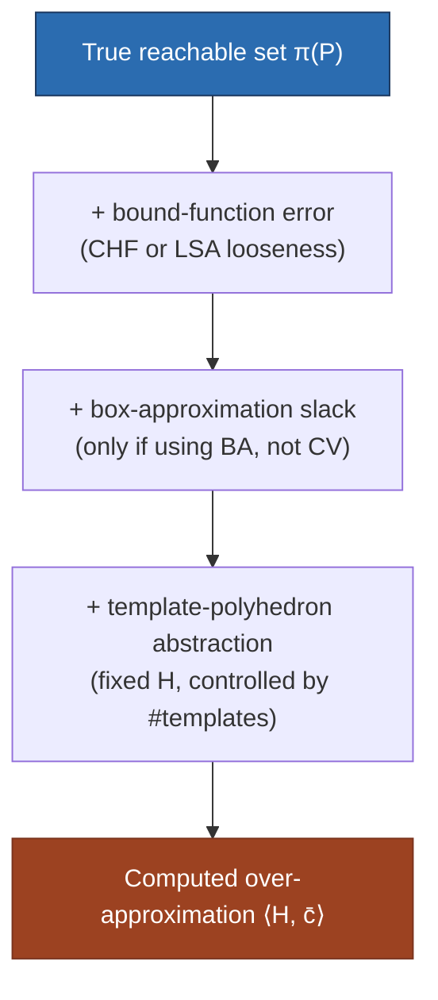
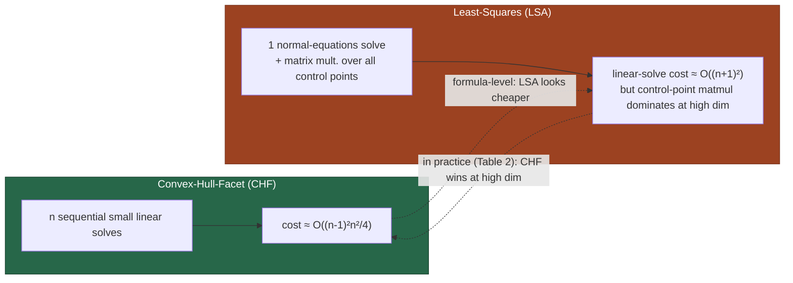

# Approximation Error and Computational Complexity

[[book-guidelines|↩ Back to guidelines]]

## Why this section exists at all

Every piece of machinery built up so far — the Bernstein control points, the two ways of deriving an affine lower/upper bound from them, the two ways of mapping an arbitrary polyhedron onto the unit box — is an *over-approximation* device. Nothing in the pipeline computes the true reachable set $\pi(P)$; every stage computes something that is guaranteed to contain it, and every one of those guarantees costs some tightness. If you never ask "how much slack am I accumulating, and what does squeezing it out cost me?", you end up with one of two failure modes that show up constantly in verification tooling: either the over-approximation blows up so fast that after a few iterations of the reachability recurrence $X_{k+1} = \pi(X_k)$ everything looks reachable (the analysis is *sound but useless*), or you chase tightness in a way that's computationally so expensive it can't scale past toy examples. Section 7 is the paper's honest accounting of both sides of that ledger: where the error comes from, how fast it shrinks if you spend more computation on it, and what that computation actually costs in each of the two forks the paper has been building — box approximation (BA) vs. change of variables (CV) for domain mapping, and convex-hull-facet (CHF) vs. least-squares (LSA) for bound-function construction.

If you've done any work with abstract interpretation, this is exactly the same conversation as "how much do I lose by widening, and how much does narrowing cost to claw it back" — the vocabulary is different (boxes and Bernstein coefficients instead of lattices and widening operators) but the shape of the tradeoff is identical, which is worth keeping in mind as a throughline for the rest of this note.

## The three places error comes from

The paper is explicit that total over-approximation error is not one number but a sum of three independent sources, each introduced by a different earlier construction:

1. **Bound-function looseness** — the affine functions $u, l$ computed from the Bernstein control points (CHF or LSA) are themselves only *bounds*, not exact reconstructions of the polynomial $\pi$.
2. **Template-polyhedron abstraction** — representing the reachable set as $\langle H, c \rangle$ for a *fixed* template matrix $H$ throws away any facet direction not in $H$; this error is controllable only by adding more template rows (more directions), independent of anything discussed here.
3. **Box-approximation slack** — *only* present when the unit-box map $\tau$ is built via a bounding box (BA); the composed polynomial $\gamma = \pi \circ \tau$ is evaluated over the whole box $\overline{B} \supseteq P$, not just $P$, so points outside $P$ but inside its bounding box still influence the bound. The CV route (Section 5.2) does not pay this cost, because it expresses every $x \in P$ *exactly* as a convex combination of $P$'s own vertices — there is no enclosing shape bigger than $P$ in the picture at all.

Sources (1) and (3) are what Section 7's analysis targets; source (2) is a separate knob (template count) explored experimentally in Chapter 8.



## Lemma 5: the quadratic-convergence bound

### What breaks without a quantitative error bound

Suppose you only knew, qualitatively, "the Bernstein approximation gets better as the box shrinks." That's not enough to make an engineering decision. If shrinking a box by half only shrank the error by half too (linear convergence), then halving the box side length $n$ times to get $2^{-n}$ error would require exponentially many sub-boxes for linear payoff — subdivision would be a losing trade almost everywhere. The entire justification for "when you need more accuracy, subdivide the box" depends on the error shrinking *faster* than the box does. That's precisely what Lemma 5 supplies.

### The statement

Let $C_{\pi,B}$ be the piecewise-linear function interpolating the Bernstein control points of $\pi$ over the box $B$ (this is the "control polygon" of the classical Bernstein/Bézier picture, generalized to $n$ dimensions). Lemma 5 states: for all $x \in B$,

$$
|\pi(x) - C_{\pi,B}(x)| \leq K \rho^2(B)
$$

where:
- $|\cdot|$ is the infinity norm on $\mathbb{R}^n$ (worst-case error over all $n$ output components),
- $\rho(B)$ is the box's **size** — its largest side length,
- $K = \max_{k \in \{1,\ldots,n\}} K_k$, with $K_k = \max_{x \in B;\, i,j \in \{1,\ldots,n\}} |\partial_i \partial_j \pi_k(x)|$ — i.e. $K$ is a uniform bound on the *second partial derivatives* of every component of $\pi$ over $B$.

Read the shape of the bound, not just its symbols: the error is bounded by a constant (depending only on the polynomial's curvature, via its second derivatives — flatter polynomials, smaller $K$) times the box size **squared**. That's the quadratic-convergence claim. The paper notes this specific lemma proves the one-dimensional case rigorously, and that the same quadratic behavior is observed empirically in higher dimensions (citing their earlier Bézier-simplex work), rather than being formally proved there — worth flagging honestly, since it's a place where the paper's rigor downgrades from "proved" to "consistently observed."

### Worked example: what quadratic convergence buys you

Take a toy one-dimensional case, $\pi(x) = x^2$ on the unit box $B = [0,1]$. Its second derivative is constant, $\pi''(x) = 2$, so $K = 2$. Lemma 5 predicts $|\pi(x) - C_{\pi,B}(x)| \leq 2 \cdot 1^2 = 2$ (loose, since this is a global worst case, but let's track the *scaling*, not the constant). Now subdivide $B$ into two sub-boxes of size $\rho = 0.5$ each: the bound on each sub-box drops to $2 \cdot (0.5)^2 = 0.5$ — a $4\times$ reduction in error for a $2\times$ increase in box count. Subdivide again to $\rho = 0.25$: bound drops to $2\cdot(0.25)^2 = 0.125$, another $4\times$ reduction for another $2\times$ in box count. Each halving of $\rho$ buys a *quartering* of the error ceiling — that's what "the payoff is worthwhile but diminishing" (the guidelines' Chapter 7 key question) concretely means: you keep getting more accuracy per subdivision than you'd get under linear convergence, but each additional level of subdivision doubles your linear-programming workload (Algorithm 1 must now solve bound functions and LPs per sub-box) for a fixed per-level quartering of error — a classic accuracy/cost curve that flattens as $\rho \to 0$, since past some point $K\rho^2$ is already smaller than the error from the *other* two sources (template abstraction, LP tolerance) and further subdivision buys nothing visible in the final answer.

### Box subdivision as a mechanism

Concretely, box subdivision means: split $B$ into non-overlapping sub-boxes, compute a bound function on *each* sub-box separately (via CHF or LSA, restricted to that smaller domain — recall Lemma 2 from Chapter 4, that bound functions remain valid on any subset of their original domain), evaluate the coefficient $c_i$ each sub-box's bound function would produce for a given template row, and take the **tightest** (here, largest, since we're forming an over-approximating upper coefficient) resulting value across all sub-boxes as the final coefficient for that row. The paper is candid that at the time of writing this was *ongoing* work — they were searching for a subdivision scheme that provably preserves the quadratic convergence rate, drawing an explicit analogy to subdivision-based polynomial root-finding methods, which face the identical "shrink the search region, watch the bound tighten quadratically" structure.

This is a domain-splitting refinement loop in exactly the sense a CEGAR (counterexample-guided abstraction refinement) loop is: start coarse, detect that the current abstraction is too imprecise for the property you're checking, refine (split) the offending region, recompute, repeat. The paper doesn't use that vocabulary — it's numerical analysis, not model checking — but the mechanism is the same shape, and it's worth naming explicitly since it's exactly the kind of accuracy-vs-cost refinement loop a CSP/abstract-interpretation kernel needs for domain propagation.

## Complexity: box approximation vs. change of variables

Recall the domain-mapping fork from Chapter 5. Both routes ultimately need to solve optimization problems (linear programs, per Algorithm 1) over some unit-box-like domain — but the *dimension* of that domain, and the up-front cost of building the map into it, differ sharply:

- **Box approximation (BA):** the map $\tau$ sends the unit box to an (oriented, via PCA) bounding box of $P$ in $\mathbb{R}^n$ — the LPs are solved in dimension $n$, the state dimension. Building $\tau$ costs only matrix/PCA computation, no combinatorial geometry.
- **Change of variables (CV):** points of $P$ are expressed as convex combinations of $P$'s **vertices**, $x = \sum_j \alpha_j v^j$; after eliminating the redundant $\alpha_l$ (since the $\alpha_j$ sum to 1), the resulting problem lives in dimension $l - 1$, where $l$ is the **vertex count** of $P$. Crucially, $l$ has no fixed relationship to $n$ — a template polyhedron in dimension $n$ can easily have far more than $n$ vertices, especially as more template directions accumulate over iterations of the reachability recurrence. Worse, CV needs the vertex set $V$ of $P$ *explicitly*, and vertex enumeration of a polyhedron is itself a nontrivial (and, the paper's own experiments in Chapter 8 confirm, often dominant) computational cost — this is the concrete mechanism behind the guidelines' Chapter 5 question about CV's scalability.

So the tradeoff is stark: CV buys *zero additional approximation error* (source 3 above vanishes entirely — Lemma 3's proof shows BA's error comes specifically from $P \subsetneq \overline{B}$, a gap CV never introduces since it works with $P$'s own vertices), at the price of (a) a problem dimension that tracks vertex count rather than state dimension, and (b) an explicit, expensive vertex-enumeration step BA never needs. This is exactly what Chapter 8's benchmarks bear out quantitatively — e.g. the Michaelis-Menten case study needs $153.5\text{s}$ for CV versus $11.7\text{s}$ for BA over the same 20 steps, because a polynomial with many monomial terms tends to produce polyhedra with many vertices as the reachability recurrence iterates.

## Complexity: convex-hull-facet vs. least-squares bound functions

This second complexity comparison is stated later in the paper (at the end of Section 8's scalability discussion, right before Table 2's numbers are explained) rather than inside Section 7 itself, but it answers precisely the question Section 7 raises about the CHF/LSA tradeoff, so it belongs here rather than treated as a separate topic.

Recall the mechanics from Chapter 4: CHF builds a sequence of $n$ affine functions $l_1, \ldots, l_n$, each iteration solving a small linear system to find a new pivoting direction orthogonal to the previous ones; LSA instead solves *one* linear least-squares problem (the normal equations $A^T A \zeta = A^T b$) over all control points at once, then shifts the result down to guarantee validity as a lower bound.

The paper's own complexity accounting, using the standard $O(n^3)$ cost of Gaussian elimination for solving a dense $n \times n$ linear system:

- **CHF:** effectively requires solving a sequence of smaller and smaller linear systems (dimension shrinking as more directions get pinned down at each iteration $j = 1, \ldots, n$) — the paper states its total cost as roughly

$$
O\!\left(\frac{(n-1)^2 n^2}{4}\right)
$$

- **LSA:** requires solving $n$ systems of linear equations in increasing dimension from $1$ to $n$ (the normal equations, refit at increasing size) but the paper reports its total linear-system-solving cost as

$$
O\!\left((n+1)^2\right)
$$

Read naively, LSA's formula looks *cheaper* than CHF's — and by the linear-algebra bookkeeping alone, it is. But the paper is explicit that this comparison is incomplete: LSA pays an extra, separate cost that this formula doesn't capture — **matrix multiplication over the full set of control points**, and the number of control points grows combinatorially with the polynomial's degree and dimension (recall $b_i$ is indexed over the full multi-index set $I_d$ from Chapter 3). When the control-point count is large, this matrix-multiplication overhead dominates and *reverses* the apparent advantage — which is exactly why the guidelines' Chapter 7 key question flags that Chapter 8's Table 2 shows LSA becoming *less* efficient than CHF at high dimension, despite the formula-level comparison above suggesting otherwise. This is a useful, general lesson independent of this specific paper: an asymptotic complexity comparison of one *sub-step* of an algorithm can be actively misleading if a different sub-step's cost, invisible in that formula, scales worse with the same parameter.



## Grounding the error/cost tradeoff in code

**Rust — the subdivision refinement loop.** The box-subdivision mechanism is a natural fit for a small, typestate-flavored Rust sketch: a `BoundFunction` trait computed per sub-box, and a refinement driver that mirrors a CEGAR loop.

```rust
/// An affine bound function l(x) = sum(coeffs[k] * x[k]) + intercept,
/// valid over some box domain.
struct AffineBound {
    coeffs: Vec<f64>,
    intercept: f64,
}

trait BoundFunctionMethod {
    /// Compute a lower affine bound for `poly` over `domain` (CHF or LSA).
    fn lower_bound(&self, poly: &Polynomial, domain: &Box) -> AffineBound;
}

/// A box in R^n, given as per-dimension [lo, hi] intervals.
struct Box {
    intervals: Vec<(f64, f64)>,
}

impl Box {
    /// Largest side length rho(B), the quantity Lemma 5 bounds error by.
    fn rho(&self) -> f64 {
        self.intervals
            .iter()
            .map(|(lo, hi)| hi - lo)
            .fold(0.0, f64::max)
    }

    /// Split along the widest dimension — the natural subdivision heuristic,
    /// since Lemma 5's bound is driven by the single largest side length.
    fn subdivide(&self) -> (Box, Box) {
        let widest = self
            .intervals
            .iter()
            .enumerate()
            .max_by(|(_, a), (_, b)| (a.1 - a.0).partial_cmp(&(b.1 - b.0)).unwrap())
            .map(|(i, _)| i)
            .unwrap();
        let (lo, hi) = self.intervals[widest];
        let mid = (lo + hi) / 2.0;
        let mut left = self.intervals.clone();
        let mut right = self.intervals.clone();
        left[widest] = (lo, mid);
        right[widest] = (mid, hi);
        (Box { intervals: left }, Box { intervals: right })
    }
}

/// Refine sub-boxes until the Lemma-5 error ceiling K * rho(B)^2 drops
/// below a target tolerance, or a depth budget is exhausted — the same
/// stopping-condition shape as a CEGAR refinement loop.
fn refine_until_tight(
    domain: Box,
    k_bound: f64,
    tolerance: f64,
    max_depth: u32,
) -> Vec<Box> {
    if k_bound * domain.rho().powi(2) <= tolerance || max_depth == 0 {
        return vec![domain];
    }
    let (left, right) = domain.subdivide();
    let mut result = refine_until_tight(left, k_bound, tolerance, max_depth - 1);
    result.extend(refine_until_tight(right, k_bound, tolerance, max_depth - 1));
    result
}
```

The point worth carrying forward: `refine_until_tight`'s termination condition is literally Lemma 5's inequality read as a stopping test, and its recursive-split structure is the same control-flow shape you'll want for adaptive abstract-domain refinement (splitting an interval or octagon domain when a spurious counterexample forces more precision) — the numeric constant changes, the refinement architecture doesn't.

**Lean — stating (not proving) the soundness lemma.** Lemma 5 is exactly the kind of quantitative soundness statement a trusted kernel needs to certify before an over-approximation is used downstream. Stating it in Lean makes explicit what such a certificate looks like, even without carrying out the (nontrivial, degree-dependent) proof:

```lean
-- π : the true polynomial map; C : its piecewise-linear Bernstein-control-point
-- interpolant over box B; K : a bound on π's second partials over B.
theorem bernstein_quadratic_error
    (π C : (Fin n → ℝ) → (Fin n → ℝ)) (B : Box n) (K : ℝ)
    (hK : ∀ x ∈ B, ∀ i j k, |secondPartial π k i j x| ≤ K) :
    ∀ x ∈ B, ‖π x - C x‖∞ ≤ K * (rho B) ^ 2 := by
  sorry
```

This is the same posture your compiler's abstract-interpretation passes will eventually need: a Lean-checkable (or at minimum Lean-*stateable*) soundness certificate for every approximation the analyzer performs, with the `sorry` standing in for exactly the kind of real-analysis proof obligation that a numerically-oriented static analyzer has to either prove once and trust forever, or re-derive per abstract domain.

**Python — a five-line empirical sanity check.** Before trusting a subdivision scheme, it's cheap to just verify the quadratic decay numerically, which is closer to how you'd actually debug a bound-function implementation:

```python
import numpy as np

def bernstein_error(poly, box_width, samples=200):
    xs = np.linspace(0, box_width, samples)
    true_vals = poly(xs)
    linear_interp = np.interp(xs, [0, box_width], [poly(0), poly(box_width)])
    return np.max(np.abs(true_vals - linear_interp))

# halving box_width should roughly quarter the returned error
```

## Where this leads

This section is the paper's bridge from "here is machinery that is sound" to "here is what that soundness costs, and how to buy more of it." Chapter 8's experimental tables (Table 1 for BA vs. CV, Table 2 for LSA vs. CHF) exist specifically to confirm the two complexity comparisons made here against real measured runtimes — the dimension-9 ceiling in the random-systems scalability study is a direct, practical consequence of CV's vertex-enumeration cost and LSA's control-point matrix-multiplication cost both explored in this section. Conceptually, this is the paper's version of the accuracy/cost refinement question that recurs throughout static analysis (`static-analysis`) and constraint-based verification (`sat-smt-csp`): box subdivision here is structurally the same move as counterexample-guided abstraction refinement or adaptive domain splitting in a CSP/abstract-interpretation kernel — start coarse and cheap, refine only the regions where the current bound is provably too loose, and stop once the residual error ceiling falls below what the rest of the pipeline (here, template-polyhedra abstraction) can even preserve.
