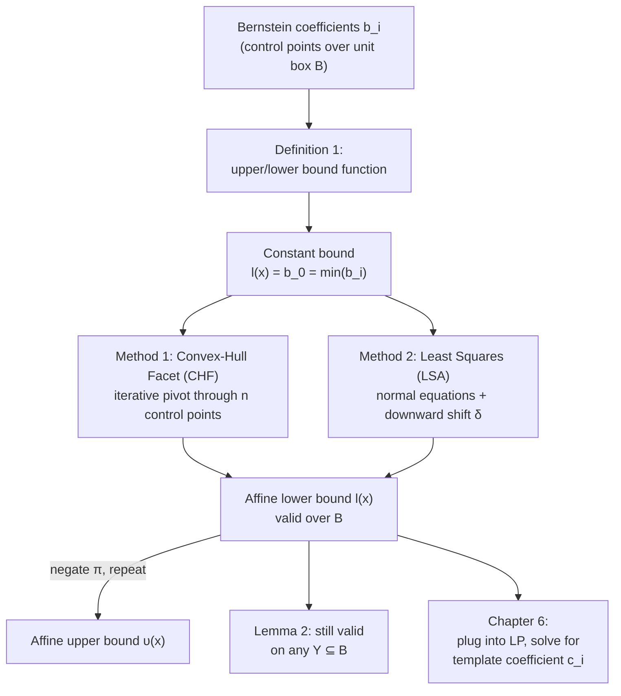

[[book-guidelines|↩ Back to guidelines]]

## Why you'd want an affine bound function at all

Back up to the actual problem the paper is trying to solve. Reachability analysis needs to answer, at every step of the recurrence $X_{k+1} = \pi(X_k)$, a question of the shape "what's the largest value $s(x)$ can take, for $x$ ranging over some polyhedron $P$?" — where $s$ is built out of the components of a multivariate polynomial $\pi$. That's the definition of the template-polyhedron coefficient: $c_i = \max_{x \in P} H^i \cdot \pi(x)$.

Taken at face value, this is a **polynomial optimization problem** over a continuous domain. That's bad news computationally — polynomial optimization is NP-hard in general, and even numerically approximate solvers scale poorly with dimension. This is exactly the bottleneck that sank the authors' earlier Bézier-simplex method past dimension 3–4.

The move this paper makes is: don't solve the polynomial optimization problem directly. Instead, sandwich the polynomial between two **affine** functions — a $\upsilon$ that never goes below it, and an $l$ that never goes above it — over the domain of interest, and then optimize the affine function instead. Maximizing an affine function over a polyhedron is a **linear program**, solvable in polynomial time by mature, off-the-shelf machinery (the authors literally call out `lpsolve`). This single substitution — "replace polynomial optimization with linear programming, at the cost of a controlled looseness" — is the mechanical heart of the entire paper. Everything downstream (Chapter 5's domain mappings, Chapter 6's algorithm) exists to set up or exploit this substitution correctly.

What you lose in exchange is exactness: an affine bound is not the polynomial's true extremum, so the resulting template polyhedron over-approximates $\pi(P)$ rather than computing it exactly. In reachability analysis for safety verification, over-approximation is fine — even required, since a sound safety proof only needs "the true reachable set is contained in the region I checked," never a tight characterization of it. What would *not* be fine is an under-approximation, which could let a genuinely reachable unsafe state slip outside the computed region. This is why the paper is careful to define bound functions as strict inequalities that hold everywhere on the domain, not as best-fit approximations that happen to usually work.

If you've touched **abstract interpretation** before, this should feel structurally familiar: a bound function here is playing exactly the role of an abstraction map that must be *sound* (never miss a concrete behavior) even if it isn't *precise* (it may include spurious ones). The entire CHF/LSA tradeoff explored below is a precision/cost tradeoff of the same flavor as choosing a coarser or finer abstract domain in a static analyzer — more on this in the closing synthesis.

## Definition: upper and lower bound functions

The paper states this formally and it's worth keeping the definition exact, because everything else is a construction method that must satisfy it:

> **Definition 1.** Given $f : \mathbb{R}^n \to \mathbb{R}$, the function $\upsilon : \mathbb{R}^n \to \mathbb{R}$ is called an **upper bound function** of $f$ with respect to a set $X \subset \mathbb{R}^n$ if $\forall x \in X : f(x) \le \upsilon(x)$. A **lower bound function** is defined symmetrically ($l(x) \le f(x)$ for all $x \in X$).

Two structural facts follow immediately, and the paper uses both without ceremony:

**Symmetry between upper and lower bounds.** If $l$ is a lower bound function for $-\pi$ with respect to $X$, then $-l$ is an upper bound function for $\pi$ with respect to $X$: $l(x) \le -\pi(x) \;\Leftrightarrow\; -l(x) \ge \pi(x)$. So the paper only ever needs to *engineer* lower-bound methods; upper bounds come for free by negating the polynomial, running the same machinery, and negating the result. This is possible specifically because Bernstein coefficients transform linearly under negation of the polynomial — the coefficient of $-\pi$ at multi-index $i$ is exactly $-b_i$ (immediate from linearity of Eq. 6, $b_i = \sum_{j \le i}\binom{j}{i}/\binom{d}{i}\, a_j$), so "compute a lower bound for $-\pi$" reduces to running the identical control-point-based construction on the negated coefficients.

**Lemma 2 (monotonicity under domain restriction).** Given $X, Y \subseteq \mathbb{R}^n$ with $Y \subseteq X$: if $\upsilon$ is an upper (lower) bound function of $f$ with respect to $X$, it is *also* an upper (lower) bound function of $f$ with respect to $Y$.

This sounds almost too obvious to state — of course an inequality that holds everywhere on a bigger set holds on a subset of it — but it's load-bearing for the algorithm's later refinement step (Chapter 6): once you've computed bound functions valid over the whole unit box $B$, you can *reuse them unchanged* over any smaller sub-region (e.g. $\tau^{-1}(X_k)$, the image of the current reachable-set estimate mapped back into $B$) and they remain sound — you just don't automatically get a *tighter* bound for free; tightening requires actually recomputing on the smaller domain. Lemma 2 is what licenses treating "valid over $B$" as a safe default while leaving room for a cheaper reuse-without-recomputation path when precision demands are lower.

**What breaks without this restriction to the unit box.** Every construction method in this chapter — the constant bound, the convex-hull-facet method, the least-squares method — depends on the Bernstein control points $b_i$, and those are only meaningfully defined by Eq. 6 when the reference domain is the unit box $B = [0,1]^n$. After the very first reachability step, the polyhedral over-approximation $X_k$ will generally *not* be inside $B$ anymore. So everything in this section is deliberately scoped: it solves "bound a polynomial over the unit box" as a clean sub-problem, and Chapter 5 (mapping polyhedra to the unit box) is the machinery that lets you keep invoking this sub-problem at every step despite the domain drifting away from $B$.

## The trivial bound: the constant from the minimum control point

Recall from the Bernstein expansion's convex-hull property (Lemma 1) that the polynomial's graph over $B$ is contained in the convex hull of its control points $\{(i/d,\, b_i)\}$. One immediate corollary: since every value $\pi(x)$ for $x \in B$ lies inside that convex hull, it's bounded below by the *smallest* control point value and above by the *largest*.

$$
l(x) = b_0, \qquad b_0 = \min\{\, b_i \mid i \in I_d \,\}
$$

This is a valid lower bound function by construction — a flat plane sitting under the entire control-point cloud, hence under the entire polynomial surface. It costs essentially nothing to compute: one pass over the already-computed Bernstein coefficients.

**What breaks without going further.** A constant bound throws away all of the polynomial's directional information. If $\pi$ is, say, strongly increasing across the box, $l(x) = b_0$ is the value at the very bottom of the range, used as the bound *everywhere* — including where $\pi$ is far larger. Plugged into a template-polyhedron optimization, this yields enormous over-approximation: the reachable-set estimate inflates step after step until it's useless for proving any interesting safety property. The paper introduces it only as the trivial base case before immediately building something better — you should read $l(x) = b_0$ as a correctness sanity check ("any lower bound method must never do *worse* than this"), not as a usable method in its own right.

## Method 1: the convex-hull lower facet (CHF)

The idea: instead of a flat plane through the single lowest point, tilt a hyperplane so it touches a whole **facet** of the control-point convex hull's lower boundary — the tightest possible affine surface that still stays under every control point. Geometrically this is "find the supporting hyperplane of the lower hull," done incrementally, one coordinate direction at a time.

[[Mapping-General-Polyhedra-to-the-Unit-Box#The construction|The construction]] is iterative over $n$ steps (one per dimension), each step refining the previous bound by pivoting the hyperplane through one more control point, in a direction orthogonal to all previously used directions. Concretely, for a single polynomial component $p(x)$ (the paper drops the component subscript $k$ for readability) with Bernstein coefficients $b_i$:

**Iteration 1.**
- Fix the first coordinate direction, $u_1 = (1, 0, \ldots, 0)$.
- For every control point $i$ that differs from the minimizer $i_0$ (where $b_{i_0} = b_0$) along that direction, compute the *slope* from $b_0$ to $b_i$ along $u_1$:

$$
g^1_i = \frac{b_i - b_0}{\, i[1]/d[1] - i_0[1]/d[1] \,}
$$

- Let $i_1$ be the multi-index achieving the **smallest absolute slope**. Pivot the hyperplane through that control point:

$$
l_1(x) = b_0 + g^1_{i_1}\, u_1 \cdot (x - i_0/d)
$$

Why the *smallest* absolute slope, and not the largest? Because you're building a *lower* bound — you want the shallowest possible tilt that still doesn't cross above any control point. The steepest slope would overshoot and cut through the cloud; the shallowest slope that clears everything is the one defining the true supporting facet in that direction.

**Iteration $j = 2, \ldots, n$.** Each subsequent step needs a *new* direction $\bar u_j = (\beta_1, \ldots, \beta_{j-1}, 0, \ldots, 0)$ orthogonal (in the sense $\bar u_j \cdot (i^k - i_0)/d = 0$ for all previously used indices $k < j$) to every direction chosen so far — this requires solving a $(j-1)\times(j-1)$ linear system for the $\beta$'s, then normalizing to get $u_j$. Slopes are then measured *relative to the running bound $l_{j-1}$, not the raw control points*:

$$
g^j_i = \frac{b_i - l_{j-1}(i/d)}{(i/d - i_0/d)\cdot u_j}
$$

Again take the multi-index $i_j$ with smallest absolute slope, and update:

$$
l_j(x) = l_{j-1}(x) + g^j_{i_j}\, u_j \cdot (x - i_0/d)
$$

After $n$ iterations, $l_n$ is the final bound: an affine hyperplane that passes exactly through a genuine lower facet of the control-point convex hull, hence the tightest affine function that stays under every control point (and, by the convex-hull property, under $\pi$ itself on $B$).

**Worked intuition in 2D.** Picture control points scattered over a grid $(i_1/d_1, i_2/d_2)$ with heights $b_i$. Iteration 1 finds the shallowest ramp in the $x_1$ direction starting from the lowest point — this is like finding the two lowest points along one row of the grid and drawing a line through them. Iteration 2 then tilts that ramp (now treated as a plane orthogonal to a *new* direction) to also clear the lowest points off that row, in the $x_2$ direction. The end result is a plane resting on three control points — exactly a facet of the lower hull of a 2D point cloud, the geometric picture generalizing directly to $n$ dimensions with an $n$-point-supported hyperplane.

**What breaks without the orthogonality constraint.** If you didn't require each new pivot direction to be orthogonal to the previous ones, successive tilts could "fight" each other — a later adjustment could re-tilt the hyperplane back below where an earlier direction had already made it tight, without you re-checking that earlier direction's constraint. The orthogonal-direction discipline is precisely what guarantees each iteration's improvement is preserved by all subsequent ones, so the final $l_n$ really is tight against $n+1$ independent control points rather than an arbitrary looser plane.

## Method 2: linear least squares approximation (LSA)

The convex-hull-facet method chases the *single tightest* supporting hyperplane, which means it's dominated entirely by whichever handful of control points happen to sit on the lower hull — potentially a very unrepresentative sliver of the whole coefficient set if the polynomial's shape is irregular. The second method instead fits a hyperplane to *all* the control points using ordinary linear least squares, then nudges it down until it's a valid lower bound.

Set up the standard linear regression: let $\{i^j \mid 1 \le j \le n_b\}$ enumerate all $n_b$ multi-indices (one row per control point), and build the design matrix $A \in \mathbb{R}^{n_b \times (n+1)}$ with

$$
A_{jk} = \frac{i^j_k}{d_k} \ (1 \le k \le n), \qquad A_{j,\,n+1} = 1
$$

— i.e. each row is the control point's normalized coordinates plus a constant-1 column for the intercept. Solve the **normal equations**

$$
A^T A\, \zeta = A^T b
$$

for $\zeta \in \mathbb{R}^{n+1}$, giving the least-squares hyperplane

$$
\tilde l(x) = \sum_{k=1}^n \zeta_k x_k + \zeta_{n+1}.
$$

This $\tilde l$ is the "median" plane through the control-point cloud — it minimizes total squared vertical deviation, exactly like fitting a line of best fit to scattered data, generalized to $n$ dimensions. But a best-fit plane is *not* a valid lower bound as-is: by construction, roughly half the control points sit above it and half below. To fix this, shift it straight down by the worst-case violation:

$$
\delta = \max_{0 \le j \le n_b} \left\{ \tilde l(i^j/d) - b_j \right\}
$$

$$
l(x) = \tilde l(x) - \delta, \qquad \text{for all } x \in B
$$

Subtracting $\delta$ (the largest amount by which the fitted plane overshoots any single control point) guarantees $l(i^j/d) \le b_j$ for *every* control point simultaneously — the least generous correction that still restores soundness everywhere.

**Why this can be tighter in practice.** By using every control point's information rather than only the ones on the extreme lower hull, the *slope* of $\tilde l$ tracks the polynomial's overall trend more faithfully. If the polynomial has a mild global slope but one control point is an outlier that drags the CHF construction into a bad direction, LSA's fit can end up noticeably closer to the true surface almost everywhere, at the cost of the uniform downward shift $\delta$ (which is only as large as the single worst outlier's deviation, not applied per-point).

**What breaks without the downward shift.** Skipping $\delta$ and using $\tilde l$ directly is the single most tempting shortcut here, and it's unsound: $\tilde l$ crosses *above* the polynomial's graph for whichever inputs correspond to control points below the fitted plane, silently violating Definition 1. In the context of a safety-verification pipeline, an unsound lower bound could cause the LP to *under*-approximate the polynomial's actual minimum, which downstream could let the reachable-set computation exclude states that are genuinely reachable — precisely the kind of unsoundness that makes a "verified safe" result worthless.

## Comparative complexity: CHF versus LSA

The paper's own complexity comparison (from its experimental section, Section 8.4) is a clean illustration of "big-O similarity doesn't mean equal cost in practice" — worth sitting with because the same lesson recurs constantly in numerical/symbolic tooling.

**Asymptotics of the linear-algebra core.** LSA requires solving $n$ systems of linear equations of increasing dimension from $1$ up to $n$ (one integrates one more dimension per intermediate regression-adjacent step, matching the structure of the running fit), while CHF requires solving just *one* linear system, but in the higher dimension $(n+1)$ (the orthogonal-direction solves at each of the $n$ iterations). Using Gaussian elimination's standard $O(n^3)$ cost for an $n\times n$ system:

- CHF's total: roughly $O\!\big((n-1)^2 n^2/4\big)$
- LSA's total: roughly $O\!\big((n+1)^2\big)$

Read naively, LSA looks like the asymptotic winner — quadratic versus quartic-ish in $n$. But this only accounts for the linear-system-solving cost, and misses a second cost center that dominates in practice.

**The hidden cost: matrix construction and multiplication.** LSA's normal-equation matrix $A$ has one row *per control point*, and the number of control points $n_b = \prod_k (d_k + 1)$ grows combinatorially with both dimension $n$ and polynomial degree $d$. Forming $A^T A$ and $A^T b$ is a matrix-multiplication cost proportional to $n_b$, and $n_b$ is exactly the quantity that explodes. CHF, by contrast, only ever touches control points one at a time when hunting for the minimal-slope pivot at each iteration — a linear scan, not a matrix product.

The paper's Table 2 makes this concrete on randomly generated quadratic polynomials with 5 monomials, timing one bound-function computation per dimension:

| dimension | LSA time (s) | CHF time (s) |
|---|---|---|
| 2 | 0.00005 | 0.0005 |
| 4 | 0.00275 | 0.00263 |
| 6 | 0.0463 | 0.0441 |
| 8 | 0.8012 | 0.4837 |
| 9 | 4.755 | 1.591 |

LSA is actually *faster* at very low dimension (its small linear-algebra core wins when $n_b$ is still small), but the crossover happens early — by dimension 4 the two are comparable, and by dimension 9 CHF is roughly three times faster. The lesson the paper draws explicitly: the *asymptotic formula-level* comparison ($O((n-1)^2n^2/4)$ vs $O((n+1)^2)$) is the wrong thing to extrapolate from, because it ignores the control-point-count-driven matrix multiplication that LSA alone incurs and that grows independently of the "solve one $(n+1)$-dimensional system" cost it's nominally bounded by.

## Grounding: building this as code

This section is squarely in "small numerical linear algebra plus a search over candidate pivots" territory — a very natural fit for Rust, with a quick Python sketch where the ceremony of strict typing would obscure the geometric idea.

**Rust: the shared contract and the constant bound.** A bound function is a closure-like object; model it as a trait so CHF and LSA are interchangeable behind the same interface used later by the LP-based optimizer (Chapter 6's `PolyApp`):

```rust
/// An affine function l(x) = coeffs · x + intercept, guaranteed (by
/// construction, not by the type system) to lower-bound some polynomial
/// over a specific domain.
struct AffineBound {
    coeffs: Vec<f64>,
    intercept: f64,
}

impl AffineBound {
    fn eval(&self, x: &[f64]) -> f64 {
        self.coeffs.iter().zip(x).map(|(c, xi)| c * xi).sum::<f64>() + self.intercept
    }
}

/// Definition 1: the trivial constant lower bound from the minimum control point.
fn constant_lower_bound(control_points: &[f64]) -> AffineBound {
    let b0 = control_points.iter().cloned().fold(f64::INFINITY, f64::min);
    AffineBound { coeffs: vec![0.0; /* n */ 0], intercept: b0 }
}
```

**Rust: LSA via normal equations.** This is where a small linear-algebra crate (e.g. `nalgebra`) earns its keep — the normal equations are a direct transcription of $A^TA\zeta = A^Tb$:

```rust
use nalgebra::{DMatrix, DVector};

/// control_point_coords: one row per control point, columns are i_k/d_k.
/// control_point_values: the Bernstein coefficients b_i, same row order.
fn lsa_lower_bound(
    control_point_coords: &DMatrix<f64>,
    control_point_values: &DVector<f64>,
) -> AffineBound {
    let n_b = control_point_coords.nrows();
    let n = control_point_coords.ncols();

    // Build A: coords plus a constant-1 intercept column.
    let mut a = DMatrix::<f64>::from_element(n_b, n + 1, 1.0);
    a.view_mut((0, 0), (n_b, n)).copy_from(control_point_coords);

    // Normal equations: (A^T A) zeta = A^T b.
    let ata = a.transpose() * &a;
    let atb = a.transpose() * control_point_values;
    let zeta = ata.lu().solve(&atb).expect("A^T A should be well-conditioned here");

    let coeffs: Vec<f64> = zeta.rows(0, n).iter().cloned().collect();
    let raw_intercept = zeta[n];

    // delta = worst-case overshoot at any control point; shift down by it.
    let delta = (0..n_b)
        .map(|j| {
            let row = control_point_coords.row(j);
            let fitted: f64 = row.iter().zip(&coeffs).map(|(x, c)| x * c).sum::<f64>() + raw_intercept;
            fitted - control_point_values[j]
        })
        .fold(f64::NEG_INFINITY, f64::max);

    AffineBound { coeffs, intercept: raw_intercept - delta }
}
```

Notice how directly `delta` mirrors the paper's $\delta = \max_j(\tilde l(i^j/d) - b_j)$ — this is one of those rare cases where the formal definition *is* the implementation, modulo indexing.

**Python: a quick CHF sketch.** The iterative pivot-selection logic is easiest to see without Rust's ownership ceremony around the running direction list:

```python
def chf_lower_bound_1d_slice(control_points, i0, direction, current_bound):
    """One iteration: find the shallowest slope from the running bound
    to any remaining control point along `direction`, in the spirit of
    the paper's g^j_i computation."""
    best_slope, best_i = None, None
    for i, b_i in control_points.items():
        denom = sum((i[k] - i0[k]) * direction[k] for k in range(len(i)))
        if abs(denom) < 1e-12:
            continue
        slope = (b_i - current_bound(i)) / denom
        if best_slope is None or abs(slope) < abs(best_slope):
            best_slope, best_i = slope, i
    return best_slope, best_i
```

**What breaks without the LP reduction, made concrete in code.** If you skip bound functions entirely and hand the raw polynomial $s_i(x) = \sum_k H^i_k \pi_k(x)$ to a general nonlinear optimizer to compute each template coefficient $c_i = \max_{x \in P} s_i(x)$, you're solving a genuinely hard non-convex program at *every template row, every reachability step*. The affine-bound-plus-LP reduction is what turns that into $2n$ small linear programs (per Lemma 4 in Chapter 6) with polynomial-time solvers — the difference between a method that stalls past dimension 3–4 (the Bézier-simplex predecessor) and one the paper scales to dimension 9 in its scalability experiments.

## Structural summary



## Where this leads

This chapter is the tool that makes Chapter 6's entire algorithm possible: Algorithm 1's `BoundFunctions` step calls exactly this machinery (CHF or LSA, the paper's implementation supports both) once per polynomial component, per reachability step, and the resulting $(u, l)$ pairs are what let `PolyApp` solve $2n$ linear programs instead of $m$ nonlinear ones. But there's an explicit scoping caveat carried forward from this chapter: everything here is stated "for all $x \in B$" — valid only over the unit box. Chapter 5's two competing methods (box approximation and change of variables) exist entirely to keep feeding this chapter's methods a domain that is, or has been mapped to look like, the unit box, at every step of an iteration whose actual reachable-set domain keeps drifting away from $B$. And the CHF-vs-LSA cost tradeoff quantified here directly explains a pattern in Chapter 8's experiments (LSA competitive at low dimension, losing ground past roughly dimension 4) that would otherwise look like an unexplained empirical curiosity.

For the standing project this vault is built around: this is a clean, small-scale worked instance of the **static-analysis** discipline of trading a hard exact problem for a sound, cheaper over-approximation — precisely the move an abstract interpreter makes when it replaces "the concrete semantics" with "a computable abstract domain," and precisely what your compiler's invariant-generation pass will need to do when translating a program's real (undecidable, in general) behavior into Horn-clause or Hoare-triple constraints that a solver can actually discharge. It's also a small, self-contained case study in **sat-smt-csp** territory: reducing a nonlinear, non-convex satisfiability-adjacent problem (bounding a polynomial) to a linear one is exactly the kind of relaxation a non-linear constraint solver or a CEGAR loop performs when it first tries a linear abstraction of a nonlinear constraint before falling back to more expensive reasoning — and Lemma 2's monotonicity-under-restriction is the same soundness argument that licenses reusing a coarse abstract bound on a refined (shrunk) search domain rather than recomputing it from scratch, a pattern that recurs directly in domain propagation for CSP solvers.
