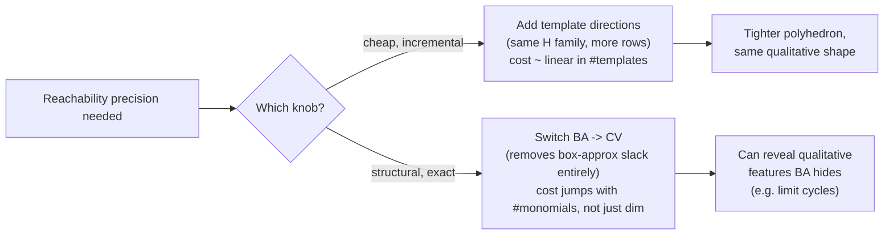

# Experimental Evaluation on Control and Biological Systems

[[book-guidelines|↩ Back to guidelines]]

## Why the paper needs this section at all

Everything up through Section 7 is a story told in inequalities: the convex-hull property of Bernstein coefficients (Lemma 1), two ways to build an affine bound function from those coefficients (the convex-hull-facet method, CHF, and the least-squares method, LSA), two ways to map an arbitrary polyhedron onto the unit box where the Bernstein machinery is valid (box approximation, BA, and the exact change of variables, CV), and a quadratic-convergence result (Lemma 5) promising that all of this gets tighter as boxes shrink. None of that tells you which combination you should actually reach for when you sit down to verify a real controller. Two methods can both be "sound" — both guaranteed to over-approximate — while differing by two orders of magnitude in how expensive they are to compute, or by whether the resulting reachable set is tight enough to see the qualitative behavior you're trying to verify (a limit cycle, a safety envelope) at all.

Section 8 is the paper closing that gap. It picks three systems with different character — a controlled mechanical oscillator, a biochemical reaction network, and a spiking-neuron model — plus a battery of randomly generated polynomials, and uses them to answer four practical questions that the complexity analysis in Section 7 could only gesture at:

1. Is CV's extra precision (it introduces *zero* additional approximation error beyond what template polyhedra already impose — Lemma 3's proof shows BA can't say the same) worth its extra cost in practice, or is it a rounding error next to BA?
2. What actually drives CV's cost up — dimension, or something else?
3. Does the CHF/LSA choice matter as much as the BA/CV choice, and does the answer change with dimension?
3. What does "increase the number of templates" buy you, concretely, and at what price?

If you're used to reading complexity-theory papers where asymptotic bounds settle these questions, note the shape of the argument here: none of Section 8's claims are asymptotic. They're wall-clock seconds on a specific 2.4 GHz Core 2 Duo, running a prototype the authors built in C++ on top of `lpsolve`. That's the right instrument for the question being asked — "is this practical" is an empirical question, not a proof.

**What breaks without this section:** without it, the paper would be a set of soundness theorems and complexity bounds that never confront the fact that "sound" and "useful" are different properties. A method can be sound and produce a reachable-set over-approximation so loose it certifies nothing (e.g. an unbounded box), or so expensive that it's sound only in principle. Section 8 is where you learn that CV's soundness *advantage* over BA (no box-approximation slack) is real and visible in the figures, but that the price for it is not uniform — it depends heavily on how many monomial terms the system's polynomials have, which is a fact no complexity bound stated purely in terms of dimension $n$ would predict.

## Experimental setup

The implementation detail matters here because it explains *why* certain numbers behave the way they do later:

- Bound functions and the LP reformulation (Algorithm 1, Eq. 10) are computed by a prototype in C++, compiled with GCC 4.4.0.
- Linear programs are solved with `lpsolve`.
- All experiments ran single-threaded on Ubuntu, on an Intel Core 2 Duo at 2.4 GHz with 2 GB RAM — a machine that already looks modest by today's standards, which is worth keeping in mind when reading the absolute times: the point of the numbers is the *relative* comparison between BA/CV and between CHF/LSA, not the absolute wall-clock figures.
- Polynomial composition (forming $\gamma = \pi \circ \tau$ for BA, or $\mu = \pi \circ \nu$ for CV) is done **symbolically** — the prototype does not yet exploit polynomial sparsity. This single implementation choice is the proximate cause of the dimension-9 ceiling in Section 8.4.

Three worked examples anchor the qualitative comparison; the fourth subsection turns to synthetic systems purely to map out scaling behavior.

## 8.1 — The Duffing oscillator: a hybrid switched-control benchmark

The Duffing oscillator is a canonical nonlinear second-order oscillator, here used as a **hybrid** benchmark because a discrete-time predictive controller is spliced onto its continuous dynamics via mode switching. The continuous-time equation is

$$\ddot y(t) + 2\zeta \dot y(t) + y(t) + y(t)^3 = u(t)$$

with damping $\zeta = 0.3$. The cubic term $y^3$ is what makes this a genuinely polynomial (non-affine) system — you cannot linearize it away and expect the reachability computation to mean anything. A forward-difference discretization with sampling period $h = 0.05$ turns it into the discrete-time polynomial map the whole paper is built to handle:

$$x_1[k+1] = x_1[k] + h x_2[k]$$
$$x_2[k+1] = -h x_1[k] + (1-2\zeta h) x_2[k] + h u[k] - h x_1[k]^3$$

The control input $u[k]$ is not a smooth feedback law here — it's a **3-mode switching law** (a piecewise-defined step function in $k$: linear ramp up, linear ramp down, then zero), which is exactly the kind of discrete-mode-plus-continuous-dynamics combination that Chapter 1 defined a hybrid system to be. The initial set is a small rectangle, $2.49 \le x_1 \le 2.51$, $1.49 \le x_2 \le 1.51$.

```python
# Illustrative sketch of the discrete-time Duffing dynamics under the
# paper's 3-mode switching law — not the paper's C++ implementation,
# just enough to see the polynomial map pi being iterated.
def duffing_step(x1, x2, k, h=0.05, zeta=0.3):
    u = (0.5 * k if k <= 10
         else 5 - 0.5 * (k - 10) / 3 if k <= 40
         else 0.0)
    x1_next = x1 + h * x2
    x2_next = -h * x1 + (1 - 2 * zeta * h) * x2 + h * u - h * x1**3
    return x1_next, x2_next
```

The cubic `x1**3` term is precisely what forces the reachability step to go through Bernstein bound functions and an LP rather than a closed-form affine update.

**Result:** over 80 steps, CV's reachable set is *strictly included in* BA's (visible directly in the paper's Figure 1) — a direct empirical confirmation that box approximation's extra slack (from approximating $P$ by an enclosing box $\overline B$ before composing with $\pi$, per Lemma 3) is not merely a theoretical possibility but a real, visible loss of precision here. The cost: **1.25 s (BA) vs. 3.96 s (CV)** for the full 80-step run — roughly a 3× slowdown for the tighter set. The paper also cross-checked CHF against LSA on this same example and found them "equally accurate" — the CHF/LSA choice, unlike the BA/CV choice, doesn't move the needle on this particular benchmark.

## 8.2 — Michaelis-Menten enzyme kinetics: a biochemical network benchmark

This is where the paper stops being about mechanical oscillators and demonstrates the method on a **biological** system, underscoring the "safety verification of hybrid systems and discrete-time biochemical models" motivation from the introduction. The Michaelis-Menten mechanism describes an enzyme $E$ binding a substrate $S$ to form a complex $ES$, which either dissociates back or proceeds to product $P$. With $x_1, x_2, x_3, x_4$ the concentrations of $S, E, ES, P$, the continuous ODEs are

$$\dot x_1 = -\theta_1 x_1 x_2 + \theta_2 x_3, \quad \dot x_2 = -\theta_1 x_1 x_2 + (\theta_2+\theta_3)x_3, \quad \dot x_3 = \theta_1 x_1 x_2 - (\theta_2+\theta_3)x_3, \quad \dot x_4 = \theta_3 x_3$$

A **second-order Runge-Kutta discretization** (step size 0.3) turns this into a 4-variate polynomial system whose right-hand sides ($\pi_1$ through $\pi_4$ in the paper) each carry on the order of ten monomial terms — products like $x_1 x_2$, $x_1^2 x_2$, $x_1 x_2 x_3$, and so on. This detail — *many monomials*, not high dimension — is the whole story of what happens next.

**Result:** CV again achieves slightly more precise reachable sets (consistent with 8.1), but the cost gap widens dramatically: **11.7 s (BA) vs. 153.5 s (CV)** for 20 steps — roughly a 13× slowdown, compared to 8.1's 3×, despite the state space only growing from 2 to 4 dimensions. The paper is explicit about the cause: "the polynomials have many monomial terms, which causes a large number of Bernstein coefficients to consider" — recall from Chapter 3 that the number of Bernstein coefficients $b_i$ for a degree-$d$ polynomial in $n$ variables scales with the multi-index set $I_d$, and CV's change-of-variables substitution (expressing points as convex combinations over the polyhedron's vertex set, Section 5.2) additionally re-derives and re-composes this structure through a symbolic polynomial composition step — exactly the operation the setup notes is *not* exploiting sparsity. This is the empirical answer to Chapter 7's Key Question 1: the accuracy-cost tradeoff of CV degrades with **monomial count**, which need not track dimension at all — a sparse high-dimensional polynomial can be cheaper than a dense low-dimensional one.

The reachable set from an initial ball of radius $10^{-4}$ centered at $(12,12,0,0)$, computed via CV and projected onto the $x_1$ trajectory over the first several steps, is shown to be consistent with independent simulation results from prior work — a sanity check that the over-approximation, while an over-approximation, is not so loose as to be meaningless.

## 8.3 — The FitzHugh-Nagumo neuron model: where precision changes what you can even observe

FitzHugh-Nagumo models the electrical spiking activity of a neuron with a 2-variable polynomial ODE:

$$\dot x = x - x^3 - y + 7/8, \qquad \dot y = 0.08(x + 0.7 - 0.8y)$$

discretized with the (simpler, first-order) Euler scheme at step size 0.2, from an initial octagonal set bounded by $[0.9,1.1]\times[2.4,2.6]$.

**Result — and this is the sharpest finding in the whole section:** with the *same* template (same fixed set of facet directions $H$), the CV-computed reachable set is precise enough to reveal a **limit cycle** — the qualitative signature of sustained neural oscillation — while the BA-computed set is not. This is qualitatively different from 8.1 and 8.2, where BA was merely *looser*; here BA is loose enough to obscure the very phenomenon the analysis exists to detect. Computationally, the gap is close to 8.1's: **5.79 s (BA) vs. 12.73 s (CV)** after 500 steps — a ~2.2× slowdown, i.e. cheap in absolute terms relative to what precision buys you here.

### Template-direction count as an accuracy/cost knob

This subsection then isolates a second, independent lever: holding the mapping method fixed (BA) and varying only **how many template directions** $H$ has. Going from 8 to 20 template directions produces "a significant gain of precision" in the resulting reachable-set envelope, while the computation time increases from 5.79 s to 15.43 s — a factor of roughly 2.7× for 2.5× as many directions, i.e. *the cost scales roughly linearly with the number of templates*, not worse. This is the practical payoff of the abstract domain design choice from Chapter 2: because $H$ is fixed in advance, refining precision is a matter of adding more rows to $H$ (more linear inequalities, more per-row LPs to solve in Algorithm 1) rather than restructuring the whole representation the way adding facets to a general convex polyhedron would require. Template count is thus a genuinely independent knob from the BA-vs-CV choice: you can buy back some of BA's precision loss cheaply by adding templates, without paying CV's cost, though 8.3's headline result shows there are qualitative effects (recovering a limit cycle at all) that more templates under BA might not reach as directly as switching to CV would.



## 8.4 — Scalability on randomly generated polynomial systems

The three worked examples are illustrative but each is a single point in the space of (dimension, degree, monomial density). Section 8.4 instead sweeps that space systematically with randomly generated polynomials (coefficients drawn uniformly from $[-1,1]$), holding neither dimension nor degree fixed, to get a scaling picture rather than a single number.

**Table 1 — BA vs. CV, by dimension and degree** (times in seconds; "nb templates" is the number of template directions used):

| dim | degree $d$ | monomials of degree $d$ | templates | time BA (s) | time CV (s) |
|---|---|---|---|---|---|
| 2 | 2 | 4 | 4 | 0.004 | 0.001 |
| 2 | 3 | 6 | 4 | 0.002 | 0.008 |
| 2 | 4 | 8 | 4 | 0.005 | 0.01 |
| 3 | 2 | 6 | 6 | 0.009 | 0.011 |
| 3 | 3 | 9 | 6 | 0.023 | 0.043 |
| 3 | 4 | 12 | 6 | 0.068 | 0.158 |
| 4 | 2 | 8 | 8 | 0.041 | 0.065 |
| 4 | 3 | 12 | 8 | 0.184 | 0.62 |
| 4 | 4 | 16 | 8 | 0.87 | 6.112 |
| 5 | 2 | 10 | 10 | 0.265 | 0.501 |
| 5 | 3 | 15 | 10 | 15.44 | 1.484 |
| 6 | 2 | 12 | 12 | 1.031 | 4.508 |
| 7 | 2 | 14 | 14 | 5.889 | 51.334 |

**Table 2 — LSA vs. CHF, by dimension**, on random quadratic systems with 5 monomials, box templates, average bound-function time for a single reachability step:

| dim | LSA (s) | CHF (s) |
|---|---|---|
| 2 | 0.00005 | 0.0005 |
| 3 | 0.00016 | 0.00016 |
| 4 | 0.00275 | 0.00263 |
| 5 | 0.0117 | 0.0116 |
| 6 | 0.0463 | 0.0441 |
| 7 | 0.1497 | 0.1191 |
| 8 | 0.8012 | 0.4837 |
| 9 | 4.755 | 1.591 |

Three findings, each answering one of Chapter 7's open questions with data:

1. **Time grows roughly linearly in the number of reachability steps**, for both methods, at fixed dimension and template count. The paper's explanation is architectural, not incidental: because template polyhedra fix the number of constraints in advance, the polyhedral bookkeeping per step (unlike general convex polyhedra, where operations like the convex hull can grow the number of vertices/constraints as iteration proceeds) has *bounded* per-step cost — so the per-step LP-and-bound-function work simply repeats, giving linear growth in total time. This directly answers Chapter 8's own Key Question 2: the bottleneck that would make growth *non*-linear (uncontrolled geometric complexity of the abstraction) is exactly what template polyhedra were chosen in Chapter 2 to avoid.

2. **CV degrades faster than BA as dimension and monomial count grow** — visible in Table 1's later rows (e.g. dim 5, degree 3: 15.44 s for BA vs. only 1.484 s for CV in that one row — note the numbers cross over depending on which factor, degree or dimension, dominates a given row; at dim 7, degree 2, CV costs 51.3 s against BA's 5.9 s). Recall from Section 5.2 that CV's LPs are posed in dimension $(l-1)$, the vertex count of the polyhedron minus one, which typically grows faster than the state dimension $n$ itself as the polyhedron's shape becomes richer — this, plus the *symbolic* (non-sparse) polynomial composition, compounds badly.

3. **CHF pulls ahead of LSA as dimension increases**, despite Chapter 7's formula-level complexity estimates ($O((n-1)^2n^2/4)$ for CHF vs. $O((n+1)^2)$ for LSA on the underlying linear solve — nominally *favoring* LSA) — at dimension 9, LSA takes 4.755 s against CHF's 1.591 s, a reversal that's actually consistent with the *lower* solve cost per system that the formulas suggest, once you also weigh in what the formulas don't capture: LSA additionally requires "costly matrix multiplication when the number of control points is large" (Section 8.4's own explanation), and the number of control points — one per multi-index in $I_d$ — grows combinatorially with dimension, independent of the linear-solve cost itself. This is the answer to Chapter 7's Key Question 2: the two methods' *linear-algebra* complexity formulas were never the whole cost story, and the missing term (control-point-matrix size) is exactly what dominates at higher dimension.

**Why the ceiling is at dimension 9, not higher:** the paper is candid that testing stopped there because "polynomial composition becomes prohibitively costly" — a direct consequence of doing polynomial composition (forming $\gamma = \pi\circ\tau$ or $\mu=\pi\circ\nu$) symbolically rather than exploiting sparsity, exactly the implementation caveat flagged in the setup. This is not a fundamental limit of the Bernstein/template-polyhedra method itself — the paper's own closing section (Ch. 9) names sparse polynomial composition via *blossoming* and interpolation-based Bernstein-coefficient computation as the concrete future directions that would push this ceiling higher.

## What breaks without this whole section

Without Section 8, a reader would have no principled way to choose between BA and CV, or between CHF and LSA, for a system they actually care about — the choice would be guesswork, or worse, a default that happens to work badly on their particular system (e.g. defaulting to CV on a dense high-monomial-count system like Michaelis-Menten, where it's 13× slower for marginal accuracy gain, versus defaulting to CV on FitzHugh-Nagumo, where it's the only choice that reveals the limit cycle at all). The section converts "both methods are sound" into an actionable decision procedure: use CV when qualitative precision matters and the system is monomial-sparse or low-dimensional; use BA plus more templates when the system is dense or you're iterating many steps and can tolerate template refinement instead of a structural precision upgrade; prefer CHF over LSA once dimension climbs past single digits.

## Where this leads

This section is the empirical payoff of the entire method built in Chapters 2–7, but it also marks the edge of what the current prototype can do: the dimension-9 ceiling and the monomial-count sensitivity observed here are precisely the limitations that Chapter 9's "Related Work and Conclusion" names as open problems (sparse composition via blossoming, symbolic Bernstein-coefficient computation via interpolation) and that motivate the broader claim that Bernstein-based template-polyhedra reachability is a genuine improvement over the authors' prior Bézier-simplex method — not because it's asymptotically faster in the worst case, but because it replaces expensive geometric mesh operations with linear programs whose *practical* cost this section has now actually measured.
