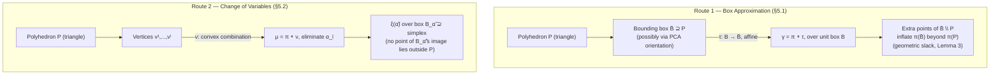

[[book-guidelines|↩ Back to guidelines]]

## Why this problem exists at all

Everything built in the previous section (the Bernstein control points, the convex-hull-facet bound function, the least-squares bound function) has one hard restriction baked into it: it only works when the domain of the polynomial is the **unit box** $B = [0,1]^n$. That restriction isn't a simplification the authors chose for convenience — it's structural. The Bernstein expansion

$$\pi(x) = \sum_{i \in I_d} b_i B_{d,i}(x)$$

is a statement about how $\pi$ behaves *specifically* on $[0,1]^n$; the basis polynomials $B_{d,i}$ and the convex-hull property (Lemma 1) are proved relative to that box. Feed the formula a point outside $[0,1]^n$ and the control points $b_i$ no longer bound anything meaningful.

But the actual objects flowing through the reachability algorithm are never the unit box. They're arbitrary bounded convex polyhedra $P \subset \mathbb{R}^n$ — the current over-approximation $X_k$ of the reachable set, or the initial set $X_0$, described by a template $\langle H, c\rangle$ with whatever shape the template directions happen to carve out. **What breaks without a fix here:** the entire machinery from Section 4 — bound functions, the convex-hull method, least squares, all of it — simply doesn't apply to $X_k$ directly. Every polynomial optimization the algorithm needs to solve is over a general polyhedron, not a box, so without some way to bridge that gap, Chapters 3–4 would be a beautiful tool with no domain to use it on.

Section 5 gives two such bridges. They agree on the *shape* of the fix — find some map $\beta$ from the unit box onto (or into) $P$, then work with the composed polynomial $\pi \circ \beta$ over $B$ instead of $\pi$ over $P$ — but they disagree sharply on whether that map is allowed to be lossy.

## Route 1: approximate $P$ by a box, and pull the polynomial back through it

### The construction

The naive idea — derive a formula for the Bernstein coefficients of $\pi$ directly over an arbitrary box $\overline{B}$ (not anchored at the origin) — is dismissed in one sentence: it's algebraically possible, but "the formula is complex and its representation and evaluation can become expensive." So instead of reformulating Bernstein *coefficients* for a shifted-and-scaled box, the paper reformulates the *polynomial*, and keeps working over the same canonical $[0,1]^n$.

Concretely: let $\overline{B}$ be the smallest axis-aligned box containing $P$, with $\overline{B} = \prod_i [l_i, h_i]$. Define the affine map

$$\tau(x) = \operatorname{diag}(\lambda)\, x + g, \qquad g_i = l_i, \qquad \lambda_i = h_i - l_i.$$

This is nothing more than "unnormalize each coordinate": it stretches the unit interval in dimension $i$ to width $h_i - l_i$ and slides it so it starts at $l_i$. By construction $\tau(B) = \overline{B}$ — $\tau$ takes the unit box exactly onto the bounding box.

Now define the **composed polynomial**

$$\gamma = \pi \circ \tau, \qquad \gamma(x) = \pi(\tau(x)).$$

$\gamma$ is still a polynomial (composing a polynomial with an affine map preserves polynomiality, it just expands the monomials), and — crucially — $\gamma$'s natural domain of interest is $B$, because $\tau$ was built precisely so that $\tau(B) = \overline{B}$. This is the whole trick: instead of re-deriving Bernstein theory for $\overline{B}$, absorb the change of domain into the polynomial itself and reuse Section 4's machinery unchanged, over the same old $B = [0,1]^n$.

### Lemma 3 and where its slack comes from

> **Lemma 3.** Let $\gamma = \pi \circ \tau$. Then $\pi(P) \subseteq \gamma(B)$.

The proof is three lines, and it's worth walking through slowly because the *gaps* in it are exactly what Key Question 1 in the guidelines is asking about:

1. By definition of composition, $\gamma(B) = \{\pi(\tau(x)) \mid x \in B\}$.
2. Since $\tau(B) = \overline{B}$ (by construction), this set is $\{\pi(y) \mid y \in \overline{B}\} = \pi(\overline{B})$.
3. Since $P \subseteq \overline{B}$ (the bounding-box property), monotonicity of image under a function gives $\pi(P) \subseteq \pi(\overline{B})$.

Chaining these: $\pi(P) \subseteq \pi(\overline{B}) = \gamma(B)$. $\blacksquare$

Notice exactly one inequality sign sneaks into an otherwise airtight chain of equalities: step 3, $P \subseteq \overline{B}$. Unless $P$ *is* a box, this inclusion is strict — $\overline{B}$ contains points outside $P$ (its corners, at minimum, and usually a good deal more). Every one of those extra points is a place where $\pi$ can be evaluated and contribute to inflating $\pi(\overline{B})$ beyond what $\pi(P)$ actually needs. This geometric slack exists *before* any bound function is even computed — it's baked into the domain substitution itself, not into the tightness of the Bernstein control points. That's the direct answer to the guidelines' framing: box approximation's extra error is a **geometric** cost of the map $\tau$, layered underneath whatever additional looseness the bound function (Section 4) adds on top.

The proof's last remark is doing real work too: *"The above proof is still valid for any affine function $\tau$."* Nothing in the argument required $\tau$ to be the axis-aligned diagonal map — any affine $\tau$ with $\tau(B) = \overline{B}$ for *some* bounding box $\overline{B} \supseteq P$ works. This licenses the second half of Section 5.1: instead of an axis-aligned box, use an **oriented** (rotated) bounding box, which can hug $P$ far more tightly.

### Oriented boxes via PCA

An axis-aligned box is blind to $P$'s actual orientation — a long thin polyhedron tilted 45° from the coordinate axes gets a bounding box with roughly twice the "wasted" area/volume of one aligned with the polyhedron's own long axis. The paper's fix: compute the bounding box's orientation with **Principal Component Analysis** over $P$'s vertex set. PCA finds the directions of maximal spread in the data (here, the vertices of $P$) as the eigenvectors of the vertex-set's covariance matrix; using those eigenvectors as the new coordinate axes before taking min/max per axis gives a box that's aligned with $P$'s own principal directions rather than the ambient coordinate frame. The general affine map is then $\tau(x) = R \operatorname{diag}(\lambda) x + g$, where $R$ is the rotation formed from the PCA eigenvectors — Lemma 3's proof goes through unchanged since $R\operatorname{diag}(\lambda)x + g$ is still affine.

**What breaks without PCA (or some orientation step):** for polyhedra that are naturally "diagonal" relative to the coordinate axes — which happens constantly once template directions or successive images of $\pi$ start rotating the reachable set — axis-aligned boxes waste enormous volume, and that wasted volume becomes wasted precision in the very next reachability step. PCA doesn't eliminate box approximation's structural slack (Lemma 3's gap is still there), it just minimizes it for a given $P$.

## Route 2: don't approximate $P$ at all — reparametrize it exactly

### Barycentric coordinates as the "true" unit-box map

Section 5.2 takes the opposite bet: rather than accepting a geometric approximation of $P$, express *every point of $P$, exactly*, in terms of a box-shaped parameter space. The tool is the standard fact that any point of a bounded convex polyhedron is a convex combination of its vertices.

Let $V = \{v^1, \ldots, v^l\}$ be the vertex set of $P$ (assumed bounded). Any $x \in P$ can be written

$$x = \sum_{j=1}^{l} \alpha_j v^j = \nu(\alpha_1, \ldots, \alpha_l)$$

subject to

$$\alpha_j \ge 0 \ \ \forall j, \qquad \sum_{j=1}^{l} \alpha_j = 1. \tag{7–8}$$

This is exactly the definition of the standard simplex in barycentric coordinates: $\nu$ is a genuinely *onto* map from $\{\alpha : (7)\text{–}(8)\} $ to $P$ — not a map that happens to cover $P$ plus some slack, but one whose feasible region maps *precisely* onto $P$, nothing more and nothing less.

Substitute $x = \nu(\alpha)$ into $\pi$ to get a new polynomial in the $\alpha_j$'s: $\mu = \pi \circ \nu$, i.e. $\pi(x) = \mu(\alpha_1, \ldots, \alpha_l)$.

### Eliminating the redundant coordinate

There's a subtlety here that a careless implementation would miss: $\alpha_1, \ldots, \alpha_l$ are not $l$ independent variables — constraint (8) pins one degree of freedom. Leaving all $l$ of them in $\mu$ would make the resulting "box" domain $l$-dimensional when the polyhedron itself only has, at most, $n$ genuine degrees of freedom (and often the vertex count $l \gg n$). The paper eliminates the redundancy directly: solve (8) for the last coordinate,

$$\alpha_l = 1 - \sum_{j=1}^{l-1} \alpha_j,$$

and substitute this expression for $\alpha_l$ everywhere it appears in $\mu$, producing a polynomial $\xi(\tilde\alpha)$ in only $\tilde\alpha = (\alpha_1, \ldots, \alpha_{l-1})$ — an $(l-1)$-variable polynomial, one variable fewer than the raw vertex count.

The constraints (7)–(8) restated in terms of $\tilde\alpha$ say: each $\alpha_j \ge 0$ for $j < l$, and $\alpha_l = 1 - \sum \alpha_j \ge 0$ too, i.e. $\sum_{j<l}\alpha_j \le 1$. Geometrically, the *feasible* set for $\tilde\alpha$ is the standard $(l-1)$-simplex, which sits properly inside — but is not equal to — the full unit box $B_{\tilde\alpha} = [0,1]^{l-1}$. The paper's claim is that computing bound functions for $\xi$ over the *full* box $B_{\tilde\alpha}$ (not just the simplex) is still sound and, more importantly, introduces **no additional geometric error relative to $P$**, "unlike in the above-described case of box approximations."

### Why this really is exact where Route 1 isn't

It's worth being precise about what "no additional error" does and doesn't mean here, since it's easy to over-read. The claim is not that optimizing over $B_{\tilde\alpha}$ recovers exactly $\max_{x \in P}$; a bound function evaluated over the box can certainly be looser than one evaluated over the smaller simplex (this is the same monotonicity fact as Lemma 2 from Section 4 — a bound valid on a larger set remains valid, just not necessarily tight, on a subset). What *is* exact is the map itself: unlike $\tau$ in Section 5.1, $\nu$ never introduces points into its range that fall outside $P$. Every feasible $\alpha$ (satisfying (7)–(8)) maps to a real point of $P$, and every point of $P$ arises from some feasible $\alpha$ — there is no analogue of $\overline{B} \supsetneq P$ silently smuggling extra, non-$P$ points into the optimization. Route 1's error is a **geometric** cost paid in $x$-space before the Bernstein machinery even runs; Route 2's only cost is the ordinary, already-accounted-for looseness of a bound function over a domain larger than the tightest possible one — the same kind of slack Section 4 already lives with on the unit box, not a new source layered on top.

This is precisely the tradeoff the guidelines' Key Question 1 is pointing at: **box approximation pays for its simplicity in $x$-space geometry; change of variables pays nothing there, but its bound functions must be computed on a domain ($(l-1)$-dimensional box, sized by vertex count $l$) that can be much higher-dimensional than $n$.** That second cost is deferred to the complexity analysis two sections later, but the seed of it is planted right here: **Key Question 2** in the guidelines — the vertex set $V$ must be known explicitly and $l$ can vastly exceed $n$ (a hypercube in $\mathbb{R}^n$ already has $2^n$ vertices) — is exactly why Chapter 7 finds change-of-variables solving LPs in dimension $l-1$ against box approximation's dimension $n$, and why Chapter 8's experiments consistently show change of variables tighter but far more expensive.

## A concrete comparison

Take $P$ to be the triangle in $\mathbb{R}^2$ with vertices $v^1=(0,0)$, $v^2=(2,0)$, $v^3=(0,2)$.

**Box approximation.** The axis-aligned bounding box is $\overline{B} = [0,2]\times[0,2]$, area 4, versus the triangle's area 2 — the box approximation is carrying exactly twice the geometric content of $P$ before a single bound function is computed. $\tau(x) = \operatorname{diag}(2,2)\,x + (0,0)$, and $\gamma(x_1,x_2) = \pi(2x_1, 2x_2)$ is what Section 4's methods actually see. Any monomial in $\pi$ picks up a factor of $2^{\deg}$ per variable, and the optimization domain silently includes the corner $(2,2)\notin P$.

**Change of variables.** With $l=3$ vertices, $\tilde\alpha = (\alpha_1,\alpha_2)$, $\alpha_3 = 1-\alpha_1-\alpha_2$, and

$$\nu(\alpha_1,\alpha_2) = \alpha_1(0,0) + \alpha_2(2,0) + (1-\alpha_1-\alpha_2)(0,2) = (2\alpha_2,\; 2-2\alpha_1-2\alpha_2).$$

The feasible region $\{\alpha_1,\alpha_2\ge0,\ \alpha_1+\alpha_2\le1\}$ is the unit right triangle, sitting inside — not filling — the unit square $B_{\tilde\alpha}=[0,1]^2$ that the Bernstein machinery is actually run over. There is no analogue of the "corner $(2,2)$" problem: every point $\nu(\alpha)$ for $\alpha$ satisfying the constraints is a genuine point of $P$. The box $B_{\tilde\alpha}$ here happens to have area 1 versus the feasible simplex's area $1/2$ — the same "wasted region under the bound function" phenomenon as before, but it lives entirely on the bound-function side of the ledger, not the geometry side.



## Rust: the two `UnitBoxMap` strategies as one interface

The algorithm in Chapter 6 (`UnitBoxMap`) treats both routes as interchangeable implementations of "give me a map from $B$ (or a box containing the parameter simplex) to something I can compose $\pi$ with." That polymorphism is worth making literal:

```rust
/// A transformation whose domain is (a superset of) the unit box,
/// used to pull a polynomial `pi` back onto B for Bernstein bounding.
trait UnitBoxMap {
    /// Dimensionality of the box this map is defined over
    /// (n for box approximation, l - 1 for change of variables).
    fn box_dim(&self) -> usize;

    /// Apply the map to a point of the (possibly oversized) unit box,
    /// producing a point of the original state space.
    fn apply(&self, box_point: &[f64]) -> Vec<f64>;
}

struct BoxApproximation {
    g: Vec<f64>,        // lower corner (translation)
    lambda: Vec<f64>,   // per-axis scale (h_i - l_i)
    rotation: Option<Vec<Vec<f64>>>, // PCA rotation R, if oriented
}

impl UnitBoxMap for BoxApproximation {
    fn box_dim(&self) -> usize { self.lambda.len() } // = n

    fn apply(&self, x: &[f64]) -> Vec<f64> {
        let scaled: Vec<f64> = x.iter().zip(&self.lambda).map(|(xi, l)| xi * l).collect();
        let rotated = match &self.rotation {
            Some(r) => matvec(r, &scaled),
            None => scaled,
        };
        rotated.iter().zip(&self.g).map(|(v, gi)| v + gi).collect()
    }
}

struct ChangeOfVariables {
    vertices: Vec<Vec<f64>>, // v^1, ..., v^l
}

impl UnitBoxMap for ChangeOfVariables {
    fn box_dim(&self) -> usize { self.vertices.len() - 1 } // = l - 1

    fn apply(&self, alpha_tilde: &[f64]) -> Vec<f64> {
        let l = self.vertices.len();
        let alpha_l = 1.0 - alpha_tilde.iter().sum::<f64>(); // eliminated coordinate
        let dim = self.vertices[0].len();
        let mut x = vec![0.0; dim];
        for (j, &aj) in alpha_tilde.iter().enumerate() {
            for k in 0..dim { x[k] += aj * self.vertices[j][k]; }
        }
        for k in 0..dim { x[k] += alpha_l * self.vertices[l - 1][k]; }
        x
    }
}

fn matvec(m: &[Vec<f64>], v: &[f64]) -> Vec<f64> {
    m.iter().map(|row| row.iter().zip(v).map(|(a, b)| a * b).sum()).collect()
}
```

The `box_dim` method is the whole complexity story from Chapter 7 in one line: `BoxApproximation::box_dim` is fixed at $n$ (the state dimension) no matter how complicated $P$ gets, while `ChangeOfVariables::box_dim` grows with the vertex count $l$, which can blow up combinatorially as the reachable set's shape complexity accumulates over iterations.

## Python: PCA for the oriented box, in five lines

Rust's ceremony would bury the point here; the essence of PCA-for-orientation is just an eigendecomposition of the vertex-set covariance:

```python
import numpy as np

def oriented_box_axes(vertices: np.ndarray) -> np.ndarray:
    # vertices: (num_vertices, n) array of P's vertex coordinates
    centered = vertices - vertices.mean(axis=0)
    cov = centered.T @ centered
    eigvals, eigvecs = np.linalg.eigh(cov)   # eigvecs columns = principal directions
    return eigvecs[:, ::-1]                  # sort by decreasing variance
```

The returned matrix is exactly the rotation $R$ used inside `BoxApproximation` above: project the vertices onto these axes, take per-axis min/max in the rotated frame, and that gives $\lambda$ and $g$ for the tightest axis-aligned box *in the rotated frame* — which is an oriented box in the original frame.

## A remark for the proof-inclined: Lemma 3 as a one-liner in image-of-a-set reasoning

Lemma 3's proof is really just two applications of a fact any reader who has done set-image manipulation in a proof assistant will recognize instantly: image is monotone under subset, and image commutes with function composition. In Lean-style terms, the whole proof is:

```
-- Set.image_comp : (f ∘ g) '' s = f '' (g '' s)
-- Set.image_subset : s ⊆ t → f '' s ⊆ f '' t

theorem lemma3 (P Bbar : Set (Fin n → ℝ)) (hPB : P ⊆ Bbar)
    (τ : (Fin n → ℝ) → (Fin n → ℝ)) (π : (Fin n → ℝ) → (Fin n → ℝ))
    (hτ : τ '' unitBox = Bbar) :
    π '' P ⊆ (π ∘ τ) '' unitBox := by
  rw [Set.image_comp, hτ]          -- (π ∘ τ) '' unitBox = π '' (τ '' unitBox) = π '' Bbar
  exact Set.image_subset π hPB     -- π '' P ⊆ π '' Bbar, from P ⊆ Bbar
```

This isn't a natural fit for the paper's numerical/geometric content overall — the substance of Section 5 is a computational tradeoff, not a type-theoretic one — but it's a useful sanity check: it makes visible, in a kernel that would actually check it, that *every* bit of slack in Lemma 3 traces to the single hypothesis `hPB : P ⊆ Bbar`, and that hypothesis is an equality only when $P$ already is a box. Nothing else in the proof can introduce looseness.

## Where this leads

This section is the hinge the rest of the paper turns on. Chapter 6's `UnitBoxMap` procedure inside Algorithm 1 is literally "run whichever of these two constructions you chose" at every iteration, and Theorem 1's correctness argument depends on Lemma 3 (or its change-of-variables analogue) holding at each step. Chapter 7's complexity analysis is stated directly in terms of the box dimension exposed here — $n$ for box approximation versus $l-1$ for change of variables — and Chapter 8's experiments (Duffing oscillator, Michaelis–Menten kinetics, FitzHugh–Nagumo) are, at bottom, repeated empirical confirmations of the tradeoff derived abstractly in this section: change of variables is tighter because it has no Lemma-3-style geometric slack, and more expensive because its parameter space grows with vertex count rather than staying pinned at $n$.

For the standing project on abstract interpretation and CSP-based verification (`sat-smt-csp`): this is [[Template-Polyhedra-as-an-Abstract-Domain#A worked example|a worked example]] of a **domain-transformation step preceding constraint solving** — exactly the kind of reparametrization a CSP/abstract-interpretation kernel needs whenever the natural representation of a feasible region (a polytope with an inequality description) doesn't match the representation a solver's propagation routine expects (here, a box, because that's what Bernstein-based bounding needs; elsewhere, e.g. interval or octagon domains, the analogous "put it in canonical form first" step recurs constantly). The barycentric substitution of Section 5.2 in particular is a clean instance of an *exact* domain reparametrization — no soundness is spent to change coordinates — a useful pattern to keep in mind when your own CSP kernel needs to move a non-linear constraint into a coordinate system where propagation or bound tightening is tractable, since it demonstrates that "reparametrize exactly" and "approximate cheaply" are genuinely different design points with a precisely quantifiable cost gap (dimension $n$ vs. dimension $l-1$), not just two equally-valid engineering choices.
