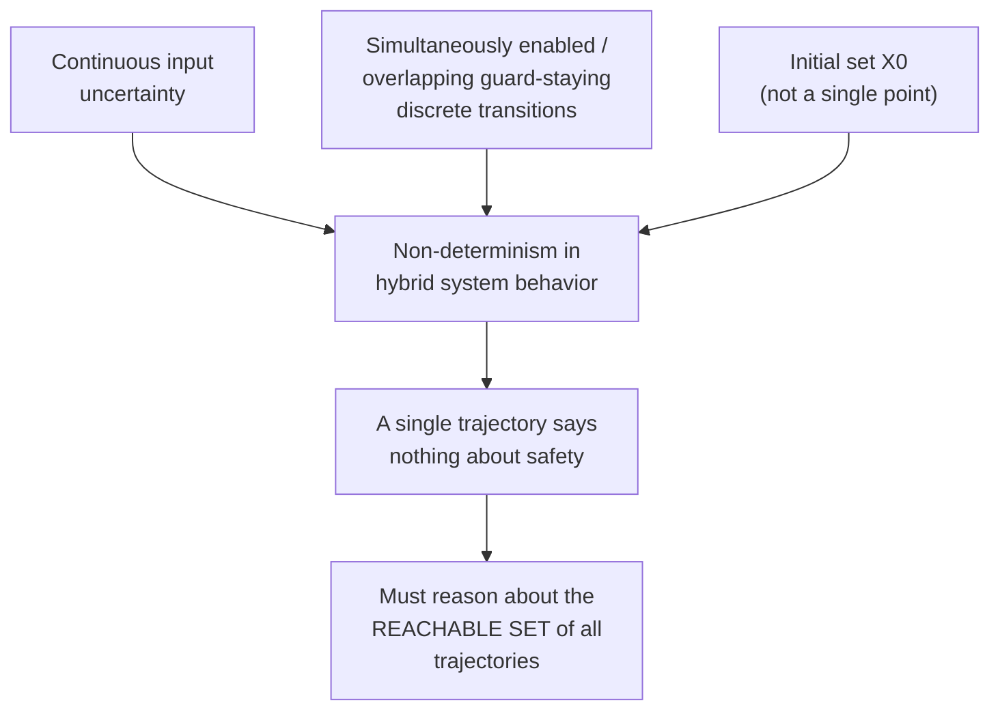
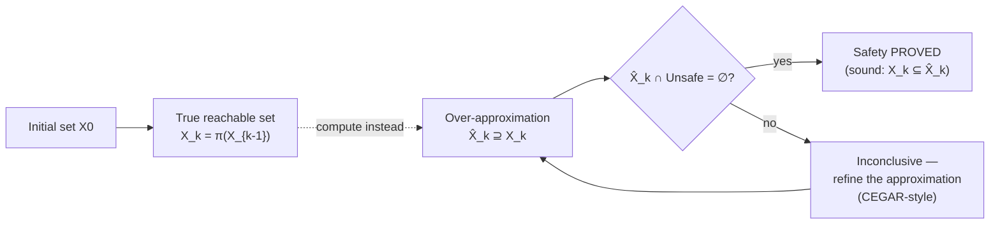

# Reachability Analysis for Hybrid and Polynomial Dynamical Systems

[[book-guidelines|↩ Back to guidelines]]

## Why you can't just simulate

Suppose you want to prove that a controller never lets a system enter a dangerous state — a car's braking distance never crosses into the lane ahead, a chemical concentration never exceeds a toxic threshold. The naive approach is simulation: pick an initial state, run the dynamics forward, check whether the trajectory ever touches the "bad" region. This is cheap, and it's what you'd reach for first as a programmer — it's just calling a function in a loop.

It is also worthless as a *proof*. Simulation tells you about one trajectory. Safety is a universal claim ("the system *never* enters a bad state, for *any* legal execution"), and a universal claim is not established by exhibiting one witness — it's the kind of claim that a single counterexample refutes but that no finite number of positive examples confirms. If your initial condition is only known up to some tolerance (a sensor reading with noise, a biological system whose exact initial concentrations were never measured, an adversarial disturbance you can't rule out), then "the trajectory from *this* initial state is fine" says nothing about the trajectory from an initial state one micrometer away. Worse, real systems are usually **hybrid**: they mix continuous evolution with discrete jumps, and if the choice of *which* discrete transition fires is itself not fully determined by the state, then even a single fixed initial condition can spawn infinitely many distinct trajectories.

This is the problem the paper's Introduction (§1) opens with, and it's the reason the entire machine described in the rest of the paper — template polyhedra, Bernstein bounds, linear programs — exists at all: **safety verification needs to reason about sets of trajectories, not single ones, and the computational core of that is computing reachable sets.**

## Hybrid systems and where non-determinism comes from

The paper models a **hybrid system** as a combination of a discrete process and a continuous one:

- A collection of **continuous modes**. Each mode has an associated vector field governing how $n$ continuous state variables evolve while the system stays inside a subset $X \subseteq \mathbb{R}^n$ of the state space, called the mode's **staying set**.
- **Discrete transitions** between modes, triggered when the continuous state satisfies a **guard** condition attached to that transition.

Between transitions, the system just follows the active mode's continuous dynamics — think of a piecewise-defined ODE where the piece in effect depends on a discrete "mode" variable, and mode switches happen automatically when the trajectory crosses some guard region. A thermostat is the textbook example: "heating" and "idle" are two modes, each with its own temperature ODE, and a guard ("temperature ≤ setpoint − ε") triggers the switch between them.

The paper is explicit that non-determinism enters a hybrid system's behavior from three independent places, and it's worth naming all three because each demands the same fix (sets, not points) for a different reason:

1. **Uncertain continuous input.** The vector field itself can depend on an external disturbance or an under-specified control input that isn't pinned down to one function of time — you don't know exactly what it will do, only that it lies in some range.
2. **Non-determinism in the discrete dynamics.** Two situations can make the *next* discrete transition ambiguous: multiple transitions can be simultaneously enabled (more than one guard satisfied at once), or the system can simultaneously satisfy the current mode's staying condition *and* some transition's guard — meaning it's legal either to keep flowing in the current mode or to jump.
3. **Uncertain initial conditions.** The starting state usually isn't known exactly, but only to lie in some **initial set** $X_0$.

**What breaks without treating this as a set problem:** even if you eliminate sources 1 and 2 entirely (deterministic dynamics, no discrete choices) and keep only source 3, a *single* initial state in $X_0$ already generates one trajectory — but $X_0$ itself is a set, potentially with infinitely many points, each spawning its own trajectory. Proving safety means proving it for every one of them simultaneously. There's no way to discharge that by iterating over "sufficiently many" sample points and calling it done — the space of counterexamples is uncountable and adversarial in the sense that a demonstration that misses the bad region on a dense sample can still miss a thin sliver of unsafe trajectories entirely. The only way to close this gap computationally is to compute (an over-approximation of) the *set* of all reachable states directly, as a mathematical object, rather than as a large but finite sample of it.



## Discrete-time dynamics and the reachable set recurrence

The paper commits to a specific, tractable target: a **discrete-time dynamical system**

$$
x[k+1] = \pi(x[k]) \tag{1}
$$

where $\pi : \mathbb{R}^n \to \mathbb{R}^n$ is a (multivariate) polynomial map — i.e. each of its $n$ output components $\pi_i$ is a polynomial in the $n$ input variables. This single equation is the paper's entire object of study, and it's worth being precise about how it arises, because it isn't the "obvious" way to model a physical system — physical systems are usually described by *continuous-time* differential equations $\dot x = f(x)$, not difference equations.

Two motivating routes into equation (1) are given:

- **Discretization of continuous-time control.** A physical plant governed by a continuous (or hybrid) controller is, in practice, implemented on a digital computer. The computer samples the state at discrete instants and computes a control action using some discretization scheme (Euler, Runge–Kutta, etc.), producing exactly the "next state as a function of current state" structure of (1). The paper is explicit that its results extend to genuinely continuous-time systems *provided* those systems can first be approximated by an appropriate time-discretization scheme — but that this discretization step must itself be done carefully: it needs to **guarantee conservativeness** of the resulting approximation (i.e. the discrete-time reachable set must still over-approximate the true continuous-time reachable set), and this is exactly the role of **enclosure methods** in numerical ODE solving. An enclosure method doesn't just step a point forward; it steps an *interval or region* forward while bounding the local truncation error, so that the discretized recurrence is a sound stand-in for the continuous flow rather than merely a numerical approximation of it.
- **Sampled biochemical data.** Discrete-time polynomial models also arise directly and naturally in biochemical network analysis, because experimental measurements of biochemical reactions are themselves obtained by sampling continuous concentrations at discrete times — the discrete-time model isn't an approximation of something "more real" here, it's the native description of how the data is produced and analyzed.

Given this recurrence, the **reachable set** at time step $k$ is defined exactly the way you'd hope, as an iterated image:

$$
X_{k+1} = \pi(X_k), \qquad X_0 = \text{the initial set}
$$

where for a set $X \subset \mathbb{R}^n$, the image $\pi(X)$ is

$$
\pi(X) = \{(\pi_1(x), \ldots, \pi_n(x)) \mid x \in X\}.
$$

This is worth sitting with, because it is genuinely the entire mathematical content of "reachability": $X_k$ is just $\pi$ applied to itself $k$ times, starting from $X_0$, except that the argument is a *set* at every step instead of a point. Everything else in the paper — Bernstein polynomials, template polyhedra, linear programming — exists purely to answer the question "how do I actually *compute* $\pi(X)$ (or a safe over-approximation of it) when $X$ is a possibly-uncountable set and $\pi$ is a nonlinear polynomial?" There is no closed-form way to push an arbitrary set through a nonlinear map and get back something you can store in memory and iterate again.

**The natural home for this recurrence in a proof assistant is an inductive definition, not a function**, because "reachable in $k$ steps" and "reachable" (in *some* number of steps) are exactly the shape of predicates Lean's `inductive` mechanism exists for:

```lean
-- π as an arbitrary function on the state space; X₀ as a predicate (a set)
variable {n : Nat} (π : (Fin n → ℝ) → (Fin n → ℝ)) (X₀ : (Fin n → ℝ) → Prop)

inductive ReachableAt : Nat → (Fin n → ℝ) → Prop
  | base   : ∀ x, X₀ x → ReachableAt 0 x
  | step   : ∀ k x, ReachableAt k x → ReachableAt (k + 1) (π x)

def Reachable (x : Fin n → ℝ) : Prop := ∃ k, ReachableAt π X₀ k x
```

This is a literal transcription of $X_{k+1} = \pi(X_k)$: `ReachableAt.base` is $X_0$, and `ReachableAt.step` is the recurrence step. `Reachable` — the union over all $k$ — is exactly the set the safety property has to avoid intersecting with the unsafe region. Framed this way, safety verification is a *non-emptiness* question: does `Reachable π X₀` intersect the unsafe predicate? Undecidability of this kind of question for general polynomial dynamics is precisely why the paper resorts to *over-approximation* rather than trying to compute `Reachable` on the nose — the same move abstract interpretation makes for any non-trivial program property.

A Rust sketch of the same recurrence, but now built to actually *run*, exposes the real engineering problem immediately:

```rust
/// A discrete-time polynomial dynamical system x[k+1] = π(x[k]).
trait DynamicalSystem<const N: usize> {
    fn step(&self, x: [f64; N]) -> [f64; N];
}

/// Naive, WRONG way to "compute" a reachable set: sample points and hope.
fn naive_reachable_set<const N: usize>(
    sys: &impl DynamicalSystem<N>,
    samples: &[[f64; N]],
    steps: usize,
) -> Vec<[f64; N]> {
    let mut current = samples.to_vec();
    for _ in 0..steps {
        current = current.iter().map(|&x| sys.step(x)).collect();
    }
    current // <- a finite point cloud, NOT the reachable set.
            //    Anything between the samples is silently unverified.
}
```

This compiles, runs, and produces a plausible-looking scatter of points — and it is exactly the trap the paper's Introduction is warning against. `naive_reachable_set` gives you an *inner approximation sampled from* the true reachable set, when safety verification needs a *superset that contains* the true reachable set. Getting the direction of approximation right — over-, not under-, approximating — is the whole ballgame, and it's why the rest of the paper (template polyhedra, computed via optimization rather than sampling) replaces `Vec<[f64; N]>` with a data structure that can *represent an infinite set exactly enough to bound it*.

## Safety verification as reachable-set containment

With $X_k$ defined, "safety" gets a precise computational meaning: a hybrid system is safe (with respect to an unsafe region $U \subset \mathbb{R}^n$) if $X_k \cap U = \emptyset$ for every $k$. Since exact computation of $X_k$ is generally infeasible — the paper notes this is often undecidable, and even where it isn't, the true reachable set of a nonlinear polynomial map need not have any nice closed form (unlike, say, an ellipsoid propagated by linear dynamics) — the practical approach is to compute an **over-approximation** $\hat X_k \supseteq X_k$ instead, and check $\hat X_k \cap U = \emptyset$.

This substitution is *sound* but not *complete*: if $\hat X_k \cap U = \emptyset$, safety is genuinely proved (since the true reachable set is a subset of something disjoint from $U$). But if $\hat X_k \cap U \neq \emptyset$, that tells you nothing — the intersection might be an artifact of over-approximation slack rather than a genuine unsafe trajectory. The paper states directly that in this situation the approximation needs to be *refined* — i.e. re-run with a tighter over-approximation before concluding anything. This is precisely the shape of **CEGAR** (counterexample-guided abstraction refinement): an inconclusive abstract result triggers refinement of the abstraction, not an immediate verdict. It's also precisely the shape of a **Galois connection**–based abstract interpretation: $\hat X_k$ plays the role of the abstract domain element that soundly over-approximates the concrete semantics $X_k$, and "is the abstraction tight enough to answer the question" is a recurring design axis rather than a one-shot property. (Which concrete family of over-approximating shapes to use — here, *template polyhedra* — and how tight they can be made is the subject of the next topic in this series; what matters here is that the entire reachability *problem statement* is already an abstract-interpretation problem before any specific abstract domain is chosen.)



## The wrapping effect: why "just take a box each step" fails

None of this is specific to hybrid systems or to Bernstein polynomials — it's the standard failure mode of *any* set-based numerical method that repeatedly wraps its intermediate result in a simple enclosing shape before continuing. This is the classical **wrapping effect**: if at each step you compute the true image set and then immediately replace it by, say, its axis-aligned bounding box (because a box is cheap to represent and to propagate), the box you compute at step $k+1$ is the image of the *box* from step $k$, not the image of the true set from step $k$. Any correlation between coordinates present in the true set — e.g. "these two state variables can't both be at their extreme values simultaneously" — is thrown away the moment you wrap, and thrown away *again* every subsequent step, so the extra slack compounds geometrically rather than staying bounded. A handful of steps in, the "reachable set" can be wildly, uselessly larger than the true one, even though every individual step was locally sound.

This is exactly why the paper spends so much machinery on template polyhedra (fixed-shape but non-box polyhedra, capable of expressing more correlation between coordinates than an axis-aligned box) and, later, on box subdivision to control accuracy loss — both are direct responses to the wrapping effect, even though the paper's Preliminaries section doesn't stop to name the phenomenon before addressing it. The enclosure methods mentioned earlier for time-discretization face the identical problem in miniature: an enclosure method that merely produces an interval and moves on will accumulate exactly this kind of compounding slack, which is why serious enclosure methods track additional structure (e.g. a remainder term, or a non-box shape) precisely to blunt the wrapping effect rather than fall victim to it.

A minimal Python illustration makes the compounding concrete without any of the paper's later machinery — just $\pi(x) = x^2$ on an interval, propagated as an interval at every step (the cheapest possible enclosure):

```python
def true_image_interval(lo, hi):
    # exact image of [lo, hi] under x -> x**2 (assuming lo, hi >= 0 here)
    return lo * lo, hi * hi

# Start with a tiny, precisely known initial interval.
lo, hi = 0.99, 1.01
for k in range(5):
    lo, hi = true_image_interval(lo, hi)
    print(f"step {k}: [{lo:.4f}, {hi:.4f}]  width={hi - lo:.4f}")
```

Even in this single-variable, exactly-representable case (an interval *is* the exact image of an interval under $x^2$ when both endpoints are non-negative, so there's no over-approximation slack yet), the width visibly grows step over step — a preview, in the simplest possible setting, of why repeated set-propagation needs to be handled by machinery specifically designed to bound error growth (Chapter 7's quadratic-convergence result for Bernstein bound functions is the paper's answer to exactly this concern), rather than by naive repeated enclosure.

## Where this leads

This topic supplies the *problem statement* that the rest of the paper exists to solve: reachability analysis reduces to iterating $X_{k+1} = \pi(X_k)$, safety verification reduces to checking an over-approximation of that recurrence against an unsafe set, and the wrapping effect is the standing threat that makes "which shape do you over-approximate with" a load-bearing engineering decision rather than a formality. The next topic, **[[Template-Polyhedra-as-an-Abstract-Domain|Template Polyhedra as an Abstract Domain]]**, picks up exactly where the Preliminaries' §2.2 leaves off — introducing the fixed-shape polyhedra $\langle H, c \rangle$ as the concrete representation for $\hat X_k$, with the ordering $c \preceq c'$ giving that representation a lattice structure (the abstract-interpretation machinery this article's Galois-connection framing anticipated). Later topics (the Bernstein expansion, affine bound functions, the full algorithm) are all in service of computing that per-step over-approximation *efficiently* — by turning the polynomial image computation into a linear program instead of an intractable polynomial optimization.

For the standing project of building a Rust-based verifier with an abstract-interpretation core: this is the most direct real-world instance you'll find of "abstract interpretation" as a *reachability* engine rather than as a dataflow analysis over a fixed lattice of program facts — the same over-approximate-and-refine-on-failure structure (Galois connection, CEGAR-shaped refinement loop) that a Hoare-contract or Horn-clause invariant generator needs, just instantiated over $\mathbb{R}^n$ and polynomial maps instead of over program states and control-flow edges.
