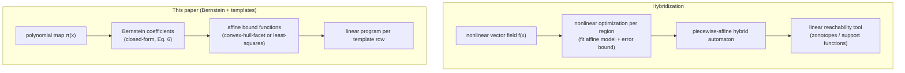
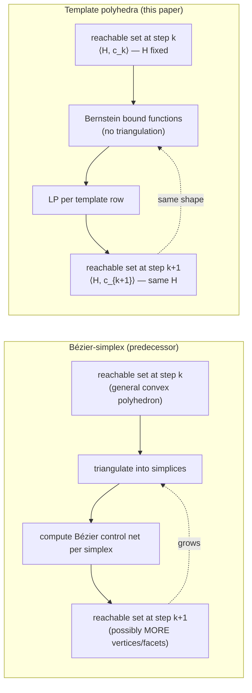

[[book-guidelines|↩ Back to guidelines]]

## Why a paper needs a "related work" section that's really an argument

By the time you reach Section 9, the paper has already done its job: template
polyhedra plus Bernstein-derived affine bounds, reduced per-step image
computation to a handful of linear programs, and shown it scales further than
the authors' own earlier method. Section 9 is not a bibliography dump. It's
the authors answering the obvious skeptical question a reviewer would ask:
*"isn't this just another linearization scheme — what makes it different from
the half-dozen other ways people already turn a nonlinear reachability problem
into a linear one?"*

That question matters beyond this one paper. Every static-analysis or
verification tool that has to reason about nonlinear updates — a Runge-Kutta
step, a `y = y*y*0.5 + x` line in embedded control firmware, a polynomial
invariant candidate — faces the same fork in the road: *do the expensive
nonlinear optimization once, up front, to get a cheap linear model,* or
*keep the nonlinearity but bound it cheaply at each step.* Section 9 is a
compressed taxonomy of that design space, and it's worth reading as such
rather than as a list of citations to skip.

## Competitor 1: piecewise-linear hybridization

> "A common method to approximate a non-linear function by a piecewise linear
> one, as in the hybridization approach for hybrid systems, requires
> non-linear optimization."

**Hybridization** is the more classical answer to "I have a nonlinear vector
field, I want a reachability tool that only understands linear/affine
dynamics." The idea: partition the state space into regions, and inside each
region replace the true nonlinear vector field $f(x)$ with an affine
approximation $Ax + b$ plus a bounded error term capturing how far off that
approximation can get within the region. Once you've done this partitioning
and fitting, you hand the resulting *piecewise-affine hybrid automaton* to any
of the mature linear-hybrid-system reachability tools (the kind that compute
with zonotopes, ellipsoids, or support functions over purely linear dynamics).

The cost is front-loaded into the fitting step itself: to guarantee the
affine approximation's error bound is valid over an entire region, you need
to solve a **nonlinear optimization problem** — typically bounding
$\max_{x \in R} \|f(x) - (Ax+b)\|$ over the region $R$. That's exactly the
kind of problem the paper's whole machinery exists to avoid doing directly.
Hybridization pays this cost once per region (a *preprocessing* expense),
whereas the Bernstein/template-polyhedra approach in this paper pays a
cheaper cost *at every reachability step*, because Bernstein bound-function
computation is combinatorial/algebraic (coefficient extraction plus a linear
solve) rather than a general nonlinear program.

**What breaks without this distinction:** if you don't separate "nonlinear
optimization to build the model" from "linear programming to propagate
reachable sets through the model," you can't explain why this paper's method
is competitive at all — a naive reading would say "it's just another
linearization trick, so what." The actual claim is narrower and more useful:
*this specific kind of over-approximation avoids paying nonlinear-optimization
cost at every single reachability step*, replacing it with something whose
cost is dominated by linear algebra (matrix construction from Eq. 6, and
either a convex-hull-facet or least-squares linear solve — Chapter 4's
machinery). Hybridization still needs a nonlinear solver somewhere in its
pipeline; this paper's method needs one nowhere in the online loop.

The Rust-shaped way to see this: hybridization is like **ahead-of-time
compilation with an expensive optimizing pass** — you pay once, at "compile
time" (region-construction time), to get a fast, uniform representation you
can reuse. The Bernstein/template approach is more like a **cheap JIT
recomputed every step** — no expensive global pass, but you redo a modest
amount of work (Bernstein-coefficient extraction, one linear solve) at every
iteration of the reachability loop. Neither is unconditionally better; it's a
tradeoff between upfront modeling cost and per-step propagation cost, and
which one wins depends on how many reachability steps you need to take versus
how expensive constructing a faithful piecewise-affine model would be.

## Competitor 2: the authors' own predecessor — the Bézier-simplex method

This is the more personal comparison in the paper, since [34] (Dang's earlier
work, cited as "our previous Bézier method") is the direct ancestor this paper
supersedes. The introduction (Section 1, p. 2) already flags the problem:

> "The drawback of the Bézier simplex based method proposed in this work is
> that it requires expensive mesh computation, which restricts its
> application to systems of dimensions not higher than 3, 4."

**Where the two methods agree.** Both methods exploit essentially the same
underlying fact from Computer-Aided Geometric Design: a polynomial's graph
over a domain lies inside the convex hull of a finite set of *control points*
computable from the polynomial's coefficients. In the Bernstein-expansion
setting (this paper), the control points are the Bernstein coefficients
indexed over a grid $I_d$ on the unit box (Chapter 3's Lemma 1 — the
convex-hull property). In the Bézier-simplex setting (the predecessor), the
analogous control points are Bézier coefficients defined over a **simplex**
decomposition of the domain rather than a box. Section 9 makes the shared
convergence property explicit:

> "If using the methods proposed in this paper with a sufficient number of
> templates to assure the same precision as the convex hull in our previous
> Bézier method, then the convergence of both methods is quadratic."

This is a genuinely important admission, and it's worth sitting with the Key
Question the guidelines raise about it: **if the asymptotic accuracy is the
same, what's the actual argument for template polyhedra?** The answer isn't
"tighter bounds" — it's *cost structure*. Quadratic convergence in box size
(Lemma 5, Chapter 7) is a statement about how error shrinks as you refine your
partition; it says nothing about how expensive it is to *construct and
maintain* that partition as the domain reshapes itself over reachability
iterations. That's exactly where the two methods diverge.

**Where they diverge: the mesh-computation bottleneck.** The Bézier-simplex
method represents the reachable set (or the domain being bounded) as a
*general convex polyhedron*, whose Bézier control net has to be recomputed via
an explicit **triangulation** of that polyhedron into simplices at every step.
Two properties of this make it a bottleneck:

1. **Triangulation is itself an expensive geometric computation** — finding a
   simplicial decomposition of an arbitrary convex polyhedron in $n$
   dimensions is nontrivial, and its cost grows fast with dimension (this is
   the concrete reason the predecessor tops out around dimension 3–4).
2. **The reachable set's geometric complexity is not fixed** — because the
   image of a polyhedron under a nonlinear map is itself a general (not
   fixed-shape) polyhedron, the *number of vertices/facets can grow with each
   reachability step*. So not only is triangulation expensive once, it gets
   more expensive as the iteration proceeds, since there's more geometric
   structure to triangulate. Section 9 states this plainly: "the Bézier
   method requires expensive triangulation operations, and geometric
   complexity of resulting sets may grow step after step."

Template polyhedra sidestep both problems by construction. Recall from
Chapter 2: a template polyhedron $\langle H, c \rangle$ fixes the template
matrix $H$ (the facet normals) once, in advance, and only the coefficient
vector $c$ changes from step to step. There is no re-triangulation, because
there is no changing geometric shape to re-triangulate — the "shape" is
frozen by $H$, and iteration only ever touches the numeric vector $c$. This
is the same abstract-interpretation move as fixing an **abstract domain**
before iterating a dataflow analysis: you give up some precision (a general
polyhedron can hug the true reachable set tighter than any fixed-template
approximation) in exchange for a *bounded, predictable* representation size
across iterations — exactly the "more controllable" complexity/precision
tradeoff the Conclusion (Section 10) highlights as the paper's main practical
payoff.

**What breaks without this fix.** If you don't fix the template shape up
front, your reachability loop's per-step cost is not just "expensive" but
*unpredictably* expensive — you cannot bound in advance how much triangulation
will cost at step 50 given the shape it produced at step 49. That's a fatal
property for a tool meant to run reachability analysis for hundreds of steps
on control systems. This is precisely the abstract-interpretation lesson that
generalizes past this paper: an abstract domain whose representation size is
allowed to grow unboundedly with iteration count is not a domain you can
safely iterate to a fixpoint in bounded time, no matter how accurate each
individual step is.

If you're used to thinking about abstract interpretation in the Cousot &
Cousot sense (fixed lattice, monotone transfer function, Kleene iteration to
a fixpoint), this is worth naming explicitly: **template polyhedra are what
happens when you insist the abstract domain's representation has bounded,
step-independent size** — the geometric analogue of choosing intervals or
octagons over general polyhedra in a dataflow analysis, precisely because
general convex polyhedra (Chen–Miné–Wang–Cousot's own "interval polyhedra"
work is cited in the bibliography for a related reason) can blow up in
representation size across iterations even though they're strictly more
precise pointwise.

## The wider ecosystem: what else Bernstein coefficients are good for

Section 9's second paragraph broadens the lens: the Bernstein expansion is
not a bespoke trick invented for this paper, it is a general-purpose tool for
*bounding the range of a multivariate polynomial over a box or polyhedron*,
and that primitive shows up wherever such a bound is needed. The paper lists
four application areas — each is a short pointer, so the value here is
understanding *why* each one needs exactly the same primitive this paper
built (Bernstein control points → affine/constant bounds), not new details
the paper doesn't give.

- **Robust control.** Determining whether a controller stays stable or
  satisfies performance bounds *for every value of some uncertain parameter*
  is, at bottom, a question about the range of a polynomial (e.g. a
  characteristic-polynomial coefficient, or a Lyapunov-function-derivative
  expression) as that parameter ranges over an interval or box. Bernstein
  coefficients give a certified enclosure of that range without solving the
  full nonlinear optimization exactly — the same convex-hull property
  (Lemma 1) doing the same job it does for reachable sets here.

- **Symbolic program analysis.** If a program computes with polynomial
  arithmetic over bounded inputs (a very common situation in numerical or
  embedded code — think fixed-point arithmetic, sensor-fusion filters,
  physics simulation kernels), then proving a range-safety property (no
  overflow, output stays within a spec'd band) reduces again to bounding a
  polynomial's range over a box. This is worth flagging explicitly for
  anyone building program-analysis tooling: the Bernstein expansion is a
  drop-in **range-analysis abstract domain** for polynomial expressions,
  playing the same role interval or affine arithmetic plays for linear
  expressions, but sound for genuinely nonlinear terms.

- **Barrier certificates.** A barrier certificate for hybrid-system safety is
  a function $B(x)$ that is negative on the initial set, non-negative on the
  unsafe set, and whose value doesn't increase along trajectories — its
  existence *proves* safety without ever computing the reachable set
  explicitly (it's a Lyapunov-style certificate rather than an
  over-approximation, though it serves the same verification purpose).
  Finding such a $B$, or verifying a candidate one, again requires bounding
  polynomial expressions (the candidate's derivative along the vector field)
  over regions of state space — the same optimization-to-LP move via
  Bernstein coefficients applies directly.

- **Polynomial invariant generation.** Directly relevant to the abstract
  interpretation project this vault is oriented around: automatically
  synthesizing a polynomial inequality (or equality) that holds at every
  program point reachable by a loop is exactly an *invariant-generation*
  problem, one level more general than the linear/interval/octagon
  invariants most abstract interpreters compute. Checking whether a
  candidate polynomial invariant is actually preserved by a polynomial
  update again bottoms out in bounding a polynomial's range — so the
  Bernstein machinery is a plausible backend for a **polynomial abstract
  domain** in exactly the sense the workbench's `static-analysis` focus area
  cares about: a domain whose soundness argument rests on a certified
  over-approximation of a nonlinear transfer function, not a linear one.

The unifying observation, worth stating plainly since the paper only implies
it: **every one of these four applications is "compute (or certify) a bound
on a multivariate polynomial's range over a domain."** That's the actual
reusable primitive underneath this whole paper, and reachability analysis
via template polyhedra is just one particular *consumer* of that primitive —
the paper's real contribution is showing that a good primitive (Bernstein
bound functions) plus a good abstract domain (template polyhedra) compose
into a scalable reachability algorithm, not that Bernstein coefficients
themselves are novel.

## Closing directions: what the authors flag as unfinished

The Conclusion (Section 10) closes with two forward-looking threads, both
worth taking seriously as open problems rather than throwaway future-work
boilerplate, since they point at the paper's actual scalability ceiling
(recall from Chapter 8: experiments capped near dimension 9 because
"polynomial composition becomes prohibitively costly").

**1. Sparse-polynomial composition via blossoming.** Computing the composed
polynomial $\gamma = \pi \circ \tau$ (box approximation, Chapter 5.1) or
$\mu = \pi \circ \nu$ (change of variables, Chapter 5.2) requires explicit
polynomial composition, and the paper notes this cost dominates at higher
dimension — Table 2 in Section 8.4 shows LP/bound-function time growing
sharply past dimension 7–8, and the text explicitly attributes the dimension-9
ceiling to composition cost, not to the LP solves themselves. **Blossoming**
is a technique from Computer-Aided Geometric Design (de Casteljau's/Ramshaw's
polar-form construction) for representing a polynomial via a unique
symmetric multi-affine "blossom" function — it gives an algebraic handle on
polynomial composition that can exploit **sparsity** (few nonzero monomials
relative to the full monomial basis) to avoid the combinatorial blow-up of
naive term-by-term composition. This is a direct, mechanism-level answer to
the dimension-9 ceiling: the bottleneck isn't the reachability algorithm's
logic, it's the symbolic-algebra cost of building the composed polynomial the
algorithm needs as input, and blossoming targets exactly that step. The
paper's own footnote-style aside in Section 8's discussion — "This issue can
be handled by computing the Bernstein coefficients by interpolation instead
of explicit polynomial composition, which is indeed a topic of our current
research" — names a second, related fix (numeric interpolation to recover
Bernstein coefficients directly, bypassing symbolic composition altogether).
Both directions attack the same target: replace *symbolic* polynomial algebra
with something whose cost doesn't scale combinatorially in the number of
monomials.

**2. Embedded control software verification.** The second direction is a
change of application domain rather than of algorithm: verifying actual
*generated code* for embedded controllers, where "multivariate polynomials
arise in many situations when analyzing programs that are automatically
generated from practical embedded controllers." This connects straight back
to the "symbolic program analysis" bullet above — it's the same primitive
(bound a polynomial's range) applied not to a dynamical-systems model but to
the literal arithmetic expressions appearing in generated C code (e.g. from
Simulink/Stateflow-style code generators). This is the direction most
relevant to a compiler/verification project: it reframes reachability
analysis as a special case of a more general **program-analysis pass over
polynomial arithmetic**, which is exactly the shape of problem a refinement-type
or abstract-interpretation-based verifier would need to solve for numerical
code with nonlinear updates (fixed-point filters, PID controller
implementations, numerical integrators baked into firmware).

## Where this leads

Structurally, Section 9 closes the loop the paper opened in Section 1: it
promised to beat the Bézier-simplex method's dimension-3/4 ceiling, and it
delivers the argument for *why* the fix (fixed-shape template polyhedra) works
where the old approach (adaptively triangulated general polyhedra) didn't —
not more precision, but bounded and predictable per-step cost. Nothing later
in the paper depends technically on this section; it's the paper's own
self-assessment, positioned to be read *after* Chapters 3–8 have already
demonstrated the mechanism, so that the comparison is a synthesis rather than
a pitch.

For the standing project in this vault, the load-bearing idea is the
**abstract-domain framing of template polyhedra versus general polyhedra**:
this is the same tradeoff (`static-analysis`) between precision and bounded
representation size that shows up in choosing intervals vs. octagons vs.
polyhedra as a numeric abstract domain for a Hoare-style invariant generator,
and the Bernstein-bound-function idea itself is a candidate mechanism
(`sat-smt-csp`, `static-analysis`) for extending such a domain to genuinely
nonlinear/polynomial transfer functions — exactly the kind of transfer
function a refinement-type checker would face when checking a
`requires`/`ensures` contract across a piece of code with nonlinear
arithmetic. The barrier-certificate and polynomial-invariant-generation
applications noted above are the most direct bridges: both are, in the
abstract-interpretation sense, searching for a sound over-approximating
certificate, which is precisely what an automated Hoare-contract generator
needs to produce and what a CSP-based counterexample search (this vault's
other target) needs to be able to falsify.
