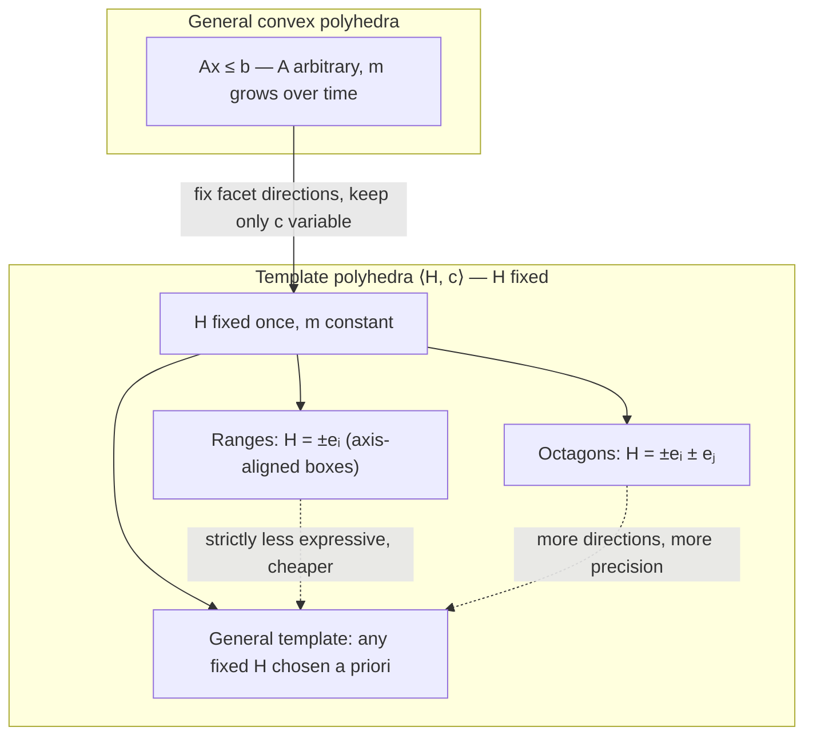

[[book-guidelines|↩ Back to guidelines]]

## The problem template polyhedra solve

Say you want to compute the reachable set of a dynamical system: start with a set of states $X_0$, apply the transition map $\pi$ repeatedly, and track $X_{k+1} = \pi(X_k)$. The moment you try to represent $X_k$ as an *exact* set, you're sunk — for anything but the most trivial $\pi$, the image of a set under a nonlinear map is not expressible in any closed finite form. So every practical reachability algorithm over-approximates: it picks some family of "nice" sets, and at each step computes a set from that family that is guaranteed to contain the true (unrepresentable) image.

This turns the whole reachability problem into a question about **abstract domains** — a term you may already know from abstract interpretation, and that's exactly the right frame here. You need a family of sets that is:

1. **Expressive enough** to approximate the true reachable sets without throwing away all useful precision.
2. **Cheap to compute with** — because you're going to intersect, union, and test inclusion between these sets at *every single time step*, for potentially hundreds of steps.

General convex polyhedra ($Ax \le b$ for an arbitrary matrix $A$) are the natural first choice — they're expressive, closed under affine maps, and well understood. But they have a nasty property: **the number of facets (rows of $A$) that a polyhedron needs is not fixed, and it tends to grow** as you intersect and project polyhedra over successive iterations. Two convex polyhedra with $p$ and $q$ facets can intersect into something needing up to $p + q$ facets; projecting can (via Fourier-Motzkin elimination) blow this up combinatorially. In a loop that runs for 80, or 20 steps as in this paper's own experiments — this is what "unbounded facet growth" costs you: your representation gets more and more expensive to manipulate, purely as a side effect of doing arithmetic on it, with no ceiling in sight.

**Template polyhedra** are the fix. The idea is disarmingly simple: *fix the set of facet normals (directions) in advance, once, for the whole computation, and only ever let the offsets vary.* You lose the ability to represent an arbitrary convex shape — you're now confined to shapes whose facets all point in one of your pre-chosen directions — but you gain a representation of *constant size* that never grows, no matter how many iterations you run. This is the deliberate trade the paper makes, right there in Section 2.2's own framing: "the advantage of template polyhedra over general convex polyhedra is that the Boolean operations … and common geometric operations can be performed more efficiently. Manipulating general convex polyhedra is expensive especially in high dimensions."

## Convex polyhedra: two representations

Before formalizing the template idea, the book's own preliminaries fix vocabulary for polyhedra in general. A convex polyhedron has two standard representations, and it's worth holding both in mind because the tension between them is exactly what motivates the template restriction:

- **H-representation (halfspace / inequality form):** a conjunction of finitely many linear inequalities, $Ax \le b$, where $A$ is an $m \times n$ matrix and $b \in \mathbb{R}^m$. Each row of $A$, together with the matching entry of $b$, describes one halfspace; the polyhedron is the intersection of all $m$ halfspaces.
- **V-representation (vertex form):** if the polyhedron is bounded (a *polytope*), it can equivalently be described as the convex hull of its finite vertex set $V = \{v^1, \dots, v^l\}$ — every point in the polyhedron is a convex combination $\sum_j \alpha_j v^j$ with $\alpha_j \ge 0, \sum_j \alpha_j = 1$.

Both representations describe the same object, but they're not equally convenient for every operation: intersection is cheap in H-representation (just concatenate the inequality lists) but expensive in V-representation; computing a convex hull or applying certain affine transformations is the reverse. Converting between the two (vertex enumeration / facet enumeration) is itself a hard combinatorial problem in general. This paper works in H-representation throughout — and templates are best understood as a *disciplined restriction on the $A$ side* of that representation.

## Template matrices and polyhedral coefficient vectors

Now for the formal machinery. A **template** is a fixed $m \times n$ matrix $H$, where each row $H^i$ (a vector in $\mathbb{R}^n$) is a linear functional over the state variables $x = (x_1, \dots, x_n)$. Think of each row as a *direction* you've decided, in advance, that you care about measuring.

Given the template $H$ and a **polyhedral coefficient vector** $c \in \mathbb{R}^m$ — one scalar bound per template row — the **template polyhedron** is defined as the conjunction

$$
\langle H, c \rangle \;=\; \bigwedge_{i=1,\dots,m} H^i x \le c_i .
$$

Notice what changed relative to a general polyhedron $Ax \le b$: $H$ is *fixed once* for the entire computation (chosen ahead of time based on what directions you expect to matter — coordinate axes, diagonals, whatever), and the only thing that varies from one reachable-set iteration to the next is the vector $c$. A template polyhedron is really a *point in $\mathbb{R}^m$* (the coefficient vector) standing in for a full-dimensional geometric region, once you've fixed which $m$ directions matter.

**What breaks without this restriction:** if $H$ were allowed to change at each step — i.e., if you recomputed a fresh, minimal set of facet normals to exactly capture each new image — you'd be back to general convex polyhedra, with the growing-facet-count and expensive-conversion problems from the previous section. Fixing $H$ is precisely what turns "track how the shape of the reachable set evolves" into "track how one finite-dimensional vector evolves," which is a vastly easier bookkeeping problem — you always know exactly how many numbers you're carrying and what each one means.

## The order $c \preceq c'$ and inclusion

Because a template polyhedron is essentially "the vector $c$, plus a fixed dictionary $H$ that tells you how to read it as a region," it's natural to ask when one template polyhedron contains another — and the book gives you componentwise comparison for that.

For two coefficient vectors $c, c' \in \mathbb{R}^m$, define

$$
c \preceq c' \iff \forall i \in \{1, \dots, m\}: c_i \le c'_i .
$$

Then, for a fixed template $H$:

$$
c \preceq c' \implies \langle H, c \rangle \subseteq \langle H, c' \rangle .
$$

This should feel intuitive once you unpack it: raising $c_i$ relaxes the $i$-th inequality $H^i x \le c_i$, allowing more points to satisfy it, and relaxing every inequality simultaneously can only grow (or preserve) the intersection region. The book phrases this as "$\langle H, c\rangle$ is not larger than $\langle H, c'\rangle$" when $c \preceq c'$.

This is worth pausing on longer than the source text does, because it is exactly the load-bearing structure that makes the whole reachability *algorithm* well-founded, and it's the reason this topic belongs squarely in the same conceptual family as **abstract lattices and Galois connections** from abstract interpretation more broadly: $(\mathbb{R}^m, \preceq)$, restricted to the coefficient vectors that arise from a fixed $H$, is a poset (a partial order — it's reflexive, antisymmetric, transitive, componentwise), and it's a *complete lattice* under componentwise min/max, since:

- the **join** $c \vee c' = (\max(c_1, c_1'), \dots, \max(c_m, c_m'))$ gives the smallest template polyhedron (in this family) containing both $\langle H, c\rangle$ and $\langle H, c'\rangle$ — this is your over-approximating union;
- the **meet** $c \wedge c' = (\min(c_1, c_1'), \dots, \min(c_m, c_m'))$ gives the largest template polyhedron contained in both — an under-approximation of the true intersection, but still exact enough to be useful for the Boolean operations the paper mentions.

The reachability recurrence $X_{k+1} = \langle H, c^{(k+1)}\rangle$ is, in this light, exactly the kind of monotone iteration over a lattice that abstract interpretation is built on: each step produces a new coefficient vector, the order $\preceq$ tells you whether your approximation is getting looser or tighter, and (though this particular paper doesn't run a Kleene-iteration-to-fixpoint scheme — it computes a bounded number of finite steps rather than iterating to a fixpoint) the same order-theoretic vocabulary you'd use to reason about a fixpoint computation applies directly to reasoning about *this* sequence of approximations: is $c^{(k+1)}$ a sound over-approximation ($\pi(\langle H, c^{(k)}\rangle) \subseteq \langle H, c^{(k+1)}\rangle$)? Is one choice of bound-function method looser than another (i.e., does it produce a $c$ that's $\succeq$ the $c$ from a tighter method, for the same input)? All of that is a $\preceq$-comparison. This is precisely a Galois-connection-flavored move: the concrete domain (the true image sets, ordered by $\subseteq$) is related to the abstract domain $(\mathbb{R}^m, \preceq)$ by the abstraction map "compute the tightest $c$ containing this concrete set" and the concretization map $c \mapsto \langle H, c\rangle$, and soundness of the whole reachability algorithm is exactly [[Approximation-Error-and-Computational-Complexity#The statement|the statement]] that this abstraction never *loses* concrete points, only ever adds slack.

## Boolean and geometric operations on polyhedra

The paper is explicit that on convex polyhedra generally, "Boolean operations (union, intersection) and common geometric operations can be done using existing algorithms" — but on *general* polyhedra these algorithms are expensive, especially as dimension grows, because (as above) they can change the number of facets, forcing representation conversions or facet-count blowup.

On template polyhedra, because $H$ never changes, these same operations collapse to vector arithmetic on $c$:

| Operation | General convex polyhedra | Template polyhedra (fixed $H$) |
|---|---|---|
| Intersection | facet-set concatenation, possible redundancy elimination | componentwise $\min$ of coefficient vectors |
| Union (over-approx.) | convex hull, can add facets | componentwise $\max$ of coefficient vectors |
| Inclusion test | linear-programming feasibility check per facet | componentwise $\le$ comparison, $O(m)$ |
| Affine image | may need vertex enumeration + re-facet | per-row optimization (this paper's whole Section 3 problem) |

That inclusion-test row is worth flagging on its own: testing $P \subseteq Q$ for two arbitrary convex polyhedra is, in general, as hard as solving $m$ linear programs (one feasibility check per facet of $Q$). For two template polyhedra sharing the same $H$, it is a single componentwise vector comparison. This is the concrete, mechanical payoff of fixing $H$ — it's not just conceptually cleaner, it changes several polynomial-but-costly geometric algorithms into linear-time array operations.

## Template polyhedra vs. general convex polyhedra, and named special cases

To place templates in the wider landscape the book gestures at: template polyhedra are already a well-established idea in static program analysis for computing invariants, not something this paper invents — the text cites their use as "an abstract domain to represent sets of states" in prior work, and names two specific special cases you've likely already met if you've touched abstract interpretation:

- **Ranges (interval domain):** the template $H$ consists of the $\pm$ unit vectors along each coordinate axis, i.e., rows $\pm e_1, \dots, \pm e_n$. The resulting template polyhedra are exactly axis-aligned boxes $\prod_i [l_i, u_i]$ — the classic interval abstract domain.
- **Octagon domain:** $H$ consists of all $\pm e_i \pm e_j$ for pairs of variables $i \ne j$ (plus the axis directions), giving bounds on sums and differences of pairs of variables ($x_i + x_j \le c$, $x_i - x_j \le c$, etc.). This is strictly more expressive than intervals (it can capture some relational information between variable pairs) while remaining far cheaper than general polyhedra, since the template is fixed at $O(n^2)$ rows rather than growing arbitrarily.

Both are just template polyhedra with a particular, well-chosen $H$ — nothing new is added at the definitional level; what differs is only the practitioner's choice of which directions are worth tracking. This is the real generality of [[Mapping-General-Polyhedra-to-the-Unit-Box#The construction|the construction]]: "template polyhedra" isn't one domain, it's a *parametric family* of domains indexed by $H$, and picking $H$ is an accuracy/cost dial — more rows means more expressive shapes at more computational cost per step, fewer rows means cheaper steps at coarser approximation. (The paper returns to this explicitly in its experiments, e.g. going from 8 to 20 template directions on the FitzHugh-Nagumo model.)



## A worked example

Take $n = 2$ and an octagon-style template with $m = 4$ rows:

$$
H = \begin{pmatrix} 1 & 0 \\ -1 & 0 \\ 0 & 1 \\ 0 & -1 \end{pmatrix}, \qquad
\langle H, c\rangle = \{(x_1,x_2) : x_1 \le c_1,\; -x_1 \le c_2,\; x_2 \le c_3,\; -x_2 \le c_4\}.
$$

With $c = (2, 2, 3, 1)$ this is the box $x_1 \in [-2, 2]$, $x_2 \in [-1, 3]$ — a range, since $H$ here only has axis-aligned rows. Suppose a reachability step computes two candidate over-approximations for the same time step, $c = (2,2,3,1)$ and $c' = (1,3,3,2)$. Neither $c \preceq c'$ nor $c' \preceq c$ holds (component 1 favors $c$, component 2 favors $c'$) — so $(\mathbb{R}^4, \preceq)$ only gives you a *partial* order here, not a total one, and the two candidate boxes are genuinely incomparable regions. The safe way to combine them (e.g. if both come from valid but different bound-function computations, and you want a single region guaranteed to contain both) is the join: $c \vee c' = (2, 3, 3, 2)$, i.e. take the loosest bound in each direction independently. That's the box $x_1 \in [-3,2]$, $x_2 \in [-2,3]$ — visibly looser than either input, which is exactly the expected price of a sound over-approximating union.

## Grounding: what this looks like as code

**Rust.** The fixed-$H$, variable-$c$ structure maps naturally onto a type that separates the *shape* (shared, immutable) from the *state* (the thing that evolves):

```rust
/// A fixed template: m rows, each a linear functional over R^n.
struct Template {
    h: Vec<Vec<f64>>, // m x n
}

/// A template polyhedron ⟨H, c⟩: H is shared, c is the only thing that varies.
struct TemplatePolyhedron<'a> {
    h: &'a Template,
    c: Vec<f64>, // length m
}

impl Template {
    /// Componentwise order c ⪯ c'.
    fn leq(c: &[f64], c_prime: &[f64]) -> bool {
        c.iter().zip(c_prime).all(|(ci, cpi)| ci <= cpi)
    }

    /// Join: smallest template polyhedron containing both.
    fn join(c: &[f64], c_prime: &[f64]) -> Vec<f64> {
        c.iter().zip(c_prime).map(|(a, b)| a.max(*b)).collect()
    }

    /// Meet: largest template polyhedron contained in both.
    fn meet(c: &[f64], c_prime: &[f64]) -> Vec<f64> {
        c.iter().zip(c_prime).map(|(a, b)| a.min(*b)).collect()
    }
}
```

The key design point this mirrors from the source: `Template` (the `H` matrix) is never mutated by the reachability loop — only fresh `Vec<f64>` coefficient vectors are produced at each step. If you were instead modeling *general* convex polyhedra, `h` would have to live inside the per-step state (since its row count can change), and `leq`/`join`/`meet` would need real computational geometry (LP feasibility, facet enumeration) instead of a `zip().all()`/`zip().map()` one-liner — that contrast is the entire efficiency argument of Section 2.2, made concrete in code.

**Lean.** Since $(\mathbb{R}^m, \preceq)$ under componentwise order is a textbook lattice, it's worth writing it the way a proof assistant would, because that's exactly the structure Lean's `mathlib` already formalizes as `Pi.orderedField`-style pointwise order instances: componentwise order on a product/function type is a `PartialOrder`, and componentwise `min`/`max` makes it a `Lattice`. Stating the inclusion lemma as an actual Lean proposition sharpens what's being claimed:

```lean
-- Coefficient vectors as functions Fin m → ℝ, ordered pointwise.
def CoeffVec (m : ℕ) := Fin m → ℝ

def preceq {m : ℕ} (c c' : CoeffVec m) : Prop :=
  ∀ i, c i ≤ c' i

-- The polyhedron a template H and coefficients c denote.
def templatePolyhedron {m n : ℕ} (H : Fin m → (Fin n → ℝ) → ℝ) (c : CoeffVec m) :
    Set (Fin n → ℝ) :=
  {x | ∀ i, H i x ≤ c i}

-- The inclusion lemma from Section 2.2, stated precisely.
theorem preceq_implies_subset {m n : ℕ} (H : Fin m → (Fin n → ℝ) → ℝ)
    (c c' : CoeffVec m) (h : preceq c c') :
    templatePolyhedron H c ⊆ templatePolyhedron H c' := by
  intro x hx i
  exact le_trans (hx i) (h i)
```

This is a genuinely trivial proof (`le_trans` does all the work) — which is itself the point: the reason template polyhedra are cheap is that their core correctness property reduces to transitivity of $\le$ on real numbers, componentwise, with no geometry left to reason about. Compare this to what proving the analogous inclusion fact for two *general* H-represented polyhedra with different facet sets would require — a real LP duality argument, not one line of `le_trans`.

**Python.** For a quick numerical sanity-check of the join/meet operations without any of Rust's ceremony:

```python
import numpy as np

def order_leq(c, c_prime):
    return np.all(c <= c_prime)

def join(c, c_prime):
    return np.maximum(c, c_prime)

c  = np.array([2.0, 2.0, 3.0, 1.0])
c2 = np.array([1.0, 3.0, 3.0, 2.0])
print(order_leq(c, c2))   # False — incomparable
print(join(c, c2))        # [2. 3. 3. 2.]  (the worked example above)
```

## Where this leads

Everything downstream in this paper depends on the coefficient vector $c$ being the *only* unknown at each step. Chapter 3 states the core computational problem as exactly "find $c$ such that $\pi(P) \subseteq \langle H, c\rangle$" — a search over $\mathbb{R}^m$, not over the space of all possible facet configurations, precisely because $H$ was already fixed here. That per-row optimization ($c_i = \max_{x \in P} H^i \pi(x)$) is what the Bernstein expansion machinery (Chapters 3–4) is built to approximate cheaply via linear programming, and Algorithm 1's whole per-iteration structure — compute bound functions, solve $2n$ LPs, update $c$ — only makes sense because "update the reachable-set representation" has been reduced, by this section, to "update one vector of $m$ numbers."

For the standing project (Focus Area: **Static Analysis & Abstract Interpretation**), this section is close to a direct blueprint for how you'd want to represent an abstract domain in a Rust-based invariant generator: a fixed, shared "shape" object plus a small per-program-point mutable state vector, ordered by a cheap partial order that gives you join/meet for free, is exactly the pattern you'll want for interval, octagon, or custom polyhedral domains feeding Hoare-contract or Horn-clause invariant inference — with the same efficiency argument (fixed shape ⇒ vector arithmetic instead of geometry) applying directly to your own domain-propagation passes. The Galois-connection framing sketched above — abstraction as "tightest $c$," concretization as $c \mapsto \langle H, c\rangle$ — is the same soundness argument you'll need to state and discharge for any abstract-interpretation pass you build, template polyhedra or otherwise.
