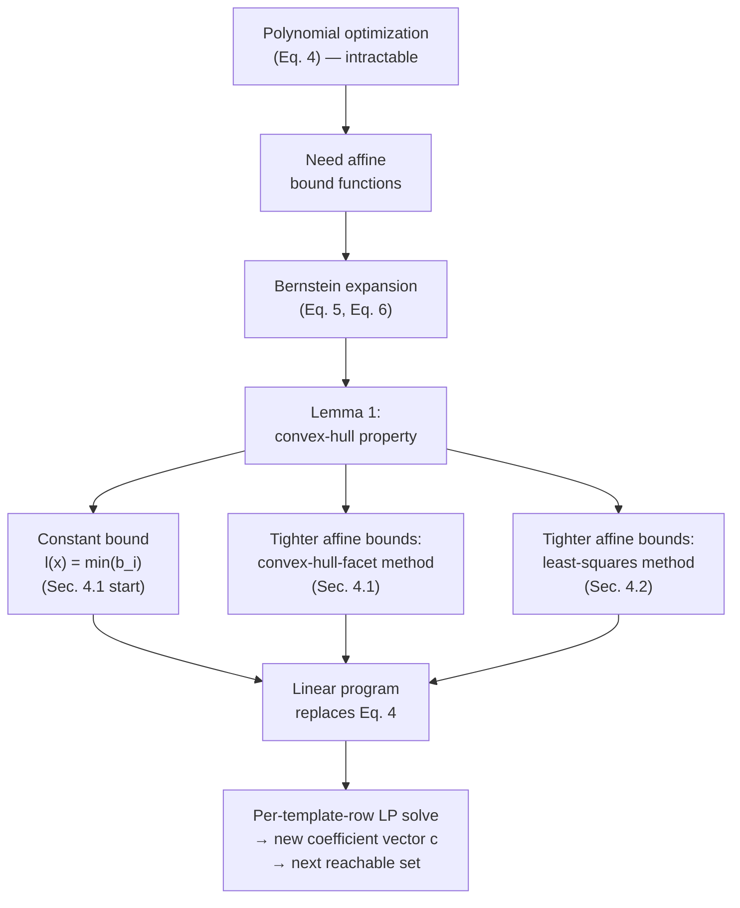

# The Bernstein Expansion of Polynomials

[[book-guidelines|↩ Back to guidelines]]

## The problem that forces this detour into 1959 approximation theory

Back up to where Chapter 3 leaves you. You have a polyhedron $P$ (your current
over-approximation of the reachable set) and a polynomial map $\pi$ (the
system dynamics). You need the *next* reachable set, so you need to bound
the image $\pi(P)$ tightly enough to fit it inside a template polyhedron
$\langle H, c\rangle$. Concretely, for every row $H^i$ of the template matrix,
you need

$$
c_i = \max_{x \in P} \sum_{k=1}^n H^i_k\, \pi_k(x) \qquad \text{(Eq. 4)}
$$

and this is a **polynomial optimization problem** — maximize a (generally
non-convex) polynomial functional over a convex set. That's NP-hard in
general, and doing it once per template row, per time step, for an iterative
reachability computation that might run for hundreds of steps, is a
non-starter. The paper's own earlier method (Bézier-simplex meshes) hit
exactly this wall and topped out around dimension 3–4.

The move the authors make is a *reduction*: replace the hard polynomial
optimization with a cheap **linear program**, by finding an affine function
$u(x) = \lambda \cdot x + \mu$ that provably bounds $\pi_k(x)$ from above (and
similarly from below) over the domain of interest, then optimizing that
affine surrogate instead. Optimizing a linear functional over a polyhedron
*is* a linear program — polynomial-time, solved routinely at scale by Simplex
or interior-point methods. The bound is not going to be exact, so you're
buying tractability at the price of over-approximation — but over-approximation
is exactly what a *sound* reachability analysis is allowed to do; you only
break correctness if you under-approximate.

So the real question becomes: **given a polynomial, how do you mechanically
construct an affine function that provably bounds it above (or below) on a
box?** The Bernstein expansion is the answer, and it's worth sitting with why
it, of all things, gives you that for free.

**What breaks without it:** without some way of deriving affine bounds directly
from the polynomial's coefficients, you're back to calling a general nonlinear
solver per row per step — which is precisely the polynomial-optimization
bottleneck this whole section exists to escape. Section 4 of the paper builds
two concrete bound-function algorithms on top of the machinery introduced
here; neither is possible without first having the Bernstein coefficients in
hand.

## Two ways to write the same polynomial

Here is the idea before the notation. A polynomial like $\pi(x) = 3x^2 - 2x + 1$
can be written many equivalent ways. The one you learned in school — as a sum
of monomials $a_0 + a_1 x + a_2 x^2 + \dots$ — is the **power basis**. It's
great for evaluating the polynomial at a point and terrible for reading off
*where the polynomial's values live* over an interval, because the
coefficients $a_i$ don't correspond to anything geometric — a coefficient like
$-2$ tells you nothing directly about the polynomial's range on $[0,1]$.

The **Bernstein basis** is a different set of basis polynomials for the exact
same vector space of degree-$d$ polynomials, chosen specifically so that the
*coefficients* in this basis — the Bernstein coefficients — are related to the
polynomial's actual output values in a geometrically meaningful way: they
sit close to the graph of $\pi$, and (this is the payoff) their convex hull
*contains* the graph of $\pi$ over the domain. Change of basis doesn't change
the polynomial being represented; it changes what falls out for free when you
read off the coefficients. This is the entire reason the machinery exists —
you're not approximating $\pi$ by switching basis, you're just making its
range-bounding information legible.

If you know Bézier curves from computer graphics, you've already met this
basis — Bernstein polynomials are exactly the blending functions behind Bézier
curve and surface control points, which is also *why* this technique comes out
of Computer-Aided Geometric Design rather than out of numerical analysis or
optimization proper. A Bézier curve's control polygon is visibly "close to"
the curve and always contains it in convex hull — that's the same convex-hull
property this section proves algebraically for general multivariate
polynomials.

### The power basis, precisely

The paper's notation for an $n$-variate polynomial $\pi : \mathbb{R}^n \to \mathbb{R}^n$
(really: apply everything componentwise, one scalar polynomial $\pi_k$ per
output dimension) in power basis is

$$
\pi(x) = \sum_{i \in I_d} a_i x^i
$$

where:

- $i, d$ are **multi-indices** of size $n$: $i = (i_1, \dots, i_n)$, each
  $i_k$ a nonnegative integer, and $x^i$ is shorthand for the monomial
  $x_1^{i_1} x_2^{i_2} \cdots x_n^{i_n}$;
- $d$ is the **degree** of $\pi$ — the multi-index of the maximum exponent in
  each variable;
- $I_d = \{\, i \mid i \le d \,\}$ is the set of all multi-indices componentwise
  no greater than $d$ — i.e., every valid exponent tuple for a polynomial of
  degree $d$;
- $a_i \in \mathbb{R}^n$ is the (vector-valued, since $\pi$ is vector-valued)
  coefficient of the monomial $x^i$.

If you're used to thinking in single-variable calculus, multi-indices are
just the bookkeeping device that lets you write "sum over all monomials up to
degree $d$ in $n$ variables" without $n$ nested sum signs. Nothing conceptually
new — just compressed notation you'll want to get comfortable reading, since
the rest of the paper leans on it heavily.

### The Bernstein basis, precisely

For a single real variable $y$ and integers $0 \le i_j \le d_j$, the
**univariate Bernstein polynomial** of degree $d_j$ is

$$
\beta_{d_j, i_j}(y) = \binom{d_j}{i_j} y^{i_j} (1-y)^{d_j - i_j}.
$$

If that shape looks familiar, it should — it's the binomial-distribution
probability mass function, unnormalized-over-a-continuous-variable. That's
not a coincidence: $\beta_{d,i}$ is (up to the missing normalization) the
density describing "probability of exactly $i$ successes out of $d$ trials, as
a function of success probability $y$" — which is part of why these
polynomials are so well-behaved (they're nonnegative on $[0,1]$ and sum to
1 for fixed $d$ across all $i$, both facts you'll use implicitly below).

For the $n$-variate case, the paper builds the multivariate Bernstein
polynomial as a simple product across coordinates — one factor per dimension:

$$
B_{d,i}(x) = \beta_{d_1,i_1}(x_1) \cdots \beta_{d_n,i_n}(x_n).
$$

This tensor-product construction is standard in multivariate polynomial
approximation: whenever a univariate basis has good properties, taking
coordinatewise products usually preserves them, and it does here.

Then — and this is the definition that everything downstream depends on —
for $x$ restricted to the **unit box** $B = [0,1]^n$, $\pi$ can be rewritten
in this new basis:

$$
\pi(x) = \sum_{i \in I_d} b_i\, B_{d,i}(x) \qquad \text{(Eq. 5)}
$$

where the **Bernstein coefficients** $b_i$ are computed directly from the
power-basis coefficients by

$$
b_i = \sum_{j \le i} \frac{\binom{j}{i}}{\binom{d}{i}}\, a_j \qquad \text{(Eq. 6)}
$$

(multi-index binomial coefficients here mean the componentwise product,
$\binom{j}{i} = \prod_k \binom{j_k}{i_k}$). This is purely mechanical linear
algebra: a fixed, invertible linear transformation on the vector of
coefficients, computable in closed form with no root-finding, no
optimization, nothing iterative. Given the power-basis coefficients of your
system's dynamics — which you have, since you wrote $\pi$ down — you get the
Bernstein coefficients by direct substitution into (6). That cheapness matters:
this computation happens every time step of the reachability loop.

**What breaks without the unit-box restriction:** notice Eq. 5 is only claimed
for $x \in B = [0,1]^n$ — this is not a simplification for exposition, it's a
hard restriction on where the identity holds. The reachable set after one
step of the iteration is generally *not* contained in the unit box anymore,
so the paper has to come back to this later (Chapter 5) with two competing
fixes: approximate the actual domain by a box and rescale, or do an exact
change of variables via the polyhedron's vertices. Neither fix is discussed
here — the point for this section is just to flag that the identity you're
about to build everything on has a domain restriction baked in from the start.

## Lemma 1: the property that makes this useful at all

Everything above is just bookkeeping — a basis change buys you nothing on its
own. The payoff is Lemma 1, which says the Bernstein coefficients aren't just
*some* re-encoding of $\pi$; they're a re-encoding whose geometric structure
directly bounds $\pi$'s graph.

**Part 1 — the convex-hull property.**

$$
\mathrm{Conv}\{(x, \pi(x)) : x \in B\} \;\subseteq\; \mathrm{Conv}\{(i/d,\, b_i) \mid i \in I_d\}.
$$

Read the two sides carefully, because the asymmetry is the whole point. The
left side is the convex hull of the polynomial's *entire graph* over the unit
box — an infinite, generally curved set. The right side is the convex hull of
a *finite* set of points: for each multi-index $i \in I_d$, plot the point
$(i/d, b_i)$ — think of $i/d$ as a grid point inside the unit box (dividing
each axis into $d_k$ equal steps) and $b_i$ as the "height" assigned to that
grid point by the Bernstein coefficient. These finitely many points $b_i$ are
called the **control points** of $\pi$ — direct analogues of a Bézier curve's
control points, generalized to $n$ dimensions and to polynomials of arbitrary
degree rather than just cubic curves.

The claim is that the graph's convex hull sits *inside* the control points'
convex hull. Since a convex hull of finitely many points is a polytope — easy
to compute with, easy to bound — this converts "where can the graph of a
possibly wild high-degree polynomial go" into "where can a handful of known
numbers, the $b_i$, be found," which is a linear-algebra question, not an
analysis question.

*Why this is true (proof sketch):* the Bernstein polynomials $B_{d,i}(x)$ are
nonnegative on $B$ and sum to $1$ for every fixed $x \in B$ (this is the
"probability mass function" fact carried over from the univariate case,
extended by the product construction). That means Eq. 5 expresses $\pi(x)$,
for every fixed $x$, as a **convex combination** of the control points $b_i$
— the weights $B_{d,i}(x)$ are nonnegative and sum to one. A convex
combination of points is by definition inside their convex hull. So every
single point on the graph $(x, \pi(x))$ is already a convex combination of
the control points $(i/d, b_i)$ — hence contained in their hull, and hence so
is the hull of the whole graph. Notice the proof needs *nothing* about how
tightly the $b_i$'s are packed, nor anything about the degree of $\pi$
directly — it drops straight out of the algebraic definition of the Bernstein
basis. That's a sign that this is the "correct" basis for this problem, not
a lucky accident.

**Part 2 — the bounding-box corollary.**

$$
\forall x \in B: \pi(x) \in \Box\{b_i \mid i \in I_d\}
$$

where $\Box$ denotes the axis-aligned bounding box of a point set. This is an
immediate weakening of Part 1 (a convex hull is contained in its own bounding
box, and containment is transitive), but it's the version actually usable in
practice: instead of computing a convex hull of control points, you take the
componentwise min and max of the $b_i$ values. That gives you, for free, a
constant (not yet affine) bound: $l(x) = \min_i b_i$ is a valid lower bound
for $\pi$ over the entire unit box, no optimization required — literally just
scan a list of precomputed numbers. This is the crudest bound function the
paper builds (Section 4.1's starting point) and everything else in Chapter 4
is about tightening it from "constant" to "affine" without losing validity.

**Part 3 — sharpness at the vertices.**

$$
\forall i \in I_d^0 : b_i = \pi(i/d)
$$

where $I_d^0$ is the set of vertices of the grid $\{0,\dots,d_1\} \times
\dots \times \{0,\dots,d_n\}$ — i.e., the multi-indices whose every
coordinate is either $0$ or the corresponding $d_k$ (so for $n=1$ that's just
$i \in \{0, d\}$: the two endpoints; for $n=2$ that's the four corners
$(0,0), (d_1,0), (0,d_2), (d_1,d_2)$, and so on).

This says that at these specific grid points, the control point isn't merely
an *upper bound* on the true value or a nearby approximation — it's *exactly
equal* to $\pi$ evaluated at the corresponding point in the box. Combine this
with Part 1: the convex hull of the control points touches the actual graph
of $\pi$ exactly at the box's corners, and only bulges outward (never
inward) everywhere else. This is the quantitative content behind "the
Bernstein control polygon hugs the curve" — it isn't just visually close, it
is provably tangent-equal at the box vertices, with the enclosure becoming
strictly slack only strictly inside the box. It's also a useful sanity check
when implementing Eq. 6: plug in $i = (0,\dots,0)$ and $i=d$ and you should
recover $a_0$ and $\pi(1,\dots,1)$ respectively — a cheap unit test for a
Bernstein-coefficient routine.

## Worked example: $\pi(x) = 3x^2 - 2x + 1$ on $[0,1]$

Degree $d = 2$, so $I_d = \{0, 1, 2\}$, power-basis coefficients
$a_0 = 1,\ a_1 = -2,\ a_2 = 3$. Apply Eq. 6 (univariate, so $\binom{j}{i}$ and
$\binom{d}{i}$ are ordinary binomial coefficients):

$$
b_0 = a_0 = 1
$$
$$
b_1 = \frac{\binom{0}{1}}{\binom{2}{1}}a_0 + \frac{\binom{1}{1}}{\binom{2}{1}}a_1
    = 0\cdot 1 + \tfrac{1}{2}\cdot(-2) = -1
$$
$$
b_2 = \frac{\binom{0}{2}}{\binom{2}{2}}a_0 + \frac{\binom{1}{2}}{\binom{2}{2}}a_1 + \frac{\binom{2}{2}}{\binom{2}{2}}a_2
    = 0 + 0 + 3 = 2
$$

So the control points are $(0,1), (\tfrac12,-1), (1,2)$. Sharpness (Part 3)
predicts $b_0 = \pi(0)$ and $b_2 = \pi(1)$: check, $\pi(0) = 1 = b_0$,
$\pi(1) = 3 - 2 + 1 = 2 = b_2$ — exact, as promised, at the two endpoints of
$I_d^0 = \{0, 2\}$. The interior control point $b_1 = -1$ is *not* required to
equal $\pi(0.5) = 3(0.25) - 1 + 1 = 0.75$ — and indeed it doesn't; Part 3
only makes the sharpness claim at box vertices. The bounding-box corollary
(Part 2) then gives $\pi(x) \in [\min(1,-1,2), \max(1,-1,2)] = [-1, 2]$ for
all $x\in[0,1]$ — compare to the true range of $\pi$ on $[0,1]$, which by
calculus (vertex of the parabola at $x=1/3$, value $2/3$) is $[2/3, 2]$. The
Bernstein bound $[-1,2]$ over-approximates the true range $[2/3,2]$ — exactly
as guaranteed, no more, no less: an easy computation buys you a sound but not
tight enclosure, and Section 4 exists precisely to shrink that gap using
affine rather than constant bounds.

## Grounding: control points as a checked geometric invariant

The Bernstein basis is squarely computational-geometry/numerical territory
rather than proof-theoretic territory, so Rust is the natural home for
grounding it — think of `bernstein_coefficients` as a pure function you would
actually put in a verified numerical kernel, with the convex-hull property as
an invariant you can property-test.

```rust
// Univariate Bernstein coefficient computation (Eq. 6, n = 1 case),
// matching the paper's b_i = sum_{j<=i} C(j,i)/C(d,i) * a_j.
fn binom(n: u32, k: u32) -> f64 {
    if k > n { return 0.0; }
    (1..=k).fold(1.0, |acc, i| acc * (n - i + 1) as f64 / i as f64)
}

fn bernstein_coefficients(a: &[f64], d: u32) -> Vec<f64> {
    // a[j] is the power-basis coefficient of x^j, j = 0..=d
    (0..=d)
        .map(|i| {
            (0..=i)
                .map(|j| binom(j, i) / binom(d, i) * a[j as usize])
                .sum()
        })
        .collect()
}

// Property to check (Lemma 1, Part 2): every b_i must sandwich pi(x)
// for x sampled inside [0,1]. A property-based test (e.g. via `proptest`)
// asserting `b.iter().cloned().fold(f64::INFINITY, f64::min) <= pi(x)`
// and the symmetric max bound, over many random x, is a direct executable
// check of the corollary — a lemma you can fuzz, not just trust.
fn evaluate_power_basis(a: &[f64], x: f64) -> f64 {
    a.iter().enumerate().map(|(j, &aj)| aj * x.powi(j as i32)).sum()
}
```

This is also a good place to name the connection to your CSP-kernel goals
directly: this whole section is a **relaxation** technique in the same family
as the LP-relaxations and interval/box abstractions used to bound the
feasible region of a nonlinear constraint before a solver commits to
branching. A Bernstein bound function is, structurally, exactly what an
abstract-domain widening step or an SMT theory-solver's interval propagation
step is doing for a nonlinear (polynomial) atom: replace a hard, exact
constraint by a cheap, sound, deliberately loose one, and only refine if the
loose one isn't good enough. If you've seen interval arithmetic or affine
arithmetic used to bound nonlinear terms inside an SMT solver's theory
propagation, the Bernstein control points are doing the same job, just with a
tighter enclosure than naive interval arithmetic gives you for the same
polynomial, because they exploit the polynomial's actual coefficient
structure (via Eq. 6) rather than just recursively bounding subexpressions.

A Python sketch is useful here purely to make the worked example above
runnable and checkable without any of Rust's ceremony:

```python
from math import comb

def bernstein_coeffs(a, d):
    return [sum(comb(j, i) / comb(d, i) * a[j] for j in range(i + 1))
            for i in range(d + 1)]

a = [1, -2, 3]          # pi(x) = 3x^2 - 2x + 1
b = bernstein_coeffs(a, 2)
print(b)                 # [1.0, -1.0, 2.0], matching the worked example
```

Lean grounding is a weaker fit here — this section has no judgment forms,
substitution, or definitional-equality machinery to translate; it's real
analysis over $\mathbb{R}$, not syntactic type theory. The one place a formal
system genuinely earns its keep is if you wanted a *machine-checked* proof of
Lemma 1 itself (e.g. formalizing "convex combination of a finite point set
lies in its convex hull" as a Mathlib-style lemma and instantiating it with
the $B_{d,i}(x)$ partition-of-unity fact) — worth flagging as a real, if
niche, connection to your automated-reasoning target (proof certificates for
a numeric bound function), but forcing a full Lean translation of this
section's content would manufacture exactly the kind of strained analogy the
style guide asks to avoid.

## Where this leads

Structurally, this section is the hinge of the whole paper:



Everything in Chapter 4 (both bound-function methods) is a refinement of the
crude constant bound handed to you directly by Part 2 of Lemma 1 — they are
different strategies for pivoting a hyperplane through the control points to
get closer to the true convex-hull lower facet without violating soundness.
Chapter 5's entire raison d'être is patching the domain restriction flagged
above ("valid only for $x \in B$"), since the reachability recurrence leaves
the unit box after the very first iteration. And Chapter 7's quadratic
convergence result (error shrinks as $O(\rho^2(B))$ in box side length) is a
statement about *how much slack* the convex-hull property from Part 1 leaves
on average as you shrink the box — i.e., a quantitative refinement of exactly
the enclosure this section establishes qualitatively.

For the `sat-smt-csp` focus area this book was tagged against: keep this
section in mind whenever you're designing the nonlinear-constraint-handling
layer of your CSP kernel. The pattern — "exact evaluation of a hard
combinatorial/algebraic object is replaced by a sound, closed-form,
polynomial-time-computable relaxation, refined by subdivision when too loose"
— is the same pattern behind interval constraint propagation, octagon/box
abstract domains, and Bernstein-based verification-condition bounding in
symbolic execution over nonlinear arithmetic. This section is a fully worked,
provably sound instance of that pattern that you can lift close to verbatim
into a "bound this nonlinear atom over a box" theory-propagation routine.
