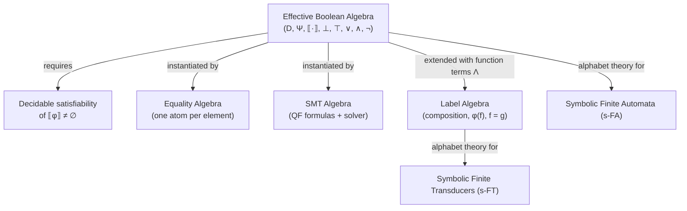

[[book-guidelines|↩ Back to guidelines]]

## Why you need this before you can define a symbolic automaton at all

Classic automata theory fixes a finite alphabet $\Sigma$ up front — transitions
are labeled with concrete symbols like `'a'` or `'b'`, and everything from the
subset construction to Hopcroft's minimization algorithm is built on the
assumption that you can enumerate $\Sigma$ and iterate over it.

That assumption breaks the moment your alphabet is Unicode (65,536+ code
points for UTF-16 alone), 32-bit integers, or an unbounded domain like
arbitrary-precision rationals. You *could* still build a classic automaton over
such an alphabet, but every algorithm that touches "for each symbol in
$\Sigma$" becomes either intractable or literally impossible (infinite
domains). The fix the paper proposes is to stop labeling transitions with
individual symbols and instead label them with **predicates** — logical
formulas that pick out a *set* of symbols satisfying some condition, e.g. "$x >
0$" instead of enumerating every positive integer.

But if you let a transition's guard be *any* predicate, you lose the ability to
compute with automata at all — you can't check whether a transition is ever
enabled, whether two transitions overlap, or whether the automaton accepts
anything, unless you can decide whether a predicate is satisfiable. This is the
gap that **effective Boolean algebras** exist to close: they are the precise
mathematical contract that says "this predicate language is rich enough to be
useful, and tame enough to be decidable."

## The algebraic skeleton: domain, predicates, denotation

Strip away the notation and an effective Boolean algebra is answering three
questions:

1. What are the things a symbol could *be*? (the **domain** $D$)
2. What are the things you're allowed to *say* about a symbol? (the
   **predicates** $\Psi$)
3. How do you turn a saying into a set of symbols it's actually true of? (the
   **denotation function** $\llbracket\cdot\rrbracket$)

Formally, the book defines it as a tuple

$$
A = (D, \Psi, \llbracket\cdot\rrbracket, \bot, \top, \vee, \wedge, \neg)
$$

where:

- $D$ is the domain of *characters* — the underlying set of concrete values
  (integers, Unicode code points, strings, whatever your alphabet theory is
  about). Finite sequences of characters, $D^*$, are called *strings* — this
  is the direct generalization of $\Sigma^*$.
- $\Psi$ is a set of predicates, closed under the Boolean connectives
  $\vee, \wedge, \neg$, and containing the two constants $\bot$ (always false)
  and $\top$ (always true).
- $\llbracket\cdot\rrbracket : \Psi \to 2^D$ is the denotation function,
  mapping each predicate to the subset of $D$ it describes, and it has to
  actually *respect* the Boolean structure:
  $$
  \llbracket\bot\rrbracket = \emptyset, \qquad
  \llbracket\top\rrbracket = D, \qquad
  \llbracket\varphi \vee \psi\rrbracket = \llbracket\varphi\rrbracket \cup \llbracket\psi\rrbracket, \qquad
  \llbracket\varphi \wedge \psi\rrbracket = \llbracket\varphi\rrbracket \cap \llbracket\psi\rrbracket, \qquad
  \llbracket\neg\varphi\rrbracket = D \setminus \llbracket\varphi\rrbracket.
  $$

This last clause is the load-bearing one, and it's easy to skim past: it says
$\llbracket\cdot\rrbracket$ is a **Boolean algebra homomorphism** from the
syntax of predicates ($\Psi$, with its connectives) into the concrete Boolean
algebra of subsets of $D$ (with union, intersection, complement). Everything
downstream — closure of symbolic automata under intersection, complement,
union — is just this homomorphism property lifted from predicates to whole
automata. If $\llbracket\cdot\rrbracket$ didn't commute with the connectives,
"complement the automaton" wouldn't correspond to "negate the guards," and
Boolean closure would fail outright.

**What breaks without the homomorphism condition:** imagine defining $\Psi$ as
an arbitrary set of black-box predicates with no required relationship between
$\varphi \wedge \psi$ and the sets $\llbracket\varphi\rrbracket$,
$\llbracket\psi\rrbracket$. You could still build an automaton with these as
guards, but you'd have no way to *reduce* automaton-level questions (is the
intersection of two automata's languages empty?) to predicate-level questions
(is this specific conjunction of guards satisfiable?). Symbolic automata theory
only gets off the ground because that reduction is guaranteed by construction.

## The effectiveness requirement: decidable satisfiability

An "algebra" as defined so far is really just any Boolean algebra of subsets,
presented syntactically. What makes it *effective* — and this is the single
requirement the paper adds — is:

> Checking satisfiability of $\varphi$, i.e., whether $\llbracket\varphi\rrbracket \neq \emptyset$, is decidable.

This is deliberately the *minimal* thing you need. It does not ask for a
decidable theory of validity, quantifier elimination, model counting, or
anything stronger — just: "given a predicate, can an algorithm tell me whether
some symbol satisfies it?" Everything else the paper builds (emptiness
checking of a whole automaton, intersection non-emptiness, language
equivalence) reduces to a polynomial number of satisfiability queries over
predicates built from the automaton's own guards. Satisfiability is the single
primitive operation the entire theory is parametric in.

In practice, the paper notes, an effective Boolean algebra isn't implemented as
a mathematical object at all — it's implemented as an **API**: a piece of code
exposing methods for $\vee, \wedge, \neg, \bot, \top$, and (crucially) a
satisfiability check. This is the detail that matters most if you're going to
build any of this: a "Boolean algebra" in this framework is a *plugin
interface*, not a fixed formalism. Symbolic automata are parametric over
whichever algebra you plug in, the same way a generic data structure in Rust
is parametric over a trait.

**Rust grounding.** The API framing translates almost verbatim into a trait:

```rust
/// An effective Boolean algebra over domain elements of type `D`,
/// with predicates represented as `Self::Pred`.
trait EffectiveBooleanAlgebra {
    type Domain;
    type Pred: Clone;

    fn bottom(&self) -> Self::Pred;
    fn top(&self) -> Self::Pred;
    fn or(&self, a: &Self::Pred, b: &Self::Pred) -> Self::Pred;
    fn and(&self, a: &Self::Pred, b: &Self::Pred) -> Self::Pred;
    fn not(&self, a: &Self::Pred) -> Self::Pred;

    /// The one operation that makes the algebra "effective":
    /// decide whether [[phi]] is nonempty. Must terminate.
    fn is_satisfiable(&self, phi: &Self::Pred) -> bool;

    /// Denotation membership check: is `a` in [[phi]]?
    fn denotes(&self, phi: &Self::Pred, a: &Self::Domain) -> bool;
}
```

Every symbolic-automaton algorithm in the rest of the survey (determinization,
emptiness, minimization) is then generic over `A: EffectiveBooleanAlgebra`
rather than over a concrete alphabet — exactly the same move as writing a
sorting function generic over `T: Ord` instead of hardcoding `i32`.

**Lean grounding.** Because you asked for it to be type-theoretic where
relevant: the homomorphism condition is precisely the statement that
$\llbracket\cdot\rrbracket$ is a *structure-preserving map* between two Boolean
algebras — the free syntactic one on $\Psi$ and the concrete powerset algebra
on $D$. If you were formalizing this in Lean, you'd state it as a `structure`
carrying the four equations as fields (or as a `BooleanAlgebra`-homomorphism
class instance), and satisfiability decidability as a `DecidablePred`
obligation on `fun φ => (denote φ).Nonempty`. This is the same shape as asking
for `DecidableEq` on a type: a `Prop`-valued question paired with an algorithm
that actually answers it, not just an existence claim.

## Example 1: the equality algebra — the smallest possible instance

The book's first worked example is deliberately minimal, almost a "hello
world" for the definition. Fix any set $D$. The **equality algebra** gives you
one atomic predicate $\varphi_a$ per element $a \in D$, with
$\llbracket\varphi_a\rrbracket = \{a\}$, plus $\bot$ and $\top$. $\Psi$ is then
whatever you can build from these atoms with $\vee, \wedge, \neg$ — so
$\varphi_a \vee \varphi_b$ denotes $\{a, b\}$, $\neg\varphi_a$ denotes
"everything except $a$", and so on.

Satisfiability here is trivial to decide (a disjunctive-normal-form predicate
is satisfiable iff it isn't literally $\bot$ after simplification, since each
atom denotes exactly one point), which is exactly why it's the right first
example: it shows the definition is inhabited by something almost too simple
to be interesting, before the SMT algebra shows you the version you'd actually
use.

**What this buys you concretely:** an s-FA over the equality algebra is
*exactly* a classic finite automaton in disguise — every predicate is a finite
union of "equals this specific symbol" atoms, so you've generalized nothing
semantically, only notationally. This is a useful sanity check: whatever
theorem you prove about general effective Boolean algebras had better degrade
to the standard classic-automata theorem when you specialize to the equality
algebra.

**Python sketch**, since Rust ceremony would obscure a three-line idea:

```python
# Equality algebra predicates as frozensets of D, closed under
# union/intersection/complement relative to a known finite D.
def is_satisfiable(pred: frozenset) -> bool:
    return len(pred) > 0  # nonempty subset = satisfiable
```

## Example 2: the SMT algebra — where "effective" earns its keep

The equality algebra is a toy; the **SMT algebra** is the example that
motivates the whole framework. Fix a type $\tau$ (say, machine integers) and
let $D$ be the set of all values of type $\tau$. Predicates $\Psi$ are
quantifier-free formulas over a single free variable $x : \tau$ — so instead
of one atom per domain element, you get an entire *logical theory's* worth of
formulas: $x > 0$, $x \% 2 = 1$, $x < 100 \wedge x \geq 0$, and so on. Concretely:

$$
\mathrm{SMT}_\tau = (D, \Psi, \llbracket\cdot\rrbracket, \bot, \top, \vee, \wedge, \neg),
\qquad \top \overset{\text{def}}{=} (x = x), \qquad \bot \overset{\text{def}}{=} (x \neq x).
$$

The denotation function $\llbracket\varphi\rrbracket$ is defined *not* by
direct set construction but by delegating to an SMT solver's satisfiability
and model-generation routines. This is the moment the "API, not mathematical
object" framing stops being a throwaway remark and becomes the actual
implementation strategy: $\llbracket\varphi\rrbracket \neq \emptyset$ is
answered by literally calling `(check-sat)` against a solver like Z3, and
$\vee/\wedge/\neg$ are implemented as the corresponding SMT-LIB connectives,
not as explicit set operations (which would be impossible — $D$ can be
infinite, e.g. $\tau = \mathbb{Z}$).

The book's concrete instance is $\mathrm{SMT}_{\mathbb{Z}}$: predicates in
integer linear arithmetic, with examples $\varphi_{>0}(x) \overset{\text{def}}{=} x > 0$
and $\varphi_{\text{odd}}(x) \overset{\text{def}}{=} x \% 2 = 1$.

**What breaks without an actual solver behind $\llbracket\cdot\rrbracket$:**
you could define the SMT algebra's syntax without wiring it to a solver, but
then the decidable-satisfiability requirement would be unmet (arbitrary
quantifier-free linear-arithmetic satisfiability is not something you can
decide by staring at the formula), and every downstream algorithm — emptiness,
minimization, determinization — would be unimplementable rather than merely
expensive. The SMT solver isn't an optimization here; it's the thing that
makes the algebra *effective* at all, as opposed to merely defined.

**Rust grounding**, showing the algebra-as-API idea concretely with an SMT
backend (conceptually, using something like the `z3` crate):

```rust
struct SmtAlgebra<'ctx> { ctx: &'ctx z3::Context }

impl<'ctx> EffectiveBooleanAlgebra for SmtAlgebra<'ctx> {
    type Domain = i64;
    type Pred = z3::ast::Bool<'ctx>; // formula over free var `x`

    fn bottom(&self) -> Self::Pred { z3::ast::Bool::from_bool(self.ctx, false) }
    fn top(&self) -> Self::Pred { z3::ast::Bool::from_bool(self.ctx, true) }
    fn and(&self, a: &Self::Pred, b: &Self::Pred) -> Self::Pred { z3::ast::Bool::and(self.ctx, &[a, b]) }
    fn or(&self, a: &Self::Pred, b: &Self::Pred) -> Self::Pred { z3::ast::Bool::or(self.ctx, &[a, b]) }
    fn not(&self, a: &Self::Pred) -> Self::Pred { a.not() }

    fn is_satisfiable(&self, phi: &Self::Pred) -> bool {
        let solver = z3::Solver::new(self.ctx);
        solver.assert(phi);
        matches!(solver.check(), z3::SatResult::Sat)
    }

    fn denotes(&self, phi: &Self::Pred, a: &i64) -> bool {
        // substitute x := a and check validity, or ask the solver for
        // a model and test membership — either reduces to a solver call.
        unimplemented!("bind x to `a` in phi, then check")
    }
}
```

If you're building the CSP/SMT kernel for your refinement-type compiler, this
is precisely the shape your verification-condition discharge will take:
guards over refinement predicates (`{x : Int | x > 0}`) are exactly SMT-algebra
predicates, and "is this refinement type inhabited" is exactly an
`is_satisfiable` call.

## Label algebras: adding function terms on top

The last item on this topic's list looks ahead to symbolic *transducers*
(Chapter 4), and it's worth including here because it's the natural next
question once you have predicates: automata built purely from an effective
Boolean algebra can only *accept or reject* — they say nothing about
*producing output*. A transducer needs to describe not just "does this
character satisfy a guard" but "what character(s) does this transition
emit, as a function of the input character."

The book extends an effective Boolean algebra $A$ with **function terms**,
written $\Lambda$. A term $f \in \Lambda$ denotes a function
$\llbracket f\rrbracket : D \to D$. The extension adds exactly three things:

1. **Composition.** If $f, g \in \Lambda$ then $g(f) \in \Lambda$, with
   $$\llbracket g(f)\rrbracket(a) = \llbracket g\rrbracket(\llbracket f\rrbracket(a)).$$
2. **Term-application inside predicates.** If $\varphi \in \Psi$ and $f \in \Lambda$,
   then $\varphi(f) \in \Psi$ — "the predicate $\varphi$, evaluated on the
   *result* of applying $f$" — defined by
   $$a \in \llbracket \varphi(f)\rrbracket \iff \llbracket f\rrbracket(a) \in \llbracket\varphi\rrbracket.$$
3. **Term equality predicates.** $f = g \in \Psi$ (and its negation $f \neq g$)
   with
   $$a \in \llbracket f = g\rrbracket \iff \llbracket f\rrbracket(a) = \llbracket g\rrbracket(a).$$
   The book flags an easy-to-miss subtlety here: $f = g$ as a *predicate*
   means "$f$ and $g$ agree on this particular input $a$" — it is emphatically
   **not** the same statement as $\llbracket f\rrbracket = \llbracket g\rrbracket$
   (the functions being equal everywhere). $f \neq g$ is satisfiable exactly
   when $f$ and $g$ disagree somewhere, i.e. $\llbracket f \rrbracket \neq \llbracket g \rrbracket$
   as functions — but $f = g$ being satisfiable only tells you they agree
   *somewhere*, not that they're the same function.

Two special terms round this out: the **identity term** $x$, with
$\llbracket x\rrbracket(a) = a$ for all $a$, and a **constant term** $c$ for
every $c \in D$, with $\llbracket c\rrbracket(a) = c$ for all $a$. A Boolean
algebra extended with $\Lambda$, composition, term-application predicates, and
term-equality predicates is what the book calls an **(effective) label
algebra** — the alphabet theory that [[Symbolic-Finite-Transducers|symbolic finite transducers]] (s-FTs) are
built over, playing exactly the role an effective Boolean algebra plays for
s-FAs, but now rich enough to talk about *transformations* of characters, not
just classifications of them.

**Why this is the right minimal extension, not an arbitrary one:** notice what
is *not* added — no general higher-order function space, no quantifiers over
functions, nothing beyond composition, application-inside-a-predicate, and
equality-at-a-point. That's deliberate: term equality $f = g$ reduces to a
*predicate* in the underlying Boolean algebra (it has a denotation in $2^D$
just like any other $\varphi$), so satisfiability of label-algebra predicates
inherits decidability from the base Boolean algebra's satisfiability oracle —
you haven't left the "effective" framework, you've conservatively extended it.
This is the same discipline you'll want in a refinement-type checker: add
exactly enough term structure to the constraint language that verification
conditions stay in a decidable fragment, and no more.

**Rust grounding**, extending the earlier trait:

```rust
trait LabelAlgebra: EffectiveBooleanAlgebra {
    type Term: Clone;

    fn identity_term(&self) -> Self::Term;
    fn constant_term(&self, c: Self::Domain) -> Self::Term;
    fn compose(&self, g: &Self::Term, f: &Self::Term) -> Self::Term; // g(f)

    fn apply_pred(&self, phi: &Self::Pred, f: &Self::Term) -> Self::Pred; // phi(f)
    fn term_eq(&self, f: &Self::Term, g: &Self::Term) -> Self::Pred;      // f = g, as a Pred
}
```

`term_eq` returning `Self::Pred` rather than a `bool` is the key design point:
it says "term equality is a *guard you can still run satisfiability on*," not
"an oracle question you answer once." That's the conservativity property
stated above, encoded directly in the type signature.

## Structure at a glance



## Where this leads

Every later result in the survey is parametric in the choice of effective
Boolean algebra: s-FA determinization, closure, and emptiness/equivalence
decidability (§2.1) all reduce to satisfiability queries over whatever algebra
you plugged in, and the paper's central complexity insight — that algorithm
cost now depends on *both* state count and the cost $f(\ell)$ of a
satisfiability check on a size-$\ell$ predicate (§2.2) — only makes sense once
you've fixed this definition. The label-algebra extension introduced here is
exactly what §4 needs to define symbolic finite transducers, and it is the
reason transducer output can be reasoned about with the same decidability
guarantees as automaton acceptance.

For the `sat-smt-csp` focus area specifically: this topic *is* the interface
contract your CSP/SMT kernel needs to expose to the rest of the compiler. The
`is_satisfiable` primitive above is the same primitive that will decide
whether a refinement-type constraint or a Horn-clause verification condition
is satisfiable; the label-algebra extension previews how you'll need to extend
that same interface once your abstract domains include not just predicates
over values but *functions* of values (e.g. modeling a program transformation
symbolically, the same way an s-FT models a string transformation). It also
touches `static-analysis`: an effective Boolean algebra over an abstract
domain, with satisfiability as its one required operation, is structurally the
same commitment a Galois-connection-based abstract interpreter makes when it
asks its abstract domain to support a decidable "is this abstract state
reachable/refutable" query.
