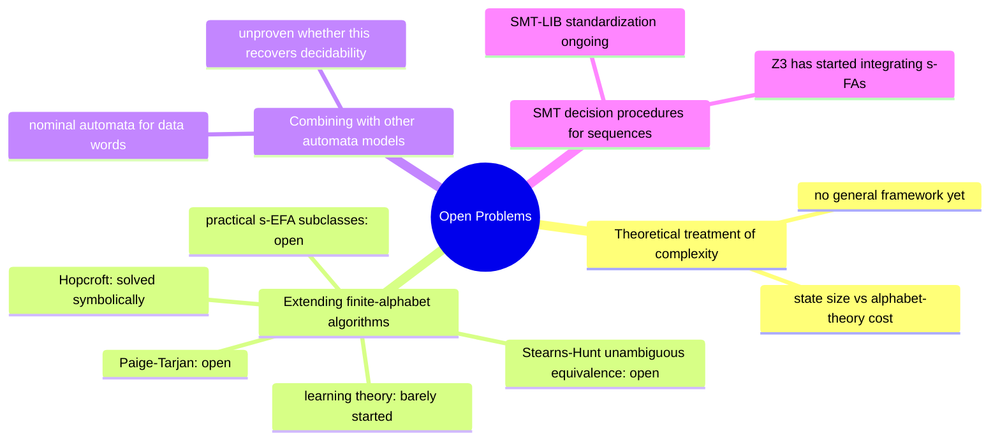

[[book-guidelines|↩ Back to guidelines]]

## Why the paper ends here

Every section before this one in the survey has a shape: define a symbolic model, then either prove the classic finite-alphabet result still holds (closure, decidability, minimization) or show precisely where it breaks (s-EFA equivalence, transducer injectivity, register-based emptiness). By Chapter 6, the authors have accumulated a long list of things that *don't* transfer cleanly from finite-alphabet automata theory. Chapter 6 is the honest accounting of that gap: which finite-alphabet techniques resist symbolic generalization, and why; which theoretical scaffolding (algebraic/co-algebraic treatments, learning theory) simply doesn't exist yet for symbolic models; and which applications (SMT solving, binary analysis) are just starting to exploit the symbolic idea. The Conclusion (Chapter 7) then compresses this into four standing questions the authors pose to the field. This article treats each open problem the way the source does — as a genuinely unresolved question, not a solved one dressed up as a puzzle. Where "what's known" ends and "what's missing" begins is the load-bearing distinction throughout.

A recurring pattern worth flagging up front, because it explains *why* so many of these problems are hard in the same way: classic automata algorithms often get their efficiency by exploiting that the alphabet is a small, enumerable, finite set — you can *iterate over it*, or *count strings over it*. Symbolic automata replace that alphabet with an arbitrary effective Boolean algebra, which might be countably or uncountably infinite and offers you exactly one primitive: a satisfiability oracle for predicates. Every open problem in §6.1 is really the same question asked of a different algorithm: "can this be re-expressed using only satisfiability queries, with no enumeration of the underlying domain?"

---

## 6.1 — Adapting finite-alphabet algorithms

### What already worked: Hopcroft's minimization

Recall from Chapter 2 that Hopcroft's minimization algorithm was already given a symbolic adaptation, with complexity $O(m \log n \cdot f(n\ell))$, where $n$ is the number of states, $m$ the number of transitions, $\ell$ a predicate-size bound, and $f(\ell)$ the cost of a single satisfiability check on a predicate of size $\ell$. The trick that makes this work: at each refinement step, the classic algorithm scans the alphabet to find a splitter symbol; the symbolic version instead builds a *predicate* that captures exactly the states needing to be split, using conjunctions/negations of existing transition guards, and checks *that* for satisfiability — no enumeration of $D$ required. This is the template every other adaptation in this section is trying, and mostly failing, to replicate.

**[[Symbolic-Finite-Automata#What breaks without this|What breaks without this]] substitution:** if you tried to naively lift Hopcroft's algorithm by materializing minterms first and running the classic algorithm over them, you'd pay the up-front minterm blow-up (recall Theorem 4's bound of up to $2^{n^2}$ minterms) before you even start minimizing — defeating the entire purpose of working symbolically in the first place. The value of a symbolic algorithm is precisely that it defers or avoids this blow-up.

### What resists: Paige-Tarjan's forward bisimulation

Paige-Tarjan's algorithm computes the coarsest forward bisimulation of a nondeterministic automaton — a relation you can think of as "these two states can be merged because they behave identically under all future observations." The classic algorithm's efficiency, $O(km \log n)$ over a finite alphabet of size $k$, comes from a data structure that, for every state $q$, alphabet symbol $a$, and current partition block $P$, maintains a running *count* of how many $a$-transitions from $q$ land in $P$. That count is [[Variants-of-Symbolic-Automata#The mechanism|the mechanism]] — and it has no symbolic analogue, because there is no way to iterate "for every symbol $a$" when the alphabet is a Boolean algebra rather than a finite set.

The paper reports two symbolic variants with genuinely different asymptotic behavior:

- A direct adaptation of the *efficient* Paige-Tarjan algorithm: $O(2^m \log n + 2^m f(n\ell))$ — exponential in the number of transitions.
- A symbolic adaptation of a *simpler*, less efficient classic algorithm (originally $O(km^2)$): $O(m^2 f(\ell))$ — polynomial, but built from the weaker starting point.

This is a striking trade-off with no finite-alphabet counterpart: the *more* sophisticated the classic algorithm, the *harder* it seems to be to make symbolic. **The open question is explicit and unresolved in the source: does an efficient (polynomial, or at least sub-exponential-in-$m$) symbolic adaptation of the full Paige-Tarjan algorithm exist at all?** The paper does not conjecture an answer either way.

### What also resists: unambiguous automata equivalence

The Stearns-Hunt algorithm checks language equivalence of two *unambiguous* nondeterministic finite automata (automata where every accepted string has at most one accepting run) in polynomial time. Its trick: count, for each length $i$ up to some small bound, how many strings of length $i$ each automaton accepts, and compare the counts. Two unambiguous automata are equivalent iff those counts agree for a length bound relatable to $n$. But this counting argument is intrinsically a *finite-alphabet* argument — "how many strings of length $i$ over alphabet $\Sigma$" is a number that only makes combinatorial sense when $\Sigma$ is finite and countable in a specific enumerable way. Over an effective Boolean algebra with an infinite domain, "count the strings" stops being a meaningful operation. The paper states plainly: **it is unclear whether this algorithm can be efficiently adapted to the symbolic setting.**

### Practical subclasses of s-EFAs

s-EFAs (symbolic extended finite automata, whose transitions read $k$-tuples of characters via multi-argument predicates) sit at the bottom of the "good properties" ladder in this survey: no Boolean closure, no decidable equivalence in general. But the paper's framing here is optimistic rather than defeatist: s-EFAs having *no finite-automata counterpart at all* means the field hasn't yet mapped out where the useful boundary between decidable and undecidable actually lies. The open invitation is to find **restricted subclasses — deterministic s-EFAs, unambiguous s-EFAs — that recover practically useful closure or decidability properties**, the same way Cartesian s-EFAs (restricted to single-variable atoms, discussed in Chapter 2) recovered full s-FA-level expressiveness by giving something up. This is a search for the *right restriction*, not a proof that no restriction exists.

*Why this should feel familiar if you've worked with higher-order unification:* general higher-order unification is undecidable, but Dale Miller identified a syntactically-restricted fragment — pattern unification, where metavariable arguments must be distinct bound variables — that is decidable, has most general unifiers, and turns out to be exactly the fragment that shows up in practice during type inference and elaboration. Searching for "practical subclasses of s-EFAs with good properties" is the same move: don't ask "is the general problem decidable" (it isn't), ask "which restricted-but-common-in-practice shape recovers decidability." An elaborator's implicit-argument resolution *is* a special-purpose restriction hunt of exactly this kind — it is the mechanism your unifier will need, applied to a different automaton-shaped problem.

### Learning theory for symbolic automata

Classic automata learning (Angluin's $L^*$ algorithm) works by querying an oracle: "is string $w$ in the language?" (membership queries) and "is this hypothesis automaton correct?" (equivalence queries, answered with a counterexample if not). Over a finite alphabet, refining a hypothesis by processing a counterexample eventually requires distinguishing behavior on every alphabet symbol — feasible only because the alphabet is small. Over a symbolic alphabet, you cannot query every domain element; there could be infinitely many. But the paper points out the escape hatch: **the learner doesn't need to learn a transition function over $D$, it needs to learn a small number of *predicates*, one per transition.** If the predicate space itself has bounded complexity, a finite number of membership queries can pin down each guard exactly. This reframes automata learning as learning a small set of formulas rather than a large function table — closer to constraint learning than to classic exact-learning-of-tables. The paper is explicit that **this has received only limited attention** and there is "an opportunity to develop interesting new theories in this domain," not a worked-out theory to summarize.

*Rust sketch — the shape of a symbolic membership-query loop, showing where the classic $L^*$ table-filling step gets replaced by predicate inference:*

```rust
/// A classic L* observation table entry answers "in language?" per string.
/// A symbolic learner instead accumulates constraints on a per-transition
/// predicate and only needs to disambiguate among a *small* candidate set
/// of predicates, not enumerate D.
trait PredicateOracle<D> {
    /// Classic: membership query over one character (only feasible if D is huge
    /// but the *learner* is smart about which characters it asks about).
    fn accepts(&self, w: &[D]) -> bool;
}

struct Hypothesis<P> {
    // one guard predicate per transition, refined incrementally
    transitions: Vec<(usize, P, usize)>,
}

impl<P: Predicate> Hypothesis<P> {
    /// Refining a guard on a counterexample: instead of splitting a state
    /// per alphabet symbol (classic L*), we strengthen or weaken a predicate
    /// so the new example is classified correctly — analogous to
    /// constraint propagation, not table enumeration.
    fn refine_guard(&mut self, transition_idx: usize, witness: &P::Elem, should_accept: bool) {
        // conceptually: transitions[transition_idx].1 := transitions[..].1  <op>  point_predicate(witness)
        todo!("predicate strengthening/weakening, the open research surface")
    }
}
```

*What breaks without this reframing:* if you tried to run vanilla $L^*$ against an s-FA by picking the underlying alphabet to be, say, all 32-bit integers, you'd need billions of membership queries just to distinguish states that differ on a handful of large-integer inputs — the algorithm's termination guarantee assumed a small alphabet, and blindly instantiating it over a huge concrete domain just reproduces the state-space explosion the symbolic representation was supposed to avoid.

---

## 6.2 — Theoretical treatments

### Complexity and expressiveness, properly formalized

Chapter 2 already showed the headline empirical fact: symbolic algorithm complexity depends on *two* independent axes — the automaton's state/transition size ($n$, $m$) and the alphabet theory's satisfiability cost ($f(\ell)$) — and that these axes trade off against each other (Moore's $O(mn \cdot f(\ell))$ vs. Hopcroft's $O(m \log n \cdot f(n\ell))$: Hopcroft wins on state complexity but pays more per satisfiability check). What doesn't yet exist is a *general theory* of this trade-off — a structural complexity framework, analogous to what classic automata theory has for state complexity alone, that would let you predict which regime an algorithm falls into without re-deriving it case by case. The paper names this directly as an open research question, not a solved one.

### Algebraic and co-algebraic treatments

Classic automata theory has a rich abstract reformulation: automata as coalgebras for a functor, minimization as computing a final coalgebra, determinization and Brzozowski's double-reversal minimization algorithm as instances of an algebra-coalgebra duality. This abstraction is not decorative — it's what let researchers unify proofs that were previously separate, tedious inductions. The paper flags that **it is unclear how to extend this coalgebraic machinery to symbolic models**, and calls the problem "intriguing from a theoretical standpoint" — language that signals genuine openness, not a hinted-at solution.

*Why this connects directly to your elaborator project:* a coalgebra for a functor $F$ pairs a carrier set $X$ with a structure map $X \to F(X)$; bisimulation between two coalgebras is exactly "no future observation distinguishes these states," and the *final* coalgebra is the canonical representative of that equivalence — precisely the trusted-kernel move of defining definitional equality co-inductively (two infinite streams, or two potentially-nonterminating computations, are equal iff they are bisimilar, not iff you can finish comparing them). Lean's kernel handles this exact shape of problem when checking definitional equality of terms that unfold recursive definitions: it doesn't unfold forever, it looks for a bisimulation-like coincidence. A coalgebraic account of *symbolic* automata minimization would be, in miniature, a coalgebraic account of "when are two guarded, predicate-labeled state machines observationally the same" — the same question your kernel's `isDefEq` answers for two possibly-infinite unfoldings of a recursive type or function, just posed over predicate-labeled transitions instead of over term reduction. No such account currently exists for the symbolic case; this is presented as a gap, not a result to cite.

```lean
-- Illustrative only: a final-coalgebra-flavored statement of bisimulation,
-- the kind of definitional-equality reasoning a coalgebraic account of
-- symbolic automata would need to formalize but currently doesn't.
-- (This is NOT from the source paper — it is the Lean-side analogy the
-- open problem gestures at.)
structure SymAutomCoalg (Q : Type) (Pred : Type) where
  step : Q → List (Pred × Q)   -- guarded transitions out of a state
  final : Q → Bool

-- "p and q are bisimilar" would need a symbolic-predicate-aware notion of
-- matching transitions -- comparing guards up to satisfiability, not
-- syntactic equality -- which is exactly the missing theory.
```

### Combination with nominal automata

Data words generalize strings: each position carries a pair $(a, d)$, where $a$ is drawn from a small finite tag alphabet and $d$ is a *data value* from a large or infinite domain (think: an XML tag name paired with an attribute value, or a variable name paired with its binding site). Various automata models exist for data words, but the paper singles out **nominal automata** as an especially elegant one: nominal automata restrict what you're allowed to do with data values to a small, well-behaved set of operations (chiefly: testing whether two data values at different positions are *equal*), and get good decidability properties in return.

The tension the paper highlights is sharp: s-EFAs *also* let you compare distinct characters across positions (that's what makes them "extended"), and s-EFAs are exactly the model shown earlier in the survey to have poor closure and decidability properties. So why would combining symbolic automata with nominal automata do any better than s-EFAs already do? The implicit answer the paper gestures at — without fully spelling it out, which is honest, since this is an open problem — is that nominal automata's *restriction* to equality-only comparisons (rather than arbitrary predicates over pairs of data values) might be exactly the discipline that recovers decidability, the same way Cartesian s-EFAs recovered s-FA-level properties by restricting to single-variable predicates. Whether this actually works, and what the resulting model's exact expressiveness and decidability boundary would be, is unproven and stated as future work.

*The type-theory echo here is substitution and $\alpha$-equivalence:* nominal sets are also the standard mathematical foundation (Pitts' nominal logic) for treating variable binding and $\alpha$-equivalence abstractly — a "name" is an atom, and a nominal set comes with a well-behaved notion of which names can be swapped without changing an object's identity. If your compiler's context/substitution machinery ever needs a principled account of *fresh* variable generation and capture-avoidance (the machinery under both Hoare-triple soundness proofs and elaboration, per your standing learning goals), nominal sets are the mathematical vocabulary that literature uses, and this open problem is asking whether that same vocabulary can discipline symbolic automata over data words the way it already disciplines binder-manipulating type theory. That connection is not made explicit in the source paper — it is the bridge this article draws for you — but the nominal-automata half of it is exactly as the paper presents it.

---

## 6.3 — New potential applications

### SMT solving over sequences, and integration with Z3

Modern SMT solvers reason well about bounded, structured domains — but sequences and strings, when the alphabet is anything beyond a small finite set, have historically been handled by ad hoc automata-based extensions bolted onto a solver rather than treated as a first-class theory. The paper's diagnosis of the current gap is precise: **existing string-capable solvers work over small finite alphabets**, which is exactly the assumption symbolic automata were built to remove. Since s-FAs already come with a satisfiability-oracle-based way of reasoning about predicates over arbitrary domains, they are a natural internal representation for a "theory of sequences" decision procedure. The paper reports this is not purely hypothetical — **Z3 had, at time of writing, started incorporating s-FAs to reason about sequences** — but frames the broader integration (and the parallel effort to standardize sequence/regex theories in the SMT-LIB format) as ongoing, unfinished work, not a completed picture.

*This is the most directly load-bearing item in this entire topic for your CSP-kernel and verification-condition work:* if your compiler needs to discharge a verification condition involving string or sequence-shaped refinements (a path constraint over parsed input, a regex-shaped precondition, a sanitizer contract), the honest state of the art per this survey is that off-the-shelf SMT sequence theories are still catching up to what symbolic-automata-based reasoning can already do internally. Treating s-FAs (or a Rust in-house symbolic-automaton library) as a *front-end* that compiles sequence constraints down to whatever your backend SMT solver's sequence theory actually supports — rather than assuming the solver's native sequence theory is already expressive enough — is a design decision this open problem should inform directly.

### Security: modeling program binaries and reflective code

The last item is the newest and least developed. Dalla Preda et al.'s approach uses an s-FA's *state space* to encode a binary's control-flow structure and its *predicates* to abstractly characterize the input/output semantics of each basic block — collapsing what used to be two separate techniques (syntactic structural comparison of control-flow graphs, and semantic comparison of block behavior) into one symbolic model where both live naturally. The stated promise is improved malware similarity detection, by comparing binaries at the level of "same control structure, semantically-compatible blocks" rather than "identical bytes" or "identical disassembly." The follow-on direction — using s-FTs (which add *output*, not just acceptance, to the model) to analyze **reflective code**, i.e., code that rewrites itself at runtime — is reported as work the same authors had only *just started*, with no results yet to summarize. This is presented in the source as the most speculative of the seven problems, and this article preserves that: there is no mature technique to report here, only a stated research direction and a plausible mechanism (predicates as abstracted I/O semantics of basic blocks) for why it might work.

---

## The Conclusion's four-question frame

Chapter 7 compresses the whole chapter into four standing questions, restated here as the closing frame the paper itself uses:



Two of these four map onto material this article already covered in more depth (extending algorithms → §6.1; SMT procedures → §6.3's first item); the other two (theoretical/complexity treatment, and combination with other models) are the abstract framings behind §6.2's parametric-complexity remark and the nominal-automata discussion, respectively. The security application (binaries, reflective code) is notably *not* one of the four restated questions — it's presented in §6.3 as a promising new application area rather than one of the field's core theoretical open problems, a distinction the Conclusion preserves by omission.

**Of the four, the one that connects most directly to Chapter 2's parametric-complexity discussion is the first** ("can we provide theoretical treatments of the complexities of the algorithms for symbolic models?") — it is the generalization of the exact $f(\ell)$-vs-$n$ trade-off Chapter 2 demonstrated concretely (Moore vs. Hopcroft) into a demand for a *general theory* of when such trade-offs exist and how to reason about them structurally, rather than case-by-case.

---

## Where this leads

This is the survey's last content chapter — nothing downstream in *this* paper depends on it. Its role is to point outward: toward a decidable-fragment search for s-EFAs (a direct cousin of the pattern-unification fragment your elaborator will need), toward a coalgebraic/bisimulation account of symbolic equivalence (the same shape of question your kernel's definitional-equality check already answers for term reduction), toward nominal automata as a possible bridge to binder-aware reasoning over data words, and toward SMT-over-sequences as a concrete near-term integration point for any verification-condition discharge involving string- or sequence-shaped refinements. None of these are settled theory — treat every claim above of the form "it is open whether..." as still open as of this paper's writing, not as a problem this article has quietly resolved for you.
