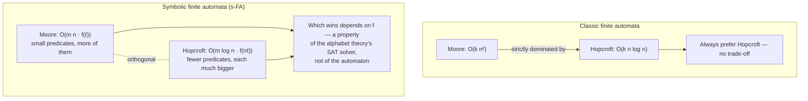

# Parametric Complexity of Symbolic Algorithms

[[book-guidelines|↩ Back to guidelines]]

## Why this section exists: complexity acquires a second dial

Every algorithms course teaches you to measure a DFA algorithm's cost against two knobs: the number of states $n$ and the size of the alphabet $k$. Emptiness checking is $O(n)$-ish, minimization is $O(kn\log n)$ with Hopcroft, and so on. Those bounds are safe because $k$ is *just a number* — the alphabet is a flat, finite set, and touching "every symbol" is a cheap, uniform operation.

[[Symbolic-Finite-Automata|Symbolic finite automata]] (s-FAs) break that assumption on purpose. An s-FA transition doesn't carry a symbol, it carries a *predicate* $\varphi$ over an effective Boolean algebra $A = (D, \Psi, \llbracket\cdot\rrbracket, \bot, \top, \vee, \wedge, \neg)$ — the alphabet is now potentially infinite (all integers, all Unicode codepoints, all machine words), and "does this transition fire on character $a$" isn't a table lookup, it's a satisfiability query: is $a \in \llbracket\varphi\rrbracket$? You saw in the companion article on s-FA definitions and minterms that this buys enormous succinctness (one transition guarded by `x > 0` instead of $2^{31}$ transitions, one per positive integer). But succinctness has to be paid for somewhere, and this section is about *where*: every algorithm that used to be "iterate over the alphabet" now has to become "issue a satisfiability query to the alphabet theory," and that query is not free and not uniform in cost.

**[[Symbolic-Finite-Automata#What breaks without this|What breaks without this]] accounting:** if you naively port a finite-automata algorithm to the symbolic setting and just replace "for each symbol $a$" with "for each predicate," you get a *correct* algorithm whose complexity claim is a lie — the classic $O(kn\log n)$-style bound silently assumed each per-symbol step costs $O(1)$. In the symbolic world that per-step cost is an SMT call, which can dominate everything else. The paper's whole point in §2.2 is to name that hidden cost explicitly, as a parameter, rather than let it hide inside a Landau symbol.

## The new parameter: $f(\ell)$, the cost of satisfiability

The paper introduces a function $f(x)$: the cost of checking satisfiability of a predicate of size $x$ in the underlying Boolean algebra $A$. This is deliberately left abstract — $A$ might be the equality algebra (where $f$ is trivial, near-constant) or `SMT`$_\mathbb{Z}$ backed by an SMT solver over linear arithmetic (where $f$ is realistically exponential in the worst case, since SAT-modulo-theories is itself intractable in general). The complexity of any s-FA algorithm is then reported as a function of the *classic* automata-theoretic parameters ($n$ states, $m$ transitions) **and** $f$, applied to whatever predicate size that algorithm happens to produce.

This is the paper's core methodological move for this section: **stop asking "what is the complexity of algorithm $X$ on s-FAs?" and start asking "what is the complexity of algorithm $X$ on s-FAs, as a function of $f$?"** Two algorithms that look identically ranked in the classic setting can become incomparable once you expose this second axis, because one algorithm might save on $n$ while feeding $f$ a much larger predicate — and there's no way to know which trade-off wins without knowing your specific $f$.

### Worked example: emptiness checking

Take the simplest possible algorithm — checking whether $L(M) = \emptyset$. Classically this is $O(kn)$ (or better, with reachability it's really about traversing $m$ edges, but bounding by $k \cdot n$ is the naive way to say "look at every possible transition"). Since s-FAs are normalized (§2.1: at most one transition between any ordered pair of states, so $m \le n^2$), the symbolic version doesn't need to enumerate characters at all — it just needs to check, for each of the $m$ transitions actually present, whether its guard is satisfiable, and then do ordinary graph reachability over the transitions that survive.

If $\ell$ is the size of the largest predicate appearing in $M$, this gives:

$$
\text{EmptinessCheck}(M) = O(m \cdot f(\ell))
$$

Notice what happened to $k$: it's gone. The symbolic algorithm's cost is *independent of alphabet size* — it only depends on the number of transitions actually written down ($m \le n^2$) and the cost of a satisfiability call on the largest guard. This is the sense in which symbolic automata are a genuine algorithmic improvement, not just a modeling convenience: an s-FA over the (infinite) integers with 10 transitions costs the same to check for emptiness as a classic automaton over an alphabet of size 10, not size $2^{32}$. The total representation size of $M$ itself is also cleanly $O(m\ell)$ — no $k$ dependency anywhere.

**What breaks without treating $f$ as a genuine parameter:** if you pretend $f(\ell) = O(1)$ (as if satisfiability checking were free), you'd conclude symbolic emptiness checking is strictly faster than classic emptiness checking with no caveat. That's true only when the theory really is cheap to decide (equality algebra: yes; nonlinear integer arithmetic: no, and there $f$ can dwarf $m$ entirely).

## Moore vs. Hopcroft: a trade-off with no classic analogue

The section's sharpest example is minimization, because it's a case where the classic theory has a *settled* answer that the symbolic theory *unsettles*.

**Classically**, for deterministic finite automata:

- **Moore's algorithm**: $O(kn^2)$ — repeatedly refine a partition of states by, at each state, checking behavior against every alphabet symbol.
- **Hopcroft's algorithm**: $O(kn\log n)$ — the well-known "process the smaller half" trick, refining partitions more cleverly so each state only participates in $O(\log n)$ splitting rounds instead of $O(n)$.

Hopcroft's bound is strictly better in $n$ (an extra $\log n$ factor is a very cheap thing to buy), and every algorithms textbook presents it as the automatic upgrade — you should basically never reach for Moore's algorithm once you know Hopcroft's exists. There is no trade-off to discuss classically; one algorithm dominates.

**Symbolically**, adapt both algorithms and something interesting happens. Let $n$ be the number of states, $m$ the number of transitions, $\ell$ the size of the largest predicate in $M$, and $f(x)$ the satisfiability-checking cost function as before:

$$
\text{Moore}_{\text{symbolic}}(M) = O(mn \cdot f(\ell))
$$

$$
\text{Hopcroft}_{\text{symbolic}}(M) = O(m\log n \cdot f(n\ell))
$$

Look closely at where the state-count parameter *moved*. In symbolic Moore, $n$ shows up as a multiplicative factor outside $f$ — it costs you an extra factor of $n$ in the "state-complexity" part of the bound, but every satisfiability query is still on a small predicate of size $\ell$ (the original guards, never combined). In symbolic Hopcroft, the $n$ has been *absorbed into the argument of $f$*: the clever partition-refinement bookkeeping that gives you the $\log n$ saving requires combining guards, so the predicates being checked for satisfiability now have size roughly $n\ell$ instead of $\ell$.

This is the crux: **Hopcroft's algorithm keeps its classic edge in "state complexity" (the $\log n$ vs. $n$ factor outside $f$), but pays for it by handing the alphabet theory a much bigger satisfiability query ($f(n\ell)$ vs. $f(\ell)$).** Whether Hopcroft is actually faster than Moore now depends entirely on how $f$ scales — a question that simply doesn't exist for classic automata, where satisfiability of "is this the target symbol" is $O(1)$ regardless of how many symbols you've conjoined into an intermediate structure.

The paper is careful to call the two algorithms' complexities "somewhat orthogonal": neither dominates the other in the general symbolic setting, unlike in the classic setting where Hopcroft simply wins. This is genuinely a new phenomenon — a place where a settled algorithmic ranking un-settles once you generalize the alphabet, purely because the generalization introduces a cost axis ($f$) that the classic setting had collapsed to a constant.

In practice, the paper notes that with modern SMT solvers, Hopcroft's symbolic variant tends to win anyway — decision procedures for common alphabet theories (linear arithmetic, bit-vectors) have gotten good enough in practice that paying $f(n\ell)$ instead of $f(\ell)$ is usually still cheaper than paying the extra factor of $n$ outside $f$. But that's an empirical, solver-dependent fact, not a theorem — which is itself the point: the *right* choice of minimization algorithm for a symbolic automaton is no longer a closed theoretical question, it's an engineering decision that depends on your alphabet theory's solver.



## Predicate growth: the mechanism behind $f(n\ell)$

Where does the blown-up predicate size $n\ell$ in symbolic Hopcroft actually come from? The paper flags this as a distinct, recurring phenomenon, not an artifact of one algorithm: **any algorithm that synthesizes new predicates out of old ones via repeated Boolean combination (conjunction, disjunction, negation) risks making those predicates syntactically larger with every combination step**, and a larger predicate can mean a more expensive satisfiability query — $f$ is a function of predicate *size*, and nothing guarantees $f$ is well-behaved (sub-linear, additive, etc.) as size grows.

This is the same mechanism you already met in determinization (subset construction) and minterm computation, elsewhere in Chapter 2:

- **Determinization** (Theorem 1) explicitly warns of a "predicate space explosion" alongside the classic state-space explosion: with $k$ inequivalent predicates and $n$ states, the determinized automaton can have up to $2^k$ distinct predicates and $2^n$ states — two independent exponential blow-ups, not one.
- **Minterms** (Theorem 4) bound the number of maximal satisfiable Boolean combinations of a predicate set at $2^{(n^2)}$ in general, $2^{n\log_2 n}$ for deterministic automata — again, a purely combinatorial consequence of repeatedly conjoining/negating a growing predicate set.
- **Hopcroft's symbolic adaptation** hits the same wall from a different angle: the partition-refinement step needs to test satisfiability of predicates built by combining guards across up to $n$ states, so predicate size scales with $n\ell$ even though the *number* of distinct predicates stays more modest than the minterm blow-up.

The common thread: **predicate growth from repeated Boolean combination is a structural hazard of every symbolic algorithm**, and the paper's parametric-complexity framing ($f(\ell)$, $f(n\ell)$, etc.) is precisely the vocabulary for tracking how badly a given algorithm makes this hazard bite. An algorithm can be "efficient" in the classic sense (few operations) while being terrible in the symbolic sense (each operation feeding $f$ an enormous predicate) — the two notions of efficiency have come apart.

## State complexity vs. alphabet complexity: the general trade-off

Zooming out, §2.2 establishes a template that recurs across the whole survey (and is picked up again explicitly in the Open Problems chapter, §6.1): **any symbolic algorithm can be assessed along two independent axes — how it behaves in $n$/$m$ (state complexity, the classic axis) and how it behaves in $\ell$ (alphabet/predicate complexity, the new axis)** — and improving one can cost you on the other.

This shows up again in the algorithms the paper surveys for the open-problems chapter:

- **Paige-Tarjan's forward-bisimulation algorithm** is Hopcroft's algorithm's cousin for nondeterministic automata, and it hits the same wall harder. The classic algorithm is $O(km\log n)$ using a per-symbol, per-partition transition count data structure — a data structure that fundamentally assumes you can enumerate the alphabet. Its best known symbolic adaptation is $O(2^m\log n + 2^m f(n\ell))$ — genuinely exponential in $m$, because the "for every symbol $a$" bookkeeping doesn't have a clean symbolic substitute the way Hopcroft's splitting step did. A simpler but cruder algorithm, $O(km^2)$ classically, turns into a *much* better symbolic $O(m^2 f(\ell))$ — no state-complexity blow-up, small predicates — at the cost of a worse classic baseline. Once again: the "better" classic algorithm doesn't automatically give you the better symbolic one, because the classic efficiency gain and the symbolic-friendliness are different, sometimes opposed properties of an algorithm's internal structure.
- **Hopcroft's minimization itself**, per §6.1, actually turned out to have "an efficient symbolic adaptation avoiding explicit alphabet iteration via crafted satisfiability checks" — i.e., someone found a way to implement the splitting step using cleverly constructed predicates rather than looping over minterms, which is what makes the $O(m\log n \cdot f(n\ell))$ bound achievable at all instead of paying an extra minterm-enumeration cost on top.
- **Stearns–Hunt's polynomial equivalence algorithm for unambiguous automata** is flagged as *resisting* symbolic adaptation altogether, because its polynomial-time argument relies on literally counting accepted strings of each length — a computation that presupposes a finite, enumerable alphabet in a way that doesn't have an obvious symbolic substitute (you can't "count strings" over predicates the way you count over concrete symbols).

The pattern across all three: **whether an algorithm survives the jump to symbolic alphabets, and at what cost, depends on whether its core technique secretly relies on alphabet enumeration** (Stearns–Hunt: yes, badly; Paige-Tarjan: yes, and the symbolic substitute is expensive; Hopcroft: yes, but a satisfiability-based substitute exists and is cheap). This is exactly the diagnostic question the parametric-complexity framework was built to let you ask precisely instead of impressionistically.

## Grounding: making $f$ concrete in code

The abstract function $f(\ell)$ is easiest to internalize by writing the two minimization variants against a trait boundary that makes the SAT-query cost visible as a real cost center, rather than hidden inside a black-box "alphabet iteration."

**Rust** — model the Boolean algebra as a trait, so the "cost of $f$" is literally whatever your `is_sat` implementation does; the point is that `refine_hopcroft` below builds a *combined* predicate before calling `is_sat`, which is exactly where the $n\ell$ blow-up in the theoretical bound comes from:

```rust
trait BooleanAlgebra {
    type Pred: Clone;
    fn and(&self, a: &Self::Pred, b: &Self::Pred) -> Self::Pred;
    fn not(&self, a: &Self::Pred) -> Self::Pred;
    /// This call is where f(size_of(pred)) is actually paid.
    fn is_sat(&self, pred: &Self::Pred) -> bool;
}

// Moore-style refinement: each satisfiability check is on an ORIGINAL guard,
// never a combination of guards — cost is f(ℓ), called O(m·n) times.
fn moore_step<A: BooleanAlgebra>(alg: &A, guards: &[A::Pred]) -> Vec<bool> {
    guards.iter().map(|g| alg.is_sat(g)).collect()
}

// Hopcroft-style refinement: the splitter predicate is built by conjoining
// (up to) n guards together before the satisfiability check — cost is f(nℓ),
// called only O(m log n) times.
fn hopcroft_split<A: BooleanAlgebra>(alg: &A, guards: &[A::Pred]) -> Option<A::Pred> {
    let mut combined = guards.first()?.clone();
    for g in &guards[1..] {
        combined = alg.and(&combined, g); // predicate size grows with each fold
    }
    alg.is_sat(&combined).then_some(combined)
}
```

The two functions above are a direct transliteration of the two complexity formulas: `moore_step` calls `is_sat` on small, un-combined predicates but does so proportionally to $n$ times more often; `hopcroft_split` calls it fewer times but on a predicate whose size has grown with every `and`. Swapping in a fast `is_sat` (say, an equality-algebra bitmask check) versus a slow one (an SMT-backed nonlinear-arithmetic check) is precisely the experiment that decides which minimization strategy wins for a given alphabet theory — which is exactly your CSP kernel's situation when it has to decide, for a given abstract domain, whether refining a partition via cheap per-element checks or via combined-constraint checks is the better strategy.

**Lean** — the cleanest way to see that $f$ is a genuine, separate cost parameter (not just an implementation detail) is to make it a hypothesis in a complexity-carrying specification, the way you'd bound a decision procedure's cost in a verified compiler:

```lean
structure BoolAlgebraCost where
  cost : Nat → Nat        -- f(ℓ): cost of SAT-checking a predicate of size ℓ
  monotone : ∀ a b, a ≤ b → cost a ≤ b   -- reasonable but not automatic

-- Symbolic Moore vs. Hopcroft bounds, as an explicit statement over f,
-- mirroring the paper's O(m·n·f(ℓ)) vs. O(m·log n·f(n·ℓ)) claims.
def mooreBound (f : Nat → Nat) (m n ℓ : Nat) : Nat := m * n * f ℓ
def hopcroftBound (f : Nat → Nat) (m n ℓ : Nat) : Nat := m * (Nat.log2 n) * f (n * ℓ)

-- Neither bound dominates the other for arbitrary f — this is the "orthogonality"
-- the paper describes; a Lean proof of dominance would need a concrete f.
```

This mirrors, in miniature, the shape of a soundness argument in your dependent-type compiler's cost model: you don't get to claim an optimization is "faster" until you've pinned down the cost function of the primitive operation you're trading off against — here, `f`; in an SMT-backed refinement-type checker, the analogous parameter is the cost of your VC-discharge calls, which is exactly why this section is a template for how to *think about* algorithmic trade-offs whose bottleneck is an external decision procedure.

**Python** — a five-line sketch is enough to make the qualitative point (predicate size as a literal string/AST length is a crude but honest stand-in for $\ell$, if you want to empirically eyeball how a naive SMT-backed `is_sat` scales):

```python
def is_sat_cost_estimate(pred_ast) -> int:
    # crude proxy for f(size(pred)): count of AST nodes, as an SMT call's
    # rough cost driver before you actually invoke z3.
    return sum(1 for _ in ast_walk(pred_ast))
```

## Where this leads

Section 2.2's parametric framing is the load-bearing idea for everything downstream in the survey: every later result — s-EFA's undecidability of equivalence, the applied sections' engineering choices about minterms vs. direct SMT calls, and the whole "Open Problems" chapter's assessment of which classic algorithms are worth symbolically adapting — is implicitly a claim about how some algorithm's complexity decomposes into an $(n, m)$-part and an $f(\ell)$-part, and whether that decomposition is favorable. The paper's own §6.1 explicitly reuses this vocabulary to explain *why* Hopcroft's algorithm adapted cleanly (a cheap symbolic substitute for alphabet iteration existed) while Paige-Tarjan's and Stearns–Hunt's did not (their core techniques are alphabet-enumeration-shaped in a way with no cheap symbolic substitute yet known).

For the `sat-smt-csp` focus area, this section is close to a template for how to reason about **any** algorithm whose bottleneck is calls to an external decision procedure: decompose the cost into "how many queries" (a combinatorial, automaton-shaped question) and "how expensive is each query" (a decision-procedure-shaped question, itself sensitive to how much the algorithm makes the query's *input* grow via repeated Boolean combination), and recognize that optimizing one factor can pessimize the other. That is exactly the shape of the trade-off your CSP kernel will face when deciding between refining an abstract domain via many cheap propagation steps versus fewer, more aggressive constraint-conjunction steps that each hand the underlying solver a larger formula — the Moore/Hopcroft split in this section is a clean, already-solved miniature of that exact design question.
