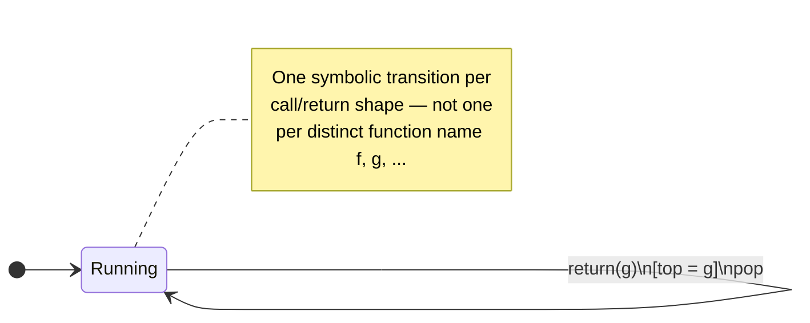

[[book-guidelines|↩ Back to guidelines]]

## Why this chapter exists: theory meets a $2^{16}$-symbol alphabet

Everything in Chapter 2 of the survey — determinization, Boolean closure, minterms,
the parametric-complexity split between state count and alphabet-theory cost — was
built to answer one practical complaint: **classic automata assume you can afford to
enumerate the alphabet, and real alphabets don't let you.**

The concrete number the authors give is $2^{16}$: the size of the UTF16 character
set that any real-world regular-expression engine has to handle. A classic DFA
transition table is, conceptually, a matrix of size (states) $\times$ (alphabet).
With $|\Sigma| = 2^{16}$, even a tiny five-state pattern-matcher would need a
transition table with hundreds of thousands of entries *per state*, most of them
identical guards repeated symbol-by-symbol ("any character that is not `<`,
`>`, or `&`" is one predicate, not 65,533 separate transitions). Classic automata
theory has no way to say "this transition fires on this whole predicate" — it
only has "this transition fires on symbol `a`." That's the mismatch symbolic
finite automata (s-FAs) were built to close, and Chapter 3 is the survey's
evidence that the fix actually works in deployed systems, not just on paper.

**What breaks without symbolic transitions:** every operation that classic
automata theory takes for granted — determinizing, complementing, minimizing —
becomes an operation over $|\Sigma|$ elements. Determinizing a nondeterministic
automaton via the subset construction, for instance, needs to inspect, for each
subset of states, what happens on *every* alphabet symbol. At $|\Sigma| = 2^{16}$
that's not merely slow, it's a completely different cost regime from the "small
constant alphabet" world that finite-automata textbooks are written for. Symbolic
automata replace "for every symbol" with "for every *predicate* actually
appearing in the automaton" — and the number of distinct predicates in a
hand-written regex is small even when the alphabet is enormous.

## 1. Modeling Unicode/UTF16 with BDDs and bit-vector theories

The move the survey describes: treat a UTF16 character not as an opaque atom
but as a 16-bit vector, and let the alphabet theory be a **theory of
bit-vectors**. A predicate like "is a hexadecimal digit" or "is not `<`, `>`,
or `&`" is then a formula over 16 boolean variables (the bits of the character
code), and two implementation strategies are used to represent and manipulate
such formulas:

- **Binary Decision Diagrams (BDDs)** over the bit-vector — a canonical,
  compressed representation of a boolean function of the 16 bits, letting
  Boolean-algebra operations (conjunction, disjunction, negation — exactly the
  $\vee, \wedge, \neg$ operations an effective Boolean algebra needs) run as
  graph operations on the BDD rather than truth-table enumeration over $2^{16}$
  rows.
- **Bit-vector arithmetic decided by an SMT solver** (the survey names Z3) —
  the predicate is handed to the solver as-is, and satisfiability queries
  (needed for emptiness-checking, minterm computation, and every other
  decision procedure in Chapter 2) are answered by the solver's bit-vector
  theory decision procedure instead of a custom BDD package.

Both are instances of the **effective Boolean algebra** $A = (D, \Psi,
\llbracket\,\rrbracket, \bot, \top, \vee, \wedge, \neg)$ from Chapter 2, with
$D = \{0,1\}^{16}$ (or, in the SMT case, the bit-vector sort `BV16`). What
changes between the two is *only* the representation of $\Psi$ and the
implementation of the required decidable-satisfiability oracle — everything
the rest of the theory (determinizability, minterms, decidable emptiness) says
about s-FAs applies unchanged, because it was proved parametrically in the
choice of algebra. This is the payoff of Chapter 2's abstraction: swap the
alphabet theory, keep every theorem.

**Rust grounding.** The natural encoding of a UTF16 predicate is a boxed
predicate trait with a `denotes` method and closure under the Boolean
connectives — this is literally an implementation of the effective-Boolean-
algebra interface as a Rust trait object:

```rust
trait Predicate: std::fmt::Debug {
    fn denotes(&self, c: u16) -> bool;
}

#[derive(Debug)]
struct BitRange { lo: u16, hi: u16 } // e.g. hex-digit ranges

impl Predicate for BitRange {
    fn denotes(&self, c: u16) -> bool {
        (self.lo..=self.hi).contains(&c)
    }
}

#[derive(Debug)]
struct Not(Box<dyn Predicate>);
impl Predicate for Not {
    fn denotes(&self, c: u16) -> bool { !self.0.denotes(c) }
}

#[derive(Debug)]
struct And(Box<dyn Predicate>, Box<dyn Predicate>);
impl Predicate for And {
    fn denotes(&self, c: u16) -> bool {
        self.0.denotes(c) && self.1.denotes(c)
    }
}
```

A transition guard is then just a `Box<dyn Predicate>`, and a symbolic
transition table is `Vec<(state, Box<dyn Predicate>, state)>` — an s-FA over
UTF16 without ever materializing a $2^{16}$-row table. The actual production
systems the survey cites go further and compile these predicate trees into a
real BDD or hand them to Z3's bit-vector solver, but the shape of the
abstraction — predicate as a first-class value satisfying a Boolean-algebra
interface — is exactly this.

**Python sketch (why the naive approach fails).** A five-line illustration of
the problem this solves — enumerating the alphabet is not a hypothetical
concern, it is what a naive implementation actually does:

```python
# Naive: materializes a transition per symbol. Fine for ASCII, catastrophic for UTF16.
transitions = {c: 'q1' for c in range(0x10000) if is_hex_digit(c)}  # 2^16 iterations

# Symbolic: the predicate IS the transition guard, no enumeration at all.
transitions = [(lambda c: 0x30 <= c <= 0x39 or 0x41 <= c <= 0x46 or 0x61 <= c <= 0x66, 'q1')]
```

**Lean note.** This section is deliberately not proof-theoretic — the
practical payoff here is engineering (compact representation, fast
satisfiability oracle), not a new judgment form or elaboration mechanism, so
forcing a Lean example would be a strained analogy in the sense the style
guide warns against. The one genuine connection is conceptual: an effective
Boolean algebra's decidable-satisfiability requirement is precisely the kind
of decidability property a trusted kernel needs before it can treat a
predicate as a first-class checkable object — the same shape of requirement
that shows up later in the book as the trusted, decidable core beneath
higher-level automata algorithms.

## 2. Downstream tools: PEX, QEX, and password generation

Once UTF16 predicates are tractable, s-FAs stop being a theoretical
convenience and become the engine behind three real analysis tools the survey
names explicitly:

- **PEX** — parametrized unit testing. Given a method with a string
  parameter constrained by a regular expression (e.g. "must be a valid
  email"), PEX needs to *generate* concrete strings that exercise different
  branches of the program under test. Turning the regex into an s-FA and
  walking accepting paths gives concrete witnesses without ever iterating
  over the UTF16 alphabet.
- **QEX** — automatic SQL query exploration. The same idea applied to
  generating SQL query strings that satisfy syntactic constraints, to find
  inputs that reach interesting parts of a query processor.
- **Password generation** — generating strings satisfying a policy regex
  ("at least one digit, one uppercase letter, length $\geq 8$") is exactly
  the problem of finding a path from the s-FA's initial state to a final
  state, then instantiating each predicate along the path with a witness
  value from its satisfying set — a task the effective Boolean algebra's
  satisfiability oracle answers directly.

The common mechanism underneath all three: **path-to-string realization**.
Given an accepting path $q_0 \xrightarrow{\varphi_1} q_1 \xrightarrow{\varphi_2}
\cdots \xrightarrow{\varphi_k} q_f$, a witness string is obtained by asking the
alphabet theory's satisfiability procedure for one satisfying element of each
$\varphi_i$ in turn. This is where the "$f(\ell)$, the cost of satisfiability
checking" term from Chapter 2's parametric-complexity discussion becomes a
literal wall-clock cost paid once per generated string, not per alphabet
symbol.

## 3. Alternation for Boolean combinations of regexes (s-AFA)

Text-processing pipelines routinely need the conjunction, disjunction, or
negation of several regular expressions at once — "matches pattern A and not
pattern B," or checking whether two complex sanitization patterns are
equivalent. Doing this with plain s-FAs means building product automata (for
intersection) or completing-then-swapping (for complement) exactly as in
Chapter 2's closure constructions — and each Boolean combination can multiply
the state count of the inputs. A conjunction of ten patterns, each with a
few dozen states, can blow up to a state count in the tens of thousands even
though the *alphabet* representation stayed compact.

**What breaks without alternation:** the succinctness s-FAs bought you on the
alphabet axis gets spent right back on the state axis, because Boolean
combination of automata is fundamentally a product construction. Symbolic
alternating finite automata (s-AFAs) — introduced in Chapter 2 as a variant —
are the fix: an s-AFA can represent "accepted by $A$ *and* accepted by $B$"
as a single automaton with existential and universal transitions, without
first materializing the product. The survey reports this was shown to be an
*effective* model in practice specifically for checking equivalence of
complex Boolean combinations of regular expressions in text-processing and
string-manipulating-program analysis — the succinctness alternation buys on
paper (Chapter 2 already notes s-AFAs are equivalence-expressive to s-FAs but
succinct) translates into a real algorithmic win here, despite s-AFAs'
otherwise higher worst-case theoretical complexity.

**Rust grounding.** Alternation is naturally expressed as a small enum
distinguishing existential ("some transition needs to hold") from universal
("all transitions must hold") branching — a typestate-free variant type that
mirrors the formula structure directly, avoiding ever constructing the
product automaton:

```rust
enum Transition<S> {
    Exists(Vec<(Box<dyn Predicate>, S)>), // at least one guard must be satisfied and lead to acceptance
    ForAll(Vec<(Box<dyn Predicate>, S)>), // every enabled guard's target must accept
}
```

Checking acceptance recurses over this structure per input character instead
of over an explicitly built product automaton — the "Boolean combination" is
encoded structurally rather than materialized as states.

## 4. Symbolic automata as an executable model: regex and XML code generation

Because an s-FA's transitions are predicates that a real program can evaluate
directly — `if predicate(current_char) { go to state q }` — an s-FA is not
just a specification, it *is* an executable matcher. The survey notes this
enabled measurable speed-ups in two settings: regular-expression processing
and XML processing. [[Variants-of-Symbolic-Automata#The mechanism|The mechanism]] is compilation, not interpretation: instead
of walking a generic automaton-interpreter loop that dispatches on predicate
objects at runtime, a symbolic automaton's states and transitions can be
compiled ahead-of-time into a sequence of conditional branches — essentially
turning the automaton into a `match`/`if`-`else` decision tree specialized to
the exact predicates in play, which a compiler can then optimize like
ordinary control flow.

```rust
// Compiled from an s-FA with 3 states over the "no <, >, &" predicate class —
// this is what code generation from the symbolic model produces, conceptually.
fn matches(input: &str) -> bool {
    let mut state = 0;
    for c in input.chars() {
        state = match state {
            0 if !is_reserved(c) => 1,
            1 if !is_reserved(c) => 1,
            _ => return false,
        };
    }
    state == 1
}
```

This is the same "executable model" idea that later resurfaces for symbolic
*transducers* (Chapter 5's branching, if-then-else structured transducers
generating real code for log/data pipelines) — Chapter 3 is where the survey
first establishes that a symbolic automaton is not merely more compact to
*store* than a classic one, it is more compact to *compile*.

## 5. Symbolic visibly pushdown automata for control-flow-graph recovery

The last application is a genuinely different shape of succinctness — not
alphabet compression, but **structural** compression of program call/return
behavior.

A classic automaton modeling an inter-procedural control-flow graph (which
function calls which, and where each call returns to) needs to remember,
on a stack, which function is "currently running" so that a `return`
statement can be matched to the correct call site. Encoded as a finite
automaton without genuine pushdown power, this requires states and
transitions whose count scales with the *number of functions* in the
program — every distinct function name that can appear on the call stack
needs its own bookkeeping in the automaton's structure, because a classic
automaton has no way to parametrize a transition by "whatever the top of the
stack happens to be."

Symbolic visibly pushdown automata (s-VPAs, introduced structurally in
Chapter 2 §2.3) fix this the same way s-FAs fixed the alphabet-size problem:
by replacing per-value transitions with a single predicate-guarded one. A
**visibly pushdown automaton** already restricts its pushdown behavior to
push-on-call, pop-on-return, no-stack-action-otherwise — call/return
structure is visible in the input alphabet's partition into call symbols,
return symbols, and internal symbols. The symbolic extension adds: instead
of one push/pop transition *per function name*, a single transition whose
guard checks the *predicate* "the name on top of the stack equals the name
of the function currently returning" — one transition, symbolically
quantified over all function names, rather than one transition per function.

$$
\text{call}(f) \Rightarrow \text{push } f, \qquad
\text{return}(g) \wedge (\text{top-of-stack} = g) \Rightarrow \text{pop}
$$

The survey reports this model was used in static analysis of program
failures specifically to model control-flow-graph properties succinctly —
the same n-functions-worth-of-states problem that plagues classic
inter-procedural analysis collapses to a fixed number of states plus one
symbolic call/return guard, independent of how many functions the analyzed
program has.



**Rust grounding.** The stack-discipline part is ordinary; the symbolic part
is that the guard on the pop transition closes over whatever was pushed,
rather than being one of $N$ hardcoded transitions:

```rust
enum Symbol { Call(String), Return(String), Internal }

struct SVpa {
    stack: Vec<String>,
}

impl SVpa {
    fn step(&mut self, sym: &Symbol) -> bool {
        match sym {
            Symbol::Call(f) => { self.stack.push(f.clone()); true }
            Symbol::Return(g) => {
                // the symbolic guard: top-of-stack == g, checked once,
                // not compiled as N separate transitions for N function names
                self.stack.pop().as_deref() == Some(g.as_str())
            }
            Symbol::Internal => true,
        }
    }
}
```

## Where this leads

Chapter 3 is the survey's proof-of-concept chapter for the automata half of
the paper: everything Chapter 2 built abstractly (effective Boolean
algebras, minterms, parametric complexity, the s-AFA and s-VPA variants) gets
cashed out here as deployed tools (PEX, QEX, password generators,
text-processing equivalence checkers, control-flow-graph recovery). The
survey then pivots, in Chapter 4, to *transducers* — automata that don't
just accept but also *produce* output — and Chapter 5 revisits this exact
"in practice" pattern for transducers (string sanitizers, BASE64/UTF
encoder correctness, code generation for data pipelines), so the
executable-model argument made here for automata (§4 above) is the direct
ancestor of the code-generation applications discussed there.

For the standing project: this chapter is the applied face of two Focus
Areas. Under **SAT/SMT/CSP** (`sat-smt-csp`), the BDD/bit-vector encoding of
UTF16 predicates is a concrete instance of representing a large or infinite
domain as a decidable theory with an efficient satisfiability oracle — the
same move the CSP kernel will need when representing abstract-data-structure
domains as automata/DFA-grammars over a bit-vector-like encoding, and the
"one predicate, not $2^{16}$ enumerated cases" trick is directly the shape of
domain propagation over a compactly-represented domain. Under **Static
Analysis & Abstract Interpretation** (`static-analysis`), the s-VPA
control-flow-graph application is a template for symbolic reachability
analysis over inter-procedural programs: a single symbolic call/return
transition standing in for per-function bookkeeping is exactly the kind of
succinct, parametrized representation an abstract interpreter needs when its
abstract domain must scale independently of program size — the same
motivation behind Galois-connection-based abstract lattices that avoid
enumerating concrete states.
