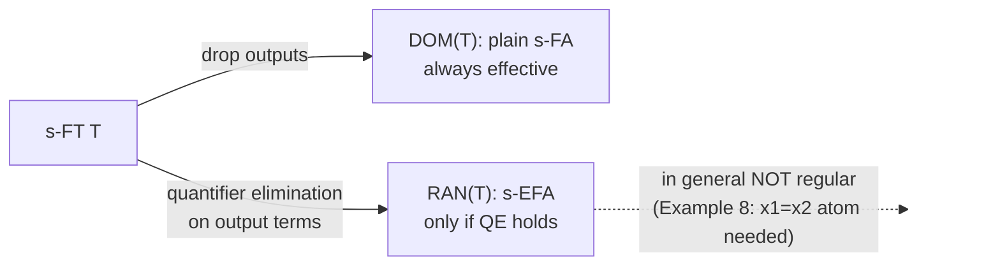
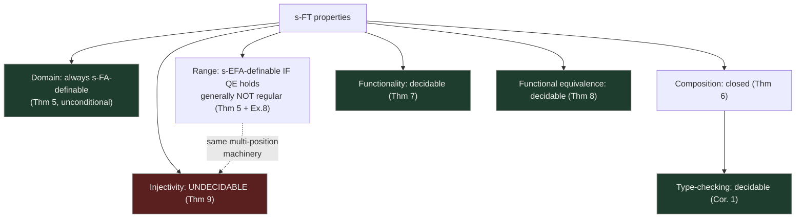

# Symbolic Finite Transducers (s-FT)

[[book-guidelines|↩ Back to guidelines]]

## The problem: automata that only accept, never transform

Everything up to this point in the survey — [[Symbolic-Finite-Automata|symbolic finite automata]] (s-FAs) — answers a yes/no question: does this string belong to the language? But a huge class of real problems isn't "accept or reject," it's "rewrite." A URL sanitizer doesn't accept or reject a string, it *produces* a cleaned one. A BASE64 encoder doesn't classify bytes, it *emits* a different byte stream. A log-processing pipeline doesn't check a line, it *transforms* it into a normalized record.

Classic automata theory already has an answer for this: finite-state transducers, which are just finite automata whose transitions are also allowed to emit output symbols. The question this section answers is the same one that motivated s-FAs in the first place: what happens when you replace the *concrete* input alphabet with a *symbolic* one — predicates over a rich, possibly infinite domain, plus functions computing outputs from that domain — and do the classic transducer theorems survive the upgrade?

The headline result, and the reason this section exists, is that **they mostly do, but not entirely, and the one place they fail is illuminating**. Domain, closure under composition, functionality, and functional equivalence all stay decidable. But the *range* of a symbolic transducer can fail to be a regular language at all (something that's simply impossible for classic transducers), and *injectivity* — decidable for classic transducers — becomes undecidable. Both failures trace back to the same root cause: once outputs are computed by arbitrary functions over an infinite domain instead of copied verbatim from a finite alphabet, equality between two output positions becomes a genuine algebraic question instead of a trivial symbol comparison.

## Step 1: giving transitions something to compute with — the label algebra

An s-FA's transitions carry *predicates* — functions $D \to \{\text{true}, \text{false}\}$ that decide whether an input character matches a guard. To build a transducer, transitions additionally need to *produce* output characters. The book's move is to extend the Boolean algebra from Chapter 2 with a second sort of syntactic object: **function terms**, written $\Lambda$, denoting total functions $D \to D$.

Think of $\Lambda$ as a tiny expression language, closed under composition:

- **Identity term** $x \in \Lambda$: $[\![x]\!](a) = a$ for all $a \in D$ — "pass the input through unchanged."
- **Constant term** $c \in \Lambda$ for every $c \in D$: $[\![c]\!](a) = c$ — "ignore the input, always emit this."
- **Composition** $g(f) \in \Lambda$ whenever $f, g \in \Lambda$: $[\![g(f)]\!](a) = [\![g]\!]([\![f]\!](a))$ — this is just function composition, $g \circ f$, spelled with application syntax because that's what will make substitution during transducer composition (Theorem 6) mechanical later.

Once you have function terms, you can lift predicates to talk about *the result of applying a term*, and you can compare two terms for equality *at a point*:

$$a \in [\![\varphi(f)]\!] \iff [\![f]\!](a) \in [\![\varphi]\!] \qquad\qquad a \in [\![f = g]\!] \iff [\![f]\!](a) = [\![g]\!](a)$$

The equality predicate $f = g$ deserves a moment of care, because it is easy to misread. **$f = g$ does not assert that the functions $f$ and $g$ are the same function.** It asserts something strictly weaker and pointwise: *at this particular input $a$*, the two terms happen to produce the same output. $f \neq g$ (shorthand for $\neg(f = g)$) is satisfiable exactly when there is *some* $a$ where the two terms disagree — which can be true even for two terms that agree almost everywhere. This point — comparing outputs of terms rather than the terms themselves — is exactly [[Variants-of-Symbolic-Automata#The mechanism|the mechanism]] that later makes injectivity undecidable (Theorem 9): deciding injectivity means deciding a first-order statement built entirely from these per-point equalities and disequalities, quantified over an infinite domain, and that turns out to be as hard as an undecidable tiling/Diophantine-style problem in general algebras.

A Boolean algebra extended with function terms, term-application predicates, and term equality predicates is called a **label algebra** — the alphabet theory a transducer is parametrized over, playing the same role $A$ played for s-FAs.

**Rust grounding.** A label algebra is precisely a small trait hierarchy: a `Predicate` trait (as before, for s-FAs) plus a `Term` trait with a `compose` combinator and an `eval` method:

```rust
trait Term<D> {
    fn eval(&self, a: &D) -> D;
    fn compose(self, inner: Self) -> Self where Self: Sized; // g(f)
}

// The three primitive term constructors:
enum FnTerm<D: Clone> {
    Id,                                   // x
    Const(D),                             // c
    Compose(Box<FnTerm<D>>, Box<FnTerm<D>>), // g(f)
}

impl<D: Clone> Term<D> for FnTerm<D> {
    fn eval(&self, a: &D) -> D {
        match self {
            FnTerm::Id => a.clone(),
            FnTerm::Const(c) => c.clone(),
            FnTerm::Compose(g, f) => g.eval(&f.eval(a)),
        }
    }
    fn compose(self, inner: Self) -> Self { FnTerm::Compose(Box::new(self), Box::new(inner)) }
}
```

The term-equality predicate `f = g` is just: build a fresh predicate closure `move |a: &D| f.eval(a) == g.eval(a)` and hand it to the SMT/decision procedure backing the underlying Boolean algebra — exactly the same "predicate is a closure plus a decidable satisfiability oracle" pattern as Chapter 2's SMT algebra, just now over a derived rather than atomic condition.

## Step 2: the s-FT definition — predicate-and-output-labeled automata

**Definition 2.** A symbolic finite transducer is a tuple $T = (A, Q, q^0, \Delta, F)$ where $A$ is an effective label algebra, $Q$ is a finite state set, $q^0$ the initial state, $F \subseteq Q$ the final states, and

$$\Delta \subseteq Q \times \Psi \times \Lambda^* \times Q$$

is a finite transition relation. Notation: a transition $(p, \varphi, \bar f, q) \in \Delta$ is written $p \xrightarrow{\varphi/\bar f} q$: read one input character $a$ satisfying guard $\varphi$, emit the *sequence* of outputs $[\![f_1]\!](a), \ldots, [\![f_k]\!](a)$ (one output per term in the list $\bar f$), and move to $q$.

This is exactly the s-FA definition from Chapter 2 with one extra slot bolted on. Concretely: **an s-FT in which every transition's output list is empty is literally an s-FA** — transducers strictly generalize automata, they don't replace them. This is the same relationship classic transducers have to classic DFAs, transplanted into the symbolic setting; the book calls the s-FA obtained by dropping the output component of every transition the **domain automaton**, $\mathrm{DOM}(T)$ — throw away what the transducer computes and you're left with what it merely accepts.

**Worked example (the book's Example 7).** Take $A$ to be integer linear arithmetic, so $\Lambda$ has terms like `x % 2` and $\Psi$ has atomic predicates like `x > 0`.

$$T_1 = \big(A,\ \{p\},\ p,\ \{\, p \xrightarrow{x>0\,/\,[x,x]} p \,\},\ \{p\}\big) \qquad T_2 = \big(A,\ \{q\},\ q,\ \{\, q \xrightarrow{x\%2\neq0\,/\,[x]} q,\ \ q \xrightarrow{x\%2=0\,/\,[]} q \,\},\ \{q\}\big)$$

$T_1$ passes through only positive numbers, duplicating each one. On input $[1,2,3]$, $T_1$ outputs $[1,1,2,2,3,3]$ (note $2$ survives here — $T_1$ has no filter against evenness, only against negativity). $T_2$ keeps odd numbers unchanged and drops even ones entirely (an empty output list on that transition — a transducer transition is free to emit *nothing*). On $[1,2,3]$, $T_2$ outputs $[1,3]$.

**Python sketch** (illustrative only, not load-bearing) of running such a transducer:

```python
def run(transitions, start, accept, input_seq):
    state, output = start, []
    for a in input_seq:
        for (p, guard, outs, q) in transitions:
            if p == state and guard(a):
                output.extend(f(a) for f in outs)
                state = q
                break
        else:
            return None  # stuck: a is outside dom(T) from this state
    return output if state in accept else None
```

This is deliberately naive (linear scan per symbol, first-match-wins) — its only job is to make concrete what "read one symbol, guard it, emit a term-computed sequence, move on" means operationally, before the formal semantics below states it precisely.

### Formal transduction semantics

For a single transition $r = p \xrightarrow{\varphi/[f_1,\ldots,f_k]} q$, its set of *concrete* instances is

$$[\![r]\!] = \{\, (p, a) \mapsto ([[\![f_1]\!](a), \ldots, [\![f_k]\!](a)], q) \mid a \in [\![\varphi]\!] \,\}$$

— i.e., unfold the symbolic transition into the (possibly infinite) set of all its ground instantiations, one per domain element satisfying the guard. Let $[\![\Delta]\!] = \bigcup_{r \in \Delta} [\![r]\!]$ be all concrete instances of all transitions. Then define $q \xrightarrow{u/v}\!\!\to_T q'$ for input sequence $u$ and output sequence $v$ by chaining these concrete steps: either $u = v = []$ and $q = q'$ (the empty run), or there's a chain of $n \geq 1$ concrete transitions $(p_{i-1}, a_i) \mapsto (v_i, p_i)$ whose inputs concatenate to $u$, whose outputs concatenate to $v$, with $q = p_0$ and $q' = p_n$.

From this, the whole apparatus you'd expect from a relation-valued computation:

$$T_T(u, v) \iff \exists q \in F:\ q^0 \xrightarrow{u/v}\!\!\to_T q \qquad\qquad T_T(u) = \{v \mid T_T(u,v)\}$$
$$\mathrm{dom}(T) = \{u \in D^* \mid \exists v:\ T_T(u,v)\} \qquad\qquad \mathrm{ran}(T) = \{v \in D^* \mid \exists u:\ T_T(u,v)\}$$

Two crucial refinements of "how well-behaved is $T_T$ as a function":

- **Deterministic**: $[\![\Delta]\!]$ is a *partial function* from $Q \times D$ to $D^* \times Q$ — at most one concrete transition fires from any (state, input-character) pair. This is guard-disjointness, generalized from s-FAs.
- **Functional / single-valued**: for every $u$, $|T_T(u)| \leq 1$ — $T_T$ behaves like a partial function $D^* \rightharpoonup D^*$, *even if* multiple nondeterministic runs are possible, as long as they all agree on the output. **Determinism implies functionality, but not conversely** — a nondeterministic transducer can still be single-valued if its different paths for the same input are engineered to always coincide on output. Both s-FTs in Example 7 above are in fact deterministic.

This distinction — deterministic vs. merely functional — is the transducer analogue of a type-checker distinguishing "syntactically unambiguous" from "semantically confluent": you can have multiple derivations that are guaranteed, by design, to reach the same answer.

**What breaks without functionality as a separate notion:** if you only had "deterministic" as your notion of well-behavedness, you'd be forced to determinize (or discard) any transducer built by, say, composing two nondeterministic pieces, even when the composition happens to be confluent by construction. Keeping functionality as a semantic (rather than syntactic) property is what lets Theorem 8 give you decidable equivalence-checking on transducers you didn't bother to determinize.

## Step 3: quantifier elimination and the domain/range asymmetry

Here is where symbolic transducers stop being a straightforward relabeling of the classic theory. For a **classic** finite-state transducer, both $\mathrm{dom}(T)$ and $\mathrm{ran}(T)$ are always regular — the output alphabet is finite, so "is $v$ some transducer's possible output" is a finite-state question by a simple projection argument. Symbolically, this argument only survives for one of the two sides.

**Domain is always fine.** Read off just the guards (drop the output terms) and you get exactly $\mathrm{DOM}(T)$, an ordinary s-FA. s-FAs are effective objects with decidable emptiness, so $\mathrm{dom}(T)$ is always s-FA-definable, full stop, no extra machinery required.

**Range is the hard direction**, because membership in $\mathrm{ran}(T)$ asks an *existential* question over the input: "does there exist some $a$ satisfying the guard, such that the output terms applied to $a$ produce exactly this tuple of values?" That's a formula with a bound variable ($a$) that needs to be eliminated to get something automaton-checkable. This is exactly **quantifier elimination**:

> An s-FT $T$ *admits quantifier elimination* if, for every transition $(p, \varphi, [f_1,\ldots,f_k], q)$ with $k \geq 1$, one can effectively compute a predicate $\psi \in \Psi$ (now $k$-ary — it talks about a $k$-tuple $\bar b$) such that
> $$\bar b \in [\![\psi]\!] \iff \exists a \in [\![\varphi]\!] : b_i = [\![f_i]\!](a) \text{ for } 1 \le i \le k.$$

In other words, $\psi$ is what you get from eliminating $\exists y$ out of $\varphi(y) \wedge \bigwedge_i x_i = f_i(y)$ — literally quantifier elimination in the classic logic sense (Presburger arithmetic, linear real arithmetic, and many SMT-friendly theories all support it; this is precisely why the SMT algebra from Chapter 2 is such a natural label-algebra instance).

**Theorem 5 (Domain and Range Languages).** Given an s-FT $T$: one can always compute an s-FA $\mathrm{DOM}(T)$ with $L(\mathrm{DOM}(T)) = \mathrm{dom}(T)$; and, *provided $T$ admits quantifier elimination*, one can compute an s-EFA $\mathrm{RAN}(T)$ (recall from Topic 5/2.3: extended s-FAs, whose transitions can read $k$-tuples at once via multi-variable atoms) such that $L_e(\mathrm{RAN}(T)) = \mathrm{ran}(T)$.

Notice the asymmetry baked directly into the theorem statement: the domain result needs *no hypothesis at all*, while the range result is conditional on quantifier elimination, and even when it holds, the witnessing automaton is an s-EFA, not a plain s-FA — because the eliminated predicate $\psi$ is inherently $k$-ary, comparing $k$ output positions against each other simultaneously (exactly what Cartesian s-EFAs, from Chapter 2, are *not* able to express in general).

**And in general the range is not even regular.** The book's Example 8 makes this concrete: take a single-state, single-transition s-FT $q \xrightarrow{\varphi_{\mathrm{odd}}(x)\,/\,[x,x]} q$ that duplicates its input whenever the input is odd. Its range is $\{[b_1,b_2] \mid b_1 = b_2,\ b_1 \text{ odd}\}$ — you cannot check "these two output positions are equal" with a scanning finite automaton over an infinite alphabet without the ability to *compare two read positions against each other*, which is exactly the extra power s-EFAs (and only s-EFAs) provide via the atom $x_1 = x_2$. The witnessing s-EFA transition is $q \xrightarrow{x_1 = x_2} q$.

**[[Symbolic-Finite-Automata#What breaks without this|What breaks without this]] machinery:** if you tried to naively claim "the range of a symbolic transducer is regular" by analogy with the classic case, you'd be wrong, and Example 8 is the two-line counterexample. The moment output terms can *duplicate or relate* values (rather than merely selecting them one-for-one from a finite output alphabet), the range becomes a genuinely relational property of the output sequence, which is beyond what a scanning automaton with no memory of prior positions can express — you need the s-EFA's ability to look at several positions in one guarded step.



## Step 4: closure under composition — the workhorse property

Everything downstream (type-checking, and in practice, sanitizer/encoder verification in Chapter 5) leans on one structural fact: **s-FTs compose, and the composition is itself an s-FT.**

**Theorem 6 (Closure under Composition).** Given s-FTs $T_1, T_2$, one can compute an s-FT $T_2(T_1)$ such that for all $u, v \in D^*$:
$$T_{T_2(T_1)}(u,v) \iff \exists w:\ T_{T_1}(u,w) \wedge T_{T_2}(w,v).$$

That is, $T_2(T_1)$ simulates running $T_1$ then feeding its output straight into $T_2$, *without ever materializing the intermediate string $w$*. This "fuse two passes into one machine, without building the intermediate output" is precisely the compiler-construction idea of **deforestation** / fusion — eliminating an intermediate data structure between two composed transformations — and the survey later name-checks exactly this connection when discussing symbolic tree transducers.

**How the construction works**, and why it needs the label-algebra machinery from Step 1: states of $T_2(T_1)$ are (a reachable subset of) pairs $(p,q) \in Q_1 \times Q_2$, one component tracking each machine's progress. Given a transition $p \xrightarrow{\varphi/[f_1,f_2]} p'$ in $T_1$ and a *chain* of two transitions $q \xrightarrow{\psi/[g]} q' \xrightarrow{\gamma/[h]} q''$ in $T_2$ (consuming $T_1$'s two outputs one at a time), the composed transducer builds:

$$(p,q) \xrightarrow{\ \varphi \,\wedge\, \psi(f_1) \,\wedge\, \gamma(f_2)\ /\ [\,g(f_1),\ h(f_2)\,]\ } (p', q'')$$

This is exactly **substitution**: everywhere $T_2$'s guards and outputs mention its own input variable, plug in $T_1$'s output term instead. $\psi(f_1)$ reads as "$T_2$'s guard $\psi$, evaluated not at a raw input character but at whatever $f_1$ computes" — literally the term-application predicate from Step 1, doing exactly the job it was built for. If the combined guard $\varphi \wedge \psi(f_1) \wedge \gamma(f_2)$ turns out unsatisfiable, that composed transition is simply dropped — this is where the underlying Boolean algebra's decidable satisfiability check earns its keep again.

**Worked example (Example 9, composing $T_1$ and $T_2$ from Step 2).** $T = T_2(T_1)$ has a single state $(p,q)$. Of the four naive candidate transitions (one $T_1$-output edge times one $T_2$ edge), only two survive the satisfiability filter:

$$(p,q) \xrightarrow{x>0 \,\wedge\, x\%2\neq0 \,\wedge\, x\%2\neq0\ /\ [x,x]} (p,q) \qquad\qquad (p,q) \xrightarrow{x>0 \,\wedge\, x\%2=0 \,\wedge\, x\%2=0\ /\ [\,]} (p,q)$$

So $T$ takes a list of positive numbers, duplicates every odd one, and deletes every even one; on $[1,2,3]$ it outputs $[1,1,3,3]$. Note this composed transducer is exactly the kind of thing you would *not* want to hand-write directly — the fusion is mechanical, but the guard conjunction that survives it (and the ones that get pruned as unsatisfiable) is exactly the kind of book-keeping you want an algorithm, not a person, to get right.

**Rust grounding — the substitution step, concretely:**

```rust
fn compose_transition(
    t1: (Pred, Vec<FnTerm<D>>),      // (guard φ, outputs [f1, f2]) from T1
    chain: Vec<(Pred, FnTerm<D>)>,   // [(ψ, g), (γ, h)] — the T2 chain consuming each output
) -> Option<(Pred, Vec<FnTerm<D>>)> {
    let (phi, fs) = t1;
    let mut guard = phi;
    let mut outs = Vec::new();
    for ((psi, g), f) in chain.into_iter().zip(fs.iter()) {
        guard = guard.and(psi.apply_term(f));   // ψ(f_i) : term-application predicate
        outs.push(g.compose(f.clone()));        // g(f_i) : term composition
    }
    if guard.is_satisfiable() { Some((guard, outs)) } else { None } // drop if UNSAT
}
```

The two primitives from Step 1 — `apply_term` (building $\psi(f)$) and `compose` (building $g(f)$) — are exactly what this loop needs; the label algebra wasn't decoration, it was the composition algorithm's toolkit.

## Step 5: type-checking falls out for free

**Corollary 1 (Type-checking).** Given an s-FT $T$ and s-FAs $M_I, M_O$, it is decidable to check: for all $v \in L(M_I)$, $T_T(v) \subseteq L(M_O)$.

Read this exactly as a function's type signature: $M_I$ specifies the input type (a regular language of allowed inputs), $M_O$ specifies the output type, and the corollary says "does $T$ actually respect this signature on every input, for every possible run?" is decidable. This is not a new theorem — it's a direct corollary of machinery already built: $L(M_I) \setminus \mathrm{dom}(T)$-restricted composition plus Theorem 5's guaranteed $\mathrm{DOM}(T)$, plus closure of s-FAs under Boolean operations and decidable emptiness from Chapter 2. Concretely: build the "bad" set (inputs in $M_I$ whose transduction escapes $M_O$) as an s-FA via composition and complementation, then check it for emptiness.

The book's example: using this type-checking algorithm, you can *prove* — not test, prove — that the composed transducer $T$ from Example 9 above always outputs a list of odd numbers of even length, for every list of positive numbers fed in. This is precisely the "checker for free once you have the right closure properties" pattern that a Hoare-logic-style verification-condition generator relies on: once your object language (here, s-FTs and s-FAs) is closed under the operations your specification language needs (composition, intersection, complement, emptiness), the actual checking algorithm is mechanical.

## Step 6: functionality and functional equivalence are decidable — but general equivalence is not

Checking whether two arbitrary s-FTs compute the same relation is undecidable — and this is not even a symbolic-specific pathology, it's already true for *classic* finite-alphabet transducers. What the symbolic setting inherits, and keeps, is the escape hatch that classic transducer theory already uses: restrict to **functional** (single-valued) transducers, where equivalence becomes tractable.

**Theorem 7 (Decidable functionality).** Given an s-FT $T$, it is decidable whether $T$ is functional.

**Theorem 8 (Decidable functional equivalence).** Given two *functional* s-FTs $T_1, T_2$, it is decidable whether $T_{T_1} = T_{T_2}$.

Both theorems reduce to one shared decision problem: given $T_1, T_2$, decide whether for all $u, v, w$, $T_{T_1}(u,v) \wedge T_{T_2}(u,w) \Rightarrow v = w$ — "whenever both transducers accept the same input, do they always agree on output?" (Functionality is the special case $T_1 = T_2$: does $T$ ever disagree with *itself* across two different accepting runs on the same input?) The algorithm for this shared problem works by exploring pairs of runs in lockstep and using the disequality predicate $f \neq g$ from Step 1 to search for a witness where the two runs' outputs *could* diverge — if no such witness is satisfiable, the transducers agree everywhere they're both defined.

This is the same shape of argument category theorists and unification engineers will recognize: functional equivalence isn't checked by enumerating outputs (impossible over an infinite domain), it's checked by a *symbolic* search over pairs of runs for a satisfiable disagreement, using exactly the equality-algebra machinery Step 1 built. It's structurally close to how a bidirectional type checker doesn't enumerate all terms of a type to check two derivations agree — it walks the two derivations together and checks agreement pointwise via a decidable equality procedure.

## Step 7: injectivity — the one place symbolic transducers get strictly harder

Here is the sharp negative result the whole section has been building toward.

> An s-FT $T$ is **injective** if for all $u \neq v \in D^*$, $T_T(u) \cap T_T(v) = \emptyset$ — no two distinct inputs can ever produce the same output.

For **classic** finite-alphabet transducers, injectivity is decidable. For **deterministic symbolic** transducers:

**Theorem 9 (Undecidable injectivity).** Given a deterministic s-FT $T$, it is undecidable to check whether $T$ is injective.

This is the sharpest possible contrast the survey draws in this whole section: determinism (the strongest well-behavedness condition on the transducer itself) buys you nothing here, and the property that was free in the classic theory is simply gone.

**Why.** The proof (from D'Antoni and Veanes' companion work) goes through s-EFAs, not through s-FTs directly: it shows undecidability of checking whether an s-EFA has two *different* accepting paths for the *same* string. Recall Theorem 5's range construction: $\mathrm{ran}(T)$ is witnessed by an s-EFA $\mathrm{RAN}(T)$ that reads $k$-tuples with atoms like $x_1 = x_2$ relating multiple output positions. Injectivity of $T$ is, essentially, a question about *ambiguity* of $\mathrm{RAN}(T)$ — "can two different input runs land on the same output tuple?" — and once you're asking an ambiguity question about an automaton whose guards can relate arbitrarily many read positions to each other via an arbitrary decidable theory, you've built something expressive enough to encode an undecidable problem (this is the same well the book's Chapter 2 discussion of s-EFAs' lost closure/decidability properties draws from — s-EFA equivalence and even emptiness-of-intersection are already undecidable). Since every s-EFA in this label theory can be realized as $\mathrm{RAN}(T)$ for *some* s-FT $T$, the undecidability transfers straight back to s-FT injectivity.

**The contrast with Theorems 7–8 is the pedagogical payoff of this whole subsection.** Functionality and functional equivalence stay decidable because their algorithm only ever needs *pairwise, same-input* comparisons — it walks two runs on the *same* string in lockstep, comparing outputs positionally, which stays within the term-equality fragment from Step 1 (a first-order theory over one shared "input so far" that the underlying algebra is assumed to decide). Injectivity instead needs to compare outputs coming from **two different, unrelated input strings**, with no shared position to walk in lockstep — and that comparison is exactly the *relational, multi-position* pattern that forced Theorem 5's range construction into s-EFA territory in the first place. The undecidability doesn't come from nondeterminism or from the transducer's own structure (the theorem is stated for *deterministic* $T$); it comes from what checking injectivity *requires you to express about the range*, and the range's necessary machinery is where s-FTs' good decidability properties run out.



## Lean grounding: term equality as a definitional-equality-shaped problem

The distinction the paper draws between $f = g$ (pointwise, at one input) and $[\![f]\!] = [\![g]\!]$ (as functions, everywhere) is worth pausing on for readers coming from dependent type theory, because it's structurally the same distinction Lean's kernel draws between **definitional equality** (`Eq.refl`-checkable by reduction, decidable, syntax-directed) and **propositional/extensional equality of functions** (funext-style, "these agree on all inputs," generally requiring proof, not decision).

- $f = g$ at a single point $a$, as used inside Theorem 6's composition and Theorems 7–8's functionality checks, is the well-behaved fragment: decidable because it's asked pointwise, in a context where the underlying label algebra already promises decidable satisfiability of the resulting formula (`isDefEq`-style: check a specific, syntactically-scoped equality, not a universal one).
- "Are $T_{T_1}$ and $T_{T_2}$ the same relation *everywhere*?" (general s-FT equivalence, and injectivity's implicit "for all $u \neq v$...") is the ill-behaved fragment: a universally-quantified equality over an infinite domain, structurally akin to needing full function extensionality rather than definitional equality — and, as Theorem 9 shows, sometimes it's not just hard, it's actually undecidable, not merely "not handled by the kernel's decision procedure."

This is a genuinely useful intuition to carry into elaborator design: **decidability in these systems tracks exactly how many quantifiers, and over what domain, the equality check needs to discharge** — a lesson that transfers directly to deciding when your own unifier can stay in the decidable "check syntactically-scoped equality" regime versus when it's being asked a universally-quantified question it has no business trying to decide automatically.

## Where this leads

Section 4.2 (Topic 8 in the guidelines) builds directly on the machinery introduced here: **finalizers** patch around the fact that a plain s-FT can't cleanly express "I was mid-pattern when input ran out" without extending the domain with sentinel symbols (awkward in a typed universe, as the book notes); **symbolic extended finite transducers (s-EFT)** generalize composition to multi-character reads and, predictably given Theorem 5's warning shot, *lose* closure under composition and decidable equivalence even when deterministic — the same expressiveness/decidability trade-off already seen for s-EFAs versus s-FAs in Chapter 2. Chapter 5's practical applications (string sanitizer verification, BASE64/UTF encoder correctness) are, almost without exception, direct instantiations of Corollary 1's type-checking algorithm and Theorem 6's composition closure — a sanitizer's safety property ("output never contains an unescaped `<script>`") is exactly a type-checking query against a safe-output s-FA, and composing two sanitizers to check commutativity or idempotence is exactly Theorem 6 applied twice.

For the standing project: this section is a concrete, already-worked-out instance of the **type-checking-via-closure-properties** pattern (Focus Area `sat-smt-csp`) that a Hoare-triple verifier needs — Corollary 1 is a miniature verification-condition generator, built entirely from decidable emptiness plus closure under composition and Boolean operations, with no bespoke proof search required. The functionality/injectivity split (Theorems 7–9) is also a sharp, concrete data point (Focus Area `type-theory`) for calibrating a metavariable unifier's own decidability boundary: "compare two runs on the same input, pointwise" stays decidable; "compare outputs across two different, unrelated inputs" is exactly the shape of question that can silently smuggle in undecidability, and is worth recognizing by pattern before committing an elaborator's unifier to attempting it eagerly.
