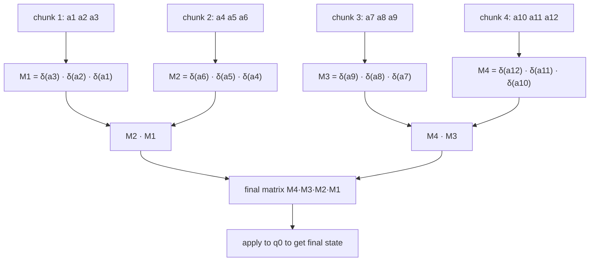
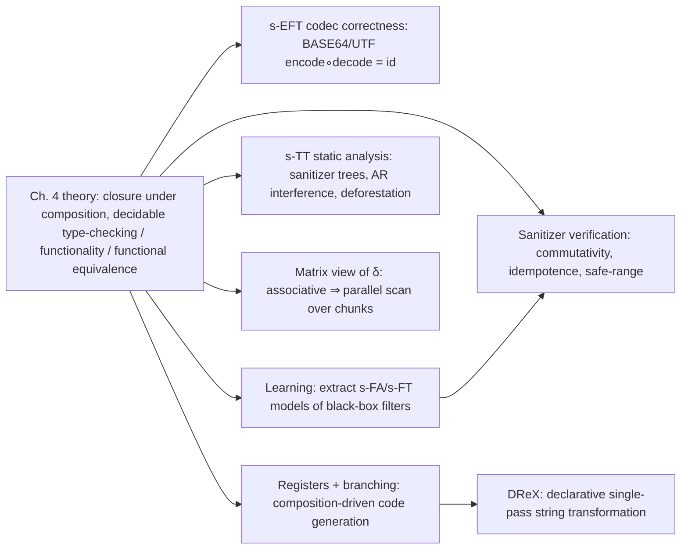

[[book-guidelines|↩ Back to guidelines]]

## Why this chapter exists

Chapter 4 built the theory: [[Symbolic-Finite-Transducers|symbolic finite transducers]] (s-FTs) are decidable enough to be *useful* — you can check type-checking, functionality, and functional equivalence — but not so powerful that everything becomes undecidable (only injectivity falls off that cliff). Chapter 5 is the payoff. It asks: once you have a formalism where "does this transformation preserve a safety property" is a decidable question, what do you actually plug it into?

The answer the survey gives is refreshingly concrete: **string sanitizers that defend web pages against cross-site scripting**, **the BASE64/UTF codecs baked into every network stack**, **black-box input filters you don't have source code for**, **list/tree-shaped program transformations inside a compiler**, and **data-parallel execution of string processing that looks inherently sequential**. Each of these is a place where "is my string-to-string function safe/correct/parallelizable" used to be answered by testing, code review, or hand-proof — and s-FTs (and their extended/tree/register/branching cousins from Chapter 4.2) turn it into a decision procedure.

This is also the chapter where the survey's running theme — *symbolic models replace "iterate over every character" with "reason about the predicate/term algebra directly"* — earns its keep. Every application below is a case where the input alphabet (Unicode, arbitrary byte streams, arbitrary ASTs) is too large or too unstructured to enumerate, and the s-FT machinery's whole reason for existing is to sidestep that enumeration.

## 1. String sanitizers as verification targets

**The problem, concretely.** A web application embeds untrusted user input into an HTML page. If that input contains `<script>...</script>` unescaped, the browser executes it — a cross-site scripting (XSS) attack. The standard defense is a *sanitizer*: a function that rewrites dangerous characters (`<`, `&`, `"`, …) into their HTML-entity encodings (`&lt;`, `&amp;`, `&quot;`, …) before the string is inserted into the page.

The book's own framing is precise about what actually needs to be checked once a sanitizer $A$ is modeled as an s-FT $T_A$ (§5.1, echoing the original motivation for s-FTs cited from [30]):

- **Commutativity**: does the order of applying two sanitizers matter? Formally, $T_{A(B)} = T_{B(A)}$ — composing $A$ after $B$ transduces the same relation as $B$ after $A$.
- **Idempotence**: does re-sanitizing already-sanitized output change anything? Formally, $T_{A(A)} = T_A$.
- **Safe-range**: can *any* output of the sanitizer, no matter the input, still be dangerous? Formally, $\mathrm{ran}(A) \subseteq \mathrm{SafeSet}$, where $\mathrm{SafeSet}$ is (usually) an s-FA-definable language of strings guaranteed not to trigger script execution in the target context.

**[[Symbolic-Finite-Automata#What breaks without this|What breaks without this]].** All three properties sound like things a sanitizer author would obviously get right by construction — but real deployed sanitizers have failed exactly these checks in practice (double-encoding bugs from non-idempotent sanitizers, context-confusion bugs from non-commuting sanitizer chains, and outright bypasses from sanitizers whose range wasn't actually safe in the HTML context they were used in). Before s-FTs, checking these properties meant either exhaustive testing over a sample of inputs (unsound — Unicode is a $2^{16}$-element alphabet, you cannot enumerate it) or manual proof. The whole point of Chapter 4's decidability results is that these three checks reduce to **language-equivalence and inclusion problems over s-FAs and s-FTs**, which Chapter 2 and Chapter 4 already proved decidable — commutativity and idempotence via Theorem 6 (closure under composition, which is what lets you even *build* $T_{A(B)}$ and $T_{B(A)}$ as s-FTs) plus Theorem 8 (decidable functional equivalence), and safe-range via Theorem 5 (the range of an s-FT, or of its s-EFT generalization, is characterizable as a language you can check inclusion against).

**Worked example, reusing Chapter 4's own transducers.** Recall from Chapter 4 (Example 7) the two toy s-FTs over integer linear arithmetic:

$$T_1 = (\{p\},\ p,\ \{p \xrightarrow{x>0/[x,x]} p\},\ \{p\}) \qquad T_2 = (\{q\},\ q,\ \{q \xrightarrow{x\%2\neq 0/[x]} q,\ q \xrightarrow{x\%2=0/[]} q\},\ \{q\})$$

$T_1$ duplicates positive numbers; $T_2$ deletes even numbers. If you think of "positive-and-duplicated" and "odd-only" as two independent sanitization passes, you can ask: do $T_1$ and $T_2$ commute? The book's Example 9 already computes $T_2(T_1)$ explicitly and shows it keeps only positive odd numbers (duplicated) — you'd compute $T_1(T_2)$ the same way and check functional equivalence between the two composed transducers. This is *exactly* the commutativity check above, just instantiated on toy sanitizers instead of HTML-entity encoders — the machinery doesn't care which domain the label algebra is over.

**Rust grounding — safe-range as a typestate check.** The safe-range property is naturally a typestate/subtyping question: does every output string belong to a known-safe subtype of `String`? A minimal skeleton capturing the *shape* of the check (not a full s-FT engine):

```rust
/// A symbolic predicate over characters — the s-FA's "guard".
trait CharPredicate {
    fn holds(&self, c: char) -> bool;
}

/// A safe-range check: does every reachable output of `sanitize`
/// land inside `safe`? In the paper this is `ran(A) ⊆ SafeSet`,
/// decided via s-FA/s-FT closure and inclusion — here we only
/// sketch the *specification* the decision procedure would verify.
struct SafeRangeSpec<P: CharPredicate> {
    safe_set: P,
}

impl<P: CharPredicate> SafeRangeSpec<P> {
    /// A *sound but incomplete* runtime check (testing, not proof):
    /// real s-FT verification instead compiles `ran(sanitize)` to an
    /// s-EFA and checks language inclusion symbolically, without
    /// ever enumerating characters like this loop does.
    fn spot_check(&self, sanitize: impl Fn(&str) -> String, sample_inputs: &[&str]) -> bool {
        sample_inputs
            .iter()
            .map(|s| sanitize(s))
            .all(|out| out.chars().all(|c| self.safe_set.holds(c)))
    }
}
```

The comment matters more than the code: this loop is what you'd write *without* symbolic transducers, and it is unsound over an infinite/huge alphabet. The s-FT version replaces the `sample_inputs` loop with a single satisfiability query against the label algebra — no samples, a proof over all inputs at once.

## 2. BASE64/UTF codecs and why s-EFTs are unavoidable

**What breaks with plain s-FTs.** A plain s-FT (Chapter 4's core model) reads *one* input character per transition. That's fine for a per-character sanitizer (escape `<`, escape `&`, ...), but a BASE64 encoder reads **three input bytes at a time** and produces four output characters by slicing and recombining bits across the three-byte group — the output at position $i$ depends on bits from more than one input character. There is no way to express "look at three characters jointly" inside a transition that only ever consumes one.

This is precisely the gap that **symbolic extended finite transducers (s-EFTs)**, introduced in Chapter 4.2, were built to close: their transitions read $k$-tuples the same way s-EFAs generalize s-FAs (via the $\mathrm{IsTup}_k$ / projection-term machinery from Chapter 2.3). The book is explicit that this multi-character codec problem is the *original motivating use case* for s-EFTs [19], not an afterthought.

**What you get once you have it.** With s-EFTs you can state and *decide* real correctness properties of codecs: that an efficient BASE64 or UTF encoder/decoder pair actually inverts correctly — i.e., $\mathrm{decode}(\mathrm{encode}(x)) = x$ for all $x$ — as a transducer-equivalence check rather than a hand proof or a fuzz-tested belief. The survey also flags a more recent and stronger result: given a correct-by-construction encoder, you can *automatically compute its inverse* as an s-EFT [33], rather than writing the decoder by hand and separately proving it matches.

**The recurring trade-off.** This is a direct instance of Chapter 4.2's general warning: s-EFTs buy multi-character expressiveness at the cost of losing composition-closure and decidable equivalence *in general* — they only recover decidability when the multi-character guard decomposes into a conjunction of single-position predicates $\varphi_1(x_1) \wedge \cdots \wedge \varphi_n(x_n)$ [19]. BASE64/UTF codecs are exactly the kind of transformation where this decomposition is natural (each output byte's guard really does split along byte-position lines), which is *why* the technique works here rather than being a purely theoretical curiosity.

## 3. Learning symbolic models of black-box filters

Sometimes you don't have the sanitizer's source at all — you have a PHP web application's input-validation function, or a third-party string sanitizer, as an executable black box. The survey cites two concrete results here: automata/transducer-learning algorithms (variants of the classic Angluin-style learning-from-queries framework, generalized to the symbolic setting per the open-problems discussion in Chapter 6.1) have been used to **automatically extract s-FA/s-FT models of PHP input filters** [12] and of **string sanitizers** [8], in both cases modeling programs that classic (non-symbolic) automata-learning couldn't handle because the alphabet was too large to query character-by-character.

This connects directly back to a point made in Chapter 6.1: the reason symbolic learning is even feasible here is that the learner only needs to learn *predicates on transitions*, not responses for every alphabet symbol — a finite number of oracle queries can pin down a predicate over an effectively-infinite domain, the same asymmetry that makes satisfiability checking (rather than enumeration) the right primitive throughout this whole framework.

**Why this matters for verification, not just modeling.** Once you've learned an s-FA/s-FT model of a black-box filter, you're back in Section 1's world: you can now run the *same* commutativity/idempotence/safe-range checks against a filter you never had source access to. Learning and verification compose.

## 4. Static analysis of list- and tree-manipulating programs

Symbolic *tree* transducers (s-TTs, the tree generalization of s-FTs from Chapter 4.2, where an s-FT is the degenerate case in which every tree node has at most one child) have been used for genuine program-analysis tasks over functional programs that manipulate lists and trees [23]:

- **HTML sanitizer verification** — but now over the *parse tree* of the HTML document rather than the flat character stream, letting the analysis reason about nesting/context (e.g., "is this attribute value inside a `<script>` tag") that a purely string-level s-FT cannot see.
- **Interference checking for augmented-reality apps** — checking whether two AR applications submitted to an app store could conflict in how they manipulate a shared scene-graph-like tree structure.
- **Deforestation** — a classical compiler optimization that eliminates intermediate data structures produced and immediately consumed by composed functions (e.g. `map f (map g xs)` fusing into a single pass). Symbolic tree transducers give a *decidable* handle on when two composed tree transformations can be fused, generalizing the same composition-closure idea from Theorem 6, now over trees instead of strings.

The throughline: whenever a static analysis needs to reason about a structural transformation (string or tree) *symbolically* — i.e., without enumerating the underlying alphabet or the space of trees — the s-FT/s-TT toolkit is [[Variants-of-Symbolic-Automata#The mechanism|the mechanism]], and closure under composition is what lets separate analysis passes be combined into one decidable question instead of stacked unsoundly.

## 5. Data parallelism from the transition function's algebra

This is the most structurally interesting idea in the chapter, because it's a genuine *algorithmic* insight rather than a modeling convenience.

**The observation.** Running a DFA over a string looks inherently sequential: state $q_{i+1}$ depends on state $q_i$ and character $a_i$, so you seem to need the whole prefix before you can compute the last state. But fix the automaton and think of "processing character $a$" as a **function from states to states**, $\delta_a : Q \to Q$. Composing transitions is then composing these functions: processing the string $a_1 a_2$ from state $q$ means $\delta_{a_2}(\delta_{a_1}(q))$. Represent $\delta_a$ as a $|Q| \times |Q|$ 0/1 matrix (row $p$, column $q$ has a $1$ iff $\delta(p, a) = q$); then **function composition is exactly matrix multiplication**, and matrix multiplication is associative. Associativity is the one property you need for a computation to admit a parallel prefix-sum (scan): you can split the string into chunks, compute each chunk's transition matrix independently and in parallel, and then combine the per-chunk matrices with a parallel reduction tree instead of a sequential fold [39].



Each chunk's matrix is computed independently (no dependency on other chunks); only the combination step is a reduction, and reductions parallelize in $O(\log n)$ depth instead of $O(n)$ sequential steps.

**Lifting to the symbolic setting.** The book's point (§5.2, citing [58]) is that this matrix view lifts cleanly from classic DFAs to s-FAs/s-FTs: the transition function is still a function $Q \to Q$ (or, for a transducer, a function producing a state *and* an output chunk) once you've fixed which predicate a character satisfies — the predicate evaluation, not the matrix algebra, is the only place symbolic-ness enters. This is what makes common string transformations expressed as symbolic transducers parallelizable "for free," without redesigning the algorithm — you get the parallel-scan structure from the algebraic shape of $\delta$, independent of whether the alphabet is finite or symbolic.

**Rust grounding.** The essential structure is a monoid: transition functions under composition, with identity the identity function on states. This is worth internalizing precisely because "spot a monoid, get a parallel scan" is a completely general technique, not specific to automata:

```rust
/// A finite-state transition function, viewed as a monoid element
/// under composition — this is the "matrix" of the survey's analogy.
#[derive(Clone)]
struct TransitionFn {
    // table[state] = state after consuming this chunk of input
    table: Vec<usize>,
}

impl TransitionFn {
    fn identity(n_states: usize) -> Self {
        TransitionFn { table: (0..n_states).collect() }
    }

    /// Composition: `self` then `other` — matches δ(a2) · δ(a1)
    /// in the write-up above (apply self's effect first).
    fn then(&self, other: &TransitionFn) -> TransitionFn {
        TransitionFn { table: self.table.iter().map(|&s| other.table[s]).collect() }
    }
}

/// Parallel scan: independent per-chunk matrices, then a
/// logarithmic-depth reduction — the associativity of `then`
/// is the only fact this relies on.
fn parallel_transition(chunks: &[TransitionFn]) -> TransitionFn {
    match chunks.len() {
        0 => panic!("need at least one chunk"),
        1 => chunks[0].clone(),
        n => {
            let mid = n / 2;
            let (left, right) = (parallel_transition(&chunks[..mid]), parallel_transition(&chunks[mid..]));
            left.then(&right)
        }
    }
}
```

(A real implementation would run the two recursive halves in parallel — with `rayon::join`, say — and would compute each leaf `TransitionFn` from a *predicate* evaluation rather than a literal character lookup once lifted to the symbolic setting; the sketch keeps the monoid structure visible.)

## 6. Code generation with registers and branching

Chapter 4.2 introduced two structural variants specifically because plain s-FTs weren't a good enough *target* for code generation: **registers** (for loop-carried state, e.g. "the maximum value seen so far") and **branching transitions** (if-then-else structured, one branch rule per state, giving built-in determinism). Section 5.2 reports where these variants actually get used: log/data processing pipelines that need loop-carried state across records, where composition-driven construction of a combined transducer is followed by direct code generation from its register/branching structure [45]. The branching representation matters here for a very code-generation-specific reason: it "maintains code structure, sharing, and predicate evaluation order" — i.e., compiling a branching transducer to a sequence of nested `if`/`else` statements is close to mechanical, whereas compiling a set of unordered guarded transitions requires reconstructing that control structure from scratch.

## 7. DReX: declarative regular string transformation

The chapter closes with **DReX** [7], a declarative language whose implementation is *built on* symbolic automata and transducers, for specifying regular string transformations that execute in a single left-to-right pass over the input. The pitch is the classic declarative/imperative split: you write *what* transformation you want (in a combinator language closer to regular expressions than to a hand-written state machine), and the compiler produces the transducer — with all of this chapter's decidable-property machinery (composition, functionality, equivalence) available on the compiled output for free. DReX has since been extended to stream *numerical* data using a "numerical" extension of symbolic transducers [36], stretching the model from "characters and strings" toward general single-pass streaming computation.

## Where this leads



Everything in this chapter is downstream of exactly two theoretical facts from Chapter 4: **closure under composition** (Theorem 6) and **decidable functional equivalence for functional s-FTs** (Theorem 8). Every "does property X hold" question here — commutativity, idempotence, safe-range, codec correctness — is really the same decision procedure instantiated on a different pair of composed transducers. That is the chapter's real lesson, and it is the same shape of argument that recurs everywhere in your standing project: a hard-looking safety question ("is this transformation safe against all inputs") becomes tractable exactly when you can (a) build the object representing "all possible outcomes" symbolically (here: the composed transducer's range/domain, via Theorem 5's quantifier-elimination machinery) and (b) reduce the safety question to a decidable inclusion/equivalence check over that object rather than enumerating concrete inputs.

For the `sat-smt-csp` focus area specifically: the safe-range check $\mathrm{ran}(A) \subseteq \mathrm{SafeSet}$ is a **verification-condition discharge** in miniature — "for all reachable outputs, a safety predicate holds" is exactly the shape of a Hoare-postcondition check, just over a transducer's range instead of over a program's states, and it is decided the same way a solver decides a VC: by turning "does an unsafe output exist" into a satisfiability query (here, over the label algebra) rather than a search over concrete strings. For `static-analysis`: the s-TT applications in Section 4 (HTML sanitizer verification over parse trees, deforestation) are a direct instance of the "sound over-approximation of program behavior, decided symbolically" pattern that your abstract-interpretation work will need for automated invariant generation — the difference is that here the "program" being analyzed is itself a tree transformation, and the "invariant" is a regular (or tree-regular) language rather than a numeric abstract-domain element. Chapter 6's open problems ([[Open-Problems-in-Symbolic-Models#Learning theory for symbolic automata|learning theory for symbolic automata]], better subclasses of s-EFAs) are the unfinished frontier of exactly the two techniques (learning, extended transducers) this chapter shows already paying off in practice.
