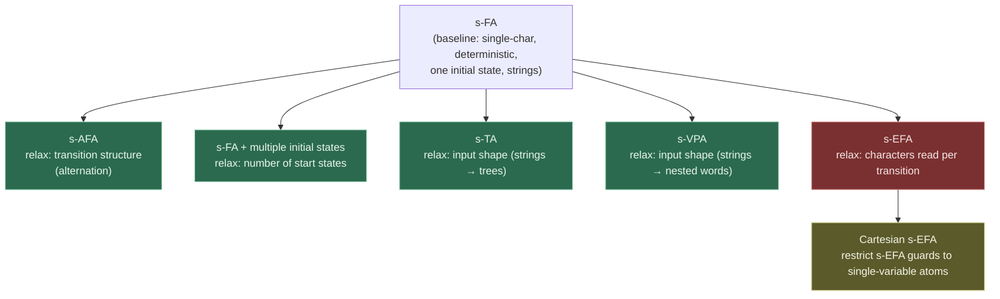

# Variants of Symbolic Automata

[[book-guidelines|↩ Back to guidelines]]

## Why the base model isn't the end of the story

The s-FA you already know — states, a single predicate-labeled transition relation, one input symbol consumed per step — is deliberately minimal. It generalizes exactly one thing relative to a classic DFA: it replaces "consume a concrete symbol" with "consume a symbol satisfying a predicate over an effective Boolean algebra." Every other structural choice — determinism, one initial state, strings (not trees), one character per transition — is inherited unchanged from classical automata theory.

Section 2.3 of the paper asks the obvious next question: which of *those* other choices are load-bearing for the nice theory you built in §2.1 (Boolean closure, decidable emptiness/equivalence, minterm-based reduction to a classic automaton), and which are just historical defaults you can relax? The answer turns out to be genuinely two-sided:

- **Alternation, multiple initial states, trees, nested words** — you can relax all of these and *keep* every closure/decidability property s-FAs enjoy. They're "free" generalizations.
- **Reading more than one character per transition** (s-EFAs) — this one is *not* free. It strictly increases expressive power, and that extra power is purchased by losing Boolean closure and decidable equivalence outright.

That asymmetry is the spine of this article: five variants that preserve the theory, one that breaks it, and a restricted fragment of the broken one (Cartesian s-EFAs) that buys back exactly what was lost — at the cost of expressiveness.



Green = keeps the full s-FA theory (Boolean closure, decidable emptiness/equivalence). Red = loses it. Yellow = a controlled retreat that gets it back by giving up expressiveness.

---

## 1. Symbolic alternating finite automata (s-AFA): succinctness via alternation

### What problem alternation solves

An s-FA's nondeterministic transition relation only ever offers a *disjunction* of choices: "go to $q_1$ *or* $q_2$ *or* ...". If what you actually want to express is a *conjunction* — "the rest of the input must satisfy property $A$ **and** property $B$" — a nondeterministic (or even Boolean-closed) automaton can express it, but only by first *constructing* the product automaton for $A \wedge B$, which multiplies state counts. This matters concretely for the paper's own motivating use case: checking equivalence of a Boolean combination of dozens of large regular expressions (as arises in text-processing and string-sanitizer analysis) by building one automaton for the whole formula. Doing that via product construction and s-FA machinery alone is exactly where "succinct alphabet, blown-up state space" bites hardest.

**What breaks without alternation:** every time you want an automaton for $\varphi_1 \wedge \varphi_2$ where $\varphi_1, \varphi_2$ are themselves automata-recognizable properties, you pay a multiplicative state-space cost up front, at construction time — even if the actual run you care about never needs to distinguish most of that product space. Alternation defers this cost: it lets the automaton *state* the conjunction directly in its transition structure and only pay for exploring it during acceptance-checking.

### The mechanism

An s-AFA's transition function no longer maps a state to a *state* (nondeterministic) or a *set of states* (subset construction); it maps a state (and satisfied predicate) to a **positive Boolean formula over the state set** $Q$. A universal automaton runs all its "successor" states as independent copies over the *same remaining suffix*, and accepts only if *every* copy accepts — this is exactly universal quantification over runs, dual to nondeterminism's existential quantification. Combined, s-AFAs let a single transition express "and" and "or" branching in the automaton itself, without ever materializing a product automaton.

The headline result the paper cites (D'Antoni, Kincaid, Wang) is that **s-AFAs are equivalent in expressiveness to s-FAs** — alternation buys succinctness, not new languages — but a *practical* equivalence-checking algorithm exists for them despite alternating automata having, in the worst case, higher theoretical complexity (classically, alternating-automaton emptiness/universality is PSPACE-complete, versus NLOGSPACE-ish for NFAs). The paper's point is pragmatic, not asymptotic: for the kind of heavily-Boolean-combined regular expressions that show up in real text-processing pipelines, s-AFAs stay small in practice even where the worst case is bad.

### Grounding: alternation as a Boolean-formula successor function

The cleanest way to see what changed is to compare the *type* of the transition function, not just draw pictures of states.

```rust
// Classic / s-FA style: transition maps (state, symbol) -> set of next states
// (nondeterminism = nothing more than nondeterministic CHOICE, i.e. disjunction).
type NfaTransition<S, P> = fn(S, /* symbol satisfying */ P) -> Vec<S>;

// s-AFA style: transition maps (state, guard) -> a *formula* over states.
// This formula is evaluated, not just enumerated -- AND-nodes require every
// child's sub-run (over the *same* remaining suffix) to accept.
enum BoolExpr<S> {
    True,
    False,
    Var(S),
    And(Box<BoolExpr<S>>, Box<BoolExpr<S>>),
    Or(Box<BoolExpr<S>>, Box<BoolExpr<S>>),
}

struct SAfaTransition<S, P> {
    guard: P,               // predicate over the alphabet's effective Boolean algebra
    target: BoolExpr<S>,    // NOT a single state or a set: a formula over states
}

// Acceptance is evaluated recursively: "does state s accept the remaining
// suffix `rest`?" becomes "does the formula reachable from s, evaluated
// with each Var(s') recursively re-asking the same question, hold?"
fn accepts<S: Copy + Eq>(
    expr: &BoolExpr<S>,
    rest: &[char],
    step: &dyn Fn(S, &[char]) -> bool,
) -> bool {
    match expr {
        BoolExpr::True => true,
        BoolExpr::False => false,
        BoolExpr::Var(s) => step(*s, rest),
        BoolExpr::And(l, r) => accepts(l, rest, step) && accepts(r, rest, step),
        BoolExpr::Or(l, r) => accepts(l, rest, step) || accepts(r, rest, step),
    }
}
```

The `BoolExpr<S>` type *is* the succinctness: an s-FA that wanted to express the same "must satisfy $A$ and $B$" property would need a state for every reachable pair `(state_in_A, state_in_B)`; the s-AFA just writes `And(Var(state_in_A), Var(state_in_B))` and lets the recursive `accepts` call do the product construction lazily, one run at a time, instead of materializing it as states up front.

In Lean, this recursive-acceptance structure is the more natural fit than in Rust — an s-AFA's acceptance predicate over an inductively-defined `BoolExpr` is *itself* an inductive proposition, and "does this state accept this suffix" becomes mutual recursion between the automaton's step relation and the formula's `Prop`-level interpretation:

```lean
inductive BoolExpr (S : Type) where
  | tru  : BoolExpr S
  | fls  : BoolExpr S
  | var  : S → BoolExpr S
  | and_ : BoolExpr S → BoolExpr S → BoolExpr S
  | or_  : BoolExpr S → BoolExpr S → BoolExpr S

-- `Accepts s w` : state `s` accepts word `w`; `interp` folds a BoolExpr
-- into a Prop, recursing back into `Accepts` at each `var`.
mutual
  def interp (step : S → List Char → Prop) : BoolExpr S → List Char → Prop
    | .tru,     _ => True
    | .fls,     _ => False
    | .var s,   w => step s w
    | .and_ l r, w => interp step l w ∧ interp step r w
    | .or_  l r, w => interp step l w ∨ interp step r w
end
```

This is not an accident of presentation: alternation *is* the automata-theoretic mirror of adding conjunction/disjunction connectives to a judgment form, exactly the "and-branch / or-branch" structure that shows up in sequent-calculus proof search (an $\wedge$-goal needs both sub-derivations to succeed; an $\vee$-goal needs one). If your eventual theorem prover's proof search ever needs to explore "prove $A$ and prove $B$, over the same remaining obligations," this is the same shape.

---

## 2. Multiple initial states: a "free" generalization for nondeterministic s-FAs

The paper notes this one almost in passing, and rightly so: for a *nondeterministic* s-FA, allowing a set of initial states $Q^0 \subseteq Q$ instead of a single $q^0$ costs nothing theoretically. A run simply may begin at any state in $Q^0$; language membership is "some run from some initial state accepts." Since nondeterministic s-FAs already existentially quantify over run choices at every step, existentially quantifying over the *starting* state too doesn't add expressive power (you can always add a single fresh state $q^0_{\text{new}}$ with an unguarded, always-true transition to every state that used to be initial — the trick that in a classical NFA would use an $\varepsilon$-transition, except s-FAs have no $\varepsilon$-transitions to begin with, so the encoding is a genuinely-guarded `True`-predicate transition instead), and it doesn't complicate closure or decidability proofs, since every argument that quantifies over "the run of $M$" already had to existentially quantify over run choice anyway.

Where it *is* practically convenient: intersecting or unioning several s-FAs that already share a state space (e.g., different accepting configurations reachable from different entry conditions) without manufacturing a synthetic single source. It shows up as a lightweight implementation convenience more than a theoretical result — worth naming precisely because it is *not* one of the two-sided trade-offs the rest of this article is about.

---

## 3. Symbolic tree automata (s-TA): from strings to trees

### Why trees, and why this is barely a generalization

A string is a degenerate tree: every internal node has exactly one child, and there's exactly one leaf (the end of the string). s-TAs generalize the *shape* of the input from "linear chain of characters" to "ranked tree, each node labeled by a symbol from the effective Boolean algebra's domain, with a predicate-guarded transition determining how a node's label and its children's states combine into the node's own state." Crucially, **s-FAs fall out as the one-child/leaf special case of s-TAs** — the containment isn't an analogy, it's literal: run an s-TA restricted to trees of branching factor $\le 1$ and you have exactly an s-FA.

This matters for a reader coming from compilers: an s-TA over a tree grammar is precisely the symbolic-alphabet generalization of a *tree automaton over an abstract syntax tree*, where each AST node's "symbol" ranges over a rich, potentially infinite domain (e.g., "any integer literal", "any identifier matching predicate $\varphi$") instead of a fixed finite tag set.

### What's preserved, and why it transfers cleanly

The paper states this as a clean transfer, citing Veanes and Bjørner: **s-TAs have exactly the same closure and decidability properties as s-FAs** — Boolean closure, decidable emptiness and equivalence — and the s-FA minimization algorithm has itself been extended to s-TAs (D'Antoni & Veanes, LICS). The reason this transfer is clean, where the s-EFA transfer (§5 below) is not, is structural: an s-TA transition still reads exactly *one* node's label per step (guarded by one predicate), it just also consumes a *tuple of already-computed child states* rather than moving to a single successor. The "read one symbol per transition, guarded by one predicate" invariant that makes minterm-based reduction to a classic automaton work is untouched; only the *shape of the reachability relation* (chain vs. tree) changed.

### Grounding: tree automata over a Rust AST

```rust
// A rank-annotated tree, generic over a domain D (the effective Boolean
// algebra's carrier) instead of a fixed finite label alphabet.
enum Tree<D> {
    Leaf(D),
    Node(D, Vec<Tree<D>>),
}

// An s-TA transition: from a node's label (checked against a predicate)
// and its children's already-computed states, produce this node's state.
struct STaRule<D, S> {
    guard: Box<dyn Fn(&D) -> bool>,   // predicate over D, from the alphabet theory
    combine: fn(&[S]) -> S,            // how children's states fold into this node's state
}

fn run_sta<D, S: Copy>(tree: &Tree<D>, rules: &[STaRule<D, S>]) -> S {
    match tree {
        Tree::Leaf(d) => apply_matching_rule(d, &[], rules),
        Tree::Node(d, children) => {
            let child_states: Vec<S> = children.iter()
                .map(|c| run_sta(c, rules))
                .collect();
            apply_matching_rule(d, &child_states, rules)
        }
    }
}
# fn apply_matching_rule<D, S: Copy>(_d: &D, _children: &[S], _rules: &[STaRule<D, S>]) -> S { unimplemented!() }
```

`run_sta` is a bottom-up tree fold — exactly the shape of a type-checker's recursive descent over an AST, or an abstract interpreter's recursive evaluation of an expression tree into an abstract-domain value. The "guard" being a predicate from an effective Boolean algebra, rather than a fixed pattern match on a finite `enum`, is the entire symbolic generalization: swap `guard: Box<dyn Fn(&D) -> bool>` for a literal Rust `match` arm and you have an ordinary (classic) tree automaton / typed AST fold.

---

## 4. Symbolic visibly pushdown automata (s-VPA): nested words

### The problem: linear *and* hierarchical structure at once

Some data isn't purely linear (a string) and isn't purely a tree either — it's a linear sequence with hierarchical *matching* embedded in it: an XML document is a flat sequence of tokens, but `<tag>...</tag>` pairs must nest correctly; a recursive program's execution trace is a flat sequence of events, but `call`/`return` pairs must match up respecting the call stack. **Nested words** formalize exactly this: a string plus a matching relation between designated "call" and "return" positions that must be properly nested (like balanced parentheses), while "internal" positions carry no stack discipline at all.

**What breaks without a visibly-pushdown structure:** you could model call/return matching with an ordinary pushdown automaton, but general PDAs are *not* determinizable and lose decidable equivalence — the price of unrestricted stack access. You could avoid the stack machinery entirely with a big finite automaton, but then (as in the CFG-recovery motivation the paper gives) every function in an inter-procedural program needs its own dedicated states and transitions to track "which function am I currently inside," a cost proportional to the number of functions rather than to the actual control-flow complexity.

### The mechanism and what it preserves

A visibly pushdown automaton restricts *when* the stack may be touched, in a way that's syntactically visible in the input: call positions must push, return positions must pop, and internal positions must not touch the stack at all. This restriction is exactly strong enough to make the automaton class as well-behaved as finite automata — determinizable, closed under Boolean operations, decidable emptiness and equivalence — while still being strictly more expressive than a flat automaton over the same events, because it can express "the tag currently closing matches the tag most recently opened" without hardcoding a bound on nesting depth.

The paper's cited result (D'Antoni & Alur) is again a clean transfer: **s-VPAs retain the same closure and decidability properties as s-FAs**, layering the symbolic alphabet generalization (predicate-guarded transitions instead of fixed symbols) on top of the visibly-pushdown restriction (structured, syntax-visible stack discipline) without the two generalizations interfering with each other.

### Why this matters for control-flow modeling specifically

The paper's concrete motivating example is worth internalizing precisely because it's an efficiency argument, not just an expressiveness one: modeling "the function currently returning matches the function most recently called" with a *classic* automaton requires, for a program with $k$ functions, machinery whose size scales with $k$ — a state (or state-component) remembering *which* function was called, per function, so that a mismatched call/return is detectable. A symbolic VPA needs exactly **one** transition rule for the return case: `push(f)` on call, and on return, a single guarded transition checking that the top-of-stack symbol equals the function currently returning — the equality check is a predicate in the alphabet theory, not a hardcoded enumeration of $k$ specific functions. This is the same "one predicate instead of $k$ transitions" succinctness argument that motivates s-FAs over classic FAs in the first place, just applied to the stack alphabet instead of the input alphabet.

---

## 5. Symbolic extended finite automata (s-EFA): where the free ride ends

### The generalization: reading a tuple, not a character

Every variant so far kept "one transition reads one input element" fixed and generalized something else (the transition's Boolean structure, the number of start states, the shape of the input). s-EFAs generalize *that* invariant directly: a single s-EFA transition can read a **$k$-tuple** of consecutive input elements at once, for $k \ge 1$ fixed per transition (each transition guard must uniquely determine its own arity $k$).

To make this precise, the domain $D$ of the alphabet's Boolean algebra is assumed to contain tuples. Two new pieces of machinery appear:

- $\mathsf{IsTup}_k$: a predicate checking that an element is (represented as) a $k$-tuple, for $k \ge 1$.
- **Projection terms** $x_i$: for a $k$-tuple $a = (a_1, \ldots, a_k)$ and $1 \le i \le k$, $[\![x_i]\!](a) = a_i$ — the term that extracts the $i$-th component so guards can relate components of the tuple to each other (e.g., via equality or disequality between projections).

A guard mentioning $k$ distinct projection variables is called **$k$-ary**.

$$
\text{IsTup}_2 \wedge x_1 \neq x_2 \wedge \varphi
$$

is satisfiable iff there exists $a \in D$ such that $a$ is a pair $(a_1, a_2)$, $a_1 \neq a_2$, and $[\![\varphi]\!](a_1, a_2)$ holds (Example 5 in the source). Concretely, a transition

$$
p \xrightarrow{\ x_1 = x_2\ } q
$$

reads two adjacent input symbols in one step and only fires if they're equal to each other. **Semantically, the tuples get flattened**: if $[(a,b,c), (d), (e,f)] \in L(M)$ when $M$ is read as an s-FA over a tuple-valued alphabet, then $[a,b,c,d,e,f] \in L_e(M)$ when the very same automaton is read as an s-EFA — the extended semantics is defined over the *flattened* string, with the tuple boundaries an artifact of how many characters each transition happened to consume, not part of the language itself.

### What actually breaks, and why

For *classic*, finite-alphabet automata, letting a transition consume a block of $k$ characters instead of one buys nothing: you can always simulate a $k$-ary transition with $k$ ordinary single-character transitions through $k-1$ fresh intermediate states, so multi-character reads over a finite alphabet don't increase expressive power at all. The paper's central negative result for this section is that **this equivalence fails once the alphabet is symbolic**: s-EFAs are *strictly* more expressive than s-FAs.

The reason the naive "just chain $k$ single-character transitions" simulation fails symbolically is exactly the flattening semantics: a guard like $x_1 = x_2$ relates *two co-occurring, simultaneously-quantified* projection variables within a single predicate evaluation. Splitting that into two sequential single-character transitions $p \xrightarrow{\varphi_1} r \xrightarrow{\varphi_2} q$ would require $\varphi_2$ to "remember" the specific value $a_1$ that satisfied $\varphi_1$ so it can compare against it — but a symbolic transition's guard is evaluated fresh against the current character, with no state-carried memory of *which* domain element previously satisfied a predicate (only *which state* was reached). Over a finite alphabet you can brute-force around this by having one intermediate state *per possible value of* $a_1$; over an infinite symbolic alphabet, that would require infinitely many states, which is exactly what the symbolic model was built to avoid needing. The cross-symbol equality constraint is genuinely new expressive power, not just a syntactic shorthand.

That extra power is not free. The paper lists exactly what s-EFAs give up relative to s-FAs:

- **Not closed under Boolean operations** — no complement, no guaranteed intersection s-EFA.
- **Nondeterministic s-EFAs are strictly more expressive than deterministic s-EFAs** — determinizability, one of the two headline s-FA results, fails outright.
- **Equivalence is undecidable.**
- **Emptiness of intersection is undecidable** — not just "we don't have an algorithm," but provably no algorithm exists.

This is worth sitting with as a lesson about *which* generalizations are "safe": alternation, extra initial states, trees, and visibly-pushdown stacks all changed *how many* runs there are, or *what shape* the input takes, without changing what a single transition step can "see" and compare against beyond the current position. Reading a tuple and relating its components lets a transition perform a genuinely new kind of comparison (this character against *that* character, both consumed together), and it's precisely that new comparative power that a Boolean-closure/decidability proof built on minterms and completion-based complementation has no way to absorb — minterm abstraction assumes each transition's satisfiability question is *local* to one position.

### Grounding: an illustrative s-EFA transition, and where the naive port fails

```rust
// A single s-EFA-style transition reading a fixed-arity tuple and
// comparing its projections. This is a direct transliteration of the
// x1 = x2 example transition from the source text.
struct SEfaTransition<D: PartialEq> {
    arity: usize,
    // guard receives the *whole* tuple; projections are just indexing.
    guard: Box<dyn Fn(&[D]) -> bool>,
}

fn adjacent_equal_transition<D: PartialEq + 'static>() -> SEfaTransition<D> {
    SEfaTransition {
        arity: 2,
        guard: Box::new(|tup: &[D]| tup.len() == 2 && tup[0] == tup[1]), // x1 = x2
    }
}

// Why this can't be decomposed into two ordinary single-character s-FA
// transitions without an unbounded number of intermediate states: the
// second character's guard needs to depend on the *specific value* the
// first one took, which a stateless per-position predicate can't encode
// unless you mint one intermediate state per possible first value.
// Over an infinite domain D that's not just impractical, it's impossible
// with finitely many states -- which is the formal content of "s-EFAs
// are strictly more expressive than s-FAs."
```

This snippet is an original illustration (the source gives the mathematical transition, not code) meant to make the "why can't you just split it" question concrete rather than asserted.

---

## 6. Cartesian s-EFAs and monadic decomposition: buying the theory back

### The restriction

An important subclass, **Cartesian s-EFAs**, restricts guards to predicates whose atoms mention **only one projection variable at a time** — so $x_1 = x_2$ is disallowed (it mentions two variables in one atom), but a conjunction like $(x_1 > 0) \wedge (x_2 < 10)$ is fine, because each *atom* is single-variable even though the overall guard is multi-ary. Geometrically, a guard restricted this way defines a set that is a **Cartesian product** of per-coordinate constraints — hence the name — rather than an arbitrary relation over the tuple.

The paper's result: **Cartesian s-EFAs have exactly the same expressive power as s-FAs**, while still allowing transitions with lookahead (consuming several characters per step, for succinctness or convenience) — you get the multi-character *reading* convenience of s-EFAs without the cross-character *comparison* power that broke closure and decidability. This is the theory-preserving compromise: restrict the syntax of guards just enough to rule out the one construct (relating distinct tuple positions to each other) that the closure/decidability arguments couldn't survive.

### Monadic decomposition

This raises a natural algorithmic question, which the paper names explicitly: given an arbitrary (possibly non-Cartesian) $k$-ary predicate, can you *decide* whether it is equivalent to some Cartesian-form predicate — and if so, compute that decomposition? This is the **monadic decomposition problem** (Veanes, Bjørner, Nachmanson, Bereg): deciding whether a relation over several variables can be effectively rewritten as a conjunction of independent single-variable ("monadic") constraints.

This is directly the same move a constraint solver makes when it tries to decompose a joint constraint over several variables into independent per-variable domains for propagation — the entire point of monadic decomposition, in CSP terms, is asking "can this relation be split into a product of unary domains without losing information," which is exactly the question domain-propagation and arc-consistency algorithms need answered (often only approximately, via over-approximation) to make constraint propagation over a lattice of abstract domains tractable at all. When it *can't* be decomposed, that's precisely the signature of a genuinely relational constraint — one requiring joint reasoning across variables, which is what makes non-Cartesian s-EFA guards, and the general case of multi-variable constraint propagation, hard.

---

## Synthesis: what each variant did and did not touch

| Variant | Generalizes | Boolean closure | Decidable equivalence | Determinizable |
|---|---|---|---|---|
| s-FA (baseline) | — | yes | yes | yes |
| s-AFA | transition structure (alternation) | yes (same expressiveness as s-FA) | yes (practical algorithm) | — (alternation subsumes need) |
| s-FA, multiple initial states | number of start states | yes | yes | yes (after $\varepsilon$-style collapse) |
| s-TA | input shape: strings → trees | yes | yes | (minimization extended) |
| s-VPA | input shape: strings → nested words | yes | yes | yes |
| s-EFA | characters read per transition | **no** | **no (undecidable)** | **no** (nondet. strictly stronger) |
| Cartesian s-EFA | s-EFA, guards restricted to single-variable atoms | yes (= s-FA power) | yes (= s-FA power) | yes (= s-FA power) |

The pattern: every axis *orthogonal* to "what can one transition step compare" is free to generalize. The one axis that touches comparison power across positions (multi-character reads with cross-position relations) is exactly where the theory breaks, and the only way back is restricting that same axis (Cartesian form) rather than compensating elsewhere.

## Where this leads

Chapter 3 ([[Symbolic-Automata-in-Practice|Symbolic Automata in Practice]]) picks up two of these variants directly: s-AFAs for scaling Boolean combinations of regular expressions in text-processing tools, and s-VPAs for succinctly modeling inter-procedural control-flow graphs. Chapter 4's transducer variants (§8 of the Topic List) mirror this same closure-loss pattern one level up — symbolic extended finite *transducers* (s-EFTs) inherit the s-EFA problem of reading multiple characters per transition, and lose closure under composition for exactly the analogous reason.

For the standing project: alternation's and/or transition structure (§1) is the automata-theoretic shadow of the and-branch/or-branch case split that a sequent-calculus proof search or a bidirectional type-checker's rule dispatch performs — both `type-theory` and `automated-reasoning` territory. Monadic decomposition (§6) is the most directly load-bearing thread here for `sat-smt-csp`: deciding whether a joint constraint decomposes into independent per-variable pieces is precisely the operation domain-propagation and abstract-lattice methods need (often approximated rather than solved exactly) before a CSP kernel or an abstract interpreter can treat several variables' constraints independently — the exact question the compiler's planned CSP kernel will face when deciding whether a multi-variable refinement-type obligation can be split for parallel or per-domain propagation, versus needing genuinely relational (non-Cartesian) reasoning.
