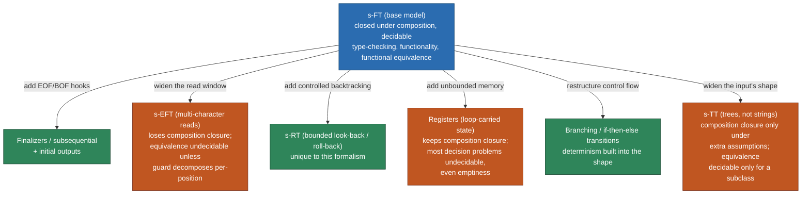

[[book-guidelines|↩ Back to guidelines]]

# Variants of Symbolic Transducers

## Why the basic s-FT isn't the end of the story

A symbolic finite transducer (s-FT) — the model covered in the companion article on Chapter 4's core theory — reads one input character at a time, checks it against a predicate, and emits a sequence of output terms before moving to the next state. That's a clean model with good properties: closure under composition, decidable type-checking, decidable functionality. But "clean" and "sufficient for real string-processing tasks" are different things. Section 4.2 of the survey is a tour of what happens when you push on the plain s-FT from six different directions, each motivated by a concrete task the base model can't handle gracefully. This article is about those six pressure points and what each one costs you.

The throughline worth holding onto: **every extension buys expressiveness or convenience at the price of some property you got for free in the base model** — usually closure under composition, or decidable equivalence, or both. This is the recurring trade curve of symbolic automata theory (you saw its cousin with s-EFAs and s-EFTs in the automata article), and the transducer variants make it especially concrete because each one has an obvious motivating example where the base model visibly fails.

---

## 1. Finalizers and subsequential transducers

**What breaks without it.** Suppose you're decoding HTML entities: replace every occurrence of `&amp;` with `&`. Build this as a deterministic s-FT that reads character by character, buffering as it goes through the partial match `&`, `&a`, `&am`, `&amp`, then emitting `&` and resetting once it sees `;`. Now feed it an input that *ends* mid-pattern: `...&amp` with no closing `;`. The transducer is sitting in a state that represents "I've seen `&amp`, waiting for `;`" — but there is no more input. What should it output? The correct behavior is to flush the buffered `&amp` back out verbatim, since it turned out not to be a real entity after all. A plain s-FT has no mechanism for "do something special because the input just ended." Its transitions only fire on reading a character; there's no transition available for the empty string at end-of-input.

**The fix.** A **finalizer** is a special transition, associated with a state, that fires specifically upon reaching the end of input while in that state — it doesn't consume a character, it just emits whatever output is appropriate for "the string stopped here." Finite-state transducers equipped with finalizers have a standard name in the literature: **subsequential transducers**. The Wisconsin/MSR survey credits this terminology to Allauzen & Mohri and to Mohri's own subsequential-transducer line of work.

The key thing finalizers buy you is **determinism without loss of correctness on partial patterns**. Without them, you'd need to either (a) give up determinism and let the transducer guess/backtrack, or (b) hack around it by extending the domain with sentinel "start of input"/"end of input" symbols that the guards can test against. The survey explicitly flags why (b) is unattractive in a typed setting: those sentinel symbols aren't real elements of your alphabet's domain $D$ (they're not actual characters), so every downstream algorithm — especially composition — now has to carry special-case bookkeeping to keep the sentinels from leaking into places where a real character is expected. Finalizers avoid this by keeping the "end of input" behavior as a structurally distinct kind of transition rather than an encoding trick layered on top of the existing alphabet.

**Grounding (Rust).** A finalizer maps naturally onto Rust's type system as an explicit variant of your transition enum, rather than a special sentinel value threaded through everywhere:

```rust
enum Transition<Pred, Term> {
    /// Consumes one input character satisfying `guard`, emits `output`.
    Step { guard: Pred, output: Vec<Term>, target: StateId },
    /// Fires only at end-of-input while in this state; consumes nothing.
    Finalize { output: Vec<Term> },
}

struct SubsequentialTransducer<Pred, Term> {
    states: Vec<StateId>,
    initial: StateId,
    // one Step-set and at most one Finalize per state
    step_transitions: HashMap<StateId, Vec<Transition<Pred, Term>>>,
    finalizers: HashMap<StateId, Vec<Term>>, // absent = state is not accepting at EOF
}

fn run(t: &SubsequentialTransducer<impl Fn(char) -> bool, char>, input: &str) -> Option<String> {
    let mut state = t.initial;
    let mut out = String::new();
    let mut chars = input.chars().peekable();
    while let Some(&c) = chars.peek() {
        let step = t.step_transitions[&state]
            .iter()
            .find(|tr| matches!(tr, Transition::Step { guard, .. } if guard(c)))?;
        if let Transition::Step { output, target, .. } = step {
            out.extend(output);
            state = *target;
        }
        chars.next();
    }
    // End of input: try the finalizer for the current state.
    out.extend(t.finalizers.get(&state)?);
    Some(out)
}
```

The type system is doing real work here: `Finalize` has no `target` field, because by construction it can't lead anywhere — the run is over. That's the enum encoding a genuine structural fact (this transition is not composable with a subsequent `Step`) rather than a convention you'd have to remember to enforce.

## 2. Initial outputs and minimality

A smaller, related extension: allow the transducer to emit an output sequence *before reading any input at all*, attached to the initial state. The survey's motivating context is **minimality** — when you're trying to find the smallest transducer computing a given transduction (the transducer analogue of DFA minimization), it sometimes helps to be able to factor out a common output prefix and emit it once at the start rather than have it duplicated across the outputs of every early transition. This is a small structural addition, but the survey notes the same tension recurs: doing this cleanly again means treating "before any character" as its own first-class hook rather than simulating it with sentinel symbols glued onto $D$, for the same typed-domain reasons as finalizers.

## 3. Symbolic Extended Finite Transducers (s-EFT)

**What breaks without it.** An s-FT reads exactly one character per transition. That's fine for character-by-character sanitizers, but useless for something like a **BASE64 decoder**, which fundamentally operates on *groups* of characters: it reads three input bytes, reinterprets their bits as four 6-bit groups, and emits four output characters — the encoding is only meaningful at the granularity of a fixed-size block, not a single symbol.

**The fix.** Just as symbolic extended finite automata (s-EFA) generalize s-FAs so that a single transition can read a $k$-tuple of characters (via the `IsTup`$_k$ predicate and projection terms $x_i$ picking out tuple components), **symbolic extended finite transducers (s-EFT)** apply the same generalization to transducers. The transduction relation $T_T$ becomes $T_{T}^{e}$ — mirroring the change from the plain language $L(M)$ to the "extended" (flattened) language $L^e(M)$ for automata — where the multi-character reads are conceptually unrolled into the underlying string.

**What it costs you.** This is where the survey's recurring warning is sharpest. s-EFAs already sacrifice some good properties relative to s-FAs (loss of Boolean closure, in general). s-EFTs inherit that fragility and add to it:

- **s-EFTs are not closed under composition** — you cannot in general build $T_2(T_1)$ as another s-EFT the way Theorem 6 guarantees for plain s-FTs.
- **Equivalence is undecidable, even for deterministic s-EFTs.** This is a genuinely severe loss: for plain s-FTs, functional equivalence between two functional transducers is decidable (Theorem 8); determinism doesn't buy back decidability of equivalence here.

There's one escape hatch worth internalizing because it's a pattern you'll see again in symbolic automata theory generally: **equivalence becomes decidable when the multi-character predicate decomposes**. If a transition reads $n$ characters under predicate $\varphi(x_1, \ldots, x_n)$, and that predicate can be rewritten as a disjunction of per-position conjunctions

$$\varphi(x_1,\dots,x_n) \;\equiv\; \bigvee_i \big(\varphi_{i,1}(x_1) \wedge \varphi_{i,2}(x_2) \wedge \cdots \wedge \varphi_{i,n}(x_n)\big),$$

then each disjunct behaves like $n$ independent single-character tests glued together, and the machine can be simulated by an equivalent plain (non-extended) construction where the good decidability results apply again. The lesson generalizes: **undecidability from multi-character reads specifically comes from cross-position correlation** — a predicate that can talk about relationships *between* $x_1$ and $x_2$ (e.g. "$x_1 = x_2$") rather than just independent constraints on each. Decomposability is exactly the condition that rules that correlation out.

**Grounding (Rust).** The `IsTup`$_k$/projection-term structure is naturally a fixed-arity read plus per-slot accessors:

```rust
struct ExtendedTransition<Pred, Term> {
    arity: usize,                 // k: how many input characters this transition consumes
    guard: Pred,                  // predicate over (x_1, ..., x_k)
    outputs: Vec<Term>,           // each Term may reference any x_i via a projection
    target: StateId,
}

// A "decomposable" guard, which recovers decidable equivalence, is exactly
// one you can express as this shape instead of an arbitrary k-ary predicate:
struct DecomposableGuard<P> {
    per_position: Vec<P>, // P: Fn(char) -> bool, one independent test per x_i
}
```

The type-level distinction between `Pred` (opaque, arbitrary arity) and `DecomposableGuard` (a `Vec` of independent per-position checks) is exactly the theorem's dividing line made structural: if your transitions are constructible only from `DecomposableGuard`, equivalence-checking machinery stays available; the moment you need genuine cross-position correlation, you're back to opaque `Pred` and lose it.

## 4. Symbolic transducers with roll-back (s-RT)

**What breaks without it.** Consider a transducer implementing several string-rewrite patterns plus a catch-all default: "if none of the special patterns match, copy the next input character through unchanged." Hand-coding this as ordinary states and transitions is the kind of thing that looks simple in prose and turns into a combinatorial mess in practice — the survey points to a concrete example in the literature (Veanes & Bjørner's Figure 7) where the naive encoding of default/exceptional behavior blows up into an error-prone tangle of extra states, because "try to match this longer pattern, and if it fails partway through, un-consume what you tentatively matched and fall back to the default rule" isn't naturally expressible with transitions that only ever move forward one character at a time.

**The fix.** **s-RTs** add **bounded look-back and roll-back transitions**: the ability to look back over already-read input and, if a longer pattern attempt fails, roll the read head back to retry with the default/exceptional rule instead. The survey is explicit that this capability — a look-back/roll-back mechanism built into the transition structure — is not present in any other transducer formalism it surveys. It's a genuinely distinct axis of extension from the others (which mostly generalize *what a transition can read or remember*, not *whether it can undo a tentative read*).

**Intuition.** Think of it as giving the transducer a controlled form of backtracking, scoped tightly enough (bounded look-back) that it doesn't reintroduce the full cost of unrestricted nondeterministic backtracking, while still eliminating the combinatorial state-explosion of hand-coding "try the long pattern, else fall back" as ordinary forward-only transitions.

## 5. Symbolic transducers with registers

**What breaks without it.** A plain s-FT's only memory is *which state it's in* — a finite amount of information, fixed in advance by the automaton's structure. That's insufficient the moment your transformation needs to track something that ranges over an unbounded domain as it goes, like "the maximum number seen in the stream so far" or accumulating a running total. You cannot encode "remember an arbitrary integer" as a finite set of states without effectively building a separate state for every possible value — which defeats the entire point of a finite-state model.

**The fix.** **Symbolic transducers with registers** attach mutable register variables to the machine, ranging over the same rich per-position alphabet theory the rest of the model uses, updated on each transition — giving the machine genuine **loop-carried state** independent of which state it occupies. This is [[Variants-of-Symbolic-Automata#The mechanism|the mechanism]] the survey names as supporting things like log/data-processing pipelines that need to carry accumulated values across the length of the input.

**What it costs you.** This is the steepest price tag among all the variants covered. Registers are closed under composition — you keep that one good property — but **most decision problems become undecidable, including emptiness**. Emptiness undecidable is a striking floor to hit: for plain s-FTs (and s-FAs), emptiness of the domain language is decidable essentially for free, by reduction to reachability in a finite graph. Once registers can carry unbounded values updated via arbitrary terms from the label algebra, the reachability question over the *combined* state-plus-register configuration space stops being finite-state reachability at all — it starts to resemble reachability for a counter machine or a more general infinite-state system, where undecidability is the expected default rather than the exception.

**Grounding (Rust).** Registers show up naturally as extra mutable fields threaded through the run, with updates expressed as terms (functions) over the current register value and the character read — structurally identical to how a fold/accumulator works, except now the "step function" is itself drawn from the label algebra rather than being an arbitrary host-language closure:

```rust
struct RegisterTransducer<Term, RegVal> {
    // registers: named slots, each holding a value from the alphabet domain
    register_names: Vec<String>,
    // a transition can read a character, update every register via a term
    // that may reference the character and the *current* register values,
    // and emit output that may also reference registers.
    transitions: Vec<RegTransition<Term>>,
    initial_registers: HashMap<String, RegVal>,
}

struct RegTransition<Term> {
    guard: Term,                              // predicate on (char, registers)
    register_updates: HashMap<String, Term>,  // new_value = f(char, registers)
    output: Vec<Term>,                        // may read updated registers
    target: StateId,
}
```

The honest way to see why emptiness dies here: the "state" an algorithm must track for reachability is no longer `StateId` alone but `(StateId, register_valuation)`, and `register_valuation` ranges over an infinite domain the moment a register can hold, say, an unbounded integer. Finite-graph reachability algorithms simply don't apply to that configuration space without further restriction.

## 6. Branching transitions and if-then-else structured transducers

**What breaks without it.** Take a deterministic s-FT with two transitions out of the same state $p$: one guarded by $\varphi$, going to $q$ with output $\bar f$, and another guarded by $\neg\varphi$ (its complement, since determinism requires the guards to be disjoint and — for a complete machine — exhaustive), going to $r$ with output $\bar g$. Logically this is a single decision. Representing it as two separate transition objects loses that structure: nothing in the representation says "these two are a matched complementary pair," which matters when the transducer is meant to become actual generated code, where you *want* to emit a single `if`/`else` rather than two independent, potentially-overlapping-looking rules that happen to have complementary guards.

**The fix.** A **branching transition** collapses the pair into one first-class construct:

$$p \mapsto \text{if } \varphi \text{ then } (\bar f, q) \text{ else } (\bar g, r)$$

replacing the separate $p \xrightarrow{\varphi/\bar f} q$ and $p \xrightarrow{\neg\varphi/\bar g} r$ transitions. If a machine is built so that there is exactly one branching transition per state, **determinism is structurally built in** — there's no separate proof obligation that the guards are disjoint, because the representation only ever offers one guard evaluation with two mutually exclusive outcomes by construction. The survey notes this idea isn't unique to transducers: the same restructuring applies equally well to s-FAs.

**Why it matters practically.** The motivation given is code generation: when a symbolic transducer is being compiled down into an executable program, you want the generated code's control-flow structure, evaluation order of predicates, and sharing of common sub-computations to mirror the transducer's own structure. An `if`/`else` transition maps directly onto an `if`/`else` (or Rust `match`) statement in the generated code; two separately-listed complementary transitions do not carry that direct correspondence and would need to be re-discovered by a compilation pass.

**Grounding (Rust).** This is close to a textbook case for why Rust's algebraic-enum encoding of state machines is worth its ceremony — it can literally forbid the non-branching representation's ambiguity at compile time:

```rust
enum StateAction<Pred, Term> {
    Branch {
        guard: Pred,
        then_branch: (Vec<Term>, StateId),
        else_branch: (Vec<Term>, StateId),
    },
}

// One StateAction per state — the HashMap key already enforces
// "one branching transition per state," and thus determinism,
// as an invariant of the data structure rather than a checked property.
struct BranchingTransducer<Pred, Term> {
    actions: HashMap<StateId, StateAction<Pred, Term>>,
}
```

Compare this to the earlier `step_transitions: HashMap<StateId, Vec<Transition<..>>>` used for finalizers — there, determinism was a *property* you had to verify held of the `Vec` (guards pairwise disjoint). Here, determinism is a *fact about the shape of the type* (`StateAction` isn't a list at all). That shift — from "a property I must check" to "a property the type system makes true by construction" — is precisely the value the survey attributes to branching transitions in the code-generation setting, just stated in type-theoretic rather than compiler terms.

## 7. Symbolic tree transducers (s-TT)

**What breaks without it.** Every variant so far still operates over *strings* — linear sequences of characters. But plenty of real transformations are naturally tree-shaped: HTML/XML sanitization operates on a parse tree, not a flat character stream; augmented-reality app interference checking and deforestation (a functional-language compiler optimization that fuses composed traversals) both reason about tree-structured intermediate representations. Forcing a tree-shaped transformation through a string-shaped model means first flattening the tree into some serialization, which throws away exactly the structural information (which subtree is whose child) that the transformation needs to reason about.

**The fix.** **Symbolic tree transducers (s-TT)** generalize s-FTs from strings to trees. The relationship is stated precisely in the survey: s-FTs are recovered as the special case of s-TTs in which every tree node has exactly one child or is a leaf — i.e., a string is just a tree that never branches, so an s-FT is an s-TT restricted to the degenerate "path" shape.

**What it costs you.** s-TTs are **closed under composition only under certain additional assumptions** (not unconditionally, the way plain s-FTs are per Theorem 6) — properties studied in the cited work by Filiot et al. Equivalence is a similarly narrowed guarantee: it's known to be decidable only for a **restricted subclass** of s-TTs (per the cited D'Antoni/Filiot/Mens/Reynier/Servais/Talbot line of work), not for the model in full generality. There's also a further refinement — s-TTs augmented with **regular look-ahead** (the ability to check that a subtree, not yet fully processed, matches some pattern before deciding how to handle the current node) — studied separately in the cited work by Filiot et al.

**The pattern, once more.** Notice this is the exact same shape of trade you saw with s-EFAs → s-EFTs and with s-FTs → registers: broadening the *shape* of what the model operates over (linear strings → trees) buys real expressiveness needed for real applications (HTML sanitizer verification is explicitly named as one), at the cost of the two flagship theoretical properties — composition closure and equivalence decidability — degrading from "always true" to "true only with extra conditions or on a restricted subclass."

**Grounding (Rust and Lean).** A tree transducer's natural Rust shape generalizes the string transducer by making the "next" pointer plural — a child list instead of a single successor — with the crucial semantic difference that output at a node can be built compositionally from the *already-computed* outputs of its children (this is what makes deforestation-style fusion possible: the transducer's output-construction step is structurally a fold over the input tree):

```rust
enum Tree<L> {
    Leaf(L),
    Node(L, Vec<Tree<L>>),
}

// An s-TT rule: given a node's label and (already-transduced) child outputs,
// decide the output tree and which "mode"/state to recurse in for each child.
trait TreeTransducerRule<L, Out> {
    fn apply(&self, label: &L, state: StateId, children: &[Tree<L>])
        -> (Out, Vec<(StateId, usize)>); // which state to use per child index
}

fn run_tree<L, Out>(
    rule: &dyn TreeTransducerRule<L, Out>,
    state: StateId,
    t: &Tree<L>,
) -> Out {
    match t {
        Tree::Leaf(l) => rule.apply(l, state, &[]).0,
        Tree::Node(l, children) => {
            let (_, next_states) = rule.apply(l, state, children);
            // recurse per child with its assigned state, then combine —
            // this recursion is exactly a catamorphism (fold) over the tree
            let _child_outputs: Vec<Out> = next_states
                .iter()
                .map(|&(s, i)| run_tree(rule, s, &children[i]))
                .collect();
            rule.apply(l, state, children).0
        }
    }
}
```

If you've worked with Lean's or any dependently-typed language's treatment of **inductive types** and structural recursion, this is worth naming explicitly: an s-TT rule is exactly a case analysis compatible with the tree's own inductive structure, and `run_tree` is exactly the tree's recursor/eliminator (`Tree.rec` in Lean) specialized to produce an `Out` by consuming already-recursed child results — the same discipline that makes a Lean definition by structural recursion on an inductive type terminate and be accepted by the kernel. This is a genuinely useful bridge: s-TT composition-closure questions ("does composing two tree transducers as tree functions again land in the same model?") are, underneath the automata-theoretic language, a question about whether two catamorphisms over the same inductive type fuse into a single catamorphism — the same fusion question deforestation itself is trying to answer for functional-program compilation, which is presumably why the survey lists deforestation as one of s-TT's own applications.

---

## Synthesis: where this leaves the model, and where it leads

Laid out side by side, the seven extensions split cleanly into three kinds of generalization:



(Green = keeps most good properties or gains one cleanly; orange = pays for the extra expressiveness with a genuine loss in closure or decidability.)

**How this connects to your compiler/elaborator project (`type-theory` focus area).** The recurring mechanism worth carrying forward is the **type-directed encoding of invariants as data shape rather than as checked properties** — seen sharpest in branching transitions (`StateAction::Branch` makes determinism a structural fact, not a verified one) and in the finalizer/step split (an enum variant with no `target` field encodes non-composability directly in the type). This is the same discipline your elaborator's term representation should apply: encoding invariants like "this metavariable is solved" or "this context is well-formed at this point" as *distinguishable variants* your type-checker can pattern-match exhaustively over, rather than as boolean flags or runtime assertions layered on top of a single undifferentiated representation. The s-TT section's bridge to Lean's structural recursion is the more direct connection: an s-TT rule *is* an inductive-type eliminator, and the open question of when two tree transductions compose into one is, underneath the automata framing, exactly the fusion/deforestation question your elaborator will eventually face if it ever needs to compose passes over its own term ASTs without materializing every intermediate tree.

**[[Effective-Boolean-Algebras#Where this leads|Where this leads]] in the book.** These variants set up Chapter 5 ([[Symbolic-Transducers-in-Practice|Symbolic Transducers in Practice]]) directly: s-EFTs are the machinery that makes BASE64/UTF encoder-decoder correctness proofs possible (a plain s-FT literally cannot express a three-characters-at-a-time encoder); registers and branching transitions together are what the survey's code-generation and log-processing pipeline applications actually run on; and s-TTs are the model underlying HTML sanitizer verification and augmented-reality interference checking. None of Chapter 5's applications work with the base s-FT alone — the variants aren't a theoretical afterthought, they're the load-bearing layer between the clean theory of Chapter 4 and the systems described in Chapter 5.
