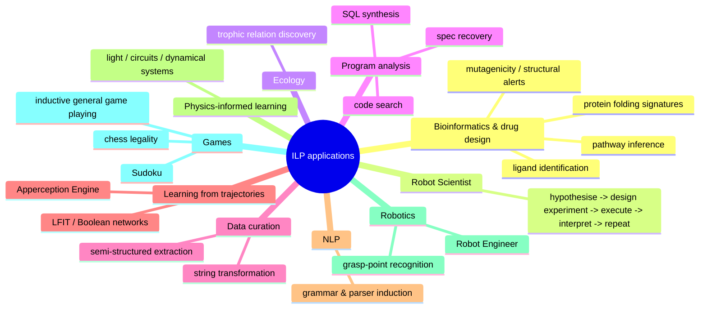
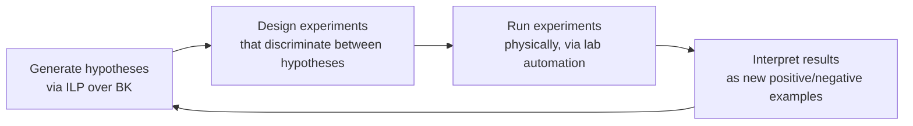

[[book-guidelines|↩ Back to guidelines]]

## Why a survey needs an applications chapter at all

Every preceding chapter of this paper answered an engineering question: how do you formalise ILP (Ch. 2-3), how do you build a system (Ch. 4-6), what can a built system actually cope with (Ch. 7), which invented predicates make it more capable (Ch. 8), and which concrete systems embody all of that (Ch. 8/6 case studies). None of that tells you *when you'd reach for ILP over anything else*. Section 7 answers exactly that, and it does so by pattern-matching across nine unrelated-looking domains — molecules, robots, ecosystems, SQL, spreadsheets, gene networks, sentences, circuits, and board games — to extract the one property they all share.

That property, stated plainly by the paper's own framing question for this chapter: **what makes a domain ILP-shaped is that its data is naturally relational (not naturally tabular) and its target concept is naturally reportable as a human-readable rule, not just a black-box score.** Everywhere this article grounds a claim in a concrete mechanism, that's the property doing the work — not some domain-specific trick.



**What breaks without a relational representation.** Take drug design as the sharpest case. A molecule's medically-relevant substructure (a *ligand*) is defined by a pattern of bonds between atoms — literally a graph. Force that into a fixed-width feature vector for a tabular learner and you must commit, in advance, to which bond-patterns are worth a column; anything outside that fixed vocabulary is invisible to the model no matter how much data you feed it. A logic-programming representation sidesteps this entirely: a bond is just a binary relation `bond(A1, A2)`, hypotheses are built compositionally out of such relations, and the hypothesis space already contains every substructure expressible in the relational vocabulary — not just the ones a feature engineer anticipated. This is the same argument the paper made about relational background knowledge back in the introduction, now cashed out against nine real domains instead of one motivating example.

## Bioinformatics and drug design — the paradigm case

The paper calls this "perhaps the most prominent application of ILP," and the reason tracks the argument above precisely: molecular bonds and protein-protein interactions are relations, not attributes, so ILP's native representation is a direct fit rather than a translation. The listed sub-tasks are concrete: identifying and predicting **ligands** (substructures responsible for medical activity), predicting **mutagenic activity** and flagging **structural alerts** for chemical carcinogens, learning **protein folding signatures**, **inferring missing pathways** in protein-signalling networks, and **modelling inhibition** in metabolic networks.

The paper is explicit that human-readability is not a nice-to-have here — it's the deliverable. A domain chemist can inspect an induced rule like "this substructure pattern correlates with toxicity" and reason about *why*, which a similarity-weighted neural embedding cannot offer. This is the interpretability argument from the paper's introduction, now doing real epistemic work: the output of the learner is itself a scientific claim a human can evaluate, not just a prediction to trust or distrust.

## The Robot Scientist — closing the loop

This is the paper's headline example, and it's worth dwelling on *why* ILP specifically (not "any interpretable ML method") was load-bearing for it. The Robot Scientist (King et al., 2004; King et al., 2009) represents relationships between protein-coding sequences, enzymes, and metabolites in a pathway as logical background knowledge, then runs a closed loop:



**What a black-box model cannot do here is not "predict well" — it's participate in steps 2 and 4.** Designing a *discriminating* experiment requires reasoning about which of several candidate hypotheses would be falsified by which possible outcome; that's a symbolic reasoning task over the hypothesis space itself, not a numeric-prediction task. And interpreting a new experimental result as a labelled example that feeds back into the next round of induction requires the hypothesis to be in a form new evidence can be checked against — which a rule set supports natively and a similarity score does not. The result (per the paper) was the first case of a machine independently discovering new scientific knowledge, in yeast functional genomics — not merely fitting data about it. This is the sharpest illustration in the whole chapter of the paper's opening claim that ILP's relational, symbolic, interpretable representation is not a stylistic preference but a functional requirement for certain classes of task.

## Ecology, program analysis, and data curation — the "structured but never tabular" cluster

Three applications share a shape: the target domain's natural data format is relational [[Language-Bias#Structure|structure]] that a spreadsheet-native tool would have to artificially flatten.

- **Ecology.** Bohan et al. (2011) use ILP to generate plausible, testable hypotheses about **trophic relations** ("who eats whom") from ecological survey data — a directed graph over species, which is again a relation, not a table row.
- **Program analysis.** ILP systems have learned **SQL queries** and **programming-language semantics** directly, plus supported **code search** (interactively learning a search query from a handful of labelled examples) and **specification recovery** from execution traces. The throughline: a program (or a query) *is* a syntactic, compositional object — exactly what a logic-program hypothesis is built to represent — so learning one *as* a logic program avoids a representation mismatch that a feature-vector approach would have to work around.
- **Data curation and transformation.** The paper's flagship example is **string transformation** (in the spirit of Microsoft Excel's Flash Fill, Gulwani 2011): given a handful of input/output string pairs, synthesise the transformation as an executable program. This has become a standard ILP benchmark precisely because "the target concept is a program" is the case where ILP's ability to *output an executable artifact*, not just a classifier, is unambiguously the right tool. The same executable-output property extends to extracting values from semi-structured data (XML, medical records) and to spreadsheet manipulation.

## Learning from trajectories (LFIT) — models with dynamics

This is the subsection with the most machinery, and the one closest in spirit to the automated-reasoning/static-analysis material elsewhere in this vault, so it earns closer treatment.

**Learning From Interpretation Transitions (LFIT)** (Inoue et al., 2014) automatically constructs a model of a *dynamical system* from observed state transitions — given a sequence of states $S_0 \to S_1 \to S_2 \to \cdots$, learn the rule set that explains each transition. Concretely, applied to discrete gene-expression time series, LFIT learns **gene interactions** that explain and predict how expression states change over time (Ribeiro et al., 2020), and it has been used to learn **Boolean Network** models of biological systems under several semantics: memory-less deterministic systems, probabilistic systems, and multi-valued extensions.

**What this is, mechanically.** A Boolean Network is a set of Boolean variables $x_1, \ldots, x_n$ (e.g. gene-on/gene-off) each with an update function $x_i(t+1) = f_i(x_1(t), \ldots, x_n(t))$. LFIT's job is exactly ILP's job restated in the language of dynamical systems: the "examples" are observed pairs $(S(t), S(t+1))$, and the "hypothesis" is the set of clauses $f_1, \ldots, f_n$ that reproduces every observed transition — this is Learning From Interpretations (Chapter 3's LFI [[Representative-ILP-Systems#Setting|setting]]) with the state-as-interpretation reading made completely literal: a state *is* a Herbrand interpretation (a subset of the ground atoms that are true), and a transition rule is a clause whose body, evaluated against interpretation $S(t)$, determines which atoms are true in $S(t+1)$.

```rust
// The state-transition structure LFIT is learning, made concrete.
// A Boolean Network state is exactly a (finite) Herbrand interpretation:
// the subset of atoms currently true.
type Atom = &'static str;

struct State(std::collections::HashSet<Atom>);

// The learned hypothesis: one update rule per variable, each rule a
// disjunction of conjunctive conditions over the *previous* state —
// structurally identical to a set of definite clauses with a body
// that queries S(t) and a head that asserts membership in S(t+1).
struct UpdateRule {
    target: Atom,
    // rule fires (target becomes true at t+1) if ANY clause's body holds at t
    clauses: Vec<Vec<Atom>>, // outer: disjunction: inner: conjunction
}

fn step(rules: &[UpdateRule], s: &State) -> State {
    let mut next = std::collections::HashSet::new();
    for rule in rules {
        let fires = rule.clauses.iter()
            .any(|body| body.iter().all(|a| s.0.contains(a)));
        if fires { next.insert(rule.target); }
    }
    State(next)
}
```

Martínez et al. (2015, 2016) combine LFIT with reinforcement learning to handle **exogenous effects** — state changes not caused by any modelled action — and the paper reports a notable applied instance: a tableware-clearing robot that learned a usable model from just five episodes of thirty actions each, while cooperating with other agents whose actions it hadn't modelled in advance. Separately, Evans et al. (2021)'s **Apperception Engine** applies the same "explain a sequence" framing to rhythms, nursery tunes, and image-occlusion sequences, reaching human-level performance on sequence-induction intelligence tests — evidence that "learn the rules generating an observed trajectory" generalises well past biology.

## Natural language processing

ILP has been applied to learn **grammars** and **parsers** directly from example sentences. The paper gives three reasons this fits: (i) the target — a grammar — is itself an expressive formal language that ILP's clausal representation can capture directly, (ii) linguistic background knowledge (part-of-speech categories, syntactic constraints) integrates into BK exactly like any other relational domain knowledge, and (iii) the induced clauses remain inspectable by a linguist, the same interpretability argument as bioinformatics, now applied to syntax rather than chemistry.

## Physics-informed learning and robotics

**Physics-informed learning** exploits ILP's ability to *compose* a target hypothesis out of known first-principles primitives: given a theory of light as background knowledge, ILP systems have learned to interpret images (Dai et al., 2017; Muggleton et al., 2018); given the physics of basic components, they've reconstructed simple electronic circuits (Grobelnik, 1992); given knowledge of differential equations, they've learned models of simple dynamical systems (Bratko et al., 1991). The common mechanism: physical laws slot into BK as relations, and the target hypothesis is a *derivation* from those laws rather than a curve fit that ignores them — which is exactly the sense in which "background knowledge" was framed back in Chapter 4 as something a system can lean on instead of learning from scratch.

**Robotics** applications reuse the same idea with engineering constraints substituted for physical laws: the Robot Engineer (Sammut et al., 2015) designs tools and robot components under such constraints, Metagolo (Cropper & Muggleton, 2015) learns robot strategies that account for resource efficiency, and Antanas et al. (2015) recognise graspable points on objects from relational representations of object geometry.

## Games — a compact case study in the hypothesis space itself

**Inducing game rules** has one of ILP's longest track records, with chess a recurring test bed (Goodacre 1996; Morales 1996; Muggleton et al. 2009). Bain (1994) induces legality rules for the chess KRK (king-rook-king) endgame; Castillo & Wrobel (2003) use top-down search plus active learning to induce a "square is safe" rule in Minesweeper; Legras et al. (2018) show Aleph and TILDE outperforming an SVM on Bridge; and — worth pausing on specifically — Law et al. (2014) use **ILASP** to induce Sudoku's rules and show that ASP's more expressive formalism (recall the meta-level search family from Chapter 6, and the ASPAL case study) lets the rules be expressed *more compactly* than an equivalent Prolog-style encoding would allow. That compactness result is a small, concrete instance of the language-bias trade-off from Chapter 5: a more expressive target language can shrink the hypothesis you need to search for, at the cost of a harder-to-search space — Sudoku is a case where that trade paid off.

Cropper et al. (2020b) generalise this whole line of work into **inductive general game playing**: the problem of inducing the rules of an *arbitrary* game (Checkers, Sokoban, Connect Four, among others) purely from observed play, rather than hand-coding a rule-checker per game. This is the games cluster's version of the same move data curation made with string transformations — turning "one bespoke system per task" into "one ILP formulation, instantiated per task via examples."

## Other, briefly

The paper closes the section with a short catch-all: event-recognition systems (Katzouris et al., 2015, 2016), tracking the evolution of online communities (Athanasopoulos et al., 2018), an application to the MNIST dataset (Evans & Grefenstette, 2018), and requirements engineering (Alrajeh et al., 2013). None gets more than a citation in the source text, so this article doesn't manufacture depth the source doesn't supply — see Step 3.3 of this skill's own instructions on padding.

## Where this leads

Section 7 is deliberately the paper's least formal chapter — no new definitions, no new theorems, just evidence. Its job in the paper's structure is to cash out every abstract claim from Chapters 1-6 (relational representation beats tabular flattening; interpretability is a first-class output, not a courtesy; an ILP hypothesis is an *executable, inspectable* artifact) against real, heterogeneous domains, before Chapter 8 pivots to situating ILP among *adjacent* fields (program synthesis, StarAI, neural approaches) rather than its applications.

A note on fit with this vault's standing project: per `vaults/76_ThetaSubsumption_article/.learning-goals.md`, "Applications of ILP" is explicitly **untagged** against the four Focus Areas (`type-theory`, `automated-reasoning`, `sat-smt-csp`, `static-analysis`) — it's survey material about *where* ILP gets used, not a reasoning mechanism the Rust verifier/elaborator project would implement. In keeping with the style guidance to not force a connection that isn't there, this article stays a domain survey rather than straining for a compiler-project tie-in on every subsection. The one genuine exception is LFIT: its state-as-Herbrand-interpretation framing is a real, concrete instance of the `automated-reasoning` thread on interpretation-based semantics, which is why that subsection alone gets the deeper mechanistic treatment and a grounding sketch. If you want the paper's actual reasoning-mechanism payoff, the load-bearing chapters remain Generality and $\theta$-Subsumption, [[ILP-System-Features|ILP System Features]], [[Predicate-Invention|Predicate Invention]], and [[Search-Methods-Over-the-Hypothesis-Space|Search Methods Over the Hypothesis Space]] — not this one.
