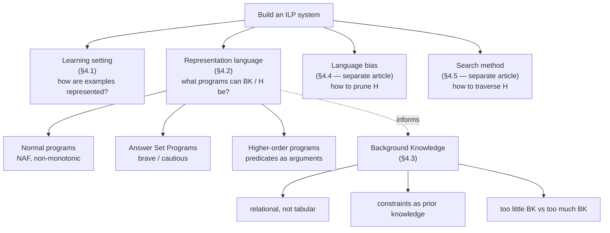
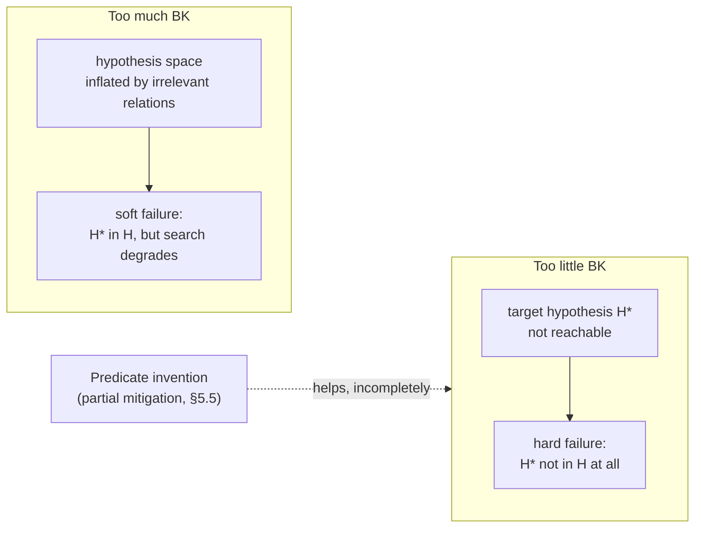

[[book-guidelines|↩ Back to guidelines]]

## Why "building an ILP system" is a design problem, not an implementation detail

Every machine-learning method needs an inductive bias — some built-in preference that lets it generalise from finitely many examples to a rule that covers infinitely many unseen cases (Mitchell, 1997). A decision-tree learner's bias is baked into its splitting heuristic; a neural network's bias lives in its architecture and loss. ILP is unusual in that its bias is *decomposed into four independent, explicit choices* the system designer must make before a single example is processed:

- **Learning [[Representative-ILP-Systems#Setting|setting]]** — how examples themselves are represented (a fact? a whole clause?).
- **Representation language** — what class of programs BK and the hypothesis are allowed to belong to (definite? normal? ASP? higher-order?).
- **[[Language-Bias|Language bias]]** — how the (otherwise infinite) hypothesis space gets pruned down to something searchable.
- **Search method** — how that pruned space actually gets traversed.

This article covers the first two of these choices — learning setting (§4.1) and representation language (§4.2), together with the closely related question of what background knowledge (BK) actually *is* in ILP and how much of it to supply (§4.3). Language bias and search method are deliberately deferred — the paper covers them in what it internally labels §§4.4-4.5, treated here as separate topics ("Language Bias," "[[Search-Methods-Over-the-Hypothesis-Space|Search Methods Over the Hypothesis Space]]") because they're substantial enough to deserve their own deep-dives.

What breaks if you *don't* separate these choices out explicitly? You get a system whose behavior is an inscrutable tangle of ad hoc decisions, impossible to compare against another system or to reason about in isolation. The paper's own comparison table (Table 3, p. 783) is only possible *because* systems like FOIL, Progol, Aleph, TILDE, Metagol, and ASPAL can each be characterized as a 4-tuple of (setting, hypothesis class, BK class, bias, search). That's the payoff of decomposition: a common vocabulary for an otherwise very heterogeneous zoo of systems.



## §4.1 Learning setting: what counts as "an example"?

This is the narrowest of the four choices, but it's foundational because it determines what Chapter 3's learning-from-entailment (LFE) or learning-from-interpretations (LFI) machinery is actually quantifying over. The paper notes that within LFE specifically, most systems treat examples as **ground facts** — ground atoms like `happy(alice)`. A minority of systems, Progol among them, generalise this to allow **whole clauses as examples**. That's a real expressiveness gain (you can supply "if X is a Lego builder then X is happy" as a labeled example, not just the ground consequence), but the paper is candid that this dimension doesn't do much comparative work across systems in practice — most of the interesting variation lives in the next three design choices.

The Rust analogy is direct: an "example as fact" system is one whose training set is `Vec<GroundAtom>` — closed terms with no free variables — while "example as clause" support is closer to a training set of `Vec<HornClause>`, i.e., the learner ingests implications, not just consequences. This is the same distinction as learning from *labeled data points* versus learning from *labeled rules* — the latter is strictly more informative per example but requires the learner's internal representation to already support clauses as first-class values, not just tuples.

## §4.2 Hypotheses: what class of program can $H$ belong to?

This is the section with the most structural content, and it's organized around three successively more expressive representation languages for BK and hypotheses. The throughline: **each step buys expressiveness (shorter, more natural target programs) at the cost of a harder search problem** — this "what breaks without it" tension recurs at every level.

### 4.2.1 Normal programs: negation as failure earns its keep

Most ILP systems restrict themselves to **definite programs** — Horn clauses with exactly one positive literal in the head and only positive literals in the body (recall §2.1's syntax hierarchy: clausal logic ⊃ Horn clauses ⊃ definite programs). The paper's own worked counter-example shows exactly where that restriction hurts. Given:

$$
B = \{\, \mathit{bird}(A){:-}\mathit{penguin}(A),\ \mathit{bird}(\mathit{alvin}),\ \mathit{bird}(\mathit{betty}),\ \mathit{bird}(\mathit{charlie}),\ \mathit{penguin}(\mathit{doris}) \,\}
$$
$$
E^+ = \{\mathit{flies}(\mathit{alvin}),\ \mathit{flies}(\mathit{betty}),\ \mathit{flies}(\mathit{charlie})\}, \quad E^- = \{\mathit{flies}(\mathit{doris})\}
$$

Without negation, a definite-program learner has no clean way to say "birds fly, except penguins" — it would need to either enumerate exceptions or fall back on a disjunctive/less-general hypothesis. With negation as failure (NAF), the target is a single clause:

$$
H = \{\, \mathit{flies}(A){:-}\mathit{bird}(A),\ \mathrm{not}\ \mathit{penguin}(A) \,\}
$$

This is exactly the closed-world, non-monotonic machinery from §2.3 (normal logic programs, NAF, completion/well-founded/stable-model semantics) showing up as a *hypothesis-language* choice rather than just a *BK*-language choice — the learner's target program itself may need to reason non-monotonically.

**What breaks without NAF:** the "too-little-BK" problem from §4.3 gets structurally worse, because every exception has to be encoded as additional positive facts rather than expressed as a single default-with-exception rule. NAF is doing real compression work on the hypothesis space, not just a syntactic convenience.

**Rust grounding.** NAF-based exception handling is the logic-programming cousin of a guard clause or a `match` arm ordered by specificity:

```rust
fn flies(is_bird: bool, is_penguin: bool) -> bool {
    is_bird && !is_penguin   // "not penguin(A)" as a boolean guard
}
```
The crucial difference from an ordinary boolean guard is *epistemic*, not computational: `not penguin(A)` doesn't mean "we have proven `penguin(A)` is false," it means "we have failed to derive `penguin(A)` from what we currently know" — closed-world assumption, not classical negation. A Rust guard has no such distinction (Rust's `bool` is always classically decided), so the analogy is instructive precisely at the point where it breaks down.

### 4.2.2 Answer Set Programs: when even NAF-with-Prolog-semantics isn't enough

Prolog-style NAF requires the program to be *stratified* (no cycles through negation), or the learned program risks looping under SLD-resolution (Law et al., 2018). ASP semantics (stable models, §2.3) lift that restriction — systems like ILASP can learn *unstratified* normal/ASP programs — and ASP additionally offers rule forms Prolog doesn't have: **choice rules** and **weak/hard constraints**. The paper's [[Generality-and-Theta-Subsumption#Worked example|worked example]] is a Hamiltonian-graph definition:

$$
\begin{aligned}
&0\{\mathit{in}(V_0,V_1)\}1 {:-} \mathit{edge}(V_0,V_1). \\
&\mathit{reach}(V_0) {:-} \mathit{in}(1,V_0). \\
&\mathit{reach}(V_1) {:-} \mathit{reach}(V_0), \mathit{in}(V_0,V_1). \\
&{:-} \mathrm{not}\ \mathit{reach}(V_0), \mathit{node}(V_0). \\
&{:-} V_1 \neq V_2, \mathit{in}(V_0,V_2), \mathit{in}(V_0,V_1).
\end{aligned}
$$

The first line is a **choice rule** — "for each edge, `in` may or may not hold" — nondeterministic in a way no Horn clause can express. The last two lines are **hard constraints**: they don't derive new atoms, they *eliminate* answer sets that violate them (no unreachable node; no vertex with two distinct in-edges). This is closer to declarative constraint programming than to Prolog's procedural resolution.

Learning *which* rules to add on top of a choice-rule skeleton splits ASP-learners into two families: **brave learners** (a program is accepted if *some* answer set covers the examples) and **cautious learners** (accepted only if *every* answer set covers the examples) — a distinction with no analogue in the single-model world of definite/normal Prolog programs, because a stratified normal program has a unique minimal/stable model to begin with.

**Rust/CSP grounding.** A choice rule `0{in(V0,V1)}1 :- edge(V0,V1).` is precisely a Boolean decision variable gated by a precondition — the same shape as a SAT/CSP variable declaration (`in[v0][v1] ∈ {0,1} if edge(v0,v1)`), and the hard constraints are literally integrity constraints a CSP solver would propagate over. If you've internalized SAT/SMT/CSP-style modeling, ASP choice rules plus constraints *are* that modeling style, just embedded inside a logic-programming search rather than a standalone solver call — this is the same "declarative search delegated to a solver" idea the paper returns to explicitly when it discusses meta-level ILP in §4.5.4 (a forward pointer, not covered here).

### 4.2.3 Higher-order programs: predicates as arguments

This is the subsection with the sharpest type-theoretic content, and it's worth slowing down on. Consider learning a Caesar-cipher decryption relation from examples like `decrypt([d,b,u],[c,a,t])`. A first-order solution has to be fully recursive and spell out the character-shift logic inline:

$$
\begin{aligned}
H = \{\ &\mathit{decrypt}(A,B){:-}\mathit{empty}(A),\mathit{empty}(B).\\
&\mathit{decrypt}(A,B){:-}\mathit{head}(A,C),\mathit{chartoint}(C,D),\mathit{prec}(D,E),\mathit{inttochar}(E,F),\\
&\qquad\quad \mathit{head}(B,F),\mathit{tail}(A,G),\mathit{tail}(B,H),\mathit{decrypt}(G,H).\ \}
\end{aligned}
$$

A **higher-order** representation instead factors out the "map a relation over a list" pattern as background knowledge and lets the hypothesis supply only the per-element relation:

$$
H = \{\ \mathit{decrypt}(A,B){:-}\mathit{map}(A,B,\mathit{inv}).\quad \mathit{inv}(A,B){:-}\mathit{chartoint}(A,C),\mathit{prec}(C,D),\mathit{inttochar}(D,B)\ \}
$$

What makes this *higher-order* rather than merely "using a library function" is that `inv` — a freshly **invented predicate symbol** ([[Predicate-Invention|predicate invention]] proper is deferred to a later section of the paper, §5.5) — appears as a **data argument** to `map`, not just as a predicate being called. That's the formal content of "higher-order": literals are allowed to take predicate symbols as arguments, so the logic quantifies over relations, not just over individuals. The direct payoff (Cropper et al., 2020) is that `map`, supplied once as BK, absorbs the recursive list-traversal boilerplate — the induced hypothesis shrinks from a self-contained recursive program to two small clauses, and (because the hypothesis space shrinks along with the program) this measurably improves sample complexity and learning time, not just readability.

**This is genuinely a type-theory-shaped idea, not just a programming-convenience one.** "A predicate symbol used as an argument" is the logic-programming face of a **higher-order function** — exactly `List::map`'s signature `map<A, B>(xs: Vec<A>, f: impl Fn(A) -> B) -> Vec<B>`, except that here `f` is a *relation*, not a total function, so the honest Rust shape is closer to a predicate-valued parameter:

```rust
// map(A, B, R) holds iff R relates each element of A to the
// corresponding element of B — R is itself a first-class relation.
fn map_rel<T, U>(xs: &[T], r: impl Fn(&T, &U) -> bool, ys: &[U]) -> bool {
    xs.len() == ys.len() && xs.iter().zip(ys).all(|(x, y)| r(x, y))
}
```

The Lean rendering makes the "quantifying over relations" content precise in a way Rust's `impl Fn` can only gesture at, because Lean lets you state `map` as a relation between lists directly, as a genuine `Prop`-valued higher-order predicate (this is essentially `List.Forall₂` from Lean's core library):

```lean
-- A relation between α and β is just a function into Prop.
def Rel (α β : Type) := α → β → Prop

-- map_rel r xs ys : the "higher-order" predicate the paper's H relies on —
-- r itself is a first-class argument, exactly like `inv` being passed to `map`.
inductive MapRel (r : Rel α β) : List α → List β → Prop
  | nil  : MapRel r [] []
  | cons : r x y → MapRel r xs ys → MapRel r (x :: xs) (y :: ys)

-- decrypt(A,B) :- map(A,B,inv).  becomes, almost literally:
def decrypt (A B : List Char) : Prop := MapRel inv A B
```
Reading the paper's `H` through this lens: the induced program `decrypt(A,B):- map(A,B,inv)` *is* an instance of `MapRel`, with `inv` playing the role of the relation parameter `r`. This is the same move a dependently-typed elaborator makes constantly — treating a predicate as ordinary data that can be passed around, unified against, and specialised — which is precisely what a metavariable-driven unifier needs to do when an implicit argument turns out to *be* a relation or a type family rather than a term. Predicate invention (naming `inv`) is the ILP-side analogue of introducing a fresh metavariable and later solving it by unification against the examples.

## §4.3 Background knowledge: relational, not tabular

BK plays the role "features" play in table-based ML, but the paper is emphatic about a structural difference: features are a **finite table**; BK is a **logic program**. That difference is what lets ILP express relations that no finite feature table could hold. Two worked examples make the point concrete:

- **List/string helpers** — `head`, `tail`, `last` supplied as BK hold "for lists of any length and any type." A feature-table representation would need a column per possible list length, which is not just impractical but *impossible* for lists of unbounded length.
- **Arithmetic relations** — `even/1`, `odd/1`, `sum/3`, `gt/2`, `lt/2`, each defined by a single general Prolog clause, hold over *all* integers without ever being pre-materialised. The paper notes explicitly: it is literally impossible to use a `>` relation over the naturals in a decision-tree learner, because that would require an infinite feature table. BK-as-logic-program sidesteps this by supplying the *rule*, not its extension.

### Constraints as encoded prior knowledge (§4.3.1)

BK isn't only positive facts and helper relations — it can also encode **hard prohibitions**. The banking example: two companies shouldn't be allowed to lend to each other if a common parent owns both —

$$
{:-}\ \mathit{lend}(A,B),\ \mathit{parent\_company}(A,C),\ \mathit{parent\_company}(B,C).
$$

This is a constraint in the same ASP sense as §4.2.2's Hamiltonian-graph example — a headless clause that *eliminates* candidate models rather than deriving new facts — but here it's doing the job of injecting a domain expert's prior knowledge directly into the search space, pruning hypotheses (and, transitively, the models built from them) that would otherwise be syntactically reachable but semantically absurd.

### The too-little / too-much trade-off (§4.3.2)

This is the section's central tension, stated almost exactly like a bias-variance trade-off but for background knowledge instead of model capacity:

**Too little BK** silently excludes the target hypothesis from the hypothesis space entirely — not "makes it harder to find," but makes it *unreachable*. The paper's `last/2` example is precise about this: given examples of "return the last character of a string," a learner supplied with `empty`, `head`, `tail` can induce

$$
H = \{\ \mathit{last}(A,B){:-}\mathit{tail}(A,C),\mathit{empty}(C),\mathit{head}(A,B).\quad \mathit{last}(A,B){:-}\mathit{tail}(A,C),\mathit{last}(C,B).\ \}
$$

but if `tail` was never supplied, there is *no way* to reach this hypothesis, however clever the search method — the language-bias/search machinery of §4.4-4.5 can only search *within* the space that BK plus the representation language jointly define. Predicate invention (forward reference to §5.5) is flagged as a *partial* mitigation — a system can sometimes invent a missing helper relation like `tail` from scratch — but the paper is careful to call this only a partial fix: ILP "still heavily relies on much human input," and knowing when invention is even necessary remains itself an unsolved problem.

**Too much BK** is the dual failure and is comparatively under-researched: irrelevant relations inflate the size of the hypothesis space (which is a function of BK size), degrading empirical learning performance even when every added relation is individually harmless. Note the asymmetry with the too-little case: too-little BK is a *reachability* problem (hard correctness failure — the target isn't even in $\mathcal{H}$), while too-much BK is a *search-efficiency* problem (soft performance failure — the target is in $\mathcal{H}$, but $\mathcal{H}$ is now too large to search well). The paper flags "too much BK" explicitly as a promising direction for future work, especially given the demands lifelong learning would place on relevance-filtering (echoed again in the paper's final Limitations section).



**Rust/type-system grounding.** The relational-not-tabular point maps cleanly onto why you'd reach for a `trait` over a `struct` with fixed fields when the "features" of your domain are actually open-ended relationships between entities:

```rust
// tabular BK: fixed columns, can't express "greater than over all integers"
struct Features { age: u32, income: u32 /* … */ }

// relational BK: an open-ended, queryable relation — this is what ILP's BK is
trait Relation<A, B> {
    fn holds(&self, a: &A, b: &B) -> bool;
}
struct GreaterThan;
impl Relation<i64, i64> for GreaterThan {
    fn holds(&self, a: &i64, b: &i64) -> bool { a > b }
}
```
The `trait`-based version never needs to enumerate pairs — exactly the "no infinite feature table" argument the paper makes for `gt/2`. This is also the shape the paper's own comparative-systems table (Table 3) is implicitly encoding: each system's "BK" column names *which* representation language (Definite / Normal / ASP / Facts) it accepts, i.e., how expressive a `Relation`-like interface the system is willing to reason about, not how many rows of data it can hold.

## Where this leads

Within the paper's own [[Language-Bias#Structure|structure]], §4.1-4.3 set up the vocabulary that §4.4 (Language Bias) and §4.5 (Search Method) build on directly: language bias exists *because* the representation-language choices made here (especially higher-order and ASP representations) leave a hypothesis space too large to search naively, and the search methods covered next (top-down refinement, bottom-up LGG/RLGG, Progol's hybrid, meta-level/ASP-delegated search) are all defined over the generality order — theta-subsumption — that these representation choices structure.

For the compiler/elaborator project this vault is built around, the load-bearing thread here is §4.2.3's higher-order representation: a predicate symbol appearing as a data argument is the logic-programming shadow of treating relations as first-class citizens of the term language, the same move a dependently-typed elaborator makes when it unifies a metavariable against a relation or type family rather than a plain term (`type-theory`, `automated-reasoning` — see the "Specific threads to keep surfacing" note on higher-order unification in `vaults/.learning-goals.md`). Predicate invention, introduced here only as a name (`inv`) and properly treated later in the paper (§5.5), is worth watching for as the ILP-side analogue of metavariable introduction followed by unification-driven solving. The rest of §4.3's too-little/too-much-BK trade-off is comparatively self-contained ILP methodology — genuinely useful for understanding why ILP systems behave the way they do, but it doesn't bear directly on the compiler/elaborator or CSP-kernel targets, so no connection is forced there.
