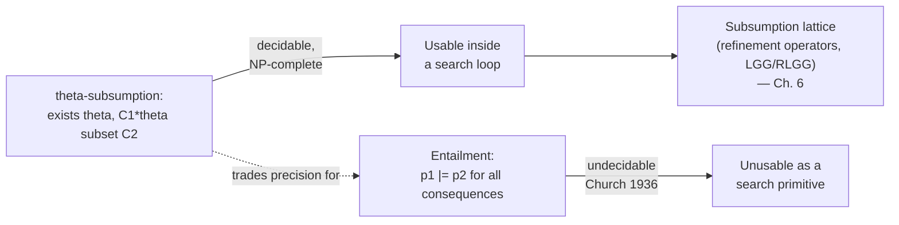

# Generality and θ-Subsumption

[[book-guidelines|↩ Back to guidelines]]

## The problem: how do you compare two hypotheses?

Any inductive learner — ILP included — needs to search a space of candidate hypotheses. To search that space intelligently, rather than by brute enumeration, you need a way to say "hypothesis $p_1$ is more general than hypothesis $p_2$." Generality gives you a *direction*: it tells a top-down search which way is "broader" (fewer constraints, more consequences) and which way is "narrower," and it tells a bottom-up search how to merge two specific hypotheses into the least specific one that still covers both.

The obvious definition of generality is semantic: $p_1$ is at least as general as $p_2$ if everything $p_2$ logically entails, $p_1$ also entails. That's a clean definition, and it's exactly the right one — but it is close to useless as a *search primitive*, because of a fact from Chapter 2's semantics section: entailment between clauses is undecidable (Church, 1936). A logic program can entail an infinite set of consequences once you allow structured terms like lists, so there is in general no algorithm that looks at two programs and correctly answers "does one entail everything the other does" in finite time.

**What breaks without a syntactic substitute:** if generality could only be checked semantically, no ILP system could ever decide, as a subroutine inside a search loop, whether one candidate clause is more general than another. The search itself — refining hypotheses, pruning the lattice, computing generalisations — would be built on an undecidable primitive. You cannot build a terminating algorithm on top of a test that doesn't terminate.

The book's answer is $\theta$-subsumption (Plotkin, 1971): trade semantic entailment for a syntactic, *decidable* proxy. You give up some precision — subsumption is a stronger requirement than entailment, so it's possible for $p_1$ to entail everything $p_2$ does without $p_1$ subsuming $p_2$ — in exchange for an actual algorithm you can run.

## Clauses as sets of literals

Before subsumption can be defined, the book reframes what a clause *is*, syntactically. A clause

$$h_1, \ldots, h_n \;\text{:-}\; b_1, \ldots, b_m$$

is normally read procedurally ("if all the $b_j$ hold, some $h_i$ holds"), but classically it is just a disjunction of literals, with body literals negated:

$$\{h_1, \ldots, h_n, \neg b_1, \ldots, \neg b_m\}$$

For example, `happy(A) :- lego_builder(A), enjoys_lego(A).` is the same object as the literal set $\{\texttt{happy(A)}, \neg\texttt{lego\_builder(A)}, \neg\texttt{enjoys\_lego(A)}\}$.

This reframing is what makes subsumption *definable at all* — subsumption is fundamentally a statement about set containment, not about implication:

> **Definition 1 (Clausal subsumption).** A clause $C_1$ subsumes a clause $C_2$ if and only if there exists a substitution $\theta$ such that $C_1\theta \subseteq C_2$.

Read this carefully, because the direction is easy to get backwards: $C_1$ (the *more general* clause) gets the substitution applied to it, and the result must land *inside* $C_2$ (the *more specific* clause) as a set. $C_1$ is more general because it's the one with fewer literals doing more work — after substitution it still fits inside the bigger, more constrained clause $C_2$.

### Worked example

$$C_1 = \texttt{f(A,B):- head(A,B)} \qquad C_2 = \texttt{f(X,Y):- head(X,Y), odd(Y)}$$

As literal sets:

$$C_1 = \{\texttt{f(A,B)}, \neg\texttt{head(A,B)}\} \qquad C_2 = \{\texttt{f(X,Y)}, \neg\texttt{head(X,Y)}, \neg\texttt{odd(Y)}\}$$

Take $\theta = \{A/X,\, B/Y\}$. Then $C_1\theta = \{\texttt{f(X,Y)}, \neg\texttt{head(X,Y)}\}$, which is literally a subset of $C_2$ — every literal in $C_1\theta$ appears in $C_2$, and $C_2$ additionally has the leftover $\neg\texttt{odd(Y)}$ literal that $C_1$ never had to explain. So $C_1$ subsumes $C_2$, and equivalently $C_2$ is more specific than $C_1$.

Notice the asymmetry with **unification**. Unification finds a $\theta$ that makes *both* sides equal ($A\theta = B\theta$), applying substitutions potentially to both terms. Subsumption applies $\theta$ to *only* $C_1$ and asks for containment, not equality, in the other. This is closer to one-directional **pattern matching** than to full unification — a distinction worth holding onto, because the book's later refinement operators and the LGG/RLGG construction (Chapter 6) both lean on this asymmetry: subsumption gives you a *partial order*, not an equivalence.

## Weak vs. strong subsumption

The definition above is what the book calls *weak* subsumption, and it has a slightly odd property: it's purely syntactic set containment, so it doesn't "clean up" redundant literals. The book's footnote gives the example:

$$C_1 = \texttt{p(X,Y):- q(X,Y), q(Y,X)} \qquad C_2 = \texttt{p(Z,Z):- q(Z,Z)}$$

With $\theta = \{X/Z, Y/Z\}$, $C_1\theta = \{\texttt{p(Z,Z)}, \neg\texttt{q(Z,Z)}, \neg\texttt{q(Z,Z)}\}$ — but as a *set*, that duplicate literal collapses, giving $\{\texttt{p(Z,Z)}, \neg\texttt{q(Z,Z)}\}$, which equals $C_2$ exactly. So $C_1$ *strongly* subsumes $C_2$: after applying $\theta$ and performing **factoring** (removing duplicate/redundant literals), the two clauses coincide.

But $C_1$ does **not weakly** subsume $C_2$ by Definition 1, because $C_1\theta$ as a multiset before factoring has two copies of $\neg\texttt{q(Z,Z)}$ where $C_2$ has one — the literal *counts* differ, and weak subsumption is defined over the clause-as-written, not the clause-after-simplification. This distinction matters operationally: an ILP system using weak subsumption for its lattice search can, in principle, treat two clauses as incomparable when a strong-subsumption-aware system would correctly identify one as strictly more general. The book flags this without resolving which notion a given system uses — that's a per-system design choice, not a settled convention.

## Why this buys you decidability

The entire payoff of reframing generality this way: **checking subsumption is decidable**, while checking entailment is not. Concretely, subsumption checking is $\mathsf{NP}$-complete (Nienhuys-Cheng & Wolf, 1997) — decidable, but in the worst case exponential. That NP-completeness is not incidental; it is the direct cost of picking a *decidable* proxy for something semantically as strong as entailment. You want to see this immediately, because "deciding whether a substitution $\theta$ exists mapping $C_1$'s literals into $C_2$, one literal at a time, consistently" is precisely a **constraint satisfaction problem**: variables (the free variables of $C_1$) need assignments (terms drawn from $C_2$'s literals), subject to the constraint that every literal of $C_1$, once substituted, must appear in $C_2$, and every occurrence of the same variable in $C_1$ must map consistently to the same term. This is exactly the same shape of search as a CSP with domain propagation and backtracking — the same combinatorial character that shows up again when a solver searches for a concrete satisfying assignment as a counterexample.



## Grounding: subsumption checking as search

### Rust — subsumption as a constrained matching search

The natural Rust shape for a clause is a set of literals, and a substitution is a partial map from variables to terms. Checking subsumption is then a backtracking search over which literal of $C_1$ maps to which literal of $C_2$, consistent with a single accumulating substitution:

```rust
use std::collections::HashMap;

#[derive(Clone, PartialEq, Eq, Debug)]
enum Term {
    Var(String),
    Const(String),
    // Compound(String, Vec<Term>) omitted for brevity — same idea, recurse.
}

#[derive(Clone, PartialEq, Eq, Debug)]
struct Literal {
    predicate: String,
    negated: bool,
    args: Vec<Term>,
}

type Substitution = HashMap<String, Term>;

/// Extend `theta` so that applying it to `lit` yields `target`, or fail.
/// This is *matching* (one-directional), not full unification: only
/// variables on the `lit` side may be bound.
fn match_literal(lit: &Literal, target: &Literal, theta: &Substitution) -> Option<Substitution> {
    if lit.predicate != target.predicate
        || lit.negated != target.negated
        || lit.args.len() != target.args.len()
    {
        return None;
    }
    let mut theta = theta.clone();
    for (a, b) in lit.args.iter().zip(target.args.iter()) {
        match a {
            Term::Var(v) => match theta.get(v) {
                Some(bound) if bound != b => return None, // inconsistent binding
                Some(_) => {}
                None => { theta.insert(v.clone(), b.clone()); }
            },
            Term::Const(_) if a != b => return None,
            _ => {}
        }
    }
    Some(theta)
}

/// Does c1 theta-subsume c2? Backtracking search: try every assignment
/// of c1's literals into c2's literals, consistent with one substitution.
fn subsumes(c1: &[Literal], c2: &[Literal]) -> bool {
    fn go(remaining: &[Literal], c2: &[Literal], theta: &Substitution) -> bool {
        match remaining.split_first() {
            None => true, // every literal of c1 placed — success
            Some((lit, rest)) => c2.iter().any(|target| {
                match_literal(lit, target, theta)
                    .map_or(false, |theta2| go(rest, c2, &theta2))
            }),
        }
    }
    go(c1, c2, &Substitution::new())
}
```

The `any` inside `go` is exactly where the $\mathsf{NP}$-completeness lives: in the worst case you're trying every literal of $C_2$ for every literal of $C_1$, backtracking on inconsistent bindings — the same exponential blow-up pattern as constraint propagation without good pruning. A real ILP system (or your CSP kernel) would add the domain-propagation machinery this sketch omits: index literals by predicate/arity first (immediately pruning most candidate matches), and propagate variable bindings eagerly instead of discovering conflicts late.

### Lean — matching vs. unification, made precise

Lean's elaborator gives you a clean way to see *why* subsumption's one-directionality matters. Lean's `isDefEq` performs (roughly) full unification: metavariables on *either* side of a definitional-equality check can be assigned. Clausal matching, as used in `match_literal` above, is the restricted case where only one side carries the "holes." You can state subsumption itself as a `Prop`:

```lean
def Literal := String × Bool × List Term  -- predicate, polarity, args

def Subst := List (String × Term)

def applySubst (θ : Subst) (C : List Literal) : List Literal :=
  C.map (substLiteral θ)  -- substLiteral defined elsewhere: apply θ to each arg

/-- C1 subsumes C2 iff some θ makes (C1 θ) a sub-multiset of C2. -/
def Subsumes (C1 C2 : List Literal) : Prop :=
  ∃ θ : Subst, ∀ l ∈ applySubst θ C1, l ∈ C2
```

Stating it this way makes the existential explicit: proving `Subsumes C1 C2` for a concrete pair of clauses *is* the search problem — you must exhibit a witness `θ`, which is exactly what the Rust backtracking search above is doing constructively. This is the same shape of problem as implicit-argument resolution in an elaborator: `isDefEq` needs to exhibit a metavariable assignment, subsumption-checking needs to exhibit a `θ`. The difference is what's allowed to vary (both sides of an equation, vs. one side of a containment), which is precisely the pattern-unification-vs-matching distinction worth carrying into the elaborator design.

### Python — a five-line sanity check

For quick experimentation, a direct (non-backtracking, brute-force) port makes the search visible without Rust's ceremony:

```python
from itertools import product

def subsumes(c1, c2):
    # c1, c2: lists of (pred, negated, args) tuples; args: tuples of strings
    for assignment in product(c2, repeat=len(c1)):
        theta = {}
        ok = True
        for lit, target in zip(c1, assignment):
            if lit[0] != target[0] or lit[1] != target[1] or len(lit[2]) != len(target[2]):
                ok = False; break
            for a, b in zip(lit[2], target[2]):
                if a[0].isupper():  # variable
                    if theta.setdefault(a, b) != b:
                        ok = False; break
                elif a != b:
                    ok = False; break
            if not ok:
                break
        if ok:
            return True
    return False
```

This is the naive $|C_2|^{|C_1|}$ enumeration the Rust backtracking search improves on by failing fast per-literal — useful for seeing the brute-force baseline before reasoning about why pruning matters.

## Where this leads

$\theta$-subsumption is the load-bearing decidability result underneath everything ILP does with search: the **subsumption lattice** that top-down refinement operators climb down and bottom-up generalisation climbs up, and the **least general generalisation (LGG)** and **relative LGG (RLGG)** constructions used to merge specific clauses into a general one — all of Chapter 6's search methods — are built directly on Definition 1. None of that machinery would be well-founded if generality were still defined semantically.

For the compiler/elaborator project (`automated-reasoning`), the connection is direct on two fronts. First, the matching search in `subsumes` above — find a substitution consistent across every literal, backtracking on conflicts — is structurally the same problem your CSP kernel will solve when searching for concrete counterexamples against a set of constraints; subsumption checking *is* a CSP instance, just over first-order literals instead of numeric or lattice domains. Second, the matching/unification asymmetry surfaced above (θ applied to one side only, vs. Miller-pattern-style unification applied to both) is exactly the distinction your elaborator's metavariable unifier needs to keep straight: `isDefEq`-style full unification during elaboration is a strictly more general — and strictly more expensive — operation than the one-directional matching that suffices for subsumption or for simple structural pattern matches.
