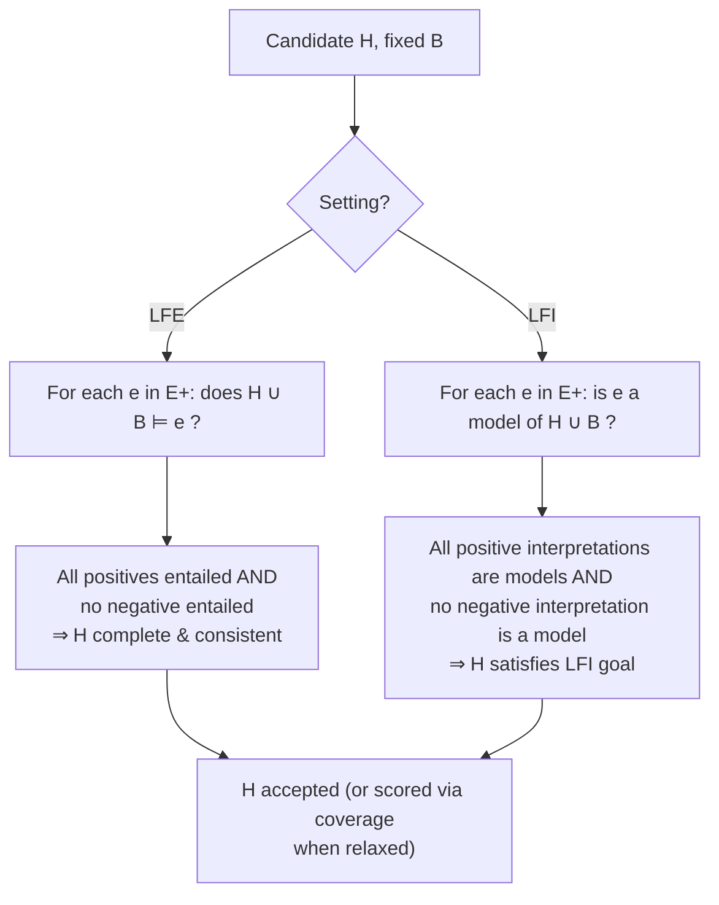

[[book-guidelines|↩ Back to guidelines]]

# ILP Problem Formulations

## The problem behind the problem

Every ILP scenario in this paper's introduction has the same shape: you're handed background knowledge $B$, positive examples $E^+$, negative examples $E^-$, and asked to produce a hypothesis $H$ — a logic program — that "generalises" the examples given $B$. That word "generalises" is doing a lot of hand-waving. Chapter 3 exists to kill the hand-waving: it gives two competing, fully formal answers to the question *what does it mean for a hypothesis to explain a set of examples?*

Why two answers instead of one? Because "explains the examples" can be cashed out at two different semantic levels, and ILP systems genuinely disagree about which one to use:

1. Treat each example as a single fact you want to be able to *derive* — like a query you expect to succeed. This is **learning from entailment (LFE)**.
2. Treat each example as an entire *possible world* — a full interpretation, a snapshot of everything true and false in some scenario — and ask whether your hypothesis's models line up with it. This is **learning from interpretations (LFI)**.

These aren't cosmetic variants. They change what a "positive example" *is* (an atom vs. a whole interpretation), what "the hypothesis covers the example" *means* (entailment vs. model membership), and ultimately which systems can even be meaningfully compared against each other — Aleph and TILDE are not solving the same formal problem, even though both are called "ILP systems." If you don't pin this down before you start reading about search methods, [[Language-Bias|language bias]], or specific systems (later chapters), you'll be unable to tell why a paper's formalism looks the way it does.

There's a third [[Representative-ILP-Systems#Setting|setting]], learning from satisfiability (LFS), that the authors mention only to set aside — LFE and LFI dominate practice, so those are the two Chapter 3 formalizes.

**What breaks without this distinction:** if you don't fix which covering relation you're using, you can't state completeness or consistency precisely, which means you can't define what a *correct* hypothesis is, which means "the ILP problem" isn't actually a problem yet — it's a vibe. Definitions 2 and 3 below are what turn the vibe into something a solver can be verified against.

## Shared vocabulary before the split

Before splitting into the two settings, the paper fixes the sets everything ranges over — this is the "signature" of the ILP problem, in the sense a type theorist would recognize (a specification of the *types* of the objects the problem definitions quantify over, prior to giving the definitions themselves):

- $\mathcal{X}$ — the **example/instance space**: the set of examples for which a target concept is defined.
- $\mathcal{B}$ — the **language of background knowledge**: the set of all clauses that could legally be supplied as $B$.
- $\mathcal{H}$ — the **hypothesis space**: the set of all candidate hypotheses.

Every later definition just quantifies over these three sets. If you've been reading compiler or type-checker code, this is exactly the move of declaring `type Example`, `type BKClause`, `type Hypothesis` before writing the judgment rules that relate them — the rest of the chapter is "judgment rules" over this fixed vocabulary.

## Learning from entailment (LFE)

### The intuition first

LFE is the setting closest to "ordinary" supervised learning read through a logical lens: an example is a single ground fact, like `happy(alice)`, and a hypothesis "covers" it if the hypothesis lets you *prove* that fact from the background knowledge. This is a direct reuse of the entailment relation ($\models$) from Chapter 2's Herbrand semantics — LFE doesn't invent new machinery, it just asks a learning question ("find $H$") about a relation you already have ("$T \models c$").

### The formal definition

> **Definition 2 (Learning from entailment).** Given a tuple $(B, E^+, E^-)$ where:
> - $B \subseteq \mathcal{B}$ denotes background knowledge
> - $E^+ \subseteq \mathcal{X}$ denotes positive examples of the concept
> - $E^- \subseteq \mathcal{X}$ denotes negative examples of the concept
>
> The goal of LFE is to return a hypothesis $H \in \mathcal{H}$ such that:
> - $\forall e \in E^+,\ H \cup B \models e$ (i.e. $H$ is **complete**)
> - $\forall e \in E^-,\ H \cup B \not\models e$ (i.e. $H$ is **consistent**)

Two properties, and they pull in opposite directions, which is exactly what makes this a genuine search problem rather than a lookup:

- **Completeness** — the hypothesis must entail *every* positive example. Push $H$ toward completeness alone (e.g. take $H$ to be the trivial always-true rule) and you'll entail everything, including the negatives.
- **Consistency** — the hypothesis must entail *no* negative example. Push $H$ toward consistency alone (e.g. take $H$ to be empty) and you'll entail nothing, including the positives.

A correct hypothesis under Definition 2 sits exactly at the intersection: everything positive is provable, nothing negative is.

### Working the definition against Example 2

The paper's own [[Generality-and-Theta-Subsumption#Worked example|worked example]] (Example 2, pp. 780) is worth tracing exactly because it shows completeness/consistency functioning as a *filter* over a fixed candidate set, not as something you compute analytically. Given

$$B = \{\text{lego\_builder(alice)}, \text{lego\_builder(bob)}, \text{estate\_agent(claire)}, \text{estate\_agent(dave)}, \text{enjoys\_lego(alice)}, \text{enjoys\_lego(claire)}\}$$

$$E^+ = \{\text{happy(alice)}\}, \qquad E^- = \{\text{happy(bob)}, \text{happy(claire)}, \text{happy(dave)}\}$$

and a hypothesis space of six single-clause candidates $h_1,\dots,h_6$ (each a different guess at what makes someone happy — being a lego builder, being an estate agent, some conjunction of these with "enjoys lego," etc.), the paper checks each candidate against Definition 2's two conditions and rejects five of six:

- $B \cup h_1 \models \text{happy(bob)}$ — **inconsistent** (bob is a lego builder too, so this rule wrongly derives a negative example)
- $B \cup h_2 \not\models \text{happy(alice)}$ — **incomplete** (alice isn't an estate agent, so this rule fails to derive the one positive example)
- $B \cup h_3 \models \text{happy(claire)}$ — **inconsistent**
- $B \cup h_4 \not\models \text{happy(alice)}$ — **incomplete**
- $B \cup h_5 = \text{happy(A):-lego\_builder(A), enjoys\_lego(A)}$ is **both complete and consistent** — this is the answer
- $B \cup h_6 \not\models \text{happy(alice)}$ — **incomplete**

Note what's happening mechanically: $h_5$ works precisely because its conjunction (`lego_builder(A)` *and* `enjoys_lego(A)`) is satisfied by alice but by no one in $E^-$ — bob lacks `enjoys_lego`, claire and dave lack `lego_builder`. This is the seed of everything later chapters call "refinement" and "search": you're navigating a lattice of clause candidates, testing each against completeness/consistency, and $\theta$-subsumption (Chapter 2, Definition 1) is what gives that lattice its [[Language-Bias#Structure|structure]] so the navigation isn't blind enumeration.

### The realism clause: coverage as a relaxed cost function

Definition 2 is a clean, binary specification — but the paper is upfront that almost no practical system enforces it literally. Real examples are noisy, so demanding *perfect* completeness and consistency is usually infeasible. Instead, most systems relax Definition 2 into an optimization: find $H$ that entails as many positives and as few negatives as possible. The paper cites Aleph's concrete instantiation of this idea — **coverage** as a cost function:

$$\text{coverage}(H) = |\{e \in E^+ : H \cup B \models e\}| - |\{e \in E^- : H \cup B \models e\}|$$

(informally: positives correctly entailed, minus negatives wrongly entailed), often combined with a penalty on hypothesis size (clause or literal count — an Occamist bias that resurfaces explicitly in Chapter 7). This is the general pattern worth internalizing: **Definition 2 is the specification you verify a solution against in the noise-free ideal case; coverage-style cost functions are what you actually optimize when that ideal is unreachable.** The gap between the two is exactly the "what does the relaxation cost you in guarantees" question the guidelines flag — you trade the certificate of correctness (provable completeness+consistency) for a scalar you can compare across candidates but that carries no soundness guarantee on its own.

## Learning from interpretations (LFI)

### The intuition first

LFE's covering relation asks "can I derive this one fact?" — a local, per-atom question. LFI asks a more global question: "does my hypothesis's set of models match this entire scenario?" An LFI example isn't a fact, it's a **whole interpretation** — a full Herbrand-style snapshot of a possible world, i.e. a set of facts intended to be jointly true. The question shifts from *entailment of a single atom* to *model membership of an entire set*.

Why would you want this instead of LFE? Some target concepts are naturally about *relational structure within one scenario* rather than about isolated derivable facts — e.g. "is this family tree internally consistent with respect to a parenting rule," which is a statement about a whole set of `father`/`mother`/`carrier` facts at once, not about any single one of them in isolation.

### The formal definition

> **Definition 3 (Learning from interpretations).** Given a tuple $(B, E^+, E^-)$ where:
> - $B \subseteq \mathcal{B}$ denotes background knowledge
> - $E^+ \subseteq \mathcal{X}$ denotes positive examples of the concept, each example being a set of facts
> - $E^- \subseteq \mathcal{X}$ denotes negative examples of the concept, each example being a set of facts
>
> The goal of LFI is to return a hypothesis $H \in \mathcal{H}$ such that:
> - $\forall e \in E^+,\ e$ is a **model** of $H \cup B$
> - $\forall e \in E^-,\ e$ is **not** a model of $H \cup B$

Structurally this is the same "positive/negative split against a target relation" shape as Definition 2 — but the target relation has changed from $\models$ (a program proving a fact) to *model membership* (an interpretation satisfying a program). LFI also carries an implicit closed-world-style completeness assumption on the examples themselves: every example interpretation is assumed to fully specify, for every relevant atom, whether it's true or false — no missing values. (The paper notes this is often infeasible in practice, which is why many real LFI systems instead work with *partial* interpretations.)

### Working the definition against Example 3

The paper's Example 3 (pp. 781–782, from De Raedt & Kersting 2008) grounds this with a family-tree "carrier" (of some trait) problem:

$$B = \{\text{father(henry,bill)}, \text{father(alan,betsy)}, \text{father(alan,benny)}, \text{mother(beth,bill)}, \text{mother(ann,betsy)}, \text{mother(alice,benny)}\}$$

$$E^+ = \{e_1, e_2\}, \qquad E^- = \{e_3\}$$

where $e_1, e_2, e_3$ are each themselves *sets* of `carrier(...)` facts — full snapshots, not single atoms — and the candidate hypothesis space is

$$h_1: \text{carrier(X):-mother(Y,X),carrier(Y),father(Z,X),carrier(Z)}$$
$$h_2: \text{carrier(X):-mother(Y,X),father(Z,X)}$$

Solving the LFI problem here means checking, for each $e_i$, whether $e_i$ is a model of $H \cup B$ — concretely: for every substitution $\theta$ such that the body of a rule holds under $B \cup e_i$, does the head also hold under $B \cup e_i$? The paper shows $e_3$ fails this test for $h_1$: there's a substitution $\theta = \{X/\text{bill}, Y/\text{beth}, Z/\text{henry}\}$ that satisfies $h_1$'s body but not its head under $e_3$ — meaning $e_3$ is *not* a model of $h_1 \cup B$, correctly ruling $h_1$ in as distinguishing the negative example. Neither example is a model of $h_2 \cup B$ for the same kind of reason, so $h_2$ is rejected outright.

Notice the mechanical flavor: checking "is $e$ a model of $H \cup B$" is a *local closure check* — for every way the body can fire, the head must already be present in $e$. This is structurally the same shape as checking that a set of facts is closed under a set of inference/rewrite rules — which is precisely why LFI is the natural fit for systems (like TILDE, covered in a later chapter) that think in terms of trees/rules applied uniformly across a dataset of separate "scenes," rather than one continuous derivation.

### Covering, LFE vs. LFI — the distinction that matters for comparing systems

The chapter closes section 3.2 by naming the exact terminological trap the guidelines flag: the word "covers" is used across the whole ILP literature, but it means genuinely different things depending on setting:

- **LFE:** $H$ covers an example $e$ iff $H \cup B \models e$ (derivability of one fact).
- **LFI:** $H$ covers an example $e$ iff $e$ is a model of $H \cup B$ (an entire interpretation satisfies the program).

This is precisely why "which systems can be compared on the same footing" is a real methodological question and not pedantry: two systems can both report "95% coverage" while measuring structurally different things. An LFE system's coverage number is about single-fact provability; an LFI system's is about whole-world model-satisfaction. Reading later chapters' system comparisons (Aleph vs. TILDE vs. ASPAL vs. Metagol, in Chapter 8/9) without holding onto this distinction will make their reported numbers look more directly comparable than they are.

## Multi-clause learning, briefly

One more piece of vocabulary Chapter 3 plants for later: a hypothesis need not be a single clause. Many target concepts — recursive ones especially — need at least a base case and a recursive case, i.e. **at least two dependent clauses** working together to satisfy completeness/consistency (or the LFI model condition). This is called **multi-clause learning**. It's mentioned only briefly here, but it's a real complication for search (Chapter 6) and a central reason recursion needs its own treatment (Chapter 7) — a single-clause refinement search can't discover a hypothesis that only becomes correct once two clauses are present simultaneously.

## Mechanism check: what would you actually implement?

Stepping back from the two definitions to the algorithmic content they imply, both settings reduce to a **decision procedure you run per example, per candidate hypothesis**:

Both branches bottom out in a **decidable-in-the-restricted-case, generally-undecidable-in-full-generality** check — exactly the entailment-vs-subsumption tension Chapter 2 raised. In practice, systems don't run full first-order entailment or full model-checking per candidate; they lean on SLD-resolution / bounded proof search (for LFE, staying inside the decidable Horn fragment) or bounded grounding (for LFI, staying inside a finite Herbrand base per example) to make the per-candidate check actually terminate. That operational reality — replacing an undecidable semantic check with a decidable syntactic/bounded one — is the same move $\theta$-subsumption makes for the generality order, and it's worth recognizing as one recurring pattern rather than three unrelated tricks.

## Where this leads

Definitions 2 and 3 are the fixed points every later design choice in the paper is *relative to*. Chapter 4's "four design choices" (learning setting, representation language, language bias, search method) only make sense once you know which covering relation ("setting") is even on the table — LFE-style provability or LFI-style model membership shapes what representation languages are natural (Prolog/Datalog lean LFE; ASP's multi-model semantics leans LFI) and what a refinement operator needs to preserve. Chapter 8's four case-study systems (Aleph: LFE; TILDE: LFI; ASPAL: LFE; Metagol: LFE) can only be honestly compared once you've internalized that "coverage" isn't one number.

**Automated Reasoning connection (Focus Area: `automated-reasoning`):** Definitions 2 and 3 are, underneath the ILP framing, two different *specifications of a search problem over a proof/model-checking oracle* — precisely the shape your theorem prover's clause/resolution engine will need to expose. LFE's completeness/consistency check is a derivability query your prover's resolution engine answers directly (an instance of the same entailment machinery Chapter 2's Herbrand semantics sets up); LFI's model-membership check is closer to a closed, bounded consistency check reminiscent of what a CHC (Constrained Horn Clause) solver does when verifying a candidate invariant against a finite set of proof obligations. If your compiler's abstract-interpretation-driven invariant generation ever needs to *learn* a candidate invariant from good/bad program states rather than derive it analytically — which is exactly the "guess an inductive invariant" step in CEGAR-style verification — this chapter's LFE/LFI split is a direct model for how to formalize that as "hypothesis complete and consistent with respect to observed states," with the same completeness/consistency-vs-noisy-relaxation tension surfacing wherever your observed states are incomplete or approximate.
