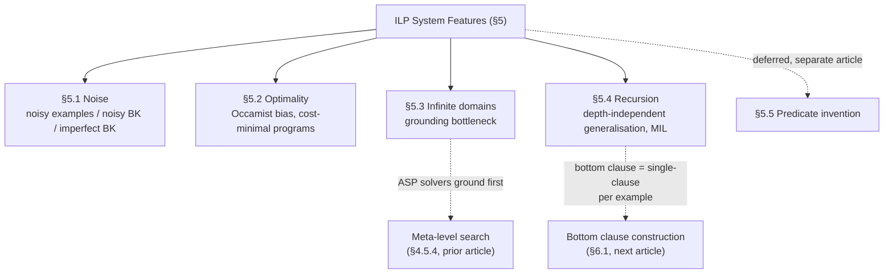
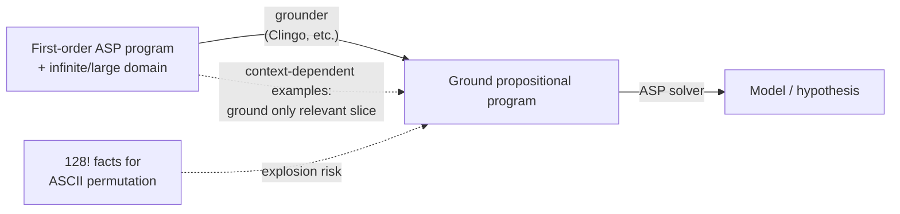

[[book-guidelines|↩ Back to guidelines]]

## Why a features chapter, and why these four

Chapters 4-6 answered "how do you *build* an ILP system": pick a learning [[Representative-ILP-Systems#Setting|setting]], a representation language, a [[Language-Bias|language bias]], a search method. That's the skeleton. Section 5 asks a different question: once you've made those four choices, what can the resulting system actually *cope with*? Real data is noisy. Real problems have no single "right-sized" hypothesis — some are cheap and wrong, some are correct but slow. Real domains are often infinite (the natural numbers, real-valued sensor data, arbitrary-length lists). And real target concepts are frequently defined by unbounded repetition — "reachable," "last element," "sorted" — not by a fixed finite unfolding.

The paper organizes eighteen real systems (FOIL, Progol, Aleph, TILDE, Metagol, ASPAL, $\partial$ILP, and others) against exactly these dimensions in Table 4, plus a fifth — [[Predicate-Invention|predicate invention]] — which this article deliberately does **not** cover; it's substantial enough (and central enough to the paper's own emphasis) to warrant its own separate deep-dive. Here we stay scoped to §§5.1-5.4: noise, optimality, infinite domains, and recursion.



Table 4 (p. 797) is worth sitting with for a moment before diving into the prose, because it's the paper's own compressed answer to "which systems handle what":

| System | Noise | Optimality | Infinite domains | Recursion |
|---|---|---|---|---|
| FOIL / Progol / Aleph / XHAIL | Yes | No | Yes | Partly |
| TILDE | Yes | No | Yes | No |
| ASPAL | No | Yes | No | Yes |
| ILASP | Yes | Yes | Partly | Yes |
| Metagol | No | Yes | Yes | Yes |
| $\partial$ILP | Yes | Yes | No | Yes |
| Popper | Yes | Yes | Yes | Yes |

A pattern jumps out immediately, and it's the throughline for the rest of this article: **the older, bottom-clause/refinement-based systems (top-left) are noise-tolerant and domain-agnostic but give up on optimality; the newer meta-level/ASP-delegated systems (bottom-right) buy optimality and recursion but often *lose* the ability to handle infinite domains or noise.** Nothing in this table is a free lunch — every "Yes" traces back to a specific mechanism, and every mechanism has a specific cost. That's what §§5.1-5.4 unpack.

## §5.1 Noise: three failure modes hiding under one word

The paper is precise about *what kind* of imperfection "noise" names, because the fixes differ:

- **Noisy examples** — an example is simply mislabeled: something in $E^+$ shouldn't be, or vice versa.
- **Noisy (incorrect) BK** — a fact or rule in the background knowledge is wrong: a relation holds when it shouldn't, or fails to hold when it should.
- **Imperfect BK** — BK is *incomplete or bloated*: relations that would help are missing, or there are so many irrelevant relations that they swamp the useful ones. (This connects straight back to the too-little/too-much-BK trade-off from Chapter 4.)

**What breaks without noise tolerance.** Recall Chapter 3's formal LFE definition: $H$ must entail *every* positive example and *no* negative example. That's a hard constraint — one mislabeled example makes the problem unsatisfiable, full stop, no matter how good the rest of $H$ is. Real datasets are never that clean. So "handling noise" in practice means relaxing completeness/consistency into an *optimization* problem: find the $H$ with the best coverage, not the $H$ with perfect coverage. This is precisely why systems built around a set-covering loop (TILDE's information-gain splits, ASP-based optimization statements) naturally absorb noisy examples — they were already scoring hypotheses rather than requiring an exact match, so a few misclassified examples just shift the score instead of making the problem infeasible.

Noisy *BK* is different and, per the paper, much less studied: most systems simply assume BK is ground truth, every atom crisply true or false, with zero room for uncertainty. $\partial$ILP breaks this assumption in an interesting way — instead of atoms being $\{\mathrm{true}, \mathrm{false}\}$, it gives them continuous semantics in $[0,1]$ and makes entailment differentiable, which is what lets it ingest genuinely ambiguous input like raw MNIST pixels rather than pre-cleaned symbolic facts.

**Rust grounding.** The shift from "hard constraint" to "scored objective" is exactly the shift from a `Result<Hypothesis, Unsat>` return type to something like:

```rust
struct ScoredHypothesis {
    program: Vec<Clause>,
    covered_pos: usize,
    covered_neg: usize,
}

fn score(h: &ScoredHypothesis, total_pos: usize) -> f64 {
    // trades off coverage against the size/complexity of h — never
    // requires covered_pos == total_pos && covered_neg == 0
    (h.covered_pos as f64 / total_pos as f64) - PENALTY * h.program.len() as f64
}
```

The strict LFE definition is the special case where this score has a hard cliff at $\mathrm{covered\_pos} = \mathrm{total\_pos} \wedge \mathrm{covered\_neg} = 0$; noise handling is what happens once you replace that cliff with a smooth objective. $\partial$ILP's continuous-valued atoms go one step further and make the *entailment relation itself* differentiable — closer to a `f64`-valued fuzzy-logic evaluator than a boolean SAT check, which is also why gradient-based optimization becomes applicable to a problem that's normally combinatorial.

## §5.2 Optimality: which hypothesis, among the many that "work"?

Once you've relaxed strict entailment (§5.1) — or even under strict entailment, since the ILP problem statements rarely pin down a *unique* $H$ — there are usually many hypotheses consistent with the data, or tied on training error. Section 5.2 splits the question in two.

### 5.2.1 Occamist bias: minimality by literal/clause count

The dominant answer is an **Occamist bias**: among hypotheses tied on the data, prefer the textually simplest one, measured by clause count, literal count, or description length. The paper is careful to flag that this is genuinely two different claims that get conflated in practice (Domingos, 1999):

1. Among hypotheses with the same *generalisation* error, prefer the simpler — uncontroversial, simplicity valued for its own sake.
2. Among hypotheses with the same *training* error, prefer the simpler because it's *likely* to generalise better — this is the version most ILP systems actually implement, and it is, taken literally, provably false in general (there exist problems where the simpler-on-training hypothesis generalises worse). Most systems don't distinguish the two, and the paper follows suit.

**What breaks without a deliberate optimality mechanism.** Systems that learn one clause at a time via a covering loop (Aleph is the paper's named example) construct sub-programs greedily — each clause is locally good but the *assembled* program offers no guarantee about total size or coverage. Newer meta-level systems fix this because they can encode "find the smallest hypothesis" as an actual optimization statement handed to a solver. ASPAL is the worked case: it's given a hypothesis space of candidate clauses up front, and uses ASP's native optimization support to *provably* return the subset with the fewest literals — not "probably small," but minimal by construction, because the solver is doing combinatorial optimization over the whole candidate space rather than greedily committing to one clause and moving on.

### 5.2.2 Cost-minimal programs: textual size isn't runtime cost

A sharper distinction: a textually minimal program need not be an *efficient* one. There's no purely syntactic feature that separates mergesort from bubble sort — both are "a sort function," equally simple to state, wildly different in asymptotic cost. Metaopt addresses this directly by tracking a **resolution-step cost** during search and pruning on it, rather than on literal count. The paper's own [[Generality-and-Theta-Subsumption#Worked example|worked example]] is a find-duplicate-in-list program. Plain Metagol induces:

```prolog
f(A,B):- head(A,B),tail(A,C),element(C,B).
f(A,B):- tail(A,C),f(C,B).
```

— an $O(n^2)$ scan-and-check. Metaopt, minimizing resolution steps instead of literal count, induces a *larger* program that's asymptotically better:

```prolog
f(A,B):- mergesort(A,C),f1(C,B).
f1(A,B):- head(A,B),tail(A,C),head(C,B).
f1(A,B):- tail(A,C),f1(C,B).
```

— sort first, then a single adjacent-pair scan, $O(n \log n)$. More clauses, more literals, *worse* Occamist score, strictly better program. This is the clean demonstration that "optimal" is a family of objectives, not one number — FastLAS generalises the point further by taking an arbitrary user-supplied scoring function and returning the ASP-optimal solution under *that* function, letting a user plug in a domain-specific cost (e.g. an access-control-policy quality metric) rather than being stuck with literal-count as the only notion of "best."

**Rust/complexity grounding.** This is precisely the distinction a compiler engineer already has vocabulary for: syntactic program size (AST node count, roughly `program.len()` in the snippet above) versus algorithmic complexity (asymptotic resolution-step count). An Occamist-only ILP system is a search procedure that optimizes for small `program.len()`; Metaopt augments the search's cost function with something closer to a *step-counting interpreter* — instrument the meta-interpreter to count resolution steps per candidate program, then treat that count as the thing being minimized, exactly the way a superoptimizer treats instruction-count or cycle-count as its objective instead of source-line count.

## §5.3 Infinite domains: the grounding bottleneck

This is where the paper's ASP-heavy meta-level systems from the prior chapter pay a real price. Most current ASP solvers (Clingo and similar) work in two phases: **ground** the first-order program into a finite propositional one, then hand that to a SAT-style solver. That grounding step needs the domain to be finite (or at least, per **finitely-ground programs**, need the *relevant part* of an otherwise-infinite grounding to be finite and computable up front). This is the **grounding bottleneck**: the intermediate ground representation can explode even when the underlying problem is small and tractable in intent. The paper's own example is blunt — grounding a permutation relation over the 128 ASCII characters requires $128!$ facts. Reasoning about real numbers is even worse: ILASP can represent reals as strings and delegate arithmetic to an embedded Python interpreter via Clingo's scripting hooks, but the numeric computation still happens *at grounding time*, so the grounding must still be finite — which defeats the purpose for genuinely unbounded numeric domains.

Crucially, this isn't an ASP-specific quirk — $\partial$ILP, a neural (not ASP-based) meta-level system, has the *same* limitation for a different underlying reason: its BK must be a finite set of ground atoms because that's what the differentiable evaluator operates over. The paper traces this back to the same fundamental problem faced by table-based statistical ML (§4.3): you can't reason about a relation you haven't materialised.

One mitigation is **context-dependent examples**: associate each example with just the slice of BK relevant to it, so the system only needs to ground *that* slice rather than the whole domain. This helps, but doesn't dissolve the problem — each individual example's grounding must still be finite, and the approach still degrades as domain size grows.

**What breaks without addressing this, and the connection worth naming explicitly:** this is the same tension a CSP/SMT-based verification backend runs into with **CEGAR** and domain propagation over unbounded or numeric domains — a solver that requires full materialization up front (full grounding, full unrolling) hits a wall exactly where a solver that can propagate constraints *lazily* over an abstract domain does not. The grounding bottleneck is ASP's version of "why you can't just BMC-unroll an unbounded loop and call it done" — the fix pattern in both settings is the same: replace eager materialization with a computation that stays symbolic/lazy over the domain, grounding (or refining) only as far as a specific query actually needs.



## §5.4 Recursion: why depth-independent generalisation needs it

This section is the clearest "what breaks without X" story in the whole chapter, because the paper gives two fully worked counter-examples.

**Example — reachability, without recursion.** To learn "$B$ is reachable from $A$" up to depth 4 without recursion, a system needs one clause per depth:

$$
\begin{aligned}
\mathit{reachable}(A,B) &{:-}\ \mathit{edge}(A,B) \\
\mathit{reachable}(A,B) &{:-}\ \mathit{edge}(A,C),\mathit{edge}(C,B) \\
\mathit{reachable}(A,B) &{:-}\ \mathit{edge}(A,C),\mathit{edge}(C,D),\mathit{edge}(D,B) \\
\mathit{reachable}(A,B) &{:-}\ \mathit{edge}(A,C),\mathit{edge}(C,D),\mathit{edge}(D,E),\mathit{edge}(E,B)
\end{aligned}
$$

This doesn't generalise past depth 4, and — the sharper point — *most systems would need training examples of every one of those depths* to even induce this much, because each clause is learned independently against the examples that specifically exercise it. With recursion, two clauses suffice for every depth:

$$
\mathit{reachable}(A,B){:-}\ \mathit{edge}(A,B). \qquad
\mathit{reachable}(A,B){:-}\ \mathit{edge}(A,C),\mathit{reachable}(C,B).
$$

**Example — last element of a list, structurally identical shape.** Same story with `last/2`: a non-recursive system needs a separate clause per list length, while

```prolog
last(A,B):- tail(A,C),empty(C),head(A,B).
last(A,B):- tail(A,C),last(C,B).
```

generalises to lists of *any* length, learned from a small, depth-mixed set of examples. This example pattern — a base case plus a self-call that consumes one structural layer — is exactly why the reachability and `last/2` programs have the same shape despite being about wholly different data (graphs vs. lists): it's structural recursion over the underlying inductive definition (paths, or list spines), not domain-specific cleverness.

**Why this is structurally hard for a whole class of systems.** The paper traces the difficulty to **bottom clause construction** (previewed here, covered in full in the Aleph deep-dive): systems built around it learn *one clause per example*, constructing the most-specific clause that entails that example and then generalising it. A covering loop of this shape needs examples of *both* the base case and the inductive case to ever discover a recursive rule, which is precisely why Table 4 marks FOIL/Progol/Aleph/XHAIL as only "Partly" recursion-capable — they can learn recursive definitions, but only when handed a sufficiently varied example set, not from a handful of examples the way MIL systems can.

**Meta-interpretive learning (MIL) as the fix.** Interest in recursion resurged with MIL and its flagship system Metagol, which restricts the hypothesis space with **metarules** (from the Language Bias article) rather than bottom clauses. The chain metarule $P(A,B){\leftarrow}Q(A,C),R(C,B)$ instantiates to non-recursive programs like `f(A,B):- tail(A,C),head(C,B)`, but a **tail-recursive metarule** $P(A,B){\leftarrow}Q(A,C),P(C,B)$ — note $P$ reappearing in its own body — is what licenses genuinely recursive definitions. Metagol goes further and supports **mutual recursion**, the paper's example being even/odd defined via a pair of clauses that call each other (with `even_1` an invented predicate standing in for "odd"):

```prolog
even(0).
even(A):- successor(A,B),even_1(B).
even_1(A):- successor(A,B),even(B).
```

The payoff, per the paper, is qualitative rather than incremental: systems that support recursion can generalise from *small* numbers of examples — sometimes a single one — because a single recursive clause pair already covers every depth/length, so there's no need to have separately witnessed every depth in the training set the way the non-recursive reachability program required. This is what opens up list-transformation-style program synthesis (Popper's `droplast`, learned from a handful of examples) as a tractable ILP application at all.

**Lean/Rust grounding — this is structural induction, not just "a loop."** The reachability and `last/2` recursive clauses are the logic-programming-syntax face of the same principle a dependently-typed kernel encodes as an induction principle over an inductive family. In Lean terms, a list's `rec`/`elim` principle *is* the base-case/inductive-case split these two clauses instantiate:

```lean
def last : List α → Option α
  | []      => none
  | [x]     => some x
  | _ :: xs => last xs   -- structural recursion: exactly the "tail-recursive metarule" shape
```

The tail-recursive metarule $P(A,B){\leftarrow}Q(A,C),P(C,B)$ is a second-order schema that, when instantiated, produces exactly the shape Lean's termination checker accepts by construction (decreasing structural argument) — Metagol is, in effect, *searching for* a well-founded recursive definition, the same search a programmer does by hand when writing a recursive function, except doing it by proof search over metarule instantiations rather than by direct authorship. In Rust, the same base/inductive split shows up as the difference between an unrolled, length-specific function and one written over a recursive data [[Language-Bias#Structure|structure]] (`enum List<T> { Nil, Cons(T, Box<List<T>>) }`) with a single recursive match arm — unrolling is exactly the non-generalising, depth-specific program the paper opens the section by rejecting.

## Where this leads

§§5.1-5.4 are best read as a diagnostic checklist for *any* system that searches a hypothesis/program space under a fixed budget of examples: does it tolerate noise (§5.1, essential for anything trained on real data), does it target the right notion of "best" (§5.2, textual minimality is not runtime efficiency), can its search machinery survive a domain that isn't small and finite (§5.3, the grounding bottleneck), and can it generalise from few examples via recursion rather than needing one example per unrolled depth (§5.4). Predicate invention (§5.5, deferred to its own article) turns out to interact with several of these — PI-capable systems tend to also be the newer, optimality-guaranteeing, meta-level ones from the bottom-right of Table 4 — but that connection is developed there, not here.

For the **automated-reasoning** and **sat-smt-csp** focus areas specifically: §5.3's grounding bottleneck is the ASP-search analogue of the eager-materialization problem a CSP/SMT-backed verification-condition solver must also avoid — any domain/lattice propagation kernel that insists on fully grounding before reasoning inherits the same $O(\text{domain size})$ wall, which is exactly the argument for lazy, on-demand constraint propagation (and, at the more radical end, automata/DFA-shaped abstract domains that never materialise concrete elements at all) over eager enumeration. §5.4's recursion story is a direct preview of structural induction as it will reappear in the compiler project's soundness arguments: a recursive metarule search is proof search for a well-founded recursive definition, which is the same proof obligation a trusted kernel discharges when it accepts a structurally recursive function or a well-founded induction proof — the *search procedure* differs (metarule instantiation vs. a human or elaborator writing the term directly) but the underlying well-foundedness requirement, and the reason non-recursive "unrolled" definitions are unacceptable as general solutions, is identical.
