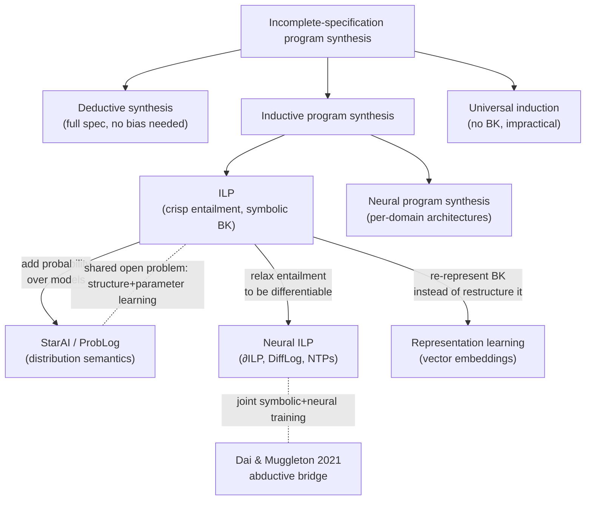

# ILP in the Broader Landscape

[[book-guidelines|↩ Back to guidelines]]

## What breaks if you only ever look inside ILP

Every field eventually has to answer an uncomfortable question: what, precisely, distinguishes it from its neighbors, and is that distinction actually principled or just historical accident? By the time you've internalized $\theta$-subsumption, the LFE/LFI problem settings, refinement operators, and [[Predicate-Invention|predicate invention]], it's tempting to treat ILP as a closed, self-contained theory. It isn't. ILP sits at a crossroads of at least three other research programs that are all, in one way or another, trying to solve *the same underlying problem* — building a program (or program-shaped artifact) from incomplete specification — but each took a different fork at a different decision point. Section 8 of the survey is Cropper and Dumančić drawing those forks explicitly, so that you know exactly what ILP is buying you and what it's giving up, compared to:

1. **Program synthesis** more broadly — same output (a program), different inputs and different notion of success.
2. **Statistical relational AI (StarAI)** — same substrate (logic programs), plus a probability model for the parts of the world ILP treats as certain.
3. **Neural ILP / representation learning** — same goal (induce [[Language-Bias#Structure|structure]] from data), different optimization machinery (gradients instead of combinatorial search).

If you're building a verification toolchain with an embedded theorem prover, this chapter matters less for its applications and more for the taxonomy: it tells you *where the boundaries between symbolic search, probabilistic inference, and gradient-based learning actually are*, and that taxonomy recurs constantly once you start asking "should this part of my system be exact, probabilistic, or learned?"

---

## 1. Program synthesis: the family ILP belongs to

### The three-way split: universal, deductive, inductive

The book's own framing (§8.1) sets up a spectrum with two extremes and a middle ground:

- **Deductive program synthesis** (Manna & Waldinger, 1980) takes a *full, complete specification* as input — typically a logical formula fully characterizing the target program's behavior — and derives a program that provably satisfies it. This is efficient (in the sense of being well-defined and mechanizable) precisely because the specification leaves no ambiguity: there's no generalization problem, only a search-and-construct problem.
- **Universal induction methods** — Solomonoff induction (Solomonoff, 1964) and Levin search (Levin, 1973) — sit at the opposite extreme. They take *only examples* as input, with no background knowledge (BK) and no bias baked in, and search the space of all programs (weighted by something like description length) for ones consistent with the data. The book calls these "impractical," and it's worth understanding *why* precisely rather than taking that on faith: with no bias, no bound on the hypothesis space, you're doing an unstructured search over all of program-space. Mitchell's (1997) point that "bias-free learning is futile" is not a throwaway remark — it's essentially a no-free-lunch argument. A learner that has to remain agnostic about *which* programs are more likely a priori (because it has no BK to encode that preference) cannot generalize better than exhaustive enumeration.
- **Inductive program synthesis** is the space between: like universal induction, it takes *incomplete specifications* (typically input/output examples) rather than a full logical spec. But like deductive synthesis, it uses background knowledge — and that BK is exactly what supplies the inductive bias that universal methods lack. This is the categorical home of ILP: **when given no BK, inductive program synthesis degenerates to universal induction.** BK isn't a convenience in ILP — it's the thing that makes the problem tractable at all, by restricting the effective hypothesis space to something a search procedure can actually explore. This is the same "why-does-restriction-help" logic you already met with [[Language-Bias|language bias]] and the Blumer bound in Chapter 5 — Related Work is telling you it's not an ILP-specific trick, it's the general condition for incomplete-specification synthesis to work at all.

$$
\text{deductive synthesis} \xleftarrow{\text{spec strength}} \text{inductive program synthesis} \xrightarrow{\text{BK} \to \varnothing} \text{universal induction}
$$

### The ML/PL fault line

The more consequential distinction the chapter draws is cultural and methodological, not formal: inductive program synthesis is studied independently in **machine learning** and in **programming languages (PL)** research, and the two communities disagree on what counts as success along two axes:

**(i) Generality of solutions.** PL-style synthesizers (Feser et al., 2015; Osera & Zdancewic, 2015; Albarghouthi et al., 2017; Si et al., 2018; Raghothaman et al., 2020) aim to find *any* program consistent with the given examples — full stop. They typically don't evaluate whether that program generalizes to unseen inputs; the book states flatly that they "rarely measure predictive accuracy." ML-style approaches (ILP included) treat generalization as *the* central challenge, because producing an overly specific program that merely memorizes the training examples is trivial. This is exactly what the book flags in a striking one-liner: an ILP system can always trivially satisfy the examples by constructing the bottom clause (Muggleton, 1995) — recall this from Aleph's case study — for each example individually. That's a program (technically), and it's useless, because it doesn't compress or generalize; it's a lookup table dressed up as a clause. **Predictive accuracy on held-out examples is the thing that separates "solved the specification" from "actually learned the concept,"** and it's the thing the PL literature usually skips measuring.

**(ii) Noise handling.** ML treats noise (mislabeled examples, imperfect BK) as a first-class concern — recall §7.1's [[Representative-ILP-Systems#Discussion|discussion]] of $\partial$ILP's fuzzy semantics precisely to tolerate it. PL synthesis largely assumes the specification (even if incomplete) is *correct*, which is a reasonable assumption when the "examples" come from a trusted test suite, but a bad one when they come from noisy real-world observation.

Why does this fault line matter for a verifier/compiler project? Because it's a preview of a choice you'll face constantly: when you build a Horn-clause invariant generator or a CEGAR loop, are your "examples" (counterexamples from a failed verification attempt, say) treated as ground truth that must be satisfied exactly (the PL framing — deductive, exact), or as noisy signal that should shape a hypothesis without being slavishly fit (the ML framing)? CEGAR itself, notably, straddles this: a counterexample it produces is exact and must be excluded, but the *abstraction refinement* it drives is closer to an inductive generalization step.

### Neural program synthesis, in brief

The chapter also places **neural program synthesis** (Balog et al., 2017; Ellis et al., 2018, 2019) inside this landscape as another inductive-synthesis lineage, distinct from ILP. Its stated advantages: robustness to noisy BK (as $\partial$ILP demonstrates within the ILP world) and the ability to harness large-scale computation. Its disadvantages, per the book: it typically needs *far more examples* than symbolic ILP to learn the same concept (Reed & de Freitas, 2016; Dong et al., 2019), and it usually requires a **hand-crafted neural architecture per domain** — the REPL system (Ellis et al., 2019) needs a bespoke grammar, interpreter, and network for every new task domain. ILP's contrasting strength here is structural uniformity: because logic programs are the single representation for BK, examples, *and* hypotheses, an ILP system doesn't need re-engineering to move to a new domain — you just change the BK.

---

## 2. StarAI: what happens when you let go of crisp truth

### The gap ILP inherits from logic programming

ILP's formal foundation (Chapter 2 of the survey) is unapologetically **crisp**: a fact is either in the Herbrand model or it isn't; a clause either entails an example or it doesn't; $\theta$-subsumption is a syntactic yes/no test. This buys decidability and clean search, but it inherits logic programming's blind spot: *no native way to represent "I'm 80% sure this fact is true."* Statistical relational AI (StarAI) (De Raedt & Kersting, 2008; De Raedt et al., 2016) exists precisely to patch that gap by fusing logic programming with probabilistic reasoning.

### Distribution semantics and ProbLog

The specific StarAI formalism the chapter walks through is the **distribution semantics** family (Sato, 1995; Sato & Kameya, 2001; De Raedt et al., 2007), and its flagship implementation, **ProbLog**. ProbLog is presented as a minimal extension of Prolog with two probabilistic primitives:

- **Probabilistic facts** — a fact annotated with a probability $p$:
$$
0.01 :: \mathrm{earthquake}(\mathrm{naples}).
$$
This isn't "earthquake(naples) is 1% true" in some fuzzy sense — it's a genuine **Boolean random variable**: true with probability $p$, false with probability $1-p$. Semantically, ProbLog doesn't commit to a single Herbrand interpretation; it defines a *distribution over possible worlds*, each obtained by resolving every probabilistic fact's coin flip, and every world is a perfectly ordinary (crisp) logic program. This is the key conceptual move: probability doesn't infect the logic itself — it lives one level up, as a distribution over which crisp model you happen to be in. During SLD-resolution, ProbLog's engine determines a probabilistic fact's truth value stochastically, so "1% chance of an earthquake" also reads operationally as "1% of program executions observe the earthquake fact holding."

- **Annotated disjunctions** — the clause-level generalization. Where a probabilistic fact is non-determinism over one atom, an annotated disjunction spreads probability mass over several mutually exclusive head literals of one clause:
$$
\tfrac{1}{3}::\mathrm{colour}(B,\mathrm{green});\ \tfrac{1}{3}::\mathrm{colour}(B,\mathrm{red});\ \tfrac{1}{3}::\mathrm{colour}(B,\mathrm{blue}) \ \text{:-}\ \mathrm{ball}(B).
$$
Exactly one disjunct fires per resolution of the clause — this is a categorical (not independent-coin) choice among the listed alternatives.

### Structure learning versus parameter learning

Once you add probability to logic programs, the *learning problem itself* forks in two: learning the **structure** (which clauses/rules exist — this is what plain ILP does) versus learning the **parameters** (what probability each probabilistic choice carries, given a fixed structure). A full StarAI learning task potentially needs both simultaneously, and the book is candid that this joint problem is "largely unexplored," citing only a handful of approaches (De Raedt et al., 2015; Bellodi & Riguzzi, 2015). This is a genuinely useful landmark if you ever reach for probabilistic program synthesis in your own work: **structure learning is what ILP already solves well; parameter learning under a fixed structure is the well-trodden part of probabilistic inference; doing both at once, from data, is still mostly open.**

**Why this belongs on your radar (`sat-smt-csp`, `static-analysis`):** the "possible-worlds" semantics underlying ProbLog is structurally the same move as *counterexample-guided abstraction refinement* — both replace a single committed model with a weighted or nondeterministic family of models and reason across the family. If your abstract interpreter ever needs to reason about *probable* invariants (e.g., "this branch is almost never taken" as a soundness-preserving but completeness-relaxing heuristic), ProbLog's distribution-over-Herbrand-models pattern is the right mental template — probability sits above the logic, not inside it.

---

## 3. Neural ILP: relaxing entailment until it's differentiable

### Why entailment has to change shape to meet gradients

Neural networks are trained by gradient descent over continuous, differentiable objectives. ILP's core relation — entailment, $B \wedge H \models e$ — is discrete: either the hypothesis together with the background knowledge proves the example, or it doesn't. There is no gradient of a boolean. So the entire neural-ILP research program is, at bottom, **an exercise in finding a continuous relaxation of entailment that degrades gracefully back to the crisp version** — this is the through-line that makes $\partial$ILP (which you met already in the Noise Handling discussion, §7.1) legible as more than an isolated hack.

The mechanism, as the chapter spells it out: rather than searching for *one* hypothesis clause among many candidates, neural-ILP techniques treat the **entire hypothesis space as the candidate**, with each member $c$ of that space carrying a **valuation** $w_c \in [0,1]$ — a confidence that $c$'s entailments are correct. A ground fact $f$ entailed by some clause $c$ is then "entailed with valuation $w_c$," and the *aggregate* valuation of $f$ is the sum (or some other combination) over every $c$ that entails it:

$$
w_f = \sum_{c \,\models\, f} w_c
$$

This is the precise sense in which "learning a hypothesis" changes character (this is exactly the Key Question the guidelines flag for this chapter): under crisp semantics, learning means *selecting* a subset of the (discrete, combinatorial) hypothesis space. Under the neural relaxation, learning means *fitting a continuous weight vector* over the (still combinatorially large, but now fixed and enumerated) hypothesis space — a task any off-the-shelf gradient-based optimizer can perform, at the cost of requiring the space to be **enumerated up front and kept small** (the paper notes existing systems typically cap themselves at programs of one or two clauses with at most two literals each). Symbolic ILP's search procedures (top-down refinement, bottom-up LGG, meta-level ASP encoding — Chapter 6) never need to enumerate the whole space explicitly; that's precisely the tractability trade neural-ILP makes in exchange for differentiability.

The chapter lists the family this way of thinking spawned: $\partial$ILP itself, **neural theorem provers** (Rocktäschel & Riedel, 2017), **DiffLog** (Si et al., 2019), and **LRNN** (Sourek et al., 2018) — all variations on "make entailment a soft, weighted, differentiable quantity instead of a crisp test."

### Where the two worlds actually meet: Dai & Muggleton (2021)

The chapter singles out one system as, at time of writing, the only approach able to *jointly* learn a logic-program hypothesis **and** train a neural network handling a sensory sub-task within the same pipeline — Dai and Muggleton's (2021) extension of ILP with an **abductive step** (Flach & Hadjiantonis, 2013). The mechanism: abduction deduces plausible labels for training the neural network *from the background knowledge and the program currently being explored* — i.e., the symbolic side supervises the neural side, rather than the two being trained independently and glued together. Their demonstration (learning arithmetic and sorting operations directly from images of digits) is a concrete existence proof that symbolic structure and perceptual learning can be trained jointly rather than in separate stages, and the book flags this as "underexplored... holds a lot of promise" — worth knowing about if your own verification toolchain ever needs to bridge a similarly hard boundary (e.g., a static analyzer that has to characterize behavior learned from raw traces rather than specified up front).

---

## 4. Representation learning: predicate invention's estranged sibling

The final connection (§8.4) circles back to **predicate invention (PI)** — the mechanism from Chapter 8 (§5.5 in the original survey's numbering) for introducing new auxiliary predicate symbols defined in terms of existing ones. The book's claim here is sharp and worth sitting with: PI and **representation learning** (Bengio et al., 2013), the deep-learning-originated program of re-representing raw data into learned feature spaces, are pursuing **the same underlying goal by structurally different means.**

- **PI's move**: replace a flat or overly literal representation with a *symbolic* one — new predicate symbols, each with a crisp logical definition in terms of existing predicates, chosen because they make the target concept expressible in fewer/simpler clauses. (Recall: PI was introduced specifically because insufficient BK is a recurring failure mode, and PI is one of the only mitigations.)
- **Representation learning's move**: replace constants and predicates with **dense vectors** in a continuous embedding space, positioned so that semantically related symbols (e.g., constants that co-occur in facts) end up geometrically close. Once a relational knowledge base has been embedded this way, *any tabular ML technique* — the kind ILP was explicitly invented to outperform in the small-sample, relational regime (recall §1.5's "Why ILP?" framing) — can operate over it, because the relational structure has been flattened into feature vectors.

Both are answering: *"the given representation is impoverished for this task — how do I get a better one?"* PI answers symbolically (new logical building blocks); representation learning answers geometrically (a better coordinate system). The book is explicit that despite this shared goal, **little cross-pollination has occurred** between the two research communities — this is one of the survey's more pointed observations about where the field could still grow, and it's the third Key Question the guidelines flag for this chapter.

---

## Synthesis: the map you now have

Three deliberate design choices define where ILP sits in this landscape, each one a place where a different neighboring field made the opposite call:

1. **Crisp versus probabilistic truth.** ILP commits to Herbrand-model entailment being exactly true or false; StarAI relaxes this by placing a probability distribution *over* Herbrand models, not inside the entailment relation itself.
2. **Combinatorial search versus continuous optimization.** ILP searches a discrete hypothesis space (top-down refinement, bottom-up LGG, or ASP-encoded meta-level search — recall Chapter 6); neural ILP instead enumerates a bounded hypothesis space up front and fits continuous valuations over it by gradient descent.
3. **Symbolic re-representation versus geometric re-representation.** When ILP's BK is insufficient, its own-house fix is predicate invention — new logical symbols. Representation learning fixes the analogous problem by embedding everything into a vector space instead.

**[[Applications-of-ILP#Where this leads|Where this leads]].** The rest of the survey (§9, Limitations) returns to several of these same boundaries as *open problems rather than settled trade-offs* — probabilistic ILP and noisy BK (the StarAI direction), and predicate invention's connection to abstraction and human-level generalization (the representation-learning direction) are both named explicitly as future work. If your own project ever needs symbolic search to interoperate with a probabilistic or learned component — for instance, a CSP kernel searching for concrete counterexamples (`sat-smt-csp`) alongside an abstract interpreter that must soundly over-approximate under uncertainty (`static-analysis`), or a resolution/unification-based theorem prover (`automated-reasoning`) that eventually needs to ingest noisy, learned invariants rather than hand-specified ones — this chapter's taxonomy (crisp vs. probabilistic, discrete-search vs. differentiable, symbolic vs. geometric) is the right first cut for deciding *which* of these neighboring paradigms actually solves your specific problem, rather than reaching for "add a neural net" or "add probabilities" as an unexamined default.
