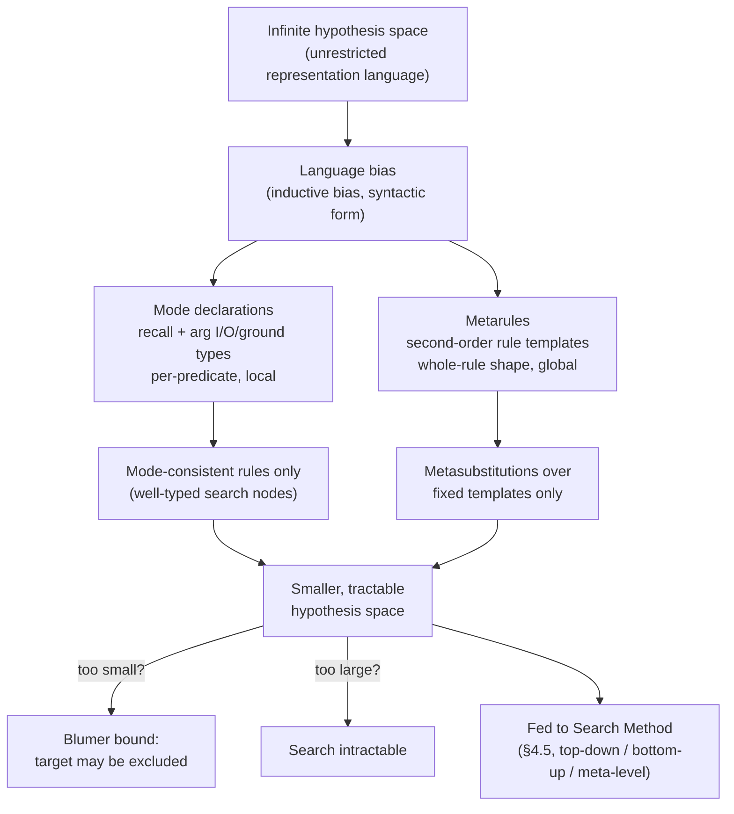

# Language Bias

[[book-guidelines|↩ Back to guidelines]]

## The problem: an infinite hypothesis space

Fix a representation language — say, definite Prolog programs over some background predicates. How many programs are expressible in that language? Infinitely many: nothing stops a clause from having a thousand literals, or introducing forty variables, or chaining ten recursive calls. [[Generality-and-Theta-Subsumption|θ-subsumption]] gives you a *decidable order* over this space (Section 2.4, Chapter 2) — a way to compare any two hypotheses and say which is more general — but an order over an infinite set is still an infinite set. Decidable pairwise comparison does not make *search* over the whole space tractable; it just makes each individual comparison terminate.

**What breaks without a bias:** imagine an ILP system with no restriction at all on what counts as a candidate hypothesis. Even for a toy target like "a person is happy if they build and enjoy Lego" (the book's running `happy/1` example), the raw hypothesis space includes every syntactically well-formed clause over the available predicate and constant symbols — a search space so large that no enumeration strategy, however cleverly ordered by subsumption, converges in reasonable time. The fix has to come *before* search starts: you shrink the space itself, so that whatever search method you plug in (Section 4.5, [[Search-Methods|Chapter 6]]) has something tractable to work over.

That shrinking is what the book calls a **language bias**: "restrictions on hypotheses, such as restricting the number of variables, literals, and rules in a hypothesis" (p. 786). It is inductive bias (Mitchell, 1997) in the classical machine-learning sense — a prior commitment about what a good hypothesis *looks like*, imposed before any data is examined — specialised to the syntactic [[Representative-ILP-Systems#Setting|setting]] of logic programs.

## Syntactic bias vs. semantic bias

The book draws one distinction before getting to mechanisms (Adé et al., 1995):

- **Syntactic bias** — restrictions on the *form* a rule may take: how many literals, which predicate symbols, which argument types, which shape of clause.
- **Semantic bias** — restrictions on the *behaviour* of the induced hypothesis: for instance, requiring termination, or requiring the hypothesis to be consistent with some background theory beyond simple entailment.

Both of the two mechanisms the paper focuses on — **mode declarations** and **metarules** — are syntactic biases. They restrict what a rule can *look like* before anything is asked about what it *does*. This is a deliberate simplification the authors make for exposition ("We focus on mode declarations ... and metarules ... two popular language biases," p. 786) — other encodings exist (grammars, Dlabs, production fields, predicate declarations) but aren't detailed here.

## Mechanism 1: Mode declarations

### The motivating shape

A mode declaration answers three questions about a predicate symbol at once: *can it appear in a rule at all, how many times, and what are the types of its arguments (in what sense "type")?* The general form is:

$$\mathrm{mode}(\mathit{recall},\ \mathit{pred}(m_1, m_2, \ldots, m_a))$$

Concretely:

```
modeh(1, happy(+person)).
modeb(*, member(+list, -element)).
modeb(1, head(+list, -element)).
modeb(2, parent(+person, -person)).
```

`modeh` constrains what may appear in a rule's **head**; `modeb` constrains what may appear in its **body**. Three things are being declared per predicate:

1. **Recall** (the first argument): the maximum number of times this mode can be used within a single rule — equivalently, a bound on how many alternative solutions a literal built from that predicate can contribute. `parent/2` used for grandparent-style relations might get recall 2 (a person has at most two parents); a functional relation like `head/2` gets recall 1; `*` means unbounded.
2. **Predicate symbol and arity** — which relation this mode governs.
3. **Per-argument mode annotations** — `+` (input), `-` (output), `#` (ground):
   - **Input (`+`)**: at the moment this literal is called, the argument must already be bound to a variable introduced earlier in the rule.
   - **Output (`-`)**: the argument becomes bound as a result of calling this literal — it need not have appeared before.
   - **Ground (`#`)**: the argument must be a ground term (typically used to admit constants into a rule, e.g. `modeb(*, length(+list, #int))` in Aleph, allowing integer literals to be introduced).

### Mode consistency as a well-formedness check

A rule is **mode consistent** with respect to a set of declarations if every literal in it matches some declared mode, its input arguments are always bound by the time they're used, and its output/head types line up. Given

```
modeh(1, target(+list, -char)).
modeb(*, head(+list, -char)).
modeb(*, tail(+list, -list)).
modeb(1, member(+list, -list)).
modeb(1, equal(+char, -char)).
modeb(*, empty(+list)).
```

the rule `target(A,B) :- head(A,C), tail(C,B)` is **inconsistent** for two independent reasons folding into one violation: `modeh(1, target(+list,-char))` requires `B` (target's second argument) to have type `char`, but `modeb(*, tail(+list,-list))` requires `tail`'s second argument to have type `list` — and `B` is unified against both. Similarly `target(A,B) :- empty(A), head(C,B)` is inconsistent because `head`'s first argument `C` is declared `+` (input) but `C` never gets bound by anything earlier in the rule — there's no producer for it. By contrast, `target(A,B) :- tail(A,C), head(C,B)` is consistent: every input is bound before use, and every type lines up.

This is exactly a **well-formedness / type-checking pass over candidate rule bodies**, run *before* semantic evaluation against examples — reject syntactically ill-typed candidates for free, without ever touching background knowledge or Herbrand models. Mode declarations prune the search tree at the node level, before a candidate rule is even scored.

One system detail worth flagging: Progol and Aleph (which induce Prolog programs, where **literal order in the body matters** for SLD-resolution) rely on the input/output distinction to determine legal orderings — an output variable must be produced before it's consumed. ILASP, which induces ASP programs where body-literal order is semantically irrelevant, drops the input/output distinction entirely and only tracks recall and types. The mode mechanism isn't one fixed scheme — it's adapted to what the target representation language actually needs enforced.

## Mechanism 2: Metarules

### Second-order schemata

Where mode declarations constrain predicate-by-predicate, **metarules** constrain the *shape of the whole rule* directly, as a second-order template. The canonical example is the **chain metarule**:

$$P(A,B) \;\text{:-}\; Q(A,C),\ R(C,B)$$

Here $P$, $Q$, $R$ are **second-order variables** — placeholders that get bound to predicate *symbols*, not to individual terms — while $A$, $B$, $C$ are ordinary first-order variables, bound to constants as usual. Given the chain metarule, the background `parent/2` relation, and examples of `grandparent/2`, an ILP system searches for a **metasubstitution** — an assignment of predicate symbols to the second-order variables — such as

$$\{P/\mathtt{grandparent},\ Q/\mathtt{parent},\ R/\mathtt{parent}\}$$

which, applied to the metarule, produces the induced clause:

$$\mathtt{grandparent(A,B) \text{:-} parent(A,C), parent(C,B)}$$

The entire search problem collapses from "find any well-formed clause" to "find a metasubstitution for one of a small, fixed set of templates" — a dramatically smaller space, provided the right metarule is in that set.

### Why metarules are qualitatively different from modes

The book makes a specific epistemic claim here worth sitting with: unlike modes or grammars, **metarules are themselves logical statements** — first-class objects you can reason *about* using the same logical machinery you'd use to reason about ordinary clauses. A mode declaration is metadata describing legal syntax; a metarule is a formula, one that happens to have second-order variables in predicate position. This is why there is ongoing (if still unresolved) research into finding *universal sets* of metarules sufficient to express whole fragments of logic programs (Cropper & Muggleton, 2014; Tourret & Cropper, 2019; Cropper & Tourret, 2020) — a question that only makes sense to ask of an object with logical content, not of a syntactic well-formedness rule. Deciding which metarules a given task needs remains, per the authors, "a major challenge, which future work must address" (p. 790).

## The trade-off: the Blumer bound

Both mechanisms above exist to answer one design question, and the book names the theoretical tool for reasoning about it precisely: **how much should you restrict the hypothesis space?**

- **Too weak a bias** → the hypothesis space stays large → search becomes intractable.
- **Too strong a bias** → the target hypothesis itself may fall outside the (now smaller) hypothesis space → the system provably cannot find a correct answer, no matter how good the search algorithm is.

The **Blumer bound** (Blumer et al., 1987, a reformulation of the paper's Lemma 2.1) formalises this: given two hypothesis spaces both containing the target hypothesis, searching the *smaller* one yields fewer errors — smaller really is better, but only conditional on the target still being reachable. So the central design tension of language bias is not "restrict as much as possible," it's: **find a hypothesis space simultaneously small enough to search efficiently and large enough to still contain the target.** This is a sample-complexity argument, structurally the same species of bound that shows up in PAC-learning theory generally (the book points to Mitchell's 1997 Chapter 7 as the standard treatment) — language bias design *is* an application of computational learning theory to syntax restriction.

The book illustrates the "too weak" failure mode concretely with the string-transformation example from Section 1.2: even with every necessary background relation supplied, if the *metarule set* doesn't include a recursive metarule (e.g. $R(A,B) \text{:-} P(A,C), R(C,B)$), no metarule-based system can induce a program generalising over lists of arbitrary length — the recursive shape simply isn't reachable. The exact same failure occurs for mode-based systems missing a recursive mode declaration for the target relation. Bias too weak (no bound at all) makes search intractable; bias that's *wrong* in a specific way (missing the recursive shape) makes the target unreachable regardless of how much search budget you spend — these are two distinct failure modes, both traceable to bias design, not search-algorithm design.

Each mechanism has a distinct practical profile. Modes are more *expressive* — they can enforce very tight bounds (recall values, precise I/O typing) and reward a user who has deep knowledge of their data, but degrade badly if that knowledge is weak or wrong (infinite recall, one type for everything, no I/O structure → the bias barely restricts anything). Metarules need less knowledge of the background knowledge itself — no recall values, no per-predicate typing — and can be extremely aggressive at shrinking the space precisely because they fix the *whole rule shape* at once, but they inherit the open problem of *which* metarule set to supply for an arbitrary task.

## Grounding: bias as a type system for the search

The mode-declaration mechanism is, almost literally, a lightweight type system applied to rule bodies rather than to program terms — this is the cleanest place in the chapter to reach for Rust.

```rust
// A predicate's mode signature: recall bound + per-argument I/O/ground annotation.
#[derive(Clone, Copy, PartialEq)]
enum ArgMode { In, Out, Ground }

struct ModeDecl {
    predicate: &'static str,
    arity: usize,
    recall: Option<u32>,      // None == unbounded ('*')
    args: &'static [ArgMode],
}

// A literal in a candidate rule body, with its variables as slots.
struct Literal<'a> {
    predicate: &'static str,
    args: Vec<&'a str>,       // variable names appearing in this literal
}

// Mode-consistency check: does this rule body satisfy the declared modes,
// given that `bound` accumulates as we scan left to right (order matters
// for Prolog-targeting systems; irrelevant for ASP-targeting ones)?
fn mode_consistent(body: &[Literal], modes: &[ModeDecl]) -> bool {
    let mut bound: std::collections::HashSet<&str> = Default::default();
    for lit in body {
        let Some(decl) = modes.iter().find(|m| m.predicate == lit.predicate) else {
            return false; // undeclared predicate: reject
        };
        for (var, mode) in lit.args.iter().zip(decl.args) {
            match mode {
                ArgMode::In => if !bound.contains(var) { return false }, // unbound input
                ArgMode::Out => { bound.insert(var); }
                ArgMode::Ground => {} // constants only; simplified here
            }
        }
    }
    true
}
```

This is exactly the shape of a **borrow-checker-lite pass**: `In` arguments behave like a use-before-initialization check (a variable must be "bound" — in scope — before it's read), `Out` arguments are like a binding introduction. The refinement-type compiler this workbench is aiming at will do the same kind of thing at the *type* level — checking that a use of a refinement variable is well-scoped relative to the context that's supposed to justify it — and mode consistency is the ILP-world's specialization of that same idea to *predicate calls* instead of *term formation*. It's cheap to check, and it's a filter applied before anything more expensive (subsumption checks, coverage evaluation against examples) runs.

Metarules are a different kind of grounding entirely — they're closer to a small **unification problem over predicate symbols**, i.e. a second-order pattern-matching step: given a fixed finite set of rule templates with second-order holes, find substitutions for those holes such that the ground rule, together with background knowledge, entails the target. In Lean terms, this is structurally close to *higher-order pattern unification restricted to a known finite template set* — you are not doing full higher-order unification (undecidable in general), you're instantiating a small number of metavariables (the $P$, $Q$, $R$ symbols) against a bounded search over known predicate names, which is exactly the kind of restriction that makes Miller's pattern-unification fragment tractable: bound the shape of what a metavariable can be unified against, and unification stays decidable. Metagol (covered later in the book, Chapter 8/§6.4) literally implements this as meta-interpretation with explicit `sub(Name, Subs)` metasubstitution terms — worth citing here because it's the most literal machine-executable version of "metarule as logical object you can compute with."

```python
# Metarule instantiation as a tiny constraint-satisfaction sketch:
# find a metasubstitution binding second-order vars to known predicates
# such that the resulting ground clause is consistent with background facts.
def try_chain_metarule(second_order_vars, known_predicates, background_facts, examples):
    # second_order_vars = ('P', 'Q', 'R'); template: P(A,B) :- Q(A,C), R(C,B)
    for p, q, r in itertools.product(known_predicates, repeat=3):
        if entails_all(examples, background_facts, chain_clause(p, q, r)):
            return {'P': p, 'Q': q, 'R': r}
    return None  # no metasubstitution found within this template
```

This is deliberately the crude, brute-force version — real systems like Metagol prune this search heavily via SLD-style backtracking rather than full enumeration — but it makes the *shape* of the problem explicit: metarule search is a small, structured CSP over a finite symbol alphabet, which is exactly the "search as constraint solving" pattern that recurs throughout this book (ASPAL, covered later, makes this literal by compiling the whole ILP problem into an ASP choice-rule-plus-optimisation program).

## Structure



## Where this leads

Language bias is the hinge between representation choice (Chapter 4's earlier sections on normal/ASP/higher-order programs, and background-knowledge supply) and search (§4.5, covered next in the source): the bias is what actually *defines* the hypothesis space that a top-down refinement operator walks, or that a bottom-up LGG/RLGG computation generalises within, or that a meta-level ASP encoding grounds out. Concretely, Aleph's bottom clause construction (Chapter 8/§6.1) is mode-bounded — the modes determine which literals the bottom clause is even allowed to contain — and Metagol's proof search (Chapter 8/§6.4) is metarule-bounded in exactly the sense described above, with `sub(Name, Subs)` metasubstitution terms as the runtime object doing the work this article described abstractly.

For the standing project, this topic is a direct instance of a `automated-reasoning` **constraint-generation** problem: mode consistency is a lightweight constraint check over candidate rule bodies (the "unification/typing check before expensive evaluation" pattern that recurs in the elaborator's own bidirectional checking), and metarule instantiation is a **bounded second-order unification** problem — structurally the same tractability move Miller's pattern-unification fragment makes for the elaborator's metavariable solver: don't allow arbitrary higher-order unification, restrict what a metavariable can range over, and decidability comes back. The Blumer bound is also worth keeping in mind directly for the CSP kernel's own domain design — the same "too small excludes the true counterexample, too large is unsearchable" tension applies whenever bounding the search space for concrete satisfying assignments (counterexamples/counterfacts) over abstract domains.
