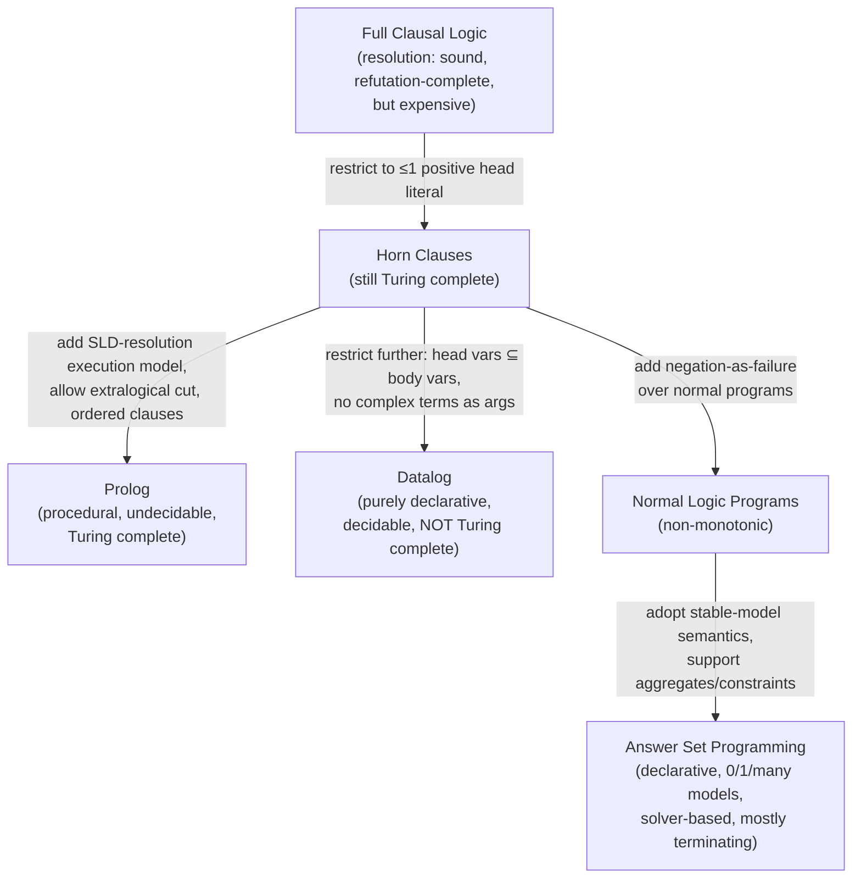
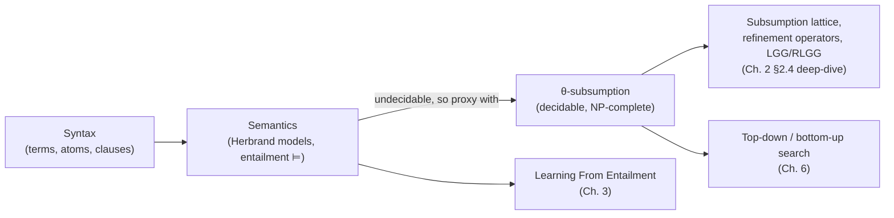

[[book-guidelines|↩ Back to guidelines]]

# Logic Programming Foundations

## Why ILP needs a syntax layer before it needs a learning theory

Everything Cropper & Dumančić do later in this survey — subsumption, refinement
operators, least general generalisation, the whole machinery of searching a
hypothesis space — presupposes that a "hypothesis" and an "example" are the
*same kind of object*: a set of logical clauses. That's a genuinely different
starting point from table-based ML, where a hypothesis (a weight matrix) and
an example (a row) live in different representational worlds and the only
thing connecting them is a loss function. In ILP, background knowledge,
examples, and the hypothesis are *all* logic programs, and the entire learning
problem reduces to a relation between programs — most importantly, "does this
theory prove that fact." Before any of that can be formalised, you need a
precise notion of what a logic program *is* (syntax) and what it *means*
(semantics). That's exactly what Chapter 2 supplies, and it's the chapter
every later chapter silently assumes you've internalised.

There's also a specific engineering payoff buried in this chapter that's easy
to skim past: the authors flag *undecidability* of logical consequence
(entailment) as early as possible, precisely because the rest of the paper's
theory — subsumption — exists as an engineering workaround for that
undecidability. If you're building a theorem-proving or elaboration backend,
this is the same tension you'll hit with definitional equality versus
propositional equality, or with full unification versus Miller's pattern
fragment: the *semantically correct* relation is often undecidable or
expensive, so real systems reach for a *decidable syntactic proxy* that is
sound (usually) but incomplete. Chapter 2 is where ILP draws that line for the
first time, between entailment ($\models$) and subsumption — that pairing is
the whole of Chapter 2's Section 2.4 and gets its own deep-dive as the "θ-Subsumption"
topic; here we build the foundation it stands on.

## 1. Syntax: what a logic program is made of

### The term algebra

The book builds terms bottom-up from three symbol classes:

- **Variables** — uppercase-initial strings (`A`, `B`, `X`).
- **Function symbols** — lowercase-initial strings, each with a fixed arity.
- **Predicate symbols** — also lowercase-initial, also arity-fixed, written
  `p/n` to make the arity explicit (`happy/1`, `append/3`).
- A **constant** is just a function symbol of arity 0 (`alice`, `bob`).
- A **term** is either a variable, or a function symbol of arity $n$ applied to
  a tuple of $n$ terms — so terms are inductively defined, exactly like an
  AST. `age(alice)` is a term (a function symbol `age/1` applied to the term
  `alice`); `age(age(alice))` is too, and nothing stops you from nesting
  arbitrarily.
- A term (or later, an atom or clause) is **ground** if it contains no
  variables — this predicate recurs constantly for the rest of the paper,
  because grounding is what makes Herbrand semantics computable.

**What breaks without arity discipline:** without a fixed arity per symbol,
you couldn't tell `p(a)` and `p(a,b)` apart as "the same predicate, different
uses" versus "two unrelated predicates that happen to share a name" — every
later definition (Herbrand base, unification, subsumption) quietly assumes
arity is a static, checkable property of a symbol, not something you learn at
call time.

**Rust grounding.** This term algebra is *exactly* the shape of a generic AST
enum — the kind you'd write as the term representation of a toy Prolog
interpreter or the intermediate representation for a Horn-clause solver
backend:

```rust
#[derive(Clone, PartialEq, Eq, Hash, Debug)]
enum Term {
    Var(VarId),                     // A, B, X, ...
    // A function symbol applied to n terms; arity = args.len()
    Compound { functor: Symbol, args: Vec<Term> },
}

// A constant is the arity-0 special case, e.g. Term::Compound { functor: "alice", args: vec![] }

fn is_ground(t: &Term) -> bool {
    match t {
        Term::Var(_) => false,
        Term::Compound { args, .. } => args.iter().all(is_ground),
    }
}
```

Note that `is_ground` is structurally identical to any "does this expression
contain a free metavariable" check you'd write over an elaborator's term
representation — same recursion shape as asking whether a type is fully
solved before it can be handed to a trusted kernel.

**Lean correspondence.** Lean's own `Expr` type plays the same role for terms
of the dependently-typed calculus: a free-standing inductive datatype with a
metavariable constructor (`Expr.mvar`) standing in for `Var`, and application
nodes standing in for `Compound`. "Ground" in ILP's sense is the exact analogue
of "metavariable-free" in Lean's elaborator — a term with no `Expr.mvar` left
in it is exactly a term ready to be checked by the trusted kernel, the same
way a ground atom is exactly one ready to be looked up in a Herbrand
interpretation.

### Atoms, literals, and clauses

- An **atom** is $p(t_1,\ldots,t_n)$: a predicate symbol applied to terms.
  Atoms are the "propositions" of the language — `lego_builder(alice)` is an
  atom.
- A **literal** is an atom (a *positive* literal) or its negation `not A` (a
  *negative* literal, using negation-as-failure — see §3 below, this is
  deliberately not classical negation yet).
- A **clause** has the form
  $$h_1,\ldots,h_n \;\mathrel{\text{:-}}\; b_1,\ldots,b_m$$
  where the $h_i$ form the **head** and the $b_j$ form the **body**, and the
  comma denotes conjunction. Read declaratively: "each $h_i$ holds if all the
  $b_j$ hold" — with multiple head literals read disjunctively (the head
  literals are a disjunction, the body literals a conjunction, which is why
  the clause-as-set-of-literals reading in §2.4 works out: a clause is
  logically equivalent to $h_1 \lor \cdots \lor h_n \lor \neg b_1 \lor \cdots
  \lor \neg b_m$).

From this one shape, the paper carves out the restricted sub-languages that
actually get used:

| Restriction | Definition | Why it matters |
|---|---|---|
| **Horn clause** | at most one positive literal in the head | keeps resolution *refutation-complete and sound with a single inference rule* (see §3) |
| **Definite clause** | *exactly* one head literal, $h \mathrel{\text{:-}} b_1,\ldots,b_n$ | the "if body then head" reading is unambiguous; this is what most ILP hypotheses are built from |
| **Unit clause** | a clause with no body | write it without `:-`, e.g. `loves(alice,X)` |
| **Fact** | a *ground* unit clause | `loves(andrew,laura).` — no variables, no conditions |
| **Goal / constraint** | a clause with no head, `:- b_1,\ldots,b_n` | represents "this combination must not hold" |

**What breaks without the Horn restriction:** full clausal logic lets you
write $p(a) \lor p(b)$ — a disjunctive fact that's true without committing to
*which* disjunct holds. That's exactly the kind of statement classical
resolution needs multiple inference rules and case-splitting to handle
efficiently; restricting to Horn clauses is what buys SLD-resolution its
single-rule simplicity (§3), at the direct cost of expressivity — you can no
longer state genuine disjunctive knowledge. Horn logic is still Turing
complete, so this isn't a computational-power sacrifice, just a representational
one.

**Rust grounding**, continuing the AST:

```rust
struct Atom { pred: Symbol, args: Vec<Term> }

enum Literal {
    Pos(Atom),                    // e.g. lego_builder(alice)
    NegAsFailure(Atom),           // not lego_builder(alice)
}

struct Clause { head: Vec<Literal>, body: Vec<Literal> }

impl Clause {
    fn is_horn(&self) -> bool {
        self.head.iter().filter(|l| matches!(l, Literal::Pos(_))).count() <= 1
    }
    fn is_definite(&self) -> bool {
        self.head.len() == 1 && matches!(self.head[0], Literal::Pos(_))
    }
    fn is_fact(&self) -> bool {
        self.body.is_empty() && self.head.len() == 1
    }
}
```

If your compiler project's Horn-clause verification-condition generator
(Hoare triples, `requires`/`ensures`) is going to emit clauses for a CHC
(Constrained Horn Clause) solver downstream, this is literally the target data
[[Language-Bias#Structure|structure]] — a CHC is precisely a definite clause with constraint atoms mixed
into the body.

### Substitution and unification

A **substitution** $\theta = \{v_1/t_1,\ldots,v_n/t_n\}$ simultaneously
replaces variables with terms; applying it is written $C\theta$. A
substitution $\theta$ **unifies** atoms $A$ and $B$ when $A\theta = B\theta$
— note the paper's caveat that $A$ and $B$ must first be made variable-disjoint
(standardised apart) for this to behave correctly, otherwise you can get
spurious "unification" from accidental variable-name collision rather than
genuine structural matching.

This is first-order syntactic unification — no equational theories, no
higher-order patterns, just "make these two term trees identical by
substitution." It's the mechanism every later concept in the paper is built
on top of: subsumption (Chapter 2 §2.4) is unification up to *set inclusion*
rather than equality; SLD-resolution (§3) is repeated unification of a goal
literal against clause heads; Aleph's bottom-clause construction and Metagol's
metarule matching (Chapter 8) are both unification with extra bookkeeping.

**Rust grounding** — the classic occurs-check-free unifier, structurally the
core of any logic-programming or type-inference engine:

```rust
fn unify(a: &Term, b: &Term, subst: &mut HashMap<VarId, Term>) -> bool {
    let a = walk(a, subst);
    let b = walk(b, subst);
    match (&a, &b) {
        (Term::Var(x), Term::Var(y)) if x == y => true,
        (Term::Var(x), _) => { subst.insert(*x, b); true }
        (_, Term::Var(y)) => { subst.insert(*y, a); true }
        (Term::Compound { functor: f, args: xs },
         Term::Compound { functor: g, args: ys }) => {
            f == g && xs.len() == ys.len()
                && xs.iter().zip(ys).all(|(x, y)| unify(x, y, subst))
        }
        _ => false,
    }
}
```

**Lean correspondence — this is the load-bearing one.** First-order
unification here is the direct, simpler ancestor of what Lean's elaborator
does constantly when it solves metavariables. Lean's `isDefEq` is, at its
core, a unification procedure over terms containing metavariables (`?m`)
instead of ILP's logic variables — the same "walk past bound variables,
recurse structurally, bind a variable to a term when one side is a variable"
skeleton, just lifted to a dependently-typed term language with binders,
reduction, and universe constraints layered on top. When your project's
elaborator eventually needs to resolve implicit arguments via metavariable
unification in the Miller pattern-unification fragment, you are writing a
*higher-order, pattern-restricted* version of exactly the `unify` function
above. Seeing the first-order case here, stripped of all type-theoretic
complexity, is the cleanest place to internalize the base algorithm before
layering on binders and dependent types.

**Python sketch**, for the walk-of-a-substitution-chain idea in five lines
where Rust's ownership ceremony would just get in the way:

```python
def walk(t, subst):
    while isinstance(t, Var) and t in subst:
        t = subst[t]
    return t
```

## 2. Semantics: what a logic program means

Syntax alone doesn't tell you what a program *proves*. The paper grounds
meaning in **Herbrand semantics** — a purely syntactic model theory built
entirely out of the program's own symbols, with no external domain needed.

Fix a vocabulary $V$ (all constants, functions, predicates appearing in a
program). Then:

- The **Herbrand universe** is the set of *all ground terms* buildable from
  $V$'s constants and functions. With no function symbols beyond constants,
  it's just the finite set of constants (`{alice, bob, claire, dave}`); add a
  single function symbol like `age/1` and it becomes infinite:
  `{alice, ..., age(alice), age(age(alice)), ...}`.
- The **Herbrand base** is the set of all *ground atoms* buildable from $V$'s
  predicates and the Herbrand universe — every way of applying every predicate
  to every combination of ground terms.
- A **Herbrand interpretation** assigns truth values to every element of the
  Herbrand base, by convention represented just as the *subset* of atoms taken
  to be true (everything else defaults false).
- A **Herbrand model** of a clause set $C$ is an interpretation $I$ such that,
  for every clause $h_1;\ldots;h_n \mathrel{\text{:-}} b_1,\ldots,b_m \in C$
  and every ground substitution $\theta$:
  $$\{b_1\theta,\ldots,b_m\theta\} \subseteq I \implies \{h_1\theta,\ldots,h_n\theta\} \cap I \neq \emptyset$$
  — in words: whenever a ground instance of the body is entirely true in $I$,
  at least one ground instance of the head must also be true in $I$.
- A clause $c$ is a **logical consequence** of a theory $T$ (written $T \models
  c$, read "$T$ entails $c$") if *every* Herbrand model of $T$ is also a model
  of $c$.

**What breaks without fixing the interpretation to Herbrand atoms
specifically:** you could quantify over arbitrary domains and interpretation
functions the way full first-order model theory does, but then "is $I$ a
model of $T$" stops being something you can even enumerate, let alone
compute. Restricting attention to Herbrand interpretations — built purely
from the program's own syntax — is what makes the semantics *checkable* at
all for a fixed (even if infinite) universe; it's the same move as restricting
a type theory's semantics to a syntactic, term-model interpretation instead of
an arbitrary set-theoretic one.

**Worked check from the text.** Given the interpretation
$I = \{\text{happy(alice)}, \text{lego\_builder(alice)}, \text{lego\_builder(bob)},
\text{estate\_agent(claire)}, \text{estate\_agent(dave)}, \text{enjoys\_lego(alice)},
\text{enjoys\_lego(claire)}\}$
and the clause `happy(A):- lego_builder(A), enjoys_lego(A).`, $I$ *is* a
model: the only ground substitution making the body true is $\theta =
\{A/\text{alice}\}$, and `happy(alice)` is indeed in $I$. But $I$ is *not* a
model of `enjoys_lego(A):- estate_agent(A).`, because $\theta = \{A/\text{dave}\}$
makes the body true (`estate_agent(dave)` $\in I$) while `enjoys_lego(dave)`
$\notin I$.

**Rust grounding** — a Herbrand model check is a finite (or bounded)
enumerate-and-verify over ground substitutions:

```rust
fn is_model(interp: &HashSet<GroundAtom>, clause: &Clause, herbrand_universe: &[Term]) -> bool {
    for theta in all_ground_substitutions(clause, herbrand_universe) {
        let body_true = clause.body.iter().all(|l| holds(l, &theta, interp));
        if body_true {
            let head_true = clause.head.iter().any(|l| holds(l, &theta, interp));
            if !head_true { return false; }
        }
    }
    true
}
```

**Why this matters for entailment/undecidability:** checking a *single*
clause set against a *finite* Herbrand universe is decidable model-checking.
But $T \models c$ quantifies over *all* Herbrand models of $T$, and when the
Herbrand universe is infinite (any program with a function symbol), you can no
longer enumerate models to check this universally — that's precisely why
entailment is undecidable in general (a fact the paper attributes to Church,
1936, i.e. it inherits undecidability from first-order logic itself). This is
the semantic fact Chapter 2's final section (§2.4, previewed below) trades
away for a decidable syntactic proxy.

## 3. The logic programming languages built on this base

Full clausal logic is expensive to reason about, so real systems restrict to
fragments. Robinson (1965) showed a *single* inference rule — resolution — is
sound and refutation-complete for clausal logic in general, but Horn
restriction is what makes that rule practically efficient via
**SLD-resolution** (Kowalski & Kuehner, 1971) — Selective Linear Definite-clause
resolution, [[Representative-ILP-Systems#The algorithm|the algorithm]] underlying Prolog's execution model.



- **Prolog** executes via SLD-resolution but layers on *extra-logical*
  features (notably `cut`), which breaks pure declarativeness — a Prolog
  program's clause *order* materially affects both what gets derived and how
  fast, so you have to read it partly procedurally.
- **Datalog** restricts definite clauses further: every head variable must
  also occur in the body (range-restriction), and complex/structured terms as
  arguments are disallowed (no `f(1)`, no lists as such). This buys full
  decidability (finite Herbrand universe by construction) at the cost of
  Turing-completeness — Datalog can't do unbounded recursion over structured
  data. It stays purely declarative, unlike Prolog.
- **Normal logic programs** extend definite clauses with negation-as-failure
  (NAF): $h \mathrel{\text{:-}} b_1,\ldots,b_n, \text{not } b_{n+1}, \ldots,
  \text{not } b_m$ — "the head holds if the positive body literals hold and
  the negative ones can't be proven." This is where the **closed-world
  assumption** (CWA) enters formally: an atom is taken false exactly when it
  cannot be proven true, not merely when it's absent from the knowledge base by
  omission — those are different failure conditions and NAF commits to the
  first.
- **Answer set programming (ASP)** uses **stable model (answer set) semantics**
  (Gelfond & Lifschitz, 1988) on top of normal programs. Unlike a definite
  program (always exactly one least Herbrand model), an ASP program can have
  zero, one, or many answer sets — which is precisely what makes it good for
  *common-sense reasoning* (multiple mutually exclusive consistent worldviews)
  rather than deterministic deduction. ASP solvers search for these models and
  (mostly) terminate, unlike unrestricted Prolog query evaluation which can
  loop forever.

### Monotonicity and why NAF breaks it

A logic is **monotonic** if adding knowledge never removes derivable
consequences. Definite programs are monotonic: adding a clause can only add
derivable facts, never retract one, because deduction from a superset of
clauses is a superset of deductions. **Non-monotonicity** appears the moment
NAF enters the picture, because "not proven true" is a property that can flip
from true to false as the theory grows.

Worked contrast straight from the text:

```
sunny.
happy :- sunny, not weekday.
```
Under CWA, `weekday` cannot be proven, so `not weekday` holds, and we derive
`happy`. Now add:
```
weekday.
```
`weekday` is now provable, so `not weekday` no longer holds — `happy` is no
longer derivable. **Adding knowledge removed a consequence.** That's exactly
the "adding knowledge only adds consequences" property of definite programs
failing, and it's the formal reason normal logic programs need a different
semantics (completion, well-founded, or stable-model) than plain least-model
semantics suffices for definite programs.

**Rust grounding** — the shape of the non-monotonicity check is: evaluating
`not p` requires first attempting (and failing) to prove `p` under the
*current* theory, so the truth of `not p` is a function of the whole theory's
current state, not a local, compositional fact the way `p` itself is under
definite-clause semantics. This is precisely why naive fixpoint evaluation of
NAF needs stratification (mentioned but explicitly not elaborated by the
authors) — you can't just iterate to a least fixpoint the way you can for
definite Horn programs, because "does `not p` hold" depends on a negative
answer that itself depends on the fixpoint you're trying to compute.

## 4. Generality: the chapter's forward pointer

The chapter closes (§2.4) by introducing the **generality order**: $p_1$ is
more general than $p_2$ when every logical consequence of $p_2$ is also a
consequence of $p_1$. Checking this directly via entailment inherits
entailment's undecidability (§2 above). The paper's fix — and the subject of
this book's next deep-dive — is **θ-subsumption** (Plotkin, 1971): treat a
clause as a *set of literals* (a clause's head/body literals under implicit
disjunction/negation, e.g. `happy(A):- lego_builder(A), enjoys_lego(A).`
becomes $\{\text{happy}(A), \neg\text{lego\_builder}(A),
\neg\text{enjoys\_lego}(A)\}$), and define:

> **Definition 1 (Clausal subsumption).** $C_1$ subsumes $C_2$ iff there
> exists a substitution $\theta$ such that $C_1\theta \subseteq C_2$.

This is unification (§1 above) lifted from "make two terms equal" to "make
one clause's literal set a subset of another's" — checking subsumption is
NP-complete (Nienhuys-Cheng & Wolf, 1997) but, crucially, *decidable*, unlike
entailment. That decidability-for-completeness trade is the whole reason
subsumption — not entailment — is what structures ILP's search space in every
later chapter. We leave the full treatment ([[Generality-and-Theta-Subsumption#Weak vs. strong subsumption|weak vs. strong subsumption]], the
subsumption lattice, refinement operators, LGG/RLGG) to the dedicated
θ-subsumption article; here, the point to carry forward is just *why* this
substitution appears at all: it's the same "decidable syntactic proxy for an
undecidable semantic relation" move that recurs throughout automated
reasoning.

## Where this leads



Every later chapter of the paper spends this chapter's capital: Chapter 3's
formal ILP problem (learning from entailment vs. interpretations) is stated
directly in terms of $\models$ from §2.2; Chapter 4's choice of representation
language (normal programs, ASP, higher-order programs) is a choice of *which*
fragment from §2.3 to hypothesize in; and the entire search machinery of
Chapters 5–8 (mode declarations, metarules, bottom-clause construction,
Metagol's meta-interpretation) is organized by the subsumption order
introduced in §2.4.

For this project's **Automated Reasoning** focus area specifically: the
unification procedure in §1 is the direct, simplified ancestor of the
metavariable unifier your elaborator needs (Miller's pattern-unification
fragment is a *higher-order, syntactically restricted* unification problem —
seeing first-order unification cleanly here, before binders and dependent
types complicate it, is worth internalizing on its own). The
entailment-versus-subsumption tension in §2.4 is the same shape of problem
you'll face when deciding how much of your theorem prover's proof search can
rely on a decidable syntactic check (clause matching, e-graph congruence) versus
when it must fall back to something semantically complete but expensive. And
Datalog's decidability-for-expressivity trade (§2.3) is worth keeping in mind
if any part of the CSP/Horn-clause kernel ends up wanting a guaranteed-terminating
fragment for a sub-problem, the way CHC solvers restrict to definite clauses
over a background theory rather than full first-order logic.
