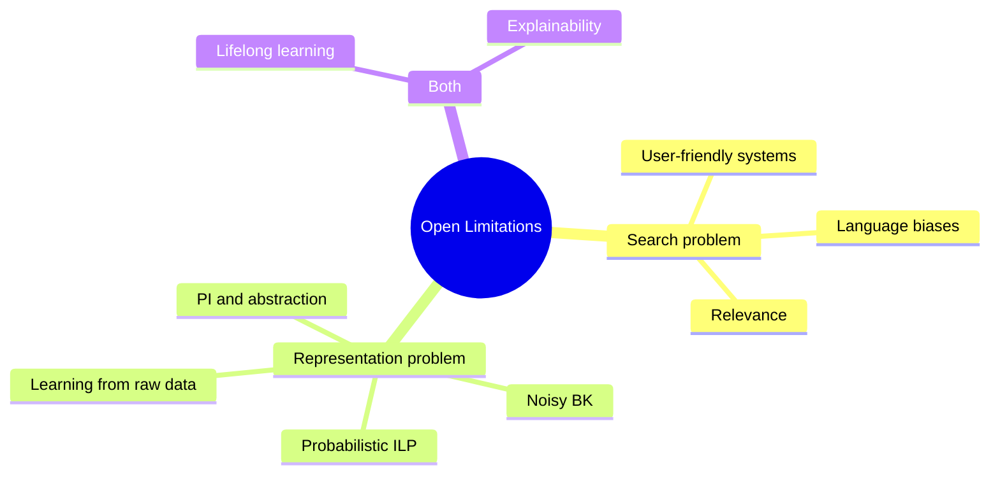

# Open Limitations and Future Directions

[[book-guidelines|↩ Back to guidelines]]

## Why the survey ends here

A survey paper earns the right to close with a limitations section only if it has
actually built the machinery those limitations bear on. By this point the paper has
walked through $\theta$-subsumption as the syntactic stand-in for entailment, the four
design choices behind any ILP system, and the field's flagship recent advance —
[[Predicate-Invention|predicate invention]] (PI) — as a mechanism for changing a problem's representation
rather than just searching harder within a fixed one. Section 9 is Cropper and
Dumančić stepping back from "how ILP works" to "why ILP still isn't everywhere it
should be." That's a different kind of claim than anything earlier in the paper: it's
not a definition or a decidability result, it's an engineering and research diagnosis,
and it's worth reading that way — as a punch list, not a theorem.

The chapter opens by crediting Muggleton et al. (2012), a decade-earlier survey, with
correctly anticipating some of what has since happened (PI, higher-order representations,
new application domains). Then it catalogues eight things that *haven't* been fixed.
The authors' own framing, echoed in the guidelines' Key Question 2, splits these eight
roughly into two families: problems about **search** (how you find a hypothesis at all)
and problems about **representation** (what the hypothesis, the background knowledge,
or the examples are allowed to look like). That split is worth holding onto as you read
each limitation below — it's the same axis that organizes the whole paper (language
bias and search method vs. representation language and background knowledge), just
now applied to what's still broken rather than what's been solved.



Lifelong learning and explainability don't sit cleanly in either bucket — lifelong
learning is a search problem (how do you avoid re-searching from scratch) wrapped
around a representation problem (how do you represent what you've already learned so
it stays useful), and explainability is really a claim *about* the representation
(symbolic, therefore inspectable) that the field hasn't yet operationalized rigorously.

## 1. User-friendly systems — a search-usability problem

**The problem, from first principles.** Over 100 ILP systems have been built since
1991, but the paper's blunt claim is that fewer than a handful are usable by anyone
who isn't already an ILP researcher. The root cause isn't that the underlying theory
is hard to use — it's that every system exposes *its own* dialect of [[Language-Bias|language bias]].
Progol, Aleph, TILDE, and ILASP all use mode declarations, but specify a learning task
in visibly different syntax. There's no shared surface language the way SQL is a
(mostly) shared surface for relational databases.

**What breaks without it.** A field can have arbitrarily elegant foundations
($\theta$-subsumption, LGG, the subsumption lattice) and still fail to be adopted if
every new user has to relearn a bespoke configuration format before they can pose a
single query. This is the same failure mode compiler tooling avoids by converging on
shared IRs and package formats — theoretical soundness doesn't substitute for a stable
interface.

This limitation is mostly a tooling/engineering gap rather than a theoretical one, so
it doesn't carry a natural Rust/Lean grounding beyond the general observation: a
Rust-based verifier toolchain earns exactly this kind of adoption risk if its
constraint-specification surface (Hoare-triple syntax, refinement annotations) isn't
stable and uniform across whatever front-ends eventually sit on top of it.

## 2. Language biases — a search problem, stated precisely

**The problem.** This is the sharpest limitation in the chapter, and it's really a
restatement of the Blumer-bound tension from earlier in the paper (Chapter 5): a
language bias that's too weak makes the hypothesis space intractably large; one that's
too strong excludes the target hypothesis entirely. What Section 9 adds is an empirical
observation: getting the bias *right* is brittle in practice. Metagol needs the right
metarules or it's "almost useless." Mode-based systems need argument types and recall
bounds tuned correctly, and a single wrong argument type (input vs. output) can sink
the search. Today this tuning is done by a human, through trial and error, on a
per-task basis.

**What breaks without it.** Without automatic bias identification, ILP's generality is
undercut by a hidden precondition: "this works, provided you already know roughly what
the answer's shape should look like." That's a real tension — the whole point of
induction is to discover [[Language-Bias#Structure|structure]] you don't already know.

**Grounding.** This maps almost exactly onto a tension your elaborator's implicit-argument
resolution will face. A metavariable unifier restricted to Miller's pattern-unification
fragment is *itself* a language bias — a deliberately weakened unification procedure,
chosen because full higher-order unification is undecidable, in exchange for
decidability and a unique most-general solution. The ILP lesson generalizes: any time
you restrict a search space (unification patterns, refinement operators, mode
declarations) for tractability, you inherit the same two-sided risk — too permissive
and the search explodes, too restrictive and legitimate solutions become unreachable.
A sketch of the trade-off as a typestate-flavored search configuration in Rust:

```rust
/// A search "bias" is a compile-time-ish contract on what the solver is
/// even allowed to consider — exactly analogous to an ILP mode declaration
/// or a metarule set restricting the hypothesis space.
struct SearchBias {
    max_depth: usize,          // like Aleph's clause-length bound
    allowed_patterns: Vec<UnificationPattern>, // like Metagol's metarules
}

enum UnificationPattern {
    /// Miller's pattern fragment: metavariable applied only to
    /// distinct bound variables. Tractable, unique solutions.
    PatternFragment,
    /// Full higher-order unification: expressive, but undecidable
    /// in general — the "too weak a bias" failure mode.
    FullHigherOrder,
}
```

Too narrow a `SearchBias` (patterns only, shallow depth) and legitimate implicit
arguments fail to resolve; too permissive and the elaborator's unifier stops
terminating predictably. Automating *this* choice — the way the paper wishes ILP could
automate mode/metarule discovery — is itself an open research question in elaborator
design, not just in ILP.

## 3. PI and abstraction — toward human-level AI

**The problem.** Russell (2019) is cited for the claim that inventing new high-level
concepts is *the* bottleneck for human-level AI, and predicate invention is ILP's
mechanism for doing exactly that. The chapter's worked illustration is inductive
general game playing: learning the rules of Connect Four from raw gameplay observations.
The reference solutions define the game in terms of auxiliary predicates — lines,
built from rows, columns, and diagonals — that aren't strictly necessary to express the
target concept but shrink the solution by orders of magnitude, which is precisely what
makes it learnable at all. Current PI methods, per the chapter, aren't yet powerful
enough to reach that level of abstraction on the IGGP benchmark.

**What breaks without it.** Without good abstractions, a learner is stuck expressing
everything in terms of primitive predicates, and program size (and therefore search
cost) blows up combinatorially. This is the ILP analogue of a familiar fact from type
theory: the right auxiliary definitions (a well-chosen inductive type, a helper lemma)
don't just make a proof or program shorter — they make it *findable*.

**Grounding.** This is the clearest connection in the chapter back to the compiler
project's Type Theory focus area. Predicate invention is structurally the same move as
introducing an auxiliary inductive type or a derived judgment form: both are acts of
re-representation that trade "more symbols to define up front" for "a dramatically
smaller search space afterward." In Lean, this is the everyday discipline of factoring
a proof through an auxiliary lemma rather than inlining it — the lemma is an invented
"predicate" in exactly ILP's sense, chosen because it compresses what comes after it.
The open question the chapter poses (*when* to invent, *what* to invent, *how to judge
quality* — Kramer's three difficulties, referenced back to Chapter 7) is the same
open question facing an automated theorem prover that would need to invent its own
intermediate lemmas rather than rely on a human to supply them.

## 4. Lifelong learning — reuse across tasks

**The problem.** Because ILP hypotheses are symbolic clauses, they can be stored back
into the background knowledge and reused on later, related problems — unlike a
statistical model's opaque weights. This is a structural advantage for lifelong,
multi-task, and transfer learning. But the chapter's own example (Lin et al., 2014,
learning 17 string-transformation programs incrementally) tops out at a handful of
tasks; scaling to the thousands or millions of concepts that "human-level AI" would
require runs straight into the too-much-background-knowledge problem from Chapter 4:
ILP systems already struggle when background knowledge is large. Pile up learned
programs indefinitely and you get **catastrophic remembering** (Cropper, 2020) — not
forgetting too much, but failing to forget the knowledge that has stopped being useful,
so the search space keeps growing with every task learned.

**What breaks without it.** A learner that can't prune what it knows eventually pays an
ever-larger tax on every new problem, in direct tension with induction's whole promise
of getting more capable with experience, not less efficient.

## 5. Relevance — the bottleneck behind lifelong learning

**The problem.** The chapter is explicit that catastrophic remembering *is* a relevance
problem in disguise: given a large pool of background knowledge, which parts of it
actually bear on the current task? Neural relevance-scoring approaches (Balog et al.,
2017; Ellis et al., 2018) are cited as an emerging but empirically unproven partial
answer, and one that hasn't been shown to scale past small BK.

**Why relevance is the crux.** This is the paper's own answer to Key Question 1 in the
guidelines: relevance matters specifically for *lifelong* learning, not single-task
ILP, because a single-task system is handed a fixed, presumably-relevant BK by
construction — the relevance-filtering problem doesn't exist until you accumulate BK
across tasks and have to decide, per new task, which of it still applies.

**Grounding (loose, not forced).** There's a thin but real echo of this in context and
scope management for a growing proof/elaboration environment: an elaborator or trusted
kernel accumulating lemmas and definitions across a long development session faces its
own version of "which of these thousands of facts are actually relevant to resolving
this metavariable" — closer to a search-heuristic problem than to definitional
equality itself, so treat the connection as directional rather than load-bearing.

## 6. Noisy background knowledge

**The problem.** Most ILP systems assume the BK they're given is noiseless — a
relation is simply true or false. But under lifelong learning, the BK increasingly
consists of *previously induced* programs, and induction offers no correctness
guarantee. Stack enough noisy inferences on top of each other and the system risks
building on an incoherent foundation. $\partial$ILP's differentiable, fuzzy-tolerant
approach to entailment (introduced earlier, Chapter 7 §5.1) is flagged as a promising
but still narrow answer — it doesn't generalize to the full range of ILP settings.

**What breaks without it.** The paper is describing something closely analogous to
error accumulation in any pipeline of successive, non-independently-verified
derivations: without a way to track or bound uncertainty through each stage, later
stages inherit and compound earlier mistakes silently.

## 7. Probabilistic ILP

**The problem.** A more principled fix for noisy BK than "hope it doesn't compound" is
to unify logic programming with probabilistic reasoning — the StarAI (statistical
relational AI) program the chapter surveyed in the preceding section (§8.2). Problog
extends Prolog with **probabilistic facts** (a fact holds with probability $p$, e.g.
`0.01::earthquake(naples)`) and **annotated disjunctions** (mutually exclusive head
literals, each with its own probability, e.g. a ball being green, red, or blue with
probability $\tfrac13$ each). But StarAI systems mostly do *parameter* learning
(fitting probabilities for a fixed program structure); *inducing* probabilistic logic
programs — learning structure and parameters together — remains almost unexplored,
per the chapter, "as inference remains the main challenge."

**Why this is hard, from first principles.** Ordinary ILP's generality order
($\theta$-subsumption) is a crisp syntactic test: one clause subsumes another, full
stop. Once you attach probabilities to facts and clauses, "does hypothesis $H$ explain
example $e$" stops being a yes/no membership question and becomes a question about a
distribution over possible worlds — which is exactly why inference (not just search)
becomes the bottleneck: evaluating a single candidate hypothesis is now itself
computationally expensive, before you've even searched over many candidates.

## 8. Explainability and ultra-strong machine learning

**The problem.** ILP's headline advantage over statistical ML is that its hypotheses
are symbolic and therefore, in principle, human-readable. The chapter cites Michie's
(1988) framework of **ultra-strong ML**: a bar higher than mere predictive accuracy,
where a learned hypothesis must demonstrably *improve a human's own performance* once
they've seen it. Muggleton et al. (2018) show this empirically for some tasks, but the
chapter is careful to flag that the *conditions* under which readability translates
into genuine human understanding are still poorly characterized — especially as
predicate-invention-heavy hypotheses become less directly traceable to primitive,
human-familiar predicates.

**What breaks without it.** "Symbolic, therefore explainable" is a claim that can
quietly stop being true exactly when PI is working best — a hypothesis built from
several layers of invented predicates can be just as opaque as a neural network's
weights unless each invented predicate is itself independently meaningful. This is a
genuine tension between limitations 3 and 8: the field's best tool for compressing
hypothesis size (PI) is also the thing most likely to erode the readability that
motivated using ILP in the first place. A trusted kernel built around a proof term is
in an analogous position: proof-term *validity* (the kernel accepts it) and proof-term
*comprehensibility* (a human can follow why it's valid) are different properties, and
optimizing search for the former gives no guarantee about the latter.

## 9. Learning from raw sensory data

**The problem.** ILP systems expect input already translated into symbolic form.
Real-world data — images, speech — isn't naturally symbolic, so today's systems rely
on a separate neural front-end to do that translation before ILP ever sees the
problem. The chapter's own example: learning addition over MNIST digit images requires
either hand-supplying symbolic digit labels as BK, or training a separate recogniser
first — the perception problem and the program-induction problem are solved
sequentially, not jointly. A handful of systems (Manhaeve et al., 2018; Dai et al.,
2019; Evans et al., 2021; Dai & Muggleton, 2021) have started tackling joint
perception-plus-induction, but the chapter calls a general solution "perhaps the
biggest challenge in ILP."

**What breaks without it.** Treating perception and symbolic induction as two
disconnected stages means errors in the first stage (misclassified digits) are opaque
noise to the second stage, which — per limitation 6 — most ILP systems aren't
equipped to tolerate in the first place. The perception and induction problems are
coupled in reality even though current systems decouple them by necessity.

## Where this leads

Section 9 doesn't introduce new formal machinery — no new definitions, no new theorem.
Its role in the paper's structure is to convert everything built in Chapters 2–8
($\theta$-subsumption, the four design choices, PI, the four case-study systems) into a
forward-looking research agenda, and to be explicit that ILP's core theoretical
foundation (decidable syntactic generality via subsumption) is not itself in question —
what's unresolved is almost entirely about *usability*, *scale*, and *interfacing with
uncertainty and raw data*, not about the soundness of the subsumption-based framework
this paper spent its first eight sections building.

For the standing project, this chapter is largely **orthogonal survey material** rather
than a direct prerequisite — as the book's own `.learning-goals.md` notes, it doesn't
map cleanly onto any single Focus Area. The two genuine connections worth carrying
forward are: (1) the **language-bias / search-bias trade-off** (limitation 2) is the
same shape of problem as bounding a metavariable unifier to a decidable fragment
(`type-theory`, and the unification/pattern-unification thread under
`automated-reasoning`) — both are instances of "restrict the search space for
tractability, at the risk of excluding the true solution"; and (2) **predicate
invention as abstraction** (limitation 3) is the clearest structural cousin of
introducing auxiliary lemmas or inductive types in a proof/elaboration pipeline
(`type-theory`) — both are re-representation moves justified purely by the search-space
compression they buy afterward. The remaining limitations (tooling, lifelong learning,
noisy BK, probabilistic ILP, explainability, raw-data learning) are worth knowing as
context for how the *broader* symbolic-AI field currently self-assesses, but the
skill's "don't force it" rule applies to the rest: they don't bear directly enough on
the compiler/elaborator/CSP-kernel targets to warrant a stretched connection here.
