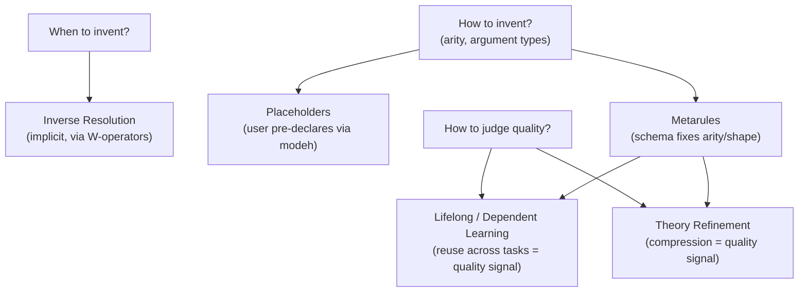

# Predicate Invention

[[book-guidelines|↩ Back to guidelines]]

## The problem: what if the vocabulary you were given isn't enough?

Every ILP problem so far in the paper has quietly assumed that the background knowledge (BK) a user supplies is *sufficient* — that somewhere in the space of clauses over the given predicate symbols, a correct hypothesis exists. That assumption is often false. Consider the paper's own running example: learning quicksort. To express quicksort at all, a learner needs to partition a list around a pivot and append two sublists back together. If `partition/4` and `append/3` are not already sitting in BK, no amount of clever search over the *given* vocabulary will ever produce a working quicksort — the target concept is not expressible in the language the learner has been handed.

**What breaks without predicate invention (PI):** a learner without PI is stuck choosing between two bad options — either the user manually anticipates every auxiliary relation the target concept might need (which defeats much of the point of automating hypothesis search), or the learner is limited to whatever concepts happen to be directly expressible over the given BK, however large and awkward the resulting clause has to be. PI is the mechanism that removes this constraint: it lets the system *introduce new predicate symbols* — symbols that appear in neither the examples nor the BK — and simultaneously learn definitions for them, as part of the same search that learns the target predicate.

This is the direct logic-programming analogue of a very ordinary act in software engineering: refactoring a large function into a helper function to reduce duplication or improve readability. That framing matters for grounding the mechanism, so keep it in mind throughout.

## The canonical example: inventing `parent`

The paper's standard illustration is learning `grandparent/2` from only `mother/2` and `father/2` — no `parent` relation provided. Without PI, the only correct program available is the one that fully expands every parent-lineage combination:

```prolog
grandparent(A,B):- mother(A,C),mother(C,B).
grandparent(A,B):- mother(A,C),father(C,B).
grandparent(A,B):- father(A,C),mother(C,B).
grandparent(A,B):- father(A,C),father(C,B).
```

Four clauses, twelve literals. With PI, a system can instead learn:

```prolog
grandparent(A,B):- inv(A,C),inv(C,B).
inv(A,B):- mother(A,B).
inv(A,B):- father(A,B).
```

The system has invented a fresh symbol `inv/2`, given it exactly the two definitions that make the whole program equivalent (in the specific sense of "same logical consequences for `grandparent`" — the paper is careful to flag that full logical equivalence is a subtler claim once you've changed vocabulary) to the four-clause version. Rename `inv` to `parent` and you get back the concept a human would have written by hand. The paper's point is not "PI discovers meaningful names" — it discovers *the shape*, and the name `parent` is a post-hoc human reading. What PI actually buys is compression: fewer clauses, fewer literals, and (empirically, per Dumančić & Blockeel 2017, Cropper 2019, and related work cited in the paper) lower sample complexity and better predictive accuracy, because most systems' search degrades badly on large programs.

**A sharper illustration — higher-order abstraction.** The paper pushes this further with `droplasts`, a program that removes the last element from every sublist of a list of lists (e.g. `[alice,bob,carol] ↦ [alic,bo,caro]`). Metagol$_{HO}$ (the higher-order variant of Metagol) learns:

```prolog
droplasts(A,B):- map(A,B,droplasts1).
droplasts1(A,B):- reverse(A,C),tail(C,D),reverse(D,B).
```

Here the invented symbol `droplasts1` is used *twice in two different syntactic roles* — once as a first-class **term** (an argument to `map/3`, naming which predicate to apply to each list element) and once as an ordinary **predicate symbol** being defined and called. This is only possible in a higher-order representation where predicate symbols can be passed as data. The payoff is that `map` absorbs the recursive traversal implicitly, so the learner never needs to induce an explicitly recursive definition of `droplasts` itself — recursion is borrowed from `map`'s own (given) definition. Extending to `ddroplasts` (also drop the last *sublist*) reuses the invented `ddroplasts1` predicate a second time, illustrating that invented predicates are not one-off scaffolding — they become reusable building blocks within a single hypothesis, the same way a helper function gets called from more than one place.

## Why PI is hard: Kramer's three questions

Most early PI systems failed. Kramer (1995), as the paper reports, identifies exactly why PI resists a clean algorithmic treatment — three separate open sub-problems bundled inside "just invent a predicate":

1. **When should you invent a new symbol?** There must be some principled trigger; inventing predicates unconditionally at every search step would explode the hypothesis space without bound.
2. **How should you invent it?** What arity? What argument types? This is itself a search problem nested inside the outer hypothesis search.
3. **How do you judge the quality of an invented symbol?** When do you keep it versus discard it as noise-fitting rather than genuine [[Language-Bias#Structure|structure]]?

Every PI technique the paper surveys is best read as a specific *design choice* that answers one or more of these three questions by construction, rather than by search. That framing is the organizing thread for the rest of this article.



## Inverse resolution: PI as the original idea, and its limits

The historically first approach (Muggleton & Buntine, 1988) treats PI as the *inverse* of SLD-resolution — where resolution combines two clauses into one by eliminating a literal, inverse resolution ("W-operators") runs that combination step backwards to synthesize a new predicate that would justify the observed examples. The paper explicitly declines to go into the mechanics (deferring to Nienhuys-Cheng & Wolf, 1997, and De Raedt, 2008), and reports the honest verdict on this line of work: it never achieved completeness, largely because there was no declarative bias mechanism (recall [[Building-an-ILP-System|language bias]] from Chapter 5) to keep the search over possible inversions bounded. This is a recurring theme worth internalizing early: an *unconstrained* generative mechanism for new predicates is not by itself a working PI system — you additionally need something that plays the role a metarule or mode declaration plays elsewhere in the paper, cutting the search space down to something tractable.

## Placeholders: pin down the shape in advance

Leban et al. (2008) ("placeholders") and Law (2018) ("prescriptive PI") sidestep Kramer's question 2 by refusing to search over it: the user pre-declares the invented predicate's arity and argument types via an ordinary mode declaration, e.g.

```prolog
modeh(1,inv(person,person)).
```

This is a direct reuse of the [[Building-an-ILP-System|mode-declaration machinery]] from [[Language-Bias|language bias]] — the invented symbol is treated exactly like any other predicate that needs a `modeh`/`modeb` bias, except its *definition* is what gets learned rather than assumed. The honesty of this approach is also its weakness: it requires the user to already know the shape of the concept they're asking the system to discover, "which rather defeats the point" (the paper's own phrasing), or else forces enumerating every plausible invented predicate up front — computationally expensive, and exactly the kind of combinatorial blowup mode declarations exist to prevent everywhere else in the paper.

## Metarule-driven PI: Metagol's answer

Metagol resolves Kramer's questions 1 and 2 together by reusing the metarule machinery from [[Building-an-ILP-System|language bias]] (§4.4.2). Recall the chain metarule:

$$P(A,B) \leftarrow Q(A,C), R(C,B)$$

Ordinarily this metarule instantiates $P$, $Q$, $R$ against *existing* predicate symbols. PI is what happens when Metagol's proof search runs out of existing symbols to bind $Q$ or $R$ to and instead **invents a fresh symbol** to fill the slot, then recursively searches for *that* symbol's own definition using the same metarule set. For example, to drop the first three elements of a list using only a metarule that drops two:

```prolog
f(A,B):- tail(A,C),inv(C,B).
inv(A,B):- tail(A,C),tail(C,B).
```

This answers question 1 (*when to invent*) implicitly: invention happens exactly when proof search would otherwise fail to close a branch using only given symbols — invention is a controlled fallback within an otherwise ordinary SLD-style proof search, not a separate generative phase. It answers question 2 (*how*) because the metarule itself fixes the invented predicate's arity and the shape of its recursive calls — there is no separate search over "what could this predicate look like," only "does this schema, instantiated with a fresh symbol, let the proof go through." A side effect worth naming explicitly: this forces problems to decompose into smaller sub-problems, because each metarule application can only combine two existing (possibly invented) relations at a time — inventing `inv` to drop four elements

```prolog
f(A,B):- inv(A,C),inv(C,B).
inv(A,B):- tail(A,C),tail(C,B).
```

reuses the *same* invented symbol twice, echoing the reuse pattern seen above in `droplasts`/`ddroplasts`.

## Lifelong and dependent learning: PI across tasks, not within one

The techniques above operate on a single task. Lin et al. (2014) extend PI across a *sequence* of tasks via **dependent learning**: given, say, 17 string-transformation tasks, the learner starts with a very strong bias (only one rule allowed per solution), solves whatever tasks are solvable under that bias, then progressively relaxes the bias — but crucially, every time a task is solved, *both* the target predicate *and* its invented sub-predicates are folded back into BK for subsequent tasks. This is PI's answer to Kramer's question 3 (*quality*) delivered empirically rather than by inspection: an invented predicate's quality is measured by whether later tasks actually reuse it. The paper's Figure 4 (reproduced conceptually below) shows this as a dependency graph — solving task 3 reuses the solution to task 12, which reuses task 17, which reuses task 15, and three tasks (4, 5, 16) are unsolvable *at all* under the independent (non-reusing) baseline but solvable once dependent PI is in play. This is the clearest empirical evidence in the section that PI is not merely a compression trick — for some targets it's the difference between "learnable" and "not learnable" given a fixed example budget.

## Theory refinement: PI as compression after the fact

The last family the paper covers applies PI *after* a program already exists, to restructure it:

- **Theory revision** (Adé et al., 1994; Richards & Mooney, 1995) edits a program so it stops entailing wrong answers or starts entailing missing ones — this is closer to debugging than to PI proper, but shares the toolkit.
- **Theory compression** (De Raedt et al., 2008) drops clauses whose removal barely hurts performance on held-out examples — a minimum-description-length flavored move.
- **Theory restructuring** (Flach, 1993; Wrobel, 1996) is the one that actually invents predicates: it changes a program's shape (not its extension) to improve execution or readability.

Two recent instances of restructuring make this concrete:

- **Auto-encoding logic programs (ALPs)** (Dumančić et al., 2019) learn an *encoder* program that maps given interpretations into new interpretations expressed purely over invented predicates, and a *decoder* that reconstructs the originals. This is a genuine structural analogue of a neural autoencoder — compress through a bottleneck defined by the invented vocabulary, and the bottleneck's structure *is* the discovered predicates. The paper reports this pays off downstream: learning from the ALP-invented representation improves the accuracy of generative Markov logic networks trained afterward.
- **Knorf** (Dumancic et al., 2021) pushes further: after solving a batch of tasks in the lifelong [[Representative-ILP-Systems#Setting|setting]], it revises and compresses the accumulated invented predicates to shrink the whole BK — reported to cut literal counts by 50% or more, with knock-on improvement to Metagol's subsequent task-solving rate, especially as BK grows large.

## Synthesis: how the pieces fit together, and where this bears on the compiler project

Structurally, every PI technique in this section is a specific way of constraining an otherwise unconstrained "invent a new relation symbol" move, the same way mode declarations and metarules constrain the ordinary hypothesis space in [[Building-an-ILP-System|language bias]] — PI is not a separate mechanism bolted onto ILP search, it's the *same* search machinery (refinement, metarule instantiation, ASP-style optimisation) applied to a vocabulary that is allowed to grow mid-search rather than stay fixed.

This is directly load-bearing for the `automated-reasoning` focus area of your compiler/elaborator project. Predicate invention is ILP's version of a problem your elaborator will face in a different guise: when the given vocabulary (existing lemmas, existing type-class instances, existing helper definitions) is insufficient to close a proof obligation or discharge a verification condition, something has to decide whether to *synthesize new structure* — a new auxiliary lemma, a new invented refinement predicate, a new intermediate abstraction in a Horn-clause chain — rather than search harder over what already exists. Kramer's three questions transfer almost verbatim: *when* should your Horn-clause-based invariant generator introduce a new auxiliary predicate in a CHC system rather than trying to express an invariant directly (this is precisely the role played by "predicate abstraction" refinement loops in CEGAR-style model checking, connecting straight to your `static-analysis` and `sat-smt-csp` focus areas); *how* should its arity and argument types be fixed (metarule-style schemas are the ILP analogue of the type-directed synthesis templates a bidirectional elaborator would use); and *how* do you judge whether an invented predicate is worth keeping (theory compression's minimum-description-length framing is the same criterion a proof-term reconstruction pass would want when deciding whether an intermediate lemma is genuinely reusable or just noise). The metarule-driven answer in particular — fix the *shape* of what can be invented via a small schema, then let proof search fill in the specifics — is a direct precedent for how a constrained synthesis procedure inside your CSP/Horn-clause invariant generator could stay decidable rather than degenerating into unbounded second-order search.

**[[Applications-of-ILP#Where this leads|Where this leads]].** Within the paper's own structure, predicate invention is what makes the systems studied next (§6) — especially Metagol, but also higher-order variants like Metagol$_{HO}$ — able to learn programs (like `quicksort`, or `droplasts`/`ddroplasts`) that are simply inexpressible in a fixed first-order vocabulary. It is also flagged in the paper's closing limitations chapter as one of the two developments (alongside recursion) most responsible for the field's renewed relevance, and Russell (2019) is cited for the claim that PI-like abstraction may be a necessary step toward human-level AI — a claim the paper is careful to relay rather than assert.
