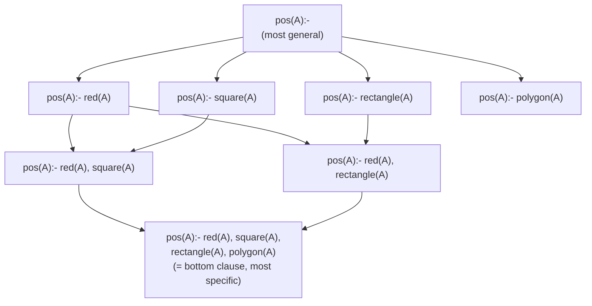
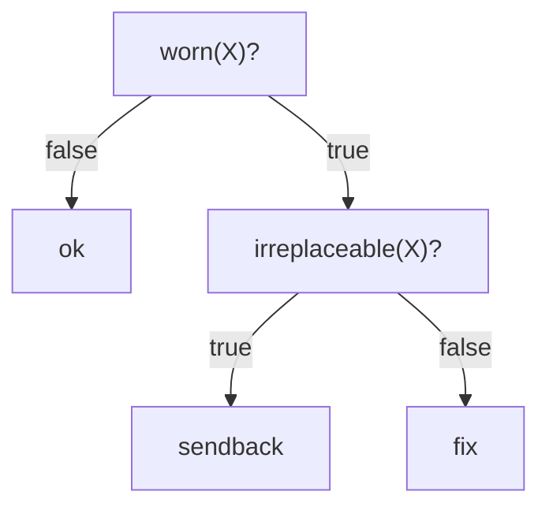

# Representative ILP Systems

[[book-guidelines|↩ Back to guidelines]]

## Why case studies, and why these four

Every earlier chapter in this survey was abstract machinery: a generality order ([[Generality-and-Theta-Subsumption]]), a menu of representation choices ([[Building-an-ILP-System]]), a way to restrict the hypothesis space ([[Language-Bias]]), a family of ways to search it ([[Search-Methods-Over-the-Hypothesis-Space]]). None of that machinery, on its own, tells you what a *runnable system* looks like — how the four design choices actually compose into an algorithm you could implement this afternoon. This chapter closes that gap by walking through four systems end to end: **Aleph**, **TILDE**, **ASPAL**, and **Metagol**. The book is explicit that these were not chosen as "the best" or "the most popular" systems — they were chosen because they are *maximally distinct* illustrations of the design space, and "relatively simple to explain":

- **Aleph** — inverse entailment, bottom-up-bounded top-down search, learning from entailment.
- **TILDE** — a first-order generalisation of decision trees, learning from interpretations.
- **ASPAL** — meta-level search: the entire ILP problem re-encoded as an Answer Set Programming (ASP) problem.
- **Metagol** — Prolog meta-interpretation, proof search as program induction.

Read as a set, they form a deliberate 2×2: two learning-from-entailment systems (Aleph, Metagol) and one learning-from-interpretations system (TILDE), plus one that reformulates the search itself as a different kind of problem entirely (ASPAL). If you've been tracking the four design choices, each system below is best read as *one concrete answer to all four simultaneously* — what follows is the resolution of "and how does that actually cash out?"

## Aleph: inverse entailment and bottom clause construction

**What problem this solves.** Learning-from-entailment (LFE) hypotheses live in a space that is, in principle, unbounded — nothing stops a clause from having arbitrarily many literals or arbitrarily many variables. A system doing top-down refinement (start general, specialise) needs *some* lower bound on how far to specialise, or it never terminates. Aleph's answer — inherited from its predecessor **Progol** (Muggleton, 1995) — is to compute, for each example, the single most specific clause that could possibly explain it, and then search only the (finite) region of the lattice between that clause and the most general one.

### Setting

Aleph's problem setting is a direct instance of [[ILP-Problem-Formulations|learning from entailment]]:

**Given:** mode declarations $M$, background knowledge $B$ (a normal program), positive examples $E^+$ and negative examples $E^-$ (ground facts).

**Return:** a normal program hypothesis $H$ such that $H$ is consistent with $M$, $\forall e \in E^+,\ H \cup B \models e$ (complete), and $\forall e \in E^-,\ H \cup B \not\models e$ (consistent).

### The algorithm

Aleph is a **covering algorithm**: it builds a multi-clause hypothesis one clause at a time, removing whatever positive examples that clause now explains, and repeating.

1. Pick an uncovered positive example. If none remain, stop and return $H$.
2. Construct the **bottom clause** — the most specific clause, consistent with the mode declarations, that entails the example.
3. Search for the best-scoring clause more general than the bottom clause.
4. Add that clause to $H$; remove the positive examples it now covers; go to 1.

### Bottom clause construction — the formal definition

> **Definition 4 (Bottom clause).** Let $H$ be a clausal hypothesis and $C$ a clause. The bottom clause $\bot(C)$ is the most specific clause such that $H \cup \bot(C) \models C$.

**What breaks without it:** without a bottom clause, "most specific clause consistent with mode declarations" is, in the worst case, infinite — you could keep adding literals to a clause's body forever and each addition still keeps the clause "consistent" with the modes. The bottom clause caps this by construction: it contains only the literals that are *actually reachable* from the example via the background knowledge, closed under mode-legal chaining. Everything Aleph searches afterward is a generalisation of this one concrete object, which is what turns an unbounded space into a finite lattice.

**[[Generality-and-Theta-Subsumption#Worked example|Worked example]] (De Raedt, 2008, as reproduced in the paper).** Given modes for `pos/1`, `red/1`, `blue/1`, `square/1`, `triangle/1`, `polygon/1` (all with `+shape` — variablised, no constants), background knowledge

$$
B = \{\, \mathrm{red}(s_1),\ \mathrm{blue}(s_2),\ \mathrm{square}(s_1),\ \mathrm{triangle}(s_2),\ \mathrm{polygon}(A){:-}\mathrm{rectangle}(A),\ \mathrm{rectangle}(A){:-}\mathrm{square}(A) \,\}
$$

and positive example $e = \mathrm{pos}(s_1)$, the bottom clause is:

$$
\bot(e) = \mathrm{pos}(A) {:-} \mathrm{red}(A), \mathrm{square}(A), \mathrm{rectangle}(A), \mathrm{polygon}(A).
$$

Notice what's *not* here: `blue` and `triangle` hold facts about $s_2$, not $s_1$, so they're simply irrelevant to this example and never enter $\bot(e)$ — the bottom clause is example-specific, not global. Notice also what *is* here but wasn't given directly: `rectangle(A)` and `polygon(A)` are derived by one step of resolution against $B$'s rules, because mode-legal chaining licenses following `square(A)` into `rectangle(A)` into `polygon(A)`. Had the mode declaration used a `#shape` (ground) argument instead of `+shape` (variable input), the bottom clause would additionally have contained the constant-instantiated literal `polygon(s1)` — mode declarations don't just gate *which* predicates appear, they gate whether constants from the seed example get pulled in at all.

Any clause not more general than $\bot(e)$ — e.g. `pos(A):- blue(A)` — provably cannot entail $e$, so Aleph never has to test it.

### Clause search: bounded above and below

Once $\bot(e)$ exists, Aleph performs a bounded breadth-first search of its generalisations, starting from the single most general clause `pos(A)` (licensed by $M$) down toward $\bot(e)$ itself:



Each specialisation step is a **refinement**: add a literal from the bottom clause, or instantiate a variable. Aleph scores every candidate clause it visits with an evaluation function — the default is *coverage*, $P - N$, the count of positive minus negative examples the clause entails. The winning clause at the end of step 3 is added to $H$, and the covering loop moves on. The paper is candid that describing the refinement-operator machinery and score computation in full is beyond its scope, deferring to Muggleton's 1995 paper and the Progol tutorial — this article does the same, since the point that matters structurally is the *shape* of the bound: a finite lattice with a computed floor and a mode-declared ceiling.

### Discussion

**Advantages:** mature, stable, single-file Prolog implementation; the bottom clause is specifically good at identifying which *constants* belong in a hypothesis (pure top-down search has no principled way to pick constants out of thin air); supports numerical reasoning, induced constraints, user-supplied cost functions.

**Disadvantages:** because it's inverse-entailment-based and learns one clause per covering-loop iteration, Aleph struggles with recursive programs, doesn't guarantee optimality, and has no support for [[Predicate-Invention|predicate invention]]. It also exposes many tunable parameters (search strategy, max bottom-clause literals) whose interaction is genuinely hard to reason about even for experts.

## TILDE: first-order decision trees

**What problem this solves.** Aleph learns from entailment, clause by clause. TILDE (Blockeel & De Raedt, 1998) takes an entirely different starting point: what if you just lifted the standard machine-learning classification setup — [[Logic-Programming-Foundations|C4.5-style]] decision-tree induction — into first-order logic? TILDE is [[ILP-Problem-Formulations|learning from interpretations]] (LFI): each example is itself a small Herbrand interpretation (a set of facts), tagged with a class via a designated literal $\mathrm{class}(c)$.

### Setting

**Given:** a set of classes $C$, mode declarations, examples $E$ (each an interpretation), background knowledge $B$ (a definite program).

**Return:** a normal program hypothesis $H$ such that for every $e \in E$ with true class $c$: $H \wedge B \wedge e \models \mathrm{class}(c)$, and $H \wedge B \wedge e \not\models \mathrm{class}(c')$ for every other class $c'$.

### The algorithm

TILDE mirrors C4.5's heuristics and pruning almost exactly; what differs is what counts as a "split." Propositional C4.5 splits on attribute-value tests. TILDE splits on **conjunctions of literals**, ordered from general to specific by — this is the load-bearing reuse of the earlier chapter — $\theta$-subsumption. The procedure is straightforward divide-and-conquer:

- If all examples at a node share one class, make it a leaf.
- Otherwise, for every mode-legal candidate conjunction, compute the information gain of splitting on it.
- If nothing gains information, leaf with the majority class.
- Otherwise split on the best conjunction, and recurse on each branch.

**Worked example (machine repair).** Four interpretations describe a machine's worn parts and the correct action:

$$
E = \{\, \{\mathrm{worn}(\mathrm{gear}), \mathrm{worn}(\mathrm{chain}), \mathrm{class}(\mathrm{fix})\},\ \{\mathrm{worn}(\mathrm{engine}), \mathrm{worn}(\mathrm{chain}), \mathrm{class}(\mathrm{sendback})\},\ \{\mathrm{worn}(\mathrm{wheel}), \mathrm{class}(\mathrm{sendback})\},\ \{\mathrm{class}(\mathrm{ok})\} \,\}
$$

with $B = \{\mathrm{replaceable}(\mathrm{gear}), \mathrm{replaceable}(\mathrm{chain}), \mathrm{irreplaceable}(\mathrm{engine}), \mathrm{irreplaceable}(\mathrm{wheel})\}$. From mode declarations over `worn/1`, `replaceable/1`, `irreplaceable/1`, the candidate root splits are exactly those three literals with a fresh variable. `worn(X)` has the highest information gain and becomes the root. On the "true" branch (three examples remain, mixed classes), TILDE tries every mode-legal one-literal *extension* of `worn(X)` — including reusing the same variable `X` versus introducing a fresh `Y` — and finds `worn(X), irreplaceable(X)` perfectly separates the remaining classes. The induced tree, read off root-to-leaf as clauses:



$$
\begin{aligned}
&\mathrm{class}(\mathrm{sendback}) {:-} \mathrm{worn}(X), \mathrm{irreplaceable}(X), !. \\
&\mathrm{class}(\mathrm{fix}) {:-} \mathrm{worn}(X), !. \\
&\mathrm{class}(\mathrm{ok}).
\end{aligned}
$$

The Prolog cut (`!`) is essential — without it, the second clause would also fire for a `sendback` example, since every `sendback` example is also `worn`. This is the direct first-order analogue of "the branches of a decision tree are mutually exclusive by [[Language-Bias#Structure|structure]], not by a separate consistency check."

### Discussion

**Advantages:** TILDE learns normal programs (with negation), and — unusually among ILP systems — handles numerical attributes natively via inequality literals like $X < V$, added stepwise so the number of inequality tests stays tractable.

**Disadvantages:** the tree shape forbids recursion outright. TILDE also inherits top-down search's tendency to generate many useless candidates, and needs **lookahead**: a literal that carries zero information gain *on its own* but becomes decisive combined with a second literal (e.g. `number_of_components(X,Y)` alone gains nothing, but `number_of_components(X,Y), Y > 3` does) will never be tried unless TILDE is explicitly told to look two literals ahead before scoring. This is the same "myopic one-step-refinement" failure mode that shows up generically in greedy top-down search.

## ASPAL: meta-level search as constraint solving

**What problem this solves.** Aleph and TILDE both *search* — they walk a lattice, testing and refining. ASPAL (Corapi et al., 2011) sidesteps search-as-procedure entirely: it **compiles the entire ILP problem into a single declarative program** and hands the actual combinatorics to an off-the-shelf Answer Set Programming (ASP) solver. This is the paper's clearest example of the "meta-level" search family: instead of writing an algorithm that walks the hypothesis space, you write a program whose *models* correspond to hypotheses, and let a general-purpose solver enumerate and optimise over those models.

### Setting

**Given:** mode declarations $M$, background knowledge $B$ (normal program), $E^+$, $E^-$, and a penalty function $\gamma$.

**Return:** a normal program hypothesis $H$, consistent with $M$, complete and consistent with $E^+$/$E^-$, such that $\gamma(H)$ is minimal.

### The algorithm

1. Generate *every* mode-legal rule skeleton and tag each with a unique **abducible** (guessable) atom.
2. Hand the resulting program, plus a choice statement over those abducibles, to an ASP solver, which finds a minimal-penalty subset of rules to "turn on."

### Worked example (penguins)

With modes `modeh(1, penguin(+bird))`, `modeb(1, bird(+bird))`, `modeb(*, not can(+bird, #ability))`, and background facts about `alice` and `betty`, the mode-legal rule skeletons are:

$$
\begin{aligned}
&\mathrm{penguin}(X){:-}\mathrm{bird}(X).\\
&\mathrm{penguin}(X){:-}\mathrm{bird}(X), \lnot\,\mathrm{can}(X,\mathrm{fly}).\\
&\mathrm{penguin}(X){:-}\mathrm{bird}(X), \lnot\,\mathrm{can}(X,\mathrm{swim}).\\
&\mathrm{penguin}(X){:-}\mathrm{bird}(X), \lnot\,\mathrm{can}(X,\mathrm{swim}), \lnot\,\mathrm{can}(X,\mathrm{fly}).
\end{aligned}
$$

Each is rewritten with an abducible flag literal — `rule(r1)`, `rule(r2,C1)`, `rule(r3,C1,C2)` — appended to the body, and the whole thing becomes a single meta-level ASP program. The statement the whole trick hinges on is a **choice rule**:

```
0 {rule(r1), rule(r2,fly), rule(r2,swim), rule(r3,fly,swim)} 4.
goal :- penguin(betty), not penguin(alice).
:- not goal.
```

This says: pick any subset (zero to four) of these flag atoms to be true; the `:- not goal.` constraint forces the solver to only accept answer sets where the chosen subset actually makes the target ($E^+ = \{\mathrm{penguin}(\mathrm{betty})\}$, $E^- = \{\mathrm{penguin}(\mathrm{alice})\}$) come out right. The solver's answer set contains `rule(r2, fly)`, which translates back to the learned program: $\mathrm{penguin}(A){:-}\lnot\,\mathrm{can}(A,\mathrm{fly})$.

The choice-rule-plus-hard-constraint shape is worth making concrete outside Prolog/ASP syntax, since it's a pattern you'll reuse directly for a CSP kernel. A minimal Rust sketch of "enumerate legal subsets, keep the ones that satisfy the hard constraint, prefer the cheapest":

```rust
#[derive(Clone)]
struct RuleFlag { id: &'static str, penalty: u32 }

/// Mirrors ASPAL's `0 {rule(r1), rule(r2,fly), ...} 4.` choice rule:
/// pick any subset of candidate rules, keep only subsets that make the
/// target examples come out right, minimise total penalty.
fn search_minimal_hypothesis(
    candidates: &[RuleFlag],
    satisfies_examples: impl Fn(&[&RuleFlag]) -> bool,
) -> Option<Vec<&RuleFlag>> {
    let mut best: Option<(Vec<&RuleFlag>, u32)> = None;
    for mask in 0u32..(1 << candidates.len()) {
        let subset: Vec<&RuleFlag> = candidates.iter()
            .enumerate()
            .filter(|(i, _)| mask & (1 << i) != 0)
            .map(|(_, r)| r)
            .collect();
        if !satisfies_examples(&subset) { continue; } // the ":- not goal." constraint
        let cost: u32 = subset.iter().map(|r| r.penalty).sum();
        if best.as_ref().map_or(true, |(_, b)| cost < *b) {
            best = Some((subset, cost));
        }
    }
    best.map(|(s, _)| s)
}
```

A real ASP solver does this by clause learning and propagation over the grounded program, not brute-force subset enumeration — but the *interface* (candidates in, hard-constraint filter, cost-minimal subset out) is exactly what you hand to a SAT/SMT/CSP backend once your compiler needs to discharge a verification condition the same way: generate candidate facts/assignments, filter by the constraint, optimise.

**Why this is the sharpest instance of "search as constraint solving" in the chapter:** the choice-rule-plus-optimisation-statement pattern generalises directly — *any* combinatorial selection problem ("pick a subset of candidate objects satisfying hard constraints, minimising some cost") can be encoded the same way and handed to a solver instead of hand-rolled search code. ASPAL is doing, for logic-program hypotheses, exactly what a SAT/SMT/CSP encoding does for any other discrete search problem: give up on writing a bespoke traversal and instead write down what a *solution looks like*, then delegate.

### Discussion

**Advantages:** radical simplicity (this is "one of the simplest ILP systems to explain," per the paper); because the ASP optimisation statement is explicit, ASPAL gets *optimal* (minimal-penalty) hypotheses essentially for free, unlike Aleph's greedy per-clause scoring.

**Disadvantages:** step 1 — precomputing *every* mode-legal rule skeleton up front — is exactly the grounding bottleneck that recurs whenever a meta-level system delegates to ASP: the solver must fully ground the program before solving, so the rule-skeleton space has to be finite and, in practice, small. On anything beyond toy problems (the paper cites game-rule learning as a concrete failure case) this blows up before the solver even starts searching.

## Metagol: meta-interpretation and proof search as program induction

**What problem this solves.** The other three systems all search over an explicitly enumerated or generated space of candidate clauses. Metagol (Muggleton et al., 2015; Cropper & Muggleton, 2016) does something structurally different: it tries to **construct a proof** of the positive examples, using a Prolog meta-interpreter (an interpreter for Prolog, written in Prolog) whose proof rules are restricted to instances of a given set of **metarules**. The hypothesis *is* the trace of clauses used along the successful proof.

### Setting

**Given:** metarules $M$, background knowledge $B$ (normal program), $E^+$, $E^-$.

**Return:** a definite program $H$ such that $H \cup B \models E^+$, $H \cup B \not\models E^-$, and every clause $h \in H$ is $m\theta$ for some metarule $m \in M$ and grounding substitution $\theta$ over $m$'s existentially quantified (second-order) variables.

That last condition is where Metagol's inductive bias actually lives — a hypothesis clause isn't just *any* clause consistent with the examples, it must be a literal instance of one of the given metarules, e.g. the **chain metarule** $P(A,B){:-}Q(A,C),R(C,B)$, where $P$, $Q$, $R$ are second-order variables standing for predicate symbols.

### The algorithm and metasubstitutions

1. Pick a positive example to prove. If none remain, test the induced hypothesis against $E^-$; if consistent, return it; otherwise backtrack into step 2.
2. Try to prove the current atom by (a) using $B$ or an already-induced clause, or (b) **unifying the atom with the head of a metarule**, binding the metarule's second-order variables to actual predicate/constant symbols, and recursively proving the body atoms the same way.

Internally, a metarule is a Prolog term $\mathrm{metarule}(\mathrm{Name}, \mathrm{Subs}, \mathrm{Head}, \mathrm{Body})$ — for the chain metarule, $\mathrm{metarule}(\mathrm{chain}, [P,Q,R], [P,A,B], [[Q,A,C],[R,C,B]])$. A successful binding, e.g. $P{\mapsto}\mathrm{second}$, $Q{\mapsto}\mathrm{tail}$, $R{\mapsto}\mathrm{head}$, is recorded as a **metasubstitution** $\mathrm{sub}(\mathrm{chain}, [\mathrm{second}, \mathrm{tail}, \mathrm{head}])$, which corresponds to the induced clause $\mathrm{second}(A,B){:-}\mathrm{tail}(A,C),\mathrm{head}(C,B)$.

Stripped of Prolog syntax, the proof-search loop is a small recursive interpreter over a goal stack, with backtracking on failure:

```rust
enum ProofResult { Success(Vec<MetaSub>), Fail }

/// Mirrors Metagol Step 2: try BK/induced clauses first, then try every
/// metarule in turn, unifying the goal against the metarule's head and
/// recursively proving its body. Backtracks (returns Fail and lets the
/// caller try the next metarule) exactly like `ident` failing and `chain`
/// being retried in the grandparent example.
fn prove(goal: &Atom, bk: &Kb, metarules: &[Metarule], depth: u32) -> ProofResult {
    if let Some(subs) = bk.prove_directly(goal) {
        return ProofResult::Success(subs);
    }
    for rule in metarules {
        // Unify `goal` with `rule.head`, binding rule's second-order
        // variables (predicate symbols) to concrete symbols — this is
        // the second-order unification step.
        if let Some(binding) = unify_head(goal, &rule.head) {
            let body_goals = instantiate(&rule.body, &binding);
            if let ProofResult::Success(mut subs) =
                prove_all(&body_goals, bk, metarules, depth)
            {
                subs.push(MetaSub { name: rule.name, binding });
                return ProofResult::Success(subs);
            }
            // this metarule's binding didn't pan out — try the next one
        }
    }
    ProofResult::Fail
}
```

`unify_head` is doing exactly the restricted second-order unification described below — binding predicate-symbol-typed variables (`P`, `Q`, `R`) rather than first-order term variables, which is why it needs a fixed, finite `metarules` list rather than general higher-order unification. This is the sharpest connection point back to the workbench's elaborator project. What step 2(b) is doing — unifying a goal against a *schema* with second-order placeholders standing for predicate symbols, and recording the resolved bindings as a substitution to be propagated through the rest of the proof — is structurally the same move as **higher-order pattern unification** (in the Miller sense) inside a bidirectional elaborator: a metarule is playing the role of a metavariable-headed template, `sub(Name, Subs)` is playing the role of the metavariable assignment, and Metagol's requirement that every hypothesis clause be *literally* a grounded instance of a metarule is the ILP analogue of restricting unification to a decidable, tractable fragment (Miller patterns) instead of full (undecidable) higher-order unification. The chain metarule's $P,Q,R$ are not first-order — they range over predicate symbols — which is exactly why Metagol needs a *restricted* schema (a finite, hand-supplied set of metarules) rather than general second-order unification: the same tractability-by-restriction trade that makes pattern unification the practical fragment elaborators actually implement.

**Worked example (kinship, grandparent).** Given `mother/2` and `father/2` facts and metarules `ident` ($P(A,B){:-}Q(A,B)$) and `chain`, Metagol tries to prove $\mathrm{grandparent}(\mathrm{ann},\mathrm{amelia})$:

- Step 2a fails (no BK or induced clause for `grandparent`).
- Step 2b tries `ident` first: unifying gives $\mathrm{grandparent}(\mathrm{ann},\mathrm{amelia}){:-}Q(\mathrm{ann},\mathrm{amelia})$, metasub $\mathrm{sub}(\mathrm{ident},[\mathrm{grandparent},Q])$. Recursively proving $Q(\mathrm{ann},\mathrm{amelia})$ fails — no such $Q$ exists — so Metagol **backtracks**, discards the metasub, and retries with `chain`.
- `chain` gives $\mathrm{grandparent}(\mathrm{ann},\mathrm{amelia}){:-}Q(\mathrm{ann},C),R(C,\mathrm{amelia})$. Proving $Q(\mathrm{ann},C)$ succeeds by binding $Q{\mapsto}\mathrm{mother}$ (via $\mathrm{mother}(\mathrm{ann},\mathrm{amy})$, so $C{=}\mathrm{amy}$); this binding propagates into the second atom, now $R(\mathrm{amy},\mathrm{amelia})$, proved by $R{\mapsto}\mathrm{mother}$. Final metasub: $\mathrm{sub}(\mathrm{chain}, [\mathrm{grandparent}, \mathrm{mother}, \mathrm{mother}])$, i.e. $\mathrm{grandparent}(A,B){:-}\mathrm{mother}(A,C),\mathrm{mother}(C,B)$.

This is exactly why `ident` "failing" and `chain` "succeeding" in the Key Questions framing isn't arbitrary: `ident` fails because it demands a single BK relation *directly* equal to `grandparent`, and none exists; `chain` succeeds because grandparenthood genuinely decomposes into two BK relations composed — the metarule's *shape* has to match the target concept's actual logical structure, and backtracking across metarules is how Metagol discovers which shape fits.

**Optimality via iterative deepening.** Metagol bounds hypothesis size directly: at depth $d{=}1$ it allows at most one metasub (one clause); if no complete proof exists at that depth, it increments $d$, and — crucially — at each depth $d$ it is also allowed to *invent* $d{-}1$ new predicate symbols (named by suffixing the task name, e.g. $f_1, f_2, f_3$). This is why, given all four grandparent examples and no depth bound, Metagol would *not* return the four-clause "spell out every combination of mother/father" program; it prefers the two-clause program using an invented `grandparent_1` standing for "parent":

$$
\begin{aligned}
&\mathrm{grandparent}(A,B){:-}\mathrm{grandparent}_1(A,C),\mathrm{grandparent}_1(C,B).\\
&\mathrm{grandparent}_1(A,B){:-}\mathrm{father}(A,B).\\
&\mathrm{grandparent}_1(A,B){:-}\mathrm{mother}(A,B).
\end{aligned}
$$

— guaranteed smallest-program-first by construction of the search, not by a separate minimality check.

**Predicate invention example.** With only the `chain` metarule and BK relations `head`/`tail`, proving $f([i,l,p],p)$ can't be done by any combination of the four immediately-available two-step chains through `head`/`tail`. Metagol invents $f_1$ mid-proof — the moment it needs to prove a sub-goal $Q([i,l,p],C)$ it cannot discharge from existing BK, it mints a fresh predicate symbol and a fresh metasub for it, then continues proving *that* atom's own body recursively. The final program threads through the invented predicate:

$$
f(A,B){:-}f_1(A,C),\mathrm{head}(C,B). \qquad f_1(A,B){:-}\mathrm{tail}(A,C),\mathrm{tail}(C,B).
$$

Predicate invention here isn't a separate algorithmic phase bolted onto search — it falls out for free from "when a sub-goal can't be proved with what exists, introduce a new symbol and keep proving," which is the same mechanism [[Predicate-Invention]] described abstractly as "inverse resolution."

### Discussion

**Advantages:** supports PI and recursion, and — like ASPAL — is guaranteed-optimal (smallest program first, via iterative deepening). Metarules give a *tight* inductive bias, so search is fast when the bias fits. The reference implementation is famously under 100 lines of Prolog, which has made it a popular base for extensions (types, NAF, higher-order programs, Bayesian inference).

**Disadvantages:** choosing the right metarule set is the central open problem — too many metarules and the space is intractable, too few and the target hypothesis is unreachable. Existing work on "universal" metarule sets covers mostly dyadic (arity-2) predicates; anything of higher arity is out of scope. Metagol also has no native noise tolerance and struggles at scale on large programs.

## Comparing the four

| | Aleph | TILDE | ASPAL | Metagol |
|---|---|---|---|---|
| Setting | LFE | LFI | LFE | LFE |
| Search family | Top-down, bottom-clause-bounded | Top-down, divide-and-conquer | Meta-level (ASP-delegated) | Proof search / meta-interpretation |
| Bias mechanism | Mode declarations | Mode declarations | Mode declarations | Metarules |
| Recursion | No | No | Limited | Yes |
| Predicate invention | No | No | No | Yes |
| Optimality guarantee | No (greedy per clause) | No | Yes (ASP optimisation) | Yes (iterative deepening) |
| Core bottleneck | Parameter sensitivity | Lookahead / no recursion | Grounding blow-up | Metarule selection |

Notice the pattern: **the systems that guarantee optimal programs (ASPAL, Metagol) are exactly the ones that reformulate search as "explore a declaratively bounded space exhaustively-but-cleverly"** (ASP optimisation; iterative deepening over proof depth), while the systems that don't (Aleph, TILDE) use greedy, one-shot scoring at each step. Optimality isn't a bonus feature you bolt on — it's a direct consequence of which search strategy a design choice commits you to.

## Where this leads

This chapter is where the paper's four abstract design choices — [[ILP-Problem-Formulations|learning setting]], [[Building-an-ILP-System|representation language]], [[Language-Bias|language bias]], [[Search-Methods-Over-the-Hypothesis-Space|search method]] — stop being independent axes and become four *concrete, mutually consistent* answers you can point at and run. It's also where [[Predicate-Invention]]'s abstract "inverse resolution" mechanism gets its clearest worked instance (Metagol's mid-proof predicate minting), and where [[Generality-and-Theta-Subsumption]]'s subsumption order gets used operationally twice over — as TILDE's split ordering, and implicitly as the partial order Aleph's bottom clause bounds.

For the `automated-reasoning` focus area, Metagol's metarule unification is the chapter's single most load-bearing connection: restricting proof search to instances of a finite metarule set is a worked, ILP-flavored example of trading full (undecidable) higher-order unification for a **tractable, pattern-restricted fragment** — precisely the move Miller-pattern unification makes for an elaborator's metavariable resolution. If your compiler's unifier ever needs to explain *why* it only handles a restricted class of higher-order unification problems, "because full second-order unification is what Metagol also has to sidestep with hand-supplied metarules" is the same argument from a different field.

For the `sat-smt-csp` focus area, ASPAL is the chapter's cleanest case study in **search-as-constraint-solving**: precompute a finite space of candidate objects, encode "which ones are chosen" as a choice rule, encode correctness as a hard constraint (`:- not goal.`), encode a preference as an optimisation statement, and delegate the combinatorics entirely to a solver. That is the exact shape your CSP kernel will want for discharging verification conditions or searching for counterexamples against type invariants — and ASPAL's failure mode (grounding blow-up before the solver even starts) is the same scalability risk any SAT/SMT/ASP-backed encoding pays, worth remembering before reaching for "just encode it and let the solver handle it" as a universal hammer.
