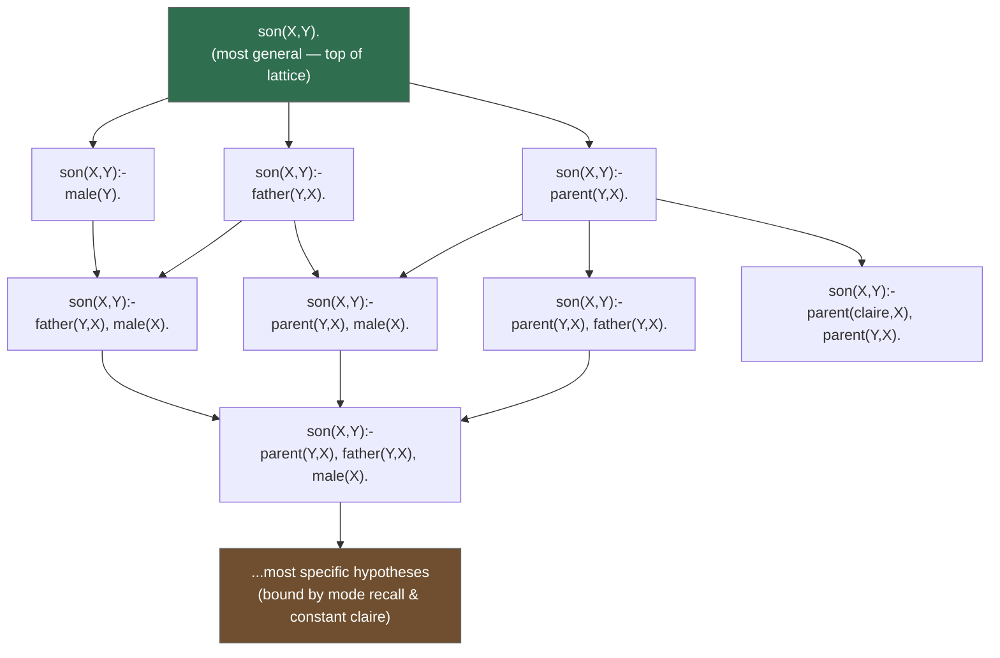

# Search Methods Over the Hypothesis Space

[[book-guidelines|↩ Back to guidelines]]

## The problem: a lattice is not a search algorithm

[[Generality-and-Theta-Subsumption|Chapter 2]] gave you $\theta$-subsumption as a decidable proxy for entailment, and [[Language-Bias|§4.4]] (mode declarations, metarules) gave you a way to keep the resulting hypothesis space finite and manageable. Neither of those, on its own, tells you what to *do*. You still have — even after a reasonable bias — a space that can run to millions of candidate clauses. Subsumption gives you a partial order over that space (Figure 2 in the book: the most general hypothesis at the top, the most specific hypotheses at the bottom, edges connecting a hypothesis to its immediate specialisations), but a partial order is a static [[Language-Bias#Structure|structure]]. Search is what you do by *moving through* it.

**What breaks without a search strategy that exploits the order:** if you ignored the subsumption lattice's structure and just enumerated every hypothesis the language bias permits, testing each one against every example, you would be doing brute-force enumeration over a space that is easily double-exponential in program size. The entire reason Chapter 2 bothered to make generality decidable was so that a search procedure could use one hypothesis's subsumption relationship to a data point to *prune* — to throw away entire subtrees of the lattice without visiting them. The book states the pruning rule directly:

> If a clause does not entail a positive example, then there is no need to explore any of its specialisations, because it is logically impossible for them to entail the example. Likewise, if a clause entails a negative example, then there is no need to explore any of its generalisations, because they will also entail the example.

This is monotonicity doing the heavy lifting: specialising a clause can only shrink the set of things it entails, and generalising it can only grow that set. Once you know a node fails in one direction, you know the entire downstream (or upstream) region of the lattice fails too, without testing a single one of those nodes individually. Every search method below is a different strategy for walking this lattice while exploiting that monotonicity.

One clarifying scope note before the strategies: the [[Representative-ILP-Systems#Discussion|discussion]] above is about generality orders on *single clauses*. Many systems build a multi-clause hypothesis by running single-clause search repeatedly — the **covering algorithm**: find one good clause, remove the positive examples it explains, repeat on what's left (Quinlan, 1990; Muggleton, 1995; Blockeel & De Raedt, 1998). A smaller number of systems (Shapiro, 1983; Bratko, 1999; Cropper & Morel, 2021) search over generality orders on entire *theories* at once — a harder and less standard problem the chapter defers to De Raedt (2008).

## The lattice as search space

Figure 2 in the book builds a concrete lattice for learning `son(X,Y)` from mode declarations over `male/1`, `parent/2`, and `father/2`, with the constant `claire`. The top of the lattice is the most general legal hypothesis (`son(X,Y):- male(Y).`); each step down adds one more body literal, licensed by the mode declarations, making the clause strictly more specific (covering a subset of what its parent covered).



Top-down search starts at `Top` and walks downward (specialising); bottom-up search starts near `Bottom` (the most specific hypotheses consistent with an example) and walks upward (generalising). The book's three families — top-down, bottom-up, and the newer meta-level approach — are three different answers to "how do you traverse this graph without visiting all of it."

## 4.5.1 Top-down: specialise from the general

Top-down algorithms (Quinlan's FOIL, 1990; Blockeel & De Raedt's TILDE, 1998; Bratko's HYPER, 1999; Muggleton et al., 2008) start at (or near) the top of the lattice — the most general legal hypothesis — and repeatedly **refine** it into something more specific, using a **refinement operator**: a function that maps a clause to a set of its immediate specialisations (add one literal, or bind one variable to a constant — exactly the edges in the diagram above).

HYPER's version of this is a tree search where each node is a hypothesis and each child is more specific than (or equal to) its parent under $\theta$-subsumption — meaning a child can only cover a subset of the positive examples its parent covered. The pruning rule from the opening section fires directly here: **if a hypothesis under consideration fails to entail all of the positive examples it's required to explain, it is discarded immediately** — refining it further can only shrink its coverage, so no descendant can ever recover completeness. This is a hard cut, not a heuristic: it follows from the monotonicity of subsumption, not from any scoring function.

The practical shape of top-down search is therefore: maintain a frontier of candidate clauses, pop one, check whether it still entails enough positive examples and few enough negative ones, either accept it, discard it, or refine it into children and push those back onto the frontier. This is uniform-cost or best-first tree search with an admissible pruning rule baked into the successor function itself — the refinement operator only ever proposes legal (bias-respecting) specialisations, so illegal nodes never even enter the search.

## 4.5.2 Bottom-up: generalise from the examples

Bottom-up algorithms (Muggleton, 1987; Muggleton & Buntine, 1988; Golem — Muggleton & Feng, 1990; Muggleton et al., 2009; Inoue et al., 2014) invert the direction: start from the examples themselves (each one, trivially, is its own most-specific "hypothesis") and **generalise**, merging pairs of clauses into the least specific single clause that still covers both. The formal tool for this merge is Plotkin's (1971) **least general generalisation (LGG)**.

### LGG, defined bottom-up through terms, literals, and clauses

The book builds LGG in three layers, each depending on the one before it.

**LGG of terms:**
$$
\begin{aligned}
\mathrm{lgg}(f(s_1,\ldots,s_n),\, f(t_1,\ldots,t_m)) &= f(\mathrm{lgg}(s_1,t_1),\ldots,\mathrm{lgg}(s_n,t_n)) \\
\mathrm{lgg}(f(s_1,\ldots,s_n),\, g(t_1,\ldots,t_m)) &= V \quad \text{(a fresh variable, when functors differ)} \\
\mathrm{lgg}(f(s_1,\ldots,s_n),\, V) &= V' \quad \text{(a fresh variable, when one side is already a variable)}
\end{aligned}
$$

A constant is just a $0$-ary functor, so the first rule already covers constants (two identical constants generalise to themselves; two different constants fall into the second case and generalise to a fresh variable).

**LGG of literals** — same idea, applied argument-wise, but only when the predicate symbol and polarity already agree:
$$
\mathrm{lgg}(p(s_1,\ldots,s_n),\, p(t_1,\ldots,t_n)) = p(\mathrm{lgg}(s_1,t_1),\ldots,\mathrm{lgg}(s_n,t_n))
$$
and symmetrically for two negated literals with the same predicate. Crucially, $\mathrm{lgg}(p(\ldots), q(\ldots))$, $\mathrm{lgg}(p(\ldots), \neg p(\ldots))$, and $\mathrm{lgg}(\neg p(\ldots), p(\ldots))$ are all **undefined** — you cannot generalise across different predicates or opposite polarities, because a clause is a set of literals with signed meaning (Chapter 2's head/body-as-disjunction reading), and there's no single literal that's "more general than" both a positive and a negative occurrence of the same predicate.

**LGG of clauses**, using the set-of-literals view from [[Generality-and-Theta-Subsumption]]:
$$
\mathrm{lgg}(cl_1, cl_2) = \{\, \mathrm{lgg}(l_1, l_2) \mid l_1 \in cl_1,\ l_2 \in cl_2,\ \mathrm{lgg}(l_1,l_2) \text{ is defined} \,\}
$$
i.e., take the LGG of *every pair* of literals across the two clauses, and keep only the pairs where it's defined. This is a cross product filtered by definedness — an important implementation detail, because it means the LGG of two clauses with $m$ and $n$ literals requires up to $m \times n$ literal-LGG computations.

**One consistency rule holds the whole computation together:** the *same* variable must be reused for every occurrence of the *same* ordered pair of terms, anywhere in the computation. If $\mathrm{lgg}(o_1, o_3) = Y$ once, every future occurrence of the pair $(o_1, o_3)$ — in any literal, in either clause — must generalise to that same $Y$. Get this wrong and you silently break the "most specific generalisation that covers both" guarantee: you'd produce a clause more general than necessary, one that no longer captures the shared structure between the two originals.

**Relative LGG (RLGG)** (Buntine, 1988) closes the loop back to real ILP problems: instead of generalising two bare examples (which, with no shared background, would usually generalise to something trivial), generalise each example *together with the background knowledge*:
$$
\mathrm{rlgg}(e_1, e_2) = \mathrm{lgg}(e_1 \,\text{:-}\, BK,\ e_2 \,\text{:-}\, BK)
$$
Turning each example into a clause with the entire (ground) background as its body is what gives the LGG computation enough shared literals to find non-trivial common structure.

### Worked example: RLGG on a Bongard problem

The book's own [[Generality-and-Theta-Subsumption#Worked example|worked example]] is worth walking through in full, because it makes the "same pair, same variable" discipline concrete. The task (Example 4 in the book): given two images (Bongard problems), each described by ground facts about the shapes they contain, spot the common factor.

Background knowledge:
$$
B = \{\, \texttt{triangle(o1)},\ \texttt{triangle(o3)},\ \texttt{circle(o2)},\ \texttt{points(o1,down)},\ \texttt{points(o3,down)},\ \texttt{contains(1,o1)},\ \texttt{contains(1,o2)},\ \texttt{contains(2,o3)} \,\}
$$
Read informally: image 1 contains a down-pointing triangle (`o1`) and a circle (`o2`); image 2 contains a down-pointing triangle (`o3`).

**Step 1 — form clauses relative to BK.** Each example `bon(1)` and `bon(2)` becomes a clause with the (irrelevant-trimmed) BK as its body:
$$
\begin{aligned}
\texttt{bon(1)} &\,\text{:-}\, \texttt{contains(1,o1), contains(1,o2), triangle(o1), points(o1,down), circle(o2), contains(2,o3), triangle(o3), points(o3,down)}.\\
\texttt{bon(2)} &\,\text{:-}\, \texttt{contains(1,o1), contains(1,o2), triangle(o1), points(o1,down), circle(o2), contains(2,o3), triangle(o3), points(o3,down)}.
\end{aligned}
$$

**Step 2 — LGG of the heads.** $\mathrm{lgg}(\texttt{bon(1)}, \texttt{bon(2)}) = \texttt{bon(lgg(1,2))} = \texttt{bon(X)}$. Fix this: $\mathrm{lgg}(1,2) = X$, and this binding must be reused everywhere the pair $(1,2)$ recurs.

**Step 3 — LGG of every body-literal pair.** Because both clauses' bodies are identical lists here, you still take the LGG over *all* pairs of literals across the two occurrences (the RLGG construction doesn't know a priori that the lists happen to coincide) — this produces a large grid of candidate literal-LGGs, most of which are undefined (different predicates never generalise):
$$
\left\{\,\mathrm{lgg}(\texttt{contains(1,o1)},\texttt{contains(2,o3)}),\ \mathrm{lgg}(\texttt{contains(1,o1)},\texttt{triangle(o3)}),\ \ldots\,\right\}
$$
Eliminating every pair with mismatched predicates leaves only the same-predicate pairs:
$$
\left\{\, \mathrm{lgg}(\texttt{contains(1,o1)},\texttt{contains(2,o3)}),\ \mathrm{lgg}(\texttt{contains(1,o2)},\texttt{contains(2,o3)}),\ \mathrm{lgg}(\texttt{triangle(o1)},\texttt{triangle(o3)}),\ \mathrm{lgg}(\texttt{points(o1,down)},\texttt{points(o3,down)}) \,\right\}
$$

**Step 4 — compute the surviving literal LGGs**, fixing term-level bindings as you go ($\mathrm{lgg}(1,2)=X$ already fixed; newly needed: $\mathrm{lgg}(o1,o3) = Y$, $\mathrm{lgg}(o2,o3) = Z$):
$$
\left\{\, \texttt{contains(X,Y)},\ \texttt{contains(X,Z)},\ \texttt{triangle(Y)},\ \texttt{points(Y,down)} \,\right\}
$$
Notice `triangle(o1)` and `triangle(o3)` generalise using the *same* $Y$ as `contains(1,o1)`/`contains(2,o3)` did for their second argument — that's the consistency rule in action: the pair $(o1,o3)$ was already bound to $Y$, so every later occurrence of that exact pair must reuse $Y$, not mint a fresh variable.

**Step 5 — drop redundancy.** `contains(X,Z)` is subsumed by `contains(X,Y)` (in this instantiation they coincide up to the earlier bindings), so it's eliminated as redundant, leaving the final RLGG:
$$
\texttt{bon(X):- contains(X,Y), triangle(Y), points(Y,down).}
$$
In words: *an image is a "Bongard-positive" example if it contains something that is a triangle pointing down* — exactly the common factor a human would spot by inspection, produced mechanically by generalising two ground examples relative to shared background.

Two structural properties of bottom-up search follow directly from this worked mechanics: (1) LGG computation is **entirely syntactic and deterministic** — no backtracking, no choice points, just a fixed-point-style pairwise generalisation — which is exactly why Golem-style systems are typically fast; and (2) the *size* of the RLGG computation is driven by $|BK| \times |BK|$ literal-pair comparisons per example pair, which is the well-known scalability bottleneck of pure bottom-up approaches on large background knowledge.

## 4.5.3 Top-down and bottom-up: Progol's hybrid

Progol (and its well-known successor Aleph, covered in the book's Section 6.1) refuses to sit cleanly in either category, and the chapter is explicit that this makes it "slightly confusing" to classify. Progol runs a **set-covering** outer loop (pick an uncovered positive example, explain it, remove what's now covered, repeat), and *within* each iteration it does two things in sequence:

1. **Bottom-up step:** using the mode declarations from [[Language-Bias|§4.4.1]], construct the **bottom clause** — the single, logically most-specific clause (built from the example plus background) that still explains the chosen example. This bounds the search: the final learned clause must sit somewhere between the empty (maximally general) clause and this bottom clause, subsumption-wise.
2. **Top-down step:** search *within* that bounded region — from the bottom clause upward toward something more general — using an $A^*$ search (Section 21 footnote: swappable for e.g. stochastic search), guided by the other examples to decide which generalisation to try next.

So Progol is bottom-up in *how it bounds the space* (via the most-specific clause) and top-down in *how it searches within the bound* (generalising via best-first search, general-to-specific direction reversed from a literal reading but structurally still a directed graph search with an admissible heuristic). The $A^*$ framing here is worth pausing on: $f = g + h$ where $g$ tracks how much of the clause has been "explained away" and $h$ estimates the remaining cost to a complete, consistent clause — this is the same $A^*$ shape used in classical planning and in constraint-optimisation search, just instantiated over the subsumption-bounded region between two clauses instead of over states in a transition system.

## 4.5.4 Meta-level: search delegated to a solver

The newest of the three families (Inoue et al., 2013; Metagol — Muggleton et al., 2015; Inoue, 2016; Law et al., 2020; Popper — Cropper & Morel, 2021) takes a fundamentally different stance: instead of writing a bespoke procedural search (top-down refinement or bottom-up generalisation), **encode the entire ILP problem — the hypothesis space, the coverage requirement, the optimisation criterion — as a declarative meta-level program**, most often an Answer Set Programming (ASP) problem, and hand the search off to an off-the-shelf solver (Corapi et al., 2011; Athakravi et al., 2013; Muggleton et al., 2014; Law et al., 2014; Kaminski et al., 2018; Evans et al., 2021; Cropper & Dumančić, 2020; Cropper & Morel, 2021).

ASPAL (Corapi et al., 2011) is the chapter's worked instance: it translates an ILP problem into a meta-level ASP program that describes *every example and every possible rule in the (mode-bounded) hypothesis space* as ASP facts and choice rules, then lets the ASP solver pick a subset of rules — via a choice-rule-plus-optimisation encoding — that covers all positive and no negative examples, additionally minimising literal count via an ASP optimisation statement. The ILP search problem has been reformulated, wholesale, as an ASP *model-finding* problem: the solver's own search procedure (conflict-driven clause learning under the hood, for most modern ASP solvers) does the combinatorial work that top-down refinement or bottom-up generalisation would otherwise do by hand.

This buys real power — meta-level approaches can learn **optimal** programs (minimal under whatever cost function you encode) and handle **recursion** naturally, both of which are awkward for naive top-down/bottom-up search — but it inherits a specific structural weakness from its host solver: **ASP solvers operate on grounded programs**. Grounding means instantiating every variable with every possible constant it could take, up front, before search even starts. This is precisely the "grounding bottleneck" that recurs in [[ILP-System-Features|Chapter 7]] under infinite domains: a meta-level encoding that is elegant on paper can become intractable the moment the domain of constants is large, because the ground program itself — not the subsequent solving — blows up combinatorially.

## 4.5.5 Discussion: no free lunch across the three families

| | Bottom-up (LGG/RLGG) | Top-down (refinement) | Meta-level (solver-delegated) |
|---|---|---|---|
| **Driven by** | the examples | the hypothesis space | a declarative encoding |
| **Typical speed** | fast (deterministic, no backtracking) | can be prohibitively slow (many dead-end hypotheses that cover zero positives) | bounded by solver + grounding cost |
| **Recursive hypotheses** | difficult | difficult (though metarule-driven top-down systems like Metagol are actually meta-level, not classical top-down) | natural |
| **[[Predicate-Invention|Predicate invention]]** | not naturally supported | not naturally supported | supported by several systems |
| **Known weak point** | clauses tend to be unnecessarily long/verbose; bad at learning multiple predicates simultaneously | reliant on incremental score improvement — can get stuck when no intermediate specialisation improves coverage (mitigated by **lookahead**, at extra cost) | grounding bottleneck on large/infinite domains; many approaches precompute every candidate rule up front, straining on large rule spaces |

The chapter's own framing is worth keeping verbatim in spirit: *there is no "best" approach*, and the three families aren't even cleanly separable in practice — Progol already blurs top-down/bottom-up, and Metagol (meta-interpretation over metarules) is arguably closer to top-down refinement in spirit despite being classified as meta-level. What the taxonomy actually gives you is a vocabulary for describing *where* a system spends its search budget: on enumerating specialisations (top-down), on merging specifics (bottom-up), or on a solver's internal search (meta-level) — and each of those budgets fails differently when the problem's shape doesn't match the strategy's assumptions.

## Grounding: three search strategies as three graph-search algorithms

### Rust — refinement-operator search with subsumption pruning

The cleanest way to see top-down search's structural shape is as classic best-first tree search where the *successor function* is a subsumption-respecting refinement operator, and the *pruning rule* falls directly out of monotonicity:

```rust
use std::collections::BinaryHeap;
use std::cmp::Ordering;

#[derive(Clone, Debug)]
struct Clause {
    literals: Vec<Literal>,
}

#[derive(Clone, PartialEq, Eq, Debug)]
struct Literal { predicate: String, negated: bool, args: Vec<String> }

struct ScoredClause { clause: Clause, score: i64 } // score: e.g. #pos covered - #neg covered

impl Ord for ScoredClause {
    fn cmp(&self, other: &Self) -> Ordering { self.score.cmp(&other.score) }
}
impl PartialOrd for ScoredClause {
    fn partial_cmp(&self, other: &Self) -> Option<Ordering> { Some(self.cmp(other)) }
}
impl PartialEq for ScoredClause {
    fn eq(&self, other: &Self) -> bool { self.score == other.score }
}
impl Eq for ScoredClause {}

/// Refinement operator: legal one-step specialisations under the mode bias.
fn refine(c: &Clause, mode_bias: &[Literal]) -> Vec<Clause> {
    mode_bias.iter().map(|lit| {
        let mut lits = c.literals.clone();
        lits.push(lit.clone());
        Clause { literals: lits }
    }).collect()
}

fn covers_all_positives(c: &Clause, pos: &[Example]) -> bool { /* subsumption/entailment check */ true }
fn covers_any_negative(c: &Clause, neg: &[Example]) -> bool { /* .. */ false }

fn top_down_search(top: Clause, pos: &[Example], neg: &[Example], mode_bias: &[Literal]) -> Option<Clause> {
    let mut frontier: BinaryHeap<ScoredClause> = BinaryHeap::new();
    frontier.push(ScoredClause { clause: top, score: 0 });

    while let Some(ScoredClause { clause, .. }) = frontier.pop() {
        // Monotonicity prune: specialising further can only shrink coverage,
        // so if we already fail to cover all positives, discard — never refine.
        if !covers_all_positives(&clause, pos) {
            continue;
        }
        if !covers_any_negative(&clause, neg) {
            return Some(clause); // complete and consistent
        }
        for child in refine(&clause, mode_bias) {
            let score = /* coverage-based scoring */ 0;
            frontier.push(ScoredClause { clause: child, score });
        }
    }
    None
}
# struct Example;
```

The `if !covers_all_positives { continue; }` line *is* the chapter's pruning rule, made operational: it's not a heuristic, it's a soundness-preserving cut licensed by subsumption's monotonicity. This same skeleton — successor function plus a monotone admissible cut — is the shape your CSP kernel's branch-and-bound search will take when pruning subtrees of an assignment tree once a partial assignment already violates a constraint: the ILP refinement operator and a CSP solver's variable-assignment step are the same search pattern instantiated over different domains (clauses vs. variable bindings).

### Rust — LGG as a deterministic fold

Bottom-up's LGG, by contrast, has no search or backtracking at all — it's a pure recursive fold over term structure, which makes it a good target for a first Rust pass at the chapter's algorithms:

```rust
#[derive(Clone, PartialEq, Eq, Debug)]
enum Term { Var(String), Const(String) }

fn lgg_term(s: &Term, t: &Term, fresh: &mut impl FnMut() -> String,
            seen: &mut std::collections::HashMap<(Term, Term), Term>) -> Term {
    if s == t { return s.clone(); }
    // Consistency rule: reuse the variable already assigned to this exact pair.
    let key = (s.clone(), t.clone());
    if let Some(v) = seen.get(&key) { return v.clone(); }
    let v = Term::Var(fresh());
    seen.insert(key, v.clone());
    v
}
```

The `seen` map is doing exactly the work of the book's "same variable for the same ordered pair of terms everywhere" rule — without it, the Bongard worked example would silently produce a clause more general than the correct RLGG.

### Python — the Bongard RLGG, computed

A short script reproducing the worked example end-to-end is a good sanity check on the mechanics above, since the book does the arithmetic by hand:

```python
from itertools import product

def lgg_term(s, t, bindings):
    if s == t:
        return s
    key = (s, t)
    if key not in bindings:
        bindings[key] = f"V{len(bindings)}"
    return bindings[key]

def lgg_literal(l1, l2, bindings):
    (p1, neg1, args1), (p2, neg2, args2) = l1, l2
    if p1 != p2 or neg1 != neg2 or len(args1) != len(args2):
        return None
    return (p1, neg1, tuple(lgg_term(a, b, bindings) for a, b in zip(args1, args2)))

def lgg_clause(cl1, cl2, bindings):
    out = set()
    for l1, l2 in product(cl1, cl2):
        g = lgg_literal(l1, l2, bindings)
        if g is not None:
            out.add(g)
    return out
```

Running `lgg_clause` over the book's two bodies with a shared `bindings` dict reproduces `contains(X,Y)`, `triangle(Y)`, `points(Y,down)` (plus the redundant `contains(X,Z)`, which a follow-up subsumption-based cleanup pass removes) — a direct executable check of Steps 2–5 above.

## Where this leads

Search method is the fourth of the paper's four ILP design choices ([[Building-an-ILP-System]]), and it's the one that finally turns the static machinery of the earlier chapters — subsumption's partial order ([[Generality-and-Theta-Subsumption]]), the bias-restricted hypothesis space ([[Language-Bias]]) — into an actual algorithm. [[ILP-System-Features|Chapter 7]]'s treatment of recursion and predicate invention is best read as "what top-down/bottom-up search structurally cannot do well, and what meta-level search buys you instead"; the four systems in Chapter 8 (Aleph, TILDE, ASPAL, Metagol) are, respectively, worked instances of Progol's hybrid, a top-down decision-tree variant, ASP-delegated meta-level search, and Prolog-meta-interpretation-as-search — so this chapter is the lens through which all four should be read.

For the `automated-reasoning` and `sat-smt-csp` focus areas, the connections are direct rather than incidental. The top-down refinement loop above *is* a pruned tree search with a monotone admissible cut — structurally identical to the branch-and-bound pattern your CSP kernel needs for searching concrete counterexamples against type invariants: fail fast on a partial assignment that already violates a constraint, exactly as `covers_all_positives` fails fast on a partial clause that already can't be completed. Progol's $A^*$-bounded hybrid search is the same best-first-search-with-heuristic pattern that shows up in constraint optimisation more generally. And meta-level ILP's move — reformulate the whole search problem as a declarative program and delegate to ASP — is the ILP-specific instance of a much more general strategy you'll want for the verifier: instead of hand-rolling a search procedure for, say, discharging a generated verification condition, encode the condition as a constraint problem (SAT/SMT/CSP) and delegate the combinatorics to a solver, accepting the same grounding-style scalability trade-off (a solver-friendly encoding can blow up before the solver even starts searching) that ASPAL pays here.
