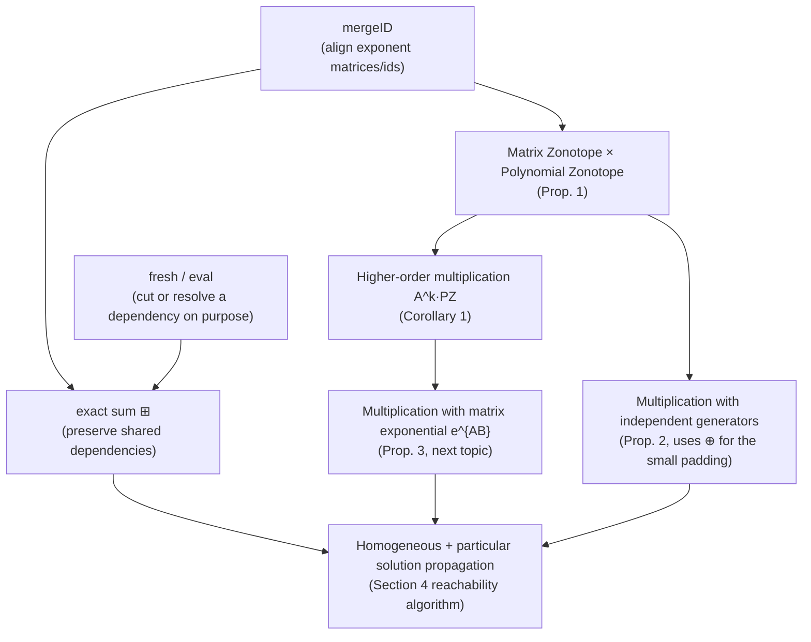

[[book-guidelines|↩ Back to guidelines]]

## Why a set representation needs a memory

Say you have two uncertain quantities that came from the *same* source of uncertainty. A set $\mathcal{A}\,\mathcal{S}$ (multiplying a set $\mathcal{S}$ by an uncertain matrix $\mathcal{A}$) and the set $\mathcal{S}$ itself are correlated — whatever concrete value $A$ was "drawn" to produce a particular point of $\mathcal{A}\,\mathcal{S}$, that same $A$ constrains which points of $\mathcal{S}$ are reachable together with it. If you now add $\mathcal{A}\,\mathcal{S}$ and $\mathcal{S}$ together, naively unioning over all independent combinations gives you a strictly bigger, looser set than the one that's actually reachable — because you've allowed pairings that could never happen (the $A$ used for the first term disagreeing with the $A$ used for the second).

This is not a hypothetical corner case for this paper; it's the central mechanism of Section 4's reachability algorithm. The homogeneous solution $\mathcal{H}(\tau_k)$ and the particular solution $\mathcal{P}(\tau_k)$ are propagated forward across every time step by repeatedly multiplying by the same uncertain matrix set $\mathcal{A}$ (or the same matrix exponential $e^{\mathcal{A}\Delta t}$). If each multiplication "forgot" which matrix was drawn, the algorithm would need to allow $A_1 \ne A_2 \ne \dots \ne A_k$ across time steps, when physically the system's matrix $A$ is *the same* uncertain-but-fixed matrix at every step. Losing that correlation is exactly what makes convex over-approximations (standard zonotopes, ellipsoids) so loose over long time horizons — the reachable tube balloons out far faster than the true non-convex set actually spreads.

Polynomial zonotopes solve this with a bookkeeping device: every source of uncertainty (every "roll of the dice", formally an interval factor $\alpha_k \in [-1,1]$) gets a durable **identifier**. As long as two terms in a computation carry the *same* identifier, the representation remembers that they must always take the same value. The set operations in Sections 2 and 3 are the machinery that keeps this bookkeeping consistent — merging identifier lists when combining sets, deliberately destroying identifiers when a correlation should legitimately be broken, and picking the right kind of "sum" depending on whether dependencies should be preserved or not. This article covers exactly that machinery, which is what "dependency-preserving" set operations means throughout the paper.

## The book's representation, briefly

Recall (from Def. 2.2) that a polynomial zonotope in sparse representation is

$$
\mathcal{PZ} = \left\{ c + \sum_{i=1}^{h}\Big(\prod_{k=1}^{p} \alpha_k^{E_{(k,i)}}\Big) G_{(\cdot,i)} + \sum_{j=1}^{q} \beta_j G_{I(\cdot,j)} \;\middle|\; \alpha_k,\beta_j \in [-1,1] \right\},
$$

written $\mathcal{PZ} = \langle c, G, G_I, E, \mathrm{id}\rangle_{PZ}$. The **dependent generators** $G$ get scaled by *products of powers* of the dependent factors $\alpha_k$ (this is what makes the set non-convex — a term like $\alpha_1\alpha_2^3$ traces out a curved boundary, not a flat one). The **independent generators** $G_I$ are scaled linearly by fresh factors $\beta_j$ that appear nowhere else — they behave like an ordinary zonotope's generators and contribute only convex "padding." The exponent matrix $E \in \mathbb{N}_0^{p\times h}$ records which power of which factor multiplies which generator column, and — this is the crucial part for this topic — $\mathrm{id} \in \mathbb{N}^p$ gives each of the $p$ dependent factors a globally unique name. A matrix zonotope $\mathcal{A} = \langle A^{(0)}, A^{(1)},\dots,A^{(w)}, \mathrm{id}\rangle_{MZ}$ carries the same kind of identifier list for its own uncertain factors $\rho_l$.

Two polynomial zonotopes (or matrix zonotopes) built independently will, in general, have exponent matrices of different shapes and identifier lists that don't line up — factor $\mathrm{id} = 2$ in one might not exist at all in the other. Before you can even ask "do these two sets share a dependency," you need to put both into a common format. That's `mergeID`.

## `mergeID`: aligning exponent matrices so dependencies can be compared

**What breaks without it.** Suppose $\mathcal{PZ}_1$ has three dependent factors with identifiers $[1,2,3]$ and $\mathcal{PZ}_2$ has two, identified $[2,4]$. Factor $2$ is shared — it must be the *same* $\alpha_2 \in [-1,1]$ in both sets — but factors $1$ and $3$ exist only in $\mathcal{PZ}_1$, and factor $4$ only in $\mathcal{PZ}_2$. You cannot multiply, add, or otherwise combine the two sets' exponent matrices row-by-row until every row refers to the same, unambiguous list of factors, with a `0` exponent standing in for "this generator doesn't depend on this factor at all."

`mergeID` (Def. 2.5) does exactly this reshaping. Given $E_1 \in \mathbb{R}^{p_1\times h_1}$, $E_2\in\mathbb{R}^{p_2\times h_2}$ with identifier lists $\mathrm{id}_1, \mathrm{id}_2$:

$$
\overline{E}_1, \overline{E}_2, \mathrm{id} \leftarrow \mathrm{mergeID}(\mathrm{id}_1, \mathrm{id}_2, E_1, E_2)
$$

The construction: find the identifiers in $\mathrm{id}_2$ that are genuinely new (not already in $\mathrm{id}_1$), call that index set $K = \{i_1,\dots,i_k\}$. The merged identifier list is $\mathrm{id}_1$ with those new ones appended. $\overline{E}_1$ is just $E_1$ padded with $k$ rows of zeros (its factors say nothing about the identifiers borrowed from $\mathcal{PZ}_2$). $\overline{E}_2$ is reshaped row-by-row: row $i$ of $\overline{E}_2$ is $E_2$'s row for that identifier if it exists there, and a zero row otherwise. After this, $\overline{E}_1$ and $\overline{E}_2$ have the same number of rows $p_1+k$, indexed by the same identifiers in the same order — you can now legitimately add exponents row-by-row to represent "these two products of powers get multiplied together."

Think of `mergeID` as a **schema unification** step: two records with only partially overlapping columns get widened to a common schema before any join. It's a bookkeeping cost paid so the *dependency semantics* — "same identifier = same underlying random draw" — stays sound across an operation that touches two independently-built sets.

```rust
// A minimal, illustrative sketch of mergeID's shape. Real code would use
// a proper sparse/dense matrix type; this focuses on the identifier logic.
struct ExponentMatrix {
    rows: Vec<Vec<u32>>, // rows[k] = exponents of factor k across all generator columns
    ids: Vec<u64>,       // ids[k] = the persistent identifier of factor k
}

fn merge_id(e1: &ExponentMatrix, e2: &ExponentMatrix) -> (ExponentMatrix, ExponentMatrix, Vec<u64>) {
    let h1 = e1.rows[0].len();
    let h2 = e2.rows[0].len();

    // New identifiers introduced by e2 that e1 doesn't already have.
    let new_ids: Vec<u64> = e2.ids.iter().copied().filter(|id| !e1.ids.contains(id)).collect();

    let merged_ids: Vec<u64> = e1.ids.iter().copied().chain(new_ids.iter().copied()).collect();

    // e1 padded with zero rows for the identifiers it never had.
    let mut e1_aligned_rows = e1.rows.clone();
    for _ in &new_ids {
        e1_aligned_rows.push(vec![0; h1]);
    }

    // e2 reshaped: one row per merged identifier, borrowed from e2 if present, else zero.
    let e2_aligned_rows: Vec<Vec<u32>> = merged_ids.iter().map(|id| {
        match e2.ids.iter().position(|x| x == id) {
            Some(j) => e2.rows[j].clone(),
            None => vec![0; h2],
        }
    }).collect();

    (
        ExponentMatrix { rows: e1_aligned_rows, ids: merged_ids.clone() },
        ExponentMatrix { rows: e2_aligned_rows, ids: merged_ids.clone() },
        merged_ids,
    )
}
```

This is a good place to notice a family resemblance worth naming explicitly: `mergeID` is doing, at the level of *interval factors*, the same job a **relational abstract domain**'s join does when it has to unify two abstract states over possibly different variable sets before comparing or combining them — pad the missing dimensions, keep the shared ones aligned, and only then compute. The payoff for paying this alignment cost is the same in both settings: the resulting combined abstraction can express *relations between* the pieces (here, "these two generators are driven by literally the same random factor"), not just each piece in isolation.

## `fresh` and `eval`: instantiating or destroying dependencies on purpose

`mergeID` preserves dependencies; sometimes the algorithm needs the opposite — to deliberately *cut* a dependency, or to *resolve* one down to a concrete number. Two operations do this:

**`fresh`.** `uniqueID(p)` returns $p$ brand-new identifiers, guaranteed not to collide with anything already in use. `fresh(\mathcal{PZ}) = \langle c, G, G_I, E, \mathrm{uniqueID}(p)\rangle_{PZ}$ replaces *every* identifier of $\mathcal{PZ}$ with a fresh one — this severs all of $\mathcal{PZ}$'s dependencies on anything else in the computation, while leaving its *shape* (its actual geometric extent) untouched. The paper also uses a targeted variant, $\mathrm{fresh}(\mathcal{PZ}, \mathcal{A})$: refresh only the factors of $\mathcal{PZ}$ that are *not* shared with matrix zonotope $\mathcal{A}$, leaving the genuinely shared ones alone.

**What breaks without it.** Section 4.3's particular-solution propagation needs exactly this half-measure: the matrix zonotope factors of $\mathcal{A}, \mathcal{B}$ must stay correlated across time steps (same physical uncertain matrix), but the *input* uncertainty $\mathcal{U}$ at one time step is a fresh, independent draw from the input set at the next time step — nothing in the physical system says the disturbance at $t=0.1s$ must equal the disturbance at $t=0.2s$. Using plain `fresh(\mathcal{U})` on the input factors (rather than accidentally treating them as persistent, or accidentally treating the *matrix* factors as fresh) is what keeps the propagation scheme both correct and non-conservative.

**`eval`.** $\mathrm{eval}(\mathcal{PZ}, \mathrm{id}, \mathrm{val})$ substitutes a *concrete number* $\mathrm{val}\in[-1,1]$ for the dependent factor carrying identifier $\mathrm{id}$, everywhere it occurs in $\mathcal{PZ}$ — collapsing that one axis of uncertainty to a point while leaving every other factor free. Using Example 1's polynomial zonotope

$$
\mathcal{PZ} = \left\{ \begin{pmatrix}0\\0\end{pmatrix} + \alpha_1\begin{pmatrix}2\\1\end{pmatrix} + \alpha_2\begin{pmatrix}0\\2\end{pmatrix} + \alpha_1\alpha_2^3\begin{pmatrix}1\\1\end{pmatrix} + \beta_1\begin{pmatrix}1\\0.5\end{pmatrix} \;\middle|\; \alpha_1,\alpha_2,\beta_1\in[-1,1]\right\},
$$

evaluating $\mathrm{eval}(\mathcal{PZ}, 2, 0.5)$ (pinning the factor with $\mathrm{id}=2$, i.e. $\alpha_2$, to $0.5$) folds every term containing $\alpha_2$ into a numeric contribution:

$$
\mathrm{eval}(\mathcal{PZ},2,0.5) = \alpha_1\begin{pmatrix}2\\1\end{pmatrix} + 0.5\begin{pmatrix}0\\2\end{pmatrix} + \alpha_1(0.5)^3\begin{pmatrix}1\\1\end{pmatrix} + \beta_1\begin{pmatrix}1\\0.5\end{pmatrix}.
$$

**Why this matters downstream:** Section 4.4's algorithm represents an entire *time interval* $\tau_k$ as a reachable set with the interval's own time variable folded in as one more dependent factor (this is "time preservation" — Topic 4 covers it in depth). `eval` is the operation that then extracts the reachable set at a single *time point* $t \in \tau_k$ by pinning that time-factor to a concrete value — exactly analogous to pinning $\alpha_2$ above. Without `eval`, there would be no way to go from "the enclosure over the whole interval" back down to "the enclosure at this instant" without recomputing from scratch and losing the tightness the interval representation bought you.

```python
# Illustrative only — a plain-tuple polynomial zonotope with eval/fresh sketched.
# (Python here, not Rust: the point is the substitution/renaming logic, not
# anything that needs to be fast or type-checked at compile time.)

def eval_factor(pz, target_id, value):
    """Substitute `value` for the dependent factor with identifier `target_id`."""
    c, G, GI, E, ids = pz
    keep = [k for k, i in enumerate(ids) if i != target_id]
    idx = ids.index(target_id)
    new_c = c
    new_G = []
    new_E = []
    for col in range(len(G)):
        exponent = E[idx][col]
        scale = value ** exponent
        if exponent > 0 and scale == 0:
            continue  # generator vanishes once the fixed factor is raised to a nonzero power
        new_G.append([scale * g for g in G[col]])
        new_E.append([E[row][col] for row in keep])
    new_ids = [i for i in ids if i != target_id]
    return (new_c, new_G, GI, new_E, new_ids)

def fresh(pz, next_id_counter):
    """Replace every identifier with a brand-new, never-before-used one."""
    c, G, GI, E, ids = pz
    new_ids = [next(next_id_counter) for _ in ids]
    return (c, G, GI, E, new_ids)
```

## Minkowski sum versus exact sum: the crux of "dependency-preserving"

This is the operation where dependency-preservation stops being bookkeeping and starts being the whole point of the paper. Given two sets $S_1, S_2$, three ways to add them are used throughout:

$$
A\, S_1 = \{As \mid s\in S_1\}, \qquad
\mathcal{A}\, S_1 = \{As \mid A\in\mathcal{A}, s\in S_1\}, \qquad
S_1 \oplus S_2 = \{s_1+s_2 \mid s_1\in S_1, s_2\in S_2\}.
$$

The first is a plain linear map by a known numerical matrix $A$. The second is a linear map by an *uncertain* matrix set $\mathcal{A}$ — every point of the result corresponds to *some* choice of $A\in\mathcal{A}$, but crucially the definition doesn't track *which* choice, so this is where dependencies could silently leak away if you're not careful (Prop. 1 below is precisely the careful version). The third, $\oplus$, is the ordinary Minkowski sum: for two polynomial zonotopes,

$$
\mathcal{PZ}_1 \oplus \mathcal{PZ}_2 = \left\langle c_1+c_2,\; [G_1\;G_2],\; [G_{I1}\;G_{I2}],\; \begin{pmatrix}E_1 & 0\\ 0 & E_2\end{pmatrix},\; \mathrm{uniqueID}(\mathrm{id}_1,\mathrm{id}_2)\right\rangle_{PZ}.
$$

Notice the block-diagonal exponent matrix and the fact that the identifiers are made unique (disjoint) even if $\mathcal{PZ}_1$ and $\mathcal{PZ}_2$ actually shared some factors beforehand — Minkowski sum treats the two operands as if every one of their dependent factors were independent of each other, full stop. That's the standard, always-safe way to add two sets, but it throws away any correlation that legitimately existed between them.

The **exact sum** $\boxplus$ (Kochdumper and Althoff, 2021, Prop. 10) does the opposite: it keeps whatever dependencies were already shared.

$$
\mathcal{PZ}_1 \boxplus \mathcal{PZ}_2 = \left\langle c_1+c_2,\; [G_1\;G_2],\; [G_{I1}\;G_{I2}],\; [\overline{E}_1\;\overline{E}_2],\; \mathrm{id}\right\rangle_{PZ},
$$

where $\overline{E}_1, \overline{E}_2, \mathrm{id} \leftarrow \mathrm{mergeID}(\mathrm{id}_1,\mathrm{id}_2,E_1,E_2)$ — this is exactly the `mergeID` machinery from above, put to work. Rather than forcing the two operands' factors to be disjoint, `mergeID` recognizes which identifiers already coincide and keeps them coinciding in the sum. A `compact` post-processing step (Prop. 2 of the cited paper) then removes redundant columns, such as two generator columns that ended up with identical exponent rows after merging.

**Example 2 makes the difference concrete.** Take $\mathcal{PZ} = \langle 0, I_2, [\,], I_2, [1\;2]^T\rangle_{PZ}$ and the numerical matrix $A = \begin{pmatrix}1&-1\\1&1\end{pmatrix}$ (columns $[1\;1]^T$ and $[-1\;1]^T$). Comparing $A\,\mathcal{PZ} \oplus \mathcal{PZ}$ against $A\,\mathcal{PZ} \boxplus \mathcal{PZ}$: the Minkowski sum over-approximates, because it pretends the copy of $\mathcal{PZ}$ used inside $A\,\mathcal{PZ}$ and the second, bare copy of $\mathcal{PZ}$ are driven by unrelated factors, when in fact both trace back to the *same* underlying $\alpha_1,\alpha_2$. The exact sum recovers the tighter true result by recognizing (via `mergeID`) that both terms share identifiers $1$ and $2$. The paper also notes a third, intermediate option: apply $\mathrm{fresh}(\mathcal{PZ}, A)$ to only some of the factors before summing, yielding a result that's Minkowski-sum-loose on the refreshed factors and exact-sum-tight on the rest — a dial between the two extremes rather than a binary choice.

**Why this is the paper's whole thesis in miniature.** Every one of Section 4's propagation formulas — e.g. $\mathcal{P}(\tau_k) \subseteq e^{\mathcal{A}\Delta t}\,\mathcal{P}(\tau_{k-1}) \boxplus \mathrm{fresh}(\mathcal{P}(\Delta t), \mathcal{A}, \mathcal{B})$ — is a careful choice of *which* operation, $\oplus$ or $\boxplus$, to apply to *which* pair of terms, based on whether those terms are known to share a real physical dependency. Get this choice right and you get the tight, non-convex reachable set the paper is built around; get it wrong (default to $\oplus$ everywhere, as convex methods effectively must) and you're back to the looser enclosures the paper is positioned against.

```rust
// A conceptual sketch: the type system nudges you toward the correct choice
// by making "has this been checked for shared dependencies" visible.
struct DepFactors(Vec<u64>);

struct PolyZonotope {
    center: Vec<f64>,
    dep_generators: Vec<Vec<f64>>,
    indep_generators: Vec<Vec<f64>>,
    exponents: Vec<Vec<u32>>, // one row per identifier in `ids`
    ids: DepFactors,
}

impl PolyZonotope {
    /// Minkowski sum: ALWAYS safe, but discards any dependency the two
    /// operands might have shared. `uniqueID` is applied unconditionally.
    fn minkowski_sum(&self, other: &Self) -> Self {
        // ids are forced disjoint here, regardless of overlap.
        todo!("block-diagonal exponents, disjoint id relabeling")
    }

    /// Exact sum: tighter, but only correct when `mergeID`'s alignment is
    /// used, so factors that really are the same random draw stay merged
    /// instead of being duplicated.
    fn exact_sum(&self, other: &Self) -> Self {
        let (_e1, _e2, _ids) = merge_id(
            &ExponentMatrix { rows: self.exponents.clone(), ids: self.ids.0.clone() },
            &ExponentMatrix { rows: other.exponents.clone(), ids: other.ids.0.clone() },
        );
        todo!("stack generator columns, use merged exponents/ids, then compact")
    }
}
```

## Matrix zonotope multiplication with a polynomial zonotope

Linear maps by a *numerical* matrix $A$ are routine — just apply $A$ to $c$ and to every column of $G$. The harder, load-bearing operation is multiplying by an *uncertain matrix set* $\mathcal{A}$, because now the matrix zonotope's own dependent factors $\rho_l$ must be threaded through the polynomial zonotope's exponent bookkeeping exactly the same way the polynomial zonotope's own factors are.

**Proposition 1 (Matrix Zonotope Multiplication).** Given $\mathcal{A} = \langle A^{(0)}, A^{(1)},\dots,A^{(w)}, \mathrm{id}_{mz}\rangle_{MZ}$ and $\mathcal{PZ} = \langle c, G, [\,], E, \mathrm{id}_{pz}\rangle_{PZ}$ (no independent generators, for now):

$$
\mathcal{A}\,\mathcal{PZ} = \Big\langle A^{(0)}c,\; \big[A^{(0)}G\;\; A^{(1)}c\dots A^{(w)}c\;\; A^{(1)}G\dots A^{(w)}G\big],\; [\,],\; \big[\overline{E}_1\;\overline{E}_2\; E_1\dots E_w\big],\; \widehat{\mathrm{id}}\Big\rangle_{PZ}
$$

with $E_l = \overline{E}_2(\cdot,l)\cdot \mathbf{1}_{1\times h} + \overline{E}_1$ for $l=1,\dots,w$, where $\overline{E}_1,\overline{E}_2,\widehat{\mathrm{id}} \leftarrow \mathrm{mergeID}(\mathrm{id}_{pz}, \mathrm{id}_{mz}, E, I_w)$.

**Reading the proof intuition, not just the formula.** Plug the two definitions into $\mathcal{A}\,\mathcal{PZ} = \{As \mid A\in\mathcal{A}, s\in\mathcal{PZ}\}$ and distribute:

$$
\Big(A^{(0)} + \sum_l \rho_l A^{(l)}\Big)\Big(c + \sum_i \prod_k \alpha_k^{E_{(k,i)}} G_{(\cdot,i)}\Big)
= A^{(0)}c + \sum_i \prod_k\alpha_k^{E_{(k,i)}} A^{(0)}G_{(\cdot,i)} + \sum_l \rho_l A^{(l)}c + \sum_{l,i}\prod_k\alpha_k^{E_{(k,i)}}\rho_l\, A^{(l)}G_{(\cdot,i)}.
$$

The first two terms are unchanged by the $\rho_l$'s at all — that's why they appear untouched as $A^{(0)}c$ and $A^{(0)}G$. The last term is where a *new* dependency gets created: the product $\prod_k\alpha_k^{E_{(k,i)}}\cdot\rho_l$ mixes a polynomial-zonotope factor with a matrix-zonotope factor into a single monomial. Since a matrix zonotope is, from the exponent-matrix point of view, just a polynomial zonotope whose exponent matrix happens to be the identity $I_w$ (each generator multiplied by exactly one factor, to the first power), `mergeID` can align $\mathcal{PZ}$'s $E$ against $\mathcal{A}$'s implicit $I_w$, and then $E_l = \overline{E}_2(\cdot,l)\cdot\mathbf{1} + \overline{E}_1$ is literally "add one to the row for $\rho_l$, keep everything else as it was" — encoding the new monomial $\alpha^{\dots}\rho_l$ as an exponent-row addition rather than a symbolic multiplication. This is the mechanical heart of "dependency preservation": no information about *which* $\alpha$'s a given generator depends on is lost when a new $\rho_l$-dependence is layered on top.

**Corollary 1 (Higher Order Multiplication).** $\mathcal{A}^k\,\mathcal{PZ}$ (the same uncertain matrix, applied $k$ times, using the *same* draw of $A$ every time — this is exactly the repeated-multiplication pattern that propagates the homogeneous solution across time steps) is computed by $k$ applications of Prop. 1: $\mathcal{A}(\dots(\mathcal{A}(\mathcal{A}\,\mathcal{PZ}))\dots)$. Because each application re-merges identifiers rather than manufacturing fresh ones, the correlation "it's the same $A$ every time" survives all $k$ multiplications — which is exactly the property the introduction's motivating example needed.

**Proposition 2 (with independent generators).** For the general case $\mathcal{PZ} = \langle c, G, G_I, E, \mathrm{id}_{pz}\rangle_{PZ}$ with nonempty independent generators, an exact treatment is possible in principle (any polynomial zonotope with independent generators can be re-expressed as one without, by assigning the independent factors their own fresh dependent identifiers), but the paper instead computes a tight *enclosure* for efficiency, exploiting that independent generators are assumed small. The trick is to split $\mathcal{PZ} = \mathcal{PZ}_D \oplus \mathcal{Z}_I$ — the dependent part $\mathcal{PZ}_D = \langle c,G,[\,],E,\mathrm{id}_{pz}\rangle_{PZ}$ handled exactly via Prop. 1, plus the independent part viewed as a zero-centered zonotope $\mathcal{Z}_I = \langle 0, G_I\rangle_Z$ handled via ordinary matrix-zonotope/zonotope multiplication — and then combine with an (ordinary, dependency-dropping) Minkowski sum:

$$
\mathcal{A}\,\mathcal{PZ} \subseteq \big(\mathcal{A}\,\mathcal{PZ}_D\big) \oplus \big(\mathcal{A}\,\mathcal{Z}_I\big).
$$

Using $\oplus$ here (rather than $\boxplus$) is a deliberate, acceptable loosening: the independent generators by construction don't carry meaningful cross-set dependencies worth preserving (they're the "already fresh" part of the representation), so nothing tight is being sacrificed — only the negligible correlation between how $\mathcal{A}$ acts on the small independent padding and how it acts on the dependent core.

## Zonotope enclosure and order reduction

Two more operations round out the toolbox, both aimed at *containing the cost* of dependency-preservation rather than preserving more of it:

- `zonotope(\mathcal{PZ})` returns a tight enclosing (necessarily convex) zonotope for a polynomial zonotope $\mathcal{PZ}$ — a controlled *loss* of the non-convex shape, used whenever a later operation (e.g. multiplying by an interval-matrix remainder, or by an independent-generator zonotope in Prop. 2) doesn't need or can't exploit the non-convexity, so there's no reason to carry the more expensive polynomial representation through that step.
- `reduce(\mathcal{PZ}, \rho)` returns a polynomial zonotope of representation order at most $\rho$ that still encloses $\mathcal{PZ}$ — a controlled *loss of generator/factor count*, needed because every one of the operations above (`mergeID`, exact sum, matrix multiplication) can only grow the exponent matrix and generator count over repeated time steps. Without periodic order reduction, propagating for many time steps would make the representation's size grow without bound (Section 3's later analysis of matrix-exponential propagation returns to this growth-rate question directly).

Both operations are, in effect, deliberate escape hatches: dependency-preservation is valuable exactly where it buys tightness cheaply, and these two operations are how the algorithm decides when the bookkeeping cost has stopped being worth it.

## Where this leads



These operations are the load-bearing machinery for everything downstream in the paper: Prop. 1's exponent-row-addition trick is reused directly inside Prop. 3's Taylor-series enclosure of the matrix exponential (Topic 3), which is in turn what propagates both the homogeneous and particular solutions in Section 4's core reachability algorithm (Topic 4). The exact-sum-versus-Minkowski-sum decision made explicit here is the same decision, made implicitly and repeatedly, everywhere the paper writes $\boxplus$ instead of $\oplus$ later on.

Within the **Static Analysis & Abstract Interpretation** focus area, this topic is worth connecting explicitly to *relational abstract domains* and *Galois connections*: a non-relational domain (think interval analysis applied independently per variable) is the `mergeID`-free, always-`fresh`, always-Minkowski-sum world — cheap, but it can't express "these two quantities are correlated," so it over-approximates in exactly the way Example 2 demonstrates. A relational domain (e.g. octagons, polyhedra) buys tightness the same way `mergeID` and the exact sum do here — by explicitly tracking which pieces of the abstract state are allowed to interact, at the cost of a more expensive join/meet operation. If the compiler's abstract interpreter ever needs to decide *when* a more expensive relational join is worth its cost versus a cheaper non-relational one, the `fresh`/exact-sum trade-off in this paper — deliberately choosing, generator by generator, which correlations are worth the bookkeeping — is a concrete worked instance of that same design question.
