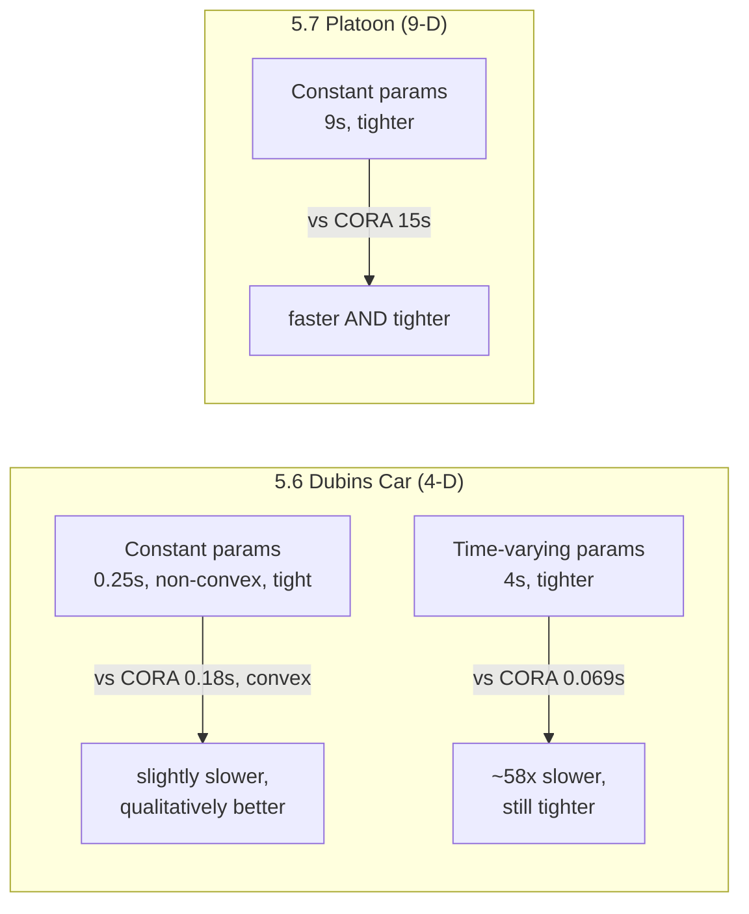

[[book-guidelines|↩ Back to guidelines]]

# Empirical Evaluation and Benchmarks

## Why a paper about set representations needs an experiments section at all

Everything up to this point in the paper — polynomial zonotopes, `mergeID`/`fresh`/`eval`, the matrix-exponential enclosure, the homogeneous/particular decomposition, the multi-affine optimization machinery — is a *claim about tightness and scalability*, not yet evidence of it. A non-convex set representation is only worth the extra bookkeeping (exponent matrices, dependent-factor identifiers, the exact sum instead of Minkowski sum) if it actually produces tighter reachable sets than the convex alternative, and does so without becoming computationally infeasible. Two separate empirical questions are at stake, and the paper answers them with two separate experiment suites:

1. **Does dependency-preservation via polynomial zonotopes buy tighter enclosures than the zonotope method, and at what computational cost?** — Sections 5.6–5.7, benchmarked against CORA's zonotope method (Althoff et al. 2011a, 2011b).
2. **Does the multi-affine optimization algorithm from Section 6 (SplitMin/MinOneComponent, exploiting the factor dependency graph) actually outperform CORA's splitting-based approach at set operations like plotting, support computation, and intersection?** — Section 6.4, benchmarked against CORA v2024.1.3.

These are genuinely different comparisons: the first compares *reachability algorithms* (how you propagate the set forward through time), the second compares *post-hoc set operations* on an already-computed multi-affine zonotope (how you extract usable answers — a 2-D plot, a support value, an intersection test — from it). Keeping this distinction straight matters because the paper's two benchmark systems (Dubins car, vehicle platoon) get reused across both experiments for different purposes.

**What breaks without an empirical section like this.** A tighter *theoretical* enclosure is worthless in a verification pipeline if it takes orders of magnitude longer to compute — you'd just be trading spurious counterexamples for a tool nobody can afford to run. Conversely, a fast method that's no tighter than the existing convex approach isn't a contribution at all. The benchmarks exist specifically to rule out both failure modes: they report wall-clock time *alongside* accuracy, every single time, rather than reporting one without the other.

## Part 1 (Sections 5.6–5.7): reachability algorithm vs. CORA's zonotope method

### 5.6 — Dubins car: does non-convexity actually show up, and is it worth capturing?

The Dubins car is the running example threaded through the whole paper (it's literally Figure 1's illustration of the "four cases of linear systems"). Per (Bak and Tran, 2022, Sec. 2.2) its dynamics reduce to a four-dimensional *linear parametric system* — i.e., exactly the setting Sections 4–5 were built for. The experiment runs two variants:

**Constant uncertain parameters** (time horizon $t_{\text{end}} = 2\text{s}$, initial state $X_0 = [0\ 0\ 0\ 10\,\text{m/s}^{-1}]$):

| | Method | Settings | Time |
|---|---|---|---|
| This paper | Alg. 1 (polynomial zonotope) | single time step, $\kappa = 60$ Taylor terms, order $\rho_d = 60$ | 0.25s |
| CORA | zonotope method (Althoff et al. 2011a) | $\Delta t = 0.05\text{s}$, $\kappa = 6$, order $\rho_d = 100$ | 0.18s |

The headline result (Fig. 8) is qualitative before it's quantitative: the polynomial-zonotope approach *tightly captures the non-convexity* of the true reachable set, while the zonotope method — being convex by construction — produces "a large convex over-approximation." Note the computational framing here: this paper's approach needs only **one time step** for the entire 2-second horizon (because, per the paper's Section 5.3 point about linear time-invariant systems, a single polynomial zonotope with enough Taylor terms can represent the reachable set over the whole horizon at once), whereas CORA's zonotope method needs 40 time steps ($\Delta t = 0.05\text{s}$ over 2s) to get its tightest result. Despite doing far less incremental work, this paper's method is only marginally slower (0.25s vs. 0.18s) — a small price for a qualitatively different (non-convex, tight) answer.

**Time-varying uncertain parameters** (reduced horizon $t_{\text{end}} = 1\text{s}$, "since reachability analysis is more challenging in this case"):

| | Method | Settings | Time |
|---|---|---|---|
| CORA | zonotope method (Althoff et al. 2011b) | $\Delta t = 0.05\text{s}$, $\kappa = 4$, $\rho_d = 30$ | 0.069s |
| This paper | Alg. 2 (Sec. 5.1) | $\Delta t = 0.05\text{s}$, $\kappa = 6$, $\rho_d = 80$ | 4s |

Here the trade-off is explicit and the paper doesn't dodge it: this method is **~58x slower** than CORA on this instance, because the time-varying case forces the state-transition-matrix enclosure of Section 5.1 to redo work every step rather than exploiting the single-polynomial-zonotope shortcut available to the time-invariant case. In exchange, Fig. 9 shows an enclosure that is "in most regions more accurate," and — notably — still captures some of the true non-convexity, where CORA's zonotope method yields "only... a very rough convex enclosure." The paper is candid that accuracy and speed trade off against each other differently in the time-varying case than in the constant-parameter case; this asymmetry is itself useful information for a practitioner deciding which method to reach for.

**What breaks without reporting both cases separately.** If the paper only reported the constant-parameter result, a reader would wrongly conclude the method is "basically free" relative to CORA. The time-varying result is the honest complement: dependency-preservation is not free when the abstraction has to be rebuilt every time step, and the paper's own numbers say so.

### 5.7 — Vehicle platoon: does the approach scale past a toy example?

The Dubins car is 4-dimensional; to test scalability the paper moves to the **PLAA01-BND42 instance of the 9-dimensional platoon benchmark** from the 2021 ARCH competition (Althoff and et al. 2021, Sec. 3.7) — four vehicles in a platoon, with the safety property being that all vehicles maintain a **42m safe distance**, even under a modeled *communication loss*. This is encoded as a single reachability problem: the parametric system is built to enclose *both* the with-communication and without-communication dynamics simultaneously, and the platoon's uncertain input is the lead vehicle's acceleration. The paper modifies the original ARCH benchmark to use *constant* rather than time-varying parameters, keeping this comparison in the setting where Section 5.6 showed the biggest speed advantage.

| | Method | Settings | Time |
|---|---|---|---|
| CORA | zonotope method (Althoff et al. 2011a) | — | 15s |
| This paper | Alg. 1 | $\Delta t = 0.036\text{s}$, $\kappa = 6$, $\rho_d = 50$ | 9s |

This is the paper's cleanest win in Part 1: **faster and tighter simultaneously** — 9s vs. 15s, with Fig. 10 showing the polynomial-zonotope enclosure "significantly tighter" than CORA's on a real 9-dimensional system, verified against random simulation traces plotted alongside the two enclosures and the 42m safety threshold. The paper's own summary line is blunt about what this is meant to establish: "our approach is therefore both faster and more accurate than the existing state of the art reachability tool" — for the constant-parameter, higher-dimensional regime specifically.

## Part 2 (Section 6.4): does the multi-affine optimization algorithm beat splitting?

Section 6.3's SplitMin/MinOneComponent algorithm was motivated by a specific complaint about the splitting-based approach CORA uses for polynomial-zonotope operations (2-D plotting, support computation, intersection checking): splitting a non-convex set into a union of zonotopes gets *arbitrarily expensive* as you demand more accuracy, without a guarantee that the extra cost buys proportional accuracy gains. Section 6.4 exists to demonstrate exactly that imbalance, twice — once visually, once numerically — and to show the graph-decomposition alternative avoids it.

### Experiment 1 — 2-D plotting of the Dubins car time-point set (visual)

This reuses the *same* time-varying-parameter Dubins-car reachable set from Fig. 9, but now the question is "how do you actually render/query a 2-D projection of this non-convex polynomial zonotope?" rather than "how do you compute it?" — a downstream operation, not the propagation itself.

- **CORA's built-in splitting plot**, at 60 splits, takes **over 2 hours** (Fig. 11) and *still* yields a loose over-approximation.
- **This paper's approach** instead treats the time-point set as a **multi-affine zonotope** (justified by Section 6.1's independence argument) and applies the Kamenev-method supporting-hyperplane optimization from Section 6.3 (tolerance $10^{-7}$) to get a **convex** enclosure directly — then intersects that convex contour with a much cheaper CORA splitting pass at only **20 splits**, combining the two to sharpen the corners the pure convex hull would round off.
- **Total time: 1063s** (~18 minutes) — over 6x faster than CORA's 60-split plot, while (per Fig. 14) visibly tighter.

The point of *combining* rather than replacing CORA's splitting entirely is instructive: the multi-affine optimization gives you the convex hull essentially "for free" relative to brute-force splitting, and you only need a cheap, low-split-count splitting pass on top to recover the non-convex detail the pure convex hull can't represent. This is the paper's own worked illustration of the remark from Section 6.2 that the two techniques "can be combined... to make the single polynomial zonotope split method more effective."

### Experiment 2 — support-function computation on a 5-D benchmark (numerical)

The first experiment makes a visual argument on one system; the second generalizes it numerically across **six test cases** to show the diminishing-returns problem is not a Dubins-car artifact. The setup: a different 5-D time-varying-parameter benchmark (Sec. 5.1 of Althoff et al. 2011a), reachability analysis via Algorithm 2 with a high zonotope order of 500, taking the *third* time-point reachable set and reducing it to a polynomial zonotope with **495 dependent generators, 5 independent generators, and 96 dependent factors** — genuinely large, not a toy — then projecting to 2 dimensions (a step the paper is careful to note doesn't undercut the scalability claim, since projecting onto a direction is inherent to any optimization-based support computation).

Six directions are found via the incremental Kamenev method (tolerance $10^{-2}$), and for each direction the paper compares:
- CORA's splitting-based support-function computation at 10, 20, and 30 splits, and
- this paper's multi-affine optimization, which — because multi-affine optimization always finds the *exact* global optimum (Section 6.3's corner-of-the-box argument) — is used as the ground-truth $f^*$ against which CORA's relative error $\frac{|f - f^*|}{|f^*|}$ is measured.

**Table 1 (paraphrased) — relative error / running time by split count, six cases:**

| Method | Case 1 | Case 2 | Case 3 | Case 4 | Case 5 | Case 6 |
|---|---|---|---|---|---|---|
| 10 splits | 0.41% / 0s | 0.60% / 1s | 0.49% / 1s | 0.98% / 0s | 0.74% / 1s | 0.79% / 0s |
| 20 splits | 0.36% / 9s | 0.54% / 54s | 0.49% / 344s | 0.88% / 43s | 0.72% / 358s | 0.64% / 330s |
| 30 splits | 0.34% / 227s | 0.52% / 5818s | 0.49% / 3087s | 0.83% / 1156s | *exceeds limit* | 0.59% / 521s |
| **Ours** | **0% / 16s** | **0% / 16s** | **0% / 15s** | **0% / 16s** | **0% / 15s** | **0% / 15s** |

Three things jump out, and the paper draws all three explicitly:

1. **Diminishing returns are severe.** Going from 10 to 30 splits in Case 2 multiplies running time by roughly *5800x* (1s → 5818s) for an error improvement of only 0.6% → 0.52% — a 0.08-point gain bought at nearly 100 minutes of extra compute. Case 5 doesn't even finish at 30 splits ("exceeds limit").
2. **This paper's method is both exact and roughly constant-time** (~15–16s) regardless of the underlying case's difficulty for CORA — because it isn't searching a combinatorial split tree, it's solving the box-corner optimization exploited by the factor dependency graph's connected-component decomposition (Section 6.3).
3. **The comparison is apples-to-apples on correctness**, not just speed: because multi-affine optimization is provably exact at the box corners (Section 6.3's "the optimal value must occur on one of the corners" argument, backed by the fact that a multi-affine polynomial's partial derivative along each variable can't change sign), this paper's numbers serve as *the ground truth* the CORA numbers are measured against — the comparison isn't "which is more accurate" in some fuzzy sense, it's "how far is the approximate method from the exact one, and at what cost."

**What breaks without Experiment 2.** Experiment 1 alone is a single, cherry-pickable anecdote — reasonable skepticism would ask "does this generalize, or did you find one favorable case?" The 5-D benchmark with six directions and three split counts is the paper's answer: the diminishing-returns pattern (large marginal time cost, small marginal accuracy gain) repeats across every one of the six cases, which is what licenses the paper's general claim in Section 6's introduction rather than just a claim about the Dubins car specifically.

## Reading the two experiment suites together

$$
\underbrace{\text{Sec. 5.6–5.7: algorithm-level comparison}}_{\text{propagate the reachable set forward}} \quad\text{vs.}\quad \underbrace{\text{Sec. 6.4: operation-level comparison}}_{\text{query an already-computed set}}
$$

Part 1 is testing the paper's *central* contribution (dependency-preserving propagation via the homogeneous/particular decomposition and the exact sum) against the pre-existing convex baseline, on the metric that matters for reachability analysis itself: is the reachable set tight enough, and fast enough, to prove or refute a safety property? Part 2 is testing the paper's *journal-extension* contribution (multi-affine optimization exploiting the factor dependency graph) against a different pre-existing baseline (CORA's generic splitting), on the metric that matters once you already have a tight reachable set and need to *do something* with it — plot it, query its support, check an intersection. Both suites follow the same evidentiary discipline: report accuracy and time together, use the same competitor toolbox (CORA) throughout for fairness, and be explicit about the one case (time-varying Dubins car, Sec. 5.6) where the paper's own method is slower, rather than only showcasing favorable results.

## Where this leads

This section is the paper's evidentiary payoff, not a source of new machinery — nothing here is a prerequisite for another topic in the book. What it *validates* is the two Focus-Area-relevant threads this book otherwise carries: the **static analysis / reachability analysis** claim that dependency-preserving, non-convex set propagation genuinely tightens verification results relative to convex over-approximation (the core argument for why a Hoare-style or invariant-generation pipeline built on abstract interpretation should prefer a non-convex domain when the underlying dynamics are genuinely non-convex), and the **SAT/SMT/CSP** claim that exploiting problem structure (here, a factor dependency graph and its minimum vertex cuts) can convert an NP-complete combinatorial optimization into something practically constant-time on real instances — the same move a CSP kernel doing domain/lattice propagation over structured constraint graphs would want to make when brute-force corner enumeration is otherwise unavoidable.
