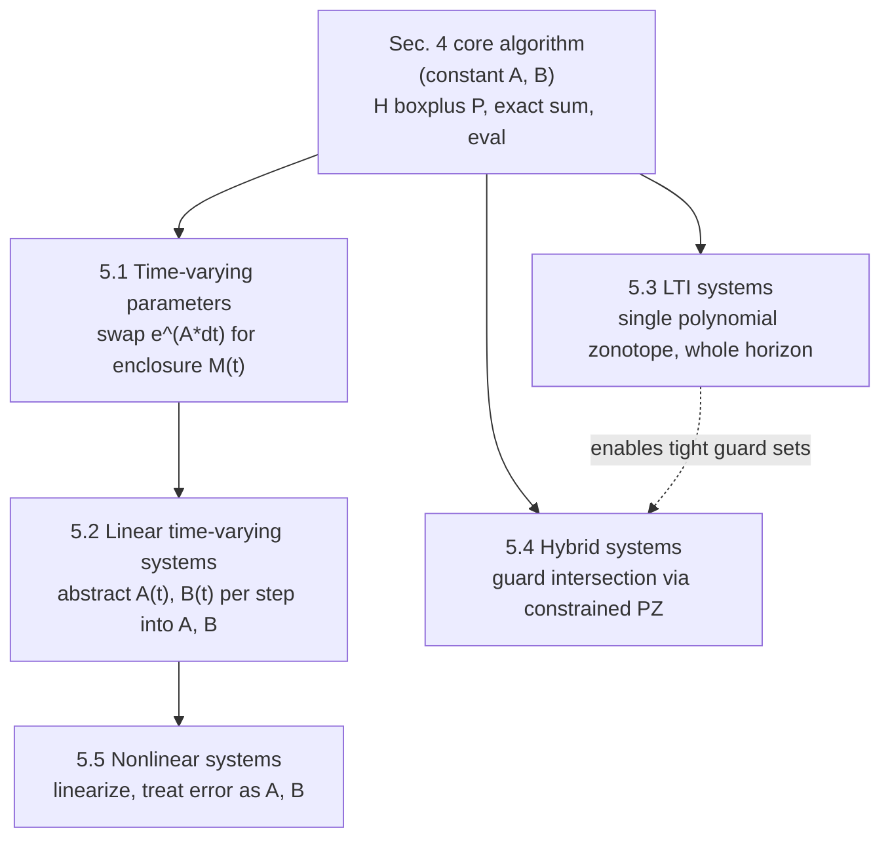

[[book-guidelines|↩ Back to guidelines]]

# Extensions of the Core Reachability Algorithm

## Why Section 4 alone isn't the paper's whole point

[[Reachability-Analysis-for-Linear-Systems-with-Uncertain-Parameters|Section 4]] built a genuinely tight reachability algorithm — but only for one narrow case: constant uncertain parameters ($A \in \mathcal{A}$, $B \in \mathcal{B}$ fixed for all time). Real systems are rarely that cooperative. Parameters drift over time, dynamics are outright nonlinear, and safety questions often hinge on what happens when a trajectory crosses into a *different* region of behavior (a hybrid mode switch). If the machinery from Section 4 — the homogeneous/particular split, the exact sum $\boxplus$, the `fresh`/`eval` discipline for tracking dependent factors — only worked for the constant-parameter case, it would be an elegant but narrow result.

Section 5's job is to show the opposite: every one of these harder cases can be reduced to *the same machinery*, just with a different enclosure standing in for the state-transition operator $e^{A\Delta t}$. This is the paper's real argument for generality — not five independent algorithms, but one algorithm with a pluggable propagator.



## 5.1 — Time-varying parameters: replacing $e^{A\Delta t}$ with an enclosure $\mathcal{M}(t)$

**What breaks without this.** Section 4's propagation step multiplies the homogeneous and particular solutions by the *numerical* matrix exponential $e^{A\Delta t}$ at every time step — but that presumes $A$ is a single fixed matrix you can exponentiate. If the true system matrix $A(t)$ is itself a function of time (Case IV in the paper's taxonomy), there is no single $e^{A\Delta t}$ to multiply by; you'd need the state-transition matrix of a genuinely time-varying linear ODE, which in general has no closed form.

The fix is to stop trying to compute the state-transition matrix exactly and instead compute a *sound enclosure* of it, $\mathcal{M}(t)$, and multiply by that set instead of a single matrix. Citing Althoff et al. (2011b, Thm. 1):

$$\mathcal{M}(t) \subseteq \bigoplus_{i=0}^{\kappa} \mathcal{M}_i(t) \oplus \mathbf{E}_t, \qquad \mathcal{M}_i(t) = \frac{t^i}{i!}\,\mathrm{conv}\big(\mathrm{fresh}^i(\mathcal{A})\big) \tag{14}$$

Two pieces of notation are doing real work here and are easy to misread on a first pass:

- $\mathrm{fresh}^i(\mathcal{A}) = \mathrm{fresh}(\mathcal{A})\cdots\mathrm{fresh}(\mathcal{A})$ ($i$ times) is emphatically **not** the same as $(\mathrm{fresh}(\mathcal{A}))^i$. The paper's own footnote flags this: $\mathrm{fresh}^i(\mathcal{A})$ means "apply `fresh` to $\mathcal{A}$, $i$ separate times, each producing a *differently*-identified copy," so that the product of these $i$ copies represents $i$ *independent* draws from $\mathcal{A}$ multiplied together — which is exactly what you want when modeling a time-varying matrix that can be a different element of $\mathcal{A}$ at each instant. Using $(\mathrm{fresh}(\mathcal{A}))^i$ (one fresh copy, raised to a power) would instead model a matrix that is constant-but-uncertain, which is the *wrong* uncertainty structure for a time-varying parameter.
- $\mathrm{conv}(\mathcal{A}) = \{\lambda A_1 + (1-\lambda)A_2 \mid A_1, A_2 \in \mathcal{A}, \lambda \in [0,1]\}$ is the convex hull of a matrix *set* (Eq. 15) — needed because unlike the constant-parameter case, here you must account for the matrix "in between" two different instantiations of $\mathcal{A}$ at two nearby times.

**Proposition 4 (Multiplication with Convex Hull).** Computing $\mathrm{conv}(\mathcal{A})\,\mathcal{PZ}$ reduces to an operation you already have (Proposition 1, matrix-zonotope multiplication — see [[Dependency-Preserving-Set-Operations]]):

$$\mathrm{conv}(\mathcal{A})\,\mathcal{PZ} = \mathcal{A}\,\mathcal{L}_1\,\mathcal{PZ} \;\boxplus\; \mathrm{fresh}(\mathcal{A})\,\mathcal{L}_2\,\mathcal{PZ}, \qquad \mathcal{L}_1 = \langle 0.5I_n, 0.5I_n, \mathrm{uniqueID}(1)\rangle_{MZ},\ \mathcal{L}_2 = I_n - \mathcal{L}_1 \tag{16}$$

The proof is a direct unfolding of the convex-hull definition: $\mathrm{conv}(\mathcal{A}) = \lambda A_1 + (1-\lambda)A_2$ becomes $A\,\mathcal{L}_1 \boxplus \mathrm{fresh}(A)\,\mathcal{L}_2$, where $\mathcal{L}_1$ is a matrix zonotope whose single factor $\lambda \in [0,1]$ plays the role of the convex-combination weight. Notice the by-now-familiar pattern: `fresh` is applied to $\mathcal{A}$ (to force $A_1, A_2$ to be *independent* draws, as the convex-hull definition demands), while the exact sum $\boxplus$ is used to combine the two terms — because $\mathcal{L}_1$ and $\mathcal{L}_2 = I_n - \mathcal{L}_1$ *are* dependent on each other (they share the same $\lambda$, just complementary), and using Minkowski sum here would sever a correlation that is actually load-bearing for correctness. This is the same "merge exactly the real dependencies, sever exactly the fake ones" discipline from Section 4, now applied one level up.

Plugging Eq. 14 and Proposition 4 into the homogeneous-solution construction from Section 4 gives the time-varying homogeneous solution for the first interval (Eq. 17–18), and an analogous construction (Eq. 19–20, citing Althoff et al. 2011b, Thm. 2) gives the time-varying particular solution. **Algorithm 2** then mirrors Algorithm 1 almost exactly, with $\mathcal{M}(\cdot)$ standing in wherever Algorithm 1 used $e^{A\Delta t}$:

```
Algorithm 2 — Reachability algorithm (time-varying parameters)
Require: matrix zonotopes A, B (time-varying); X0; U; t_end; Δt; κ; ρ_d
Ensure: R([0, t_end])

 1: H(τ0) ← M(τ0) X0                                    [Eq. 18]
 2: P(τ0) ← Eq. 20;  P(Δt) ← Eq. 19
 3: R(τ0) ← H(τ0) ⊞ P(τ0)
 4: for k = 1 .. (t_end/Δt) − 1:
 5:     R(τk) ← reduce( M(Δt) R(τk−1) ⊕ P(Δt), ρ_d )
 6: end for
 7: R([0, t_end]) ← ∪_k R(τk)
```

The paper explicitly flags one structural simplification worth noticing: Algorithm 2 combines the propagated interval and the fresh per-step particular solution with an ordinary Minkowski sum $\oplus$ at Line 5, not $\boxplus$. This is *not* a regression in precision by accident — it's forced by necessity. Because $\mathcal{M}(\Delta t)$ already had to destroy dependency on $\mathcal{A}$ and $\mathcal{B}$ internally (via the `fresh` calls baked into Eq. 14 and Proposition 4, needed to model a matrix that can be a genuinely different draw at each instant), there is no live $\mathcal{A}/\mathcal{B}$-dependency left between $R(\tau_{k-1})$ and $P(\Delta t)$ for $\boxplus$ to exploit — so the simpler propagation scheme costs nothing.

## 5.2 — Linear time-varying systems: turning $A(t), B(t)$ into per-step uncertainty

Section 5.1 assumed you already had matrix *zonotopes* $\mathcal{A}, \mathcal{B}$ describing time-varying uncertainty. But what if you start instead from an honest time-varying linear system

$$\dot{x}(t) = A(t)\,x(t) + B(t)\,u(t), \qquad A: \mathbb{R}_{\ge 0} \to \mathbb{R}^{n\times n},\ B: \mathbb{R}_{\ge 0} \to \mathbb{R}^{n\times m}$$

with no uncertainty at all, just a matrix that genuinely changes as a known function of $t$? The move here is a *reduction*, not a new algorithm: for each reachability time step $\tau_k$, over-approximate the range of $A(\cdot)$ and $B(\cdot)$ *during that interval* as matrix sets,

$$\mathcal{A} = \{A(t) \mid t \in \tau_k\}, \qquad \mathcal{B} = \{B(t) \mid t \in \tau_k\} \tag{21}$$

which turns the known-but-time-varying system into a *parametric* system $\dot{x}(t) \in \mathcal{A}\,x(t) + \mathcal{B}\,u(t)$ valid for that one step — precisely the object Section 5.1's Algorithm 2 already knows how to handle. The paper computes the tight enclosure in Eq. 21 using **range bounding via affine arithmetic** (de Figueiredo and Stolfi, 2004), then re-derives $\mathcal{A}, \mathcal{B}$ fresh at every step and re-invokes Algorithm 2.

The conceptual payoff is worth stating plainly: *any* time-varying linear system, however wild $A(t)$'s behavior, becomes tractable the moment you're willing to accept "uncertain-but-piecewise-bounded" instead of "known exactly." This is the exact same over-approximation move a static analyzer makes when it widens a variable's exact runtime value into an interval or a lattice element — precision is deliberately sacrificed within a step to make each step tractable, while soundness (the true $A(t), B(t)$ pair is always contained in the bound) is preserved.

## 5.3 — Linear time-invariant systems: one polynomial zonotope for the whole time horizon

This subtopic looks at first like a step *backward* — LTI systems ($\dot x = Ax + Bu$, no uncertainty on $A$ or $B$ at all) are the oldest, most-studied case in reachability analysis, so why does this paper have anything new to say about it? The answer is about **representation size**, and it's arguably the single cleanest theoretical result in the paper.

**What existing methods do, and why they need a small $\Delta t$.** The paper surveys (Forets and Schilling, 2022) two dominant strategies for the homogeneous time-interval solution of an LTI system: (a) optimization-based methods (Frehse and et al., 2011), and (b) computing the convex hull of the two time-*point* solutions at the interval's endpoints, plus a correction term for trajectory curvature (Girard, 2005; Le Guernic and Girard, 2010). Both families are only accurate when $\Delta t$ is small — the curvature-correction approach in particular degrades badly over long intervals, because a straight-line interpolation between endpoints increasingly misrepresents a curving trajectory as the interval widens.

**What this paper does instead.** Since there's no uncertainty on $A$ at all in the LTI case, the homogeneous time-interval solution is just $\mathcal{H}(\tau_0) = e^{AT}\mathcal{X}_0$ — a direct application of Proposition 3 (multiplication with the matrix exponential, [[Matrix-Exponential-Propagation]]) with $A$ treated as a degenerate ("matrix zonotope with zero generators") set. No curvature correction, no case-specific derivation — just the same machinery, unchanged.

**Lemma 1 — the actual claim, and why it matters.** Fix any target error bound $\psi > 0$. The number of Taylor terms $\kappa$ needed to keep the over-approximation error of $\mathcal{H}([0,\Delta t]) = e^{AT}\mathcal{X}_0$ below $\psi$ **grows only linearly in $\Delta t$**. The proof works from the exact form of the remainder term (Eq. 22–23, the same interval-matrix bound $\mathbf{E}$ from Proposition 3):

$$\mathbf{E} = \langle -\mathbf{1}, \mathbf{1}\rangle_{IM}\cdot \frac{\|A\|_\infty^{\kappa+1}\,\Delta t^{\kappa+1}}{(\kappa+1)!}\cdot\frac{1}{1-\epsilon}, \qquad \epsilon = \frac{\|A\|_\infty\,\Delta t}{\kappa+2} < 1$$

and, via a Stirling's-approximation argument, shows that choosing $\kappa$ proportional to $\|A\|_\infty \Delta t$ (Eq. 24) is *sufficient* to drive the error below any target $\psi$ — i.e. the required $\kappa$ doesn't need to grow with $\Delta t^2$, or exponentially, or anything worse; linear suffices. Since the resulting polynomial zonotope's number of dependent generators scales as $(\kappa+1)h$ (where $h$ is $\mathcal{X}_0$'s own generator count), the *representation size* needed for a fixed accuracy therefore also only grows linearly with $\Delta t$.

**Why this is a big deal in practice.** It means $\Delta t$ can be made *very large* — in the paper's Example 3, the entire time horizon $t_{\mathrm{end}} = 5\mathrm{s}$ is represented by a **single** polynomial zonotope, with no per-step propagation loop needed at all. This is a genuinely different computational regime from every incremental method (Section 4's own Algorithm 1 included): instead of accumulating error and representation size across many small steps, you pay a one-time, linearly-scaling cost for one big step.

## 5.5 — Nonlinear systems: linearization, and the abstraction error as uncertain parameters

**What breaks without this.** Everything built so far — homogeneous/particular splitting, matrix exponentials, exact sums — is fundamentally *linear* machinery. A general nonlinear system $\dot x(t) = f(x(t), u(t))$ has no matrix exponential, no closed-form flow map, nothing for Proposition 3 to act on.

The paper's answer is the standard reachability-analysis move — **linearize, and don't lie about the error**. For each time step $\tau_k$, take a first-order Taylor expansion of $f$ around expansion points $x_l, u_l$:

$$\forall t \in \tau_k:\ \dot x(t) \in f(x_l, u_l) + \mathcal{A}\big(x(t) - x_l\big) + \mathcal{B}\big(u(t) - u_l\big), \qquad \mathcal{A} = \Big\{\tfrac{\partial f}{\partial x}(x,u) \,\Big|\, x \in \mathcal{R}(\tau_k), u \in \mathcal{U}\Big\},\ \mathcal{B} = \Big\{\tfrac{\partial f}{\partial u}(x,u)\Big\} \tag{26}$$

The crucial design choice: instead of discarding the higher-order Taylor remainder as an unrecoverable error term, the paper folds it directly into the **Jacobian sets** $\mathcal{A}, \mathcal{B}$ themselves, by letting $x, u$ range over the *entire* time-interval reachable set $\mathcal{R}(\tau_k)$ and input set $\mathcal{U}$ (not just the expansion point). The linearization error becomes, quite literally, *uncertain parameters* of exactly the kind Sections 4–5.1 already know how to propagate. This is a nice unification: "nonlinear system" reduces to "linear system with uncertain, time-varying parameters" — no new propagation algorithm needed, only a new way of *producing* $\mathcal{A}, \mathcal{B}$. Expansion points are chosen heuristically as $x_l = x_c + 0.5\Delta t\, f(x_c, u_c)$, $u_l = u_c$ (centers of the current estimate and of $\mathcal{U}$), and $\mathcal{A}, \mathcal{B}$ are tightly enclosed by matrix zonotopes using the same affine-arithmetic range bounding as Section 5.2.

### The mutual-dependence problem, and how iterative bloating breaks the cycle

Here's the catch, and it's a genuine circularity, not a mere technicality: computing $\mathcal{A}, \mathcal{B}$ in Eq. 26 requires knowing $\mathcal{R}(\tau_k)$ (the Jacobian range depends on where the trajectory could be) — but computing $\mathcal{R}(\tau_k)$ via Algorithm 2 requires already having $\mathcal{A}, \mathcal{B}$. Neither side of this can go first.

The paper resolves it with a fixed-point iteration (following Althoff, 2013), and the logic is worth spelling out step by step because it's a pattern that recurs constantly in reachability/abstract-interpretation work whenever an abstraction depends on the very quantity it's approximating:

1. Start from an **estimate** $\widehat{\mathcal{R}}(\tau_k)$ — initially, just the final reachable set from the previous time step, $\mathcal{R}(k\Delta t)$.
2. Use $\widehat{\mathcal{R}}(\tau_k)$ to compute $\mathcal{A}, \mathcal{B}$ via Eq. 26.
3. Use those $\mathcal{A}, \mathcal{B}$ to run Algorithm 2 and obtain an actual $\mathcal{R}(\tau_k)$.
4. **Check containment**: is $\mathcal{R}(\tau_k) \subseteq \widehat{\mathcal{R}}(\tau_k)$? If yes, you're done — the estimate was self-consistent, so the Jacobian ranges computed from it were valid bounds on the true trajectory, and $\mathcal{R}(\tau_k)$ is a *guaranteed* enclosure.
5. If the containment fails, the estimate was too tight (the real reachable set escaped it). **Bloat** the estimate outward around its own center — $\widehat{\mathcal{R}}(\tau_k) \leftarrow x_c + \eta\,(\mathcal{R}(\tau_k) - x_c)$ for a bloating factor $\eta > 1$ — and go back to step 2.

This is the reachability-analysis analogue of a widening operator in abstract interpretation: rather than proving the fixed point exists analytically, you iterate an operator that's guaranteed to only grow (never shrink) the candidate set, and stop the moment containment holds — at which point what you have is, by construction, a *post-fixed point* of the concrete semantics, i.e. a sound over-approximation. One implementation wrinkle: since containment checks and affine arithmetic aren't directly defined on polynomial zonotopes, the paper performs step 4's containment check and step 2's range bounding on an **interval or oriented-hyper-rectangle enclosure** of $\mathcal{R}(\tau_k)$ rather than the polynomial zonotope itself — a small, deliberate loss of precision at exactly the point where the algorithm needs a cheap, decidable check rather than a maximally tight one.

Because $\mathcal{A}, \mathcal{B}$ are recomputed fresh at every time step (they depend on $\mathcal{R}(\tau_k)$, which changes step to step), the nonlinear extension must use **Algorithm 2** (the time-varying-parameter version), never the constant-parameter Algorithm 1 — even though at any single step, within that step, the linearized system briefly looks like a constant-uncertain-parameter problem.

The paper demonstrates this on the Lotka–Volterra predator-prey system ($\dot x_1 = 3x_1 - 3x_1x_2$, $\dot x_2 = x_1x_2 - x_2$, Example 4), producing a genuinely non-convex reachable-set enclosure that a linearize-and-Minkowski-sum approach could not represent as tightly.

## 5.4 — Hybrid systems: guard intersection without a "unification step"

**The problem hybrid reachability actually has to solve.** A hybrid system partitions the state space into regions with different dynamics, separated by **guard sets** — e.g. $\mathcal{G} = \{x \in \mathbb{R}^3 \mid x^{(2)} - 0.2x^{(3)} = 1.1\}$, the example the paper uses (Eq. 25). The standard reachability recipe is: propagate the continuous reachable set until it has fully crossed a guard, intersect with the guard to get the initial set for the next region, repeat. That sounds simple, but the paper spells out exactly where it becomes expensive:

- Continuous reachability generally needs a **small** $\Delta t$ for accuracy, so *many consecutive time-interval sets* will typically intersect the guard, not just one.
- If each of these intersections were separately propagated as its own initial set for the next region, you'd be solving many reachability sub-problems instead of one — and Duggirala and Bak (2019) show the number of these parallel sets can grow **exponentially** over a long time horizon with several guard crossings.
- To avoid that blow-up, existing methods (Girard and Le Guernic, 2008; Althoff and Krogh, 2011, 2012) first **unite** all the guard-intersecting sets into one convex enclosure — template polyhedra, zonotopes, or zonotope bundles — before continuing. This is the "unification step" the paper's title for this trick refers to. But as Figure 6 in the paper shows, even the guard intersection of a *simple linear* system's reachable set with a *linear* guard is often highly non-convex — so this unification step, however necessary for tractability, throws away exactly the shape information the rest of the paper worked hard to preserve.

**Why Section 5.3 is the key that unlocks this.** Recall from Section 5.3 that for an LTI system, this paper's approach can represent the *entire* time horizon's reachable set with a **single polynomial zonotope** — there's no "many consecutive interval sets" to begin with, because there's no propagation loop chopping the horizon into small intervals in the first place. That directly eliminates the exponential blow-up problem: if there's only ever one set, there's nothing to unify.

**Exact intersection via constrained polynomial zonotopes.** Even with a single set, you still need to *compute* its intersection with the guard — and a plain polynomial zonotope has no native way to represent "the subset satisfying this additional constraint." The paper's fix is to convert the reachable-set polynomial zonotope into a **constrained polynomial zonotope** (Kochdumper and Althoff, 2020): a polynomial zonotope augmented with an explicit constraint on its dependent factors, which can represent the *exact* intersection with a guard set as a single object — including **nonlinear** guard sets expressible as polynomial level sets (Kochdumper, 2022, Prop. 3.2.24), not just the linear guard in the running example. Because constrained polynomial zonotopes share the same underlying algebra (center, generators, exponent matrix, dependent identifiers) as ordinary polynomial zonotopes, the paper notes that the reachability algorithm developed in this paper "can easily be extended" to operate on them directly — the constrained set becomes the initial set for the next hybrid region, propagated the same way. A final practical point: checking *whether* a polynomial zonotope intersects a guard at all (before committing to computing the exact intersection) can be done efficiently via a polynomial-zonotope refinement approach (Bak and et al., 2022) rather than by brute-force set intersection.

The throughline for this whole subsection is the same one running through the entire paper: **preserving structure (non-convexity, time-dependency) upstream removes the need for a downstream approximation (guard-set unification) that would have thrown that structure away anyway.**

## Where this leads

Every extension in this section is, mechanically, "reuse the homogeneous/particular split and the exact-sum discipline from Section 4, and change what stands in for the propagator": Section 5.1 swaps in an *enclosure* $\mathcal{M}(t)$ for the numerical $e^{A\Delta t}$; Section 5.2 reduces a known time-varying system to Section 5.1's uncertain-parameter form; Section 5.3 shows the propagator doesn't even need to be applied incrementally when there's no uncertainty on $A$ at all; Section 5.5 makes the propagator's inputs ($\mathcal{A}, \mathcal{B}$) themselves the output of a fixed-point computation over the linearization error; and Section 5.4 shows that once you can hold a whole time horizon in one set (Section 5.3's insight), a historically painful operation (guard intersection) becomes exact rather than convexified. The paper's Section 6 (Multi-Affine Zonotope Optimization) then exploits a structural fact about the polynomial zonotopes these algorithms *produce* — under a mild independence assumption, they're a restricted subclass called multi-affine zonotopes — to make downstream operations like plotting and support-function computation scale far better than generic polynomial-zonotope methods.

From the **`static-analysis`** focus area this book serves: the mutual-dependence resolution in Section 5.5 (estimate → linearize → check containment → bloat → repeat) is a textbook instance of computing a **least fixed point via a widening-like iteration** over an operator whose soundness comes from monotonically growing a candidate set until it's self-consistent — the exact same shape of argument used to justify widening operators in abstract-interpretation fixpoint computation for loop invariants (compute an estimate of the invariant, check whether one loop-body application still fits inside it, widen if not, repeat until stable). And Section 5.4's guard intersection is a clean concrete instance of **invariant generation across a mode switch**: the guard set plays the role of a transition condition between abstract states in a hybrid automaton, and computing the reachable set *at* the guard, exactly, is precisely the kind of precise cross-boundary reasoning that Hoare-style modular verification (pre/post-condition matching at a procedure or mode boundary) also depends on — sloppy convex over-approximation at a boundary condition is exactly where spurious verification failures creep in, whether the boundary is a hybrid-system guard or a loop/procedure interface.

## A note on grounding

As with [[Reachability-Analysis-for-Linear-Systems-with-Uncertain-Parameters|Section 4]], this material is control-theory/numerical-analysis machinery (Taylor linearization, Jacobian range bounding, matrix-set convex hulls, fixed-point iteration over sets) rather than a type-system or proof-theoretic construct, so forcing a Rust `trait` sketch or a Lean correspondence here would manufacture a misleading analogy rather than a useful one. The one piece of this section that *does* generalize directly to code you might actually write for the compiler/analyzer project is the **fixed-point iteration pattern** in Section 5.5 — "compute an abstraction from an estimate, check whether the result is contained in the estimate, widen and retry if not" is exactly the shape of a real widening-operator loop in an abstract interpreter, and is worth carrying forward as a design pattern even though the paper's own instance of it operates on hyper-rectangle enclosures of continuous states rather than a program's abstract lattice elements.
