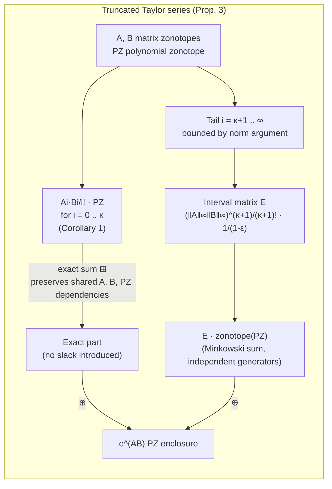

[[book-guidelines|↩ Back to guidelines]]

## Why you need to raise a *set* of matrices to the matrix exponential

The whole reachability problem in this paper reduces to one repeated operation. A linear system $\dot{x}(t) = Ax(t) + Bu(t)$ has the closed-form solution

$$\xi(A,B,t,x(0),u(\cdot)) = e^{At}x(0) + \int_0^t e^{A(t-s)}Bu(s)\,ds,$$

and every term in it — $e^{At}$, the integral — is an instance of "take a matrix exponential and apply it to a set." If $A$ were a single known matrix, $e^{At}$ is just a matrix you compute once (Padé approximation, scaling-and-squaring, whatever your linear-algebra library does) and multiply through. The entire premise of this paper, though, is that $A$ is *not* known — it ranges over an uncertain matrix zonotope $\mathcal{A}$, and the state and input range over polynomial zonotopes. So the object you actually need is

$$e^{\mathcal{A}t}\,\mathcal{PZ} = \Big\{\, e^{At}s \;\Big|\; A \in \mathcal{A},\, s \in \mathcal{PZ} \,\Big\},$$

a set-valued matrix exponential applied to a set-valued vector. There is no closed form for this. You cannot factor $e^{\mathcal{A}t}$ out as a single object and then multiply, because $e^{\mathcal{A}t}$ isn't a matrix — it's an infinite, uncountable family of matrices, one per $A \in \mathcal{A}$, and each one has its own infinite Taylor series. This section is entirely about how to build a computable, tight, over-approximating stand-in for that object.

**What breaks if you don't solve this precisely:** the crude fallback is to bound $\mathcal{A}$ by its worst case (say, its infinity norm) and treat $e^{\mathcal{A}t}$ as one big interval enclosure with no internal structure. You'd get a valid over-approximation, but every time step would multiply in fresh, uncorrelated slack, and the enclosure would balloon — the "wrapping effect" that plagues most reachability tools. The paper's fix is to keep the exponential's *own* internal series structure (dependencies between its Taylor terms, and between the exponential and whatever it's applied to) alive as far as possible, and only fall back to a genuine interval bound for the tail of the series that truly can't be computed exactly.

## Step 1: matrix-zonotope multiplication is the load-bearing primitive

Before you can even ask "what is $e^{\mathcal{A}t}$ times a polynomial zonotope," you need to know how to multiply a matrix *zonotope* (not yet an exponential — just a linear map with an uncertain matrix) by a polynomial zonotope, because the exponential will be built as a sum of powers of matrix zonotopes.

**Proposition 1 (Matrix Zonotope Multiplication).** Given a matrix zonotope $\mathcal{A} = \langle A^{(0)}, A^{(1)}, \dots, A^{(w)}, id_{mz}\rangle_{MZ} \subset \mathbb{R}^{m\times n}$ and a polynomial zonotope $\mathcal{PZ} = \langle c, G, [\,], E, id_{pz}\rangle_{PZ} \subset \mathbb{R}^n$ (no independent generators for now), their product is computed *exactly*:

$$\mathcal{A}\,\mathcal{PZ} = \Big\langle A^{(0)}c,\; [A^{(0)}G \;\; A^{(1)}c \;\dots\; A^{(w)}c \;\; A^{(1)}G \dots A^{(w)}G],\; [\,],\; [\hat E_1\; \hat E_2 \odot E_1 \dots E_w],\; \hat{id}\Big\rangle_{PZ}$$

The mechanism worth understanding, stripped of index bookkeeping: $\mathcal{A}\,\mathcal{PZ}$ is the set of all $As$ where $A = A^{(0)} + \sum_l \rho_l A^{(l)}$ and $s$ is whatever the polynomial zonotope describes. Multiplying out, each generator of $\mathcal{PZ}$ gets hit once by the center matrix $A^{(0)}$ and once more by *each* generator matrix $A^{(l)}$ — and that second family of terms is a *product* of the zonotope's factor $\rho_l$ with the polynomial zonotope's own dependent factors $\alpha_k$. A product of two independent uncertain scalars is exactly what an exponent matrix is for: instead of inventing a new symbol for $\rho_l\alpha_k$, you record it as "factor $\rho_l$ raised to the first power times factor $\alpha_k$ raised to whatever power it already had" — which is precisely why polynomial zonotopes, and not plain zonotopes, are the right carrier here. `mergeID` is the bookkeeping step that reconciles the two independent identifier lists ($id_{pz}$ for the zonotope's own factors, $id_{mz}$ for the matrix zonotope's factors) into one shared numbering before the exponents can be added together.

**Corollary 1 (Higher Order Multiplication)** is just repetition: $\mathcal{A}^k\,\mathcal{PZ}$ is $k$ applications of Prop. 1, i.e. $\mathcal{A}(\dots(\mathcal{A}(\mathcal{A}\,\mathcal{PZ})))$. This is the operation the Taylor series below will call once per term.

**Proposition 2** extends Prop. 1 to polynomial zonotopes that *do* have independent generators $G_I$. You can't multiply those exactly and stay in "dependent generator" form without inventing new identifiers for every independent factor (technically possible, but wasteful), so the paper instead treats the independent part as its own zero-centered zonotope $\mathcal{Z}_I = \langle 0, G_I\rangle_Z$, applies Prop. 1 to the dependent part alone, and recombines with an ordinary Minkowski sum:

$$\mathcal{A}\,\mathcal{PZ} \subseteq \big(\mathcal{A}\,\mathcal{PZ}_D\big) \oplus \big(\mathcal{A}\,\mathcal{Z}_I\big).$$

This is a genuine (if usually small) over-approximation — the independent generators are assumed small enough that losing their dependency on $\mathcal{A}$ doesn't hurt much in practice.

## Step 2: truncating the Taylor series without truncating the dependencies

Now the core result. The matrix exponential is *defined* by its Taylor series, so the natural way to compute $e^{\mathcal{A}\mathcal{B}}\mathcal{PZ}$ (the paper generalizes to the product of *two* uncertain matrices $\mathcal{A}, \mathcal{B}$, because that's what shows up when you fold together an uncertain state-transition matrix and an uncertain time interval — see below) is to expand the series and cut it off:

$$e^{\mathcal{A}\mathcal{B}} = \sum_{i=0}^{\infty} \frac{\mathcal{A}^i\mathcal{B}^i}{i!} = \sum_{i=0}^{\kappa} \frac{\mathcal{A}^i\mathcal{B}^i}{i!} + \underbrace{\sum_{i=\kappa+1}^{\infty}\frac{\mathcal{A}^i\mathcal{B}^i}{i!}}_{\text{tail}}.$$

The naive thing to do with the first $\kappa$ terms would be to compute each $\frac{\mathcal{A}^i\mathcal{B}^i}{i!}\,\mathcal{PZ}$ separately (via Corollary 1) and Minkowski-sum them together. **That would be a mistake, and it's the single most important design choice in this section.** Each term shares the *same* underlying uncertain matrices $\mathcal{A}$ and $\mathcal{B}$ and the *same* underlying set $\mathcal{PZ}$ — if $\mathcal{A}$ happens to take a large value on one particular "run," it takes that same large value in the $i=1$ term and the $i=2$ term and the $i=3$ term simultaneously. Minkowski sum forgets this and re-introduces a fresh, independent copy of the uncertainty into every term, which is exactly the kind of spurious slack that causes the wrapping effect described above. The fix is to combine the $\kappa$ terms with the **exact sum** $\boxplus$ instead, which — as established in the Dependency-Preserving Set Operations material — keeps a shared dependent factor shared instead of duplicating it:

$$\text{exact part} = \bigboxplus_{i=0}^{\kappa} \frac{\mathcal{A}^i\mathcal{B}^i}{i!}\,\mathcal{PZ}.$$

The tail, on the other hand, genuinely *can't* be tracked exactly — you'd need infinitely many terms — so it is bounded the honest way, with an interval matrix:

**Proposition 3 (Multiplication with Matrix Exponential).** Given matrix zonotopes $\mathcal{A}, \mathcal{B} \subset \mathbb{R}^{n\times n}$, a polynomial zonotope $\mathcal{PZ} \subset \mathbb{R}^n$, and a Taylor order $\kappa$ satisfying the convergence condition

$$\epsilon = \frac{\|\mathcal{A}\|_\infty\|\mathcal{B}\|_\infty}{\kappa+2} < 1,$$

the set $e^{\mathcal{A}\mathcal{B}}\mathcal{PZ}$ is tightly enclosed by

$$e^{\mathcal{A}\mathcal{B}}\,\mathcal{PZ} \subseteq \left(\bigboxplus_{i=0}^{\kappa}\frac{\mathcal{A}^i\mathcal{B}^i}{i!}\,\mathcal{PZ}\right) \oplus E\cdot\text{zonotope}(\mathcal{PZ}),$$

where the interval matrix

$$E = \langle -\mathbf{1}_{n\times n}, \mathbf{1}_{n\times n}\rangle_{IM}\;\frac{(\|\mathcal{A}\|_\infty\|\mathcal{B}\|_\infty)^{\kappa+1}}{(\kappa+1)!}\cdot\frac{1}{1-\epsilon}$$

bounds every term from $i=\kappa+1$ onward.

Notice how the proof is really nothing more than making the informal argument above precise: split the infinite sum at $\kappa$, note that the tail is a geometric-series-like remainder bounded by $\epsilon$ (hence the requirement $\epsilon<1$ — without it the bound on the infinite tail wouldn't even converge), replace the tail's exact (uncomputable) shape with an interval matrix $E$ that's guaranteed to contain it, and — since $E$ is now "just a bound" with no useful internal dependency structure left to preserve — accept the small remaining looseness of converting $\mathcal{PZ}$ to its tight enclosing zonotope (`zonotope(PZ)`, from the earlier operations set) and Minkowski-summing $E \cdot \text{zonotope}(\mathcal{PZ})$ in as ordinary independent generators. The paper is explicit that this is deliberate: since $E$ is expected to be small for large enough $\kappa$, it's cheap to fold into the independent-generator slack rather than trying to track its dependencies precisely.

This is a genuinely two-tier over-approximation strategy: **exact where it's cheap and correlated** (the first $\kappa$ terms, via exact sum), **interval-bounded where it's unavoidable** (the tail, via a norm bound). That's the general shape of essentially every abstract-interpretation transformer that mixes a relational domain with a fallback — track precisely what you can, widen only what you must.



## Where this actually gets used: the state-transition matrix and the time interval

Section 4 uses Prop. 3 for the single most important computation in the paper — the homogeneous solution $\mathcal{H}(\tau_0) = e^{\mathcal{A}T}\mathcal{X}_0$, where $T$ is the time interval $\tau_0 = [0,\Delta t]$ represented, cleverly, *as a matrix zonotope itself*:

$$\mathcal{T} = [0,\Delta t]\cdot I_n = \langle \bar T, \bar T, \text{uniqueID}(1)\rangle_{MZ}, \qquad \bar T = 0.5\,\Delta t\, I_n.$$

This is a small but important trick: instead of computing $e^{At}$ for a fixed time $t$ and then separately reasoning about how the answer varies as $t$ ranges over an interval, the interval $[0,\Delta t]$ is folded into the *same* uncertain-matrix-set formalism that already handles uncertain $A$. Prop. 3 with $\mathcal{B} := \mathcal{T}$ then computes $e^{\mathcal{A}\mathcal{T}}\mathcal{X}_0$ in one shot, and — because $\mathcal{T}$'s single generator carries a genuine dependent identifier — the resulting polynomial zonotope's dependence on "how far into this time step we are" survives as a *named factor* in the output, not just as an interval bound. That surviving dependency is what later lets the algorithm extract a reachable set at one exact time point $t$ inside the interval, via `eval`, rather than only ever knowing the reachable set for the whole interval at once — a capability the paper calls *time preservation*, and flags as the key advantage over prior work (Althoff et al., 2011a) that discards it.

## Convex hulls of matrix sets: the $L_1/L_2$ decomposition

The time-varying-parameter extension (Sec. 5.1) needs one more piece of Taylor-series machinery. When $A$ itself changes over the time step, the state-transition matrix is no longer $e^{At}$ for a single $A$, but an enclosure $\mathcal{M}(t)$ built from Taylor terms of the *convex hull* of an uncertain matrix set:

$$\text{conv}(\mathcal{A}) = \big\{\lambda A_1 + (1-\lambda)A_2 \mid A_1, A_2 \in \mathcal{A},\ \lambda \in [0,1]\big\}.$$

Multiplying a polynomial zonotope by $\text{conv}(\mathcal{A})$ looks, at first glance, like it needs an entirely new operation — a convex hull isn't a matrix zonotope, it's a set built from *two independent draws* $A_1, A_2$ from the same matrix set plus a continuous blend parameter $\lambda$. The paper's move is to notice that all three of those unknowns — $A_1$, $A_2$, $\lambda$ — can themselves be expressed inside the matrix-zonotope/polynomial-zonotope formalism, which means Prop. 1 still applies:

**Proposition 4 (Multiplication with Convex Hull).**

$$\text{conv}(\mathcal{A})\,\mathcal{PZ} = \big(\mathcal{A}\,\mathcal{L}_1\,\mathcal{PZ}\big) \boxplus \big(\text{fresh}(\mathcal{A})\,\mathcal{L}_2\,\mathcal{PZ}\big), \qquad \mathcal{L}_1 = \langle 0.5\,I_n, 0.5\,I_n, \text{uniqueID}(1)\rangle_{MZ},\ \ \mathcal{L}_2 = I_n - \mathcal{L}_1.$$

Read $\mathcal{L}_1$ and $\mathcal{L}_2$ as $\lambda$ and $1-\lambda$ respectively, each dressed up as a degenerate matrix zonotope with a single scalar generator so that the *same* multiplication machinery (Prop. 1) can consume it. The two copies of the uncertain matrix, $\mathcal{A}$ and $\text{fresh}(\mathcal{A})$, are deliberately given *independent* identifiers via `fresh` — this is the formal way of saying "$A_1$ and $A_2$ in the convex-hull definition are allowed to be different draws from $\mathcal{A}$," which is exactly what the definition of $\text{conv}(\mathcal{A})$ demands. But $\mathcal{L}_1$ and $\mathcal{L}_2$ are *not* independent of each other (they must sum to exactly $1$), so they're combined with the exact sum $\boxplus$, not Minkowski sum — reusing precisely the same "exact where correlated, independent where genuinely independent" discipline as Prop. 3.

**What breaks without this decomposition:** if you tried to compute the convex hull "generically" — say, by sampling or by a separate convex-hull routine outside the polynomial-zonotope algebra — you would lose the ability to keep this result correlated with everything else built from the same $\mathcal{A}$ later in the pipeline (the exact sums in the reachability algorithm depend on shared identifiers surviving through every operation). Expressing $\lambda$ as a matrix-zonotope factor is what lets the convex hull participate in the same dependency-preserving algebra as everything else, instead of becoming an opaque, disconnected black box.

## Why the representation doesn't explode: linear growth with $\Delta t$

There's a natural worry about all of this: doesn't demanding more accuracy (bigger $\kappa$) or a bigger time step $\Delta t$ blow up the number of Taylor terms — and hence the number of dependent generators — you need to carry around? If it did, you'd be forced back into the small-time-step regime that every other method needs, defeating much of the point.

**Lemma 1.** Fix an error bound $\psi > 0$. The number of Taylor terms $\kappa$ required to keep the over-approximation error of $\mathcal{H}([0,\Delta t]) = e^{\mathcal{A}\mathcal{T}}\mathcal{X}_0$ (computed via Prop. 3) below $\psi$ **grows only linearly** in $\Delta t$.

The proof is a careful but mechanical bounding argument: since $\|\mathcal{T}\|_\infty = \Delta t$ (by construction, from (8)), the remainder bound from Prop. 3 becomes $\frac{\|\mathcal{A}\|_\infty^{\kappa+1}\Delta t^{\kappa+1}}{(\kappa+1)!}\cdot\frac{1}{1-\epsilon}$. Using Stirling's approximation on $(\kappa+1)!$, the paper shows that choosing $\kappa$ proportional to $\|\mathcal{A}\|_\infty\Delta t$ (equation (24): $\kappa > \frac{\|A\|_\infty\Delta t}{\zeta/e} - 1$) is *always* sufficient to push the remainder below any target $\psi$, regardless of how large $\Delta t$ gets — the factorial in the denominator grows fast enough to beat the numerator's polynomial growth once $\kappa$ tracks $\Delta t$ linearly, not, say, quadratically or exponentially. And since $\mathcal{T}$ has a single generator, the resulting enclosure of $\mathcal{H}$ carries $(\kappa+1)h$ dependent generators if $\mathcal{X}_0$ started with $h$ — so representation size tracks $\kappa$ directly, and therefore tracks $\Delta t$ linearly too.

**Why this matters practically (Sec. 5.3):** it means you can make $\Delta t$ *very* large — potentially the entire time horizon in one step — for a linear time-invariant system, and represent the whole reachable-set-over-time as a *single* polynomial zonotope, rather than stepping through many small time intervals the way convex methods must (to keep their curvature-correction terms accurate). This single-polynomial-zonotope-per-horizon property is what later lets the paper handle hybrid-system guard intersections cleanly (Sec. 5.4) — there's no "unification step" needed across many small pieces, because there's only one piece.

## Grounding: what this looks like as code

**Rust (primary).** The dependency-preserving exact sum is naturally a method on a `PolyZonotope` type, and Prop. 3's structure — a loop building up an exact-summed truncation plus a separately-tracked interval remainder — maps directly onto ordinary Rust control flow:

```rust
struct PolyZonotope {
    center: DMatrix<f64>,
    dep_gens: DMatrix<f64>,      // G
    indep_gens: DMatrix<f64>,    // G_I
    exponents: DMatrix<u32>,     // E
    ids: Vec<u64>,
}

struct MatrixZonotope {
    center: DMatrix<f64>,
    gens: Vec<DMatrix<f64>>,     // A^(1) .. A^(w)
    ids: Vec<u64>,
}

/// Prop. 3: enclose e^{A B} * pz for matrix zonotopes A, B.
fn matrix_exp_mul(
    a: &MatrixZonotope,
    b: &MatrixZonotope,
    pz: &PolyZonotope,
    kappa: usize,
) -> Result<PolyZonotope, ConvergenceError> {
    let a_norm = a.inf_norm();
    let b_norm = b.inf_norm();
    let epsilon = a_norm.powi(kappa as i32 + 2) * b_norm.powi(kappa as i32 + 2)
        / factorial(kappa + 2); // matches the paper's epsilon shape
    if epsilon >= 1.0 {
        return Err(ConvergenceError::TaylorOrderTooLow);
    }

    // Exact part: exact-sum the first kappa terms, term i shares
    // identifiers with every other term via mergeID inside `exact_sum`.
    let mut exact = pz.clone();
    let mut term = pz.clone();
    let mut factorial_i = 1.0;
    for i in 1..=kappa {
        term = a.multiply(&term); // Corollary 1 step: one more A^i
        term = b.multiply(&term); //                    one more B^i
        factorial_i *= i as f64;
        exact = exact.exact_sum(&term.scale(1.0 / factorial_i)); // ⊞, not ⊕
    }

    // Remainder: a genuine interval bound, folded in as independent generators.
    let remainder_bound = (a_norm * b_norm).powi(kappa as i32 + 1)
        / factorial(kappa + 1) / (1.0 - epsilon);
    let enclosing_zonotope = pz.to_zonotope(); // zonotope(PZ)
    Ok(exact.minkowski_sum_zonotope(&enclosing_zonotope.scale(remainder_bound)))
}
```

The one design choice worth calling out in the types themselves: `exact_sum` and `minkowski_sum` are *different methods*, not the same method with a flag — because conflating them is exactly the bug this section spends its whole proof avoiding. A type system that made `⊞` and `⊕` genuinely different, non-interchangeable operations (e.g. `⊞` only defined between values that still share an identifier namespace) would catch a large class of "accidentally introduced independence" bugs at compile time rather than as silent over-approximation blowup at runtime — which is a nice illustration of how a soundness argument in a *numerical* abstract-interpretation setting has the same shape as a type-soundness argument in a language setting: both are about which operations are allowed to *forget* information.

**Python (quick sketch).** For seeing the convergence condition and remainder bound in isolation, without the identifier machinery:

```python
def taylor_order_for_tolerance(a_norm, delta_t, psi):
    """Smallest kappa (Lemma 1's argument, made concrete) such that the
    Prop. 3 remainder for e^{A*T} stays below psi."""
    kappa = 1
    while True:
        eps = a_norm * delta_t / (kappa + 2)
        if eps < 1:
            remainder = (a_norm * delta_t) ** (kappa + 1) / math.factorial(kappa + 1) / (1 - eps)
            if remainder < psi:
                return kappa
        kappa += 1
```

Running this for a few values of `delta_t` is a fast way to see Lemma 1's claim directly: doubling `delta_t` roughly doubles the `kappa` you need, not squares or exponentiates it.

**Lean.** This section doesn't have much elaboration/unification structure to map onto Lean's kernel — it's a numerical-analysis convergence argument, not a syntactic judgment system, so forcing a "this is exactly `isDefEq`"-style correspondence would be misleading. The one place Lean *is* a natural fit is stating (not proving) the convergence guarantee itself as a formal theorem, which is a useful exercise in seeing exactly what quantifiers Prop. 3 and Lemma 1 commit to:

```lean
-- The shape of Proposition 3's convergence guarantee, as a statement.
theorem matrix_exp_remainder_bound
    (A B : Matrix (Fin n) (Fin n) ℝ) (κ : ℕ)
    (hconv : ‖A‖ * ‖B‖ / (κ + 2 : ℝ) < 1) :
    ∃ E : Matrix (Fin n) (Fin n) ℝ,
      ‖E‖ ≤ (‖A‖ * ‖B‖) ^ (κ + 1) / (κ + 1)! / (1 - ‖A‖ * ‖B‖ / (κ + 2)) := by
  sorry -- the paper's Proof of Prop. 3 fills this in
```

The honest takeaway for a reader coming from type theory: this whole section is really an *abstract transformer with a proof of soundness bounded by a numeric error term*, rather than anything relying on syntactic structure — its kinship with type theory is at the level of "sound approximation of an infinite object," not at the level of shared formal machinery.

## Where this leads

Everything downstream in the paper is built on the primitives derived here. Section 4's entire reachability algorithm — homogeneous solution, particular solution, their combination via exact sum, and the time-point extraction via `eval` — is just repeated, structured applications of Prop. 1–3. Section 5.1's time-varying-parameter extension needs Prop. 4 to fold a convex hull into the same algebra. Section 5.3's headline result (representing an entire time horizon with one polynomial zonotope) is a direct consequence of Lemma 1's linear-growth guarantee, and that single-set representation is what makes Section 5.4's hybrid-system guard intersection tractable without a separate unification step.

For the **Static Analysis & Abstract Interpretation** focus area: this section is a clean worked example of a *relational* abstract domain built to resist the wrapping effect — the exact sum $\boxplus$ is doing exactly the job a Galois-connection-respecting abstract transformer does when it refuses to widen prematurely, and the two-tier "exact sum for the computable core, interval bound for the truly unknown tail" strategy is a template that generalizes well beyond linear systems: any dataflow or invariant-generation analysis that mixes a precise relational component with a fallback interval/polyhedral domain is making the same trade-off Prop. 3 makes explicit here.
