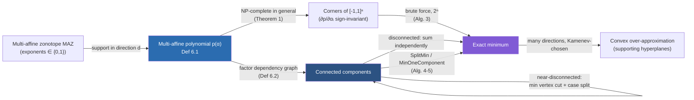

[[book-guidelines|↩ Back to guidelines]]

# Multi-Affine Zonotope Optimization

## The problem: the representation got cheap, but using it didn't

By the time you reach Section 6, the paper has already done the hard work: reachable sets are computed as polynomial zonotopes, dependencies are preserved through `mergeID`/`fresh`/`eval`, and (from [[Extensions-of-the-Core-Reachability-Algorithm|Extensions of the Core Reachability Algorithm]]'s Algorithm 2) the sets that come out are, under a mild independence assumption, **multi-affine zonotopes** — every dependent factor appears with exponent at most 1 (recall [[Polynomial-Zonotopes-as-a-Set-Representation|Definition 2.6]]). That's a nice structural fact to have proven, but a set representation is only as useful as the operations you can cheaply perform on it. And here's the snag: even the two most basic things you'd want to do with a reachable set — *plot it in 2D* and *check whether it intersects an unsafe region* — are, for a general polynomial zonotope, provably intractable.

The paper is blunt about the cost. Figure 11's caption reports that plotting a single time-point reachable set with the built-in splitting algorithm took **around two hours**, and the result was still a loose over-approximation. That is not a minor inconvenience — it's the kind of cost that makes an otherwise-precise reachability method useless in practice if every plot or intersection check requires that budget. Section 6 exists to answer one question: given that the sets in play are the *structurally restricted* multi-affine case, can we do dramatically better than the generic splitting algorithm? The answer hinges on turning "evaluate this set" into an *optimization problem*, and then noticing that the optimization problem has hidden combinatorial structure — a dependency graph — that a generic algorithm never looks at.

This is the same shape of tradeoff you already know from constraint solving: a NP-complete problem in the worst case, made tractable in practice by exploiting the *structure* of a particular instance rather than by finding a magic general algorithm. If that sentence sounds like "treewidth" or "cycle-cutset conditioning" to you, hold that thought — it's exactly where this section is headed.

## From "evaluate a set" to "optimize a polynomial"

**Why plotting and intersection reduce to optimization.** A convex set in $\mathbb{R}^2$ is completely determined by its supporting hyperplanes: for enough directions $d$, compute $\max_{x \in S} d^T x$ (or $\min$), and the intersection of the resulting half-spaces converges to the convex hull of $S$. This is the **support function** view of a set. Intersection checking against a halfspace or another convex region reduces to the same primitive: can you push the set past a boundary in some direction? So both of the two operations the paper cares about — plotting and intersection — bottom out in the same computational kernel: *minimize (or maximize) a linear functional over the set*.

For a multi-affine zonotope $\mathcal{MAZ} = \langle c, G, G_I, E, id\rangle_{MAZ}$, plugging the defining sum into a linear functional $d^Tx$ turns "minimize over the set" into "minimize over the free factors $\alpha_1, \dots, \alpha_n \in [-1,1]$" — and because every $\alpha_k$ carries at most exponent 1, the resulting objective is exactly a **multi-affine polynomial** in those factors. This is the paper's Definition 6.1:

**Definition 6.1 (Multi-Affine Polynomial and its Optimization Problem).**

$$
p(\alpha_1, \alpha_2, \dots, \alpha_n) = \sum_{I \subseteq \{1,2,\dots,n\}} g_I \prod_{i \in I} \alpha_i, \qquad g_I \in \mathbb{R},
$$

$$
\min_{\substack{\alpha_1,\dots,\alpha_n \\ \alpha_i \in [-1,1]}} p(\alpha_1,\alpha_2,\dots,\alpha_n). \tag{28}
$$

Read the sum carefully: it ranges over *subsets* $I$ of the factor indices, not over individual terms — each monomial $\prod_{i \in I}\alpha_i$ is squarefree (every factor that appears, appears exactly once), which is the algebraic restatement of "exponents are 0 or 1." This is precisely a **multilinear function**: fix every $\alpha_i$ except one, and $p$ is affine (degree $\le 1$) in the remaining variable. It's the polynomial-zonotope analogue of a multilinear form in linear algebra — jointly nonlinear across variables, but linear in each one separately.

The paper also needs to talk about *part* of a multi-affine polynomial — specifically, the terms whose monomials live entirely inside some subset $C$ of the factors, which is exactly what you need when a dependency graph decomposition (below) wants to solve a sub-problem in isolation:

**Definition ("Restriction").** Given $C \subseteq \{1,\dots,n\}$,

$$
p|_C = \sum_{I \subseteq C} g_I \prod_{i \in I} \alpha_i. \tag{29}
$$

$p|_C$ just throws away every monomial that touches a factor outside $C$ — it is $p$ "projected" onto the sub-polynomial that only concerns the variables in $C$.

```rust
/// A multi-affine polynomial: sparse map from a squarefree monomial
/// (a *subset* of factor indices, exponents implicitly all 1) to its coefficient.
struct MultiAffinePoly {
    n_factors: usize,
    terms: Vec<(Vec<usize>, f64)>, // (I, g_I) — I sorted, no repeats, no exponents needed
}

impl MultiAffinePoly {
    /// p|_C: keep only monomials whose support is a subset of C.
    fn restrict(&self, c: &std::collections::HashSet<usize>) -> MultiAffinePoly {
        MultiAffinePoly {
            n_factors: self.n_factors,
            terms: self.terms.iter()
                .filter(|(support, _)| support.iter().all(|i| c.contains(i)))
                .cloned()
                .collect(),
        }
    }
}
```

## Building the convex over-approximation: supports and the Kamenev method

Before getting to the optimization algorithm itself, it's worth being concrete about *why* you'd want a lot of these support-function evaluations rather than just one. A single direction $d_1$ gives you one halfspace $H_1 = \{x \mid d_1^T(x_1 - x) \le 0\}$ containing the set, where $x_1 = \arg\min_{x \in \mathcal{MAZ}} d_1^Tx$ is the support point. One halfspace is a very loose bound (an infinite slab); you need many directions, with the intersection $H_1 \cap H_2 \cap \cdots \cap H_m$ converging toward the true convex hull as $m$ grows and the directions are chosen well.

Choosing directions well — rather than uniformly, which wastes optimization calls on directions that don't tighten the enclosure much — is the **Kamenev method** (Lotov et al., 2004): an incremental scheme that picks the next direction to explore based on where the current polytope approximation is still loosest (specifically, near where two adjacent supporting hyperplanes intersect), stopping once consecutive optimal values converge within a small tolerance. The paper doesn't re-derive Kamenev's method in full — it's imported as a black box for *choosing* directions — but the important takeaway for this article is architectural: **the entire convex-hull-approximation pipeline is a loop that calls "solve problem (28)" dozens of times**, once per direction. If solving (28) is slow, the whole pipeline is slow, no matter how cleverly Kamenev picks directions. That's the actual reason a fast multi-affine optimizer matters — it's the innermost loop of everything built on top of it, including combining this convex over-approximation with the splitting-based method to sharpen it further (Section 6.4).

## Why this is hard: NP-completeness, and why brute force is still correct

**Theorem 1 (Huang et al., 2023).** Optimization over a *bilinear* polynomial — a special case of (28) with all monomials of size exactly 2,

$$
\min_{\substack{\alpha_1,\dots,\alpha_n\\ \alpha_i \in \{-1,1\}}} \sum_{i=1}^n \sum_{j=i+1}^n g_{i,j}\,\alpha_i\alpha_j, \tag{31}
$$

is NP-complete.

Since bilinear optimization is a special case of the general multi-affine problem (28), multi-affine optimization inherits the hardness — a specialization can't be easier than the general problem it's embedded in, so the general problem is at least as hard. This single fact is the whole reason the rest of the section exists: there is no polynomial-time algorithm for the worst case (assuming P ≠ NP), so the engineering question shifts from "how do we solve it fast" to "how do we exploit structure that's usually present in the instances we actually care about" — the standard move in tractable-fragment thinking that also underlies restricted SAT fragments (2-SAT, Horn-SAT) and bounded-treewidth CSP solving.

**Why the search space collapses to corners.** Before reaching for combinatorial structure, the paper first exploits a purely analytic fact: because every $\alpha_i$ appears with exponent at most 1, the partial derivative $\partial p/\partial \alpha_i$ doesn't depend on $\alpha_i$ at all (it's a sum of monomials with $\alpha_i$ already factored out) — so it never changes sign as $\alpha_i$ ranges over $[-1,1]$. A function that's monotonic in each variable, holding the others fixed, always attains its extremum at an endpoint of the domain in that variable. Apply this to every variable and the continuous problem over the box $[-1,1]^n$ collapses to a *finite* search over the box's $2^n$ corners:

$$
\min_{\substack{\alpha_1,\dots,\alpha_n\\ \alpha_i \in [-1,1]}} p(\alpha_1,\dots,\alpha_n) \;=\; \min_{\substack{\alpha_1,\dots,\alpha_n\\ \alpha_i \in \{-1,1\}}} p(\alpha_1,\dots,\alpha_n).
$$

This is a genuinely useful reduction — continuous optimization to discrete search — but $2^n$ corners is still exponential, which is exactly Theorem 1's content: this discrete search problem itself is NP-complete, not just annoying.

**What breaks without exploiting more structure.** The direct implementation of that finite search is Algorithm 3, the paper's brute-force baseline:

> **Algorithm 3 — Brute Force Minimization of Multi-Affine Polynomial**
> 1. `function Minimize(p, n)`
> 2. &nbsp;&nbsp;`m ← ∞`
> 3. &nbsp;&nbsp;`for i ← 0 to 2ⁿ − 1:`
> 4. &nbsp;&nbsp;&nbsp;&nbsp;`for j ← 1 to n: α_j = 2·(⌊i / 2^(j-1)⌋ mod 2) − 1`  *(decode bit $j$ of $i$ into $\pm1$)*
> 5. &nbsp;&nbsp;&nbsp;&nbsp;`m ← min(m, p(α_1,...,α_n))`
> 6. &nbsp;&nbsp;`return m`

```rust
/// Brute-force minimization over all 2^n sign assignments — Algorithm 3.
/// Correct for any n, but the cost is exponential: only usable when n is small,
/// which is exactly why the rest of this article exists.
fn minimize_brute_force(p: &MultiAffinePoly) -> f64 {
    let n = p.n_factors;
    let mut best = f64::INFINITY;
    for mask in 0u64..(1u64 << n) {
        let alpha: Vec<f64> = (0..n)
            .map(|j| if (mask >> j) & 1 == 1 { 1.0 } else { -1.0 })
            .collect();
        let value: f64 = p.terms.iter()
            .map(|(support, g)| g * support.iter().map(|&i| alpha[i]).product::<f64>())
            .sum();
        best = best.min(value);
    }
    best
}
```

This is correct, and it's the ground truth every faster algorithm below has to reproduce — but note the loop bound: `1u64 << n` overflows past $n=63$ and is already impractical well before that (the paper's own second benchmark hits **96 dependent factors**, so $2^{96}$ is not a "wait a bit longer" problem, it's a "the universe ends first" problem). Brute force is the correctness oracle for small $n$, not a deployable algorithm.

## The factor dependency graph: exposing the structure NP-completeness hides

Theorem 1's NP-completeness is a *worst-case* statement — it says some instances are this hard, not that every instance you'll encounter is. The paper's move (building on Del Pia and Di Gregorio, 2023) is to notice that the *actual* difficulty of a given multi-affine polynomial is governed by a graph built from which variables interact:

**Definition 6.2 (Factor Dependency Graph).** Given a multi-affine polynomial $p$ as in (27), the graph $G = (V,E)$ has:
- $V = \{1,\dots,n\}$ — one vertex per factor $\alpha_i$;
- $E = \{\{i,j\} : \exists$ a monomial in $p$ containing both $\alpha_i$ and $\alpha_j\}$ — an edge whenever two factors ever co-occur in the same term.

This is precisely a **constraint graph** in the CSP sense: vertices are variables, an edge means "these two variables are coupled by some constraint (here, a monomial) and can't be optimized independently of each other." If you've seen tree decompositions, induced-width analysis, or the primal graph of a CSP, this is the same object wearing the optimization paper's notation.

**The key exploit — decomposition over connected components.** If $G$ splits into connected components $G_1, \dots, G_m$ with disjoint vertex sets $V_1,\dots,V_m$, then $p$ itself splits additively: $p = p_1 + p_2 + \cdots + p_m$ where $p_k = p|_{V_k}$ (using the restriction operator from Definition 6.1's aside), because no monomial can straddle two components — if it did, its two factors would be connected by an edge, contradicting disconnection. Since the components don't interact, their optimizations don't interact either:

$$
\min_{\alpha_i \in [-1,1],\, i \in V} p \;=\; \min_{\alpha_i \in [-1,1],\, i \in V_1} p_1 \;+\; \min_{\alpha_i \in [-1,1],\, i \in V_2} p_2 \;+\; \cdots \;+\; \min_{\alpha_i \in [-1,1],\, i \in V_m} p_m.
$$

The cost drops from $2^n$ to $\sum_k 2^{|V_k|}$ — and because $2^a + 2^b \ll 2^{a+b}$ for any split, this is a genuine exponential-to-smaller-exponential win whenever the graph actually decomposes. **Example 5** in the paper makes the saving concrete:

$$
p = g_1\alpha_1\alpha_2\alpha_3 + g_2\alpha_3\alpha_4 + g_3\alpha_5\alpha_6 + g_4\alpha_7,
$$

whose dependency graph splits into $V_1=\{1,2,3,4\}$, $V_2=\{5,6\}$, $V_3=\{7\}$ (an isolated vertex, since a lone linear term touches no other factor). Brute force on the whole polynomial costs $2^7=128$ evaluations; decomposed, it costs $2^4+2^2+2^1=22$ — a $\sim 6\times$ reduction from a purely structural observation, made without approximation: the decomposed answer is *exactly* the same minimum, not an estimate of it.

```rust
use std::collections::{HashMap, HashSet};

/// Undirected factor-dependency graph, built directly from a polynomial's monomials.
struct DependencyGraph {
    n: usize,
    adjacency: Vec<HashSet<usize>>,
}

impl DependencyGraph {
    fn from_poly(p: &MultiAffinePoly) -> Self {
        let mut adjacency = vec![HashSet::new(); p.n_factors];
        for (support, _) in &p.terms {
            for &i in support {
                for &j in support {
                    if i != j {
                        adjacency[i].insert(j);
                    }
                }
            }
        }
        DependencyGraph { n: p.n_factors, adjacency }
    }

    /// Connected components via BFS/union-find over the adjacency lists.
    fn connected_components(&self) -> Vec<Vec<usize>> {
        let mut seen = vec![false; self.n];
        let mut components = Vec::new();
        for start in 0..self.n {
            if seen[start] { continue; }
            let mut stack = vec![start];
            let mut component = Vec::new();
            seen[start] = true;
            while let Some(v) = stack.pop() {
                component.push(v);
                for &w in &self.adjacency[v] {
                    if !seen[w] {
                        seen[w] = true;
                        stack.push(w);
                    }
                }
            }
            components.push(component);
        }
        components
    }
}
```

**When the graph is only *almost* disconnected.** Real dependency graphs rarely split perfectly — Example 6 shows the more realistic case where a single extra factor $\alpha_8$ multiplies through everything else, gluing three otherwise-separate components into one connected blob:

$$
p(\alpha_1,\dots,\alpha_8) = (g_1\alpha_1\alpha_2\alpha_3 + g_2\alpha_3\alpha_4 + g_3\alpha_5\alpha_6 + g_4\alpha_7)\,\alpha_8.
$$

Here $\alpha_8$ is adjacent to every other vertex, so removing it disconnects the graph back into the same three components from Example 5. The paper's fix is to **case-split on the cut vertex**: since $\alpha_8 \in \{-1,1\}$ has only two possible values, fix $\alpha_8 = 1$ and solve the now-decomposed $p_1+p_2+p_3$; fix $\alpha_8=-1$ (flipping the sign of every sub-polynomial, since $\alpha_8$ multiplied through linearly) and solve $-p_1-p_2-p_3$; take the better of the two. This is **cutset conditioning**, verbatim — the classical CSP technique (Dechter & Pearl) of instantiating a small set of "cutset" variables one assignment at a time so that, conditioned on each assignment, the remaining constraint graph becomes tree-structured (or, here, disconnected) and therefore cheap to solve. The generalization to a *minimum vertex cut* — the smallest set of vertices whose removal disconnects the graph — is exactly minimizing the size of that cutset, because every extra cut vertex multiplies the number of case-splits by 2. A near-disconnected graph is the CSP analogue of a "nearly tree-structured" constraint network: a small number of well-chosen instantiations exposes tractable structure that was hiding just underneath a few troublesome long-range constraints.

This is the point where the load-bearing connection to the standing project is exact, not just analogical: a CSP kernel over abstract domains that needs to search for counterexamples efficiently faces precisely this problem — a constraint graph that is mostly decomposable except for a handful of "hub" variables — and the fix is the same fix, whether the domain is $\{-1,1\}$ box corners or general finite/interval domains: find a small separator, branch on it, solve the pieces independently, recombine.

## The recursive algorithm: SplitMin and MinOneComponent

Putting decomposition and cutset conditioning together yields the paper's actual algorithm — a pair of mutually recursive functions with a size threshold $t$ below which it's cheaper to just call brute force than to keep decomposing further (decomposition itself has overhead: computing components, finding cuts):

> **Algorithm 4 — `SplitMin(p, g, t)`.** If $|V(g)| \le t$: return `Minimize(p)` (brute force). Otherwise, split $g$ into connected components and sum `MinOneComponent` over each.
>
> **Algorithm 5 — `MinOneComponent(p, g, c, t)`.** If the component $c$ is small enough ($|c|\le t$): brute-force $p|_c$ directly. Otherwise: find a minimum vertex cut of $c$; for every $\{-1,1\}$ assignment to the cut vertices, substitute those values into $p|_c$, remove the cut vertices from the graph, and recurse via `SplitMin` on what's left; return the best (minimum) value found across all cut-vertex assignments.

```rust
/// Recursive graph-decomposition minimizer — Algorithms 4 & 5 fused into one
/// function (the paper keeps them separate to name the "single component" step,
/// but the recursion is naturally mutual).
fn split_min(p: &MultiAffinePoly, g: &DependencyGraph, threshold: usize) -> f64 {
    if g.n <= threshold {
        return minimize_brute_force(p);
    }
    g.connected_components()
        .into_iter()
        .map(|component| min_one_component(p, g, &component, threshold))
        .sum()
}

fn min_one_component(p: &MultiAffinePoly, g: &DependencyGraph, c: &[usize], threshold: usize) -> f64 {
    let c_set: HashSet<usize> = c.iter().copied().collect();
    let p_c = p.restrict(&c_set);
    if c.len() <= threshold {
        return minimize_brute_force(&p_c);
    }
    let cut = find_min_vertex_cut(g, c); // one call into a standard min-cut routine
    // Fan out over every {-1,1} assignment to the cut vertices, exactly like
    // Alg. 5's stack-based enumeration — a small (2^|cut|) case split that
    // exposes a strictly smaller, decomposable remainder each time.
    enumerate_sign_assignments(&cut)
        .map(|assignment| {
            let p_reduced = substitute_all(&p_c, &assignment);
            let g_reduced = g.remove_vertices(&cut);
            split_min(&p_reduced, &g_reduced, threshold)
        })
        .fold(f64::INFINITY, f64::min)
}
```

Two things are worth flagging about the cost model here, because they're exactly the tradeoffs that show up again in any structure-exploiting solver:

1. **The cut size dominates the branching factor**, not the graph size. Each cut vertex doubles the work at that recursion level ($2^{|\text{cut}|}$ branches), so a graph that needs a large cut to disconnect gains little — this is the paper's own stated limitation in the conclusion: *"uneven vertex cuts slow the splitting algorithm."* A single well-placed 1-vertex cut (Example 6) is cheap; a graph that resists small cuts degrades toward brute force on the whole thing.
2. **The threshold $t$ is a knob, not a constant of nature.** Decomposing has bookkeeping overhead (finding components, finding a minimum vertex cut is itself nontrivial), so below some component size it's simply cheaper to brute-force directly — the same base-case tuning you'd apply to any divide-and-conquer algorithm (e.g., insertion sort below a size threshold in an otherwise-mergesort routine).

## Evaluation: what the graph-decomposition buys in practice

Section 6.4's two experiments make the payoff concrete rather than asymptotic. On the Dubins-car time-varying-parameter benchmark, CORA's built-in splitting-based approach to plot a single time-point reachable set with 60 splits takes over 2 hours (Fig. 11) and is *still* a loose over-approximation; the paper's multi-affine optimization approach, combined with 20-split CORA output for the non-convex remainder, finishes the whole hybrid pipeline (including the Kamenev direction search) in about 1063 seconds — under 20 minutes. On a second 5-D time-varying benchmark reduced to a polynomial zonotope with **96 dependent factors**, the paper reports the graph-decomposition method reaching the *exact* optimum (0% relative error) in roughly 15–16 seconds across all three tested configurations, while CORA's splitting method needs 20–30 splits and correspondingly hundreds to thousands of seconds to even approach that accuracy — and in one configuration, 30 splits simply exceeds the paper's time limit without matching the exact result. The qualitative lesson the paper draws (its Table 1) is that **splitting has diminishing, not vanishing, returns**: cranking the split count up buys smaller and smaller accuracy gains at rapidly increasing cost, whereas the graph-based method sidesteps the tradeoff entirely by finding the *exact* answer whenever the dependency structure cooperates.

## Where this leads

Structurally, this section closes the loop the whole paper opened: [[Polynomial-Zonotopes-as-a-Set-Representation|Section 2]] introduced multi-affine zonotopes as a curiosity — "a polynomial zonotope with exponents capped at 1" — and only here does that structural restriction pay for itself, once [[Extensions-of-the-Core-Reachability-Algorithm|Algorithm 2's outputs]] are shown to actually land in that subclass under the paper's independence assumption. Everything upstream (dependency-preserving sums, matrix-exponential propagation, the reachability algorithm itself) exists to produce a *set*; this section is what makes that set actually *usable* for the two operations — plotting and intersection checking — that a verification pipeline needs at the end of the day.



For the `sat-smt-csp` thread specifically, this section is close to a worked example of the exact ideas the standing project's CSP kernel will need: a **constraint graph** built from variable co-occurrence, an NP-completeness result that motivates exploiting structure instead of chasing a nonexistent general fast algorithm, a **structural-tractability** argument (decomposition over connected components, generalized by minimum-vertex-cut case-splitting) that is the same move as tree decomposition / induced-width bounds in CSP solving and cutset conditioning in Bayesian-network and constraint literature (Dechter & Pearl), and a concrete cost model — branching factor $2^{|\text{cut}|}$ — for *why* a bad decomposition degrades gracefully back toward brute force rather than catastrophically. If the CSP kernel this project is building ends up decomposing its own constraint graph to search for counterexamples faster than exhaustive enumeration, this section's `SplitMin`/`MinOneComponent` pair is a direct, small-scale template for that machinery — down to the same tension between cut quality and recursion depth that the paper's own conclusion flags as its main open limitation.
