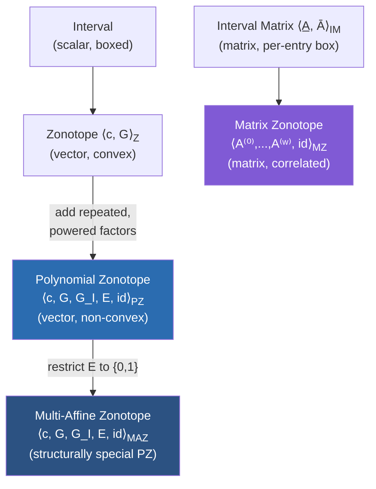

[[book-guidelines|↩ Back to guidelines]]

# Polynomial Zonotopes as a Set Representation

## The problem: convex sets can't shadow a curved reachable set

Every reachability algorithm for a dynamical system runs into the same bind. You want to answer "can the system ever end up in this bad region?" and the honest way to answer it is to compute the exact reachable set — the set of every state the system could be in at time $t$, ranging over every value the uncertain parameters and inputs are allowed to take. That exact set is almost never expressible in closed form once uncertainty is involved, so instead you compute an *enclosure*: a set that is guaranteed to contain the true reachable set, ideally one that is cheap to represent and propagate forward in time. If the enclosure misses the unsafe region, you've proven safety. If your enclosure is *too loose*, you get a spurious counterexample — the enclosure clips the unsafe region even though the real system never would — and the whole verification effort is wasted on a false alarm.

This is exactly the shape of the soundness/precision tradeoff you already know from abstract interpretation: an enclosure is a sound over-approximation, and the entire value of the analysis lives or dies on how *tight* that over-approximation is, not just on whether it's sound.

Here's the concrete failure mode the paper opens with. Take a linear system $\dot{x}(t) = Ax(t) + Bu(t)$ where the matrix $A$ itself is uncertain — think of a Dubins car (a point moving at constant speed with a turning rate) where the turning rate is only known to lie in some interval. Even though the system is linear in $x$, the *map* from the uncertain parameter $A$ to the resulting trajectory is not linear — it's transcendental, because propagating $x(0)$ forward involves the matrix exponential $e^{At}$, and $e^{At}$ curves as a function of $A$. The true reachable set at a fixed time $t$ traced out by all admissible $A$ is a genuinely curved, non-convex blob (visualize an arc swept out by a range of turning rates — the two-dimensional slice of it looks like a banana, not a box).

Every convex set representation — polytopes, ellipsoids, and the classic workhorse, zonotopes — is structurally incapable of representing that banana shape exactly. The best a convex representation can do is wrap a convex hull around it, and a convex hull is a strict superset that swallows a lot of empty space the true reachable set never touches. That's not a minor precision hit — it's precision lost by *construction*, before the algorithm has even started propagating. The paper's whole contribution rests on swapping in a set representation that is not forced into convexity by its algebraic definition: the **polynomial zonotope**.

## Zonotopes: the convex baseline

Before non-convexity, you need to understand exactly what a zonotope is and precisely where it hits a wall.

**Definition 2.1 (Zonotope).** Given a center $c \in \mathbb{R}^n$ and a generator matrix $G \in \mathbb{R}^{n \times h}$ (its columns $G_{(\cdot,i)}$ are the *generators*),

$$
\mathcal{Z} = \left\{ c + \sum_{i=1}^{h} \alpha_i G_{(\cdot,i)} \;\middle|\; \alpha_i \in [-1,1] \right\}, \qquad \text{shorthand } \mathcal{Z} = \langle c, G \rangle_Z.
$$

In words: start at a center point, and add any linear combination of the generator vectors where each coefficient $\alpha_i$ is free to range over $[-1, 1]$. Geometrically this is a (possibly high-dimensional, possibly degenerate) parallelotope — a stretched, sheared, rotated box. It's the higher-dimensional generalization of an interval: an interval is a zonotope with $n=1$, one generator, center at the midpoint.

The reason zonotopes are the workhorse of reachability analysis is that this representation is *closed and cheap* under exactly the operations reachability needs: linearly mapping a zonotope by a matrix just multiplies through the generators, and taking the Minkowski sum of two zonotopes just concatenates their generator matrices. Both operations are $O(1)$ symbolic rewrites, no re-derivation of the shape needed.

**What breaks without going further.** Every coefficient $\alpha_i$ is a *free, independent* variable ranging over an interval, and the resulting set is a linear image of a hypercube — which is convex by construction, no matter how you choose $c$ and $G$. There is no way to choose a center and generators that produces the banana-shaped set from the Dubins car example above. You'd have to wrap it in a convex hull, and that hull is exactly the wasted-precision problem from the previous section. The fix polynomial zonotopes introduce is almost embarrassingly simple once you see it: let the same factor $\alpha_k$ appear **more than once**, and let it appear **raised to a power**, in the sum. A term like $\alpha_1 \alpha_2^3$ traces out a curved surface as $\alpha_1, \alpha_2$ range over $[-1,1]$ — nonlinear in the *parameters*, even though it's still, for fixed $\alpha$'s, a single point being added to the sum. That's the entire trick.

```rust
/// A zonotope: center + generators, all coefficients independent and linear.
struct Zonotope {
    center: DVector<f64>,       // c ∈ R^n
    generators: DMatrix<f64>,   // G ∈ R^{n x h}, h columns
}
```

## Polynomial zonotopes: buying non-convexity with exponents

**Definition 2.2 (Polynomial Zonotope, sparse representation).** Given a constant offset $c \in \mathbb{R}^n$, a matrix of *dependent* generators $G \in \mathbb{R}^{n\times h}$, a matrix of *independent* generators $G_I \in \mathbb{R}^{n \times q}$, and an exponent matrix $E \in \mathbb{N}_0^{p \times h}$,

$$
\mathcal{PZ} = \left\{ c + \sum_{i=1}^h \left(\prod_{k=1}^p \alpha_k^{E_{(k,i)}}\right) G_{(\cdot,i)} + \sum_{j=1}^q \beta_j G_{I(\cdot,j)} \;\middle|\; \alpha_k, \beta_j \in [-1,1] \right\},
$$

shorthand $\mathcal{PZ} = \langle c, G, G_I, E, id \rangle_{PZ}$, where $id \in \mathbb{N}^p$ is a list of distinct natural numbers, one unique identifier per dependent factor $\alpha_k$.

Unpack this piece by piece, because every piece is doing a specific job:

- **$p$ "dependent" factors $\alpha_1, \dots, \alpha_p$, each shared across multiple generator terms.** This is the whole trick from the previous section, formalized: because the *same* $\alpha_k$ can appear in the exponent column for several different generators, and because it can appear raised to a power greater than 1, the resulting sum is a polynomial — not a linear map — of the $\alpha$'s. A polynomial image of a hypercube is not, in general, convex. That's where the non-convexity comes from: structurally, at the level of the algebra, not by any special-casing.
- **The exponent matrix $E$** records, for each of the $h$ generator columns $i$, how many times each dependent factor $\alpha_k$ appears multiplied into that term — $E_{(k,i)}$ is the exponent of $\alpha_k$ in term $i$. Column $i$ of $E$ is literally the multi-index of the monomial multiplying generator $G_{(\cdot,i)}$.
- **The identifier list $id$** exists because $\alpha_k$ is not just a bound dummy variable — it is a *name*. Two different polynomial zonotopes might each have a factor called "$\alpha_1$" that means completely different things, or — more importantly for this paper — two different polynomial zonotopes derived from the *same* underlying uncertain quantity (say, the same uncertain turning rate, appearing once in the homogeneous solution and once in the particular solution three time steps later) need to be recognized as sharing that factor when they're combined, so the dependency between them is preserved rather than silently thrown away. The `id` field is the bookkeeping that makes that recognition possible; the next article in this sequence (Dependency-Preserving Set Operations) is entirely about the operations — `mergeID`, `fresh`, `eval` — built on top of this bookkeeping.
- **Independent generators $G_I$, scaled by $\beta_j \in [-1,1]$**, are ordinary zonotope-style generators bolted onto the side: each $\beta_j$ is free and appears exactly once, linearly, contributing no curvature. They exist for a practical reason you'll meet properly in later sections — some quantities (like a bounded truncation error from a Taylor series) are genuinely just "small and uncertain," with no dependency worth tracking, and forcing them into the dependent, polynomial machinery would be needless overhead. Independent generators are the "just wrap it in slack" escape hatch when precision doesn't need the full polynomial treatment.

**Example 1 from the paper**, concretely, with

$$
\mathcal{PZ} = \left\langle \begin{bmatrix}0\\0\end{bmatrix}, \begin{bmatrix}2&0&1\\1&2&1\end{bmatrix}, \begin{bmatrix}1\\0.5\end{bmatrix}, \begin{bmatrix}1&0&1\\0&1&3\end{bmatrix}, \begin{bmatrix}1\\2\end{bmatrix} \right\rangle_{PZ}
$$

unpacks (reading off each column of $G$ against the matching column of $E$) to

$$
\mathcal{PZ} = \left\{ \begin{bmatrix}0\\0\end{bmatrix} + \alpha_1\begin{bmatrix}2\\1\end{bmatrix} + \alpha_2\begin{bmatrix}0\\2\end{bmatrix} + \alpha_1\alpha_2^3\begin{bmatrix}1\\1\end{bmatrix} + \beta_1\begin{bmatrix}1\\0.5\end{bmatrix} \;\middle|\; \alpha_1,\alpha_2,\beta_1 \in [-1,1] \right\}.
$$

Look at the third term: $\alpha_1\alpha_2^3$. That's the column $\begin{bmatrix}1\\3\end{bmatrix}$ of $E$ — exponent 1 on $\alpha_1$ (identifier 1), exponent 3 on $\alpha_2$ (identifier 2). It is exactly this term that curves the set into the non-convex shape drawn in the paper's Fig. 2 (a lens/crescent-like region rather than a parallelogram). Everything else in the expression — the linear $\alpha_1, \alpha_2$ terms and the independent $\beta_1$ term — is ordinary zonotope machinery; the *only* extra ingredient purchasing non-convexity is that one repeated, higher-power factor.

```rust
/// A polynomial zonotope in sparse representation: PZ = <c, G, G_I, E, id>.
struct PolyZonotope {
    center: DVector<f64>,        // c ∈ R^n
    dep_generators: DMatrix<f64>,   // G  ∈ R^{n x h}
    indep_generators: DMatrix<f64>, // G_I ∈ R^{n x q}
    exponents: DMatrix<u32>,        // E  ∈ N_0^{p x h}, column i = monomial for G[:,i]
    ids: Vec<u64>,                  // length p, unique identifier per dependent factor
}
```

Notice the shape mirrors a sparse polynomial representation you'd recognize from any computer-algebra system: `exponents` is a sparse-ish exponent table (most entries are 0), `dep_generators` are the polynomial's "coefficients" — except the coefficients are themselves vectors in $\mathbb{R}^n$, and the whole thing denotes a *set*, evaluated over an interval box rather than a single point. If you've ever implemented multivariate polynomial arithmetic with a `Vec<(Vec<u32>, Coeff)>` term list, this is the same data shape wearing a different hat.

## Multi-affine zonotopes: a structurally restricted special case

**Definition 2.6 (Multi-Affine Zonotope).** A multi-affine zonotope is a polynomial zonotope whose exponent matrix $E$ contains only $0$s and $1$s. Shorthand $\mathcal{MAZ} = \langle c, G, G_I, E, id \rangle_{MAZ}$.

This is worth flagging now, even though its payoff (a dedicated optimization algorithm) belongs to a much later section of the paper, because it's a purely structural fact about the representation you've just learned. Capping every exponent at 1 means no factor is ever squared, cubed, or otherwise self-multiplied — a factor can still appear in a product with *other* factors (so $\alpha_1\alpha_2$ is allowed, that's still "multi-affine" — affine in each variable separately, when the others are held fixed), but $\alpha_1^2$ or $\alpha_1\alpha_2^3$ (the very term from Example 1 above!) is not. It's the polynomial-zonotope analogue of a multilinear form: linear in each argument individually, but the *product* of several such arguments is still allowed to be jointly nonlinear.

The reason to plant this flag here rather than skip it until Section 6 of the paper: the paper's later empirical contribution shows that the reachable sets this algorithm produces are, under a mild independence assumption, always multi-affine zonotopes — so the "special case" turns out to be the *typical* case in practice, which is precisely what makes a dedicated, faster optimization algorithm for that special case worth building instead of settling for a generic polynomial-zonotope optimizer.

## Matrix zonotopes and interval matrices: uncertainty in the *dynamics*, not just the state

Everything above represents uncertainty in a *state* — a point in $\mathbb{R}^n$. But this paper's system, $\dot{x}(t) = Ax(t) + Bu(t)$ with $A \in \mathcal{A}$, $B \in \mathcal{B}$, has uncertainty in the system *matrices themselves*. You need a set representation whose elements are matrices, not vectors, to describe "the turning-rate matrix could be any of these."

**Definition 2.3 (Interval Matrix).** Given lower and upper matrices $\underline{A}, \overline{A} \in \mathbb{R}^{m\times n}$,

$$
\mathcal{A} = \begin{bmatrix} [\underline{A}_{(1,1)}, \overline{A}_{(1,1)}] & \cdots & [\underline{A}_{(1,n)}, \overline{A}_{(1,n)}] \\ \vdots & \ddots & \vdots \\ [\underline{A}_{(m,1)}, \overline{A}_{(m,1)}] & \cdots & [\underline{A}_{(m,n)}, \overline{A}_{(m,n)}] \end{bmatrix}, \quad \text{shorthand } \mathcal{A} = \langle \underline{A}, \overline{A} \rangle_{IM}.
$$

This is the direct matrix analogue of an interval: independently bound each entry, no correlation between entries at all — the matrix set is a box in $\mathbb{R}^{m\times n}$, entry by entry.

**Definition 2.4 (Matrix Zonotope).** Given a center matrix $A^{(0)}$ and generator matrices $A^{(1)}, \dots, A^{(w)} \in \mathbb{R}^{m\times n}$,

$$
\mathbf{A} = \left\{ A^{(0)} + \sum_{l=1}^w \rho_l A^{(l)} \;\middle|\; \rho_l \in [-1,1] \right\}, \qquad \text{shorthand } \mathbf{A} = \langle A^{(0)}, A^{(1)},\dots,A^{(w)}, id \rangle_{MZ},
$$

with $id \in \mathbb{N}^w$ giving each factor $\rho_l$ a unique identifier, exactly like a polynomial zonotope's dependent factors.

The relationship between the two matrix representations mirrors exactly the vector-space relationship between an interval and a zonotope: an interval matrix bounds each entry independently (a box, axis-aligned in the space of matrix entries), while a matrix zonotope can express *correlated* uncertainty across entries — e.g., "the whole top row scales together" — by sharing a single generator's contribution across multiple entries. This is not idle generality: it is precisely the correlation-tracking capability that gets exploited once matrix zonotopes are multiplied against polynomial zonotopes with shared identifiers (Section 3 of the paper — the immediate next payoff of this same `id` bookkeeping).

```rust
/// Matrix-valued analogue of a zonotope: center matrix + generator matrices.
struct MatrixZonotope {
    center: DMatrix<f64>,           // A^(0) ∈ R^{m x n}
    generators: Vec<DMatrix<f64>>,  // A^(1) .. A^(w), each R^{m x n}
    ids: Vec<u64>,                  // one identifier per generator/factor ρ_l
}
```

Why bother with two matrix representations rather than just always using the more expressive matrix zonotope? Interval matrices are the natural *output* of many uncertainty quantification steps (sensor bounds, sensitivity analysis, a linearization error bound each land naturally as an independent per-entry interval) and they're cheaper to intersect and manipulate directly; matrix zonotopes are what you need once you must track cross-entry or cross-time correlation. The paper uses both, converting between them as each situation calls for it.

## The representation hierarchy, at a glance



Reading the diagram: the left column is the vector-set track (state uncertainty), the right column is the matrix-set track (dynamics uncertainty); polynomial zonotopes are reached from zonotopes by exactly one structural relaxation — letting factors repeat and take on powers — and multi-affine zonotopes are reached from polynomial zonotopes by exactly one structural restriction — capping those powers at 1. Every arrow in this diagram is a strict generalization: a zonotope is a polynomial zonotope with an empty exponent structure (all generators independent, or all exponents identically 1 and never repeated), and an interval matrix is a matrix zonotope where every generator has exactly one nonzero entry.

## Where this leads

This topic is the vocabulary, not yet the machinery. Every later section of the paper is built directly on the five ingredients introduced here:

- The **`id` identifier list**, introduced almost as an afterthought in Def. 2.2 and 2.4, is the single mechanism the entire paper's precision advantage rests on — the next topic (Dependency-Preserving Set Operations: `mergeID`, `fresh`, `eval`, exact sum vs. Minkowski sum) is entirely about *using* those identifiers to recognize when two polynomial zonotopes secretly share an uncertain source and must be combined without throwing that fact away.
- **Matrix zonotopes multiplying polynomial zonotopes** (Section 3, "[[Matrix-Exponential-Propagation|Matrix Exponential Propagation]]") is where the interval-matrix/matrix-zonotope distinction from this topic starts paying for itself, because the matrix exponential $e^{At}$ has to be enclosed and then multiplied through a polynomial zonotope while preserving dependencies.
- **Multi-affine zonotopes**, flagged here only structurally, become the entire subject of the paper's second half (Section 6): once the reachable set is shown to always land in this restricted subclass, a specialized, much faster optimization algorithm becomes possible.

For the `static-analysis` thread specifically: this whole representation is best understood as a custom **abstract domain** in the abstract-interpretation sense — a polynomial zonotope is a compact symbolic encoding of an (uncountable) concrete set of states, `zonotope(·)` and `reduce(·, ρ)` (mentioned in passing here, defined properly in the next topic) are exactly the abstraction/widening operators that trade precision for a bounded representation size, and the entire "exact sum vs. Minkowski sum" distinction that dominates the rest of the paper is a direct instance of the general abstract-interpretation lesson that *how* you combine two abstract values — not just whether the combination is sound — determines whether your invariant-generation pipeline stays tight enough to be useful. If you build the Hoare-contract / Horn-clause invariant generator this project is aiming at, this is the same tension you'll hit the moment two abstract facts about a program state need to be joined without forgetting that they were derived from the same input.
