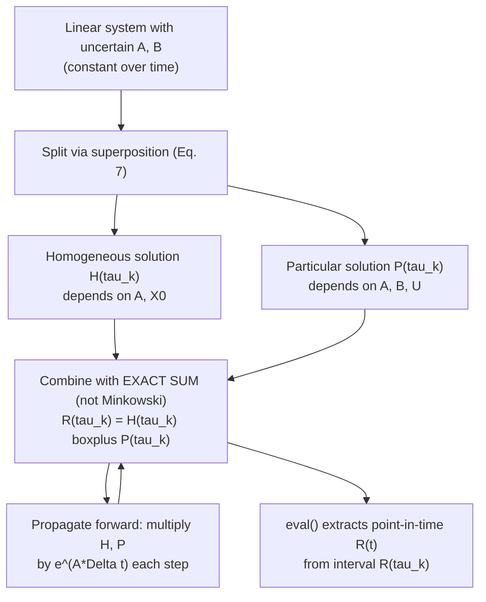

[[book-guidelines|↩ Back to guidelines]]

# Reachability Analysis for Linear Systems with Uncertain Parameters

## The problem this section actually solves

Every reachability tool eventually has to answer one very unglamorous question: *given that I don't know the exact system matrix, the exact initial state, or the exact input signal, what is the set of states the system could possibly be in at time $t$?* The paper's Section 4 is where the abstract machinery from Sections 2–3 — polynomial zonotopes, matrix zonotopes, the exact sum, the matrix-exponential enclosure — finally gets pointed at a concrete system and turned into an algorithm you could implement.

The system in question is:

$$\dot{x}(t) = A\,x(t) + B\,u(t), \qquad A \in \mathcal{A},\ B \in \mathcal{B} \tag{6}$$

where $\mathcal{A} \subset \mathbb{R}^{n\times n}$ and $\mathcal{B} \subset \mathbb{R}^{n\times m}$ are *matrix zonotopes* — not fixed matrices, but sets of matrices. The initial state $x(0)$ ranges over a set $\mathcal{X}_0$, and the input $u(t)$ ranges over a set $\mathcal{U}$ at every instant. This is "Case II" from the paper's Figure 1: a linear system where the parameters are uncertain but *constant* — as opposed to Case I (no uncertainty at all) or Case III/IV (parameters that vary over time, handled in Section 5).

**What breaks without this.** If you naively tried to compute the reachable set by picking a convex hull of "worst case" matrices, initial states, and inputs and simulating that, you would silently throw away correlations. The reachable set at time $t$ is *not* what you get from combinatorially worst-casing each source of uncertainty independently — it's a genuinely lower-dimensional, non-convex slice of the product space $\mathcal{A} \times \mathcal{B} \times \mathcal{X}_0 \times \mathcal{U}$ pushed through the flow map $\xi$. A convex over-approximation (what every zonotope-only approach, including the prior state of the art by Althoff et al. 2011a, is forced into) inflates that slice into its convex hull, and the resulting enclosure gets looser and looser as you propagate forward in time. Reachability analysis exists to prove *safety* — that the reachable set never touches an unsafe region — so a needlessly loose enclosure is not a cosmetic defect, it's a source of false alarms ("spurious counterexamples," in the paper's words) that make the whole verification exercise useless.

## Definition 4.1 — the reachable set, formally

$$\mathcal{R}(t) = \Big\{\, \xi(A, B, t, x(0), u(\cdot)) \;\Big|\; A \in \mathcal{A},\, B \in \mathcal{B},\, x(0) \in \mathcal{X}_0,\, \forall s \in [0,t]: u(s) \in \mathcal{U} \,\Big\}$$

Read this literally as a set comprehension: for *every* choice of a concrete matrix $A$ from the matrix zonotope $\mathcal{A}$, a concrete $B$ from $\mathcal{B}$, a concrete initial state from $\mathcal{X}_0$, and *every* measurable input trajectory $u(\cdot)$ staying inside $\mathcal{U}$ at each instant, you get one point $\xi(A,B,t,x(0),u(\cdot))$ — the ODE's actual solution at time $t$ for that particular instantiation. $\mathcal{R}(t)$ is the union of all such points. This is intractable to compute exactly (it's an uncountable union over an uncountable index set), so the entire rest of the paper is about computing a *tight enclosure* of it using polynomial zonotopes instead.

Because you can't hold the whole infinite time horizon $[0, t_{\text{end}}]$ in your hands at once, the paper chops it into consecutive time intervals $\tau_k = [k\Delta t, (k+1)\Delta t]$ and computes $\mathcal{R}(\tau_k)$ — the set of *all* states reachable at *any* point during that interval — one interval at a time, so that

$$\mathcal{R}([0, t_{\text{end}}]) = \bigcup_{k=0}^{t_{\text{end}}/\Delta t - 1} \mathcal{R}(\tau_k).$$

## The superposition trick: split, then recombine

The key structural move — and the thing that makes the rest of the section tractable — is the observation that for *numerical* (non-uncertain) $A$ and $B$, the analytical solution of a linear ODE splits additively:

$$\xi(A,B,t,x(0),u(\cdot)) = \underbrace{e^{At}x(0)}_{\text{homogeneous solution}} + \underbrace{\int_0^t e^{A(t-s)}Bu(s)\,ds}_{\text{particular solution}} \tag{7}$$

This is the standard variation-of-parameters formula from ODE theory: the homogeneous term describes how the initial state alone would evolve if there were no input at all ($u \equiv 0$); the particular term describes how much the input signal has pushed the state around, integrated over the whole time horizon (with earlier inputs decayed/rotated by $e^{A(t-s)}$ relative to later ones).

**Why does this superposition survive the move to sets?** Because linearity of the ODE plus linearity of the "solve for a fixed $A,B$" map means the *union over all instantiations of $x(0)$* and the *union over all instantiations of $u(\cdot)$* really do separate into two independent computations that you only need to combine at the very end. This licenses splitting the whole problem into a **homogeneous solution** $\mathcal{H}(\tau_k)$ (Section 4.2, depending on $\mathcal{A}$ and $\mathcal{X}_0$ only) and a **particular solution** $\mathcal{P}(\tau_k)$ (Section 4.3, depending on $\mathcal{A}$, $\mathcal{B}$, $\mathcal{U}$), then recombining them (Section 4.4). Each half is individually easier; the subtlety, which is the entire point of using polynomial zonotopes instead of ordinary zonotopes, is in *how* you recombine them without losing tightness.



## The homogeneous solution: propagating a set through the matrix exponential

For the first interval $\tau_0 = [0, \Delta t]$:

$$\mathcal{H}(\tau_0) = \big\{ e^{At}x(0) \mid A \in \mathcal{A}, t \in \tau_0, x(0) \in \mathcal{X}_0 \big\} = e^{\mathcal{A}\mathcal{T}}\mathcal{X}_0$$

Notice something that is easy to skim past: $t$ itself is a *free variable ranging over the whole interval* $\tau_0$, not a fixed instant. The trick for handling this is to represent the time interval as a degenerate matrix zonotope:

$$\mathcal{T} = [0,\Delta t]\cdot I_n = \langle T, T, \mathrm{uniqueID}(1)\rangle_{MZ}, \qquad T = 0.5\,\Delta t\, I_n \tag{8}$$

i.e. a matrix zonotope with center $T$ and a single generator $T$, so that as its one factor $\rho \in [-1,1]$ ranges over its domain, $T + \rho T$ sweeps exactly $[0, \Delta t]\cdot I_n$. This is a small but important piece of engineering: it lets *time itself* be folded into the same matrix-zonotope algebra used for the uncertain parameters, so that $e^{\mathcal{A}\mathcal{T}}\mathcal{X}_0$ can be computed by directly invoking **Proposition 3** (multiplication with a matrix exponential of two matrix sets, derived in Section 3 via a truncated Taylor series with a bounded interval-matrix remainder — see the companion article on matrix-exponential propagation for the details of *why* that Taylor truncation is sound).

Once you have $\mathcal{H}(\tau_0)$, propagating forward to later intervals is just repeated multiplication by the *numerical* matrix exponential of a fixed step $e^{A\Delta t}$ — except lifted to sets:

$$\mathcal{H}(\tau_k) = \underbrace{e^{A\Delta t} \,{\cdots}\, e^{A\Delta t}}_{k \text{ times}}\, e^{\mathcal{A}\mathcal{T}}\mathcal{X}_0$$

The paper flags an easy-to-miss but structurally important consequence here: **even if $\mathcal{X}_0$ is a convex set (an ordinary zonotope), $\mathcal{H}(\tau_k)$ will generally be non-convex** as soon as $k \geq 1$. This is exactly the phenomenon that ordinary (convex) zonotope propagation cannot represent — the state transition matrix multiplying an uncertain initial state repeatedly, together with the matrix uncertainty itself, bends a convex region into a non-convex one. Polynomial zonotopes exist precisely to hold onto this shape instead of rounding it back out to its convex hull at every step.

## The particular solution: a truncated-series propagation scheme

The particular solution is the harder half because it's an integral, not just a linear map. Starting from Althoff (2010)'s result for *numerical* $A, B$:

$$\mathcal{P}_{A,B}(t) = \Big\{\int_0^t e^{A(t-s)}Bu(s)\,ds \;\Big|\; u(t)\in\mathcal{U}\Big\} \subseteq \bigoplus_{i=0}^{\kappa} \frac{A^i t^{i+1}}{(i+1)!}\, B\,\mathcal{U} \;\oplus\; t\,\mathbf{E}_t\,\mathrm{zonotope}(B\,\mathcal{U}) \tag{9}$$

This is the same style of move as Proposition 3: expand $e^{A(t-s)}$ as a Taylor series in $A$, integrate the polynomial-in-$s$ terms exactly (each term $\frac{A^i(t-s)^i}{i!}$ integrates to $\frac{A^i t^{i+1}}{(i+1)!}$), and bound the tail of the series by an interval matrix $\mathbf{E}_t$ (Eq. 10) whose validity again requires the convergence condition $\epsilon = \frac{\|A\|_\infty t}{\kappa + 2} < 1$.

**What's new here, and where the exact-sum discipline first shows up for real:** lifting Eq. 9 to matrix *sets* $\mathcal{A}, \mathcal{B}$ gives

$$\mathcal{P}(t) \subseteq \boxplus_{i=0}^{\kappa} \frac{\mathcal{A}^i t^{i+1}}{(i+1)!}\, \mathcal{B}\,\mathrm{fresh}(\mathcal{U}) \;\oplus\; t\,\mathbf{E}_t\,\mathrm{zonotope}(\mathcal{B}\,\mathcal{U}) \tag{11}$$

Look closely at which combinator is used where, because the paper is *deliberately* mixing $\boxplus$ and $\oplus$ in the same formula and that choice is the whole point of the section:

- **Exact sum $\boxplus$ across the $\kappa$ Taylor terms**: each term shares the *same* underlying uncertain matrices $\mathcal{A}$ and $\mathcal{B}$ — the $i$-th term's $\mathcal{A}^i$ and the $j$-th term's $\mathcal{A}^j$ are correlated (they're powers of the *same* matrix draw, not independent draws). Using Minkowski sum here would treat each power as if it came from an independent copy of $\mathcal{A}$, silently re-introducing a convex over-approximation exactly where the paper is trying to avoid one. This is the direct payoff of everything Section 3 built: Prop. 3's derivation used exact sum for the same reason.
- **`fresh(U)` on the input set**: the input at each moment in $[0,t]$ is allowed to be a genuinely different value from $\mathcal{U}$ — there is no reason the input should be correlated with itself across the integral in the way $A^i$ and $A^j$ are correlated with each other. Applying `fresh` here *destroys* a dependency that was never real, which is required for **soundness**: if you didn't fresh the input factors, you'd implicitly assume all uses of $u(\cdot)$-derived quantities came from the same realization, which would make the enclosure a proper subset of the truth — unsound rather than merely loose.

This is a nice, sharp illustration of a general principle the paper is teaching implicitly: *dependency preservation is not "always merge, never separate" — it's "merge exactly the dependencies that are real, and only those."* Over-merging (treating independent things as if correlated) is just as wrong as over-forgetting (treating correlated things as if independent); the former makes you unsound in a way that's easy to miss because both mistakes visually "look tighter."

Instantiating Eq. 11 for the first interval $\tau_0 = [0,\Delta t]$, using the same matrix-zonotope $\mathcal{T}$ from Eq. 8 in place of the scalar $t$:

$$\mathcal{P}(\tau_0) \subseteq \boxplus_{i=0}^{\kappa} \frac{\mathcal{A}^i \mathcal{T}^{i+1}}{(i+1)!}\, \mathcal{B}\,\mathrm{fresh}(\mathcal{U}) \;\oplus\; \Delta t\,\mathbf{E}_{\Delta t}\,\mathrm{zonotope}(\mathcal{B}\,\mathcal{U}) \tag{12}$$

For subsequent intervals, rather than recomputing this integral from scratch each time, Althoff (2010, Prop. 3.2) gives a **recurrence** for numerical $A, B$:

$$\mathcal{P}_{A,B}(\tau_k) = e^{A\Delta t}\,\mathcal{P}_{A,B}(\tau_{k-1}) \oplus \mathcal{P}_{A,B}(\Delta t) \tag{13}$$

i.e. "propagate what you had forward one step, and add in the fresh contribution of the current step's input." Lifted to sets:

$$\mathcal{P}(\tau_k) \subseteq e^{\mathcal{A}\Delta t}\,\mathcal{P}(\tau_{k-1}) \;\boxplus\; \mathrm{fresh}\big(\mathcal{P}(\Delta t), \mathcal{A}, \mathcal{B}\big)$$

Here the roles are reversed from before, and this is worth sitting with: the exact sum $\boxplus$ now preserves the dependency on $\mathcal{A}, \mathcal{B}$ (the propagated term and the fresh per-step term *do* share the same underlying matrix uncertainty — same $\mathcal{A}, \mathcal{B}$, just at different points in the recursion), while `fresh(·, A, B)` selectively destroys dependency on everything *except* $\mathcal{A}, \mathcal{B}$ — namely the accumulated input-history factors from earlier steps, which really are independent of the current step's fresh input factors. So `fresh(P(∆t), A, B)` is a partial-fresh: keep the id's tied to $\mathcal{A}$ and $\mathcal{B}$, replace everything else with brand-new identifiers. This is precisely the "mixture of Minkowski and exact sum" the paper illustrates in Fig. 3/Example 2 back in Section 2 — `fresh` applied selectively is how you dial the dependency-preservation knob between the two extremes.

## Combining: Algorithm 1 and why the combination step is the actual contribution

```
Algorithm 1 — Reachability algorithm (constant uncertain parameters)
Require: matrix zonotopes A, B; initial set X0; input set U;
         time horizon t_end; step size Δt; Taylor order κ; target zonotope order ρ_d
Ensure: reachable set R([0, t_end])

 1: T ← (8)
 2: H(τ0) ← e^(AT) X0                              [Prop. 3]
 3: P(τ0) ← (12);  P(Δt) ← (11)
 4: R(τ0) ← H(τ0) ⊞ P(τ0)
 5: for k = 1 .. (t_end/Δt) − 1:
 6:     H(τk) ← reduce( e^(AΔt) H(τk−1), ρ_d )
 7:     P(Δt) ← fresh( P(Δt), A, B )
 8:     P(τk) ← reduce( e^(AΔt) P(τk−1) ⊞ P(Δt), ρ_d )
 9:     R(τk) ← H(τk) ⊞ P(τk)
10: end for
11: R([0, t_end]) ← ∪_k R(τk)
```

Everything up to Line 4 is set-up; the algorithm's actual novel contribution is concentrated in **the choice of $\boxplus$ at Lines 4 and 9**. Here's why that single symbol swap (versus a Minkowski $\oplus$, which is what every prior zonotope-based method effectively used) is worth an entire paper:

Both $\mathcal{H}(\tau_k)$ and $\mathcal{P}(\tau_k)$, if you trace through their construction, carry a *dependent factor that represents time* — it entered via the matrix zonotope $\mathcal{T}$ in Eq. 8 and was never `fresh`-ed away, because it needed to survive into both halves. Since **both halves depend on the same underlying time variable**, combining them with $\boxplus$ instead of $\oplus$ preserves that shared dependency instead of treating $\mathcal{H}$'s notion of "what time it is" as independent from $\mathcal{P}$'s. Figure 4 in the paper visualizes exactly this: summing with $\oplus$ (what Althoff et al. 2011a and Frehse et al. 2011 do — computing $\mathcal{P}(\Delta t)$ once at the *end* of the interval and Minkowski-adding it to *every* point of $\mathcal{H}$) produces a visibly looser set than summing with $\boxplus$, which correctly threads "the input contribution accumulated up to time $t$" together with "the homogeneous evolution up to time $t$" for the *same* $t$, not an independently-worst-cased combination of the two.

**The payoff for preserving this time-dependency shows up explicitly at the end of Section 4.4**, and it's a genuinely elegant piece of engineering: because $\mathcal{R}(\tau_k)$ still has a live dependent factor for time, you can go from an *interval*-valued reachable set back down to a *single instant* $t \in \tau_k$ just by evaluating that one factor:

$$\forall t \in \tau_k:\quad \mathcal{R}(t) = \mathrm{eval}\big(\mathcal{R}(\tau_k),\, \mathrm{id}_t,\, \alpha_t\big), \qquad \alpha_t = 2\frac{t - k\Delta t}{\Delta t} - 1$$

$\alpha_t$ is just the affine remapping of $t \in [k\Delta t, (k+1)\Delta t]$ onto $[-1,1]$ (the domain every dependent factor lives in). This only works *because* time-dependency was never destroyed by an earlier `fresh` or Minkowski sum — if it had been, there would be no single identifier left to `eval` against, and you'd be stuck with only the interval-wide (and therefore looser) $\mathcal{R}(\tau_k)$.

Two implementation-level details close out the algorithm:

- **`reduce(·, ρ_d)` at Lines 6 and 8** — order reduction, from Section 2's toolkit. Without it, the representation size of the polynomial zonotope would grow without bound as more time steps accumulate more generators and more dependent factors; `reduce` trades a small amount of tightness for a bounded representation size, controlled by the target order $\rho_d$.
- **`fresh(P(Δt), A, B)` at Line 7** — re-freshens the current step's per-step input contribution before folding it into the recurrence, for the reason discussed above: the input at this step genuinely is independent of the accumulated input history, and only $\mathcal{A}, \mathcal{B}$'s dependencies need to survive.

## What breaks if you skip the exact-sum discipline

Concretely: suppose you implemented Algorithm 1 but used $\oplus$ everywhere instead of $\boxplus$ (i.e., ordinary zonotope-style combination). The algorithm would still be *sound* (it would still over-approximate the true reachable set — $\oplus$ never loses soundness, only tightness) but every one of the paper's headline empirical results (tighter enclosures than CORA's zonotope method on the Dubins car and the 9-D vehicle-platooning benchmark) would evaporate, because the resulting sets would just be the convex-hull-style enclosures the field already had. The entire intellectual content of Section 4 is not "we found a new formula for the homogeneous or particular solution" — those come essentially unchanged from prior work (Althoff 2010, 2011a/b) — it's "we noticed these known solutions can be represented as polynomial zonotopes that keep their time-dependency alive, which licenses a strictly tighter combination rule."

## A note on grounding

This topic is numerical-linear-algebra/control-theory machinery (matrix exponentials, ODE flow maps, set propagation), not a type-system, proof, or unification construct — so it doesn't naturally map onto a Rust `trait`/`enum` sketch or a Lean kernel correspondence the way this workbench's usual grounding style calls for. Forcing that mapping here would produce a misleading analogy rather than a useful one, so this article grounds the material directly in the paper's own worked examples and pseudocode (Algorithm 1) instead of manufacturing code snippets in Rust, Python, or Lean.

## Where this leads

Section 4's algorithm handles only the case of *constant* uncertain parameters (Case II). Section 5 immediately generalizes the recipe: time-varying parameters replace the fixed $e^{A\Delta t}$ propagator with an *enclosure* of the time-varying state-transition matrix $\mathcal{M}(t)$ (built via a convex-hull operation on matrix sets, Proposition 4, itself constructed with the exact-sum-plus-fresh pattern you just saw here); linear time-invariant systems exploit the fact noted in Lemma 1 that the needed Taylor order grows only linearly with $\Delta t$, so a *single* polynomial zonotope can represent the reachable set for the entire time horizon; nonlinear systems linearize and treat the linearization error itself as an uncertain matrix set, feeding right back into this section's machinery; and hybrid systems reuse the same time-preservation property to intersect reachable sets exactly against guard conditions. Every one of those extensions is, structurally, "take the homogeneous/particular split and the exact-sum discipline from Section 4, and swap in a different enclosure for the state-transition operator."

From the perspective of the **`static-analysis`** focus area this book serves: this section is a clean worked example of the core over-approximation discipline that also underlies abstract interpretation — compute a sound enclosure of an infinite semantic object (here, a continuous reachable set; in a program analyzer, the set of reachable program states) by choosing a representation (polynomial zonotopes here; an abstract domain/lattice there) expressive enough to keep the over-approximation tight where it matters. The `fresh`/exact-sum discipline is doing exactly the job a **Galois connection**'s abstraction map does in classical abstract interpretation: deciding precisely which correlations in the concrete semantics survive into the abstract representation and which get soundly (but not gratuitously) forgotten. If you carry this section's central lesson — that *soundness requires forgetting real independence, and precision requires refusing to forget real dependence* — into the invariant-generation and Hoare-contract work this workbench is ultimately aimed at, you already have the right mental model for why some abstract domains (e.g. relational domains like polyhedra or octagons, versus non-relational interval domains) buy tightness at the cost of representation size, in exactly the same trade the `reduce(·, ρ_d)` step is managing here.
