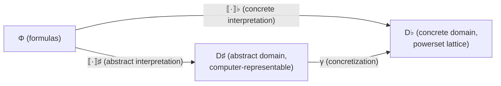

[[book-guidelines|↩ Back to guidelines]]

## Why constraint solving needs an abstract domain at all

A constraint satisfaction problem (CSP) is a tuple $(X, D, C)$: variables $X$, their value domains $D = D_1 \times \dots \times D_n$, and a set of relations $C$ that must all hold simultaneously. The *true* answer to a CSP — the thing you actually want — is its solution set: every assignment that satisfies every constraint at once. The paper calls this the **concrete domain**, and formalizes it as the powerset lattice

$$D^\flat = \langle \mathcal{P}(D), \supseteq \rangle$$

ordered by inclusion (reversed, so that "more solutions" is "lower" — this convention matters once you start intersecting constraints and want intersection to be a join). A CSP is then interpreted into this lattice via

$$\llbracket (X, D, C) \rrbracket^\flat = \{ (D_1', \dots, D_n') \mid D_i' \subseteq D_i \text{ and all } c \in C \text{ satisfied} \}$$

**What breaks without an abstraction step:** this concrete solution set is exact, but for anything beyond tiny finite domains it is either infinite (real- or integer-valued variables over unbounded ranges) or astronomically large to enumerate. You cannot hand a solver algorithm a literal powerset element and ask it to "check membership" or "intersect" in any tractable way — the representation itself is the problem. This is exactly the situation static analysis faces with program states: the set of reachable states is too large or infinite, so you replace it with a finite, computable *approximation* that is still sound to reason about. Abstract interpretation (Cousot & Cousot, 1977) is the general theory of doing this safely. This chapter adapts that theory — normally used to over-approximate the states a program can reach — to over- or under-approximate the solution set of a constraint problem instead.

The paper's governing picture is a commuting triangle relating three things: the syntax of the problem, its exact (concrete) meaning, and its computable (abstract) meaning:



$\Phi$ is the set of quantifier-free first-order formulas — the actual syntax you write down (`x > 4 ∧ x < 7`, say). $\llbracket \cdot \rrbracket^\flat$ interprets a formula into its exact concrete meaning; $\llbracket \cdot \rrbracket^\sharp$ interprets the *same* formula directly into an abstract domain element. The two are connected by a **concretization function** $\gamma : D^\sharp \to D^\flat$, which maps an abstract element back to the (possibly infinite) concrete set it stands for. Since the paper only ever moves in the $\gamma$ direction (rather than needing an abstraction function $\alpha : D^\flat \to D^\sharp$ satisfying a full Galois connection), it notes that $\alpha(\llbracket\varphi\rrbracket^\flat) = \llbracket\varphi\rrbracket^\sharp$ holds trivially here — the concrete side is *given* by the formula, not computed by projecting an arbitrary concrete set. From here on the paper drops the $\sharp$ superscript since almost everything happens in the abstract domain; this article does the same.

If you are coming from static analysis proper (Galois connections, widening operators), notice what is *absent* here: no widening, no join-based fixpoint over an infinite ascending chain of program states. That machinery reappears once approximations need to be *iterated* to a fixpoint — which is precisely what `closure` and the later "shared product" reduction operator will need — but the base definitions here are simpler because a CSP's concrete domain, while enormous, is not defined by an unbounded control-flow graph.

## Definition 1: what "abstract domain" means here

The classical abstract-interpretation notion of "abstract domain" is a lattice with concretization and some analysis-specific operators. This paper reuses that core (join, concretization) and *adds* two operators that only make sense for constraint solving: `state` and `split`. Definition 1 packages an abstract domain for constraint programming as a lattice $\langle A, \leq \rangle$ equipped with:

- $\bot$ — the smallest element (least information / "anything goes"), and $\top$ if it exists — the largest (typically "no solutions," i.e. inconsistency).
- $\sqcup : A \times A \to A$, the **join** — merges the information carried by two elements. This is where logical conjunction of constraints will live: interpreting `x > 2` and `x ≤ 4` separately and then joining them should give you "both hold at once."
- $\gamma : A \to D^\flat$, a **monotonic concretization function** mapping an abstract element to the concrete solution set it represents.
- $\mathrm{state} : A \to \mathbb{K}$, where $\mathbb{K} = \{\mathrm{true}, \mathrm{false}, \mathrm{unknown}\}$ is **Kleene logic** ($\mathrm{false} \wedge \mathrm{unknown} = \mathrm{false}$, $\mathrm{true} \wedge \mathrm{unknown} = \mathrm{unknown}$). `state` tells you whether an element already satisfies everything (`true`), already violates something (`false`), or hasn't been resolved yet (`unknown`).
- $\llbracket \cdot \rrbracket : \Phi \to A$, a **partial** interpretation function turning a syntactic formula into an abstract element. It's partial on purpose: a domain like boxes can't interpret `x = 1 ∨ x = 2` at all, and the paper is explicit that this should be a *hard failure* (undefined) rather than silently mapping unsupported formulas to $\bot$ — because $\bot$ is also what a *tautology* maps to, and conflating "this domain can't express this" with "this is trivially true" would be a real bug in a system meant to route formulas to the right domain.
- $\mathrm{closure} : A \to A$, an **extensive** function ($\forall x,\ x \leq \mathrm{closure}(x)$) that eliminates values inconsistent with the constraints already interpreted into the element.
- $\mathrm{split} : A \to \mathcal{P}(A)$, which divides one abstract element into a finite set of sub-elements — this is where case-splitting / branching search comes from.

**Why `state` and `closure` are two separate operators, not one.** It would be tempting to fold satisfiability checking into `closure` — "run closure, and if the result is inconsistent, that tells you `false`." But `closure` only removes *provably* inconsistent values; it says nothing about whether what remains is *provably* consistent. You genuinely need a three-valued answer, because "not yet proven inconsistent" and "proven consistent" are different states requiring different next actions (keep propagating vs. stop). Kleene's `unknown` is exactly the honest admission that a sound-but-incomplete propagation step hasn't resolved the question either way.

An abstract element $a$ **under-approximates** a formula $\varphi$ when $\gamma(a) \subseteq \llbracket\varphi\rrbracket^\flat$ (every point in $a$ really is a solution, but you might be missing some); it **over-approximates** when $\gamma(a) \supseteq \llbracket\varphi\rrbracket^\flat$ (no solutions are lost, but $a$ might also contain spurious non-solutions). This is the same over/under-approximation vocabulary as in general static analysis — over-approximation is what lets you *prove absence* of something (no solutions were dropped, so if the abstract element is empty, the concrete problem truly has none), while under-approximation is what lets you *prove presence* (anything you find really is a solution). If your target project is a verifier that proves bug absence via abstract interpretation while a CSP kernel searches for concrete counterexamples, this is the precise formal vocabulary for that division of labor: the invariant-generation side needs sound over-approximation, the counterexample-search side needs sound under-approximation (or, more usually, an over-approximation cheap enough to search inside, checked against the concrete semantics on success).

### A Rust sketch of Definition 1

Rust's trait system is a fairly literal transcription of "a lattice equipped with these operations" — each operator becomes a trait method, and Kleene logic becomes a three-variant enum instead of a bare boolean:

```rust
#[derive(Clone, Copy, PartialEq, Eq, Debug)]
enum Kleene { True, False, Unknown }

trait AbstractDomain: Sized + PartialOrd + Clone {
    /// γ: concretization is conceptually a (possibly infinite/lazy) set of concrete solutions.
    /// In practice you rarely materialize it — you use it only in soundness *arguments* —
    /// so most implementations don't literally implement this method.
    fn state(&self) -> Kleene;

    /// ⊥ and (optionally) ⊤
    fn bottom() -> Self;
    fn top() -> Option<Self>;

    /// ⊔ : join two elements (e.g. conjoining two constraints already interpreted)
    fn join(&self, other: &Self) -> Self;

    /// closure is extensive: for all a, a <= a.closure()
    fn closure(self) -> Self;

    /// split divides one element into a finite set of sub-elements for branching
    fn split(&self) -> Vec<Self>;
}

/// ⟦·⟧ : Φ → A is partial — this is exactly what `Option` is for.
trait Interpret<Formula>: AbstractDomain {
    fn interpret(formula: &Formula) -> Option<Self>;
}
```

Making `⟦·⟧` return `Option<Self>` rather than defaulting unsupported formulas to `bottom()` is a direct encoding of the paper's footnote 3 — it keeps "unsupported" and "tautological" observably distinct at the type level, which is exactly the distinction the paper insists on preserving.

### The `solve` algorithm: propagate and search

With Definition 1 in hand, the paper gives one generic algorithm, parametric in any abstract domain $A$:

$$
\begin{aligned}
&\textbf{function } \mathrm{solve}(a \in A):\\
&\quad a \leftarrow \mathrm{closure}(a)\\
&\quad \textbf{if } \mathrm{state}(a) = \mathrm{true} \textbf{ then return } \{a\}\\
&\quad \textbf{else if } \mathrm{state}(a) = \mathrm{false} \textbf{ then return } \{\}\\
&\quad \textbf{else}\\
&\qquad \langle a_1, \dots, a_n \rangle \leftarrow \mathrm{split}(a)\\
&\qquad \textbf{return } \bigcup_{i} \mathrm{solve}(a_i)
\end{aligned}
$$

This is the textbook constraint-programming pattern *propagate-and-search*: `closure` propagates as much information as possible (cheap, deterministic inference), `state` checks the two easy base cases, and `split` only fires — expensive branching — when propagation alone couldn't decide the question. Because `closure` is extensive and `split` is finite, and because the paper proves a termination condition elsewhere (Talbot et al., 2019), this recursion always bottoms out. Crucially, the over-/under-approximation properties of a single element *extend to the whole search*: $\bigcup \{\gamma(a) \mid a \in \mathrm{solve}(\llbracket\varphi\rrbracket)\} \supseteq \llbracket\varphi\rrbracket^\flat$ for the over-approximating case — running the whole search doesn't leak soundness, it composes.

```rust
fn solve<A: AbstractDomain>(a: A) -> Vec<A> {
    let a = a.closure();
    match a.state() {
        Kleene::True => vec![a],
        Kleene::False => vec![],
        Kleene::Unknown => a.split()
            .into_iter()
            .flat_map(solve)
            .collect(),
    }
}
```

Note how directly this generic function corresponds to what a Lean formalization of the same algorithm would need to prove terminating: you'd need `split` to always return an $A$ that is *strictly* more refined than its parent under some well-founded measure (typically domain size), otherwise `solve` isn't structurally recursive and Lean's termination checker would reject it outright — forcing you to supply exactly the termination argument the paper hand-waves to a separate citation. That's a useful diagnostic: if you can't see why a candidate `split` operator would satisfy well-founded decrease, you probably have a solver that can loop forever on unknown states.

## Two concrete instances: boxes and octagons

Definition 1 is a specification, not an implementation — the paper immediately instantiates it twice, and the contrast between the two is the chapter's real payload.

### The box abstract domain

Let $\mathbb{A} = \mathbb{Z} \cup \{-\infty, \infty\}$. An **interval** $[l..u]$ is a pair of bounds with $\gamma([l..u]) = \{x \in \mathbb{Z} \mid l \le x \le u\}$. Intervals form a lattice $I$ ordered by *reverse* set inclusion ($\leq \, \triangleq \, \supseteq$, so a smaller interval is "more information," matching the concrete domain's convention), with $\bot = [-\infty..\infty]$ (no information), $\top = \{\}$ (inconsistent), and join $\sqcup \triangleq \cap$ (intersecting intervals is exactly combining information). A **box** is an element of $[V \rightharpoonup I]$ — a partial function from variable names to intervals, i.e. an array of per-variable bounds. Boxes support only the constraint language $\{x \le b,\ x \ge b,\ x < b,\ x > b,\ x = b\}$.

The worked example from the paper: interpreting $\varphi = x > 2 \wedge x \le 4 \wedge y > 0$ in $B$,

$$\llbracket \varphi \rrbracket = \llbracket x > 2\rrbracket \sqcup \llbracket x \le 4\rrbracket \sqcup \llbracket y > 0\rrbracket = \{x \mapsto [3..\infty]\} \sqcup \{x \mapsto [-\infty..4]\} \sqcup \{y \mapsto [1..\infty]\} = \{x \mapsto [3..4],\ y \mapsto [1..\infty]\}$$

Note that logical conjunction *coincides with the lattice join* here — this is the mechanism that makes the whole framework work: instead of writing a bespoke "AND" for every domain, you get conjunction for free once you've defined $\sqcup$ correctly.

**Why `closure` is just the identity for boxes.** For every formula $\varphi$ that boxes can interpret at all, $\gamma(\llbracket\varphi\rrbracket)$ is *exactly* $\llbracket\varphi\rrbracket^\flat$ — both an over- and an under-approximation simultaneously, i.e. no approximation loss at all. There is nothing left for `closure` to tighten, because the interpretation function already extracted everything there is to extract from a single atomic bound constraint. Consistency (`state`) reduces to checking no variable's interval is empty — a linear scan, hence always resolvable to `true`/`false`, never genuinely stuck at `unknown` on its own. `split` picks a variable $x = [l..u]$ and divides, e.g. $\mathrm{split}(b) = \{ b \sqcup \llbracket x = l \rrbracket,\ b \sqcup \llbracket x > l \rrbracket \}$ — many other splitting heuristics are possible and this is where practical solving performance is won or lost.

```rust
use std::collections::HashMap;

type Bound = i64; // stand-in for ℤ ∪ {-∞, ∞}; a real impl uses a signed-infinity type
#[derive(Clone, Copy, PartialEq, Eq, Debug)]
struct Interval { lo: Bound, hi: Bound }

impl Interval {
    fn join(self, other: Interval) -> Interval {
        Interval { lo: self.lo.max(other.lo), hi: self.hi.min(other.hi) } // ⊔ = ∩
    }
    fn is_bottom_inconsistent(&self) -> bool { self.lo > self.hi } // empty interval ⇒ state = false
}

#[derive(Clone, Debug, Default)]
struct Box { vars: HashMap<String, Interval> }

impl Box {
    fn join(&self, other: &Box) -> Box {
        let mut out = self.vars.clone();
        for (k, v) in &other.vars {
            out.entry(k.clone())
                .and_modify(|cur| *cur = cur.join(*v))
                .or_insert(*v);
        }
        Box { vars: out }
    }
    fn closure(self) -> Box { self } // identity: no information loss in the box interpretation
    fn state(&self) -> Kleene {
        if self.vars.values().any(Interval::is_bottom_inconsistent) { Kleene::False } else { Kleene::True }
    }
}
```

### The octagon abstract domain

Octagons (Miné, 2006), denoted $O$, are strictly more expressive: they interpret constraints of the shape $\pm x \pm y \le c$ and $\pm x \le c$. Internally an octagon is a **difference-bound matrix (DBM)** of size $O(n^2)$ for $n$ variables — each cell records a tightest-known bound on a pairwise difference. Unlike boxes, an octagon's *raw* interpretation of a set of constraints is not automatically tight: two constraints can jointly imply a tighter bound on a third pair of variables that neither constraint states directly (classic transitive tightening, e.g. $x - y \le 2 \wedge y - z \le 3 \Rightarrow x - z \le 5$). Extracting all such implied bounds is exactly all-pairs shortest paths on the constraint graph, so **closure is Floyd-Warshall**, $O(n^3)$ in general, with an $O(n^2)$ incremental variant available when only a single constraint is freshly added (you only need to re-propagate from the two affected variables, not recompute from scratch).

This is the direct answer to why boxes get `closure = id` while octagons need real work: **boxes' interpretation function already produces the tightest possible element for every formula it supports**, because each atomic constraint touches exactly one variable, so there is no cross-variable information to propagate. Octagons' constraint language is inherently *relational* — bounds on one pair of variables can imply bounds on another pair — so extracting the tightest representation is a genuine fixpoint computation, not a lookup. This is the same trade-off that recurs throughout program analysis: more expressive abstract domains buy relational precision at the cost of a nontrivial closure/normalization step, and this complexity gap ($O(n^2)$ space, $O(n^3)$ closure) is precisely the kind of number you need on hand when deciding, for a real CSP kernel, which constraints are worth routing to a relational domain versus a per-variable one.

## The seam this chapter deliberately leaves open

The chapter closes by introducing **logic completion** $L(A)$ — a *domain transformer*: given any $A$, it produces a new abstract domain that additionally supports logical connectives (disjunction, etc.) over $A$'s constraint language. $x = 1 \vee x = 2$ isn't interpretable in $B$ or $O$ alone, but is in $L(B)$ or $L(O)$; there, $\mathrm{state}(\mathrm{closure}(\llbracket x{=}1 \vee x{=}2\rrbracket)) = \mathrm{unknown}$ until `split` forces the choice — disjunction is precisely where `unknown` and `split` earn their keep.

Then, to interpret a formula like $c_2 \triangleq (x>4 \wedge x<7) \Rightarrow y+z \le 4$, which mixes a cheap box-shaped part with a relational octagon-shaped part, the chapter introduces the **direct product** (Definition 2): $A_1 \times \dots \times A_n$ with every operator defined coordinatewise (join, closure, etc. applied component-by-component). Formulas are routed to a specific component via an annotation $\varphi{:}i$, formally $\llbracket\varphi{:}i\rrbracket \triangleq (\bot_1, \dots, \llbracket\varphi\rrbracket_i, \dots, \bot_n)$.

The chapter is explicit that this is *not yet* the full story, and says so on the last page: **the direct product's components never exchange information**. Each `closure_i` runs independently on its own coordinate; if $x$ appears in both a box constraint and an octagon constraint, tightening $x$'s interval in the box does nothing to the octagon's knowledge of $x$, and vice versa. That gap — no cross-domain propagation under coordinatewise composition — is exactly the limitation the next chapter's machinery (interval propagators completion, delayed product, shared product) is built to close. Reading this chapter's box/octagon material as "solved" would miss the point the authors are making: these are the *load-bearing components*, and the real contribution of the paper is the cooperation layer stacked on top, covered in the "[[Domain-Transformers|Domain Transformers]]" topic.

## Where this leads

This chapter is the foundation everything else in the paper stands on. `AbstractDomain`'s six-operator interface (join, $\gamma$, `state`, $\llbracket\cdot\rrbracket$, `closure`, `split`) is reused unchanged by every later construction — IPC, the delayed product, and the shared product are all *domain transformers*, i.e. functions that take one or more `AbstractDomain`s satisfying Definition 1 and produce a new one that still satisfies Definition 1. If you don't have this interface solid, nothing downstream typechecks, formally or literally (the paper's own OCaml functors mirror it directly).

For the **static-analysis** focus area: this chapter is a worked example of how the standard abstract-interpretation toolkit (concretization functions, over/under-approximation, monotonic lattices) gets specialized for a *search* problem rather than a *dataflow* problem — the extra `state`/`split` machinery is exactly the adaptation needed once you're not just computing a single fixpoint over a CFG but interleaving propagation with branching. The octagon-vs-box closure contrast is a concrete instance of the general "expressiveness costs you a nontrivial normalization/closure step" trade-off that governs every relational abstract domain (polyhedra, congruences, etc.) you'll weigh when designing invariant-generation passes.

For the **sat-smt-csp** focus area: this is the literal specification for the CSP kernel described in the standing project — `closure` is constraint propagation, `split` is branching search, and the box/octagon pair is a minimal instance of exactly the kind of domain *composition* problem you'll face when a real kernel needs both interval propagation (cheap, per-variable) and relational reasoning (octagon-like, or eventually automaton/DFA-shaped domains for structured data) cooperating on the same variables. The unresolved gap flagged at the end of this chapter — direct products don't share information across components — is the precise problem the Interval Propagators Completion and Delayed Product topics solve next, and it's the mechanism you'll need before a DFA-based abstract domain could ever cooperate with a numeric one in the same solver.
