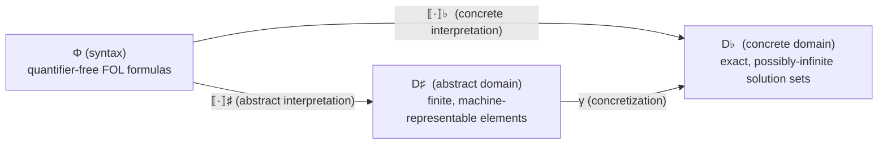

[[book-guidelines|↩ Back to guidelines]]

# Abstract Interpretation as a Foundation for Constraint Solving

## What breaks without this: the cooperation problem

Start from a mundane observation the paper makes in its very first paragraph: constraint
solvers are fast *because* they are narrow. A SAT solver is fast on Boolean formulas
precisely because it knows nothing about linear arithmetic. A linear-programming solver
is fast on linear constraints precisely because it assumes there's no disjunction. The
moment a real problem mixes constraint types — some Boolean, some arithmetic, some
symbolic — you're stuck choosing between (a) one solver general enough to swallow
everything, which is usually slow, or (b) gluing several specialized solvers together,
which is where "cooperation" becomes a research problem in its own right.

The dominant answer to (b) is SMT's Nelson-Oppen scheme: a fixed, hard-coded protocol
for how theories exchange information (essentially, share equalities over common
variables). It works, but it's *inflexible* — the cooperation strategy is baked into the
solver's architecture, not something you can swap out, extend, or reason about
independently of the theories being combined. Lazy clause generation and CLP-style
"bridges" are other point solutions to the same problem, each with its own bespoke
plumbing.

Talbot, Monfroy and Truchet's move is to stop treating "cooperation scheme" as an
architectural afterthought and instead give it the same first-class mathematical status
as "solver." Both become instances of one thing: an **abstract domain**, and cooperation
between solvers becomes a *domain transformer* — a functor that builds a new abstract
domain out of existing ones. That reframing is the entire payload of the paper (Sections
3 and 4 build IPC, the delayed product, and the shared product all as instances of this
idea) — but before any of it makes sense, you need the vocabulary this section
introduces: what an abstract domain *is*, and in what precise sense a computation over
one can be trusted to say something true about the real, concrete problem underneath.

This is also, not incidentally, the exact vocabulary you need if you're building a CSP
kernel that has to *prove the absence* of bugs by over-approximating semantics while
still being able to *find* concrete counterexamples: those are, respectively, the
abstract-domain side and the concrete-domain side of the triangle below, and the paper's
whole cooperation story rests on keeping the two honestly connected.

## The three-cornered picture: syntax, concrete semantics, abstract semantics

The paper draws one diagram that everything else hangs off:



Read it as three different *jobs*, not three different formalisms competing for the same
job:

- **Φ (syntax)** is just the formula as written — here, any quantifier-free first-order
  formula. It's what a user types, or what a program-analysis front end emits. It carries
  no semantics on its own.
- **D♭ (the concrete domain)** is the *true* meaning of that formula: its actual set of
  solutions, mathematically exact, no matter how large or infinite. For a CSP over real
  numbers, this can be an uncountable set — not something you can ever hold in memory.
- **D♯ (the abstract domain)** is the *computer-representable* stand-in: a finite
  structure (an interval, a set of linear inequalities, a difference-bound matrix — later
  sections build several) that a machine can actually store and manipulate, and that is
  connected back to D♭ by a promise of faithfulness.

That third arrow, $\gamma$, is what makes the abstract side more than a heuristic. Without
it, "abstract domain" would just mean "some data structure that's kind of related to the
constraints" — you'd have no way to state, let alone prove, that reasoning inside the
abstract domain tells you anything true about the real solution set. $\gamma$ is the whole
reason abstract interpretation is a *theory of static analysis* and not just a bag of
tricks.

Formally: $\gamma : D^\sharp \to D^\flat$ is a monotonic **concretization function**,
mapping every abstract element to the (exact) set of concrete values it stands for. The
paper notes in passing that classical abstract interpretation usually also has an
*abstraction* function $\alpha : D^\flat \to D^\sharp$ going the other way (forming a
Galois connection $(\alpha, \gamma)$ between the two lattices) — but here the concrete
solution set is always fixed and given directly by $\llbracket\varphi\rrbracket^\flat$,
so the paper doesn't need $\alpha$ as a free-standing function; it only ever uses the
composite $\alpha(\llbracket\varphi\rrbracket^\flat) = \llbracket\varphi\rrbracket^\sharp$.
If you've encountered Galois connections elsewhere in static analysis, this is the same
skeleton, just specialized to the case where you only ever move in one direction.

**Concrete domain, spelled out.** A CSP is a triple $(X, D, C)$: variables $X$, their
value domains $D = D_1 \times \dots \times D_n$, and constraints $C$. The concrete domain
is the *powerset lattice* $D^\flat = \langle \mathcal{P}(D), \supseteq \rangle$ — every
possible subset of the full value space, ordered by *reverse* inclusion (so "more
constrained" points downward, toward the empty/unsatisfiable set — this ordering
convention matters once you get to `join` later, where combining information should move
you toward a smaller solution set). The concrete interpretation of a CSP is exactly the
set of tuples that satisfy every constraint:

$$
\llbracket(X, D, C)\rrbracket^\flat = \{(D_1', \ldots, D_n') \mid D_i' \subseteq D_i \text{ and all } c \in C \text{ satisfied}\}
$$

There is nothing clever here by design — it's the textbook definition of "the solutions
of a CSP." The interesting content of the paper starts precisely because this set is
usually *not* something you can compute with directly.

## Under-approximation and over-approximation: the two ways to be honest about being wrong

An abstract element $a \in D^\sharp$ almost never captures the concrete solution set
*exactly*. What it can do is capture it **soundly**, in one of two directions:

$$
a \text{ under-approximates } \varphi \iff \gamma(a) \subseteq \llbracket\varphi\rrbracket^\flat
$$
$$
a \text{ over-approximates } \varphi \iff \gamma(a) \supseteq \llbracket\varphi\rrbracket^\flat
$$

These read almost like opposites but they buy you very different guarantees:

- **Under-approximation** ($\gamma(a) \subseteq \llbracket\varphi\rrbracket^\flat$):
  everything $a$ claims is a solution really *is* one — but $a$ might be missing some.
  This is the "I found a genuine counterexample/witness, trust it outright" regime. It is
  exactly the guarantee you want when a CSP kernel is searching for a concrete,
  satisfying assignment to demonstrate a bug is real: any witness the search returns is
  automatically valid, no further checking needed.
- **Over-approximation** ($\gamma(a) \supseteq \llbracket\varphi\rrbracket^\flat$):
  every real solution is still accounted for inside $a$ — but $a$ might also contain
  spurious, non-solution points. This is the "I haven't ruled out anything real, but I
  might be carrying junk" regime. It's exactly the guarantee behind proving the *absence*
  of a bug by static analysis: if the over-approximated abstract element is already
  empty/inconsistent, the real, un-approximated set of bad states must be empty too,
  because it was never dropped.

Put them side by side and you get a clean read on the two halves of the compiler project
this book serves: **abstract interpretation with over-approximation proves absence** (no
real bug was ever excluded from the search, so if the abstract search comes up empty, so
does the concrete one); **CSP-style concrete search with under-approximation proves
presence** (any witness found is guaranteed real). Neither technique needs the other to
be individually sound — but a serious verification toolchain wants both, because
over-approximation alone can never *confirm* a bug (it might just be reporting a spurious
point), and under-approximating search alone can never *refute* one (it might just not
have looked hard enough).

**The box domain makes this concrete.** The paper's first real abstract domain, boxes
($B$), maps variables to intervals — $x \mapsto [l..u]$ — and supports constraints like
$x \leq b$, $x \geq b$, $x = b$. For example:

$$
B = \llbracket x > 2 \land x \leq 4 \land y > 0\rrbracket = \{x \mapsto [3..4],\ y \mapsto [1..\infty]\}
$$

Because interval arithmetic over these particular constraint shapes is *exact* — no
information is lost translating $x > 2$ into $[3..\infty]$ (assuming integers) — boxes
achieve the rare case where the interpretation function is **both** an under- and an
over-approximation simultaneously: $\gamma(\llbracket\varphi\rrbracket) \subseteq
\llbracket\varphi\rrbracket^\flat$ *and* $\gamma(\llbracket\varphi\rrbracket) \supseteq
\llbracket\varphi\rrbracket^\flat$, i.e. equality. This is precisely why `closure` is the
identity function for boxes (there's nothing left to tighten — you already have the best
possible approximation) — and precisely why the octagon domain, one step more expressive
(constraints of the form $\pm x \pm y \leq c$), does *not* get this for free and needs a
real closure operator (Floyd–Warshall) to squeeze out implied information. That contrast
is worth sitting with: approximation quality is not a property of "abstract domains" in
the abstract, it's a property of how well a *specific* domain's representable shapes
match a *specific* constraint language's shapes. The moment your constraint language
outgrows what the domain can represent exactly, you start over-approximating, and closure
becomes the mechanism that claws back precision.

## Soundness: what it actually buys the solving algorithm

All of this machinery earns its keep in the generic `solve` procedure the paper gives,
which is the paper's abstract shape of every propagate-and-search constraint solver:

```
function solve(a ∈ A)
    a ← closure(a)
    if state(a) = true  then return {a}
    else if state(a) = false then return {}
    else
        ⟨a1, …, an⟩ ← split(a)
        return ⋃ solve(ai)
```

The soundness claim the paper makes about this loop is:

$$
\bigcup \{\gamma(a) \mid a \in \mathrm{solve}(\llbracket\varphi\rrbracket)\} \supseteq \llbracket\varphi\rrbracket^\flat
$$

(and dually for the under-approximating case). In words: **no real solution is ever lost
across any number of closure/split steps.** This is the property that makes the whole
recursive, branching search *trustworthy* rather than merely "a heuristic that usually
works": it's an invariant carried through every call, not something re-checked at the
end. Notice what's doing the load-bearing work here — `closure` is required to be
*extensive* ($\forall x,\ x \leq \mathrm{closure}(x)$, Definition 1), meaning it can only
ever tighten an abstract element, never discard a value that was genuinely still live;
and `split` is required to be exhaustive over its input. Soundness of the whole algorithm
is not proved from scratch at this level — it's *inherited* structurally from the
per-operator contracts in Definition 1, which is exactly the property you want from a
verification toolchain's trusted core: you check the small, local contracts once (per
abstract domain), and every composition built on top of them for free inherits a global
guarantee, all the way up through the [[Domain-Transformers|domain transformers]] built in later sections.

## Grounding the triangle in code

**Rust — the triangle as a trait.** The syntax/concrete/abstract split maps naturally
onto a trait that separates *representation* (what the abstract domain stores) from
*meaning* (what it's a sound approximation of). The concrete domain is deliberately never
materialized at runtime — it exists only as a specification you're proving against, which
Rust can express as a doc-comment contract on the trait rather than as running code:

```rust
/// γ: an abstract element's meaning, spelled out as the set of concrete
/// tuples it stands for. Never actually enumerated at runtime for infinite
/// domains — it exists to state (and, in tests, spot-check on finite
/// instances) the soundness contract below.
trait AbstractDomain: Sized {
    type ConcreteValue;

    /// Contract (not enforced by the type system, but the reason this
    /// trait exists): for every `phi` such that `interpret(phi)` returns
    /// `Some(a)`, the caller may rely on
    ///     over_approximates(a, phi)  ==  true
    /// i.e. gamma(a) ⊇ [[phi]]_flat.
    fn interpret(phi: &Formula) -> Option<Self>;

    fn closure(self) -> Self;          // extensive: self <= self.closure()
    fn state(&self) -> Kleene;         // True | False | Unknown
    fn split(self) -> Vec<Self>;
    fn join(self, other: Self) -> Self;
}

enum Kleene { True, False, Unknown }
```

The point of writing it this way is that `interpret` is the only place $\llbracket\cdot\rrbracket$
actually happens, and everything downstream (`closure`, `split`, the generic `solve` loop)
only ever touches abstract values — it never needs to know it's over-approximating,
because the *contract*, not the code, is what carries the over-approximation guarantee
forward. This is exactly the shape a Rust-based verifier's abstract-interpretation pass
would take: one narrow, carefully audited boundary (`interpret`) where soundness has to
be argued by hand, and a large amount of generic machinery built on top that inherits
correctness structurally.

**Python — the concrete domain, made briefly real.** Because $D^\flat$ is normally
infinite, you can't run it — but on a small, finite instance you can materialize it
directly, which is a useful sanity check when testing an abstract domain implementation
against ground truth:

```python
def concrete_solutions(variables, domains, constraints):
    """Brute-force D-flat on a small finite instance — this is [[.]]^flat,
    made computable only because domains here are tiny."""
    import itertools
    names = list(variables)
    for values in itertools.product(*(domains[v] for v in names)):
        assignment = dict(zip(names, values))
        if all(c(assignment) for c in constraints):
            yield assignment
```

Any abstract-domain implementation can be unit-tested against this: over-approximation
means `gamma(interpret(phi))` should be a *superset* of what this function enumerates on
every small test instance; under-approximation, a *subset*.

**Lean — stating soundness as a proposition worth proving.** Where Rust encodes the
contract as a comment and Python spot-checks it on finite instances, Lean lets you state
the soundness property itself as a first-class proposition — the thing a trusted kernel
would actually want proved, not merely tested:

```lean
-- γ and the two interpretations, kept abstract (uninterpreted) here —
-- the point is the *shape* of the soundness statement, not a full model.
variable {Formula ConcreteSet AbstractElem : Type}
variable (γ : AbstractElem → ConcreteSet) (interpConcrete : Formula → ConcreteSet)
variable (interpAbstract : Formula → Option AbstractElem)
variable (subset : ConcreteSet → ConcreteSet → Prop)

def OverApproximates (a : AbstractElem) (φ : Formula) : Prop :=
  subset (interpConcrete φ) (γ a)   -- ⟦φ⟧♭ ⊆ γ(a)

theorem interpret_is_sound (φ : Formula) (a : AbstractElem)
    (h : interpAbstract φ = some a) : OverApproximates γ interpConcrete subset a φ := by
  sorry -- the one obligation every concrete abstract domain must discharge
```

This is the honest shape of the trusted computing base for an abstract-interpretation
pass: everything else in the paper (boxes, octagons, and every domain transformer built
in Section 3) is a specific instantiation of `AbstractElem` and a specific proof
discharging exactly this `sorry`. Notice the theorem's *statement* never changes across
instantiations — only the proof does. That's the payoff of pinning down the triangle
carefully before building anything on top of it.

## Where this leads

Everything built in the rest of the paper is a controlled way of composing abstract
domains while keeping this soundness contract intact. The direct product (end of
Chapter 2) is the first, crude combinator — it composes two abstract domains
coordinatewise but lets no information flow between them. The interval propagators
completion, the delayed product, and the shared product (Chapter 3) are all, at bottom,
more sophisticated domain transformers whose entire justification is a soundness proof of
exactly the shape above: "if the components were sound over-approximations, the
combination still is." None of those proofs would even *type-check* conceptually without
the vocabulary fixed here — $\gamma$, over/under-approximation, and the extensive-closure
argument behind `solve`'s global guarantee.

For the standing project this vault is built around: this is the load-bearing definition
underneath both halves of the planned CSP kernel (Focus Areas `static-analysis` and
`sat-smt-csp`). The abstract-interpretation side (over-approximation, proving *absence*
of invariant violations — the mechanism behind automated Hoare-contract and Horn-clause
generation) and the concrete-search side (under-approximation, proving *presence* of a
counterexample) are not two unrelated techniques bolted together after the fact — they
are literally the two inequalities in this section, $\gamma(a) \supseteq
\llbracket\varphi\rrbracket^\flat$ and $\gamma(a) \subseteq \llbracket\varphi\rrbracket^\flat$,
aimed at the same lattice from opposite sides. Any soundness argument for the compiler's
invariant-generation pass will ultimately bottom out in an instance of the
`over_approximates` contract sketched above; the Galois-connection remark on $\alpha$ and
$\gamma$ is also worth keeping in your back pocket if a later abstract domain (unlike this
paper's CSP domains) needs abstraction to go both directions.
