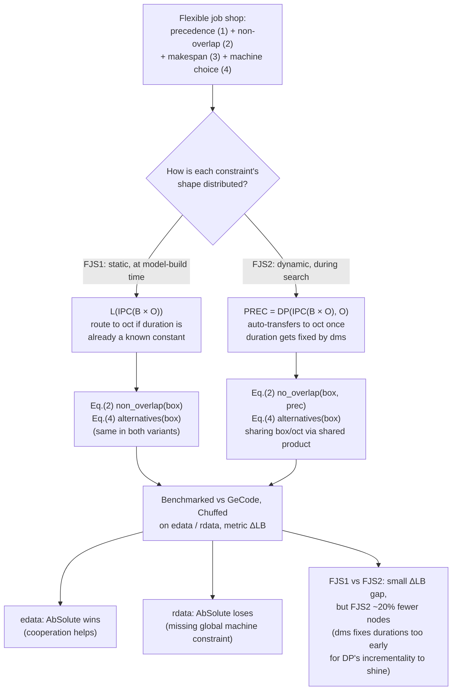

[[book-guidelines|↩ Back to guidelines]]

## Why the paper needs a case study at all

Everything up to this point in the paper — abstract domains, direct products, IPC, the delayed product, the shared product — is machinery for combining domains *in the abstract*. None of it proves the framework is anything more than an elegant reformulation of ideas that were already known to work individually (boxes, octagons, Nelson-Oppen-style cooperation). The paper needs one worked example that is simultaneously (a) genuinely hard — not a toy problem a single domain would solve just as well — and (b) structured enough that the *reasons* for choosing one domain composition over another are visible and explainable, not just an empirical accident.

Flexible job shop scheduling is that example. It naturally decomposes into three constraint *shapes* — sequencing, disjunctive non-overlap, and discrete choice — of the kind that different abstract domains are good at for different reasons. That's exactly the setting where "cooperation" stops being a slogan and starts being a design decision you can watch the paper make, step by step.

**What breaks without a case study:** you'd be left trusting that IPC, DP, and the shared product compose cleanly in practice on the strength of the lattice theory alone. Lattice theory guarantees soundness (nothing given up as a solution is real solutions), but it says nothing about whether the resulting solver is *fast*. The case study is where the paper has to put its money where its mouth is on performance, not just correctness.

## The problem, from parameters to decision variables

### Job shop scheduling (the classical, non-flexible version)

You have $n$ jobs and $m$ machines. Job $j$ is a fixed sequence of $T_j$ tasks, each of which must run on a specific machine, in order. For task $t$ of job $j$:

- $d_{j,t} \in \mathbb{Z}$ — the task's duration (a *known constant* in the classical version),
- $m_{j,t} \in \{1, \dots, m\}$ — the machine it runs on (also a known constant),
- $s_{j,t}$ — the task's starting date (the actual *decision variable* to be solved for).

Two families of constraints capture the physical reality of a shop floor. First, **precedence**: within one job, task $t+1$ can't start until task $t$ finishes.

$$\forall 1 \leq j \leq n,\ \forall 1 \leq t \leq T_j - 1,\quad s_{j,t} + d_{j,t} \leq s_{j,t+1} \tag{1}$$

Second, **non-overlap**: any two tasks from *different* jobs that happen to share a machine can't run at the same time — one has to finish before the other starts, in either order.

$$\forall 1 \leq i < j \leq n,\ \forall 1 \leq t \leq T_i,\ \forall 1 \leq u \leq T_j,\quad m_{i,t} = m_{j,u} \implies s_{i,t} + d_{i,t} \leq s_{j,u} \lor s_{j,u} + d_{j,u} \leq s_{i,t} \tag{2}$$

The objective is to minimize the **makespan** — the time the last task on the last machine finishes:

$$\forall 1 \leq j \leq n,\quad s_{j,T_j} + d_{j,T_j} \leq \mathit{makespan} \tag{3}$$

Job shop scheduling is NP-hard even in this "classical" form — precedence alone is easy (it's just a DAG of inequalities), but the *disjunction* in Eq. (2) is where the combinatorial explosion lives: for every pair of same-machine tasks, the solver must decide which one goes first, and that's a search over an exponential space of orderings.

### Flexible job shop: machine assignment becomes part of the search

The **flexible** job shop scheduling problem (Brucker and Schlie, 1990) generalizes this by no longer fixing which machine each task runs on. Instead, each task $t$ of job $j$ has a *set* of candidate machines $M_{j,t} \subseteq \{1, \dots, m\}$, and running on different machines takes different amounts of time — a constant $\mathit{dur}_{j,t,k}$ for each candidate machine $k \in M_{j,t}$. Both $m_{j,t}$ and $d_{j,t}$ stop being parameters and become decision variables:

$$\forall 1 \leq j \leq n,\ \forall 1 \leq t \leq T_j,\quad \bigvee_{k \in M_{j,t}} m_{j,t} = k \land d_{j,t} = \mathit{dur}_{j,t,k} \tag{4}$$

Read in words: task $t$ must be assigned to *exactly one* of its candidate machines $k$, and once assigned, its duration is pinned to whatever that machine's duration constant is. Constraints (1)–(3) stay syntactically identical, but now range over variables that used to be constants — which is precisely why they can no longer be pre-processed away before search even starts. This one extra layer of indirection (machine assignment as a *choice*, not a *given*) is what turns this problem into a genuine three-way mixture of constraint shapes: linear precedence, disjunctive non-overlap, and discrete assignment — each of which the paper's earlier chapters gave you a different specialized tool for.

## Crafting FJS1: statically distributing constraints by shape

The blunt-force solution is $L(IPC(B))$ — logic completion over a single box domain, wrapped in propagator completion. It's expressive enough to represent all of Eqs. (1)–(4) directly. But boxes only track independent per-variable intervals; they have no native representation of a *relationship between two variables* like $s_{j,t} + d - s_{j,t+1} \leq 0$, so all of that relational structure has to be recovered the slow way, through repeated propagator firings. Octagons, recall from earlier in the paper, represent exactly this shape of constraint — $\pm x \pm y \leq c$ — natively, with the reduced-form/closure machinery (Floyd–Warshall) doing in one systematic pass what boxes would need many propagation rounds to approximate.

So the paper's first move is to build a **product domain**, named $\mathrm{FJS}_1$, that gives precedence constraints a chance to land in an octagon whenever the shape lets them:

$$\begin{aligned}
B &\to \mathit{box}; \\
O &\to \mathit{oct}; \\
L(IPC(B \times O)) &\to \mathit{any}((\mathit{box}, \mathit{oct}));
\end{aligned}$$

This is the shared-product declaration syntax from §3.3: `box` and `oct` are named, explicitly declared components (even though nothing shares them here — the paper notes they still need to be declared so that `oct`'s `closure` actually gets invoked; `IPC` does not call its underlying domain's closure for you, only its own propagators). `any` is the formula-annotation tag that says "route this formula through the whole product, let interpretation figure out where it fits."

At first glance, octagons look useless for Eq. (1): a precedence constraint mentions the *duration* $d_{j,t}$ too, so it's syntactically a **three**-variable constraint ($s_{j,t} + d_{j,t} \leq s_{j,t+1}$), and octagons only capture *two*-variable difference constraints. But here's the case-study-specific observation that makes FJS1 non-trivial: for many real instances, some tasks can only run on a single machine, or take the same duration on every candidate machine. In exactly those cases, $d_{j,t}$ is *already a known constant* $d_0$ before the search even starts — no branching required — and the "three-variable" constraint is actually a two-variable one in disguise. The paper distributes Eq. (1) accordingly:

$$\forall 1 \leq j \leq n,\ \forall 1 \leq t \leq T_j - 1,\quad
\begin{cases}
(s_{j,t} + d_0 \leq s_{j,t+1}) : \mathit{oct} & \text{if } \{d_0\} = \{\mathit{dur}_{j,t,k} \mid k \in M_{j,t}\} \\
(s_{j,t} + d_{j,t} \leq s_{j,t+1}) : \mathit{any} & \text{otherwise}
\end{cases}$$

The `:oct` / `:any` suffixes are the formula-annotation mechanism from Chapter 3's direct product, reused here to route each ground instance of Eq. (1) to the cheapest domain that can actually represent it. The same split applies to Eq. (3) (the makespan constraint has the identical two-vs-three-variable shape). Everything else — the disjunctions in Eq. (2), the machine-choice disjunctions in Eq. (4) — goes to `any`, since neither is octagon-shaped. Finally, since IPC needs every variable registered in the underlying box domain before propagation can reference it, the domain bounds themselves are asserted in `box` up front, using a horizon constant $h$ (the latest date any task could plausibly start):

$$(s_{j,t} \leq h \land \mathit{makespan} \leq h \land m_{j,t} \leq \max(M_{j,t}) \land d_{j,t} \leq \max(\{\mathit{dur}_{j,t,k} \mid k \in M_{j,t}\})) : \mathit{box}$$

**This is a static dispatch.** The routing decision — which constraints go to octagons, which stay general — is made once, when the model is built, by inspecting the problem data (is the duration set a singleton?). Nothing about it changes as search proceeds.

## Crafting FJS2: letting the delayed product dispatch dynamically

FJS1's limitation is exactly the "otherwise" branch above: any task whose duration *isn't* fixed in the input data is stuck going through `any` — the slow, general path — for its entire precedence constraint, even though during search the solver will eventually pick a concrete duration for it (recall: `dms`, the search strategy used here, fixes all durations before touching anything else). Once that happens, the constraint *becomes* octagon-shaped, but FJS1 has no mechanism to notice and re-route it. This is precisely the gap the delayed product (DP) was built to close — and the paper uses it here as the payoff for the earlier machinery, not just as an illustration.

FJS2 builds a dedicated domain for precedence constraints:

$$\mathit{PREC} = DP(IPC(B \times O),\ O)$$

Three-variable precedence constraints (durations still free) are interpreted in the general side, $IPC(B \times O)$ — same as FJS1's fallback. But the moment a duration variable gets fixed during search, DP's `closure` rewrites the constraint under that instantiation and finds it's now a two-variable difference constraint that the plain octagon domain $O$ can accept — and transfers it there, exactly as described in [[Delayed-Product-DP|Delayed Product (DP)]]. This happens *during search*, per search node, driven by whatever the solver has learned so far — not once, at model-construction time.

The full FJS2 declaration distributes the three constraint families across three different transformers, each chosen for the *shape* of constraint it owns:

$$\begin{aligned}
B &\to \mathit{box}; \\
O &\to \mathit{oct}; \\
\mathit{PREC} &\to \mathit{prec}((( \mathit{box}, \mathit{oct} )), \mathit{oct}); &&\text{precedence, Eqs. (1) and (3)} \\
L(B \times \mathit{PREC}) &\to \mathit{no\_overlap}(\mathit{box}, \mathit{prec}); &&\text{non-overlap, Eq. (2)} \\
L(B) &\to \mathit{alternatives}(\mathit{box}); &&\text{machine alternatives, Eq. (4)}
\end{aligned}$$

Notice the double-nested parentheses `((box, oct))` in the `PREC` declaration — this is the shared-product dependency syntax again, saying that `PREC`'s internal `IPC(B × O)` component depends on the *same* `box` and `oct` objects used elsewhere, not private copies. That sharing matters concretely here: the `no_overlap` domain needs to read precedence facts that `PREC` derives, and `alternatives` needs to see the same box-domain bounds that `PREC` and `no_overlap` are also updating. Without shared pointers (§3.3's mechanism), each transformer would silently drift out of sync with the others' view of the same variables.

Each constraint family maps onto exactly the domain built to be good at it:
- Eq. (2)'s implications-of-disjunctions go to `no_overlap`, whose atoms are either equalities on `box` (checking $m_{i,t} = m_{j,u}$) or precedence facts read off `PREC`.
- Eq. (4)'s machine-choice disjunction, despite superficially looking like it could go through `no_overlap` too, is routed to a dedicated `alternatives` domain instead — the paper is explicit that this avoids "unnecessary indirection," since `PREC` has nothing useful to contribute to a pure discrete-choice constraint.

This is the case study's real lesson, stated plainly: **a good abstract-domain composition is not "throw everything into the most expressive product available." It's matching each syntactic shape of constraint in the problem to the cheapest domain that can represent that shape exactly, and using the paper's transformers (direct product, IPC, DP, shared product) as the glue that keeps those specialized domains talking to each other without duplicating state.**

## From theory to OCaml: Appendix A

The paper closes the loop by showing that FJS1's mathematical declaration above is essentially just OCaml functor application. This detail matters for the paper's larger argument (stated in the introduction) that abstract interpretation is not merely a *post hoc* description of an implementation, but a design language the implementation can be mechanically derived from:

```ocaml
module Box = Box_base(Box_split.First_fail_LB)(Bound_int)
module Octagon = Octagon.Make(ClosureHoistZ)(Octagon_split.MSLF)

module BoxOct = Direct_product(Prod_cons(Box)(Prod_atom(Octagon)))
module IPC = Propagator_completion(Box.Vardom)(BoxOct)

module LC = Logic_completion(IPC)
module FJS = Shared_product(
  Prod_cons(BoxOct)(
  Prod_cons(IPC)(
  Prod_atom(LC))))
```

Each line is a direct transliteration of a mathematical construction from earlier chapters: `Direct_product` is Definition 2's coordinatewise product, `Propagator_completion` is IPC parametrized additionally by a *variable domain* (here, integers — the numeric type propagation itself is evaluated in, which matters when component domains disagree, e.g. combining an integer box with a floating-point one would need a rational variable domain to subsume both), `Logic_completion` adds logical connectors, and `Shared_product` is Definition 5. `Box_split` and `Octagon_split` parametrize each leaf domain's `split` operator (its branching heuristic during search) independently of everything above it — a clean separation the functor style buys for free.

## Empirical results: what cooperation actually bought

The experiments run three solvers — AbSolute (implementing FJS1 and FJS2), GeCode (a mature propagation-based solver), and Chuffed (a hybrid propagation/SAT solver, state of the art on scheduling) — on two instance families from Hurink et al. (1994): **edata** (few candidate machines per task) and **rdata** (many candidate machines per task). All solvers use the same search strategy, `dms` (domain-min-size / first-fail): fix all durations first, then all machine assignments, then all starting dates. The metric, $\Delta LB$, is the percentage gap between a solver's best found solution and the best known lower bound — lower is better, and the table reports pairwise counts of how often one solver beats another.

Three findings, and what each one actually tells you about the framework (not just about this one solver):

1. **AbSolute (a prototype!) beats GeCode and Chuffed on edata** — 36 and 23 strictly-better bounds, respectively, out of 66 instances. This is direct evidence that letting boxes and octagons *communicate* (via IPC and the shared product) buys something a monolithic propagation engine doesn't automatically get.
2. **AbSolute falls behind on rdata**, where each task has many candidate machines. The paper's own diagnosis: this isn't a weakness of the abstract-interpretation framework per se — it's that AbSolute has no dedicated *global constraint* for machine-cumulative-capacity reasoning, which GeCode and Chuffed both do have. In other words, the case study surfaces a genuine engineering gap (missing a specialized propagator), not a conceptual one.
3. **FJS2 barely beats FJS1 in $\Delta LB$**, despite DP's dynamic dispatch being strictly more capable than FJS1's static split. The paper's explanation is precise and worth internalizing: `dms` fixes *all* durations before branching on anything else, so DP's early over-approximated transfers — the whole point of §3.2's partial-transfer mechanism — mostly fire near the *root* of the search tree, before most of the actual branching happens below. DP's incrementality has little runway to matter under this particular variable-ordering heuristic. It does still help — FJS2 finds its best bound roughly 20% faster (fewer search nodes) than FJS1 on about 90% of instances — just not enough to move the $\Delta LB$ headline number much.

**What breaks without this honesty in the write-up:** a paper that only reported "FJS2 wins" would be making an unfalsifiable claim about the framework's general superiority. By explaining *why* the gain is small — tying it to a specific interaction between DP's transfer timing and `dms`'s variable ordering — the paper turns a weak empirical result into an actual insight: *cooperation granularity and search-strategy design are coupled decisions*, not independent ones. A different search strategy that delays duration-fixing would likely make FJS2's advantage far more visible.

## Structure at a glance



## Where this leads

This case study is the paper's proof of concept, not an isolated example — it exercises *every* construction introduced earlier: boxes and octagons (Chapter 2), the direct product and logic completion (§3.1), IPC (§3.1), the delayed product (§3.2, via `PREC`), and the shared product (§3.3, via the shared `box`/`oct` dependencies across `PREC`, `no_overlap`, and the rest of FJS2). The Conclusion (Chapter 5) explicitly points back at this case study's weak spots — the missing global constraint on rdata motivates the future-work item on richer abstract domains, and the `dms`-limits-DP's-benefit finding motivates the future-work item on customizable search strategies via spacetime programming, since a smarter search order is exactly what would let DP's dynamic dispatch pay off more.

**For the standing project (`sat-smt-csp` and `static-analysis` focus areas):** this case study is a template for how to *evaluate*, not just build, a CSP kernel meant to search for concrete counterexamples against refinement-type invariants. Three transferable lessons: (1) match each syntactic constraint shape in your verification-condition language (linear arithmetic, disjunctive case splits, discrete enum-like choices) to a specialized abstract domain the way FJS2 matches precedence/non-overlap/alternatives to PREC/no_overlap/alternatives — don't route everything through one maximally-expressive-but-slow domain; (2) the DP-vs-`dms` interaction is a concrete warning that a constraint-transfer mechanism's benefit is *not* independent of variable/branch ordering — when you build the CSP kernel's search strategy for finding counterexamples, its interaction with any incremental-specialization machinery (e.g. promoting a nonlinear constraint to linear once enough variables are pinned) needs to be evaluated jointly, not separately; (3) the paper's honesty about the rdata regression (missing global constraint) is a reminder that soundness from the abstract-interpretation side doesn't automatically deliver competitive performance — some constraint shapes (cumulative/global constraints, here) may need a dedicated abstract domain rather than being decomposed into more primitive ones, a design question that will recur when deciding how much of your Hoare-contract / Horn-clause invariant generation to route through generic domains versus purpose-built ones for common patterns (array bounds, resource counting, etc.).
