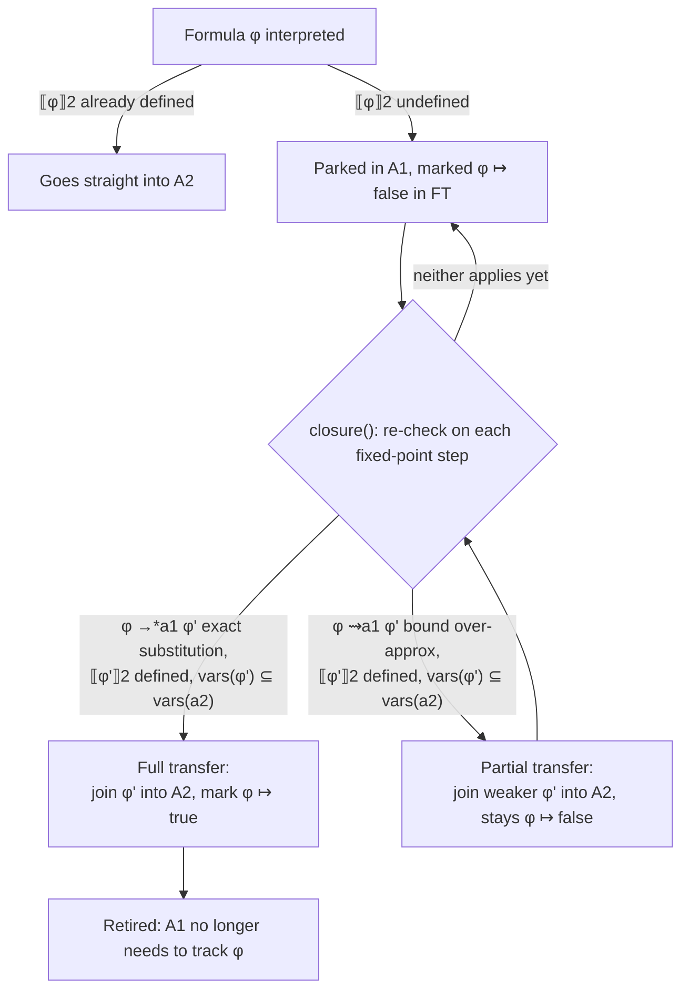

[[book-guidelines|↩ Back to guidelines]]

## The problem IPC can't solve

The paper's previous domain transformer, the **interval propagators completion (IPC)**, lets abstract domains gossip about *bounds*. If a box domain learns that $x \in [1..2]$, that fact can flow into an octagon domain that shares the variable $x$. But bounds are the only currency IPC trades in. Consider the constraint

$$c_3 \equiv x > 1 \land x + y + z \leq 5 \land y - z \leq 3$$

The sub-constraint $x + y + z \leq 5$ mentions three variables at once — no domain the paper has introduced so far (boxes, octagons) can represent a genuine three-variable linear constraint natively; IPC can only propagate its effect on individual variable *bounds* via a hand-written propagator. That's a real loss: octagons *could* represent $y + z \leq 5 - x$ exactly, as a two-variable difference-bound constraint, the moment $x$ stops being a free variable. IPC has no mechanism for that — it only ever exchanges intervals, never rewrites a formula into a cheaper domain's native syntax.

**What breaks without DP:** every constraint gets stuck in whichever domain was expressive enough to accept it in the first place, even after the solving process has made that domain's extra expressiveness unnecessary. You pay full price for generality for the entire search, instead of "specializing" a constraint down to a cheap domain once specialization becomes possible.

## The inspiration: delayed goals in logic programming

The paper is explicit that this construction is not invented from pure lattice theory — it is a reformulation of an *operational*, control-flow idea from logic programming: **delayed goals**. In Prolog-family systems, a goal (e.g., a constraint) can be suspended — parked, unevaluated — until some variable it depends on becomes bound, at which point it "wakes up" and gets resolved with the now-available information. The delayed product (DP) is that same idea, but recast as a composition of *abstract domains* rather than a control-theoretic mechanism baked into an interpreter. This is one of the paper's central claims: abstract interpretation is expressive enough to absorb operational concepts like delayed goals as a first-class algebraic construction (a functor on abstract domains), not just static analyses.

If you've worked with reactive systems or promises/futures, the shape is familiar: a computation is deferred, guarded by a readiness condition, and rewritten into a more specific form once the condition fires. DP formalizes exactly this guard-and-rewrite pattern as an abstract-domain constructor.

## Setting up the machinery

### Instantiation: when is a variable "ready"?

DP needs a precise notion of "a variable has enough information for us to substitute it away." The paper defines **instantiation** using the projection function `project` introduced for IPC (recall: `project(a, x)` over-approximates the interval that variable $x$ can take in abstract element $a$):

$$\mathit{fix}(a, x) \iff x_\ell = x_u, \quad \text{where } \mathit{project}(a, x) = [x_\ell .. x_u]$$

In words: $x$ is *fixed* (instantiated) in $a$ exactly when its projected interval has collapsed to a single point — lower bound equals upper bound. When that holds, `val(a, x)` denotes that single value.

### Rewriting formulas under instantiation

Once some variables in a formula are fixed, you want to substitute them out and simplify. The paper defines a rewriting relation $\varphi \to_a \varphi'$:

$$\varphi \to_a \begin{cases} \varphi[x \mapsto \mathit{val}(a,x)] & \text{if } \exists x \in \mathit{vars}(\varphi),\ \mathit{fix}(a, x) \\ \varphi & \text{otherwise} \end{cases}$$

This is ordinary substitution — replace an instantiated variable with its concrete value — but it's the *engine* that will let a constraint migrate from an expressive-but-slow domain into a specialized-but-fast one: $x + y + z \leq 5$ rewrites to $y + z \leq 5 - v$ the instant $x$ is fixed to $v$, and $y + z \leq 5 - v$ is now something an octagon domain can represent exactly (a two-variable difference-bound constraint).

### Tracking transfer status

A constraint can be in one of two states relative to the target domain: not yet transferred, or fully transferred. The paper models this as a lattice of partial functions from formulas to booleans:

$$FT = [\Phi \rightharpoonup \mathit{Bool}], \qquad \mathit{Bool} = \{\mathit{true}, \mathit{false}\}, \quad \mathit{false} \leq \mathit{true}$$

If $f \in FT$, then $f(\varphi) = \mathit{true}$ means $\varphi$ has already been moved into the target domain; $f(\varphi) = \mathit{false}$ means it's still waiting. The notation $nt(f) = \{\varphi \mid f(\varphi) = \mathit{false}\}$ names the *not-transferred* set — the worklist that `closure` will keep revisiting.

## The construction: $DP(A_1, A_2)$

Let $A_1$ be strictly more expressive than $A_2$ (every constraint $A_2$'s interpretation function accepts is also accepted by $A_1$'s), but $A_2$ is more *efficient* on the constraints it does support — this is precisely the boxes/general-linear-constraints vs. octagons/difference-bound-constraints relationship in the paper's running example. The delayed product is:

$$DP(A_1, A_2) = \langle A_1 \times A_2 \times FT,\ \leq \rangle$$

It's a triple: the "catch-all" domain $A_1$, the "specialized" domain $A_2$, and the transfer-status tracker $FT$. Most of its lattice operations (join, order) are inherited coordinatewise from the ordinary direct product. The interesting operations are interpretation and closure.

**Interpretation** — decide up front whether a formula can go straight to the specialized domain, or must start life in the general one:

$$\llbracket \varphi \rrbracket \triangleq \begin{cases} (\bot_1,\ \llbracket \varphi \rrbracket_2,\ \{\}) & \text{if } \llbracket \varphi \rrbracket_2 \text{ is defined} \\ (\llbracket \varphi \rrbracket_1,\ \bot_2,\ \{\varphi \mapsto \mathit{false}\}) & \text{otherwise} \end{cases}$$

If $A_2$'s interpretation function already accepts $\varphi$ as-is (e.g. it's already a two-variable difference constraint), there's nothing to delay — put it directly in $A_2$ and skip the whole machinery. Otherwise, park it in $A_1$ and mark it `false` in $FT$ — a debt to be paid off later, during closure.

**Closure** — this is where delayed goals actually "wake up." For each pending (not-transferred) formula, `closure_one` checks whether the rewriting relation has made it transferable yet:

$$\mathit{closure\_one}(a_1, a_2, \varphi) \triangleq \begin{cases} (a_1,\ a_2 \sqcup_2 \llbracket \varphi' \rrbracket_2,\ \{\varphi \mapsto \mathit{true}\}) & \text{where } \varphi \to_{a_1}^{*} \varphi', \text{ if } \llbracket \varphi' \rrbracket_2 \text{ defined and } \mathit{vars}(\varphi') \subseteq \mathit{vars}(a_2) \\ (a_1,\ a_2,\ \{\varphi \mapsto \mathit{false}\}) & \text{otherwise} \end{cases}$$

and the domain-level closure folds this over every pending formula, joined with the unchanged pair:

$$\mathit{closure}((a_1, a_2, c)) \triangleq (a_1, a_2, c) \sqcup \bigsqcup_{\varphi \in nt(c)} \mathit{closure\_one}(a_1, a_2, \varphi)$$

Read it operationally: keep rewriting $\varphi$ under $a_1$'s current instantiation ($\varphi \to_{a_1}^{*} \varphi'$, the reflexive-transitive closure of the one-step rewrite); the moment the rewritten formula (a) is something $A_2$ can interpret, *and* (b) only mentions variables $A_2$ already knows about — that `vars(\varphi') \subseteq vars(a_2)` side-condition is deliberate, giving the domain designer explicit control over *which* variables must be instantiated before a hand-off is even attempted — join it into $A_2$ and flip its status to `true`. Until then, it just sits in `nt`, re-checked on every closure call, exactly like a suspended goal being re-examined every time the store changes.

### Partial transfer: don't wait for full instantiation

The scheme above is all-or-nothing: a constraint transfers only once *every* variable it mentions is pinned to an exact value. But the paper observes you can often do better by transferring an **over-approximation** early. Take $x + y + z \leq 5$ again: even before $x$ is fully fixed, if you only know $\mathit{project}(a_1, x) = [x_\ell..x_u]$, you can soundly rewrite:

$$x \leq e \rightsquigarrow_{a_1} x_\ell \leq e \qquad\qquad x \geq e \rightsquigarrow_{a_1} x_u \geq e$$

(using $\rightsquigarrow$ to distinguish this over-approximating rewrite from the exact substitution $\to$). This is the same substitute-the-bound trick as IPC's `embed`-guarded propagator, but now used to unlock an *early*, weaker version of the constraint in $A_2$, rather than waiting for full instantiation. **Lemma 4** in the paper is the one-line soundness argument: if $v \leq e$ is entailed for the true value $v$ of $x$, then since $x_\ell \leq v$, transitivity gives $x_\ell \leq e$ too — so the weaker bound-substituted constraint is a valid (sound) over-approximation, never a stronger claim than what's actually entailed.

`closure_one` is then extended with a third case sitting between the other two: full transfer (mark `true`) when exact substitution works, partial transfer (mark it **still `false`**, but with the weaker constraint already joined into $A_2$) when only the over-approximating rewrite applies, and no transfer otherwise:

$$\mathit{closure\_one}(a_1, a_2, \varphi) \triangleq \begin{cases}
(a_1,\ a_2 \sqcup_2 \llbracket \varphi' \rrbracket_2,\ \{\varphi \mapsto \mathit{true}\}) & \varphi \to_{a_1}^{*} \varphi',\ \llbracket\varphi'\rrbracket_2 \text{ defined},\ \mathit{vars}(\varphi') \subseteq \mathit{vars}(a_2) \\
(a_1,\ a_2 \sqcup_2 \llbracket \varphi' \rrbracket_2,\ \{\varphi \mapsto \mathit{false}\}) & \varphi \rightsquigarrow_{a_1} \varphi',\ \llbracket\varphi'\rrbracket_2 \text{ defined},\ \mathit{vars}(\varphi') \subseteq \mathit{vars}(a_2) \\
(a_1,\ a_2,\ \{\varphi \mapsto \mathit{false}\}) & \text{otherwise}
\end{cases}$$

The crucial distinction, and the answer to one of the guidelines' key questions: **full transfer** ($\varphi \mapsto \mathit{true}$) retires the constraint permanently — $A_1$ no longer needs to track it, since $A_2$ has captured it exactly. **Partial transfer** keeps the status at `false` because $A_1$ still holds the *real* constraint; $A_2$ only has a weaker, currently-true-but-possibly-loose over-approximation of it that might get tightened again on a future closure call as $x$'s interval narrows further. It's genuinely incremental — not a one-shot handoff, but a monotone stream of ever-tighter over-approximations flowing from $A_1$ into $A_2$ as search progresses, with an exact transfer as the terminal case when full instantiation is finally reached.

## Grounding: DP as a Rust-shaped state machine

The delayed-goal framing makes DP naturally readable as a **typestate pattern** — each tracked formula is an item progressing through a small state machine driven by re-evaluation, much like a future being polled.

```rust
/// Transfer status for one delayed formula, mirroring FT = [Φ ⇀ Bool]
/// but made explicit as a three-state machine (the paper's Bool lattice
/// only has {false, true}; Pending/Transferred below correspond to
/// false/true, with the partial-transfer case folding back into Pending
/// after joining a tightened bound into A2).
enum TransferState {
    Pending,      // ϕ ↦ false: not yet interpretable in A2
    Transferred,  // ϕ ↦ true: fully and exactly captured by A2
}

struct Delayed<F> {
    formula: F,
    status: TransferState,
}

/// A1: expressive, slow. A2: specialized, fast. FT: the worklist.
struct DelayedProduct<A1, A2, F> {
    general: A1,
    specialized: A2,
    pending: Vec<Delayed<F>>,
}

impl<A1: AbstractDomain, A2: AbstractDomain, F: Formula> DelayedProduct<A1, A2, F> {
    fn closure(&mut self) {
        // Fixed point loop, mirroring closure_one applied to nt(c)
        // on every iteration until nothing changes.
        let mut changed = true;
        while changed {
            changed = false;
            for item in self.pending.iter_mut().filter(|d| matches!(d.status, TransferState::Pending)) {
                if let Some(rewritten) = item.formula.rewrite_exact(&self.general) {
                    if rewritten.vars_subset_of(&self.specialized) {
                        self.specialized.join_constraint(rewritten);
                        item.status = TransferState::Transferred;
                        changed = true;
                        continue;
                    }
                }
                if let Some(over_approx) = item.formula.rewrite_bound(&self.general) {
                    if over_approx.vars_subset_of(&self.specialized) {
                        self.specialized.join_constraint(over_approx); // stays Pending
                        changed = true;
                    }
                }
            }
        }
    }
}
```

The `enum TransferState` is the load-bearing piece: it's exactly the kind of illegal-states-unrepresentable discipline Rust encourages, applied to what the paper expresses as a two-point boolean lattice. A `match` on `item.status` in the closure loop is a direct transliteration of the paper's case-split in `closure_one`.

In **Lean**, the soundness argument (Lemma 4) is the more interesting artifact to formalize than the mechanism itself — it's a one-line entailment proof of exactly the shape you'd discharge with `omega` or a couple of `le_trans` calls:

```lean
-- Lemma 4: the bound-substitution rewrite over-approximates `x ≤ e`.
theorem bound_rewrite_sound (x xl xu v e : Int)
    (hproj : xl ≤ v ∧ v ≤ xu)  -- v is the true value of x, within its projected interval
    (hentailed : v ≤ e) :
    xl ≤ e :=
  le_trans hproj.1 hentailed
```

This is worth dwelling on: the entire soundness case for early/partial transfer in DP reduces to `≤` being transitive. The paper's elaborate rewriting apparatus ($\rightsquigarrow$) is there to make sure this trivial fact gets applied at exactly the right syntactic position in a formula — the actual mathematical content is one line.

## Where DP shows up in the case study

Section 4's flexible-job-shop domains make the abstraction concrete. FJS1 statically decides, at model-construction time, whether a precedence constraint goes into the box/octagon direct product or the fully general domain — a fixed, compile-time-like dispatch. FJS2 instead builds

$$PREC = DP(IPC(B \times O),\ O)$$

so that precedence constraints (Eq. 1, of the shape $s_{j,t} + d_{j,t} \leq s_{j,t+1}$, three variables while the duration $d_{j,t}$ is a free decision variable) start out living in the general $IPC(B \times O)$ domain, and get **dynamically** pushed into the plain octagon $O$ the moment $d_{j,t}$'s duration is fixed during search — turning a three-variable linear constraint into a two-variable difference-bound constraint octagons handle natively and efficiently. This is DP doing exactly the job motivated at the top of this article: a constraint specializes itself into a cheaper representation as soon as the search makes that specialization sound, without the solver author having to hand-write that dispatch logic as an ad hoc special case.

The paper's own honest empirical note is worth keeping: under the `dms` search strategy (which fixes all durations *before* branching on anything else), FJS2's dynamic dispatch only modestly beats FJS1's static dispatch, because durations get fixed early anyway — DP's incrementality doesn't have much runway to matter under that particular variable-ordering heuristic, even though it still yields measurably faster best-bound discovery (about 20% fewer search nodes on ~90% of instances).

## Structure at a glance



## Where this leads

DP is one of the two [[Domain-Transformers|domain transformers]] (alongside IPC) that feed directly into §3.3's **shared product**, which solves the orthogonal problem of letting DP's own $A_1$ and $A_2$ components be shared with *other* transformers' copies of the same underlying domain (the paper's own example: `PREC`'s octagon component `oct` needs to be the *same* octagon object used elsewhere in FJS2, not a private copy — otherwise information DP pushes into it wouldn't reach the rest of the model). DP is also the direct mechanism behind FJS2 in the case study, and — together with IPC — it's the paper's positive answer to its opening claim: cooperation schemes that other frameworks treat as fixed, hard-wired algorithms (Nelson-Oppen's theory combination, lazy clause generation's SAT/propagation handoff) can instead be *derived* as instances of a couple of general-purpose abstract-domain constructors.

**For the standing project (`sat-smt-csp`, `automated-reasoning` focus areas):** DP is a template for a specific, high-value pattern in a CSP kernel meant to search for counterexamples against refinement-type invariants: incrementally re-expressing a constraint in a cheaper representation *as search learns more*, with an explicit, provably-sound notion of partial/over-approximated transfer rather than an all-or-nothing rewrite. That's directly the shape you'd want for, e.g., promoting a general nonlinear-arithmetic constraint into a linear or interval one once enough of a counterexample candidate's variables are pinned down — and the full/partial transfer distinction (Lemma 4's over-approximation soundness) is the same proof obligation you'd have to discharge for any custom constraint-simplification pass in that kernel to remain sound. It's also a small but genuine instance of the "operational concept expressed as a fixpoint over an abstract domain" trick — the same move that turns delayed goals into an algebraic domain transformer here is structurally similar to how one might later want to express incremental unification or metavariable-solving as a fixpoint computation over a lattice of partial substitutions.
