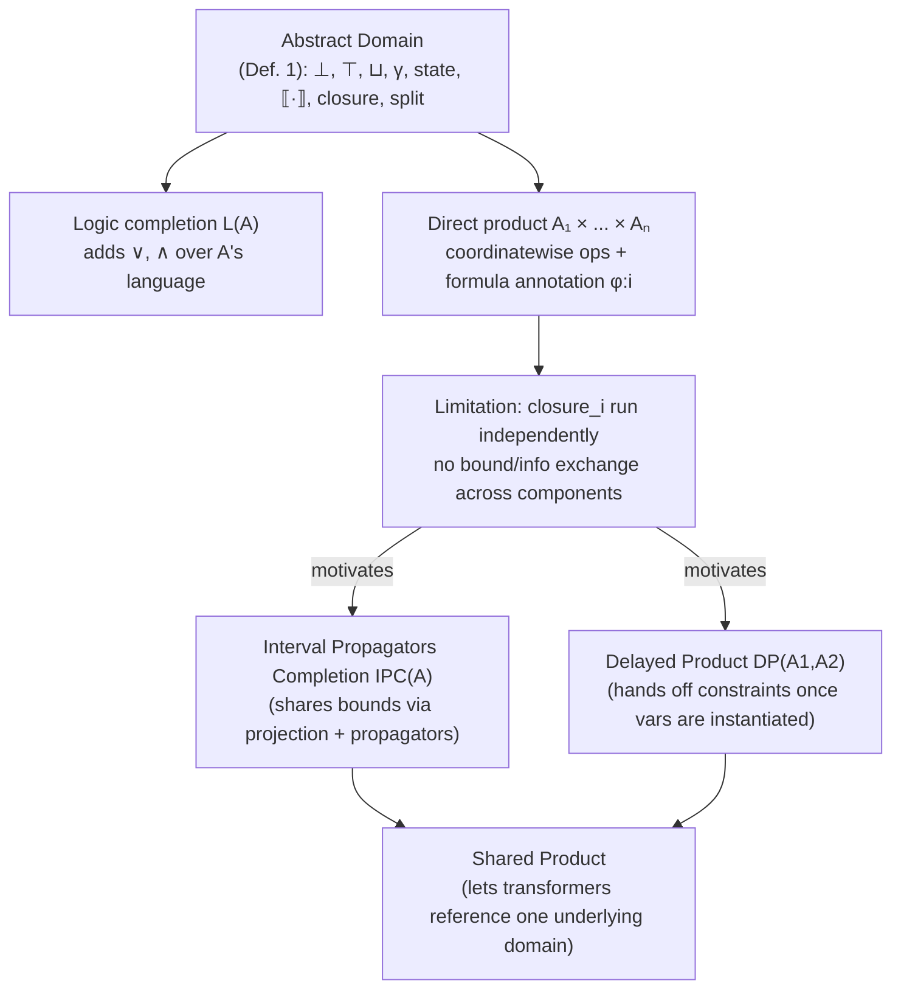

[[book-guidelines|↩ Back to guidelines]]

## Why you need something like this at all

Suppose you're building a constraint solver and you hit a formula like

$$c_2 \;\triangleq\; (x > 4 \land x < 7) \Rightarrow y + z \le 4$$

You have two abstract domains available: **boxes** ($B$, one interval per variable — cheap, but can only express constraints on a single variable at a time) and **octagons** ($O$, difference-bound matrices — can express $\pm x \pm y \le c$, more expressive, but $O(n^2)$ space and $O(n^3)$ closure). Neither domain alone can interpret $c_2$: boxes can't express the implication or the sum, and pushing everything into octagons wastes their expressive power (and their asymptotic cost) on the trivially interval-shaped part of the formula, $x > 4 \land x < 7$.

The obvious engineering move is: use both. Interpret the cheap part in boxes, the expressive part in octagons, and combine the two. But "combine" needs a precise meaning — you can't just bolt two solvers together and hope. The paper's answer is to make *combination itself* a first-class abstract domain, built systematically from existing ones. That's what a **domain transformer** is: a function that takes one or more abstract domains and produces a new abstract domain that reuses their machinery. It's the paper's device for making solver cooperation compositional instead of ad hoc.

If you've written a compiler, this is a familiar shape even before you look at the definition: a domain transformer is exactly a **generic type constructor parameterized by other types that must satisfy some interface** — a Rust `struct Wrapper<A: AbstractDomain>` or an ML functor `module Make(A : ABSTRACT_DOMAIN) : ABSTRACT_DOMAIN`. That's not an accident; AbSolute (the paper's OCaml solver) literally implements domain transformers as OCaml functors (Appendix A). The paper is doing at the mathematical level exactly what the implementation does at the module level — that correspondence is one of its selling points.

## What "abstract domain" means here, briefly

A domain transformer's job is to take something satisfying **Definition 1** (abstract domain for constraint programming) and produce something that *also* satisfies Definition 1. Definition 1 says an abstract domain is a lattice $\langle A, \le\rangle$ equipped with $\bot$, $\top$, join $\sqcup$, a concretization function $\gamma : A \to D^\flat$, a `state : A \to \mathbb{K}` function (Kleene logic: true / false / unknown), a partial interpretation function $\llbracket \cdot \rrbracket : \Phi \to A$, an extensive `closure : A \to A$ (eliminates inconsistent values, $\forall x.\, x \le \mathit{closure}(x)$), and a `split : A \to \mathcal{P}(A)$ (case-divides an element for search). This bundle is covered in depth in the "[[Abstract-Domains-For-Constraint-Programming|Abstract Domains for Constraint Programming]]" article; what matters for domain transformers is just that it's a *fixed interface* — a trait, in Rust terms:

```rust
trait AbstractDomain: Lattice {
    type Formula;   // Φ, the constraint language this domain accepts
    fn concretize(&self) -> ConcreteSet;         // γ
    fn state(&self) -> Kleene;                   // true / false / unknown
    fn interpret(f: &Self::Formula) -> Option<Self>; // ⟦·⟧, partial
    fn closure(self) -> Self;                    // extensive, x ≤ closure(x)
    fn split(self) -> Vec<Self>;
}
```

A domain transformer is then a generic wrapper that implements `AbstractDomain` *in terms of* one or more inner implementations of `AbstractDomain`, typically extending or restricting `Formula` along the way. This is the entire idea; everything below is a matter of which operations get delegated, combined, or extended.

## First domain transformer: logic completion

The plainest possible domain transformer doesn't combine domains at all — it extends a *single* domain's constraint language with logical connectives. Boxes and octagons, as defined, only interpret conjunctions of atomic constraints; a formula like

$$c_1 \;\triangleq\; (x = 1 \lor x = 2)$$

isn't interpretable in $B$ or $O$ directly (there's no disjunction in their `interpret` function). **Logic completion** $L(A)$ takes any abstract domain $A$ and produces $L(A)$, which supports disjunction (and other connectives) over $A$'s language:

$$L : A \longmapsto L(A) \qquad \text{now } c_1 \text{ is interpretable in } L(B) \text{ or } L(O)$$

What breaks without it: without $L(A)$, disjunctive information has nowhere to live except by exhaustively branching outside the abstract domain, before the domain machinery (closure, state) even gets to see the structure. With $L(A)$, `state(closure(⟦c_1⟧))` correctly comes back `unknown` — there's genuinely not enough information yet to decide $x=1$ vs $x=2$ — and this is precisely what triggers `split`: the generic `solve` algorithm case-splits into the two disjuncts and unions their solutions. Logic completion is what makes disjunction someone else's problem: $A$ still only has to know about its own atomic constraint language, and $L(A)$ layers case-analysis on top for free, reusing $A$'s `closure` and `state` unchanged. In Rust terms this is a wrapper enum:

```rust
enum LogicCompletion<A: AbstractDomain> {
    Atom(A),                                   // delegates straight to A
    Or(Box<LogicCompletion<A>>, Box<LogicCompletion<A>>),
    And(Box<LogicCompletion<A>>, Box<LogicCompletion<A>>),
}
```

`closure` and `state` recurse structurally and bottom out by delegating to the wrapped `A`; `split` is where `Or` actually gets resolved into separate branches for `solve` to explore.

## Combining domains: the direct product

Logic completion extends *one* domain's expressiveness. To actually route $c_2$'s two halves to two *different* domains, you need to combine domains side by side. That's **Definition 2, the direct product**:

$$A_1 \times \cdots \times A_n, \quad (a_1,\dots,a_n) \le (b_1,\dots,b_n) \iff \bigwedge_{1 \le i \le n} a_i \le_i b_i$$

Every operation of Definition 1 — $\bot$, $\top$, $\sqcup$, `state`, `closure`, `split` — is defined **coordinatewise**: apply the operation to each component independently and pair up the results. This is the same shape as `impl<A: Lattice, B: Lattice> Lattice for (A, B)` in Rust, or a Haskell `Monoid` instance for tuples that just delegates to each field's own instance — nothing about the components needs to change; the product just orchestrates them.

The one piece that isn't fully mechanical is *interpretation*: given $c_2$, which parts of the formula go into $B$'s slot and which into $O$'s slot? A naive direct product would try to interpret every constraint in every component that can accept it — for $x > 4 \land x < 7$, that's *both* $B$ and $O$, which duplicates work and, worse, gives no way to control which domain actually "owns" a given sub-formula. The paper's fix is **formula annotation**: tag a sub-formula with the index of the component it should go to, $\varphi{:}i$, formally

$$\llbracket \varphi{:}i \rrbracket \;\triangleq\; (\bot_1, \dots, \llbracket\varphi\rrbracket_i, \dots, \bot_n)$$

So $c_2$ becomes $(x>4 \land x<7){:}1 \Rightarrow (y+z\le4){:}2$ — box gets the interval constraint, octagon gets the sum — and $L(B \times O)$ (logic completion stacked on the product, needed here for the $\Rightarrow$) interprets the whole thing. A formula can even be annotated to more than one component if you deliberately want it duplicated.

## The limitation this sets up

Here's the "what breaks" moment that motivates the rest of the paper. In $L(B \times O)$, `closure` on the product runs `closure`$_1$ on the box component and `closure`$_2$ on the octagon component **independently** — coordinatewise, by construction. If $x$ appears in both a box constraint and an octagon constraint, propagating a new bound on $x$ inside the box does nothing to what the octagon knows about $x$, and vice versa. The two components are logically consistent (each interprets its own annotated sub-formula correctly) but operationally deaf to each other. For $c_2$ this happens not to matter much, but as soon as constraints that share variables are split across components — which is exactly the situation any real cooperation problem produces — the direct product leaves solving power on the table: information one domain derives never reaches a sibling domain that could use it to prune further.

This is precisely the gap the paper spends the rest of Chapter 3 closing:



Everything left of "Limitation" is this article's scope; everything right of it — IPC, the delayed product, and the shared product — are domain transformers too (the paper's own framing: "the abstract domain $a \in A$ can be a composition of several abstract domains through domain transformers"), but each is a separate, more surgical fix for exactly this cross-component information loss, and each gets its own article.

## Where this leads

Domain transformers are the load-bearing abstraction of the whole paper: once cooperation is "just" a domain transformer, IPC, the delayed product, and the shared product can all be stated as instances of the same interface rather than three unrelated engineering hacks — and AbSolute's OCaml functors (`Direct_product`, `Propagator_completion`, `Logic_completion`, `Shared_product`) implement that interface almost verbatim, which is why the case study (FJS1/FJS2) reads as *composing* a handful of these transformers rather than writing bespoke solver code.

For the standing project (`sat-smt-csp`, `static-analysis`): this is the generic-programming pattern your CSP kernel's abstract-domain layer should be built around — an `AbstractDomain` trait plus generic wrapper types (`Product<A,B>`, `LogicCompletion<A>`, and eventually something IPC-shaped) rather than a monolithic solver struct with hardcoded domain-specific branches. It's also a clean, code-facing instance of the **Galois-connection / abstract-lattice** thread from the standing learning goals: `closure` is the fixpoint operator, $\gamma$ is the concretization half of the connection, and the direct product's coordinatewise lattice structure is the textbook product-lattice construction — seeing it appear as literally an OCaml functor signature is a good anchor for that otherwise fairly abstract machinery. The specific gap flagged here (no cross-component information exchange) is exactly the prerequisite for understanding why IPC and the delayed product are shaped the way they are — read those next.
