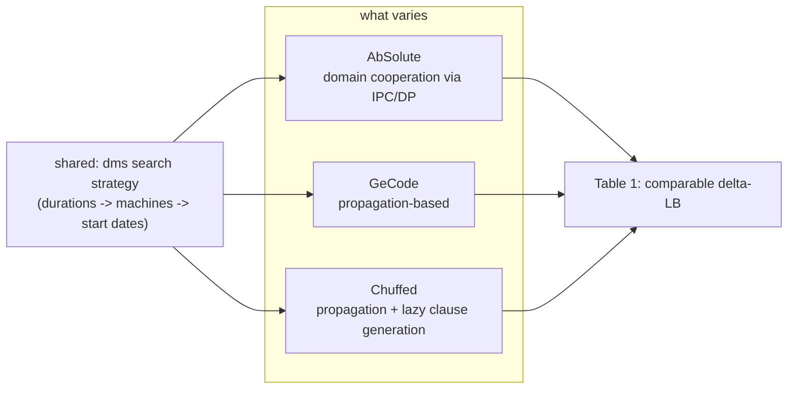

[[book-guidelines|↩ Back to guidelines]]

## Why this section exists at all

Everything up to this point in the paper — the abstract domain definition, IPC, the
delayed product, the shared product — is pure algebra: lattices, fixed points, soundness
lemmas. A skeptical reader is entitled to ask the obvious engineering question: does any
of this survive contact with a real solver, or is it the kind of "modularity" that looks
clean on paper and turns into spaghetti the moment you have to actually implement two
[[Domain-Transformers|domain transformers]] that share state?

This is exactly the gap this section closes, in two moves:

1. **Implementation** — it shows that the mathematical constructions (direct product,
   propagator completion, logic completion, shared product) map almost one-to-one onto
   OCaml *functors* in the AbSolute solver. Appendix A is the receipt: a few lines of
   module composition that build the entire `FJS1` abstract domain.
2. **Evaluation** — it shows that the resulting solver is not just theoretically elegant
   but *empirically competitive*, benchmarking AbSolute against two mature, unrelated
   solvers (GeCode, Chuffed) on a real NP-hard scheduling problem.

What breaks without this section: without it, the paper is a beautiful piece of domain
theory with zero evidence that "domain transformer" is a good abstraction for a *working*
solver rather than just a good abstraction for a proof. Cooperation schemes historically
get judged on whether they actually prune search trees faster — Nelson-Oppen and lazy
clause generation earned their place in SMT/CP folklore through benchmarks, not through
lattice theory. This section is where Talbot et al. pay that same toll.

## From functor algebra to OCaml modules

### The key design decision: theory-implementation fidelity

The paper states its implementation goal plainly: keep the solver "as close as possible
to its underlying theory." The mechanism for this is OCaml's **functor** system — a
functor is a module that takes other modules as parameters and returns a new module,
which is exactly what a domain transformer is mathematically: a function from abstract
domains to abstract domains, $A \mapsto T(A)$.

Concretely, `IPC`, `DP`, `Shared_product`, `Direct_product`, and `Logic_completion` from
earlier sections are not just notation — they are literally the names of OCaml functors
in AbSolute's source. Appendix A builds `FJS1` = $L(IPC(B \times O))$ from the paper's
Section 4 by composing them:

```ocaml
(* Leaves: the concrete abstract domains, each parametrized by its split strategy *)
module Box = Box_base(Box_split.First_fail_LB)(Bound_int)
module Octagon = Octagon.Make(ClosureHoistZ)(Octagon_split.MSLF)

(* Direct product B x O, then wrap in the interval propagators completion *)
module BoxOct = Direct_product(Prod_cons(Box)(Prod_atom(Octagon)))
module IPC = Propagator_completion(Box.Vardom)(BoxOct)

(* Add logical connectors, then merge everything under a shared product *)
module LC = Logic_completion(IPC)
module FJS = Shared_product(
  Prod_cons(BoxOct)(
  Prod_cons(IPC)(
  Prod_atom(LC))))
```

Two details are worth pulling out because they are easy to skim past:

- `Propagator_completion` takes an *extra* parameter beyond the domain it wraps: a
  **variable domain** (`Box.Vardom`, i.e. integers here). This is the numeric domain in
  which propagation is *evaluated*, which matters the moment component domains disagree
  — e.g. `IPC(B(ℤ) × B(ℝ))` would need propagation carried out over rationals, since
  rationals subsume both integers and floats. The completion functor absorbs that
  conversion so the propagators themselves never have to know which concrete numeric
  representation they're talking to.
- `Shared_product` is given `BoxOct`, `IPC`, and `LC` *together*, not `LC` alone — because
  `IPC` and `LC` both need read/write access to the same underlying `BoxOct` state, and
  the whole point of the shared product (previous section) was to avoid each transformer
  silently cloning that state into its own private copy.

**What breaks without functors specifically:** if AbSolute instead hard-coded, say, "box
domain + octagon domain + IPC" as one monolithic module, adding a *third* domain (say, a
Boolean domain for the flexible job shop's machine-alternative constraints) would mean
touching and re-verifying that monolith. With functors, it's a new leaf module plugged
into the same `Direct_product` / `Propagator_completion` composition — the mathematical
modularity of Chapter 3 becomes literal software modularity, at the cost of OCaml's
functor syntax being, frankly, uglier than the paper's $L(IPC(B \times O))$ notation.

### The Rust reading: traits and generic structs standing in for functors

Rust has no first-class functors, but the *pattern* — "a domain transformer is a generic
type parametrized by the domain(s) it wraps, and it must implement the same abstract
domain interface as its parameter(s)" — translates directly into a trait plus generic
structs. This is worth building out in full because it is the shape your own CSP kernel's
domain-transformer composition will need to take.

```rust
/// The abstract domain interface every leaf domain and every domain
/// transformer must implement — this is Definition 1 (bottom, top, join,
/// concretization is implicit/unrepresented at runtime, state, closure, split).
trait AbstractDomain: Sized {
    type Formula;

    fn bottom() -> Self;
    fn top() -> Self;
    fn join(&self, other: &Self) -> Self;
    fn state(&self) -> Kleene;                 // True | False | Unknown
    fn interpret(&mut self, phi: &Self::Formula);
    fn closure(&mut self);
    fn split(&self) -> Vec<Self>;
}

enum Kleene { True, False, Unknown }

/// Leaf domains
struct Box { /* variable -> interval map */ }
struct Octagon { /* difference-bound matrix */ }

impl AbstractDomain for Box   { /* ... */ }
impl AbstractDomain for Octagon { /* ... */ }

/// Direct_product as a generic struct: this *is* the functor.
/// It is parametrized by any two domains, and it implements AbstractDomain
/// itself — so it can be fed right back in as someone else's parameter.
struct DirectProduct<A: AbstractDomain, B: AbstractDomain> {
    left: A,
    right: B,
}

impl<A: AbstractDomain, B: AbstractDomain> AbstractDomain for DirectProduct<A, B> {
    type Formula = Annotated<A::Formula, B::Formula>; // phi:1 or phi:2 routing

    fn bottom() -> Self { DirectProduct { left: A::bottom(), right: B::bottom() } }
    fn top() -> Self { DirectProduct { left: A::top(), right: B::top() } }
    fn join(&self, other: &Self) -> Self {
        DirectProduct { left: self.left.join(&other.left), right: self.right.join(&other.right) }
    }
    fn state(&self) -> Kleene { /* combine self.left.state() and self.right.state() */ todo!() }
    fn interpret(&mut self, phi: &Self::Formula) { /* route phi:1 to left, phi:2 to right */ }
    fn closure(&mut self) { self.left.closure(); self.right.closure(); }
    fn split(&self) -> Vec<Self> { todo!() }
}

/// Propagator_completion, similarly: a generic wrapper that adds a Vec<Propagator>
/// and a variable-domain type parameter, exactly mirroring
/// `Propagator_completion(Box.Vardom)(BoxOct)` above.
struct PropagatorCompletion<VarDom, A: AbstractDomain> {
    inner: A,
    propagators: Vec<Box_dyn_propagator<VarDom>>,
}
```

The Rust version makes one thing explicit that OCaml's functor syntax leaves implicit:
`DirectProduct<A, B>` implementing `AbstractDomain` is what lets it be nested inside
another `DirectProduct`, or wrapped by `PropagatorCompletion`, or passed into
`SharedProduct` — the *closure property* of domain transformers (a transformer applied to
a domain yields another domain) is enforced by the trait bound at compile time, not just
asserted mathematically. If your CSP kernel builds its abstract-domain zoo this way, this
is the exact place a `SharedProduct<A, B, C>` generic struct earns its keep: it can hold
`Rc<RefCell<A>>`-style shared handles to the components that `IPC` and `LC` both need,
which is the Rust idiom for the "pointer-based implementation of sharing" the paper
mentions for the shared product.

Python and Lean are both a poor fit for this particular subsection — there's no
type-theoretic content here to ground in Lean (this is solver engineering, not judgment
forms or unification), and a Python sketch would just be a weaker version of the same
trait-composition idea without the compile-time guarantee that makes it interesting. Per
the "don't force it" rule: skipping them here is more honest than manufacturing a
strained example.

## Designing the experiment: controlling for search strategy

The evaluation compares three solvers — **AbSolute** (the paper's own, OCaml,
prototype-quality), **GeCode** (a mature, state-of-the-art propagation-based solver), and
**Chuffed** (a hybrid propagation/SAT solver using lazy clause generation) — on the
flexible job shop scheduling problem, using the `edata` and `rdata` instance sets from
Hurink et al. (1994).

The paper is careful about one confound that would otherwise make the whole comparison
meaningless: **search strategy**. A constraint solver's performance is the product of two
largely independent things — how good its *propagation* is (how tightly it prunes a given
node) and how good its *search* is (which variable/value it branches on next). If each
solver used its own default search heuristic, a win for AbSolute could just mean "AbSolute
happened to pick a luckier variable ordering," telling you nothing about whether domain
cooperation (the actual subject of the paper) helped.

Their fix: run all three solvers under the *same* strategy, called **dms**
(domain-min-size / first-fail) — assign each variable's domain to its lower bound, and
branch on the variable with the smallest remaining domain first, in a fixed order:
durations, then machine assignments, then start dates.



**What breaks without this control:** any performance difference could be attributed to
either propagation quality or search luck, and the paper would have no way to isolate
which one its actual contribution (cooperation) was responsible for. Fixing the search
strategy is what turns "AbSolute did well" into "AbSolute's *propagation cooperation*
did well" — the only claim the paper is actually entitled to make.

## Reading the $\Delta LB$ results

The metric is $\Delta LB$: the percentage gap between the bound a solver actually found
within a 10-minute budget and the best known lower bound for that instance. Lower is
better — $0\%$ means the solver matched (or beat) the best known bound.

Average $\Delta LB$ by solver and instance set:

| Solver  | edata $\Delta LB$ (%) | rdata $\Delta LB$ (%) |
|---------|------------------------|------------------------|
| FJS1    | 20.4                   | 46.4                   |
| FJS2    | 20.4                   | 46.4                   |
| GeCode  | 20.9                   | 31.7                   |
| Chuffed | 12.2                   | 24.2                   |

Beyond the averages, the paper reports pairwise counts of "strictly better bound found":
on `edata`, AbSolute (FJS1/FJS2) finds **36** bounds strictly better than GeCode's and
**23** strictly better than Chuffed's, out of the benchmark set; Chuffed in turn finds
**66** bounds strictly better than GeCode's — the number the paper singles out as its
running example of how to read the table.

Two distinct findings fall out of this, and they point in opposite directions:

1. **On `edata`, AbSolute is competitive with — and by the pairwise count, sometimes beats
   — GeCode**, despite being "only a prototype." The paper reads this as direct evidence
   that domain cooperation (IPC exchanging bounds between box and octagon components)
   buys real propagation strength, not just theoretical elegance.
2. **On `rdata`, AbSolute's $\Delta LB$ degrades sharply** relative to both competitors
   (46.4% vs. 31.7% / 24.2%). The instance sets differ in exactly one structural way:
   `rdata` gives each task many candidate machines, `edata` gives it few. GeCode and
   Chuffed both handle "which machine runs this task" with a dedicated **cumulative
   global constraint** — a specialized propagator engineered specifically for
   resource-allocation reasoning. AbSolute has no equivalent; it represents machine choice
   through its general-purpose domains (boxes/octagons/logic completion) instead. The
   gap on `rdata` is therefore not a verdict on domain cooperation as an idea — it's the
   cost of *not yet having* a specialized global constraint, an orthogonal engineering
   gap the paper is honest about rather than obscuring.

## FJS1 vs. FJS2: why dynamic dispatch barely helps under `dms`

Recall from the case-study chapter: FJS1 statically routes each constraint to a fixed
domain component; FJS2 uses the delayed product ($PREC = DP(IPC(B \times O), O)$) to
*dynamically* move precedence constraints into the octagon domain once task durations
become instantiated during search — this is the delayed product's whole reason for
existing, avoiding the cost of interpreting a constraint in an expensive domain before
it's actually necessary.

You'd expect FJS2's smarter, adaptive dispatch to outperform FJS1's fixed one. The
results are almost a null result: FJS2 finds only a "few better bounds" than FJS1 by the
$\Delta LB$ metric — practically tied in the table above. The explanation is a genuine
gotcha about the interaction between a *cooperation mechanism* and a *search strategy*:
`dms` fixes all duration variables at the very top of the search tree, before machine or
start-date variables are touched at all. But duration instantiation is exactly the
trigger condition the delayed product is waiting for (`fix(a, x)` in the earlier
formalism) — so under `dms`, the over-approximated early transfer the delayed product
provides fires almost immediately, near the root, and from then on FJS1 and FJS2 are
propagating essentially the same information at almost every subsequent node. The
delayed product's adaptivity has nowhere left to matter because the search strategy
already collapsed the "before instantiation" window to almost nothing.

This is not a wash, though: measured by **search-tree size** rather than $\Delta LB$,
FJS2 reaches its best bound with roughly 20% fewer nodes than FJS1 on about 90% of
instances. So the cooperation mechanism *is* doing real pruning work — it's just that
`dms`'s particular variable ordering hides most of that win when you only look at
solution quality within a fixed time budget. This is the paper's central empirical
lesson about cooperation granularity: **a cooperation scheme's payoff is conditional on
the search strategy it's paired with**, not an absolute property of the scheme itself. A
looser search order (one that doesn't front-load all duration decisions) would very
plausibly show a larger FJS1/FJS2 gap — the paper doesn't test this, but the node-count
result is exactly the kind of clue that motivates its own future-work item on
customizable search strategies (spacetime programming).

## Where this leads

This section is where the paper cashes out its central methodological bet: that
formulating solver cooperation as abstract-domain composition is not just mathematically
convenient but *implementable with the modularity it promises* (Appendix A) and
*empirically defensible* against solvers that were never designed with this framework in
mind (Table 1). For the `sat-smt-csp` focus area specifically, this is the paper's most
directly transferable material to your planned Rust CSP kernel:

- The functor-to-trait translation above is close to a template for how your kernel's
  own domain transformers (interval propagation, disjoint-domain products, whatever
  plays the delayed-product role between an octagon-style numeric domain and an
  automaton/DFA-based domain for abstract data structures) should be structured in Rust
  — generic structs bounded by a shared `AbstractDomain`-style trait, so composition is
  checked at compile time the way OCaml's functors check it at the module-signature
  level.
- The evaluation methodology — fix the search strategy across systems under comparison,
  report both a bound-quality metric ($\Delta LB$) and a search-effort metric (node
  count), and be explicit about which structural feature of an instance set explains a
  gap (machines-per-task, here) — is a directly reusable template for benchmarking your
  own kernel's over-approximating (bug-absence) analyses against dedicated
  counterexample search (bug-presence), the two solving modes your project's design
  explicitly wants to combine.
- The `dms`/delayed-product interaction is a concrete cautionary example for anything in
  your kernel that pairs a lazy/incremental domain-transfer mechanism with a fixed
  variable/branching order: check whether the branching order accidentally saturates the
  transfer condition near the root, because if it does, the mechanism's benefit will be
  invisible in bound-quality metrics even while still measurably reducing search size.
