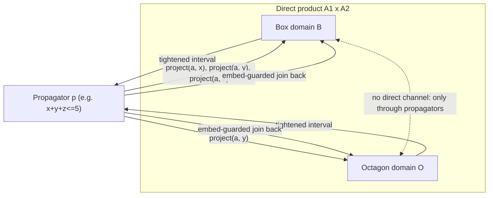

[[book-guidelines|↩ Back to guidelines]]

## The problem the direct product can't solve

By the end of Chapter 2, the paper already has a way to combine two abstract domains: the **direct product** $A_1 \times \dots \times A_n$, which runs each domain side by side and lets you route a sub-formula to whichever component understands it, using an annotation like $\varphi{:}i$. If $\varphi$ is `x > 4 ∧ x < 7`, you send it to boxes; if it's `y + z ≤ 4`, you send it to octagons. Each component gets closed independently, and the results just sit next to each other in the tuple.

That works as long as every constraint fits neatly into exactly one component's vocabulary. It breaks the moment a constraint doesn't:

$$c_3 \;\triangleq\; x > 1 \;\wedge\; x + y + z \leq 5 \;\wedge\; y - z \leq 3$$

`x > 1` is a box constraint. `y - z ≤ 3` is an octagon constraint (a difference-bound constraint, of the shape $\pm x \pm y \le c$). But `x + y + z ≤ 5` is a three-variable linear inequality — it isn't expressible in *either* domain's constraint language on its own, and worse, it shares the variable `x` with the box constraint and `y`, `z` with the octagon one. The direct product has no mechanism for one component to tell another "I just learned something new about `x`" — closure runs independently in each coordinate, so information never crosses the product's internal walls.

**What breaks without a fix:** if you can't interpret `x + y + z ≤ 5` at all, you either reject the whole formula as unsupported, or you're forced to build one specialized, do-everything abstract domain that natively understands linear arithmetic over all three variables at once — throwing away the whole point of having small, composable domains like boxes and octagons in the first place. You'd be back to monolithic solvers, exactly what this paper is trying to avoid.

The **interval propagators completion**, $IPC(A)$, is the paper's answer: a domain transformer that extends *any* abstract domain $A$'s constraint language to arbitrary arithmetic constraints, by giving components a narrow, disciplined channel through which to exchange exactly one kind of information — bounds on shared variables.

## Two new primitives, before the formal definition

IPC needs two capabilities that boxes and octagons alone don't provide: a way to *read out* a variable's current bound as a plain interval (independent of which domain holds it), and a way to *write* new arithmetic constraints as reusable, composable functions rather than one-shot formula interpretations. These are `project` and *propagators*.

### Projection: a lingua franca for bounds

```
project : (A × V) → I
```

`project(a, x)` asks "no matter what internal representation `a` uses, what's the best interval I currently know for variable `x`?" It must be a sound **over-approximation**: every value `x` could actually take in $\gamma_A(a)$ has to lie inside the returned interval, i.e. $v \in \gamma_I(\text{project}(a, x))$ for every solution value $v$. It's allowed to be loose (that's what over-approximation means) but never wrong in the sense of excluding a real solution.

This is easy for boxes (the interval *is* the representation) and for octagons (derive $[x_\ell, x_u]$ from the two rows $x - x \le 2c$, or more precisely from the unary bounds already tracked in the DBM), harder for something like polyhedra where an interval has to be extracted from a shape that wasn't stored as one. On a direct product, projection is defined the only sensible way — take each component's own projection and join them:

$$\text{project}((a_1,\dots,a_n), x) = \text{project}_1(a_1,x) \sqcup \dots \sqcup \text{project}_n(a_n,x)$$

with $\text{project}_i(a_i,x) = \bot$ if `x` doesn't even appear in that component. This single function is what lets an octagon and a box "talk" — neither has to know the other's internal representation; they only ever exchange intervals.

**What this is, in words, before the notation lands again below:** `project` is a *read port* — a way to get a variable's current known range out of an abstract element without caring which domain produced it.

### Propagators: constraints as extensive, sound functions

A **propagator** on $A$ is a function $p : A \to A$ implementing inference for *one specific constraint*, with two required properties:

- **Extensive:** $a \le p(a)$ — applying it never loses information, it only ever tightens (or leaves unchanged) the abstract element.
- **Sound:** $\gamma(p(a)) \supseteq \llbracket \varphi \rrbracket^\flat$ — it never removes an actual solution of the constraint $\varphi$ it implements.

The closure operator you already know from Chapter 2 is itself just a special case of a propagator — the difference is that a propagator handles a single constraint, while an abstract domain's `closure` is expected to enforce its *entire* constraint language at once.

Here's the worked example the paper builds around, a propagator for $x \ge y$, defined generically over any abstract domain $A$ that has a projection function:

$$\llbracket x \ge y \rrbracket = p_{\ge} = \lambda a.\, a \sqcup_A \llbracket x \ge y_\ell \rrbracket_A \sqcup_A \llbracket y \le x_u \rrbracket_A$$

where $\text{project}(a,x) = [x_\ell..x_u]$ and $\text{project}(a,y) = [y_\ell..y_u]$. Read it in words: "take the current lower bound of `y` and push it onto `x` as a new lower bound; take the current upper bound of `x` and push it onto `y` as a new upper bound; join both updates into `a`." Concretely, if `project(a,x) = [1..2]` and `project(a,y) = [2..3]`, applying $p_\ge$ tightens both to `[2..2]` — the propagator discovered that `x ≥ y` combined with the existing bounds forces both variables to be exactly 2.

**The subtlety `embed` exists to fix:** in constraint $c_3$, we don't want a propagator for `x + y + z ≤ 5` to spuriously *introduce* variable `x` into the octagon domain, which only ever tracked `y` and `z`. If you apply $p_\ge$-style joins naively on a direct product, the join operation for the octagon component would happily create a fresh, unconstrained entry for `x` just because a formula mentioning `x` got routed there — polluting a domain with variables it has no real business tracking (and paying complexity cost for it later). The fix is a guarded join:

$$\text{embed}(a_1, a_2) = \begin{cases} a_1 \sqcup a_2 & \text{if } \text{vars}(a_2) \subseteq \text{vars}(a_1) \\ a_1 & \text{otherwise} \end{cases}$$

— only merge in new information if the variables involved are already ones the target component tracks. Applied coordinatewise across the product, this gives the corrected propagator:

$$\llbracket x \ge y \rrbracket = p_{\ge} = \lambda a.\, \text{embed}_A(a, \llbracket x \ge y_\ell \rrbracket_A) \sqcup_A \text{embed}_A(a, \llbracket y \le x_u \rrbracket_A)$$

Every propagator also carries a `state` function (true/false/unknown, exactly like an abstract domain's own `state`), so "is `a` a solution of propagator `p`" is well defined.

## Putting it together: the IPC lattice

Collect all sound, extensive propagators into $Pr = \langle \mathcal{P}(Prop), \subseteq \rangle$ — a powerset lattice ordered by set inclusion, where "bigger" means "more propagators active." Then:

$$IPC(A) = \langle A \times Pr, \le \rangle$$

with operations defined component-wise but with one crucial twist in `closure`:

- $(a, P) \le (a', P') \iff a \le_A a' \wedge P \subseteq P'$
- $(a, P) \sqcup (a', P') \triangleq (a \sqcup_A a', P \cup P')$
- $\text{state}((a,P)) \triangleq \text{state}_A(a) \wedge \bigwedge_{p \in P} \text{state}_p(a)$ — a solution for the whole pair only when it's a solution for `A` *and* for every active propagator
- $\gamma((a,P)) \triangleq \bigcup \{\gamma_A(a') \mid a' \ge_A a \wedge \text{state}((a',P)) = \text{true}\}$
- $\llbracket c \rrbracket$ associates a raw constraint `c` to its propagator $p_c$ (e.g. via the generic HC4 propagation algorithm, which works over arbitrary arithmetic constraints without needing a bespoke abstract domain per constraint shape)
- $\text{split}((a,P)) \triangleq \{(a', P) \mid a' \in \text{split}_A(a)\}$ — splitting only ever touches the underlying domain, never the propagator set
- **`closure`, the interesting one:**

$$\text{closure}((a, \{p_1,\dots,p_n\})) \triangleq \big(\text{fp}(p_1 \circ \dots \circ p_n)(a),\; \{p_1,\dots,p_n\}\big)$$

This is the actual propagation loop: repeatedly apply every active propagator, in sequence, until reaching a fixed point (`fp`) — a state where no propagator can tighten anything further. Because propagators are extensive, this fixed point is guaranteed to exist and the process terminates on any domain with finite descending chains; the paper notes it doesn't need to be the *least* fixed point, since that has no bearing on whether the outer `solve` algorithm (closure-then-split) itself terminates.

This is genuinely the mechanism that solves $c_3$: `x > 1` and `y - z ≤ 3` interpret directly into boxes and octagons as before, and `x + y + z ≤ 5` becomes a propagator that reads bounds from both components via `project`, tightens them, and writes the tightened bounds back via `embed`-guarded joins — all without boxes or octagons needing to know the propagator, or each other, exist.

### Soundness: Lemma 3

> **Lemma 3.** Let $A_1, A_2$ be abstract domains, $\varphi$ a formula. If $A_1$ and $A_2$ over-approximate $\llbracket \varphi \rrbracket^\flat$, then $IPC(A_1 \times A_2)$ also over-approximates $\llbracket \varphi \rrbracket^\flat$.

The proof is short and worth internalizing because the *pattern* — "only over-approximations flow through the channel, so the channel can't introduce unsoundness" — recurs constantly in abstract interpretation: `project` on domain $i$ yields an over-approximated interval; that interval gets re-interpreted into the *other* domain $\bar\imath$ as a pair of bound constraints ($v \ge l \wedge v \le u$), and interpreting a formula into an abstract domain is over-approximating by construction (Chapter 2's Definition 1). Compose two over-approximations and you still have an over-approximation — no solution is ever lost in the exchange, only extra (spurious) ones potentially kept, which is exactly the safe direction for a solver whose closure step must never discard a real answer.

## Grounding it

**Rust.** The propagator abstraction maps almost verbatim onto a trait, and `IPC<A>` onto a generic wrapper — this is close to how you'd actually structure a constraint-propagation kernel in a Rust CSP engine:

```rust
trait Projectable {
    fn project(&self, x: VarId) -> Interval;
}

// A propagator is an extensive, sound endofunction on the domain.
trait Propagator<A: Projectable + Lattice> {
    fn apply(&self, a: &A) -> A;      // must satisfy a <= apply(a)
    fn state(&self, a: &A) -> Kleene; // true / false / unknown
}

struct Ipc<A: Projectable + Lattice> {
    domain: A,
    propagators: Vec<Box<dyn Propagator<A>>>,
}

impl<A: Projectable + Lattice + Clone + PartialEq> Ipc<A> {
    fn closure(&mut self) {
        loop {
            let before = self.domain.clone();
            for p in &self.propagators {
                self.domain = p.apply(&self.domain);
            }
            if self.domain == before { break; } // reached the fixed point
        }
    }
}
```

The `embed` guard is the one piece that doesn't fall out of a naive translation — it has to be implemented explicitly as a check on `vars(a2).is_subset_of(vars(a1))` before any join that a propagator performs on a product component, otherwise a Rust implementation would silently reproduce the "spurious variable" bug the paper calls out. This is a good example of a soundness-relevant invariant that the type system alone won't enforce for you — it has to be a runtime check inside the join, exactly as the paper phrases it as a *definition*, not a derived property.

**Lean.** Lemma 3's proof is a good target for making the "composition of over-approximations is an over-approximation" pattern fully formal, since it's really a two-line transitivity argument over $\supseteq$:

```lean
-- γ over-approximates ⟦φ⟧♭ for an abstract domain A when γ A a ⊇ ⟦φ⟧♭
-- Lemma 3, sketched: over-approximation is preserved through IPC's bound exchange.
theorem ipc_sound {A₁ A₂ : Type*} [AbstractDomain A₁] [AbstractDomain A₂]
    (φ : Formula) (h₁ : OverApprox A₁ φ) (h₂ : OverApprox A₂ φ) :
    OverApprox (IPC (A₁ × A₂)) φ := by
  -- project i yields an over-approximated interval (by definition of project)
  -- re-interpreting that interval into ī's bound constraints is itself
  -- an over-approximating interpretation (Definition 1) — compose and done.
  sorry
```

The `sorry` stands in for exactly the kind of proof obligation your compiler's abstract-interpretation passes will need to discharge for *every* domain-transformer you compose — this is the miniature version of "soundness of the analysis is preserved under composition of abstract domains," which is the load-bearing property for trusting any invariant your Hoare-contract generator emits.

**Python**, for a five-line sketch of what `project` + a single propagator loop looks like operationally, no domain machinery required:

```python
def propagate_sum_leq(bounds, vars_, k):
    # x + y + z <= k: tighten each var's upper bound given the others' lower bounds
    for i, v in enumerate(vars_):
        others_lo = sum(bounds[u][0] for u in vars_ if u != v)
        bounds[v] = (bounds[v][0], min(bounds[v][1], k - others_lo))
    return bounds
```

## Structural summary



The box and octagon components never reference each other directly — every exchange is mediated by a propagator reading and writing intervals through `project`/`embed`. That's the whole trick: cooperation without coupling.

## Where this leads

IPC only exchanges *bound* information — it can't hand a fully-formed, specialized constraint from one domain to another, only "here's a tighter interval." Section 3.2's **delayed product** picks up exactly that limitation: once a variable becomes fully instantiated (or even just tightly bounded), it lets a constraint be *rewritten* and transferred wholesale into a more specialized domain, which is a strictly richer form of cooperation than bound-sharing alone. Section 3.3's **shared product** then addresses a different problem that arises once you start composing transformers like IPC with each other — preventing two transformers from silently duplicating (and desynchronizing) the same underlying domain.

For the compiler/elaborator project, IPC is the cleanest worked example in this paper of a **soundness-preserving composition mechanism for abstract domains** — the same shape of argument (bound information is over-approximated at the source, re-interpreted soundly at the destination, so no solution is ever lost) is exactly what has to hold when your abstract interpreter's invariant-generation pass combines multiple abstract domains to discharge a Hoare-contract or Horn-clause obligation (`static-analysis`). It's also a concrete instance of *constraint propagation as fixpoint computation*, the same operational pattern that a CSP kernel's constraint-store propagation loop will need for integer/non-linear domain narrowing when searching for counterexamples (`sat-smt-csp`).
