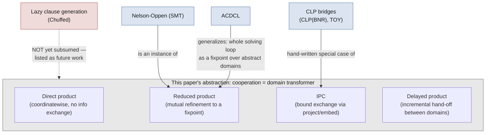

[[book-guidelines|↩ Back to guidelines]]

## Why the paper needs a "related works" section at all

By the time you've read the framework's core machinery — abstract domains, the direct product, IPC, the delayed product, the shared product — you might reasonably ask: haven't people combined solvers before? Of course they have. SMT solvers combine theories every day; CLP languages have combined uninterpreted functions with arithmetic since the 1990s; lazy clause generation is the reigning champion on many scheduling benchmarks the paper itself is being tested against. So the paper owes you an answer to a sharper question than "has this been done before" — it's "what, specifically, is different about doing it *as abstract domain combination* rather than in the native machinery of SMT, CLP, or SAT-based hybrids?"

This is the paper's own framing, stated bluntly in its introduction: existing schemes tend to **hard-wire the cooperation strategy into the solver's theory or language design**. If you want a new combination in SMT, you need a new instance of Nelson-Oppen's premises (theories must be stably-infinite, signature-disjoint, etc.) baked into the solver's core loop. If you want a new bridge in a CLP language, you typically need to extend the language itself. The claim under test in this section is that recasting cooperation as *[[Domain-Transformers|domain transformers]]* — ordinary first-class objects in a lattice-theoretic framework — lets you add a cooperation scheme the same way you'd add a new abstract domain: by writing a functor, not by redesigning a solver's internals.

What follows works through each of the frameworks the paper name-checks, translates its own vocabulary into theirs, and is honest about where the correspondence is exact versus merely suggestive.

## Nelson-Oppen and SMT: cooperation as a *reduced* product

**What SMT actually does.** An SMT solver reasons about a formula whose atoms live in different background theories — say, linear arithmetic and uninterpreted functions. The Nelson-Oppen procedure (1979) is the classical way to combine decision procedures for those theories: variables shared between theory atoms get equated or split via case analysis, and each theory-specific decision procedure propagates the consequences back and forth until a fixed point (no new equalities discovered) is reached.

**Why the paper calls it a "reduced product."** In the paper's own vocabulary, you already have a name for "combine several abstract domains into one, coordinatewise": the **direct product** $A_1 \times \dots \times A_n$ from Chapter 2, whose operators — join, closure, and so on — are applied to each component independently and never talk to each other. The paper is explicit about the direct product's weakness: as soon as two components share a variable, the interval that one domain knows about that variable is *not* propagated to the other. Boxes and octagons stacked as $B \times O$ will each close independently and never learn from each other's bound tightenings.

A **reduced product**, a standard construction in abstract interpretation (Cousot & Cousot's own vocabulary, cited here via Cousot et al. 2012), is what you get when you *don't* stop at coordinatewise independence — you additionally require the combined element to be reduced to the most precise representation compatible with what each component alone would allow. Concretely: after each component computes its own closure, you use what one component learned to further constrain the others, and iterate. That's exactly what Nelson-Oppen's equality propagation is doing at the theory level — an equality derived in the arithmetic theory becomes new information injected into the uninterpreted-function theory's congruence closure, and vice versa, until nothing new can be inferred.

So the paper's claim (attributed to Cousot et al. 2012, not original to this paper) is: **Nelson-Oppen combination is exactly a reduced product instantiated on decision-procedure abstract domains.** This is a genuinely illuminating reframing — it says SMT's celebrated cooperation mechanism is not sui generis machinery invented for satisfiability solving, but a special case of a general lattice-theoretic operation that abstract interpretation already had a name for.

**Where this leaves IPC and the delayed product.** This is also the paper's implicit pitch for why *its own* domain transformers matter: IPC and the delayed product are *different* points in the same design space as the reduced product, tuned for different needs (bound-only exchange for IPC; asymmetric, incremental transfer for DP), and — crucially — both are defined as reusable functors rather than as a fixed procedure wired into one specific class of theories the way Nelson-Oppen is wired into SMT.

> **What breaks without this reframing:** if cooperation is Nelson-Oppen-shaped by definition, you inherit its preconditions — theories must be stably infinite, and their signatures must be disjoint, for the classical correctness proof to apply. Constraint programming domains like boxes and octagons don't naturally come with "signatures" in the first-order-logic sense, and enforcing signature-disjointness would be an awkward straitjacket on a framework meant to combine numeric, propagator-based, and scheduling-specific domains freely. Treating cooperation as *any* domain-transformer construction — reduced product being just one instance — sidesteps the need to check those SMT-specific side conditions at all.

## ACDCL: cooperation as a fixpoint computation, made operational

Abstract Conflict-Driven Clause Learning (ACDCL, D'Silva et al. 2014) pushes the Nelson-Oppen-as-abstract-interpretation observation one step further: it recasts an entire CDCL-style SMT solving loop — decision, propagation, conflict detection, clause learning, backjumping — as a fixpoint computation over an abstract domain. Where Nelson-Oppen-as-reduced-product explains *theory combination*, ACDCL tries to explain the *whole solving algorithm*, including the parts (learning, backjumping) that look like search control rather than semantic combination.

The paper's assessment of ACDCL is short but pointed: it demonstrates that the correspondence goes deep — SMT solving really can be given a uniform abstract-interpretation semantics — but it flags ACDCL as "mostly a theoretical proposal," not "thoroughly investigated in practice." This is not a dismissal; it's the paper positioning itself in the gap ACDCL leaves open. ACDCL shows the theory is unifiable; this paper's own project (Sections 2–4) shows a *different* piece of that same unification — cooperation *schemes*, not conflict learning — worked out to the point of an actual competitive implementation (AbSolute) benchmarked against real solvers (GeCode, Chuffed).

That gap is exactly why ACDCL resurfaces in the Conclusion as the paper's *first* named item of future work: "catch up with ACDCL by incorporating conflict learning in AbSolute, which is crucial for efficiency as notably demonstrated by lazy clause generation in Chuffed." In other words — the paper's own framework currently covers cooperation (which domain talks to which) but not learning (recording *why* a branch failed so you never re-derive the same failure), and the authors already know, by pointing at Chuffed's lazy clause generation, that this is a real efficiency gap and not a hypothetical one.

## CLP bridges: the same idea, one abstraction level lower

Constraint Logic Programming (CLP) has been combining solvers since before SMT existed, in a more ad hoc but historically important way. The paper singles out two examples:

- **CLP(BNR)** (Older, 1993) mixes continuous and discrete domains — the "BNR" domains handle both real-interval and integer-interval reasoning within one constraint language.
- **T\liOY** (Estévez-Martín et al., 2009) is a functional CLP language explicitly built around solver cooperation among the Herbrand universe (uninterpreted functions — the term structure a logic program's unification builds), arithmetic over the reals, and finite domains. T OY's mechanism for this is the **bridge**: a syntactic construct like $X \mathrel{\#{=}{=}_{\mathit{int},\mathit{real}}} Y$, asserting that integer variable $X$ and real variable $Y$ denote the same value across two different domains' representations.

The paper's read on this: **IPC is a generic bridge.** A bridge in T OY is a special-purpose piece of syntax connecting exactly two named domains (integers and reals) via one hand-written equality relation. IPC, in contrast, is a domain transformer — it doesn't know or care which concrete abstract domains it's wrapping; give it any product of domains that support the `project`/`embed` interface (Section 3.1's propagator machinery) and it automatically produces a mechanism for those domains to exchange bound information over shared variables. The relationship is the same "hand-written special case vs. generic reusable mechanism" contrast that shows up between the direct product and Nelson-Oppen above, just at the CLP layer instead of the SMT layer.

The paper is also candid about CLP's structural downside: **"the addition of a new constraint system or combination often corresponds to the design of a new language."** A bridge like T OY's is baked into the language's syntax and semantics — extending it means extending the interpreter itself. A domain transformer, by contrast, is a library-level construction: adding IPC over a new pair of domains means writing (or reusing) a functor application, not touching a language's grammar or evaluator. This is the clearest place where the paper's "modularity" claim becomes concrete rather than aspirational.

## Lazy clause generation: hybrid cooperation the paper doesn't yet subsume

Lazy clause generation (Ohrimenko, Stuckey & Codish, 2009) is mentioned twice — once in the introduction's opening survey, once again in the conclusion — and both times it is treated as a *benchmark to beat*, not (yet) a target for reformulation as a domain transformer.

Mechanically: lazy clause generation runs a propagation-based constraint solver (the kind that maintains variable domains and tightens them via propagators, exactly like the `solve` algorithm of Chapter 2) but *simultaneously* explains every propagation step as a clause and feeds those clauses to an underlying SAT solver's clause-learning machinery. When the SAT solver detects a conflict, it learns a clause and can backjump — a form of non-chronological backtracking that a plain propagate-and-search loop (closure, then split, then recurse) doesn't have access to. Chuffed, the solver the paper explicitly benchmarks against in Section 4, implements exactly this scheme, and it is "currently ... the state of the art solver for many scheduling problems" per the paper's own introduction.

The honest scoreboard here: the paper's framework, as presented, produces cooperation schemes (IPC, DP, shared product) that determine *which abstract domain handles which constraint and how information flows between domains* — but it has no analogue of clause learning, i.e. no mechanism for recording *why* a particular combination of decisions was infeasible so that an equivalent conflict is never re-explored. That's precisely the capability lazy clause generation buys Chuffed, and precisely why the paper lists "catch up with ACDCL... crucial for efficiency as notably demonstrated by lazy clause generation in Chuffed" as future work item #1, immediately after summarizing its contributions in the Conclusion.

## Putting the four side by side

The pattern across the first three: each existing framework turns out to be an *instance* of a general lattice-theoretic construction the paper's own vocabulary already had a name for — reduced product, or a special case of IPC. The fourth, lazy clause generation, is the honest exception: it names a real capability (conflict-driven learning) that doesn't yet have a domain-transformer analogue in this framework, and the paper says so plainly rather than forcing a strained correspondence.

## Where this leads

Structurally, this section is a *proof of relevance* for the rest of the paper — it earns the right to introduce IPC, the delayed product, and the shared product as genuinely new by first showing that the alternatives either (a) turn out to be special cases the new framework generalizes (Nelson-Oppen, CLP bridges), or (b) are theoretically compatible but practically undeveloped (ACDCL), or (c) name a real capability the paper doesn't yet have (lazy clause generation), which becomes the paper's own admitted next step.

For the `sat-smt-csp` and `automated-reasoning` threads this book feeds: the Nelson-Oppen-as-reduced-product result is the cleanest bridge in the whole paper between constraint-programming-style abstract domains and SMT-style theory combination — if your compiler's CSP kernel and its SMT-adjacent verification-condition discharge ever need to share variables across an arithmetic domain and an uninterpreted-function domain, this is the exact mechanism (reduced product, not direct product) that makes that sharing sound rather than merely juxtaposed. And the lazy-clause-generation gap is a concrete reminder that "abstract domain combination" and "conflict-driven learning" are two genuinely separate capabilities — a CSP kernel built purely as domain transformers, however cleanly composed, still needs a CDCL-style learning layer on top if it is to compete with state-of-the-art propagation solvers on hard search problems, exactly as this paper's own authors conclude about their own system.
